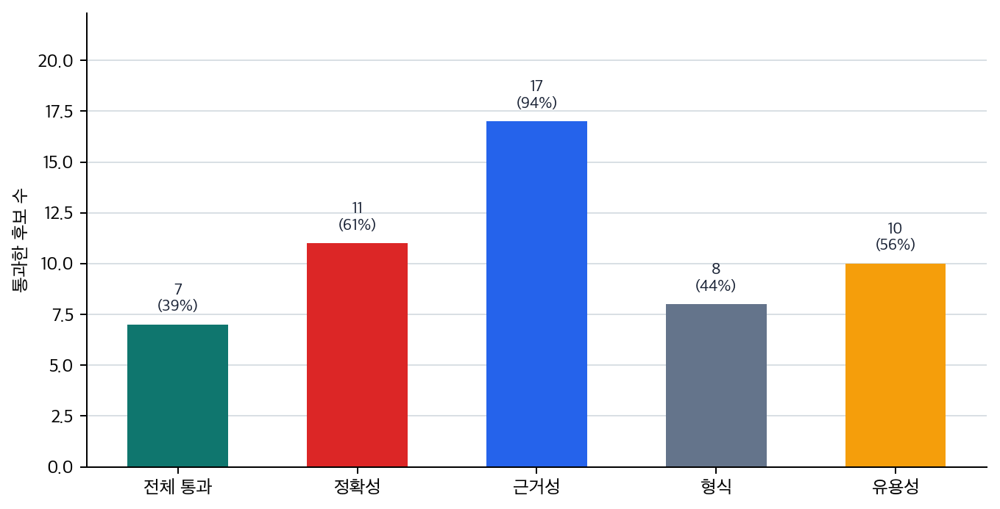

# P6-16.1 자연스러운 답과 품질 기준을 나누는 LLM 평가

> Section ID: `P6-16.1`
> Version: `v2026.07.23`

하네스(harness)가 trace, tool call log, replay 같은 실행 기록을 남겨도 그 기록만으로 품질이 보장되지는 않습니다. LLM 기반 시스템에는 `무엇을 통과로 볼 것인가`, `어느 축에서 먼저 탈락했는가`, `무엇을 고쳐야 다시 시도할 수 있는가`를 가르는 평가(evaluation) 기준이 필요합니다.

LLM 평가(evaluation)는 답변이 그럴듯한지만 보는 일이 아니라, 정확성, 유용성, 안전성, 근거성, 실행 결과를 기준에 따라 점검하는 일입니다. 즉, 답이 좋아 보이는지 묻는 일이 아니라 무엇이 좋고 무엇이 아직 위험한지를 항목별로 확인하는 일에 가깝습니다.

## LLM 답변을 나눠 평가하는 축

핵심 질문은 다음과 같습니다.

- LLM 평가는 왜 어려운가?
- 무엇을 평가해야 하는가?
- 모델 평가와 시스템 평가를 왜 구분해야 하는가?

평가를 `정답률 하나 보는 일`로 줄이면 생성형 AI와 에이전트 시스템의 실패를 제대로 나누기 어렵습니다. 답변 문장은 자연스러워도 사실이 틀릴 수 있고, 근거 문서를 붙였어도 결론이 문서 밖으로 나갈 수 있으며, 최종 결과는 맞아도 도구 호출 경로가 지나치게 비쌀 수 있습니다. 따라서 이 단계의 핵심은 `기록을 남겼는가`에서 `그 기록과 답을 어떤 기준으로 판정할 것인가`로 관점을 바꾸는 데 있습니다.

평가는 하네스가 남긴 기록을 다시 읽어, 최종 답변, 검색 문서, tool call log, approval, replay 기록을 각각 다른 질문으로 판정합니다. 같은 실행 기록도 읽는 목적에 따라 질문이 달라집니다.

| 같은 기록 | P6-15 하네스에서 읽는 질문 | P6-16 평가에서 읽는 질문 | P6-17 운영에서 다시 읽는 질문 |
| --- | --- | --- | --- |
| 검색 문서와 근거 문단 | 무엇을 읽고 답했는가? | 답이 실제 근거와 맞는가? | 검색 범위와 문서 선택 비용이 감당 가능한가? |
| tool call log | 어떤 순서로 무엇을 호출했는가? | 필요한 호출이었는가, 과도한 호출이었는가? | 지연 시간과 실패 지점을 어디서 줄일 것인가? |
| approval, replay 기록 | 같은 실행을 다시 설명할 수 있는가? | 자동 통과, 사람 검토, 재수정 중 어디로 보낼 것인가? | 실제 서비스에서 stop, fallback, 재시도를 어디에 둘 것인가? |

즉, 같은 trace라도 하네스에서는 `남겼는가`, 평가에서는 `통과 기준을 만족하는가`, 운영에서는 `계속 감당 가능한가`로 질문이 바뀝니다.

이 단계에서 먼저 남겨야 할 기록은 어떤 축에서 통과했고 어떤 축에서 탈락했는지를 보여 주는 축별 점수와 수정 메모, 그리고 무엇을 먼저 고쳐야 하는지를 보여 주는 검토 요약과 우선 수정 항목입니다.

## 자연스러운 답과 품질 기준의 구분

- LLM 평가를 입문 수준에서 설명할 수 있습니다.
- 정확성, 유용성, 안전성, 근거성 같은 평가 축을 구분할 수 있습니다.
- 모델 평가와 시스템 평가의 차이를 말할 수 있습니다.
- 같은 평가 축을 자동 검사와 사람 검토로 나눠 맡기는 이유를 말할 수 있습니다.

먼저 가를 장면은 아래처럼 정리할 수 있습니다.

| 먼저 보인 막힘 | 먼저 떠올릴 질문 | 왜 이 질문이 먼저 필요한가 |
| --- | --- | --- |
| 답이 읽기 좋고 자연스러운데도 어딘가 불안하다 | 핵심 사실과 계산이 실제로 맞는가? | 유창한 문장이 정확성 부족을 가릴 수 있어서, 첫 판정은 말투보다 사실 일치가 먼저여야 하기 때문입니다. |
| 문장은 맞는 것 같은데 바로 써도 되는지 망설여진다 | 사용자의 일을 실제로 끝내 줄 만큼 충분히 유용한가? | 맞는 말과 쓸 수 있는 답은 다를 수 있어서, 업무상 필요한 결정·조치가 남아 있는지 따로 봐야 하기 때문입니다. |
| 근거 문서를 썼다고 했는데도 답을 믿기 어렵다 | 답이 실제 근거 문장과 연결되는가? | 검색이나 인용이 있었어도 핵심 결론이 근거에서 벗어나면 groundedness 문제를 따로 봐야 하기 때문입니다. |
| 형식은 맞고 친절하지만 그대로 내보내기엔 위험해 보인다 | 안전성, 형식 적합성, 유용성 중 어디에서 먼저 멈춰야 하는가? | 답 하나가 여러 축에서 동시에 탈락할 수 있어서, 형식 통과와 안전 통과를 같은 뜻으로 보면 우선 수정 순서가 흐려지기 때문입니다. |

이 표를 기준으로 아래 내용을 읽으면, evaluation을 `평가 용어 목록`보다 `좋아 보이는 답이 실제로는 어느 축에서 먼저 탈락하는가를 가르는 기준`으로 더 직접 읽을 수 있습니다.

## 왜 LLM 평가는 어려운가

전통적인 분류 문제에서는 정답 레이블이 분명한 경우가 많습니다. 하지만 생성형 AI에서는 답이 하나만 있는 문제가 아닐 수 있고, 자연스러움, 사실성, 형식, 근거를 함께 봐야 하는 어려움이 생깁니다.

- 답이 하나만 있는 것이 아닐 수 있음
- 문장은 자연스러운데 사실은 틀릴 수 있음
- 내용은 맞지만 형식이 부적절할 수 있음
- 답변은 좋아 보여도 근거가 약할 수 있음

즉, LLM 평가는 `맞다/틀리다` 한 줄로 끝나지 않는 경우가 많습니다.

이 점은 전통적인 머신러닝 평가와의 중요한 차이입니다. 분류 문제에서는 `맞았는가`가 중심이었다면, 생성형 AI에서는 `어떻게 맞았는가`, `무엇은 맞고 무엇은 부족한가`까지 같이 봐야 합니다.

## 무엇을 평가해야 하나

먼저 다음 평가 축을 구분해 두어야 합니다.

| 평가 축 | 중심 질문 |
| --- | --- |
| 정확성(accuracy / correctness) | 사실과 계산이 맞는가? |
| 유용성(helpfulness) | 사용자의 일을 실제로 돕는가? |
| 안전성(safety) | 해로운 결과를 줄이는가? |
| 근거성(groundedness) | 답이 주어진 문서나 근거와 연결되는가? |
| 형식 적합성(format compliance) | 요청한 형식과 제약을 따르는가? |

이 축을 나눠 보지 않으면, 유창한 답변을 곧바로 정확하고 안전한 답변으로 오해하기 쉽습니다.

이 표를 다음 한 줄로 다시 기억해도 좋습니다.

- 정확성은 `맞는가`
- 유용성은 `도움이 되는가`
- 안전성은 `위험을 줄이는가`
- 근거성은 `어디에서 왔는가`
- 형식 적합성은 `요청한 방식대로 나왔는가`

## 모델 평가와 시스템 평가는 왜 다른가

이 구분을 먼저 잡아야 답변 실패를 볼 때, 모델이 문장을 못 만든 문제인지 검색과 근거 반영이 무너진 시스템 문제인지 나눠 볼 수 있습니다.

LLM 기반 시스템은 보통 모델만으로 이루어지지 않습니다. 예를 들어 RAG 시스템에서는:

- 검색이 잘 됐는지
- 검색 문서를 잘 읽었는지
- 답변이 근거를 잘 반영했는지

를 따로 봐야 합니다.

에이전트 시스템에서는 여기에 더해:

- 적절한 도구를 골랐는지
- 호출 인자가 맞았는지
- 실행 결과를 잘 읽었는지

도 봐야 합니다.

즉:

- 모델 평가는 `문장 생성 능력`에 더 가깝고
- 시스템 평가는 `검색, 도구, 실행, 출력까지 포함한 전체 흐름`에 가깝습니다

이 구분을 먼저 잡아야 LLM 서비스 문제를 볼 때, 문장 생성 자체의 한계인지 검색 품질, 도구 호출, 후처리 오류 같은 시스템 경로 문제인지 나눠 진단할 수 있습니다.

같은 흐름으로 다시 정리하면 다음과 같습니다.

| 평가 대상 | 주로 보는 것 |
| --- | --- |
| 모델 | 문장 생성, 형식, 추론 결과 |
| 시스템 | 검색, 도구, 실행, 응답 전체 경로 |

## 왜 한 점수로 끝내기 어렵나

여기서 바로 나오는 질문은 `그럼 점수 하나로 정리하면 안 되는가?`입니다. 하지만 실제로는 한 점수에 여러 문제가 숨습니다.

예를 들어:

- 유용성은 높지만 사실성이 낮을 수 있고
- 안전성은 높지만 지나치게 보수적일 수 있으며
- 검색은 좋지만 최종 요약이 틀릴 수 있습니다

따라서 LLM 평가는 `하나의 절대 점수`로 덮기보다, 정확성·안전성·근거성·형식 적합성 중 어느 축에서 흔들렸는지 나눠 읽는 편이 더 안전합니다.

## 왜 운영 관점에서도 중요하나

평가는 학술 벤치마크만을 위한 일이 아닙니다. 서비스 운영에서는 다음 질문과 직접 연결됩니다.

- 이 배포 버전이 이전보다 나아졌는가?
- 어떤 유형의 질문에서 실패가 늘었는가?
- 검색 품질이 떨어졌는가, 생성 품질이 떨어졌는가?
- 비용을 줄였더니 품질이 얼마나 흔들렸는가?

즉, 평가는 모델 자랑용 수치가 아니라 `변경과 운영을 통제하는 기준`입니다.

이 점을 운영 실무 쪽으로 더 당겨 읽으면, 평가는 `한 번 잘 나온 답`을 칭찬하는 절차가 아니라 `같은 질문 세트에서 이전 버전보다 무엇이 나아졌고 무엇이 나빠졌는지`를 반복 확인하는 절차에 가깝습니다.

| 같은 평가 세트를 반복 보는 이유 | 운영에서 실제로 알고 싶은 것 |
| --- | --- |
| 배포 전후 품질 변화를 비교하려고 | 이번 수정이 정말 나아졌는가? |
| 같은 실패가 다시 생기는지 보려고 | 회귀(regression)가 생겼는가? |
| 검색, 생성, 실행 중 어디가 흔들리는지 보려고 | 약한 축이 모델인지 시스템인지 다시 좁힐 수 있는가? |

즉, evaluation은 `좋아 보이는 답을 뽑는 절차`이기도 하지만, 동시에 `고정된 질문 묶음으로 회귀를 추적하는 절차`이기도 합니다.

이 절을 서비스 구조 흐름 안에 놓으면 다음처럼 이어집니다.

- 프롬프트, RAG, 도구, 에이전트를 설계하고
- 실제 출력을 만들고
- 그 결과를 어떤 기준으로 유지·비교할지 정하는 단계가 evaluation입니다

이를 한 번 더 단순화하면 다음과 같습니다.

```mermaid
--8<-- "assets/part-06/chapter-16/p6-c16-s01-eval-axis-flow-ko.mmd"
```

이 그림의 핵심은 evaluation이 `좋다/나쁘다`를 한 번 말하고 끝나는 단계가 아니라, 어떤 축이 약한지 찾아 다음 수정을 결정하는 단계라는 점입니다.

## 아주 단순하게 그리면

```mermaid
--8<-- "assets/part-06/chapter-16/p6-c16-s01-eval-system-flow-ko.mmd"
```

이 도식의 핵심은 출력이 나온 뒤 `무엇을 기준으로 괜찮다고 볼지`가 반드시 필요하다는 점입니다.

## 사례 및 예시

이 사례들의 초점은 `결과가 좋아 보이는가`보다 `어느 평가 축에서 먼저 탈락하는가`입니다.

### 사례 1. 문서 요약 평가

회의록 요약이 문장만 매끄럽게 정리되어 있다고 해 봅시다. 사람은 첫눈에 보면 읽기 편하고 형식도 단정하니 좋은 결과라고 먼저 판단하기 쉽습니다. 하지만 실제로는 `다음 주 배포 연기`, `법무 검토 필요`, `담당자 변경` 같은 핵심 결론이 빠졌다면 이 요약은 실무에서 바로 쓸 수 없습니다. 즉, 보기 좋은 문장과 중요한 정보 보존은 다른 평가 축입니다.

예를 들어 말투는 자연스러워도 연기 사유가 빠지면, 보고용 요약으로는 실패에 가깝습니다. 이런 상태로 보고가 올라가면 읽는 사람은 일정 변경 사실만 알고 왜 연기됐는지는 다시 원문을 찾아야 할 수 있습니다. 여기서 바뀌는 점은 `문장이 자연스럽고 읽기 좋은가`를 보던 기준에서 `핵심 결론과 결정 사항이 남아 있는가`를 보는 기준으로 이동한다는 것입니다. 그래서 평가에서는 `자연스러운가`만 보지 않고 `핵심 정보가 남았는가`를 따로 확인해야 합니다. 그래서 이 사례에서 확인해야 할 결과는 문장 매끄러움과 별개로 배포 연기, 법무 검토, 담당자 변경 같은 핵심 항목이 실제로 남아 있는가입니다.

이 사례가 중요한 이유는 요약 결과가 사람 눈에 `좋아 보이는가`와 실제 업무에 `쓸 수 있는가`가 종종 다르기 때문입니다. 읽는 사람이 편하다고 해서 의사결정에 필요한 정보가 다 남았다는 뜻은 아닙니다. 오히려 문장이 지나치게 자연스러우면 핵심 누락을 더 늦게 눈치채기 쉽습니다. 그래서 평가에서는 유창성 하나로 통과시키지 않고, 원문에서 반드시 남아야 할 결정 사항과 위험 항목을 별도 체크리스트처럼 확인해야 합니다.

같은 요약이라도 어떤 축에서 먼저 탈락하는지 표로 보면 더 분명합니다.

| 겉으로 보이는 상태 | 먼저 내리기 쉬운 판단 | 평가에서 따로 확인해야 하는 것 |
| --- | --- | --- |
| 문장이 자연스럽고 짧다 | `요약을 잘했다` | 핵심 결정과 담당자 변경이 빠지지 않았는가 |
| 형식이 깔끔하고 번호도 맞다 | `보고용으로 충분하다` | 배포 연기 사유와 법무 검토 필요가 남았는가 |
| 읽기 편하고 중복이 없다 | `품질이 높다` | 중요 정보 보존율이 최소 기준을 넘는가 |

이 표에서 꼭 붙잡아야 할 기준은 `좋아 보이는 문장`과 `업무에 충분한 요약`을 같은 뜻으로 보지 않는 일입니다. 평가가 필요한 이유는 바로 이 두 층을 억지로라도 분리해서 보게 만들기 위해서입니다.

### 사례 2. RAG 기반 질의응답

RAG 답변이 매우 유창하게 나왔는데, 실제 검색 문서에는 없는 숫자나 조건을 덧붙였다고 해 봅시다. 사람은 문장이 매끄러우면 일단 신뢰하기 쉬워서, 근거 문서와 한 줄씩 대조하지 않으면 이런 차이를 놓칠 수 있습니다. 예를 들어 문서에는 `기본 14일`만 있는데 답변이 `개봉 제품도 30일 가능`처럼 없는 조건을 붙이면, 말은 자연스러워도 근거성은 무너집니다. 인용 링크가 있어도 실제 인용 문단이 그 조건을 말하지 않는다면, 형식은 맞아 보여도 groundedness는 실패입니다.

이런 답이 그대로 고객 안내에 쓰이면 문체는 매끄러워도 정책 위반 답변이 될 수 있습니다. 여기서 바뀌는 점은 `답변이 유창하고 그럴듯한가`를 보던 기준에서 `답변의 각 조건이 실제 근거 문서와 맞물리는가`를 보는 기준으로 이동한다는 것입니다. 하지만 RAG에서 중요한 것은 `그럴듯함`보다 `붙인 근거와 실제로 맞는가`입니다. 그래서 이 경우 평가는 답변 문장 자체보다 검색 문서와의 일치 여부, 근거 인용의 정확성을 따로 확인해야 합니다. 그래서 이 사례에서 확인해야 할 결과는 답변의 숫자와 조건이 인용 문서에 실제로 존재하는가입니다.

이 장면이 실제로 위험한 이유는 RAG가 붙으면 많은 사용자가 `근거가 있으니 더 안전하겠지`라고 느끼기 때문입니다. 하지만 검색 문서를 붙였다는 사실만으로 groundedness가 자동으로 확보되지는 않습니다. 답변 문장이 근거 문서를 조금만 벗어나도, 사용자는 출처 링크가 있다는 이유만으로 더 쉽게 믿을 수 있습니다. 그래서 평가에서는 `링크가 있나`보다 `답변의 각 주장과 인용 문장이 실제로 맞닿아 있나`를 더 먼저 봐야 합니다.

같은 RAG 답변도 아래처럼 서로 다른 평가 축에서 나뉩니다.

| 답변 상태 | 겉으로는 어떻게 보이나 | 평가에서 먼저 확인할 것 |
| --- | --- | --- |
| 출처 링크가 붙어 있음 | 근거가 탄탄해 보임 | 링크 문단이 그 숫자와 조건을 실제로 말하는가 |
| 문장이 자연스럽고 친절함 | 고객 안내로 바로 써도 될 것 같음 | 문서 바깥 조건을 덧붙이지 않았는가 |
| 인용 형식이 맞음 | grounded한 답처럼 보임 | 인용 정확성과 문서-답변 일치율이 기준을 넘는가 |

이 사례에서 넘어가야 할 오해는 `출처가 붙어 있으면 groundedness도 확보된 것`이라는 생각입니다. 평가가 필요한 이유는 인용 형식과 실제 근거 일치를 강제로 분리해 보게 만들기 위해서입니다.

### 사례 3. 형식과 유용성 평가

고객 안내 답변이 정중하고 문법도 맞게 나왔다고 해 봅시다. 사람은 말투가 좋으면 우선 통과처럼 느끼기 쉽습니다. 하지만 사용자가 실제로 해야 할 다음 행동이 빠졌다면, 그 답은 업무를 끝내 주지 못합니다. 예를 들어 계정 잠금 안내에서 `본인 확인`, `비밀번호 재설정 링크`, `문제가 계속될 때 전달할 요청 번호`가 빠지면 문장은 자연스러워도 고객은 다시 질문해야 합니다.

여기서 바뀌는 점은 `말투가 친절한가`를 보던 기준에서 `사용자가 다음 행동을 할 수 있는가`를 보는 기준으로 이동한다는 것입니다. 형식은 맞지만 다음 행동이 비어 있으면 형식 적합성은 통과해도 유용성은 실패할 수 있습니다. 그래서 이 사례에서 확인해야 할 결과는 답변이 정중한가가 아니라, 사용자가 바로 따라 할 수 있는 필수 행동과 조건이 실제로 들어 있는가입니다.

세 사례를 평가 축 관점으로 묶으면 다음과 같습니다.

| 상황 | 겉으로 좋아 보여도 놓치기 쉬운 것 | 따로 점검해야 하는 평가 축 |
| --- | --- | --- |
| 문서 요약 | 문장이 매끄러워도 핵심 결정이 빠질 수 있음 | 핵심 정보 보존, 누락 여부 |
| RAG 질의응답 | 출처가 있어 보여도 문서 바깥 조건을 덧붙일 수 있음 | groundedness, 인용 정확성 |
| 고객 안내 | 문장은 친절해도 다음 행동이 빠질 수 있음 | 형식 적합성, 유용성 |

## 평가 축으로 먼저 가를 장면

평가를 처음 읽을 때 가장 자주 놓치기 쉬운 것은 `답이 좋아 보인다`는 인상만으로도 곧바로 통과시켜 버리는 점입니다. 하지만 실제 평가는 한 번의 인상보다 `어느 축에서 먼저 탈락하는가`를 분리해 보는 작업에 가깝습니다. 이 기준을 실무 질문으로 바꾸면 다음처럼 읽을 수 있습니다.

| 이런 의심이 들면 | 먼저 던질 질문 |
| --- | --- |
| `읽기 좋으니 괜찮은 답 아닌가?` | 필수 정보와 결정 사항이 실제로 남아 있는가? |
| `출처가 붙었는데 왜 불안하지?` | 답의 각 주장과 인용 문장이 실제로 맞닿아 있는가? |
| `내용은 맞는 것 같은데 바로 쓰기 어렵다` | 요청한 형식과 필수 행동 지침이 실제로 들어 있는가? |
| `말투는 친절한데 그대로 따라도 괜찮은지 불안하다` | 위험한 지시나 과도한 확답을 따로 걸러야 하는가? |
| `내용은 맞는데 사용자가 다음에 무엇을 해야 할지 모른다` | 바로 실행할 행동이나 확인 기준이 들어 있는가? |

같은 답안을 `어느 축에서 먼저 탈락했는가`까지 바로 내려오면 다음처럼 더 짧게 읽을 수 있습니다.

| 답안을 보고 먼저 남길 판정 | 먼저 그렇게 두는 기준 |
| --- | --- |
| `정확성 재검토 필요` | 숫자, 사실, 조건 중 하나라도 근거와 어긋나는가 |
| `근거성 재검토 필요` | 출처는 붙었지만 답의 각 주장과 인용 문장이 실제로 맞닿지 않는가 |
| `형식/유용성 보강 필요` | 내용이 맞아도 요청한 형식, 필수 항목, 다음 행동 지침이 비어 있는가 |
| `안전성 재검토 필요` | 친절한 답처럼 보여도 위험한 지시나 과도한 확답이 섞였는가 |

이 표의 핵심은 `좋아 보인다`와 `어느 축에서 먼저 고쳐야 하는가`를 분리하는 데 있습니다. 그래야 같은 답도 `내용 오류`, `근거 불일치`, `형식 미달`, `유용성 부족`, `안전성 문제` 중 무엇으로 먼저 남길지 바로 결정하고, 바로 아래 예제의 `next_fix` 값과도 자연스럽게 이어집니다.

먼저 익혀야 하는 기준은 단순합니다. evaluation은 `좋아 보이는 답 고르기`가 아니라, `정확성`, `유용성`, `안전성`, `근거성`, `형식 적합성`을 나눠 보고 어느 축에서 먼저 고쳐야 하는지 결정하는 작업입니다. 호출 수, 재시도, 우회 경로 같은 실행 경로 비용은 답변 품질 축과 섞으면 초점이 흐려지므로, 다음 절의 운영 평가에서 따로 다룹니다.

## 연습 및 예제

예제의 목표는 LLM 평가가 한 항목이 아니라 여러 축이라는 점을 실제 판정값으로 보고, 그 결과로 `어떤 후보를 채택할지`와 `무엇을 먼저 고칠지`를 읽는 것입니다. 하나의 답변만 보면 `맞았다` 또는 `틀렸다`로 쉽게 끝나 버리므로, 여러 로컬 LLM에서 나온 출력 후보를 나란히 두고 어떤 축에서 갈라지는지 보겠습니다.

아래 예제는 먼저 `qwen2.5:1.5b`, `llama3.2:1b`, `llama3.2:latest` 같은 가벼운 로컬 Ollama 모델에 같은 작은 과제 묶음을 보내고, 그 출력을 CSV [p6_16_1_llm_eval_outputs.csv](../../../assets/part-06/chapter-16/p6_16_1_llm_eval_outputs.csv){ .csv-preview }로 저장합니다. 한 행은 `한 모델이 한 과제에 답한 결과`입니다. `source_excerpt`는 비교할 근거, `required_claim_terms`는 근거에서 답변으로 옮겨 와야 하는 핵심 표현, `unsupported_claim_terms`는 근거 밖으로 나간 표현, `format_terms`와 `helpful_terms`는 형식과 유용성 판정을 위한 관찰 항목, `model_output`은 실제 모델 출력입니다.

출력에서는 모델별 평가 보고서, 정확성·근거성·형식 적합성·유용성 요약값, 우선 수정 축을 함께 확인합니다. 코드에서 확인할 핵심은 자동 평가가 정답 여부 하나만 보지 않고, 근거성, 형식 준수, 도움됨 같은 여러 축을 함께 점검해야 한다는 점입니다. 이 예제의 루브릭은 문자열 포함 여부를 보는 단순 자동 평가이므로 실제 의미 평가를 대신하지 않습니다. 대신 `같은 입력과 근거에서도 모델마다 다른 실패 축이 생기고, 그 차이를 CSV와 평가 축으로 남길 수 있다`는 구조를 보여 주는 데 목적이 있습니다.

먼저 이 예제에서 함께 볼 평가 기준은 다음과 같습니다.

| 점검 항목 | 왜 필요한가 |
| --- | --- |
| `correctness` | 근거에 있는 핵심 주장이 답변에 충분히 남았는지 확인해야 해서 |
| `groundedness` | 답변이 근거 문서 밖의 조건을 덧붙이지 않았는지 봐야 해서 |
| `format_compliance` | 요청한 형식과 마무리 문장을 지켰는지 확인해야 해서 |
| `helpfulness` | 사용자가 바로 쓸 수 있게 다음 행동이나 결과 사용 방법이 들어 있는지 봐야 해서 |
| `next_fix` | 탈락한 후보를 어떤 축부터 고쳐야 하는지 정해야 해서 |

먼저 CSV를 만드는 코드는 다음과 같습니다. 이 코드는 모델 판단용 프롬프트를 영어로 작성하고, 독자에게 보여 줄 요청과 출력은 한국어 맥락으로 둡니다. 같은 여섯 과제를 세 개의 가벼운 로컬 모델에 보내고, 모델명, 과제, 근거, 출력, 평가 루브릭을 한 행씩 저장합니다.

```python
--8<-- "assets/part-06/chapter-16/p6_16_1_generate_llm_eval_outputs.py"
```

이 스크립트를 실행하면 `p6_16_1_llm_eval_outputs.csv`가 만들어집니다. 로컬에 Ollama와 해당 모델이 준비되어 있지 않으면 이 단계는 건너뛰고, 저장소에 함께 제공되는 실제 실행 결과 CSV를 그대로 사용할 수 있습니다.

CSV를 만든 뒤에는 다음 별도 스크립트로 각 행을 평가합니다. 이 두 번째 스크립트는 로컬 모델을 호출하지 않고, 이미 존재하는 CSV만 읽습니다. 따라서 `p6_16_1_generate_llm_eval_outputs.py`와 독립적으로 실행됩니다.

```python
--8<-- "assets/part-06/chapter-16/p6_16_1_evaluate_llm_outputs.py"
```

실행 결과 예시는 다음처럼 읽을 수 있습니다.

```text
[summary]
{'all_pass_count': 7,
 'average_axis_score': 2.56,
 'axis_pass_count': {'correctness': 11,
                     'format_compliance': 8,
                     'groundedness': 17,
                     'helpfulness': 10},
 'case_count': 18,
 'highest_axis_score_run': 'qwen2.5_1.5b_meeting_summary',
 'model_count': 3}

================================================================================
[case]
qwen2.5_1.5b_refund_policy / qwen2.5:1.5b / policy_answer
[model_output]
환불 요청 처리 기한은 현재 최신 정책 공지에 따라 7일에서 14일로 변경되었습니다.
[evaluation]
{'axis_score': 2,
 'correctness': True,
 'failed_axes': ['format_compliance', 'helpfulness'],
 'format_compliance': False,
 'groundedness': True,
 'helpfulness': False,
 'matched_claims': ['14일', '최신 정책'],
 'next_fix': 'rewrite_to_required_format',
 'passes_all': False,
 'unsupported_hits': []}
================================================================================
[case]
qwen2.5_1.5b_meeting_summary / qwen2.5:1.5b / summary
[model_output]
배포 일정이 8월 2일로 연기되었으며, 이에 대한 이유는 법무 검토가 남아 있기 때문입니다. 미나가 후속 확인을 맡았습니다.
[evaluation]
{'axis_score': 4,
 'correctness': True,
 'failed_axes': [],
 'format_compliance': True,
 'groundedness': True,
 'helpfulness': True,
 'matched_claims': ['8월 2일', '법무 검토', '미나'],
 'next_fix': 'accept_candidate',
 'passes_all': True,
 'unsupported_hits': []}
================================================================================
[case]
qwen2.5_1.5b_rag_plan_limit / qwen2.5:1.5b / rag_answer
[model_output]
Basic 플랜은 프로젝트 5개까지 지원하며, SSO는 Enterprise 플랜 이상으로 제공됩니다.
[evaluation]
{'axis_score': 3,
 'correctness': True,
 'failed_axes': ['groundedness'],
 'format_compliance': True,
 'groundedness': False,
 'helpfulness': True,
 'matched_claims': ['5개', 'Enterprise', 'SSO'],
 'next_fix': 'remove_claim_not_supported_by_source',
 'passes_all': False,
 'unsupported_hits': ['이상']}
...
================================================================================
[case]
llama3.2_1b_support_reply_action / llama3.2:1b / helpfulness
[model_output]
고객은 본인 확인 뒤 계정 잠금을 해제할 수 있습니다.
[evaluation]
{'axis_score': 1,
 'correctness': False,
 'failed_axes': ['correctness', 'format_compliance', 'helpfulness'],
 'format_compliance': False,
 'groundedness': True,
 'helpfulness': False,
 'matched_claims': ['본인 확인'],
 'next_fix': 'fix_missing_or_wrong_core_claim',
 'passes_all': False,
 'unsupported_hits': []}
```

이 예제에서 먼저 봐야 할 것은 `axis_pass_count` 안의 통과 수가 축마다 다르게 나온다는 점입니다. 세 모델이 같은 근거와 같은 요청을 받았지만, 어떤 출력은 핵심 주장 일부를 놓치고, 어떤 출력은 근거 문서보다 넓은 조건을 덧붙이며, 어떤 출력은 형식 요구나 유용성에서 탈락합니다. 평가가 단일 점수 하나였다면 이런 차이는 바로 묻히기 쉽습니다.



이 차트는 전체 통과 후보 수와 축별 통과 후보 수가 서로 다르다는 점을 보여 줍니다. 막대가 모두 같은 높이가 아니라는 사실 자체가 중요합니다. LLM 출력은 `좋다/나쁘다`로 한 번에 갈리기보다, 정확성은 통과하지만 형식에서 실패하거나, 근거는 벗어나지 않았지만 유용성이 부족한 식으로 나뉩니다.

그래서 이 예제에서 확인해야 할 결과는 여러 LLM 출력 후보를 정확성, 근거성, 형식성, 유용성 같은 축으로 따로 판정할 수 있으며, 평가가 단일 점수 하나로 끝나지 않는다는 점입니다.

이 예제에서 독자가 직접 해 볼 수 있는 조정은 다음과 같습니다.

- `p6_16_1_generate_llm_eval_outputs.py`를 실행해 같은 과제를 현재 설치된 Ollama 모델로 다시 실행하기
- 생성 스크립트의 `MODELS` 목록을 바꿔 더 작은 모델과 더 큰 모델의 실패 축이 어떻게 달라지는지 보기
- 생성 스크립트의 `required_claim_terms`, `unsupported_claim_terms`, `format_terms`, `helpful_terms`를 조정해 정확성·근거성·형식·유용성 판정이 어떻게 갈라지는지 확인하기

## 평가 축에서 갈리는 수정 방향

앞의 예제는 점수표를 만드는 코드가 아니라, `같은 질문에 대한 여러 출력 후보도 축마다 전혀 다르게 읽혀야 한다`는 점을 가장 작게 보여 주는 장면입니다. 여기서 중요한 것은 새 사례를 추가하는 것이 아니라, 평가를 단일 점수 대신 여러 점검 축과 배치 비교로 읽는 습관을 만드는 데 있습니다.

이 예제에서 읽어야 할 핵심은 다음입니다.

- 출력 문장은 하나여도
- 검토 질문은 여러 개일 수 있고
- 따라서 평가도 한 줄 결론보다 항목별 점검표에 가깝다는 점입니다

여기까지를 한 줄로 묶으면, LLM evaluation은 `점수 한 개를 매기는 일`이 아니라 `어느 후보를 채택하고 어느 축부터 고쳐야 하는지 결정하는 비교 기준`입니다.

서비스로 이어지는 단계에서는 `말을 잘하는가`보다 `믿고 운영할 수 있는가`를 더 직접적으로 가려야 합니다. 그래서 evaluation은 출력 감상이 아니라, 어떤 후보를 채택하고 어느 축부터 다시 고칠지 정하는 운영 기준으로 읽는 편이 좋습니다.

이 평가 기준이 중요한 이유는 다음과 같습니다.

- 도구 연결과 실행 구조가 실제로 좋은 답을 만들고 있는지 운영 기준으로 점검하게 하고
- 평가를 모델 성능 자랑이 아니라 수정 우선순위를 정하는 기준으로 읽게 하고
- 같은 평가 축을 자동 검사와 사람 검토로 나눠 맡길 수 있게 하며
- 이후 결과를 검증하는 기준을 미리 만들어 주기 때문입니다

## 체크리스트
- 평가를 `정답률 하나 확인하는 일`이 아니라 `여러 품질 축으로 통과와 탈락을 가르는 일`로 설명할 수 있어야 합니다.
- 모델 평가와 시스템 평가를 나눠 봐야 같은 실패의 원인을 더 정확히 좁힐 수 있다는 점을 말할 수 있어야 합니다.
- 같은 평가 축도 자동 검사와 사람 검토로 나눠 맡길 수 있다는 점을 잡고 있어야 합니다.

## 출처와 참고 자료

- OpenAI, [Working with evals](https://developers.openai.com/api/docs/guides/evals){: target="_blank" rel="noopener noreferrer" }, OpenAI API Docs, 확인 날짜: 2026-07-19.
- OpenAI, [Evaluate agent workflows](https://developers.openai.com/api/docs/guides/agent-evals){: target="_blank" rel="noopener noreferrer" }, OpenAI API Docs, 확인 날짜: 2026-07-19.
- Yuzheng Chang et al., [A Survey on Evaluation of Large Language Models](https://arxiv.org/abs/2307.03109){: target="_blank" rel="noopener noreferrer" }, arXiv, 2023, 확인 날짜: 2026-07-19.
