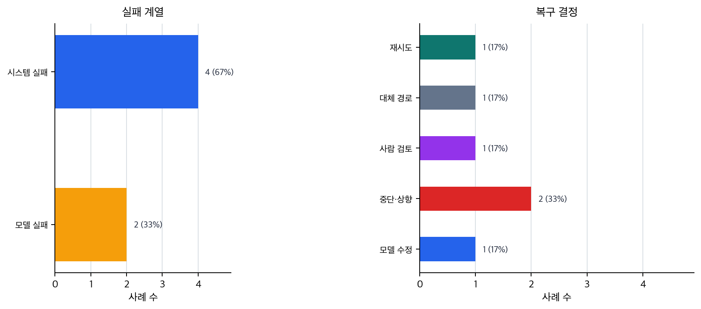

# P6-16.2 운영 중 실패 대응

Section ID: `P6-16.2`
Version: `v2026.07.19`

P6-16.1에서는 AI 서비스가 품질만으로는 성립하지 않고, 비용, 지연 시간, 사용량 제한, 운영 복잡도 안에서 설계되어야 한다는 점을 보았습니다. 이 절에서는 실제로 실패가 발생했을 때 무엇을 어떻게 봐야 하는지 다룹니다.

AI 서비스의 실패 대응은 모델 출력만 보는 일이 아니라, 검색, 도구 호출, 실행 흐름, 권한, 로그까지 포함한 전체 경로를 점검하는 일입니다. 즉, 답변 한 줄만 보는 것이 아니라 그 답이 만들어진 전체 과정을 다시 추적하는 일에 가깝습니다.

## 실패 경로 판단이 맡는 일

이 절에서 먼저 붙잡을 질문은 다음과 같습니다.

- AI 서비스에서 실패는 어떤 형태로 나타나는가?
- 모델 실패와 시스템 실패는 어떻게 구분해야 하는가?
- 운영 중에는 어떤 대응 기준이 필요한가?

대신 이 절에서는 Part 6 전체에서 본 프롬프트, RAG, 도구 사용, 에이전트, 평가, 권한 문제를 운영 관점으로 다시 묶습니다. 즉, 여기서는 `어디를 추적해야 실패 원인을 구분할 수 있는가`, `retry, fallback, stop, approval 중 어디로 보낼 것인가`까지를 먼저 닫습니다. 뒤의 P6-17에서는 이 운영 판단을 실제 요청 흐름과 회고 기록으로 다시 묶습니다.

여기서는 실패 대응을 단순한 오류 메시지 처리로 축소하지 않고, LLM 서비스 특유의 다단계 실패 구조로 읽습니다.

앞 절의 자동 평가와 사람 평가는 `무엇이 좋은 답인가`를 가르는 기준을 다뤘다면, 여기서는 `문제가 났을 때 어떤 경로로 멈추고, 다시 시도하고, 사람에게 넘길 것인가`로 질문이 바뀝니다. 아직 조직 운영 체계 전체를 설계하는 단계까지는 가지 않고, 뒤의 P6-17에서는 이 운영 판단을 하나의 작은 기능 흐름과 회고 기록으로 다시 묶습니다.

후반 실행 구조를 같은 질문으로 다시 고정하면, 지금 장의 역할은 아래처럼 압축할 수 있습니다.

| 지금 부족한 것 | 이번 장이 붙이는 구조 | 아직 남는 문제 | 바로 이어지는 위치 |
| --- | --- | --- | --- |
| 평가와 운영 한도를 알더라도, 실패가 났을 때 어느 경로로 멈추고 다시 시도할지 정하지 않으면 실제 서비스 복구가 흔들린다 | retry, fallback, stop, approval으로 나누는 실패 경로 판단 | 이 판단과 기록을 실제 요청 흐름과 회고 문서에 어떻게 남길지는 아직 남아 있다 | P6-17.1, P6-17.2 |

| 단계 | 지금 잡아야 할 질문 | 이 질문을 본 위치 |
| --- | --- | --- |
| 평가 | 이 답을 품질 기준으로 통과시킬 수 있는가? | P6-15.1, P6-15.2 |
| 운영 복구 | 실패가 났을 때 retry, fallback, stop, approval 중 어디로 보낼 것인가? | P6-16.1, P6-16.2 |
| 요청 흐름 통합 | 이 판단과 기록을 실제 요청 흐름에 어떻게 남길 것인가? | P6-17.1, P6-17.2 |

즉, 여기서 중요한 전환은 `좋은 답 판단`에서 `실패 경로 결정`으로 관점이 바뀌는 데 있습니다. 다시 말해 P6-15에서 `좋은 답처럼 보이는가`를 가른 뒤, 여기서는 그 답이 실패했을 때 어떤 운영 경로를 타야 하는가를 정합니다. 바로 뒤의 P6-17에서는 그 판단을 요청 흐름과 실행 기록의 상태값으로 남깁니다.

여기서는 재시도(retry), 대체 경로(fallback), 중단(stop), 승인(approval)으로 이어지는 실패 대응을 답변 실패와 시스템 실패를 같은 말로 뭉개지 않고 경로별로 나눠 읽는 기준으로 정리합니다.

같은 실패처럼 보여도 먼저 어디서 멈췄는지에 따라 남겨야 할 기록과 바로 다음 조치는 달라집니다.

| 먼저 보인 실패 장면 | 우선 좁혀 볼 실패 축 | 가장 먼저 남기거나 다시 볼 기록 | 바로 다음 조치 | 서두르면 안 되는 결론 |
| --- | --- | --- | --- | --- |
| 답변 내용은 어색한데 검색과 도구 호출은 정상처럼 보인다 | 모델 실패 | 답 상태 점검, 검토 요약, 답 초안과 근거 비교 메모 | 답 초안이 근거와 얼마나 어긋났는지 다시 보고, 사람 검토 또는 답변 수정 경로로 넘깁니다 | 곧바로 검색이나 도구 구조 전체가 잘못됐다고 단정하지 않습니다 |
| 관련 없는 문서나 비어 있는 검색 결과가 먼저 보인다 | 검색 실패 | 검색 후보 목록, 선택 근거, 검색 추적 기록 | 검색 경로와 근거 선택을 다시 보고, fallback 답변이나 재검색 경로를 먼저 정합니다 | 모델 자체 품질만의 문제라고 단정하지 않습니다 |
| 도구 호출, 권한, timeout에서 실행이 끊긴다 | 시스템 실패 | 실행 기록, 장애 기록, 승인/timeout 기록 | retry, fallback, stop, approval 중 어느 경로로 돌릴지 정하고 그 이유를 남깁니다 | 답변 문장만 고치면 해결된다고 보지 않습니다 |
| 여러 층위가 함께 흔들려 원인이 바로 안 잡힌다 | 복합 실패 | 전체 추적 기록과 다음 조치 메모 | 먼저 사람 검토나 stop으로 안전하게 멈춘 뒤, 어느 층위부터 다시 볼지 순서를 정합니다 | 한 번의 증상만 보고 단일 원인으로 축소하지 않습니다 |

## 여기서 남겨야 할 구분

- AI 서비스 실패 유형을 입문 수준에서 설명할 수 있습니다.
- 모델 실패와 시스템 실패를 구분할 수 있습니다.
- trace, fallback, retry, approval 같은 대응 수단의 역할을 설명할 수 있습니다.
- Part 6 전체 내용을 운영 관점에서 묶어 볼 수 있습니다.

실패 유형 이름을 먼저 많이 외우기보다, 같은 실패처럼 보여도 왜 `retry`, `fallback`, `stop`, `approval`로 갈라지는지를 먼저 붙잡는 편이 더 안전합니다.

| 먼저 보인 실패 신호 | 바로 이어지는 대응 경로 | 왜 이렇게 갈라지는가 |
| --- | --- | --- |
| 잠깐의 timeout, 일시적 외부 API 오류 | retry | 같은 경로를 짧게 다시 시도하면 회복될 가능성이 있기 때문입니다. |
| 검색 누락, 무거운 경로 지연, 일부 도구 불능 | fallback | 완전히 멈추기보다 더 단순한 경로로 내려와 최소 기능을 유지해야 하기 때문입니다. |
| 권한 부족, 위험 실행, 근거 없는 단정 | stop 또는 approval | 계속 진행할수록 잘못된 실행이나 잘못된 안내 위험이 더 커지기 때문입니다. |
| 문서를 읽고도 계속 과장하거나 형식이 흔들림 | 사람 검토 + 수정 과제 분리 | 시스템 복구와 모델 개선을 한 경로로 뭉개면 원인 추적이 흐려지기 때문입니다. |

이 표를 먼저 잡고 아래의 실패 유형, trace, retry, fallback, 사례를 읽으면, 실패 대응을 `오류가 났다`는 사실보다 `어느 갈래로 먼저 보내야 하는가`의 분기 구조로 더 쉽게 붙잡을 수 있습니다.

## 실패는 어디서 생기나

AI 서비스에서는 실패가 한 지점에서만 생기지 않습니다.

| 질문 | 짧은 답 |
| --- | --- |
| 실패는 어디서 생길 수 있는가? | 모델, 검색, 도구, 성능, 권한 등 여러 층위 |
| 왜 구분이 필요한가? | 원인마다 대응 방법이 다르기 때문 |
| 그래서 무엇이 중요해지는가? | 실패를 단계별로 좁혀 보는 관찰 |

예를 들어:

- 모델이 사실과 다른 답을 했다
- 검색이 관련 없는 문서를 가져왔다
- 도구 호출이 실패했다
- 함수 인자가 잘못 구성되었다
- 응답은 맞았지만 너무 늦게 왔다

이처럼 실패는 `출력 내용`, `검색`, `실행`, `성능`, `권한` 등 여러 층위에서 생길 수 있습니다.

핵심은 `실패 = 틀린 답`으로만 읽지 않는 데 있습니다. 너무 느린 응답, 호출 권한 오류, 잘못된 검색도 모두 운영 관점에서는 실패입니다.

## 모델 실패와 시스템 실패는 어떻게 다른가

이 구분이 중요합니다.

### 모델 실패

- 환각(hallucination)
- 잘못된 요약
- 형식 불일치
- 근거 없는 일반론적 답변

### 시스템 실패

- 검색 누락
- 도구/API 호출 실패
- 데이터 접근 권한 오류
- 타임아웃(timeout)
- 캐시/상태 불일치

이 둘을 구분하지 않으면, 모든 문제를 `모델이 멍청하다`로 뭉뚱그리게 됩니다. 하지만 실제 운영에서는 원인을 더 좁혀야 합니다.

다음처럼 한 줄로 다시 묶으면 좋습니다.

- 모델 실패: 문서를 읽고도 요약·추론·표현 단계에서 내용이 어긋난 문제
- 시스템 실패: 검색, 도구 호출, 권한, 후처리처럼 답을 만드는 경로 자체가 끊긴 문제

## 왜 trace가 중요한가

최종 답만 보면 실패 원인을 알기 어렵습니다. 따라서 운영 중에는 다음 질문을 다시 볼 수 있어야 합니다.

- 어떤 문서를 검색했는가?
- 어떤 도구를 호출했는가?
- 어떤 인자가 들어갔는가?
- 어느 단계에서 시간이 오래 걸렸는가?

이런 정보가 남아 있어야 `검색 실패인지`, `모델 실패인지`, `도구 실패인지`를 구분할 수 있습니다.

즉, trace는 단순 기록이 아니라 실패 분석의 출발점입니다.

서비스 구조 흐름으로 보면, trace는 에이전트와 도구 사용이 많아질수록 더 중요해집니다. 단계가 늘수록 `어디에서 잘못되었는가`를 되짚을 수 있어야 하기 때문입니다.

## retry와 fallback은 왜 필요한가

운영에서는 모든 실패를 완전히 막기보다, 실패했을 때 어떻게 완화할지가 중요합니다.

예를 들어:

- 검색이 실패하면 일반 답변 모드로 전환
- 도구 호출이 실패하면 사용자에게 확인 요청
- 느린 모델이 지연되면 더 작은 모델로 대체
- 외부 API가 실패하면 캐시된 최근 결과 사용

이런 구조를 fallback이라고 볼 수 있습니다.

retry는 일시적 실패를 다시 시도하는 방법입니다. 하지만 무한 재시도는 비용과 지연 시간을 키우므로 한계가 필요합니다.

여기서는 다음 구분이 특히 중요합니다.

| 대응 수단 | 중심 목적 |
| --- | --- |
| retry | 잠깐의 실패를 다시 시도해 회복 |
| fallback | 원래 경로가 실패했을 때 대체 경로 사용 |
| stop | 더 큰 오류를 막기 위해 진행 중단 |

실제 운영에서는 실패를 먼저 짧게 분류한 뒤 대응 경로를 고르는 편이 가장 안전합니다.

| 먼저 분류한 실패 유형 | 가장 먼저 고를 대응 경로 | 왜 그 경로가 먼저인가 |
| --- | --- | --- |
| 일시적 timeout, 외부 API 일시 오류 | retry | 잠깐의 실패는 한두 번 재시도로 회복될 수 있기 때문입니다. |
| 검색 실패, 무거운 경로 지연, 일부 도구 불능 | fallback | 완전히 멈추지 않고 더 단순한 경로로 내려와야 하기 때문입니다. |
| 권한 부족, 위험한 실행, 전제 붕괴 | stop 또는 approval | 잘못된 실행을 계속하면 피해가 더 커질 수 있기 때문입니다. |
| 문서를 읽고도 계속 과장하거나 형식이 흔들림 | 사람 검토, 모델/프롬프트 수정 과제 분리 | 시스템 복구와 모델 개선을 같은 대응으로 뭉개면 안 되기 때문입니다. |

즉, retry, fallback, stop, approval은 단순 기능 이름이 아니라 `실패 triage`의 기본 갈래입니다.

운영 현장에서 이 triage를 가장 짧게 읽으면 `잠깐의 장애는 제한된 retry`, `주 경로가 막히면 fallback`, `권한이나 위험이 보이면 stop 또는 approval`, `모델 출력이 흔들리면 사람 검토와 수정 과제 분리`로 먼저 닫는 편이 좋습니다. 핵심은 `실패를 봤다`에서 끝나지 않고, 어느 갈래로 먼저 보낼 것인가를 즉시 정하는 데 있습니다.

## 서비스 체크리스트로 다시 묶으면

P6-15.2의 자동 평가와 사람 평가, P6-16.1의 운영 제약, 지금 절의 실패 대응을 실제 운영 순서로 다시 묶으면 다음 네 줄이 먼저 보여야 합니다.

| 운영 단계 | 먼저 확인할 질문 | 남겨야 할 대표 기록 |
| --- | --- | --- |
| 자동 게이트 | 형식, 출처 힌트, 금지 표현, 기본 길이 조건을 통과하는가? | 답 상태 점검, 자동 점검 결과 |
| 사람 검토 | 말투, 오해 가능성, 다음 행동 이해도, 예외 해석이 괜찮은가? | 검토 요약, 검토 의견 |
| 운영 한도 확인 | latency, cost, retry 횟수, 처리량 한도를 버티는가? | 실행 시간, 호출 수, 비용 요약 |
| 실패 대응 | retry, fallback, stop, approval 중 어느 경로로 갈 것인가? | 장애 기록, 다음 조치, 추적 기록 |

이 표의 핵심은 `평가`와 `운영`을 따로 읽지 않는 데 있습니다. 좋은 답처럼 보여도 자동 게이트를 못 넘기면 배포 후보가 아니고, 자동 게이트를 통과해도 사람이 읽었을 때 오해를 만들면 수정이 필요합니다. 또 둘 다 좋아 보여도 latency나 cost를 못 버티면 운영안으로는 탈락할 수 있고, 실제 실패가 났을 때 추적 기록과 다음 조치 메모가 없으면 같은 문제를 반복하게 됩니다.

즉, Part 6 뒤쪽을 실제 서비스 판단으로 줄이면 다음 한 문장으로 묶을 수 있습니다.

`자동으로 거를 것 -> 사람이 끝까지 볼 것 -> 운영 한도 안에 있는지 볼 것 -> 실패 시 어떤 경로로 남길지 정할 것`

## 승인(approval)과 권한(permission)은 왜 중요한가

특히 agent 구조에서는 모든 행동을 자동 실행하는 것이 위험할 수 있습니다.

예를 들어:

- 파일 삭제
- 메일 발송
- 외부 시스템 수정
- 비용이 큰 실행

같은 작업은 승인 절차가 필요할 수 있습니다.

즉, 실패 대응은 오류가 난 뒤 수습하는 것만이 아니라, 위험한 실패를 미리 막는 구조도 포함합니다.

이 점 때문에 실패 대응은 `사후 복구`와 `사전 방지`를 함께 포함합니다.

이 흐름을 한 번 더 단순화하면 다음과 같습니다.

```mermaid
--8<-- "assets/part-06/chapter-16/p6-c16-s02-diagram-01-ko.mmd"
```

이 그림의 핵심은 실패 대응이 오류 문구를 보여 주고 끝나는 것이 아니라, 실패를 분류하고 대응 경로를 고른 뒤 흔적을 남겨 다음 개선으로 이어지는 구조라는 점입니다.

핵심은 실패 대응이 최종 출력 뒤의 부가 작업이 아니라, 실행 구조 전체에 들어가야 한다는 점입니다.

## 사례 및 예시

이 사례들의 초점은 `실패가 났는가`보다 `실패 뒤에 경로가 어떻게 갈라져야 하는가`입니다.

### 사례 1. RAG 답변 실패

RAG 답변이 틀렸다고 해 봅시다. 사람은 최종 답이 틀리면 먼저 모델이 멍청했다고 결론내리기 쉽습니다. 하지만 실제로는 `문서를 아예 잘못 찾았는가`, `맞는 문서를 찾았는데 요약 단계에서 잘못 읽었는가`를 구분해야 합니다. trace가 없으면 최종 답 하나만 남고, 검색 실패인지 생성 실패인지가 한 덩어리로 보입니다. 예를 들어 검색 후보에 최신 공지가 아예 없었다면 retrieval 문제이고, 최신 공지를 찾았는데 예외 조항을 빼먹었다면 reading 문제입니다. 이 둘을 구분하지 못하면 같은 실패가 반복돼도 검색을 고쳐야 하는지 프롬프트를 고쳐야 하는지 판단할 수 없습니다. 여기서 바뀌는 점은 `최종 답이 틀렸는가`만 보는 기준에서 `어느 단계에서 틀어졌는가`를 분해해 보는 기준으로 이동한다는 것입니다. 실패 대응 구조가 있으면 검색된 문서 목록, 선택된 문단, 최종 답변을 함께 남겨 어디서 어긋났는지 다시 볼 수 있습니다. 그래서 이 사례에서 확인해야 할 결과는 `틀렸다`는 사실만 남는 것이 아니라, 검색 실패인지 해석 실패인지 어느 단계가 어긋났는지를 실제로 다시 설명할 수 있는가입니다.

| 먼저 확인할 지점 | 여기서 실패하면 먼저 의심할 것 | 다음 조치 |
| --- | --- | --- |
| 검색 후보 목록 | retrieval 누락, 최신 문서 부재 | 재검색, 쿼리 조정, fallback 답변 |
| 선택된 문단 | 관련 문단 선택 오류 | 선택 기준 재검토, 근거 재부착 |
| 최종 요약 | reading/요약 단계 해석 오류 | 프롬프트 조정, 사람 검토, 답변 수정 |

### 사례 2. 에이전트 도구 호출 실패

에이전트가 파일 읽기 도구를 호출했는데 권한 오류가 났다고 해 봅시다. 사람은 수동으로 작업할 때 보통 여기서 멈추고 다른 경로를 찾습니다. 하지만 자동 구조에서는 실패를 모른 척한 채 다음 단계로 넘어가면 없는 내용을 본 것처럼 답을 만들 수 있습니다. 예를 들어 설정 파일을 못 읽었는데도 `설정을 확인했다`는 전제로 패치를 제안하면, 오류 하나가 바로 허위 작업 기록으로 이어질 수 있습니다. 그 상태로 실제 수정까지 진행하면 잘못된 전제를 바탕으로 저장소를 더 망가뜨릴 수도 있습니다. 이 경우 문제는 단순 도구 오류가 아니라 `실패 후에도 계속 진행한 실행 정책`입니다. 여기서 바뀌는 점은 `오류가 났다`는 사실만 보는 기준에서 `오류 뒤에 경로가 실제로 멈춤·재시도·승인 대기로 바뀌는가`를 보는 기준으로 이동한다는 것입니다. 실패 대응 구조는 어디서 멈출지, 몇 번 다시 시도할지, 실패 시 사람 승인을 받을지를 미리 정해 둡니다. 그래서 이 사례에서 확인해야 할 결과는 권한 오류 뒤에 거짓 성공 흐름으로 계속 가지 않고, 실제로 멈춤·재시도·사람 승인 중 하나로 경로가 바뀌는가입니다.

| 실패 신호 | 그대로 진행하면 생기는 문제 | 실패 대응에서 먼저 갈라져야 하는 경로 |
| --- | --- | --- |
| 권한 오류 | 읽지 못한 파일을 읽은 것처럼 가정함 | stop 또는 approval |
| 일시적 timeout | 정상 자원도 영구 실패처럼 처리할 수 있음 | 제한된 retry 후 fallback |
| 파일 없음/경로 오류 | 잘못된 대상에 계속 후속 작업을 이어 감 | 경로 재확인 후 stop 또는 재탐색 |

### 사례 3. 느린 응답

답변 내용은 맞지만 응답까지 20초가 걸린다고 해 봅시다. 사람은 내용만 맞으면 우선 성공이라고 느끼기 쉽습니다. 하지만 기술적으로는 정답이라도, 사용자는 이미 새로고침을 누르거나 서비스를 떠났을 수 있습니다. 예를 들어 긴 문서 분석 요청이라면 기다릴 수도 있지만, 단순 정책 확인 질문에서 20초는 이미 실패에 가깝습니다. 사람이 운영에서 봐야 하는 실패는 `내용 오류`만이 아니라 `기다릴 수 없는 속도`도 포함합니다. 응답이 너무 늦으면 맞는 답도 읽히지 못한 채 버려질 수 있습니다. 여기서 바뀌는 점은 `내용이 맞는가`만 보는 기준에서 `사용 가능한 시간 안에 도착하는가`를 함께 보는 기준으로 이동한다는 것입니다. 이때 필요한 대응은 더 좋은 문장을 만드는 일이 아니라, timeout 기준, 간단 답변 우선 반환, 나중 상세 답변 같은 fallback 설계일 수 있습니다. 그래서 이 사례에서 확인해야 할 결과는 정답 여부와 별개로 사용자가 기다릴 수 있는 시간 안에 최소한의 답을 실제로 받는가입니다.

세 사례를 한 줄로 묶으면 다음과 같습니다.

| 상황 | 실패를 읽는 핵심 질문 |
| --- | --- |
| RAG 답변 실패 | 문서가 잘못됐는가, 해석이 잘못됐는가? |
| 에이전트 도구 호출 실패 | 어디서 멈추고 다시 시도할 것인가? |
| 느린 응답 | 내용은 맞아도 서비스로는 실패인가? |

세 사례를 대응 흐름 관점으로 다시 묶으면 다음과 같습니다.

| 상황 | 먼저 남겨야 하는 관찰 기록 | 다음에 고쳐야 하는 지점 |
| --- | --- | --- |
| RAG 답변 실패 | 검색 후보, 선택 문단, 최종 답변 | retrieval, reading, prompt 중 어디가 틀렸는지 |
| 에이전트 도구 호출 실패 | 오류 종류, 재시도 횟수, 승인 여부 | stop 규칙, retry 정책, 권한 처리 |
| 느린 응답 | 단계별 지연 시간, fallback 사용 여부 | timeout 기준, 간단 답 우선 반환, 경량 경로 |

## 바로 적용해 보면

실패 대응을 처음 읽을 때 가장 자주 놓치는 것은 `문제가 생겼다`는 사실만 보고도 곧바로 한 가지 해결책만 떠올리는 점입니다. 하지만 실제 운영에서는 먼저 `이 실패를 다시 시도할 것인가`, `더 단순한 경로로 내릴 것인가`, `바로 멈출 것인가`, `사람에게 넘길 것인가`를 갈라야 합니다.

| 이런 장면이 보이면 | 먼저 확인할 것 | 왜 그 확인이 먼저 필요한가 |
| --- | --- | --- |
| 잠깐의 timeout이나 일시적 외부 API 오류가 보임 | 짧은 retry로 회복 가능한가 | 일시 오류는 곧바로 stop하기보다 제한된 재시도로 복구될 수 있기 때문입니다. |
| 검색 실패나 무거운 경로 지연으로 답이 늦어짐 | fallback 경로가 있는가 | 완전히 멈추기보다 더 단순한 답변 경로로 내려와 최소 기능을 유지해야 하기 때문입니다. |
| 권한 부족, 위험 실행, 근거 충돌이 보임 | stop 또는 approval로 보내야 하는가 | 계속 진행할수록 잘못된 실행이나 잘못된 안내 위험이 더 커질 수 있기 때문입니다. |

같은 기준을 더 짧은 실무 질문으로 바꾸면 다음처럼 읽을 수 있습니다.

| 이런 의심이 들면 | 먼저 던질 질문 |
| --- | --- |
| `이건 한 번 더 해 보면 될까?` | 일시 오류인가, 구조 오류인가? |
| `지금 경로가 너무 무겁거나 막혔다` | 더 단순한 fallback 답변이나 캐시 경로가 있는가? |
| `계속하면 오히려 위험해 보인다` | 여기서 멈추고 사람 승인이나 검토로 넘겨야 하는가? |

이 절에서 먼저 익혀야 하는 기준은 단순합니다. 실패 대응은 `에러를 고친다`는 한 문장보다, `retry`, `fallback`, `stop`, `approval` 중 어느 경로가 지금 가장 안전한가를 고르는 분기 작업에 가깝습니다.

## 연습 및 예제

이번 예제의 목표는 실패 대응이 `에러가 났다`에서 끝나는 것이 아니라, 재시도, fallback, stop 분기가 실제로 나뉘고 각 경우에 다음 운영 조치가 달라진다는 점을 보는 것입니다. 이번에는 실패 사례 하나만 보지 않고, `시스템 실패`와 `모델 실패`를 함께 넣어 어떤 경우에 retry가 맞고 어떤 경우에 fallback, 사람 검토, 모델 수정이 맞는지 비교하겠습니다.

아래 예제는 여러 개의 실패 상황, 재시도 허용 횟수와 캐시 사용 가능 여부, 사람 검토 가능 여부와 근거 문서 존재 여부를 사용합니다. 검색 단계에서는 timeout이, 도구 호출 단계에서는 permission error가, 답변 단계에서는 환각이나 형식 불일치가 생길 수 있습니다.

출력에서는 실패 유형별 최종 대응 결정, retry와 fallback 여부, 사람 검토 전환 여부, 모델 수정 과제와 시스템 복구 과제의 요약값, 운영자가 바로 해야 할 다음 조치를 함께 확인합니다. 코드에서 확인할 핵심은 운영 실패를 모델 오류와 시스템 오류로 나눠야 적절한 복구 절차와 사용자 대응을 정할 수 있다는 점입니다.

먼저 이 예제에서 함께 볼 대응 기준은 다음과 같습니다.

| 점검 항목 | 왜 필요한가 |
| --- | --- |
| 실패 계열 | 모델 실패와 시스템 실패를 섞어 보지 않기 위해 |
| 대응 결정 | retry, fallback, stop, fix 중 어떤 경로를 탈지 남기기 위해 |
| 다음 조치 | 운영자가 다음에 무엇을 해야 하는지 바로 읽기 위해 |
| 추적 기록 저장 여부 | 실패 원인을 나중에 다시 재현하고 분석할 수 있어야 해서 |
| 사용자 영향 | 사용자 경험을 즉시 보호해야 하는 실패인지 구분해야 해서 |

```python
from pprint import pprint

failure_cases = [
    {
        "name": "timeout_retry",
        "failure_family": "system",
        "step": "search_docs",
        "error": "timeout",
        "retry_count": 1,
        "max_retries": 2,
        "cached_summary_available": True,
        "trace_saved": True,
    },
    {
        "name": "timeout_fallback",
        "failure_family": "system",
        "step": "search_docs",
        "error": "timeout",
        "retry_count": 2,
        "max_retries": 2,
        "cached_summary_available": True,
        "trace_saved": True,
    },
    {
        "name": "timeout_escalate",
        "failure_family": "system",
        "step": "search_docs",
        "error": "timeout",
        "retry_count": 2,
        "max_retries": 2,
        "cached_summary_available": False,
        "trace_saved": True,
    },
    {
        "name": "permission_stop",
        "failure_family": "system",
        "step": "read_file",
        "error": "permission_error",
        "retry_count": 0,
        "max_retries": 2,
        "cached_summary_available": False,
        "trace_saved": True,
        "human_review_available": True,
        "grounding_available": False,
    },
    {
        "name": "hallucination_review",
        "failure_family": "model",
        "step": "answer_generation",
        "error": "hallucination",
        "retry_count": 0,
        "max_retries": 1,
        "cached_summary_available": False,
        "trace_saved": True,
        "human_review_available": True,
        "grounding_available": True,
    },
    {
        "name": "format_fix",
        "failure_family": "model",
        "step": "answer_generation",
        "error": "format_mismatch",
        "retry_count": 0,
        "max_retries": 1,
        "cached_summary_available": False,
        "trace_saved": True,
        "human_review_available": False,
        "grounding_available": True,
    },
]

def decide_recovery(case):
    if case["error"] == "hallucination":
        return {
            "decision": "human_review",
            "next_action": "compare_with_grounding",
            "trace_saved": case["trace_saved"],
            "user_impact": "potential_wrong_answer",
        }
    if case["error"] == "format_mismatch":
        return {
            "decision": "model_fix",
            "next_action": "tighten_prompt_or_parser",
            "trace_saved": case["trace_saved"],
            "user_impact": "delivery_blocked_until_format_fixed",
        }
    if case["error"] == "permission_error":
        return {
            "decision": "stop_and_escalate",
            "next_action": "ask_human_review",
            "trace_saved": case["trace_saved"],
            "user_impact": "unsafe_to_continue",
        }
    if case["retry_count"] < case["max_retries"]:
        return {
            "decision": "retry",
            "next_action": "search_docs_again",
            "trace_saved": case["trace_saved"],
            "user_impact": "temporary_delay",
        }
    if case["cached_summary_available"]:
        return {
            "decision": "fallback",
            "next_action": "use_cached_summary",
            "trace_saved": case["trace_saved"],
            "user_impact": "reduced_freshness_but_service_continues",
        }
    return {
        "decision": "stop_and_escalate",
        "next_action": "ask_human_review",
        "trace_saved": case["trace_saved"],
        "user_impact": "service_stopped_for_this_request",
    }

reports = []
for case in failure_cases:
    recovery = decide_recovery(case)
    reports.append(
        {
            "name": case["name"],
            "failure_family": case["failure_family"],
            "failure_case": case,
            "recovery": recovery,
        }
    )

summary = {
    "retry_count": sum(report["recovery"]["decision"] == "retry" for report in reports),
    "fallback_count": sum(report["recovery"]["decision"] == "fallback" for report in reports),
    "human_review_count": sum(report["recovery"]["decision"] == "human_review" for report in reports),
    "stop_and_escalate_count": sum(report["recovery"]["decision"] == "stop_and_escalate" for report in reports),
    "model_fix_count": sum(report["recovery"]["decision"] == "model_fix" for report in reports),
    "system_failure_count": sum(report["failure_family"] == "system" for report in reports),
    "model_failure_count": sum(report["failure_family"] == "model" for report in reports),
}

print("[summary]")
print(summary)
print()

for report in reports:
    print("=" * 80)
    print(f"[{report['name']}]")
    print("failure_family =", report["failure_family"])
    print("failure_case =")
    pprint(report["failure_case"])
    print("recovery =")
    pprint(report["recovery"])
    print()
```

실행 결과 예시는 다음처럼 읽을 수 있습니다.

```text
[summary]
{'retry_count': 1,
 'fallback_count': 1,
 'human_review_count': 1,
 'stop_and_escalate_count': 2,
 'model_fix_count': 1,
 'system_failure_count': 4,
 'model_failure_count': 2}

================================================================================
[timeout_retry]
failure_family = system
failure_case =
{'cached_summary_available': True,
 'error': 'timeout',
 'failure_family': 'system',
 'max_retries': 2,
 'name': 'timeout_retry',
 'retry_count': 1,
 'step': 'search_docs',
 'trace_saved': True}
recovery =
{'decision': 'retry',
 'next_action': 'search_docs_again',
 'trace_saved': True,
 'user_impact': 'temporary_delay'}

================================================================================
[timeout_fallback]
failure_family = system
failure_case =
{'cached_summary_available': True,
 'error': 'timeout',
 'failure_family': 'system',
 'max_retries': 2,
 'name': 'timeout_fallback',
 'retry_count': 2,
 'step': 'search_docs',
 'trace_saved': True}
recovery =
{'decision': 'fallback',
 'next_action': 'use_cached_summary',
 'trace_saved': True,
 'user_impact': 'reduced_freshness_but_service_continues'}

================================================================================
[timeout_escalate]
failure_family = system
failure_case =
{'cached_summary_available': False,
 'error': 'timeout',
 'failure_family': 'system',
 'max_retries': 2,
 'name': 'timeout_escalate',
 'retry_count': 2,
 'step': 'search_docs',
 'trace_saved': True}
recovery =
{'decision': 'stop_and_escalate',
 'next_action': 'ask_human_review',
 'trace_saved': True,
 'user_impact': 'service_stopped_for_this_request'}

================================================================================
[permission_stop]
failure_family = system
failure_case =
{'cached_summary_available': False,
 'error': 'permission_error',
 'failure_family': 'system',
 'grounding_available': False,
 'human_review_available': True,
 'max_retries': 2,
 'name': 'permission_stop',
 'retry_count': 0,
 'step': 'read_file',
 'trace_saved': True}
recovery =
{'decision': 'stop_and_escalate',
 'next_action': 'ask_human_review',
 'trace_saved': True,
 'user_impact': 'unsafe_to_continue'}

================================================================================
[hallucination_review]
failure_family = model
failure_case =
{'cached_summary_available': False,
 'error': 'hallucination',
 'failure_family': 'model',
 'grounding_available': True,
 'human_review_available': True,
 'max_retries': 1,
 'name': 'hallucination_review',
 'retry_count': 0,
 'step': 'answer_generation',
 'trace_saved': True}
recovery =
{'decision': 'human_review',
 'next_action': 'compare_with_grounding',
 'trace_saved': True,
 'user_impact': 'potential_wrong_answer'}

================================================================================
[format_fix]
failure_family = model
failure_case =
{'cached_summary_available': False,
 'error': 'format_mismatch',
 'failure_family': 'model',
 'grounding_available': True,
 'human_review_available': False,
 'max_retries': 1,
 'name': 'format_fix',
 'retry_count': 0,
 'step': 'answer_generation',
 'trace_saved': True}
recovery =
{'decision': 'model_fix',
 'next_action': 'tighten_prompt_or_parser',
 'trace_saved': True,
 'user_impact': 'delivery_blocked_until_format_fixed'}
```



이 예제에서 먼저 봐야 할 것은 `system`과 `model` 실패가 같은 표에서 다르게 갈라지고, 사용자 영향과 다음 조치가 그 차이를 실제 운영 판단으로 바꿔 준다는 점입니다. `timeout`과 `permission_error`는 실행 경로를 복구하거나 멈추는 문제이고, `hallucination`과 `format_mismatch`는 검색 재시도보다 사람 검토나 프롬프트/파서 수정이 더 먼저인 문제입니다.

같은 결과를 실패 경로 기준으로 다시 짧게 묶으면 다음처럼 읽을 수 있습니다.

| 실행 이름 | 먼저 드러난 실패 성격 | 왜 이 경로로 읽는가 | 바로 다음 조치 |
| --- | --- | --- | --- |
| `timeout_retry` | 일시적 시스템 지연 | 재시도 횟수가 남아 있고 같은 검색 단계를 다시 시도해 볼 수 있기 때문입니다. | 같은 검색을 한 번 더 재시도 |
| `timeout_fallback` | 최신성은 낮아져도 서비스는 계속 가능한 지연 | 재시도 횟수는 다 썼지만 캐시 요약이 남아 있어 완전 중단보다 대체 경로가 가능하기 때문입니다. | 캐시 요약으로 우회 |
| `timeout_escalate` | 복구 수단이 끊긴 시스템 중단 | 재시도도 끝났고 캐시도 없어 자동 복구 경로가 더 남아 있지 않기 때문입니다. | 사람 검토로 넘기고 이 요청은 중단 |
| `permission_stop` | 즉시 멈춰야 하는 권한 실패 | 권한 경계가 비어 있는데 계속 진행하면 잘못된 접근이 될 수 있기 때문입니다. | 즉시 중단하고 사람 검토 요청 |
| `hallucination_review` | 근거 비교가 먼저 필요한 모델 실패 | 검색을 다시 할 문제가 아니라 이미 있는 근거와 답을 비교해 사실성부터 확인해야 하기 때문입니다. | 근거 문서와 대조하며 사람 검토 |
| `format_fix` | 출력 형식 수정이 먼저 필요한 모델 실패 | 내용보다 전달 형식과 파서 호환이 깨져 있어 생성 규칙을 먼저 조정해야 하기 때문입니다. | 프롬프트나 파서를 조정하고 다시 생성 |

그래서 이 예제에서 확인해야 할 결과는 실패가 났을 때 응답이 그냥 중단되는 것이 아니라, 재시도, 대체 경로, 사람 검토 전환, 모델 수정 같은 분기가 실제로 따로 설계된다는 점입니다. 특히 `timeout`이라고 해도 retry 가능 횟수와 캐시 존재 여부에 따라 다른 경로를 타고, `permission_error`처럼 재시도보다 즉시 중단이 맞는 오류, `hallucination`처럼 근거 비교가 먼저 필요한 오류도 따로 구분해야 한다는 점이 중요합니다.

이 예제에서 읽어야 할 핵심은 다음입니다.

- 실패를 발견하고
- 바로 끝내는 것이 아니라
- 재시도, 대체 경로, 기록 저장, 사람 전환, 모델 수정 경로를 같이 설계해야 한다는 점입니다
- 같은 실패처럼 보여도 오류 종류와 남은 복구 수단에 따라 대응이 달라져야 한다는 점입니다

이 예제에서 독자가 직접 해 볼 수 있는 조정은 다음과 같습니다.

- `max_retries`를 줄여 retry보다 fallback이나 중단이 더 빨리 열리는지 보기
- `cached_summary_available`를 바꿔 같은 timeout이라도 어떤 경로를 타는지 비교해 보기
- 다른 실패 유형 `rate_limit`, `tool_not_found`, `wrong_citation`을 넣어 어떤 오류가 시스템 복구인지 모델 수정인지 비교해 보기

## 이 예제를 복구 설계 관점으로 다시 보면

이 예제는 실패 대응을 단순한 예외 처리 한 줄로 보지 않게 해 줍니다. 실제 운영에서는 오류를 `어떻게 복구할 것인가`, `어떤 흔적을 남길 것인가`, `사용자 경험을 어디까지 유지할 것인가`까지 함께 설계해야 하므로, 실패 장면은 곧 복구 구조를 점검하는 장면이 됩니다.

여기까지를 한 줄로 묶으면, 운영 중 실패 대응은 `에러를 잡는 일`이 아니라 `실패를 분류해 적절한 복구 경로와 다음 조치를 고르고, 그 흔적을 남겨 다시 개선하는 일`입니다.

이 절에서 더 중요하게 붙잡아야 할 점은 `좋은 답을 만들었는가`와 `실패했을 때 어디서 멈추고 어떻게 복구할 것인가`가 같은 문제가 아니라는 것입니다. 그래서 실패 대응은 사후 예외 처리 부록이 아니라, 서비스 구조 안에서 복구 경로와 다음 조치를 미리 정하는 운영 판단으로 읽는 편이 좋습니다.

이 복구 경로가 중요한 이유는 다음과 같습니다.

- 바로 앞의 P6-16.1 서비스 운영 제약을 `무엇을 조심해야 하는가`에서 `실패가 났을 때 어디를 추적해야 하는가`로 더 구체화하고
- Part 6의 프롬프트, RAG, tool use, agent, evaluation을 운영 관점으로 다시 묶어 주고
- 바로 다음 통합 미니 실습에서 실패 대응까지 함께 설계하게 만들며
- `AI를 쓴다`와 `AI 서비스를 운영한다`의 차이를 분명히 보여 주기 때문입니다

## 체크리스트
- 실패 대응을 `오류 문구 처리`가 아니라 `실패를 분류하고 복구 경로를 고르는 운영 구조`로 설명할 수 있어야 합니다.
- 모델 실패와 시스템 실패를 구분해야 같은 증상도 다른 조치로 보낼 수 있다는 점을 말할 수 있어야 합니다.
- 다음 장은 운영 절과 분리된 새 주제가 아니라, 여기서 정한 판단과 기록을 실제 요청 하나의 흐름으로 묶어 보는 단계라는 점을 잡고 있어야 합니다.

## 출처와 참고 자료

- OpenAI, [Integrations and observability](https://developers.openai.com/api/docs/guides/agents/integrations-observability){: target="_blank" rel="noopener noreferrer" }, OpenAI API Docs, 확인 날짜: 2026-07-19.
- OpenAI, [Evaluate agent workflows](https://developers.openai.com/api/docs/guides/agent-evals){: target="_blank" rel="noopener noreferrer" }, OpenAI API Docs, 확인 날짜: 2026-07-19.
- OpenAI, [Production best practices](https://developers.openai.com/api/docs/guides/production-best-practices){: target="_blank" rel="noopener noreferrer" }, OpenAI API Docs, 확인 날짜: 2026-07-19.
