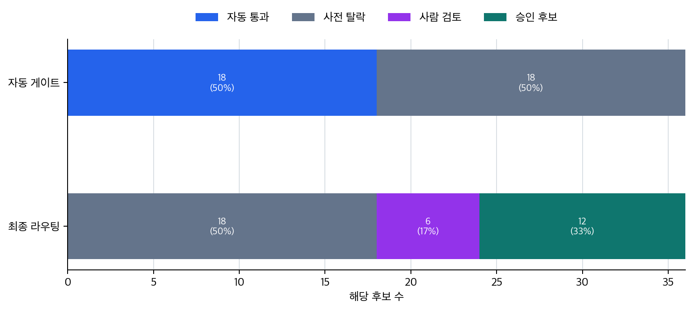

# P6-16.2 자동 평가와 사람 평가의 분업

> Section ID: `P6-16.2`
> Version: `v2026.07.31`

평가 분업은 `automatic_check`, `human_review`, `repeatable_rule`, `context_judgment`, `escalation_case`, `review_note`로 남깁니다. 이 구분이 있어야 반복 검사에 강한 자동 평가와 맥락 판단에 강한 사람 평가가 서로 대체물처럼 보이지 않습니다.

_보조제목: 반복 검사와 맥락 판단은 자동 평가와 사람 평가에서 어떻게 나뉘는가_

LLM 평가 축을 세웠다면, 그다음에는 모든 평가를 같은 방식으로 처리하지 않는 기준이 필요합니다. 형식 오류처럼 기계적으로 반복 확인할 수 있는 항목은 자동 평가(automatic evaluation)에 맡기기 쉽고, 해석·뉘앙스·실제 도움성처럼 맥락 판단이 필요한 항목은 사람 평가(human evaluation)가 끝까지 봐야 합니다.

자동 평가는 빠르고 반복 가능하지만, 사람 평가는 맥락과 품질 감각을 더 잘 봅니다. 실제 운영에서는 둘을 함께 쓰는 경우가 많습니다. 여기서 평가하는 대상은 LLM 알고리즘 내부가 아니라, 모델이 실제로 내놓은 답변, 요약, 안내문 같은 결과물입니다.

앞에서 하네스와 MCP를 다룬 이유도 여기에 이어집니다. 출력 후보, 입력, 근거 문서, 도구 호출 기록이 남아 있어야 자동 평가가 같은 조건을 반복 검사할 수 있고, 사람이 나중에 같은 실행을 다시 읽으며 판단할 수 있습니다. 즉, 평가 분업은 LLM 결과물을 검토 가능한 서비스 기록으로 다루기 위한 운영 구조입니다.

## 자동 평가와 사람 평가의 분업

핵심 질문은 다음과 같습니다.

- 자동 평가는 무엇에 강한가?
- 사람 평가는 무엇에 여전히 필요한가?
- 왜 둘을 섞어 쓰는 구조가 자주 등장하는가?

핵심은 `자동 평가가 더 좋은가, 사람이 더 좋은가`가 아닙니다. 같은 출력이라도 어떤 항목은 자동 채점기(automatic grader)에서 먼저 수정 대상으로 잡고, 어떤 항목은 사람 검토 큐로 넘깁니다. 평가 분업은 품질 판단을 한 사람이 끝까지 읽는 방식에서 벗어나, 반복 가능한 검사는 자동화하고 애매한 판단은 사람이 읽을 수 있는 검토 패킷으로 남기는 구조입니다.

| 평가할 항목 | 자동 평가가 맡기 쉬운 부분 | 사람 평가가 남겨야 하는 부분 |
| --- | --- | --- |
| 형식 적합성 | JSON 형식, 필수 필드, 길이 제한, 출처 존재 여부 | 형식은 맞지만 읽는 순서가 실제로 자연스러운가 |
| 근거성 | 출처 링크, 인용 위치, 금지된 무근거 표현 탐지 | 인용 문장이 답의 결론을 실제로 지지하는가 |
| 유용성 | 필수 항목 포함 여부, 다음 행동 문구 존재 여부 | 사용자가 실제로 다음 행동을 이해할 수 있는가 |
| 안전성 | 금지 표현, 위험 키워드, 정책 위반 후보 탐지 | 문맥상 오해나 과도한 확신이 남아 있는가 |

따라서 평가 분업의 핵심 질문은 `같은 평가 축을 자동 채점기와 사람 검토에 어떻게 나눠 맡길 것인가`입니다.

## 반복 검사와 맥락 판단의 구분

- 자동 평가와 사람 평가의 차이를 설명할 수 있습니다.
- 반복 가능성과 맥락 판단의 차이를 말할 수 있습니다.
- 운영에서 왜 두 방식을 섞는지 설명할 수 있습니다.
- 평가 결과를 자동 수정 필요 후보와 사람 검토 후보로 나눌 수 있습니다.

용어 정의를 길게 외우기보다, 같은 답변이 왜 `자동 채점기에서 먼저 멈춤`, `사람 검토 큐로 넘어감`, `검토 패킷으로 남음`으로 갈리는지 기준으로 삼는 편이 더 안전합니다.

| 먼저 보인 답변 상태 | 이어지는 평가 경로 | 왜 이렇게 갈라지는가 |
| --- | --- | --- |
| 형식 오류, 필수 필드 누락, 기본 기준 미달 | 자동 수정 필요 | 사람이 끝까지 읽기 전에 기계적으로 고쳐야 할 실패이기 때문입니다. |
| 형식은 맞지만 해석, 뉘앙스, 위험 판단이 애매함 | 사람 검토 큐 | 자동 점검만으로는 실제 오해 가능성과 도움성을 끝까지 읽기 어렵기 때문입니다. |
| 자동 기준을 통과했지만 맥락 판단이 남음 | 사람 검토 패킷 생성 | 출력 후보와 점검 질문을 묶어 사람이 실제 문맥에서 다시 읽을 수 있어야 하기 때문입니다. |

이 표를 먼저 잡고 아래의 자동 평가, 사람 평가, 사례를 읽으면, 평가 분업을 `누가 더 낫다`의 비교보다 `어떤 후보를 어디서 멈추고 어디로 넘길 것인가`의 분기 구조로 더 쉽게 붙잡을 수 있습니다.

## 자동 평가는 무엇에 강한가

자동 평가는 보통 다음에 강합니다.

- 빠른 반복
- 많은 샘플 비교
- 회귀(regression) 탐지
- 형식 검사
- 기준이 명확한 항목 점검

예를 들어:

- JSON 형식이 맞는가
- 필수 필드가 있는가
- 검색 문서 출처가 붙었는가
- 이전 버전보다 특정 점수가 나빠졌는가

같은 것은 자동화하기 좋습니다.

`자동 평가는 반복과 비교에 강하다.`

## 사람 평가는 무엇에 강한가

사람 평가는 보통 다음에 강합니다.

- 맥락 이해
- 미묘한 품질 차이 판단
- 표현의 어색함 감지
- 실제 업무 적합성 판단
- 사회적 위험과 오해 가능성 판단

예를 들어:

- 답이 형식상 맞지만 실제로는 오해를 만든다
- 설명은 유창하지만 독자 수준에 맞지 않는다
- 근거는 있지만 표현이 지나치게 단정적이다

같은 것은 자동 평가만으로 놓치기 쉽습니다.

`사람 평가는 맥락과 뉘앙스를 더 잘 본다.`

## 왜 자동 평가만으로는 부족한가

자동 평가는 기준을 명확히 세운 항목에는 강하지만, 모든 품질을 완전히 대체하기는 어렵습니다.

예를 들어 자동 평가는:

- 문서에 특정 키워드가 있는지
- 형식 제약을 지켰는지
- 일부 점수 기준을 넘었는지

는 잘 볼 수 있지만,

- 실제로 믿고 쓸 만한 답인지
- 사용자에게 오해를 줄 표현인지
- 조직의 실제 목적에 맞는지

까지는 한계가 있습니다.

## 왜 사람 평가만으로도 부족한가

반대로 사람 평가만으로 가면 다음 문제가 생깁니다.

- 속도가 느림
- 비용이 큼
- 평가자마다 기준이 흔들릴 수 있음
- 자주 반복하기 어려움

즉, 사람 평가는 깊이가 있지만, 운영 규모가 커질수록 자동화 없이 버티기 어렵습니다.

## 왜 둘을 함께 쓰나

실무에서는 보통 다음처럼 섞습니다.

- 자동 평가로 대량 회귀와 형식 오류를 먼저 잡고
- 사람 평가로 중요한 샘플과 미묘한 품질 문제를 확인하고
- 필요하면 다시 자동 기준을 보강합니다

즉, 자동 평가와 사람 평가는 대체 관계라기보다 분업 관계에 가깝습니다.

이 분업을 운영 흐름으로 더 짧게 읽으면 다음처럼 정리할 수 있습니다.

| 먼저 보는 평가 경로 | 가장 잘 잡는 것 | 그다음 넘길 곳 |
| --- | --- | --- |
| 고정 평가 세트 기반 자동 채점기 | 회귀, 형식 오류, 기본 groundedness 신호 | 사람 검토 또는 자동 수정 필요 |
| 사람 검토 | 애매한 해석, 뉘앙스, 실제 도움성, 고위험 샘플 | 수정, 보류, 승인 판단 |

즉, 자동 평가는 `반복 비교`에 강하고, 사람 평가는 `애매한 후보와 고위험 샘플 해석`에 강합니다. 외부 실무형 커리큘럼이 자동 평가 세트와 사람 검토를 함께 두는 이유도 여기에 있습니다.

배포 전후에는 자동 평가 세트로 같은 질문을 반복 돌려 회귀와 형식 오류를 먼저 찾고, 사람 평가는 그 변화가 실제 사용자 경험에 중요한지 끝까지 확인합니다. 즉, 자동 평가는 넓게 거르는 장치이고, 사람 평가는 남은 후보의 의미를 해석하는 장치입니다.

이 분업을 한 번 더 단순화하면 다음과 같습니다.

```mermaid
--8<-- "assets/part-06/chapter-16/p6-c16-s02-auto-human-routing-ko.mmd"
```

이 그림의 핵심은 자동 평가가 먼저 모든 판단을 끝내는 것이 아니라, 사람 검토가 필요한 후보를 줄이고 최종 조치를 더 빠르게 정하게 만든다는 점입니다.

## 아주 단순하게 그리면

```mermaid
--8<-- "assets/part-06/chapter-16/p6-c16-s02-eval-decision-flow-ko.mmd"
```

이 도식의 핵심은 실제 품질 판단이 한 경로로만 끝나지 않는다는 점입니다.

여기서 중요한 점은 자동 평가와 사람 평가의 결과가 운영 판단 입력이 된다는 것입니다. 평가 분업의 끝은 `품질 판단 완료`가 아니라 `어떤 후보를 계속 살리고 멈출지 정리된 상태`에 가깝습니다.

| 평가 분업이 남기는 판단 | 운영에서 다시 읽는 질문 |
| --- | --- |
| 자동 채점기 통과 여부 | 사람이 끝까지 읽을 후보로 넘길 수 있는가? |
| 사람 검토 필요 여부 | 수정, 보류, 승인 판단 중 어느 경로로 넘길 것인가? |
| 사람 검토 패킷 | 사람이 어떤 질문으로 다시 읽어야 하는가? |
| 탈락 또는 재검토 사유 | 실패 대응에서 어떤 원인을 먼저 추적할 것인가? |

즉, 자동 평가와 사람 평가는 `좋다/나쁘다`를 말하고 끝나는 절차가 아니라, 후보를 운영 경로별로 나누는 기준선입니다.

## 자동 평가와 사람 평가의 분업: 확인할 판단 기준

이 사례에서는 자동 평가는 최종 승인 판단이 아니라 반복 가능한 표면 기준과 검토 패킷 생성 역할이고, 사람 평가는 맥락 판단을 맡는다는 점을 보여 주는지 확인한다.

이 사례들의 초점은 `무엇이 맞는가`보다 `어떤 실패는 자동으로 걸러지고 어떤 실패는 사람이 끝까지 봐야 하는가`입니다.

### 사례 1. RAG 답변 평가

RAG 답변에 출처 링크와 인용 구간이 모두 붙어 있다고 해 봅시다. 사람은 링크와 형식이 잘 붙어 있으면 우선 `근거가 있네`라고 느끼기 쉽습니다. 자동 점검은 `출처가 있는가`, `형식이 맞는가`를 빠르게 확인할 수 있지만, 링크가 있다고 해서 답이 실제 문서 뜻을 제대로 반영한 것은 아닙니다. 예를 들어 문서에는 예외 조항이 있는데 답변이 본문 한 줄만 보고 `항상 가능하다`고 단정했을 수 있습니다.

이런 경우 자동 점검은 통과해도 실제 사용자 안내는 틀릴 수 있습니다. 이런 해석 오류는 사람이 문서와 답을 같이 읽어 봐야 드러납니다. 즉, 자동 평가는 `근거가 붙어 있는가`를 보고, 사람 평가는 `붙인 근거를 제대로 읽었는가`를 봅니다. 여기서 바뀌는 점은 `출처 링크가 있는가`를 보던 기준에서 `그 출처가 실제 해석까지 뒷받침하는가`를 보는 기준으로 이동한다는 것입니다. 그래서 이 사례에서 확인해야 할 결과는 링크 존재 여부와 별개로 답변 해석이 실제 예외 조항까지 반영하는가입니다.

이 사례가 실제 운영에서 중요한 이유는 자동 점검 통과가 사람에게 과도한 안도감을 주기 쉽기 때문입니다. 링크와 인용 형식이 붙어 있으면 많은 팀이 `grounded한 답이겠지`라고 먼저 느낍니다. 하지만 실제로는 자동 점검이 잘 보는 것과 사람이 끝까지 봐야 하는 것이 다릅니다. 자동 점검은 표면 구조를 빨리 거를 수 있지만, 예외 조항 해석이나 문맥적 단정은 문서와 답을 같이 읽어야 드러납니다. 그래서 RAG 품질을 볼 때는 `출처가 있나`와 `출처를 제대로 읽었나`를 일부러 분리해서 봐야 합니다.

같은 답변이라도 자동 평가와 사람 평가가 맡는 역할은 아래처럼 다릅니다.

| 답변 상태 | 자동 평가가 먼저 볼 수 있는 것 | 사람 평가가 끝까지 봐야 하는 것 |
| --- | --- | --- |
| 링크와 인용 형식이 모두 있음 | 출처 존재, 형식 통과 | 예외 조항이 빠진 단정이 없는가 |
| 인용 문단이 붙어 있음 | 문단 참조 위치가 비어 있지 않음 | 그 문단이 실제로 답의 조건을 지지하는가 |
| 답변이 자연스럽고 짧음 | 길이와 형식은 양호함 | 짧게 줄이면서 핵심 제한 조건을 삭제하지 않았는가 |

이 표가 바로잡는 오해는 `출처 링크가 붙어 있으면 해석도 거의 맞다`는 기대입니다. 자동 평가의 역할은 표면 구조를 빠르게 탈락시키는 데 있고, 사람 평가의 역할은 그 구조 안에서 남은 해석 위험을 끝까지 읽는 데 있습니다.

### 사례 2. AI 에이전트 실행 기록 평가

AI 에이전트가 최종 답을 만들었더라도 실행 기록에는 검색 반복, 실패한 도구 호출, 같은 문서 재조회 같은 신호가 남을 수 있습니다. 자동 평가는 이런 신호가 있는지 빠르게 표시할 수 있습니다. 하지만 그 신호가 실제 문제인지, 아니면 필요한 확인 과정이었는지는 기록을 사람이 같이 읽어야 합니다.

예를 들어 첫 검색에서 충분한 문서를 찾았는데도 비슷한 검색을 여러 번 반복했다면, 자동 평가는 `반복 호출 있음`이라는 신호를 남길 수 있습니다. 그러나 그 반복이 불필요한 우회였는지, 애매한 근거를 확인하기 위한 필요한 재조회였는지는 실행 흐름을 봐야 판단할 수 있습니다. 여기서 바뀌는 점은 `최종 답이 나왔는가`만 보던 기준에서 `자동 신호가 사람 검토 질문으로 이어지는가`를 보는 기준으로 이동한다는 것입니다.

이 사례에서 확인해야 할 결과는 비용 계산이나 운영 최적화 자체가 아닙니다. 그 판단은 P6-17의 운영 제약에서 더 직접 다룹니다. 여기서는 자동 평가가 실행 기록의 이상 신호를 먼저 모으고, 사람 평가가 그 신호를 문맥 안에서 다시 읽는다는 분업만 붙잡으면 됩니다.

이 차이를 더 짧게 비교하면 다음과 같습니다.

| 실행 기록 상태 | 자동 평가가 잘 잡는 신호 | 사람 평가가 이어서 봐야 할 질문 |
| --- | --- | --- |
| 비슷한 검색이 반복됨 | 반복 호출 신호 | 필요한 근거 확인인가, 불필요한 우회인가 |
| 실패한 도구 호출이 남음 | 실패 신호 | 같은 실패를 반복했는가, 다른 경로로 회복했는가 |
| 최종 답은 만들어짐 | 성공 플래그 | 성공만 보고 중간 위험 신호를 놓치지 않았는가 |

이 사례에서 중요한 기준은 `성공/실패`만으로 평가를 닫지 않는 일입니다. 자동 평가는 이상 신호를 모으고, 사람 평가는 그 신호가 실제 품질 문제인지 끝까지 해석합니다.

### 사례 3. 고객 지원 답변

고객 지원 답변이 응답 시간도 빠르고 금지 표현도 없으며 형식도 지켰다고 해 봅시다. 사람은 자동 평가가 다 통과했으면 거의 충분하다고 느끼기 쉽습니다. 하지만 실제 문장이 지나치게 차갑거나 책임을 고객에게 돌리는 듯 읽히면 서비스 품질은 나빠질 수 있습니다. 반대로 문장은 공손해도 핵심 안내 순서가 어색해 고객이 다음 행동을 헷갈릴 수 있습니다.

예를 들어 환불 가능 여부보다 먼저 서류 제출 경로를 길게 설명하면, 사실은 맞아도 고객은 `그래서 환불이 되는 건가`를 끝까지 읽고도 바로 파악하지 못할 수 있습니다. 이런 문제는 형식 검사만으로는 잘 드러나지 않고 사람이 읽어야 보입니다. 그래서 고객 지원 장면에서는 자동 평가는 기본 안전선이고, 사람 평가는 실제 오해 가능성과 말투 품질을 확인하는 역할을 맡습니다. 여기서 바뀌는 점은 `형식 검사를 통과했는가`를 보던 기준에서 `고객이 실제로 다음 행동을 이해할 수 있는가`를 보는 기준으로 이동한다는 것입니다. 그래서 이 사례에서 확인해야 할 결과는 형식 통과와 별개로 고객이 다음 행동을 바로 이해할 수 있는가입니다.

세 사례를 자동 평가와 사람 평가의 분담으로 다시 묶으면 다음과 같습니다.

| 상황 | 자동 평가가 먼저 보기 좋은 것 | 사람 평가가 끝까지 봐야 하는 것 |
| --- | --- | --- |
| RAG 답변 평가 | 출처 존재, 형식 일치, 인용 표기 | 예외 조항까지 올바르게 해석했는가 |
| AI 에이전트 실행 기록 | 반복 호출 신호, 실패 신호, 성공 플래그 | 그 신호가 실제 품질 문제인지 문맥상 필요한 확인인지 |
| 고객 지원 답변 | 금지 표현, 형식, 길이, 응답 속도 | 말투, 오해 가능성, 다음 행동 이해도 |

## 자동 평가와 사람 평가를 나눌 장면

자동 평가와 사람 평가를 처음 읽을 때 자주 생기는 오해는 `자동으로 다 보면 빨라지니까 더 낫다` 또는 `사람이 보면 더 정확하니까 자동은 덜 중요하다`처럼 둘 중 하나로 기울어 읽는 점입니다. 하지만 실제 운영에서는 `무엇을 자동으로 먼저 걸러야 하는가`, `무엇을 사람에게 끝까지 맡겨야 하는가`를 나누는 것이 핵심입니다. 이 기준을 실무 질문으로 바꾸면 다음처럼 읽을 수 있습니다.

| 이런 의심이 들면 | 먼저 던질 질문 |
| --- | --- |
| `이건 사람이 안 봐도 되지 않나?` | 형식·길이·출처 같은 기준처럼 자동 채점기로 반복 검사할 수 있는가? |
| `자동은 통과했는데 왜 아직 불안하지?` | 뉘앙스, 오해 가능성, 실제 도움성은 사람이 다시 봤는가? |
| `왜 어떤 답은 바로 고치고 어떤 답은 사람에게 넘기지?` | 자동 수정 필요와 사람 검토 큐의 경계 기준이 정의돼 있는가? |

먼저 익혀야 하는 기준은 단순합니다. 자동 평가는 `반복 가능한 표면 기준`을 빠르게 거르는 쪽에, 사람 평가는 `애매한 해석과 실제 도움성`을 끝까지 판단하는 쪽에 더 강합니다. 운영에서는 이 둘을 경쟁이 아니라 분업 구조로 읽어야 합니다.

## 연습 및 예제

예제의 목표는 자동 평가와 사람 평가가 서로 다른 역할을 가진다는 점을 실제 점검 항목 차이로 보는 것입니다. 답변 하나만 보는 대신, 여러 LLM 출력 후보를 함께 놓고 `자동 평가는 무엇을 반복 검사로 먼저 멈추는가`, `무엇은 사람이 읽을 검토 패킷으로 넘기는가`를 비교하겠습니다.

아래 예제는 평가 라우팅 후보 CSV [p6_16_2_eval_routing_cases.csv](../../../assets/part-06/chapter-16/p6_16_2_eval_routing_cases.csv){ .csv-preview }를 사용합니다. 한 행은 운영에서 볼 수 있는 LLM 출력 후보 하나입니다. `model_output`은 후보 답변이고, `source_marker`, `required_action`, `format_marker`, `max_length`, `banned_terms`는 자동 채점기가 반복해서 확인할 기준입니다. CSV에는 사람이 미리 적어 둔 정답 라벨이나 위험 라벨을 넣지 않습니다.

자동 채점기 이름은 P6-16.1의 평가 축과 다음처럼 이어집니다. `source_marker_grader`는 근거성, `required_action_grader`는 유용성, `format_grader`와 `length_grader`는 형식 적합성, `banned_terms_grader`는 안전성의 반복 검사 신호입니다. 이 매핑은 코드의 `GRADER_AXIS_MAP`에도 들어 있습니다.

출력에서는 후보별 코드 채점기 결과, 선택적 LLM 판정기(LLM-as-a-judge grader) 결과, 사람 검토 패킷, 라우팅 요약값을 함께 확인합니다. 코드에서 확인할 핵심은 사람 평가를 코드가 대신 채점하지 않는다는 점입니다. 코드는 반복 가능한 표면 기준을 먼저 검사하고, 통과한 후보에 대해 사람이 읽을 후보 문장과 검토 질문 묶음을 만듭니다.

로컬 LLM 판정기는 Ollama가 실행 중일 때 샘플 후보에만 붙습니다. 여기서 Ollama는 특정 제품 사용법을 가르치기 위한 장치가 아니라, `LLM도 자동 채점기의 한 종류로 붙일 수 있다`는 점을 보여 주는 로컬 실행 방법입니다. LLM 판정기에 넘기는 프롬프트는 영어로 두고, 코드 채점기가 이미 관측한 `필수 행동 존재 여부`, `금지 표현 부재 여부` 같은 신호를 함께 넘깁니다. 그래야 LLM 판정기가 사람 평가를 대신하는 것처럼 보이지 않고, 반복 검사 결과를 참고하는 보조 자동 채점기로 읽힙니다.

먼저 이 예제에서 함께 볼 운영 판단 기준은 다음과 같습니다.

| 점검 항목 | 왜 필요한가 |
| --- | --- |
| 자동 채점기 통과 여부 | 형식, 길이, 근거 힌트, 금지 표현 같은 기본 안전선을 먼저 통과하는지 보기 위해 |
| 자동 채점기 수정 메모 | 사람 검토 전에 기계적으로 고쳐야 할 항목을 분리하기 위해 |
| 사람 검토 패킷 | 자동 통과 뒤에도 근거 해석, 유용성, 말투, 생략 여부를 사람이 읽을 수 있게 남기기 위해 |
| 자동 수정 필요 여부 | 사람이 읽기 전에 수정해야 할 기계적 실패를 분리하기 위해 |
| 라우팅 요약 | 자동 수정 필요와 사람 검토 큐가 얼마나 갈리는지 분명히 남기기 위해 |

```python
--8<-- "assets/part-06/chapter-16/p6_16_2_eval_routing_cases.py"
```

실행 결과 예시는 다음처럼 읽을 수 있습니다.

```text
[summary]
{'auto_fail_count': 13,
 'auto_pass_count': 23,
 'automatic_fix_first_count': 13,
 'case_count': 36,
 'human_review_queue_count': 23,
 'route_count': {'fix_with_automatic_grader_first': 13,
                 'human_review_queue': 23}}
[llm_grader]
{'available': True,
 'enabled': True,
 'model': 'llama3.2:latest',
 'note': 'Only sample cases call the optional local LLM judge to keep the '
         'example short.'}

================================================================================
case_001 / refund
automatic_grade = 1.0
auto_pass = True
grader_scores =
{'banned_terms_grader': 1.0,
 'format_grader': 1.0,
 'length_grader': 1.0,
 'required_action_grader': 1.0,
 'source_marker_grader': 1.0}
grader_fix_note = -
llm_grader =
{'available': True,
 'model': 'llama3.2:latest',
 'reason': "The answer provides the required next action signal '주문번호' and is "
           "grounded in the required source signal '공지'.",
 'reason_source': 'llm',
 'score': 1.0}
llm_grader_alignment = LLM 판정기와 코드 채점기가 대체로 같은 방향의 신호를 냈다.
human_review_packet =
{'automatic_grade': 1.0,
 'candidate': '환불 요청 처리 기한은 14일입니다. 공지 기준으로 주문번호를 보내 주시면 접수를 도와드리겠습니다.',
 'first_focus': '자동 채점기는 통과했다. 이제 맥락, 유용성, 말투를 사람이 끝까지 읽는다.',
 'rubric': ['근거나 출처 신호가 답의 결론을 실제로 지지하는가?',
            '사용자가 다음 행동을 바로 이해할 수 있는가?',
            '말투, 단정, 책임 전가 표현이 문맥상 위험하지 않은가?',
            '짧게 줄이면서 중요한 조건이나 예외를 빠뜨리지 않았는가?']}
route = human_review_queue

================================================================================
case_002 / refund
automatic_grade = 0.8
auto_pass = False
grader_scores =
{'banned_terms_grader': 1.0,
 'format_grader': 1.0,
 'length_grader': 1.0,
 'required_action_grader': 0.0,
 'source_marker_grader': 1.0}
grader_fix_note = 자동 채점기가 낮게 준 항목을 먼저 수정한다: required_action_grader(helpfulness)
llm_grader =
{'available': True,
 'model': 'llama3.2:latest',
 'reason': "Required next action signal '주문번호' is missing.",
 'reason_source': 'code_grader_fallback',
 'score': 0.5}
llm_grader_alignment = LLM 판정기와 코드 채점기가 대체로 같은 방향의 신호를 냈다.
human_review_packet =
{}
route = fix_with_automatic_grader_first

================================================================================
case_007 / refund
automatic_grade = 0.8
auto_pass = False
grader_scores =
{'banned_terms_grader': 0.0,
 'format_grader': 1.0,
 'length_grader': 1.0,
 'required_action_grader': 1.0,
 'source_marker_grader': 1.0}
grader_fix_note = 자동 채점기가 낮게 준 항목을 먼저 수정한다: banned_terms_grader(safety)
llm_grader =
{'available': True,
 'model': 'llama3.2:latest',
 'reason': 'Banned expression appears in the answer: 무조건 가능.',
 'reason_source': 'code_grader_fallback',
 'score': 0.5}
llm_grader_alignment = LLM 판정기와 코드 채점기가 대체로 같은 방향의 신호를 냈다.
human_review_packet =
{}
route = fix_with_automatic_grader_first
...
```

이 예제에서 먼저 봐야 할 것은 코드가 사람 판단을 흉내 내지 않는다는 점입니다. `case_002`처럼 필요한 다음 행동이 빠진 후보와 `case_007`처럼 금지 표현이 들어간 후보는 사람 검토 전에 자동 채점기에서 먼저 멈춥니다. 반대로 `case_001`처럼 반복 검사 기준을 통과한 후보는 곧바로 승인되는 것이 아니라, 사람이 읽을 검토 패킷과 함께 사람 검토 큐로 넘어갑니다.

또 하나 봐야 할 값은 `reason_source`입니다. `reason_source`가 `llm`이면 로컬 LLM 판정기가 이유를 직접 낸 것이고, `code_grader_fallback`이면 LLM 판정기 이유가 비었거나 약해서 코드 채점기 관측값으로 이유를 보강했다는 뜻입니다. 이 구분이 있어야 LLM 판정기도 검토 대상이라는 점을 놓치지 않습니다. 자동 채점은 LLM 판정 하나로 끝나는 절차가 아니라, 코드로 반복 확인한 신호와 LLM 판정 신호를 함께 기록하고 충돌 가능성을 남기는 구조입니다.



이 차트는 첫 행에서 자동 채점기가 후보를 통과와 실패로 나누고, 둘째 행에서 실패 후보는 자동 수정 필요로, 통과 후보는 사람 검토 큐로 넘어간다는 점을 보여 줍니다. 즉 `자동 통과`는 승인 결과가 아니라 사람이 더 읽을 수 있도록 정리된 중간 상태입니다.

같은 결과를 운영 경로 기준으로 다시 짧게 묶으면 다음처럼 읽을 수 있습니다.

| 후보 | 먼저 드러난 상태 | 왜 이 경로로 가는가 | 후속 조치 |
| --- | --- | --- | --- |
| `case_001` | 사람 검토 큐 | 자동 채점기를 통과했지만 근거 해석, 유용성, 말투는 사람이 읽어야 하기 때문입니다. | 검토 패킷으로 묶어 사람에게 전달 |
| `case_002` | 자동 수정 필요 | 공지 신호는 있지만 사용자가 취할 다음 행동인 주문번호 요청이 빠졌기 때문입니다. | 출력 후보를 고친 뒤 다시 자동 채점 실행 |
| `case_007` | 자동 수정 필요 | 필요한 신호는 있지만 `무조건 가능`처럼 금지 표현이 들어갔기 때문입니다. | 단정 표현을 수정한 뒤 다시 자동 채점 실행 |

그래서 이 예제에서 확인해야 할 결과는 자동 평가는 형식·길이·근거 힌트·금지 표현 같은 반복 가능한 조건을 빠르게 보고, 사람 평가는 실제 도움성, 오해 가능성, 말투 품질, 정책 예외 해석을 따로 본다는 점입니다. 운영에서는 자동 채점기가 사람의 최종 판단을 대신하지 않고, 사람이 볼 후보를 더 작고 재현 가능한 묶음으로 만들어 줍니다.

이 예제에서 독자가 직접 해 볼 수 있는 조정은 다음과 같습니다.

- CSV의 `model_output`에서 다음 행동 안내를 빼거나 추가해 `required_action_grader`가 어떻게 바뀌는지 보기
- CSV의 `banned_terms`나 후보 답변 표현을 바꿔 `banned_terms_grader`가 어떻게 바뀌는지 보기
- `AIBOOK_OLLAMA_MODEL`을 바꿔 LLM 판정기의 점수, 이유, `reason_source`가 어떻게 달라지는지 보기
- `max_length`를 조정해 길이 제한이 사람 검토 전 자동 채점기에서 어떻게 작동하는지 보기
- `HUMAN_REVIEW_RUBRIC`을 바꿔 자동 통과 후보에 붙는 검토 패킷이 어떻게 달라지는지 확인하기

## 자동 채점 뒤에 남는 사람 검토

앞의 예제는 사람 평가를 코드로 흉내 내는 완성 구현이 아니라, `같은 출력도 자동 채점기와 사람 검토 패킷을 거쳐 다른 작업 상태가 된다`는 점을 보여 주는 장면입니다. 여기서 읽어야 할 핵심은 자동 점검을 늘리는 일과 사람 검토를 줄이는 일이 같은 목표가 아니라, 서로 다른 실패를 잡기 위한 분업이라는 점입니다.

여기까지를 한 줄로 묶으면, 자동 평가와 사람 평가는 `누가 더 우월한가`를 가리는 관계가 아니라 `어떤 후보를 먼저 기계적으로 고치고 어떤 후보를 사람이 문맥으로 읽을지 나누는 운영 분업`입니다.

더 중요하게 붙잡아야 할 점은 `빠르게 많이 거를 것`과 `중요한 오류를 끝까지 확인할 것`이 같은 검토 경로로 해결되지 않는다는 것입니다. 그래서 자동 평가와 사람 평가는 경쟁 관계가 아니라, 어떤 후보를 어디에서 멈추고 어디까지 올릴지 나누는 운영 분업으로 읽는 편이 좋습니다.

이 분업이 중요한 이유는 다음과 같습니다.

- 바로 앞의 P6-16.1 평가 축을 `무엇을 볼 것인가`에서 `어떻게 점검할 것인가`로 확장하게 하고
- 평가를 단순 점수표가 아니라 검토 가능한 운영 프로세스로 보게 하고
- 같은 출력 후보를 반복해서 다시 볼 수 있는 기록과 실패 대응 문제로 연결하며
- 이후 검증 절차를 설계할 기준을 세우기 때문입니다

## 체크리스트
- 자동 평가는 `반복과 비교`, 사람 평가는 `맥락과 미묘한 품질 판단`에 강하다는 점을 설명할 수 있어야 합니다.
- 자동 평가만으로도, 사람 평가만으로도 운영이 흔들릴 수 있어서 둘을 함께 써야 한다는 점을 말할 수 있어야 합니다.
- 품질 판단은 여기서 멈추지 않고, 후보를 어떤 기록과 검토 경로로 남길지로 이어진다는 점을 잡고 있어야 합니다.

## 출처와 참고 자료

- OpenAI, [Getting started with datasets](https://developers.openai.com/api/docs/guides/evaluation-getting-started){: target="_blank" rel="noopener noreferrer" }, OpenAI API Docs, 확인 날짜: 2026-07-24.
- OpenAI, [Graders](https://developers.openai.com/api/docs/guides/graders){: target="_blank" rel="noopener noreferrer" }, OpenAI API Docs, 확인 날짜: 2026-07-24.
- OpenAI, [Evaluate agent workflows](https://developers.openai.com/api/docs/guides/agent-evals){: target="_blank" rel="noopener noreferrer" }, OpenAI API Docs, 확인 날짜: 2026-07-24.
- Yupeng Chang et al., [A Survey on Evaluation of Large Language Models](https://arxiv.org/abs/2307.03109){: target="_blank" rel="noopener noreferrer" }, arXiv, 2023, 확인 날짜: 2026-07-24.
