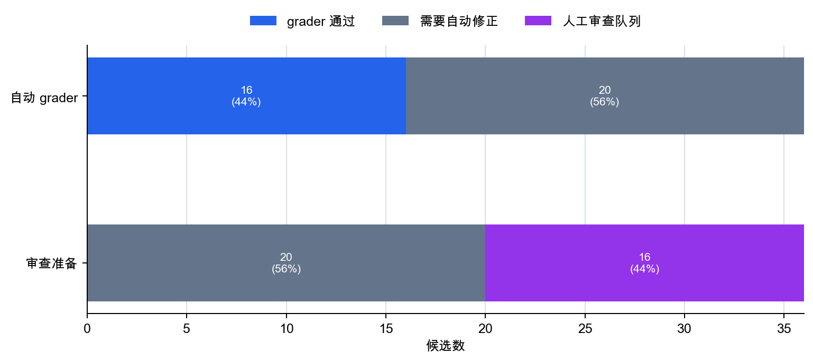

# P6-16.2 自动评估和人工评估的分工

> Section ID: `P6-16.2`
> Version: `v2026.07.24`

_副标题：重复检查和语境判断如何在 automatic evaluation 与 human evaluation 之间分工？_

LLM 评估轴确定之后，下一个标准是不要把所有评估都用同一种方式处理。格式错误这类可以机械、反复检查的项目，容易先交给自动评估。解释、细微语气、实际帮助性这类需要语境判断的项目，仍然需要人工评估。

自动评估速度快、可重复；人工评估更擅长语境和质量感。在真实运营中，两者经常一起使用。这里被评估的对象不是 LLM 内部算法，而是模型实际产生的输出，例如回答、摘要和指引消息。

这也会连接回前面讲过的 harness 和 MCP。输出候选、输入、依据文档、工具调用记录必须留下来，自动评估才能反复检查相同条件，人也才能稍后重新读取同一次执行。换句话说，评估分工是把 LLM 输出当作可审查服务记录来处理的运营结构。

## 自动评估和人工评估的分工

核心问题是：

- 自动评估擅长什么？
- 什么仍然需要人工评估？
- 为什么经常出现两者混合的结构？

核心不是`自动评估更好，还是人更好`。即使是同一个输出，有些项目会先被自动 grader 标记为需要修正，另一些项目会进入人工审查队列。评估分工不再让一个人从头到尾阅读全部质量判断，而是把可重复的检查自动化，把模糊判断留下为人可以阅读的审查包。

| 评估项目 | 自动评估更容易处理的部分 | 人工评估仍然必须留下的部分 |
| --- | --- | --- |
| 格式符合度 | JSON 格式、必需字段、长度限制、来源存在 | 即使格式有效，阅读顺序是否真的自然 |
| 依据性 | 来源链接、引用位置、禁止的无依据表达检测 | 被引用句子是否真的支撑回答结论 |
| 帮助性 | 必需项存在、下一步行动措辞 | 用户是否真的能理解下一步行动 |
| 安全性 | 禁止表达、风险关键词、政策违规候选 | 是否仍有语境误解或过度自信 |

因此，中心问题是`同一组评估轴应该怎样分给自动 grader 和人工审查`。

## 区分重复检查和语境判断

你应该能够解释自动评估和人工评估的区别，区分可重复性和语境判断，说明为什么运营中会混用两者，并把评估结果分成需要自动修正的候选和需要人工审查的候选。

与其记住很长的定义，不如用一个标准判断：为什么同一个回答会分支为`先被自动 grader 阻断`、`送入人工审查队列`，或`留下为审查包`。

| 首先看到的回答状态 | 后续评估路径 | 为什么这样分流 |
| --- | --- | --- |
| 格式错误、缺少必需字段、基础标准失败 | 需要自动修正 | 这是人阅读完整回答前应先修正的机械失败。 |
| 格式有效，但解释、细微语气或风险判断模糊 | 人工审查队列 | 仅靠自动检查无法完整读取误解风险和帮助性。 |
| 自动标准通过，但仍有语境判断 | 人工审查包 | 必须把输出候选和审查问题打包，让人按语境重读。 |

这张表让评估分工更容易被理解为`这个候选应该停在哪里、走向哪里`的分支结构，而不是比较谁更好。

## 自动评估擅长什么

自动评估通常擅长：

- 快速重复
- 比较大量样本
- 检测回归
- 检查格式
- 检查标准明确的项目

例如，它适合检查：

- JSON 格式是否有效
- 必需字段是否存在
- 检索文档来源是否附上
- 某个分数是否比上一个版本变差

`Automatic evaluation is strong at repetition and comparison.`

## 人工评估擅长什么

人工评估通常擅长：

- 理解语境
- 判断细微质量差异
- 发现别扭表达
- 判断真实工作适配度
- 判断社会风险和误解可能性

例如：

- 回答形式上有效，但实际上制造误解
- 解释很流畅，但不符合读者水平
- 有依据，但措辞过于绝对

这些只靠自动评估很容易漏掉。

`Human evaluation is better at context and nuance.`

## 为什么只有自动评估不够

当标准定义清楚时，自动评估很强，但它很难替代所有质量判断。

例如，自动评估经常可以检查：

- 文档中是否存在某个关键词
- 是否遵守格式约束
- 分数是否越过阈值

但它在判断下面这些事情时有限：

- 回答是否真的可信且可用
- 措辞是否可能误导用户
- 是否符合组织的真实目的

## 为什么只有人工评估也不够

如果评估只依赖人，也会出现其他问题。

- 速度慢。
- 成本高。
- 审查者之间标准可能不同。
- 很难频繁重复。

人工评估有深度，但随着运营规模扩大，如果没有自动化就难以持续。

## 为什么两者要一起使用

实践中，两者通常这样混合。

- 自动评估先捕捉大规模回归和格式错误。
- 人工评估检查重要样本和细微质量问题。
- 需要时再强化自动标准。

因此，自动评估和人工评估更接近分工关系，而不是彼此替代。

在运营流程中，这种分工可以更简短地读成：

| 首先检查的评估路径 | 最擅长捕捉什么 | 下一步去哪里 |
| --- | --- | --- |
| 基于固定评估集的自动 grader | 回归、格式错误、基础依据性信号 | 人工审查或需要自动修正状态 |
| 人工审查 | 模糊解释、细微语气、实际帮助性、高风险样本 | 修正、暂缓或批准决策 |

自动评估擅长`重复比较`，人工评估擅长`解释模糊候选和高风险样本`。这也是实际外部课程经常同时保留自动评估集和人工审查的原因。

部署前后，可以让同一组问题通过自动评估集，先找出回归和格式错误；同时由人工评估检查这些变化对真实用户体验意味着什么。自动评估是宽过滤器，人工评估解释剩余候选的意义。

再简化一次：

```mermaid
--8<-- "assets/part-06/chapter-16/p6-c16-s02-auto-human-routing-zh.mmd"
```

这张图的重点是，自动评估不会先完成全部判断。它减少需要人工审查的候选，并帮助更快决定最终行动。

## 画得非常简单

```mermaid
--8<-- "assets/part-06/chapter-16/p6-c16-s02-eval-decision-flow-zh.mmd"
```

这张图的重点是，实际质量判断不会只通过一条路径结束。

另一个重要点是，自动评估和人工评估的结果会成为运营判断的输入。评估分工的终点不是简单的`质量判断完成`，而更接近候选已经被分到继续或停止路径的状态。

| 评估分工留下的判断 | Operations 中再次读取的问题 |
| --- | --- |
| 自动 grader 是否通过 | 这个候选能否进入完整人工阅读？ |
| 是否需要人工审查 | 它应该走向哪条路径：修正、暂缓，还是批准？ |
| 人工审查包 | 人在重读时应该使用哪些问题？ |
| 失败或审查理由 | 失败处理应先追踪哪个原因？ |

自动和人工评估不是只说`好`或`坏`的程序。它们是把候选分到运营路径中的基线。

## 案例和例子

这些案例的重点不是`什么是正确的`，而是`哪些失败会被自动过滤，哪些失败必须由人读到最后`。

### 案例 1. 评估 RAG 回答

假设 RAG 回答同时包含来源链接和引用片段。如果链接和格式都附得很好，人们首先很容易觉得`有依据`。自动检查可以很快确认`是否有来源`和`格式是否有效`，但链接并不意味着回答真的反映了文档含义。例如，文档可能有例外条款，而回答只读了一个主句就写成`总是可以`。

这种情况下，自动检查可能通过，但实际用户指引是错的。只有人把文档和回答一起读，才会发现这种解释错误。自动评估检查`是否附了依据`，人工评估检查`依据是否被正确读取`。标准会从`是否有来源链接`变成`来源是否真的支撑解释`。

这在真实运营中很重要，因为自动检查通过会制造过多安心感。如果链接和引用格式都存在，很多团队会先觉得回答是 grounded 的。但自动检查看得好的东西，和人必须读到最后的东西并不相同。自动检查快速过滤表层结构，而例外解释和语境中的过度概括需要把来源和回答一起读。

| 回答状态 | 自动评估首先能看到什么 | 人工评估必须读到最后的内容 |
| --- | --- | --- |
| 链接和引用格式都存在 | 来源存在，格式通过 | 是否没有遗漏例外条款却做出绝对主张？ |
| 引用段落存在 | 段落引用不为空 | 段落是否真的支撑回答条件？ |
| 回答自然且简短 | 长度和格式没问题 | 缩短时是否删除了关键限制？ |

这张表要修正的误解是：只要有来源链接，解释也大多正确。

### 案例 2. 评估 agent 执行记录

即使 agent 产生了最终回答，执行记录中也可能包含重复搜索、工具调用失败、反复读取同一文档等信号。自动评估可以很快标记这些信号是否存在。但这个信号到底是问题，还是必要的确认步骤，需要人把记录一起读。

例如，如果在第一次搜索已经找到足够文档后，类似搜索仍然重复了几次，自动评估可以留下`repeated call`信号。但这次重复是不必要绕路，还是对模糊依据的必要复查，要看执行流程。标准会从`是否出现最终回答`变成`自动信号是否成为人工审查问题`。

这个案例中要检查的结果不是成本计算或运营优化本身。那个判断会在 P6-17 的运营约束中更直接处理。这里要守住的只是分工：自动评估先从执行记录收集异常信号，人工评估再按语境重读这些信号。

| 执行记录状态 | 自动评估擅长捕捉的信号 | 人工评估接下来应问的问题 |
| --- | --- | --- |
| 类似搜索重复 | repeated-call 信号 | 这是必要的依据确认，还是不必要绕路？ |
| 工具调用失败仍然存在 | failure 信号 | 它是否重复同一失败，还是通过别的路径恢复？ |
| 最终回答存在 | success flag | 成功是否隐藏了中间风险信号？ |

重要标准不是只用`成功/失败`结束 evaluation。自动评估收集异常信号，人工评估解释这些信号是否是真正质量问题。

### 案例 3. 客户支持回答

假设客户支持回答很快、没有禁用词、也遵守格式。如果自动评估全部通过，很容易觉得差不多够了。但如果实际句子听起来太冷，或把责任推给客户，服务质量仍然可能很差。反过来，即使句子礼貌，如果行动顺序别扭，客户仍然会困惑。

例如，如果回答花很长时间解释文档提交路径，然后才说是否可退款，事实可能正确，但客户仍然不理解答案。这类问题在格式检查中不容易显现；需要人来读。在客户支持场景中，自动评估是基础护栏，人工评估检查误解风险和语气质量。

| 情况 | 适合自动评估先看的目标 | 人工评估必须读到最后的内容 |
| --- | --- | --- |
| RAG 回答评估 | 来源存在、格式匹配、引用标记 | 例外条款是否被正确解释？ |
| Agent 执行记录 | repeated-call 信号、failure 信号、success flag | 信号是真正质量问题，还是必要的语境检查？ |
| 客户支持回答 | 禁用词、格式、长度、响应速度 | 语气、误解风险、下一步行动清晰度 |

## 自动评估和人工评估应该分开的场景

常见误解是偏向一边：`自动更快，所以更好`，或`人更准确，所以自动化不重要`。在真实运营中，核心是分开`什么应该先被自动过滤`和`什么必须留给人读到最后`。

| 如果你怀疑这个 | 首先要问的问题 |
| --- | --- |
| `真的需要人看这个吗？` | 它能否由自动 grader 反复检查，例如格式、长度或来源存在？ |
| `自动检查通过了，为什么仍然不安？` | 有没有人重读细微语气、误解风险和实际帮助性？ |
| `为什么有些回答立刻修正，有些送给人？` | 是否定义了 automatic-fix-needed 和 human-review-queue 的边界？ |

首先要学会的标准很简单。自动评估更擅长快速过滤`可重复的表层标准`；人工评估更擅长把`模糊解释和实际帮助性`判断到最后。在运营中，它们应该被读成分工，而不是竞争。

## 练习和例子

这个例子的目标，是通过不同检查项看到自动评估和人工评估的角色不同。我们不只看一个回答，而是比较多个 LLM 输出候选，并问：`自动评估通过重复检查先阻断什么`，以及`什么会进入人要读取的审查包`。

例子使用中文评估路由候选 CSV [p6_16_2_eval_routing_cases_zh.csv](../../../assets/part-06/chapter-16/p6_16_2_eval_routing_cases_zh.csv){ .csv-preview }。一行表示运营中可能出现的一个 LLM 输出候选。`model_output` 是候选回答，`source_marker`、`required_action`、`format_marker`、`max_length`、`banned_terms` 是自动 grader 会反复检查的标准。CSV 中不放预先写好的人类风险标签或答案标签。

自动 grader 的名称延续 P6-16.1 的评估轴。`source_marker_grader` 对应 groundedness，`required_action_grader` 对应 helpfulness，`format_grader` 和 `length_grader` 对应 format compliance，`banned_terms_grader` 对应 safety。这个映射也出现在代码的 `GRADER_AXIS_MAP` 中。

输出会显示每个候选的 code-grader 结果、可选的 LLM-as-a-judge 结果、人工审查包和路由摘要。代码中的关键点是，它不会让代码替代人工评估。代码先检查可重复的表层标准，然后为通过的候选创建候选句子和审查问题。

本地 LLM judge 只在 Ollama 运行时附加到示例候选上。这里使用 Ollama 不是为了教授某个产品工作流，而只是本地展示 LLM 也可以作为一种自动 grader 接入。传给 LLM judge 的 prompt 保持英文，并包含 `required action exists`、`banned expression absent` 等 code-grader 信号。这样可以避免 LLM judge 看起来像人工评估的替代品。它应该被读成一种参考可重复检查结果的辅助自动 grader。

要一起读取的运营判断标准是：

| 检查项 | 为什么需要 |
| --- | --- |
| 自动 grader 通过状态 | 先确认格式、长度、依据线索、禁用词等基础护栏是否通过 |
| 自动 grader 修正说明 | 把人工审查前应先做的机械修正分开 |
| 人工审查包 | 即使自动通过，也让人读取依据解释、帮助性、语气和遗漏 |
| automatic-fix-needed 状态 | 在人阅读回答前分离机械失败 |
| 路由摘要 | 清楚记录 automatic-fix-needed 和 human-review 队列如何分开 |

```python
--8<-- "assets/part-06/chapter-16/p6_16_2_eval_routing_cases_zh.py"
```

当可选本地 LLM judge 被关闭或不可用时，示例输出可以这样读取。

```text
[summary]
{'auto_fail_count': 20,
 'auto_pass_count': 16,
 'automatic_fix_first_count': 20,
 'case_count': 36,
 'human_review_queue_count': 16,
 'route_count': {'fix_with_automatic_grader_first': 20,
                 'human_review_queue': 16}}
[llm_grader]
{'available': False,
 'enabled': False,
 'model': 'llama3.2:latest',
 'note': 'Only sample cases call the optional local LLM judge to keep the '
         'example short.'}

================================================================================
case_001 / refund
automatic_grade = 1.0
auto_pass = True
grader_scores =
{'banned_terms_grader': 1.0,
 'format_grader': 1.0,
 'length_grader': 1.0,
 'required_action_grader': 1.0,
 'source_marker_grader': 1.0}
grader_fix_note = -
llm_grader =
{'available': False,
 'model': 'llama3.2:latest',
 'reason': 'Local LLM judge is disabled or not running, so this optional '
           'grader was skipped.',
 'score': None}
llm_grader_alignment = The LLM judge was not used in this run.
human_review_packet =
{'automatic_grade': 1.0,
 'candidate': '退款请求处理时间为14天。根据通知，请发送订单号，以便我们协助受理。',
 'first_focus': '自动 graders 已通过。现在由人把语境、有用性和语气读到最后。',
 'rubric': ['依据线索是否真的支持回答结论？',
            '用户是否能立刻理解下一步行动？',
            '语气或过度自信在语境中是否有风险？',
            '回答在压缩时是否遗漏了重要条件或例外？']}
route = human_review_queue
```

首先要注意，代码不是在模仿人工判断。像缺少下一步行动的 `case_002`、包含禁止表达的 `case_007` 这类候选，会在进入人工审查前停在自动 grader。相反，像 `case_001` 这样通过重复检查标准的候选，并不会立刻被批准。它会连同人可阅读的 packet 一起进入人工审查队列。

另一个要观察的值是可选 LLM judge 可用时的 `reason_source`。如果 `reason_source` 是 `llm`，说明本地 LLM judge 直接给出了理由。如果它是 `code_grader_fallback`，说明 LLM judge 的理由为空或较弱，于是 code-grader 观察会强化理由。这个区分很重要，因为 LLM judge 本身也需要被审查。自动评分不会以一个 LLM 判断结束；它会把 code-check 信号和 LLM-judge 信号一起记录下来，并为冲突留下空间。



这张图显示，第一行把候选分成自动 grader 通过和失败，第二行把失败候选送去自动修正，把通过候选送到人工审查队列。因此，`automatic pass` 不是批准结果，而是组织出来供人继续阅读的中间状态。

同一个结果可以按运营路径简要归类。

| 候选 | 首先看到的状态 | 为什么走这条路 | 后续行动 |
| --- | --- | --- | --- |
| `case_001` | 人工审查队列 | 自动 graders 通过，但依据解释、帮助性和语气仍需人工阅读。 | 打包成审查包并发送给人 |
| `case_002` | 需要自动修正 | 有通知信号，但缺少下一步行动和订单号请求。 | 修正输出候选并重新运行自动 grading |
| `case_007` | 需要自动修正 | 有必需信号，但包含`总是可以`这类禁止表达。 | 修改绝对化表达并重新运行自动 grading |

这个例子中要检查的结果，是自动评估快速检查格式、长度、依据线索、禁用词等可重复条件，而人工评估另行检查实际帮助性、误解风险、语气质量和政策例外解释。在运营中，自动 graders 不会替代最终人工判断。它们让人需要阅读的候选集合更小，也更可复现。

读者可以尝试这些调整。

- 在 CSV 的 `model_output` 中删除或添加下一步行动指引，观察 `required_action_grader` 如何变化。
- 修改 `banned_terms` 或候选措辞，观察 `banned_terms_grader` 如何变化。
- 修改 `AIBOOK_OLLAMA_MODEL`，观察可选 LLM judge 的分数、理由和 `reason_source` 如何变化。
- 调整 `max_length`，观察长度限制如何在人工审查前的自动 grader 阶段生效。
- 修改 `HUMAN_REVIEW_RUBRIC`，观察附加到自动通过候选上的审查包如何变化。

## 自动评分之后仍然保留的人工审查

前面的例子不是在代码中完整实现一个模仿人工评估的系统。它显示的是`同一个输出通过自动 graders 和人工审查包之后，会变成不同工作状态`。核心点是，增加自动检查和减少人工审查不是同一个目标。它们是用来捕捉不同失败的分工。

用一句话说，自动评估和人工评估不是`谁更优越`的关系，而是`把哪些候选应先机械修正、哪些候选应由人按语境阅读分开的运营分工`。

更重要的是，`快速过滤很多案例`和`把重要错误检查到最后`不能通过同一条审查路径解决。因此，自动和人工评估应该被读成决定候选停在哪里、往上走多远的运营分工。

这种分工重要，是因为它：

- 把 P6-16.1 的评估轴从`检查什么`扩展到`怎样检查`
- 把 evaluation 从分数表变成可审查的运营流程
- 把同一批输出候选连接到可反复审查的记录和失败处理
- 为后续验证程序设定标准

## 检查清单

- 你应该能够说明，自动评估擅长`重复和比较`，人工评估擅长`语境和细微质量判断`。
- 你应该能够说出，只靠自动评估或只靠人工评估，运营都可能摇晃，所以两者应该一起使用。
- 你应该知道，质量判断不会在这里停止，而会继续进入候选如何作为记录和审查路径留下来的问题。

## 参考资料

- OpenAI, [Getting started with datasets](https://developers.openai.com/api/docs/guides/evaluation-getting-started){: target="_blank" rel="noopener noreferrer" }, OpenAI API Docs, accessed 2026-07-24.
- OpenAI, [Graders](https://developers.openai.com/api/docs/guides/graders){: target="_blank" rel="noopener noreferrer" }, OpenAI API Docs, accessed 2026-07-24.
- OpenAI, [Evaluate agent workflows](https://developers.openai.com/api/docs/guides/agent-evals){: target="_blank" rel="noopener noreferrer" }, OpenAI API Docs, accessed 2026-07-24.
- Yupeng Chang et al., [A Survey on Evaluation of Large Language Models](https://arxiv.org/abs/2307.03109){: target="_blank" rel="noopener noreferrer" }, arXiv, 2023, accessed 2026-07-24.
