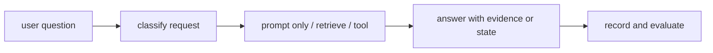
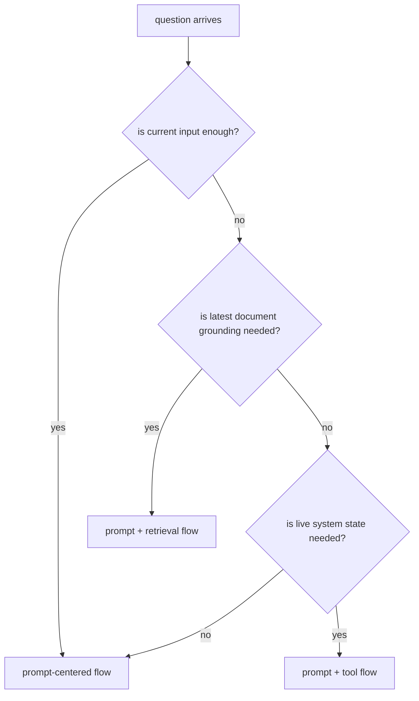

# P6-17.1 작은 생성형 AI 기능을 한 흐름으로 묶기

> Section ID: `P6-17.1`
> Version: `v2026.07.07`

P6-16장까지 오면 LLM, RAG, 도구 사용, 에이전트, 평가, 실패 대응을 각각 따로 설명할 수는 있게 됩니다. 하지만 여기서 한 번 더 중요한 질문이 남습니다.

이 개념들은 실제 요청 하나 안에서 어떻게 함께 움직이는가?

이 절은 그 질문에 답합니다.

작은 생성형 AI 기능은 `요청 해석 -> 필요한 근거 검색 또는 도구 선택 -> 모델 응답 생성 -> 간단한 평가와 기록`의 흐름으로 묶어 이해하는 편이 안전하다.

## 이 절의 범위

이 절은 다음 질문에 답합니다.

- Part 6에서 배운 개념들을 하나의 요청 흐름으로 어떻게 다시 묶을 수 있는가?
- 언제 프롬프트만으로 답하고, 언제 검색이나 도구를 붙여야 하는가?
- 작은 기능을 설계할 때 최소한 무엇을 기록해야 하는가?

이 절에서는 다음 내용을 깊게 다루지 않습니다.

- 실제 상용 모델 API의 세부 문법
- 복잡한 멀티에이전트 오케스트레이션
- 장기 메모리 저장소 설계

상용 API별 인자 차이와 배포 자동화는 이 절에서 직접 다루지 않습니다. 대신 검색과 근거 연결은 앞의 P6-10.1, P6-10.2와 P6-11.1, P6-11.2에서 이미 배운 흐름 위에 놓고, 도구 선택과 실행 연결은 P6-12.1, P6-12.2와 P6-13.1, P6-13.2에서 다시 묶어 읽습니다. 실행 기록과 평가 입력은 P6-14.2에서, 서비스 운영 제약과 실패 대응은 P6-16.1, P6-16.2에서 다시 회수합니다. 이 절은 `어떤 구조를 구현해야 하는가`를 먼저 읽는 자리입니다.

지금 읽는 층위는 `요청 흐름 통합 층위`입니다. 앞 절의 실패 대응이 `문제가 났을 때 어떤 경로로 멈추고 다시 시도할까`를 다뤘다면, 여기서는 그 판단까지 포함해 질문, 근거, 실행, 평가, 기록이 실제 요청 하나 안에서 어떻게 함께 움직이는지 읽습니다. 바로 다음 절에서는 이 통합 구조가 어떤 요청 실행 기록(run record)과 회고 포인트로 남아야 하는지로 질문이 다시 이동합니다.

요청 흐름 통합은 Part 6 본류의 `요청 구조 손잡이`로 읽고, 바로 다음 절에서 어떤 기록 층위가 더 붙는지 이어서 보면 됩니다.

| 단계 | 지금 붙잡을 질문 | 바로 이어지는 위치 |
| --- | --- | --- |
| 요청 흐름 통합 | 질문, 근거/상태, 답변, 평가를 어떤 한 요청 구조로 묶을 것인가? | P6-17.1 |
| 최소 구현과 요청 실행 기록 | 그 묶음을 어떤 출력과 기록으로 눈에 보이게 남길 것인가? | P6-17.2 |
| 프로젝트 문서와 회고 산출물 | 이 최소 기록을 더 큰 프로젝트 문서와 개선 계획으로 어떻게 키울 것인가? | P6-5.1, P6-5.2, P6-6.1, P6-7.1 |

즉, 이 절의 핵심은 `실패 경로를 고른다`에서 `그 판단까지 포함한 요청 하나의 구조를 묶는다`로 관점이 바뀌는 데 있습니다. 바로 다음 절에서는 그 구조를 요청 실행 기록과 회고 포인트로 남깁니다.

이 절은 Part 6에서 작은 생성형 AI 요청 흐름을 대표로 설명하는 Section입니다. 질문, 근거, 실행, 평가를 한 요청 단위로 묶는 기준을 여기서 세우고, 요청 실행 기록(run record)의 기본 뜻과 대표 기록 형태는 바로 다음 P6-17.2와 개념사전을 기준으로 다시 연결합니다.

특히 여기서는 평가와 운영에서 만든 판단이 실제 요청 기록으로 어떻게 내려오는지도 같이 붙잡아야 합니다.

| 앞 절에서 이미 만든 판단 | 지금 요청 흐름 안에 넣어야 하는 것 | 바로 다음 절에서 남길 대표 기록 |
| --- | --- | --- |
| 자동 게이트와 사람 검토 결과 | 이 답을 바로 채택할지, 추가 확인으로 돌릴지 | 답 상태, 사람 검토 필요 여부, 검토 요약 |
| retry, fallback, stop, approval 판단 | 실패가 났을 때 어떤 경로를 탔는지 | 다음 조치, 장애 기록, 실행 메모 |
| 검색·도구·상태 확보 결과 | 어떤 근거와 어떤 실행을 바탕으로 답했는지 | 근거 문서 목록, 선택 근거, 실행 기록 |

앞 절의 운영 한도 판단까지 같은 표에 얹어 다시 보면, 요청 흐름 통합이 왜 `좋은 답 생성`보다 `판단과 기록을 한 요청에 묶는 일`에 가까운지 더 분명해집니다.

| 앞 절까지에서 이미 생긴 판단 | 지금 요청 흐름 안에서 바로 바뀌는 것 | 같은 요청 실행 기록에 함께 남길 값 |
| --- | --- | --- |
| 운영 후보로 유지하기 어렵다는 판단이 나온 경우 | 경량 경로, fallback, 사람 검토로 바로 갈지 정한다 | 다음 조치, 장애 기록, 운영 요약 |
| 지연 시간이 주된 제약으로 드러난 경우 | 답 길이 축소, 검색 단계 축약, 간단 답 우선 반환 여부를 정한다 | 다음 조치, 실행 메모, 응답 시간 |
| 비용이 주된 제약으로 드러난 경우 | 검색 수, 호출 수, 모델 크기를 줄일지 정한다 | 실행 기록, 비용 요약, 운영 요약 |
| 처리량이 주된 제약으로 드러난 경우 | 캐시, 큐, 처리량 제한 경로를 쓸지 정한다 | 장애 기록, 운영 메모, 운영 요약 |

## 이 절의 목표

- 작은 생성형 AI 기능을 요청 흐름으로 설명할 수 있습니다.
- 프롬프트만으로 처리할 일과 검색·도구가 필요한 일을 구분할 수 있습니다.
- 입력, 근거, 출력, 평가, 기록을 하나의 설계 문장으로 묶을 수 있습니다.
- 다음 절의 최소 구현 예제를 더 쉽게 읽을 수 있습니다.

## 이 절을 읽는 순서

이 절은 다음 순서로 읽으면 Part 6의 개념이 덜 흩어집니다.

1. 먼저 한 요청이 어떤 단계로 흐르는지 읽습니다.
2. 그다음 언제 prompt만으로 충분하고, 언제 retrieval이나 tool이 필요한지 구분합니다.
3. 사례와 설계 문장에서는 `질문 종류에 따라 구조가 어떻게 달라지는가`를 확인합니다.

## 어떤 기능을 예로 들 것인가

이 절에서는 `사내 문서 기반 휴가 정책 안내 도우미`를 예로 듭니다. 사용자가 `이번 달에 입사한 직원도 여름휴가를 바로 쓸 수 있나요?`라고 물으면, 겉으로는 단순한 질문 응답처럼 보일 수 있습니다. 하지만 실제로는 현재 규정 문서를 찾아야 하고, 경우에 따라서는 `내 잔여 휴가는 며칠인가요?`처럼 시스템 조회까지 이어질 수 있습니다. 또 답변 뒤에는 어떤 문서를 근거로 썼는지와, 문서를 못 찾았는지까지 남겨야 다음 수정이 가능합니다. 그래서 이 예는 Part 6에서 다룬 프롬프트, 검색, 도구 사용, 평가와 기록을 한 요청 안에서 함께 묶어 보기 좋습니다.

이 사례를 고른 이유는 `prompt만으로 닫히는 질문`, `retrieval이 필요한 질문`, `현재 상태 조회까지 필요한 질문`을 한 흐름 안에서 나란히 비교하기 쉽기 때문입니다. 또한 근거 문서 선택, 실패 기록, 사람 검토 전환 같은 운영 판단도 같은 예에서 자연스럽게 드러낼 수 있습니다. 이 절의 목적은 특정 인사 도메인을 자세히 설명하는 것이 아니라, 작은 생성형 AI 기능이 어떤 구조로 묶여야 하는지 보여 주는 데 있습니다.

## 한 요청 흐름으로 그리면

방금 본 질문을 처리하는 가장 단순한 흐름은 다음과 같습니다.

1. 질문이 어떤 종류인지 읽는다.
2. 최신 규정이 필요한 질문인지 판단한다.
3. 필요하면 관련 문서를 검색한다.
4. 답변을 만들고 근거를 함께 붙인다.
5. 애매하거나 누락이 있으면 사람 확인 또는 추가 질문으로 넘긴다.

이 다섯 단계만 있어도 이미 단순 프롬프트 예제와는 다른 구조가 됩니다.

이 흐름을 한 번 더 단순화하면 다음과 같습니다.

이 그림의 핵심은 작은 기능도 `질문 분류`, `근거 또는 상태 확보`, `답변`, `기록`의 흐름으로 읽어야 한다는 점입니다.

Part 6 뒤쪽 본류는 여기서 `좋은 답 판정`과 `실패 시 운영 경로 선택`을 `질문, 근거/상태, 답변, 평가, 기록을 한 요청 흐름으로 묶는 일`로 닫습니다.

## 언제 프롬프트만으로 충분한가

프롬프트만으로 충분한 경우는 주로 다음과 같습니다.

- 문장 다듬기
- 요약 형식 바꾸기
- 이미 입력된 자료 안에서 답하기
- 창의적 초안 작성

이 경우에는 모델이 `현재 입력 안의 정보`만으로도 작업을 수행할 수 있습니다.

예를 들어:

- 메일 문장을 더 공손하게 바꾸기
- 이미 붙여 둔 회의록을 세 문장으로 요약하기

같은 일은 검색이나 도구 호출 없이도 시작할 수 있습니다.

## 언제 검색이 필요한가

다음 조건이 붙으면 검색이 필요해집니다.

- 최신 규정이 중요하다
- 문서 근거를 함께 보여 줘야 한다
- 긴 내부 문서를 그대로 프롬프트에 다 넣기 어렵다
- 모델의 내부 기억보다 현재 저장소의 문서가 더 신뢰할 만하다

휴가 정책 안내 도우미는 여기에 해당합니다. `정답처럼 보이는 일반론`보다 `현재 회사 문서의 실제 규정`이 더 중요하기 때문입니다.

즉, 이런 경우에는 `말투를 더 잘 만드는 문제`가 아니라 `현재 문서를 정확히 찾아 근거와 함께 답하는 문제`로 읽어야 합니다.

`모델이 답을 잘 쓰는 능력`과 `올바른 근거를 가져오는 능력`은 같은 문제가 아니다.

## 언제 도구 사용이 필요한가

검색만으로 충분하지 않은 경우도 있습니다.

예를 들어 사용자가:

- 남은 휴가 일수 조회
- 승인 상태 확인
- 신청 양식 생성

을 요청한다면, 이제는 문서 검색만으로는 부족합니다.

이 경우에는 실제 시스템에서 값을 읽거나 작업을 수행하는 도구가 필요합니다.

즉, 검색은 `무엇이 규정인가`를 확인하는 데 가깝고, 도구 사용은 `현재 상태에서 무엇을 실행하거나 조회할 것인가`를 다루는 데 가깝습니다.

## 작은 기능도 최소 평가가 필요하다

작은 기능이라고 해도 답변 하나만 보고 끝내면 개선이 어렵습니다.

최소한 다음 네 가지는 남기는 편이 좋습니다.

| 기록 항목 | 왜 필요한가 |
| --- | --- |
| 사용자 질문 | 어떤 요청을 처리했는지 남기기 위해 |
| 검색 또는 도구 사용 여부 | 실패 원인을 나중에 구분하기 위해 |
| 최종 답변 | 출력 품질을 다시 보기 위해 |
| 근거 또는 실패 이유 | 틀린 답과 시스템 문제를 구분하기 위해 |

이 네 가지는 Part 6 뒤쪽의 평가와 실패 대응 설명을 실제 설계로 끌어오는 최소 장치입니다.

| 지금 설계 문장에서 먼저 붙잡을 것 | 바로 다음 절에서 남길 최소 기록 | P6-5.1, P6-5.2, P6-6.1, P6-7.1에서 다시 자라는 산출물 |
| --- | --- | --- |
| 질문과 검색 경로 | 질문별 요청 실행 기록, 근거 문서 목록, 문서별 점수 | 검색 기록, 선택 근거, 실행 기록 |
| 답변 채택 여부와 사람 검토 필요 | 사람 검토 필요 여부, 실행 상태 | 검토 요약, 답 상태, 장애 기록 |
| 여러 질문을 돌린 뒤의 전체 회고 | 전체 요약 | 개선 계획, 프로젝트 회고 문서 |

핵심은 생성형 AI 기능을 `모델 호출 한 번`으로만 그리지 않는 데 있습니다. 요청을 읽고, 필요한 근거나 상태를 확보하고, 답변과 기록까지 하나의 구조로 봐야 합니다.

## 사례로 보기

앞에서 본 `prompt 중심`, `retrieval 결합`, `tool use 결합` 구분을 실제 기능 장면으로 다시 묶으면 다음처럼 읽을 수 있습니다.

이 사례들의 초점은 `생성형 AI를 쓴다`가 아니라 `이 질문은 어떤 구조를 붙여야 닫히는가`입니다.

### 사례 1. 문장 다듬기

입력된 안내 문장을 더 공손하게 다듬는 기능을 생각해 볼 수 있습니다. 사람은 생성형 AI 기능이면 검색이나 도구가 항상 붙어야 한다고 느끼기 쉽지만, 이 경우 먼저 확인할 것은 `현재 문장 자체`이고 외부 문서나 실시간 시스템 값은 필요하지 않을 수 있습니다. 예를 들어 `서류를 다시 제출하세요`를 더 부드럽게 바꾸는 작업은, 최신 규정을 찾는 문제가 아니라 이미 주어진 문장을 어떻게 표현하느냐의 문제입니다. 이때 검색까지 붙이면 오히려 관련 없는 규정 문구가 섞여 원래 문장보다 길고 딱딱한 답이 나올 수 있습니다. 그래서 핵심 구조는 좋은 지시와 예시를 넣는 프롬프트 쪽에 더 가깝습니다. 즉, 바꿔야 할 대상이 이미 입력 안에 다 들어 있으면 prompt 중심 구조로 충분할 수 있습니다. 여기서 바뀌는 점은 `생성형 AI면 검색도 붙어야 하는가`를 보던 기준에서 `현재 입력만으로 작업이 닫히는가`를 보는 기준으로 이동한다는 것입니다. 그래서 이 사례에서 확인해야 할 결과는 검색 없이도 입력 문장 자체만으로 원하는 표현 수정이 충분히 닫히는가입니다.

### 사례 2. 사내 정책 안내

사내 정책 안내 챗봇을 생각해 보겠습니다. 사람은 `휴가 신청은 며칠 전까지 해야 하나요?`나 `육아휴직 신청 순서는 어떻게 되나요?` 같은 질문을 보면 모델이 바로 답을 써 주면 된다고 느끼기 쉽습니다. 하지만 이런 질문은 말투보다 최신 규정 문서를 정확히 가져오는 일이 먼저입니다. 예를 들어 지난 분기 규정에는 `3일 전`이라고 되어 있었는데 최신 규정은 `5영업일 전`으로 바뀌었다면, 프롬프트만 잘 써도 내부 기억만으로는 최신 기준을 보장하기 어렵습니다. 정책은 바뀔 수 있으므로, 말투가 자연스러운 답보다 최신 문서를 먼저 찾고 근거 문장을 붙이는 구조가 더 중요합니다. 이 경우 핵심 구조는 검색으로 최신 문단을 붙이고 그 근거를 바탕으로 답을 정리하는 쪽에 가깝습니다. 여기서 바뀌는 점은 `답을 바로 잘 쓰는가`를 보던 기준에서 `최신 규정 근거를 실제로 가져오는가`를 보는 기준으로 이동한다는 것입니다. 그래서 이 사례에서 확인해야 할 결과는 최신 문단을 붙였을 때 답이 말투보다 규정 근거 정확성 쪽에서 실제로 더 안정되는가입니다.

### 사례 3. 잔여 휴가 조회

잔여 휴가 조회는 한 단계 더 다릅니다. 정책 문서만 읽어서는 `연차는 어떤 기준으로 계산되는가`는 설명할 수 있어도, `내 계정에 실제로 며칠이 남았는가`는 알 수 없습니다. 사람은 정책을 찾았으니 답도 끝났다고 느끼기 쉽지만, 이 질문을 닫으려면 규정뿐 아니라 인사 시스템 값 조회가 필요하다는 점을 바로 구분해야 합니다. 예를 들어 정책상 연차 계산식은 알아도, 이미 사용한 일수와 승인 대기 휴가까지 반영된 현재 잔액은 시스템을 조회해야만 알 수 있습니다. 그래서 이 기능은 retrieval만으로도 부족하고, 실제 상태를 읽는 tool use가 붙어야 닫힙니다. 여기서 바뀌는 점은 `규정 설명이 가능한가`를 보던 기준에서 `현재 상태 값을 실제로 조회해 답을 닫을 수 있는가`를 보는 기준으로 이동한다는 것입니다. 그래서 이 사례에서 확인해야 할 결과는 규정 설명만으로는 못 닫히는 질문이 실제 시스템 조회를 붙였을 때 비로소 현재 상태 답변으로 닫히는가입니다.

세 사례를 실제 설계 판단으로 다시 줄이면 다음과 같습니다.

| 질문 형태 | 먼저 봐야 할 것 | 잘못 붙이면 생기는 문제 |
| --- | --- | --- |
| 문장 표현 수정 | 이미 입력 안에 필요한 정보가 있는가 | 불필요한 검색으로 답이 산만해짐 |
| 규정 설명 | 최신 근거 문서가 필요한가 | 오래된 기준이나 일반론으로 답함 |
| 현재 상태 조회 | 문서가 아니라 시스템 값이 필요한가 | 규정 설명만 하고 실제 상태는 못 답함 |

이 세 사례를 한 줄로 다시 정리하면 다음과 같습니다.

| 기능 유형 | 중심 구조 |
| --- | --- |
| 표현 변환 | prompt 중심 |
| 근거 기반 답변 | prompt + retrieval |
| 상태 조회/실행 | prompt + tool use |

같은 내용을 설계 선택 흐름으로 다시 그리면 다음과 같습니다.

이 도식의 핵심은 기능 구조를 모델 종류로 고르는 것이 아니라, 질문을 닫는 데 필요한 근거와 상태가 무엇인지로 고른다는 점입니다.

세 사례를 설계 선택 기준으로 다시 묶으면 다음과 같습니다.

| 질문 형태 | 먼저 필요한 것 | 너무 많이 붙였을 때 생기는 문제 |
| --- | --- | --- |
| 문장 다듬기 | 입력 문장 자체와 좋은 지시 | 불필요한 검색 때문에 답이 산만해짐 |
| 정책 안내 | 최신 근거 문서 회수 | retrieval 없이 오래된 기억에 의존함 |
| 잔여 휴가 조회 | 현재 상태 조회 도구 | 문서만 읽고 실제 잔액은 못 닫음 |

## 설계 문장으로 다시 묶기

이 절에서는 긴 설계 문서를 다 쓰기보다, 기능 하나를 다음처럼 한 문장으로 요약할 수 있으면 충분합니다.

`휴가 정책 안내 도우미는 사용자의 질문을 읽고, 관련 규정 문서를 검색한 뒤, 근거 문장을 포함한 답변을 만들고, 검색 실패나 근거 누락은 기록한다.`

이 문장 안에는 이미 다음 요소가 들어 있습니다.

- 입력
- 검색
- 출력
- 근거
- 실패 기록

즉, Part 6 전체 내용을 작은 서비스 문장 하나로 압축한 셈입니다.

같은 형식으로 앞 사례들도 다시 써 볼 수 있습니다.

- 문장 다듬기 도우미: 입력 문장을 읽고, 예시 말투를 반영해 다시 쓰고, 수정 전후 문장을 함께 남긴다.
- 정책 안내 도우미: 질문을 읽고, 최신 규정 문서를 검색한 뒤, 근거 문장을 포함해 답하고, 근거가 없으면 사람 확인으로 넘긴다.
- 잔여 휴가 조회 도우미: 질문을 읽고, 조회 도구로 현재 잔액을 확인한 뒤, 규정 문서와 함께 결과를 설명하고, 조회 실패는 기록한다.

여기까지를 한 줄로 묶으면, 작은 생성형 AI 기능 설계는 `모델을 한 번 호출한다`가 아니라 `질문 종류에 맞는 구조를 고르고, 근거와 상태를 붙여 답하고, 그 경로를 기록한다`는 문장으로 정리할 수 있습니다.

## 다음 절과의 연결

여기까지 오면 다음 질문이 남습니다.

- 이 흐름을 가장 작은 코드로 흉내 내면 어떤 모습이 되는가?
- 실제 API를 붙이기 전에도 어떤 출력과 기록을 먼저 확인할 수 있는가?

이 질문은 P6-17.2 최소 구현과 회고 포인트로 이어집니다.

## 언제 요청 흐름 통합 관점을 먼저 떠올려야 하는가

| 상황 | 먼저 떠올릴 관점 | 왜 중요한가 |
| --- | --- | --- |
| 프롬프트, 검색, 도구, 평가를 각각 설명할 수는 있는데 실제 기능 그림이 잡히지 않을 때 | 질문 하나를 끝까지 처리하는 요청 흐름으로 다시 묶어야 한다는 점 | 개별 개념을 따로 알더라도 한 요청 안에서 어떤 순서로 이어지는지 보지 않으면 실제 설계 판단이 흐려집니다. |
| 검색이 필요한 질문과 도구가 필요한 질문을 자꾸 같은 방식으로 다루려 할 때 | `근거 확보`와 `상태 조회·실행`을 다른 구조로 봐야 한다는 점 | 최신 문서가 필요한지, 현재 시스템 값이 필요한지에 따라 붙여야 할 구조가 달라집니다. |
| 다음 절의 최소 구현이 왜 필요한지 감이 오지 않을 때 | 이 절은 구조 설계, 다음 절은 그 구조를 기록 가능한 출력으로 내리는 단계라는 점 | 먼저 요청 흐름의 뼈대를 잡아야, 작은 코드가 무엇을 확인하려는지 자연스럽게 읽힙니다. |

## 이 절에서 기억할 관점

| 지금 이 절에서 정리한 것 | 바로 다음에 붙는 질문 | 이 본류 단계가 닫는 역할 |
| --- | --- | --- |
| 요청, 근거/상태 확보, 출력, 평가를 한 요청 흐름으로 다시 묶는다 | 이 흐름을 가장 작은 구현과 회고 포인트로 어떻게 내려 볼까 | Part 6 본류가 `운영 가능한 생성형 AI 흐름`으로 닫히기 시작하는 통합 단계 |

- 작은 생성형 AI 기능도 `무엇을 요청했는가`, `어떤 근거를 붙였는가`, `어떤 출력이 나왔는가`, `그 출력을 어떻게 평가할 것인가`의 흐름으로 읽어야 합니다.
- 프롬프트만으로 충분한 일과 검색·도구가 필요한 일은 다릅니다.
- 검색은 근거 확보 문제이고, 도구 사용은 상태 조회·실행 문제입니다.
- 작은 기능이라도 추적 기록과 평가 관점을 처음부터 넣는 편이 안전합니다.

여기서는 Part 6의 개념들을 `요청 -> 근거/상태 확보 -> 출력 -> 기록`의 한 흐름으로 묶습니다.

## 짧은 점검

- 작은 생성형 AI 기능을 `모델 호출 한 번`이 아니라 `질문, 근거/상태 확보, 출력, 평가, 기록`의 요청 흐름으로 설명할 수 있어야 합니다.
- 검색은 근거 확보, 도구 사용은 상태 조회·실행이라는 차이를 말할 수 있어야 합니다.
- 다음 절은 새 개념 도입이 아니라, 여기서 설계한 흐름이 실제로 어떤 출력과 실행 기록으로 남아야 하는지 확인하는 단계라는 점을 잡고 있어야 합니다.

## 언제 이 관점을 먼저 떠올려야 하는가

- Part 6의 개념을 하나의 요청 흐름으로 다시 설명할 수 있는가?
- 언제 prompt만으로 충분하고 언제 retrieval이나 tool이 필요한지 구분할 수 있는가?
- 작은 기능 설계에서 무엇을 기록해야 하는지 말할 수 있는가?
- 다음 절의 최소 구현 예제가 왜 필요한지 설명할 수 있는가?

## 출처와 참고 자료

- OpenAI, [Prompt engineering](https://developers.openai.com/api/docs/guides/prompt-engineering){: target="_blank" rel="noopener noreferrer" }, OpenAI API Docs, 확인 날짜: 2026-07-05.
- OpenAI, [Retrieval](https://developers.openai.com/api/docs/guides/retrieval){: target="_blank" rel="noopener noreferrer" }, OpenAI API Docs, 확인 날짜: 2026-07-05.
- OpenAI, [Function calling](https://developers.openai.com/api/docs/guides/function-calling){: target="_blank" rel="noopener noreferrer" }, OpenAI API Docs, 확인 날짜: 2026-07-05.
