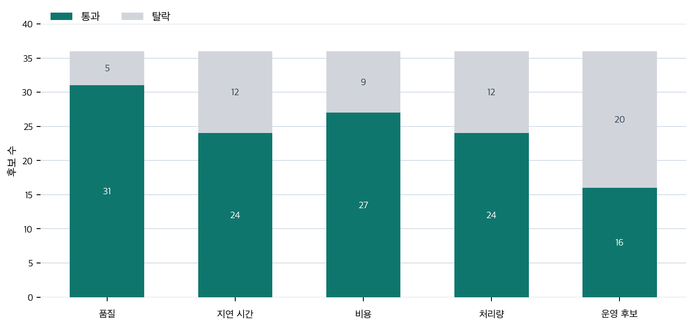

# P6-17.1 비용·지연·사용량으로 다시 거르는 운영 제약

> Section ID: `P6-17.1`
> Version: `v2026.07.31`

운영 제약은 `quality_result`, `cost_per_request`, `latency_budget`, `usage_limit`, `capacity_risk`, `deployment_decision`을 함께 기록합니다. 그래야 평가 점수가 통과해도 실제 운영 후보에서 다시 걸러질 수 있다는 점이 보입니다.

평가에서 좋은 답변 후보를 골랐더라도 서비스가 바로 성립하는 것은 아닙니다. 그 답을 사용자가 기다릴 수 있는 시간 안에, 감당 가능한 비용으로, 예상 요청량이 몰려도 반복 제공할 수 있어야 합니다. 서비스 운영 제약은 품질 평가를 통과한 후보를 실제 운영 후보로 다시 거르는 별도의 통과선입니다.

AI 서비스는 모델 품질만으로 결정되지 않고, 비용(cost), 지연 시간(latency), 사용량 제한(limit), 실패 가능성 같은 현실 제약 안에서 운영되어야 합니다. 좋은 모델이 있어도 너무 느리거나 너무 비싸거나 너무 자주 멈추면 좋은 서비스가 되기 어렵습니다.

## 운영 한도 판단이 맡는 일

핵심 질문은 다음과 같습니다.

- 왜 좋은 모델만으로는 좋은 서비스가 되지 않는가?
- 비용, 지연 시간, 사용량 제한은 어떤 식으로 문제를 만들까?
- 서비스 설계에서 무엇을 함께 타협해야 하나?

AI 서비스를 `모델 성능 문제`에만 가두면 중요한 실패를 놓칩니다. 품질 평가를 통과한 후보라도 너무 느리거나, 너무 비싸거나, 동시 요청을 견디지 못하면 운영 후보로는 다시 탈락할 수 있습니다. 따라서 이 단계의 질문은 `좋은 모델이 있는가`가 아니라 `그 좋은 답을 운영 한도 안에서 반복 제공할 수 있는가`입니다.

서비스 한도 판단은 다음 항목을 함께 봅니다.

| 운영 제약 | 묻는 질문 | 막혔을 때 먼저 조정할 것 |
| --- | --- | --- |
| 비용(cost) | 한 요청과 반복 요청의 비용이 예산 안에 있는가? | 모델 크기, 문맥 길이, 도구 호출 수 |
| 지연 시간(latency) | 사용자가 기다릴 수 있는 시간 안에 답이 오는가? | 검색 깊이, 생성 길이, 캐시, 경량 경로 |
| 처리량(throughput)과 용량(capacity) | 예상 요청량을 동시에 감당할 수 있는가? | 큐, 캐시, rate limit, 인프라 한도 |
| 복구 가능성 | 무거운 주 경로가 막힐 때 대체 경로가 있는가? | fallback 답변, 부분 응답, 사람 전환 |

즉, `평가 통과`와 `운영 후보 통과`는 같은 말이 아닙니다. 평가가 답의 품질 축을 가른다면, 운영 한도 판단은 그 품질을 반복 제공할 수 있는지를 다시 가릅니다.

이 단계에서 먼저 남겨야 할 판단은 어떤 운영 한도 때문에 후보가 막혔는지, 다음에 어디부터 조정해야 하는지, 그리고 평가를 통과한 답이 실제 운영 후보로 남을 수 있는지를 함께 보여 주는 운영 판단입니다.

이 판단은 실패 대응과 실제 요청 기록의 입력이 됩니다.

| 운영 한도 판단에서 남기는 것 | 갈라지는 운영 경로 | 요청 기록으로 남길 대표 값 |
| --- | --- | --- |
| 지연 시간이 주된 제약으로 드러난 경우 | timeout 기준 조정, 경량 경로, fallback 검토 | 다음 조치, 장애 메모, 실행 메모 |
| 비용이 주된 제약으로 드러난 경우 | 호출 수 축소, 작은 모델, 단계 축약 검토 | 다음 조치, 실행 기록, 비용 요약 |
| 처리량이 주된 제약으로 드러난 경우 | 큐, 캐시, 처리량 제한 경로 검토 | 다음 조치, 장애 메모, 운영 메모 |
| 운영 후보로 유지 가능한 경우 | 운영 후보 유지 | 상태 요약, 운영 요약, 요청 실행 기록 |

즉, 운영 한도 판단은 한 번 보고 끝나는 판정표가 아니라, 실패 대응 분기와 요청 흐름 기록의 입력값입니다.

## 평가 통과와 운영 가능성의 구분

이 구분을 붙잡으면 AI 서비스 제약을 단순한 운영 용어가 아니라, 비용, 지연 시간, 사용량 제한이 품질과 어떻게 충돌하는지 보는 판단 기준으로 읽을 수 있습니다. 또한 운영 한도를 넘겼을 때 바로 실패 대응 경로로 넘겨야 하는 이유도 함께 보입니다.

먼저 가를 장면은 아래처럼 정리할 수 있습니다.

| 먼저 보인 막힘 | 먼저 떠올릴 질문 | 왜 이 질문이 먼저 필요한가 |
| --- | --- | --- |
| 답 품질은 괜찮은데 사용자가 체감하기엔 너무 느리다 | latency가 허용 범위를 넘었는가? | 품질 통과와 서비스 체감 통과는 다르므로, 먼저 기다릴 수 있는 시간 안의 답인지 따로 봐야 하기 때문입니다. |
| 잘 작동하긴 하는데 호출 수가 늘수록 운영 부담이 급격히 커진다 | cost가 반복 운영 예산을 넘기고 있는가? | 한 번의 성공이 아니라 계속 돌릴 수 있는가가 서비스 판단이므로, 비용은 품질과 별도로 먼저 봐야 하기 때문입니다. |
| 한두 번은 괜찮지만 요청이 몰리면 갑자기 무너진다 | capacity와 처리량 한도가 먼저 막히는가? | 데모 성공과 반복 요청 운영은 다르므로, 동시 요청에서 버티는지 먼저 가르지 않으면 병목을 놓치기 쉽기 때문입니다. |
| 답 품질을 높이려고 단계를 늘렸더니 전체 경로가 너무 무거워졌다 | 처리 깊이를 줄이거나 fallback 경로로 나눠야 하는가? | 더 많은 단계가 항상 더 좋은 서비스는 아니어서, 운영 한도 안에서 어느 깊이까지 허용할지 먼저 판단해야 하기 때문입니다. |

이 표를 기준으로 아래 내용을 읽으면, 서비스 운영 제약을 `운영 용어 목록`보다 `평가를 통과한 답이 왜 실제 서비스 후보에서 다시 탈락하는가를 가르는 기준`으로 더 직접 읽을 수 있습니다.

## 왜 모델 품질만으로는 부족한가

좋은 답을 만들 수 있는 모델이 있다고 해도, 실제 서비스는 속도, 비용, 처리량, 안정성을 함께 만족해야 합니다. 그래서 질문은 `잘 되나?`에서 `계속 운영 가능한가?`로 이동합니다.

- 충분히 빠르게 응답해야 함
- 너무 비싸지 않아야 함
- 많은 요청을 감당할 수 있어야 함
- 장애가 나도 완전히 멈추지 않아야 함

즉, 서비스는 `정답 품질`만이 아니라 `운영 가능성`까지 포함한 문제입니다.

## 비용(cost)은 왜 큰 문제인가

AI 서비스는 보통 호출마다 비용이 생기거나, 자체 운영 시에는 인프라 비용이 생깁니다. 특히 다음이 함께 늘어나면 부담이 커집니다.

- 긴 입력 문맥
- 긴 출력
- 더 큰 모델
- 더 많은 도구 호출
- 더 많은 재시도

`AI 에이전트 구조와 RAG 구조는 품질을 높일 수 있지만, 호출 단계가 늘어날수록 비용도 함께 커질 수 있다.`

여기서는 `더 많은 기능 = 항상 더 좋은 선택`이 아니라는 점이 먼저 중요합니다.

## 지연 시간(latency)은 왜 중요하나

사용자는 단순히 `맞는 답`만 원하는 것이 아니라, `기다릴 수 있는 시간 안의 답`도 원합니다.

예를 들어:

- 문서 검색
- 모델 생성
- 도구 호출
- 후처리

가 모두 이어지면 지연 시간이 누적될 수 있습니다.

이때 서비스는 다음 질문을 던져야 합니다.

- 모든 단계를 꼭 매번 다 수행해야 하는가?
- 어느 단계는 캐시할 수 있는가?
- 어느 정도 느림까지 허용 가능한가?

즉, latency는 기술 문제가 아니라 사용자 경험 문제이기도 합니다.

같은 답이라도 2초 안에 오는 답과 20초 뒤에 오는 답은 서비스 경험이 다릅니다. 따라서 latency는 정확도보다 덜 중요해 보이지만, 실제 사용에서는 서비스 채택을 크게 좌우할 수 있습니다.

## 사용량 제한(limit)과 용량(capacity) 문제

서비스가 커지면 요청량도 커집니다. 이때 다음 문제가 생길 수 있습니다.

- 분당 요청 수 제한
- 동시 처리 수 제한
- 모델 공급자 API 제한
- 내부 인프라 병목

다음처럼 볼 수 있습니다.

`좋은 데모와 운영 가능한 서비스는 다르다. 데모는 한 번 잘 되면 되지만, 서비스는 반복 요청을 견뎌야 한다.`

이 한 줄은 독자에게 특히 중요합니다. 많은 AI 데모가 인상적이어도, 실제 서비스로 옮기면 동시 요청과 비용 문제가 먼저 드러나기 때문입니다.

## 품질과 제약은 왜 같이 봐야 하나

이 지점이 중요합니다.

더 큰 모델을 쓰면 품질이 좋아질 수 있습니다. 하지만:

- 비용이 커지고
- 지연 시간이 늘고
- 운영 복잡도가 증가할 수 있습니다

반대로 더 작은 모델을 쓰면:

- 응답은 빨라질 수 있지만
- 품질이나 안정성이 낮아질 수 있습니다

따라서 서비스 설계는 보통 다음 균형 문제에 가깝습니다.

`어느 정도 품질을, 어느 정도 비용과 속도로, 어떤 사용량 범위에서 제공할 것인가?`

같은 서비스 흐름으로 다시 정리하면 다음과 같습니다.

| 높이고 싶은 것 | 함께 늘어날 수 있는 부담 |
| --- | --- |
| 더 큰 모델 | 비용, 지연 시간 |
| 더 많은 검색 문서 | 비용, 문맥 길이, 처리 시간 |
| 더 많은 도구 호출 | 실패 지점, 운영 복잡도 |

이 기준을 배포 후보 판단으로 더 짧게 줄이면 다음 체크리스트가 먼저 보여야 합니다.

| 배포 후보로 남기기 전에 다시 볼 것 | 왜 다시 봐야 하는가 |
| --- | --- |
| 품질 평가를 통과했는가 | 좋아 보이는 답이 실제 기준을 넘는지 먼저 확인해야 하기 때문입니다. |
| latency가 허용 범위 안인가 | 맞는 답도 너무 늦으면 서비스로는 실패할 수 있기 때문입니다. |
| cost가 호출 예산 안인가 | 한 번의 성공이 반복 운영 비용을 견딜 수 있어야 하기 때문입니다. |
| capacity를 버틸 수 있는가 | 데모 성공과 반복 요청 운영은 다른 문제이기 때문입니다. |
| fallback이나 경량 경로가 있는가 | 주 경로가 무거울 때 완전히 멈추지 않아야 하기 때문입니다. |

즉, `평가 통과`와 `운영 후보 통과`는 같은 말이 아닙니다. 외부 실무형 자료가 LLMOps나 serving을 별도 모듈로 두는 이유도 바로 이 차이를 분리해서 보기 위해서입니다.

## RAG와 AI 에이전트 구조에서는 왜 더 복잡해지나

단순 채팅보다 RAG와 agent는 단계가 많습니다.

- 검색
- 문서 정리
- 모델 생성
- 도구 호출
- 재시도

이 단계가 늘수록:

- 호출 수가 늘고
- 실패 가능성이 늘고
- 지연 시간이 누적되며
- 로그와 평가 비용도 커집니다

즉, 구조가 강해질수록 운영 제약도 강해집니다.

프롬프트만 쓰는 단순 구조에서는 제약이 비교적 단순합니다. 하지만 RAG와 AI 에이전트가 붙으면 `좋은 답을 만들기 위한 단계`와 `그 단계를 유지하는 운영 부담`이 함께 늘어난다는 점이 이 절의 핵심입니다.

이 흐름을 한 번 더 단순화하면 다음과 같습니다.

```mermaid
--8<-- "assets/part-06/chapter-17/p6-c17-s01-service-constraint-flow-ko.mmd"
```

이 그림의 핵심은 품질을 올리는 선택이 종종 더 많은 단계와 운영 부담을 함께 데려온다는 점입니다.

## 사례 및 예시

이 사례들의 초점은 `좋아 보이는가`보다 `운영 제약 안에서 계속 제공 가능한가`입니다.

### 사례 1. 고객 지원 챗봇

고객 지원 챗봇이 매번 긴 정책 문서를 모두 검색하고, 긴 답변까지 항상 생성한다고 해 봅시다. 사람은 처음에 `더 많이 읽고 더 길게 답하면 더 좋은 챗봇이겠지`라고 생각할 수 있습니다. 이렇게 하면 겉보기에는 더 자세하고 정확한 답이 나올 수 있습니다. 하지만 고객은 비밀번호 재설정처럼 단순한 질문에도 몇 초씩 기다려야 하고, 실제 체감은 `똑똑하지만 느린 챗봇`으로 남을 수 있습니다.

예를 들어 배송 조회처럼 짧게 끝낼 수 있는 질문에도 매번 긴 정책 설명을 붙이면, 정확도는 높아 보여도 사용자는 답이 늦고 과하다고 느낄 수 있습니다. 결국 일부 사용자는 답을 끝까지 읽지 않고 이탈할 수 있습니다. 사람이 운영에서 먼저 보게 되는 문제는 품질만이 아니라 `이 속도를 고객이 견딜 수 있는가`입니다. 그래서 이 사례에서 확인해야 할 결과는 답 품질 상승과 별개로 응답 시간이 실제 사용 경험을 해치지 않고, 짧은 질문에서는 과도한 처리 없이도 답이 닫히는가입니다.

이 사례가 실제 운영 장면인 이유는 고객이 느끼는 품질이 `정확도` 하나로만 정해지지 않기 때문입니다. 짧은 질문에 지나치게 오래 걸리거나, 꼭 필요하지 않은 긴 답이 붙으면 사용자는 똑똑함보다 지연과 피로를 먼저 체감합니다. 그래서 운영자는 `더 많이 읽고 더 길게 답했다`는 사실보다 `질문 난이도에 비해 처리 깊이가 과하지 않은가`를 먼저 점검해야 합니다. 복잡한 정책 질문과 단순 상태 조회 질문을 같은 깊이로 처리하면, 전체 체감 품질은 오히려 떨어질 수 있습니다.

같은 챗봇도 운영 판단 기준은 아래처럼 달라집니다.

| 질문 장면 | 먼저 내리기 쉬운 판단 | 운영에서 다시 확인해야 하는 것 |
| --- | --- | --- |
| 비밀번호 재설정 같은 단순 질문 | 자세히 설명하니 더 좋다 | 짧은 질문에 과도한 검색과 장문 답변이 붙지 않았는가 |
| 배송 조회처럼 상태 확인이 핵심인 질문 | 정책도 함께 붙여 주니 친절하다 | 답이 빨리 닫히고 필요한 상태값이 먼저 보이는가 |
| 예외 조항이 많은 정책 질문 | 문서를 많이 읽었으니 안전하다 | 복잡한 질문에서만 깊은 처리와 긴 답변이 선택되는가 |

이 표가 바로잡는 오해는 `더 많은 처리 = 항상 더 좋은 서비스`라는 생각입니다. 실제 운영에서는 질문 종류별로 처리 깊이와 답변 길이를 다르게 가져갈 수 있어야 하고, 그렇지 않으면 높은 품질 시도 자체가 서비스 이탈 요인이 될 수 있습니다.

### 사례 2. 개발 보조 도구

개발 보조 도구가 코드를 고치기 전에 파일 탐색, 검색, 테스트, 재시도를 모두 수행한다고 해 봅시다. 이렇게 하면 한 번의 수정 성공률은 올라갈 수 있습니다. 하지만 호출 단계가 늘어날수록 토큰 비용과 실행 시간도 함께 커지고, 작은 변수명 수정 하나에도 전체 테스트를 반복하면 사용자는 `정확하긴 한데 너무 무겁다`고 느낄 수 있습니다.

예를 들어 문자열 오탈자 하나를 고치는 데 전체 통합 테스트를 매번 돌리면, 안전성은 높아도 일상 사용성은 크게 떨어질 수 있습니다. 더 나아가 팀 전체가 이런 흐름을 반복하면 인프라 비용도 빠르게 커질 수 있습니다. 이 장면에서 중요한 질문은 `더 많이 하면 더 좋아지는가`가 아니라 `품질 향상을 위해 든 비용이 감당 가능한가`입니다. 그래서 이 사례에서 확인해야 할 결과는 수정 성공률뿐 아니라 실행 시간과 비용이 일상 사용 범위 안에 남는가입니다.

개발 보조 도구는 보통 `실패를 줄이기 위해` 더 많은 검사와 재시도를 붙입니다. 그런데 작업 크기와 상관없이 같은 무게의 절차를 돌리면, 도구는 안전해지는 대신 일상적으로 쓰기 어려워집니다. 변수명 하나 바꾸는 일과 빌드 설정을 넓게 고치는 일은 원래 위험도가 다른데, 둘 다 같은 수준의 전체 테스트와 다단계 검증을 거치면 팀은 곧 `이 도구는 중요한 때만 쓰자`고 느끼게 됩니다. 즉 운영 기준에서는 성공률과 함께 `수정 종류별 검사 강도`가 맞는지도 봐야 합니다.

이 차이를 더 짧게 비교하면 다음과 같습니다.

| 수정 장면 | 많이 돌렸을 때 좋아 보이는 점 | 운영에서 다시 따져야 하는 비용 |
| --- | --- | --- |
| 변수명 변경, 문자열 오탈자 수정 | 실수 가능성이 더 줄어든다 | 작은 작업에도 전체 테스트를 반복해 지연과 비용이 커짐 |
| 함수 시그니처 변경 | 더 넓은 검증이 안전성을 높인다 | 이 경우는 높은 검사 강도가 오히려 정당화될 수 있음 |
| 여러 파일 리팩터링 | 재시도와 검색이 품질에 실제로 기여할 수 있음 | 호출 횟수와 재시도 횟수 상한을 별도로 둬야 함 |

이 사례에서 중요한 기준은 `정확하니 무조건 좋다`가 아니라, `정확도를 높이기 위해 지불한 시간과 비용이 작업 크기에 비례하는가`입니다. 개발 보조 도구는 품질만 보는 데모 단계와, 반복 사용 가능한 운영 단계에서 통과 기준이 달라집니다.

### 사례 3. 사내 문서 질의응답

사내 문서 질의응답에서 정확도를 높이려고 관련 문서를 가능한 한 많이 붙인다고 해 봅시다. 하지만 실제로는 비용과 지연 시간이 늘고, 너무 많은 문단이 들어오면 핵심 문장이 묻혀 오히려 답변이 흐려질 수 있습니다. 예를 들어 환불 규정 질문에 열 개 문서를 모두 붙이면, 정작 핵심 예외 조항보다 덜 중요한 일반 안내가 더 많이 보일 수 있습니다.

이 경우 답변은 길어졌는데도 사용자가 정말 궁금했던 한 줄 기준은 더 늦게 드러날 수 있습니다. 즉, 더 많은 근거가 항상 더 좋은 답으로 이어지는 것은 아닙니다. 여기서 바뀌는 점은 `얼마나 많이 붙였는가`를 먼저 보던 기준에서 `질문에 필요한 근거를 얼마나 정확히 골랐는가`를 먼저 보게 되는 기준으로 이동한다는 것입니다. 그래서 이 사례에서 확인해야 할 결과는 붙인 문서 수보다 핵심 예외 조항이 실제 답변 안에 먼저 살아남는가입니다.

세 사례를 운영 제약 관점으로 정리하면 다음과 같습니다.

| 상황 | 성능을 올리려다 커지는 운영 부담 | 다시 조정해야 하는 기준 |
| --- | --- | --- |
| 고객 지원 챗봇 | 긴 검색과 긴 답변으로 지연 시간이 커짐 | 질문 난이도별 처리 깊이, 응답 시간 |
| 개발 보조 도구 | 테스트·재시도·도구 호출로 비용이 커짐 | 작업 크기별 검사 강도, 실행 예산 |
| 사내 문서 질의응답 | 문서를 너무 많이 붙여 비용과 잡음이 커짐 | top-k, 문서 선택 정확도, 답변 길이 |

## 운영 후보에서 다시 걸러야 하는 장면

운영 제약을 처음 읽을 때 자주 생기는 오해는 `평가를 통과했으니 이제 배포해도 된다`고 바로 생각하는 점입니다. 하지만 실제 서비스 후보 판단에서는 `좋은 답`과 `계속 감당 가능한 답`을 한 번 더 분리해서 봐야 합니다. 이 기준을 실무 질문으로 바꾸면 다음처럼 읽을 수 있습니다.

| 이런 의심이 들면 | 먼저 던질 질문 |
| --- | --- |
| `답은 맞는데 왜 불편하지?` | 응답 시간이 실제 사용자 기대 안에 들어오는가? |
| `정확하긴 한데 너무 비싸다` | 같은 품질을 더 적은 호출과 짧은 경로로 낼 수 없는가? |
| `한 명씩 쓸 때는 괜찮았는데 동시에 몰리면 무너진다` | 지금 구조가 예상 요청량을 실제로 버틸 수 있는가? |
| `문서를 많이 붙였는데 오히려 답이 흐려진다` | 질문에 필요한 근거만 남기고 나머지를 줄일 수 있는가? |

같은 설계안을 `어느 운영 제약에서 먼저 탈락했는가`까지 바로 내려오면 다음처럼 더 짧게 읽을 수 있습니다.

| 설계안을 보고 먼저 남길 판정 | 먼저 그렇게 두는 기준 |
| --- | --- |
| `latency 재조정 필요` | 답 품질은 괜찮아도 사용자가 기다릴 수 있는 시간 밖으로 밀리는가 |
| `cost 재조정 필요` | 같은 품질을 유지하려면 호출 수, 모델 크기, 문맥 길이가 너무 비싼가 |
| `capacity 재조정 필요` | 한 건씩은 되지만 요청이 몰릴 때 처리량과 동시성 한도를 못 버티는가 |
| `처리 깊이 재조정 필요` | 질문 난이도보다 검색, 도구 호출, 긴 답변 단계가 과하게 붙는가 |
| `운영 후보 유지 가능` | 품질, latency, cost, capacity가 모두 현재 서비스 한도 안에 들어오는가 |

이 표의 핵심은 `좋은 답이다`와 `운영 가능한 설계다`를 분리하는 데 있습니다. 그래야 같은 설계안도 `느려서 탈락`, `비싸서 탈락`, `동시 요청에 약해서 탈락`, `불필요하게 무거워서 탈락` 중 무엇으로 먼저 남길지 바로 결정하고, 바로 아래 예제의 `primary_tradeoff`와 `next_adjustment` 값과도 자연스럽게 이어집니다.

먼저 익혀야 하는 기준은 단순합니다. 서비스 운영 제약은 `품질이 좋은가` 다음에 붙는 부차 조건이 아니라, `그 품질을 비용, 지연 시간, 용량 안에서 반복 제공할 수 있는가`를 다시 묻는 별도 통과선입니다.

## 연습 및 예제

예제의 목표는 품질과 제약을 함께 읽는 감각을 실제 선택 결과로 보고, 각 설계안에 대해 `무엇을 먼저 줄이거나 바꿔야 하는가`까지 읽는 것입니다. 설계안 두 개만 단순 비교하지 않고, 여러 서비스 설계안을 같은 운영 제약 아래 나란히 놓고 어떤 안이 통과하고 어떤 안이 탈락하는지 비교합니다. 품질, 지연 시간, 비용뿐 아니라 `분당 처리 가능 요청 수`까지 함께 넣어 `데모는 되지만 운영은 안 되는 안`이 어떻게 생기는지도 봅니다.

아래 예제는 여러 서비스 설계안, 팀이 허용하는 최대 지연 시간과 비용, 최소 품질선, 예상 분당 요청량을 사용합니다. 어떤 안은 빠르고 싸지만 품질이 낮고, 어떤 안은 품질은 높지만 느리거나 비싸며, 어떤 안은 단일 요청에서는 좋아 보여도 분당 요청량을 못 버팁니다.

출력에서는 각 설계안의 적합 여부, 선택 또는 탈락 이유, 통과한 설계안 중 운영 제약 안에서 품질이 가장 높은 후보, 다음에 손봐야 할 조정 방향을 함께 확인합니다. 코드에서 확인할 핵심은 서비스 설계가 개별 답변 품질만이 아니라 지연 시간, 비용, 처리량을 함께 만족해야 운영 가능하다는 점입니다.

먼저 이 예제에서 함께 볼 운영 제약 기준은 다음과 같습니다.

| 점검 항목 | 왜 필요한가 |
| --- | --- |
| `quality_ok` | 최소 품질선 아래면 빠르고 싸도 채택하기 어려워서 |
| `latency_ok` | 사용자가 기다릴 수 있는 시간 안에 답해야 해서 |
| `cost_ok` | 한 요청 품질이 좋아도 운영 예산을 넘기면 지속하기 어려워서 |
| `throughput_ok` | 데모는 되어도 반복 요청을 견디지 못하면 서비스가 아니어서 |
| 다음 조정 방향 | 탈락한 설계안을 어디부터 줄이거나 바꿔야 할지 알아야 해서 |

아래 예제는 서비스 후보 CSV [p6_17_1_service_candidates.csv](../../../assets/part-06/chapter-17/p6_17_1_service_candidates.csv){ .csv-preview }를 사용합니다. 한 행은 하나의 서비스 설계안입니다. `quality_score`는 답변 품질 점수, `avg_latency_ms`는 평균 응답 시간, `estimated_cost_per_1k_requests`는 1천 요청당 예상 비용, `max_requests_per_minute`는 현재 구조가 감당할 수 있는 분당 요청 수를 뜻합니다. 이 값들은 실제 운영 로그가 아니라 학습용 후보 값이지만, 36개 후보를 한꺼번에 비교하도록 만들어 한두 개 숫자만 보고 결론을 정하는 느낌을 줄였습니다.

```python
--8<-- "assets/part-06/chapter-17/p6_17_1_evaluate_service_candidates.py"
```

실행 결과 예시는 다음처럼 읽을 수 있습니다.

```text
[constraints]
{'max_cost_per_1k_requests': 3.0,
 'max_latency_ms': 2000,
 'min_quality_score': 0.75,
 'required_requests_per_minute': 80}
[summary]
{'acceptable_count': 16,
 'best_operational_candidate': 'balanced_stable_support',
 'candidate_count': 36,
 'cost_fail_count': 9,
 'latency_fail_count': 12,
 'quality_fail_count': 5,
 'throughput_fail_count': 12}
[selected_cases]
{'avg_latency_ms': 900,
 'estimated_cost_per_1k_requests': 1.2,
 'failed_checks': [],
 'max_requests_per_minute': 130,
 'next_adjustment': 'keep_as_operational_candidate',
 'operationally_acceptable': True,
 'primary_tradeoff': 'operational_fit',
 'quality_score': 0.78,
 'service_name': 'fast_cached_faq'}
{'avg_latency_ms': 1700,
 'estimated_cost_per_1k_requests': 2.3,
 'failed_checks': [],
 'max_requests_per_minute': 95,
 'next_adjustment': 'keep_as_operational_candidate',
 'operationally_acceptable': True,
 'primary_tradeoff': 'operational_fit',
 'quality_score': 0.84,
 'service_name': 'balanced_support'}
{'avg_latency_ms': 3200,
 'estimated_cost_per_1k_requests': 4.8,
 'failed_checks': ['latency', 'cost', 'throughput'],
 'max_requests_per_minute': 42,
 'next_adjustment': 'reduce_steps_context_or_tool_calls',
 'operationally_acceptable': False,
 'primary_tradeoff': 'latency_too_high',
 'quality_score': 0.89,
 'service_name': 'rich_deep_rag'}
{'avg_latency_ms': 1550,
 'estimated_cost_per_1k_requests': 2.2,
 'failed_checks': ['throughput'],
 'max_requests_per_minute': 45,
 'next_adjustment': 'increase_capacity_or_simplify_request_path',
 'operationally_acceptable': False,
 'primary_tradeoff': 'throughput_too_low',
 'quality_score': 0.87,
 'service_name': 'accurate_but_capped'}
{'avg_latency_ms': 1720,
 'estimated_cost_per_1k_requests': 3.2,
 'failed_checks': ['cost'],
 'max_requests_per_minute': 88,
 'next_adjustment': 'shrink_context_model_or_generation_length',
 'operationally_acceptable': False,
 'primary_tradeoff': 'cost_too_high',
 'quality_score': 0.84,
 'service_name': 'cost_over_budget_support'}
{'avg_latency_ms': 1760,
 'estimated_cost_per_1k_requests': 2.45,
 'failed_checks': ['throughput'],
 'max_requests_per_minute': 79,
 'next_adjustment': 'increase_capacity_or_simplify_request_path',
 'operationally_acceptable': False,
 'primary_tradeoff': 'throughput_too_low',
 'quality_score': 0.83,
 'service_name': 'capacity_shortfall_support'}
```



이 예제에서 먼저 봐야 할 것은 `failed_checks`와 `primary_tradeoff`의 차이입니다. `failed_checks`는 후보가 넘지 못한 한도를 모두 보여 주고, `primary_tradeoff`는 그중 어느 축부터 손볼지를 한 번 더 좁힙니다. 이때 판정 순서는 무작정 점수 큰 항목을 고르는 방식이 아닙니다. 최소 품질선을 넘지 못하면 먼저 품질 문제로 보고, 품질선은 넘었지만 운영 한도에서 막히는 경우에는 사용자 체감과 요청 경로 축소에 바로 연결되는 지연 시간, 비용, 처리량 순서로 병목을 좁힙니다.

그래서 `rich_deep_rag`는 지연 시간, 비용, 처리량이 동시에 걸리지만, 먼저 손볼 축은 지연 시간으로 잡힙니다. 이 후보는 답 품질을 높이려고 검색과 생성 경로를 무겁게 만든 경우에 가깝기 때문에, 처음부터 전체 구조를 버리기보다 검색 깊이, 생성 길이, 캐시 가능성을 먼저 줄여 보는 판단으로 이어집니다. 반면 `accurate_but_capped`는 단일 요청 품질만 보면 `balanced_support`보다 더 좋아 보일 수 있지만, 분당 처리량 제한 때문에 운영 후보에서 탈락합니다. `cost_over_budget_support`는 품질, 지연 시간, 처리량은 통과하지만 비용 한도에서 막히고, `capacity_shortfall_support`는 분당 처리량이 한 건 모자라 탈락합니다. 그래서 `next_adjustment`를 보면 단순히 `탈락했다`가 아니라 `어디를 먼저 손봐야 하는가`까지 읽을 수 있습니다.

그래프는 개별 후보 이름을 다시 외우게 하려는 그림이 아니라, 36개 후보가 각 제약 축에서 얼마나 걸러지는지 보게 하는 요약입니다. 품질, 지연 시간, 비용, 처리량을 각각 보면 통과 후보가 꽤 남아도, 네 조건을 동시에 묶은 `운영 후보`는 더 줄어듭니다. 그래서 이 예제에서 확인해야 할 결과는 품질 수치가 더 높아도 지연 시간, 비용, 처리량 제약이 함께 걸리면 실제 서비스 선택이 달라질 수 있으며, 빠르고 싸더라도 최소 품질선을 넘지 못하면 역시 채택되지 않을 수 있다는 점입니다.

이 예제에서 독자가 직접 해 볼 수 있는 조정은 다음과 같습니다.

- `max_latency_ms`를 더 완화해 고품질 설계가 통과되는지 보기
- `min_quality_score`를 더 높여 어느 지점부터 `balanced_support`도 탈락하는지 보기
- `required_requests_per_minute`를 더 높여 어느 지점부터 `balanced_support`도 운영 후보에서 밀리는지 보기

앞의 예제까지 한 줄로 묶으면, 서비스 운영 제약은 `좋은 모델을 고르는 문제`가 아니라 `제약 안에서 유지 가능한 설계안을 고르고 부족한 축을 어디서 조정할지 정하는 문제`입니다.

실서비스로 이어지는 단계에서는 `좋아 보이는 응답`을 만드는 것만으로 충분하지 않습니다. 그 응답을 `빠르고 싸고 안정적으로` 유지할 수 있는지까지 함께 봐야 하므로, 이 절은 모델 성능 비교보다 운영 제약 판단을 먼저 읽는 자리로 잡는 편이 좋습니다.

이 운영 판단이 중요한 이유는 다음과 같습니다.

- 바로 앞의 P6-16.1, P6-16.2 평가 절에서 `좋은 답인지`를 점검했다면, 이제는 그 답을 실제로 `빠르고 싸고 안정적으로` 제공할 수 있는지 보게 하고
- 모델 중심 시각에서 서비스 운영 시각으로 관점을 전환하게 하고
- 실패 대응과 장애 관리 문제를 준비시키며
- 다음 절의 실패 대응과 Part 7의 배포·운영 회고에서 기능 구현뿐 아니라 제약 설계까지 함께 생각하게 만들기 때문입니다

## 체크리스트
- 서비스 운영 제약을 `품질이 좋은가`가 아니라 `품질을 비용·속도·용량 안에서 계속 제공할 수 있는가`의 문제로 설명할 수 있어야 합니다.
- 비용, 지연 시간, 사용량 제한이 서로 다른 제약이고, 같은 품질 향상 선택이 이 셋을 함께 흔들 수 있다는 점을 말할 수 있어야 합니다.
- 이런 한도 안에서 실패가 났을 때 어떤 복구 경로로 보낼지까지 이어서 생각할 수 있어야 합니다.

## 출처와 참고 자료

- OpenAI, [Production best practices](https://developers.openai.com/api/docs/guides/production-best-practices){: target="_blank" rel="noopener noreferrer" }, OpenAI API Docs, 확인 날짜: 2026-07-19.
- OpenAI, [Latency optimization](https://developers.openai.com/api/docs/guides/latency-optimization){: target="_blank" rel="noopener noreferrer" }, OpenAI API Docs, 확인 날짜: 2026-07-19.
- OpenAI, [Cost optimization](https://developers.openai.com/api/docs/guides/cost-optimization){: target="_blank" rel="noopener noreferrer" }, OpenAI API Docs, 확인 날짜: 2026-07-19.
