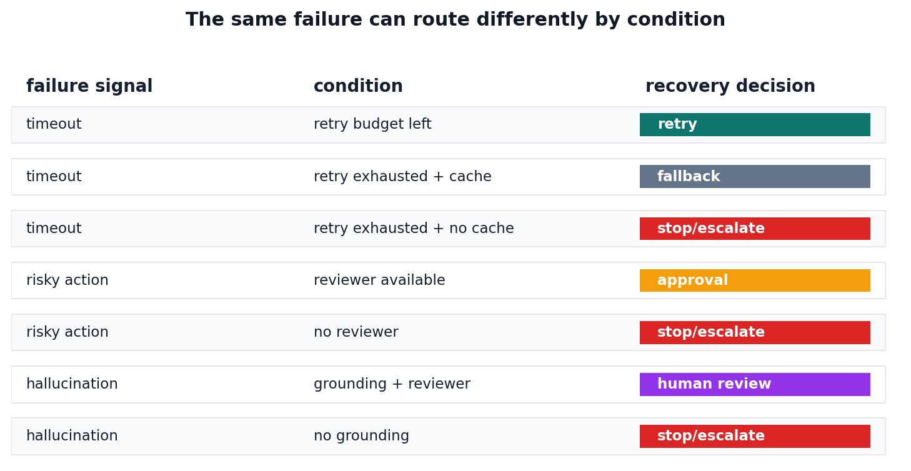

# P6-17.2 Handling Operational Failures by Splitting Errors into Recovery Routes

> Section ID: `P6-17.2`
> Version: `v2026.07.24`

After setting service operating limits, you also need to decide where an actual failure should go. Failure handling is not just about fixing the final answer sentence. It means looking at retrieval, tool calls, permissions, latency, and logs together, then choosing which route is safest among `retry`, `fallback`, `stop`, and `approval`. In other words, it is closer to retracing the whole process that produced the answer than to looking at one answer line.

## What Failure Routing Decides

The core questions are:

- What forms can failure take in an AI service?
- How should model failures and system failures be separated?
- What response criteria are needed during operation?

If failure handling is reduced to simple error-message handling, you miss the multi-step failures that are specific to LLM services. Failures that look similar can require different actions: missing retrieval, model hallucination, tool permission errors, timeouts, and throughput-limit breaches are not the same problem. The key shift is moving from `judging whether the answer is good` to `deciding the failure route`.

Failure routing can be split as follows.

| Failure signal | First axis to narrow | First response route to choose | Record to keep |
| --- | --- | --- | --- |
| Temporary timeout, momentary external API error | Temporary system error | Bounded retry | Retry count, latency by step |
| Missing retrieval, slow heavy path, partial tool unavailability | Retrieval or execution path issue | Fallback | Retrieval candidates, alternate path, user impact |
| Missing permission, risky execution, unsupported assertion | Permission or safety issue | Stop or approval | Permission state, approval request, stop reason |
| Answer exaggerates or format drifts even after reading documents | Model output issue | Human review or model fix | Draft answer, evidence comparison, fix task |

Here, failure handling through retry, fallback, stop, and approval is organized as a way to read answer failures and system failures by route, instead of collapsing them into one label.

Even when failures look the same, the record and follow-up action change depending on where the path stopped first. An awkward answer may have normal retrieval and tool calls behind it. Conversely, the process may already have failed at retrieval candidates or a permission boundary before the model answer was generated. That is why failure handling should keep retrieval candidates, tool calls, permission state, timeout records, and draft-answer-to-evidence comparison, instead of only editing the final sentence.

## Separating Model Failure from System Failure

- You can explain AI service failure types at an introductory level.
- You can distinguish model failures from system failures.
- You can explain the roles of trace, fallback, retry, and approval.
- You can connect prompting, RAG, tool use, agents, and evaluation from an operational viewpoint.

Rather than memorizing many failure-type names, it is safer to use the question of why the same apparent failure splits into `retry`, `fallback`, `stop`, or `approval`.

| First visible failure signal | Following response route | Why the route splits this way |
| --- | --- | --- |
| Brief timeout, temporary external API error | retry | The same path may recover if attempted again briefly. |
| Missing retrieval, slow heavy path, partial tool unavailability | fallback | Instead of stopping completely, the service may need to step down to a simpler path and preserve a minimal function. |
| Missing permission, risky execution, unsupported assertion | stop or approval | Continuing can increase the risk of wrong execution or wrong guidance. |
| Answer keeps exaggerating or format keeps drifting after reading documents | Human review + separate fix task | If system recovery and model improvement are collapsed into one route, cause tracking becomes blurry. |

If you hold this table first, the failure types, trace, retry, fallback, and cases below become easier to understand as a branch structure: not merely `an error happened`, but `which route should it go to first`.

## Where Failures Arise

In AI services, failure does not appear at only one point. It can arise at several levels, including the model, retrieval, tools, performance, and permissions. Because each cause needs a different response, it becomes important to observe failures step by step and narrow the cause.

For example:

- The model gave an answer that was factually wrong.
- Retrieval brought back irrelevant documents.
- A tool call failed.
- Function arguments were constructed incorrectly.
- The answer was correct, but arrived too late.

Failures can therefore occur across several levels: `output content`, `retrieval`, `execution`, `performance`, and `permission`.

The key is not to read `failure = wrong answer` only. Slow responses, permission errors, and bad retrieval are all failures from an operational viewpoint.

## How Model Failures Differ from System Failures

This distinction matters.

### Model Failure

- Hallucination
- Incorrect summary
- Format mismatch
- Unsupported generic answer

### System Failure

- Missing retrieval
- Tool or API call failure
- Data access permission error
- Timeout
- Cache or state mismatch

If these are not separated, every issue gets collapsed into `the model is bad`. In real operation, however, the cause must be narrowed.

A concise way to restate the distinction is:

- Model failure: the problem appears in summarization, reasoning, or expression even after the document was read.
- System failure: the path that makes the answer breaks, such as retrieval, tool call, permission, or post-processing.

## Why Trace Matters

The final answer alone rarely reveals the failure cause. During operation, you need to be able to revisit questions such as:

- Which documents were retrieved?
- Which tools were called?
- Which arguments were passed?
- Which step took a long time?

This information must remain available to tell whether the problem was a retrieval failure, a model failure, or a tool failure.

Trace is therefore not just a log. It is the starting point for failure analysis.

Seen as a service flow, trace becomes more important as agents and tool use increase. The more steps there are, the more the service must be able to retrace `where things went wrong`.

## Why Retry and Fallback Are Needed

In operation, it is more important to decide how to soften failures than to try to prevent every failure completely.

For example:

- If retrieval fails, switch to a general-answer mode.
- If a tool call fails, ask the user for confirmation.
- If a slower model is delayed, replace it with a smaller model.
- If an external API fails, use a recently cached result.

This kind of structure can be understood as fallback.

Retry is the method of trying again after a temporary failure. But infinite retry increases cost and latency, so it needs a limit.

The following distinction is especially important here.

| Response tool | Main purpose |
| --- | --- |
| retry | Recover from a brief failure by trying again |
| fallback | Use an alternate path when the original path fails |
| stop | Stop progress to prevent a larger error |
| approval | Move a permission-sensitive or externally impactful action behind human approval |

Retry, fallback, stop, and approval are not merely feature names. They are the basic branches of `failure triage`.

In an operating service, the shortest way to read this triage is: `use bounded retry for brief incidents`, `use fallback when the main path is blocked`, `use stop or approval when permission or risk appears`, and `separate human review and fix tasks when model output drifts`. The core is not ending at `we saw a failure`, but deciding immediately which route the failure should enter first.

## Splitting Operational Failures into Recovery Routes

If we connect P6-16.2 automatic and human evaluation, P6-17.1 operating constraints, and this section's failure handling into one operational sequence, the following four lines should come into view first.

| Operating step | First question to check | Representative record to keep |
| --- | --- | --- |
| Automatic gate | Does the answer pass format, source hint, forbidden-expression, and basic length conditions? | Answer-state check, automatic check results |
| Human review | Are tone, possible misunderstanding, next-action clarity, and exception interpretation acceptable? | Review summary, review comments |
| Operating-limit check | Can the path tolerate latency, cost, throughput, and rate-limit constraints? | Execution time, call count, cost summary |
| Failure handling | Which route should it take: retry, fallback, stop, or approval? | Incident record, next action, trace record |

The key in this table is not to read `evaluation` and `operation` separately. Even a good-looking answer is not a deployment candidate if it fails the automatic gate. Even after passing the automatic gate, it needs revision if a human reader may misunderstand it. Even when both are good, it can still be rejected operationally if latency or cost cannot be sustained. And when an actual failure occurs, the same issue will repeat if there is no trace record or next-action note.

In one sentence, the back half of Part 6 can be reduced to the following service judgment:

`What to filter automatically -> what a human must inspect to the end -> whether it fits operating limits -> which route to record on failure`

## Why Approval and Permission Matter

Especially in agent structures, automatically executing every action can be risky.

For example:

- Deleting files
- Sending email
- Modifying an external system
- Running an expensive job

These actions may require an approval process.

Failure handling is therefore not only cleanup after an error. It also includes structures that prevent risky failures in advance.

For that reason, failure handling includes both `after-the-fact recovery` and `prevention before execution`.

The flow can be simplified once more as follows.

```mermaid
--8<-- "assets/part-06/chapter-17/p6-c17-s02-failure-recovery-flow-en.mmd"
```

The key point in this diagram is that failure handling does not end by showing an error message. It classifies the failure, chooses a response route, leaves a trace, and connects that trace to the next improvement.

Failure handling is not an add-on after final output. It must be part of the whole execution structure.

## Cases and Examples

The focus of these cases is not `did a failure happen?`, but `how should the path split after the failure?`

### Case 1. RAG Answer Failure

Suppose a RAG answer is wrong. When the final answer is wrong, people often first conclude that the model was weak. In reality, however, you need to distinguish whether `the system retrieved the wrong documents in the first place` or `the right documents were found, but the answer misread them during summarization`. Without trace, only the final answer remains, and retrieval failure and generation failure look like one lump. For example, if the latest notice never appeared in the retrieved candidates, it is a retrieval problem. If the latest notice was retrieved but the answer omitted an exception clause, it is a reading problem.

If these two are not separated, repeated failures cannot tell you whether retrieval should be fixed or the prompt should be fixed. The shift here is from asking only `is the final answer wrong?` to decomposing `which step went wrong?`. A failure-handling structure keeps the retrieved document list, selected passages, and final answer together so you can revisit where the drift occurred. Therefore, the result to confirm in this case is not only that the answer was wrong, but whether you can explain which step actually drifted: retrieval or interpretation.

| First point to check | If this fails, first suspect | Next action |
| --- | --- | --- |
| Retrieved candidate list | Retrieval miss, missing latest document | Search again, adjust query, fallback answer |
| Selected passage | Wrong relevant-passage choice | Review selection rule, reattach evidence |
| Final summary | Reading or summarization interpretation error | Adjust prompt, human review, revise answer |

### Case 2. Agent Tool-Call Failure

Suppose an agent calls a file-reading tool and receives a permission error. When working manually, people usually stop there and look for another path. But in an automated structure, if the system pretends not to know the failure and continues to the next step, it may produce an answer as if it saw content it never saw. For example, if it could not read a configuration file but proposes a patch based on the premise that it checked the configuration, one error immediately becomes a false work record.

If the system then proceeds to actual modification, it may damage the repository further based on a wrong premise. In this case, the problem is not merely the tool error. It is the execution policy that continued after failure. The shift here is from seeing only `an error happened` to checking whether the path actually changes after the error into stop, retry, or approval-wait. A failure-handling structure defines in advance where to stop, how many times to retry, and when to request human approval. Therefore, the result to confirm in this case is whether the path changes to stop, retry, or human approval after the permission error, instead of continuing into a false success flow.

| Failure signal | Problem if execution continues | Route that should split first in failure handling |
| --- | --- | --- |
| Permission error | Assumes an unread file was read | stop or approval |
| Temporary timeout | May treat a normal resource as permanently failed | Bounded retry, then fallback |
| Missing file or path error | Continues follow-up work on the wrong target | Recheck path, then stop or search again |

### Case 3. Slow Response

Suppose the answer is correct, but it takes 20 seconds to arrive. If the content is right, people may initially feel that it succeeded. Technically, however, even a correct answer may arrive after the user has refreshed the page or left the service. For a long document analysis request, waiting may be acceptable. For a simple policy-check question, 20 seconds is already close to failure.

In operation, the failure a person must watch is not only `content error`, but also `speed that cannot be waited for`. If the response is too slow, even a correct answer can be discarded before being read. The shift here is from asking only `is the content correct?` to also asking `does it arrive within usable time?`. The needed response may not be better prose, but a fallback design such as a timeout threshold, a short answer first, or a detailed answer later. Therefore, the result to confirm in this case is whether the user actually receives a minimum answer within a time they can wait, separate from final correctness.

The three cases can be grouped by response flow as follows.

| Situation | Observation record to keep first | What to fix next |
| --- | --- | --- |
| RAG answer failure | Retrieved candidates, selected passages, final answer | Which of retrieval, reading, and prompt went wrong |
| Agent tool-call failure | Error type, retry count, approval state | Stop rule, retry policy, permission handling |
| Slow response | Latency by step, fallback use | Timeout criterion, short answer first, lightweight path |

## Scenes Where Failure Routes Must Split

What people most often miss when first reading failure handling is that they see `a problem happened` and immediately jump to one solution. In real operation, you first need to split whether this failure should be tried again, stepped down to a simpler path, stopped immediately, or handed to a person. Turned into practical questions, this reads as follows.

| If this suspicion appears | First question to ask |
| --- | --- |
| `Would this work if we tried once more?` | Is it a temporary error or a structural error? |
| `The current path is too heavy or blocked.` | Is there a simpler fallback answer or cached path? |
| `Continuing looks more dangerous.` | Should we stop here and move to human approval or review? |

The first criterion to learn is simple. Failure handling is less a single sentence, `fix the error`, and more a branching task that chooses which route is safest now among `retry`, `fallback`, `stop`, and `approval`.

## Exercise and Example

The goal of this example is to see that failure handling does not end at `an error occurred`. Retry, fallback, and stop branches actually split, and each case leads to a different next operational action. Instead of looking at one failure case, we will compare `system failures` and `model failures` together to see when retry is appropriate and when fallback, human review, or model repair is appropriate.

The example below uses several failure situations, retry limits, cache availability, human-review availability, and grounding-document availability. Timeout may occur during retrieval, permission error may occur during tool call, and hallucination or format mismatch may appear during answering.

Now add one more layer: the LLM grader viewpoint. The LLM grader reads the failure observation record and suggests only `suggested_family`, `suggested_risk`, and `reason`. But the LLM does not make the final recovery decision directly. Policy code rechecks explicit operational signals such as `trace_saved`, `retry_count`, `cached_summary_available`, `approval_required`, and `grounding_available`, then closes the final `decision`.

In the output, we check the failure family and risk suggested by the LLM grader, the final response decision made by the policy gate, retry and fallback state, human-review routing state, summaries of model-fix tasks and system-recovery tasks, and the next action an operator should take immediately. The key to check in the code is that the LLM can organize failure observations, but operational decisions such as approval, stop, and recovery route must still be closed by explicit policy.

The response criteria for this example are:

| Check item | Why it is needed |
| --- | --- |
| LLM grader suggestion | To create a first draft of failure family and risk from the observation record |
| Failure family | To avoid mixing system failures and model failures in the operator's record |
| Response decision | To record which path will be used among retry, fallback, approval, stop, human review, and model fix |
| Next action | So the operator can immediately see what to do next |
| Trace saved state | Because the failure cause must be reproducible and analyzable later |
| User impact | To distinguish failures that must immediately protect the user experience |

The example below uses the failure-case CSV [p6_17_2_failure_cases.csv](../../../assets/part-06/chapter-17/p6_17_2_failure_cases.csv){ .csv-preview }. One row is one failure scene. `failure_family` is the first observation category that the operator left after reading the trace, and `error` contains the first observed failure signal, such as timeout, permission error, hallucination, or format mismatch. Columns such as `retry_count`, `max_retries`, `cached_summary_available`, `approval_required`, and `trace_saved` are control variables that change which route the same error takes among retry, fallback, approval, and stop.

By default, the code uses a reproducible local grader. If a local Ollama model is ready, you can set `P6_17_2_USE_OLLAMA=1` and `OLLAMA_MODEL` to call a real LLM grader in the same position. The output field `grader_source` distinguishes whether the suggestion came from the reproducible fallback grader or an actual Ollama call. The prompt is written in English so the same execution criteria can be preserved across translations.

```python
--8<-- "assets/part-06/chapter-17/p6_17_2_evaluate_failure_recovery.py"
```

An example run can be read as follows.

```text
[summary]
{'approval_count': 2,
 'case_count': 36,
 'fallback_count': 4,
 'human_review_count': 6,
 'model_failure_count': 15,
 'model_fix_count': 5,
 'retry_count': 6,
 'stop_and_escalate_count': 13,
 'system_failure_count': 21}
[selected_cases]
{'case_name': 'timeout_retry_search',
 'decision': 'retry',
 'decision_reason': 'retry_budget_remaining',
 'error': 'timeout',
 'failure_family': 'system',
 'grader_source': 'fallback',
 'next_action': 'retry_search_docs',
 'reason': 'Timeout belongs to the service path, so retry budget and fallback '
           'state must be checked next.',
 'step': 'search_docs',
 'suggested_family': 'system',
 'suggested_risk': 'medium',
 'user_impact': 'temporary_delay'}
{'case_name': 'timeout_fallback_search',
 'decision': 'fallback',
 'decision_reason': 'retry_budget_exhausted_with_cache',
 'error': 'timeout',
 'failure_family': 'system',
 'grader_source': 'fallback',
 'next_action': 'use_cached_or_simplified_path',
 'reason': 'Timeout belongs to the service path, so retry budget and fallback '
           'state must be checked next.',
 'step': 'search_docs',
 'suggested_family': 'system',
 'suggested_risk': 'medium',
 'user_impact': 'reduced_freshness_but_service_continues'}
{'case_name': 'permission_approval_send',
 'decision': 'approval',
 'decision_reason': 'approval_required',
 'error': 'permission_error',
 'failure_family': 'system',
 'grader_source': 'fallback',
 'next_action': 'request_human_approval',
 'reason': 'Permission failure crosses an execution boundary, so approval or '
           'stop policy must be checked next.',
 'step': 'send_email',
 'suggested_family': 'system',
 'suggested_risk': 'high',
 'user_impact': 'wait_for_safe_execution'}
{'case_name': 'risky_action_stop_no_reviewer',
 'decision': 'stop_and_escalate',
 'decision_reason': 'approval_required_but_unavailable',
 'error': 'risky_action',
 'failure_family': 'system',
 'grader_source': 'fallback',
 'next_action': 'stop_without_execution',
 'reason': 'Risky external action needs an approval boundary before any '
           'execution continues.',
 'step': 'update_database',
 'suggested_family': 'system',
 'suggested_risk': 'high',
 'user_impact': 'unsafe_to_continue'}
{'case_name': 'hallucination_review_grounded',
 'decision': 'human_review',
 'decision_reason': 'compare_answer_with_grounding',
 'error': 'hallucination',
 'failure_family': 'model',
 'grader_source': 'fallback',
 'next_action': 'compare_with_grounding',
 'reason': 'Hallucination is a model output risk, so grounding and human '
           'review must be checked next.',
 'step': 'answer_generation',
 'suggested_family': 'model',
 'suggested_risk': 'high',
 'user_impact': 'potential_wrong_answer'}
{'case_name': 'format_fix_parser',
 'decision': 'model_fix',
 'decision_reason': 'format_mismatch',
 'error': 'format_mismatch',
 'failure_family': 'model',
 'grader_source': 'fallback',
 'next_action': 'tighten_prompt_parser_or_schema',
 'reason': 'Format mismatch blocks delivery or parsing, so prompt and schema '
           'repair must be checked next.',
 'step': 'answer_generation',
 'suggested_family': 'model',
 'suggested_risk': 'medium',
 'user_impact': 'delivery_blocked_until_format_fixed'}
```



What to look at first in this figure is that the LLM grader's suggestion and the final recovery decision are not the same step. If `grader_source` is `fallback`, the suggestion came from the reproducible local grader. If it is `ollama`, the suggestion came from an actual LLM call. In either case, the grader can read the observation record and tag `timeout` as a system family failure and `hallucination` as a model family failure. But policy code must still inspect retry budget and cache state to decide whether to send a timeout to retry or fallback. A risky action can wait for approval if a reviewer exists, but must stop instead of executing automatically if no reviewer exists. A model failure that looks like hallucination can go to human review if grounding and a reviewer exist, but must block the answer if evidence is missing.

The chart is therefore not a chart for merely counting total recovery decisions. It shows the branching intuition from `LLM grader tag -> condition check -> recovery route`. In operation, the important thing is less how many timeouts happened and more whether the input conditions that split the same timeout into retry, fallback, or stop were recorded.

The same result can be grouped briefly by failure route as follows.

| Run name | First visible failure character | Why this route fits | Follow-up action |
| --- | --- | --- | --- |
| `timeout_retry_search` | Temporary system delay | Retry attempts remain, and the same retrieval step may be tried again. | Retry the same retrieval once more |
| `timeout_fallback_search` | Delay where the service can continue with lower freshness | Retry attempts are exhausted, but cache or a simpler path remains, so fallback is possible instead of full stop. | Detour through cache or a simpler path |
| `permission_approval_send` | Permission boundary requiring human approval | A task with external effect, such as sending email, is safer behind approval than automatic execution. | Request human approval |
| `risky_action_stop_no_reviewer` | Risky execution that must stop because no approver exists | When execution is risky and no reviewer exists, there is no basis for continuing. | Stop without execution |
| `hallucination_review_grounded` | Model failure requiring evidence comparison first | This is not a retrieval retry problem. The existing evidence and answer must be compared for factuality. | Human review against grounding documents |
| `format_fix_parser` | Model failure requiring output-format repair first | The delivery format and parser compatibility are broken before content can be delivered. | Adjust prompt, parser, and schema |

The result to confirm in this example is that when a failure occurs, the response does not simply stop. Branches such as retry, alternate path, approval wait, human-review routing, and model repair are designed separately. In particular, even `timeout` takes different routes depending on retry availability and cache existence. Errors where approval or immediate stop fits better than retry, such as permission or risky execution, and errors where evidence comparison comes first, such as `hallucination`, must also be separated.

The record that should remain also splits here. If an LLM grader was used, record which grader suggested the family and risk, and why. If the failure goes to retry, record retry count and latency by step. If it goes to fallback, record which simplified path was used. If it goes to approval or stop, record permission state, reviewer availability, and stop reason. If it goes to human review or model repair, keep the final answer, grounding documents, format error, and fix task together.

Readers can try these adjustments directly:

- Reduce `max_retries` and see whether fallback or stop opens sooner than retry.
- Change `cached_summary_available` and compare which route the same timeout takes.
- Change `approval_required` and `human_review_available` and see where risky execution splits between approval wait and stop.
- Add other failure types such as `rate_limit`, `tool_not_found`, and `wrong_citation` and compare whether each is system recovery or model repair.

Condensed into one line, operational failure handling is not `catching errors`. It is `classifying failure, choosing the appropriate recovery route and next action, and keeping the trace so the system can be improved again`.

The more important point to hold is that `did we produce a good answer?` and `where do we stop and how do we recover when it fails?` are not the same problem. Failure handling should therefore be read not as an after-the-fact exception-handling appendix, but as an operational judgment that defines recovery routes and next actions inside the service structure.

This recovery route matters because it:

- turns the P6-17.1 service operating constraints from `what should we watch?` into `where should we trace when a failure happens?`;
- reconnects prompting, RAG, tool use, agents, and evaluation in Part 6 from an operational viewpoint;
- makes the integrated mini-practice include failure handling; and
- makes the difference between `using AI` and `operating an AI service` explicit.

## Checklist

- You should be able to explain failure handling not as `error-message handling`, but as `an operating structure that classifies failures and chooses recovery routes`.
- You should be able to say that model failures and system failures must be separated so even similar symptoms can be routed to different actions.
- You should be able to connect the judgment and records from this section into the flow of one real request, rather than treating it as a new topic separate from operation.

## Sources and References

- OpenAI, [Integrations and observability](https://developers.openai.com/api/docs/guides/agents/integrations-observability){: target="_blank" rel="noopener noreferrer" }, OpenAI API Docs, accessed 2026-07-19.
- OpenAI, [Evaluate agent workflows](https://developers.openai.com/api/docs/guides/agent-evals){: target="_blank" rel="noopener noreferrer" }, OpenAI API Docs, accessed 2026-07-19.
- OpenAI, [Production best practices](https://developers.openai.com/api/docs/guides/production-best-practices){: target="_blank" rel="noopener noreferrer" }, OpenAI API Docs, accessed 2026-07-19.
