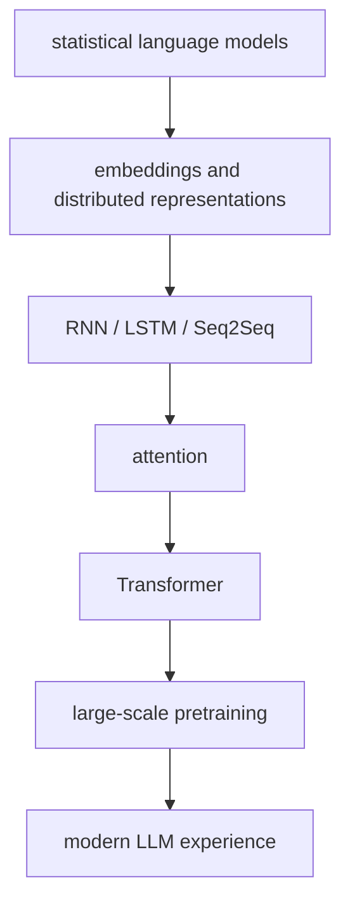

# P6-18.1 LLM 발전사의 큰 흐름

> Section ID: `P6-18.1`
> Version: `v2026.07.09`

P6-2장에서는 토큰(token)이 임베딩(embedding) 벡터로 바뀌고, 그 벡터 사이의 거리와 유사도(similarity)가 검색과 비교의 기준이 된다는 점을 보았습니다. 이제 질문은 조금 더 역사적인 방향으로 옮겨갑니다.

그렇다면 오늘의 LLM(large language model)은 어떤 연구 흐름이 겹쳐져서 만들어졌는가?

이 절은 그 질문에 답합니다.

LLM은 갑자기 등장한 하나의 기술이 아니라, 언어 모델(language model), 임베딩, 순차 모델(sequence model), Attention, Transformer, 대규모 사전학습(pretraining)이 겹치며 만들어진 흐름이다.

오늘의 LLM을 이해할 때 자주 생기는 오해는 `갑자기 등장한 거대한 모델`로만 보는 것입니다. 하지만 실제로는 `다음 단어 확률`, `벡터 표현`, `긴 순서 처리`, `관련 위치를 다시 보는 구조`, `Transformer`, `사전학습`이 차례로 겹치며 지금의 생성 경험을 만들었습니다.

이 절은 그 흐름을 사건 이름 나열이 아니라 `어떤 한계를 줄이려다 다음 구조가 나왔는가`라는 기준으로 다시 묶습니다. 즉, 여기서는 새 본류를 여는 대신 이미 읽은 생성 구조가 어떤 직접 계보 위에 서 있는지 배경 축에서 정리합니다.

핵심 비교축은 단순합니다. 토큰, Transformer, GPT, 학습 조정, RAG, agent를 이미 본 독자라면, 여기서는 그 본류가 어떤 발전사와 구조 전환 위에 서 있는지만 다시 잡으면 충분합니다.

## 이 절의 범위

이 절은 다음 질문에 답합니다.

- LLM 이전에는 언어를 어떻게 모델링했는가?
- 임베딩과 순차 모델은 어떤 문제를 해결하려 했는가?
- Attention과 Transformer는 왜 전환점이 되었는가?
- 사전학습 LLM은 무엇을 바꾸었는가?

이 절에서는 다음 내용을 깊게 다루지 않습니다.

- 각 논문의 수식 전개
- 모델별 벤치마크 세부 비교
- 최신 상용 모델 계보 전수조사

각 논문의 수식 전개와 모델별 벤치마크 세부 비교는 여기서 다루지 않습니다. 대신 이 절에서 잡은 큰 흐름은 바로 다음 P6-18.2에서 `직접 계보와 주변 근거`로 다시 정리하고, 구조 차이는 P6-3.1, P6-19.1, P6-4.1에서 다시 회수합니다. 최신 상용 모델 계보 전수조사는 현재 판의 본편 범위 밖에 둡니다.

이 절은 세부 구조를 모두 외우기보다, Part 6 본류를 읽은 뒤 그 흐름을 다시 정리할 수 있게 해 주는 최소한의 `역사 지도`를 만드는 데 집중합니다. 토큰, Transformer, GPT, 사전학습을 이미 읽은 뒤 그 구조가 어떤 역사적 전환을 거쳐 왔는지 배경 축으로 다시 묶는 대표 Section으로 보면 충분합니다.

이 배경 축에서는 Python 예제도 `역사를 구현하는 코드`가 아니라 `빈도 -> 표현 -> 순서 -> attention`처럼 계산 관점이 어떻게 넓어졌는지 비교하는 최소 예제로만 둡니다. 따라서 여기서 예제를 더 늘리거나 복잡한 구현 실습으로 확장하지 않고, 한 번의 비교로 구조 전환 이유를 읽게 하는 수준에 머무는 편이 현재 Part 6 흐름에 더 맞습니다.

## 이 절의 목표

- LLM 발전사를 몇 개의 큰 전환점으로 설명할 수 있습니다.
- 통계적 언어 모델(statistical language model), 임베딩, RNN, Attention, Transformer, 사전학습의 위치를 구분할 수 있습니다.
- LLM을 AI 전체와 동일시하지 않고, 언어 모델 계열의 한 흐름으로 설명할 수 있습니다.
- 다음 절의 `직접 계보와 주변 근거` 구분으로 자연스럽게 넘어갈 수 있습니다.

## 1단계. 언어를 확률 문제로 다루기 시작했다

초기 언어 모델(language model)의 핵심 질문은 단순했습니다.

- 앞의 단어를 보고 다음 단어가 무엇일 가능성이 높은가?
- 어떤 문장열이 더 그럴듯한가?

이 단계에서는 n-gram 같은 방식이 널리 쓰였습니다. 짧은 문맥 안에서 단어 빈도를 세어 다음 단어 확률을 근사하는 접근입니다.

이 시기의 핵심 공헌은 다음과 같습니다.

- 언어를 규칙 목록만이 아니라 확률(probability) 문제로 다루기 시작했다
- `다음 단어 예측`이라는 관점이 분명해졌다

하지만 한계도 분명했습니다.

- 긴 문맥을 잘 다루기 어렵고
- 드문 표현과 새로운 조합에 약하며
- 비슷한 단어끼리 일반화하기 어렵습니다

## 2단계. 단어를 벡터로 표현하기 시작했다

다음 전환은 임베딩(embedding)입니다.

단어를 one-hot처럼 완전히 분리된 기호로만 두지 않고, 여러 숫자로 된 벡터로 표현하면 비슷한 문맥에서 쓰이는 단어가 어느 정도 가까운 위치를 가질 수 있습니다.

이 단계에서 중요해진 질문은 다음입니다.

- `고양이`와 `개`처럼 비슷한 쓰임의 단어를 모델이 어떻게 더 가깝게 볼 수 있는가?
- 텍스트를 어떻게 계산 가능한 연속 표현(continuous representation)으로 바꿀 수 있는가?

word2vec 같은 연구는 이 감각을 널리 퍼뜨렸습니다. 이 시기 이후 언어 모델은 `다음 단어 확률`뿐 아니라 `좋은 표현 공간(representation space)`을 함께 배우는 방향으로 강하게 움직입니다.

## 3단계. 순서를 신경망 구조로 다루기 시작했다

언어는 순서(sequence)가 중요한 데이터이므로, 단어 벡터를 얻었다고 끝나지 않습니다. 앞 문맥이 뒤 해석에 영향을 주는 구조를 더 잘 다뤄야 했습니다.

이 단계에서 RNN(recurrent neural network), LSTM(long short-term memory), GRU(gated recurrent unit)가 중요해졌습니다.

이 구조들은 다음 문제를 해결하려 했습니다.

- 앞에서 본 정보를 뒤까지 전달할 수 있는가?
- 순서가 있는 문장을 상태(state)로 누적할 수 있는가?
- 긴 문맥에서도 정보를 덜 잃을 수 있는가?

기계번역(machine translation) 같은 문제에서는 Seq2Seq(sequence-to-sequence)도 큰 전환이었습니다.

- 입력 문장을 읽고
- 내부 표현을 만들고
- 출력 문장을 생성한다

이 흐름이 만들어졌기 때문입니다.

## 4단계. Attention이 병목을 줄였다

RNN 기반 Seq2Seq는 강력했지만, 입력 전체를 하나의 고정 길이 표현으로 압축하는 병목(bottleneck) 문제가 있었습니다.

Attention은 이 문제를 줄이려 했습니다.

- 출력 단어를 만들 때
- 입력 전체를 다시 훑어보고
- 관련 있는 위치에 더 큰 가중치를 주는 방식입니다

이렇게 기억하면 충분합니다.

`Attention은 모델이 필요한 순간에 입력의 관련 부분을 다시 참고하게 만든 구조다.`

이 단계가 중요한 이유는, LLM으로 가는 직접적인 구조 전환이 여기서 시작되기 때문입니다.

## 5단계. Transformer가 중심 구조를 바꿨다

Transformer는 Attention을 보조 장치가 아니라 중심 구조로 올려놓았습니다.

이 전환의 의미는 매우 큽니다.

- 긴 순차 계산에 덜 묶이고
- 병렬 처리(parallel processing)에 더 잘 맞고
- 토큰들 사이 관계를 더 직접적으로 계산할 수 있게 되었기 때문입니다

Part 6 앞부분에서 이미 본 것처럼, Transformer는 self-attention을 중심에 두고 token-to-token 관계를 큰 행렬 연산으로 다룹니다.

이 구조는 GPU 기반 대규모 학습과 잘 맞았습니다. 그래서 Transformer는 단순히 `번역 모델 하나`가 아니라, 이후 LLM 확산의 기반 구조가 됩니다.

## 6단계. 사전학습이 모델 사용 방식을 바꿨다

다음 전환은 사전학습(pretraining)입니다.

모델을 특정 작은 과업에 바로 맞추는 대신, 먼저 대규모 텍스트에서 일반적인 언어 패턴을 배우게 하고, 그 뒤에 여러 작업으로 연결하는 방식이 중심이 되었습니다.

이 단계에서 중요한 변화는 다음과 같습니다.

- 언어 패턴을 먼저 크게 학습한다
- 이후 fine-tuning 또는 prompt 기반 사용으로 연결한다
- 하나의 큰 모델이 여러 과업을 처리할 가능성이 커진다

이 전환은 BERT와 GPT 계열에서 서로 다른 방향으로 강하게 나타납니다.

## 7단계. LLM은 생성 인터페이스를 넓혔다

GPT 계열이 커지면서 사용자 경험도 달라졌습니다.

- 모델에게 자연어로 지시를 줄 수 있고
- 예시를 몇 개 넣어 행동을 바꿀 수 있으며
- 같은 모델이 요약, 분류, 번역, 초안 작성, 코드 생성 등 여러 작업을 수행하는 것처럼 보이기 시작했습니다

이때 사용자는 종종 `AI 전체가 LLM이 되었다`고 느끼기 쉽습니다. 하지만 더 안전한 설명은 다음입니다.

`LLM은 AI 전체가 아니라, 언어와 생성 인터페이스에서 매우 큰 전환을 만든 한 계열이다.`

## 이 흐름을 아주 단순하게 그리면



이 도식은 복잡한 세부보다 `큰 전환의 순서`를 잡기 위한 것입니다. 그래서 이 도식에서 확인해야 할 결과는 통계적 언어 모델, 임베딩, 순차 모델, attention, Transformer, 대규모 사전학습이 서로 뒤섞이지 않고 어떤 순서로 이어졌는지 실제로 설명할 수 있는가입니다.

## 사례 및 예시

### 사례 1. 번역

사람은 번역 문제를 볼 때 먼저 `앞 단어를 뒤 단어로 바꾸는 일`처럼 생각하기 쉽습니다. 하지만 문장이 길어지거나 구조가 복잡해지면, 앞에서 나온 주어와 뒤에서 나와야 할 동사의 관계를 함께 유지해야 해서 단순 치환 기준만으로는 쉽게 무너집니다. 예를 들어 영어 문장 앞부분의 주어 정보가 한참 뒤 한국어 서술어 선택까지 영향을 주면, 단어 몇 개만 보고는 자연스러운 번역이 어렵습니다. 초기 번역 시스템은 짧은 문맥 안에서 자주 같이 나오던 표현을 중심으로 다음 단어를 고르는 경향이 강했고, Seq2Seq와 Attention은 긴 문장 대응을 더 잘 다루게 했습니다. Transformer는 이 흐름을 번역을 넘어 범용 언어 처리 구조로 확장했습니다. 그래서 이 사례에서 확인해야 할 결과는 단어 치환 규칙만으로는 무너지는 긴 문장 관계를, 더 넓은 문맥 구조가 실제로 더 안정적으로 다루는가입니다.

### 사례 2. 검색과 임베딩

사용자가 `환불이 늦어요`라고 검색했는데 문서에는 `환급 처리 지연`이라고 적혀 있을 수 있습니다. 사람은 먼저 같은 단어가 있는지만 찾기 쉽지만, 이 기준만으로는 표현이 조금만 달라져도 관련 문서를 놓치기 쉽습니다. 예를 들어 고객은 `돈이 아직 안 들어왔어요`라고 말하고 문서에는 `환급 일정 지연`이라고 적혀 있을 수도 있습니다. 임베딩 흐름은 이런 한계를 줄이기 위해 의미가 비슷한 표현을 더 가깝게 다루려는 방향으로 발전했습니다. 이 흐름이 나중에 벡터 검색(vector search), RAG, 추천(recommendation) 시스템과 직접 연결됩니다. 그래서 이 사례에서 확인해야 할 결과는 같은 단어가 없더라도 비슷한 의미의 문서가 실제 검색 후보로 다시 잡히는가입니다.

### 사례 3. 챗봇 경험

사내 도우미 채팅창에 사용자가 `이 회의록을 세 줄로 요약해 줘`, `이 문장을 고객 불만으로 분류해 줘`, `이 안내문을 더 부드럽게 다시 써 줘`를 연달아 넣는 장면을 떠올려 보겠습니다. 사람은 이런 경험을 보면 처음부터 `대화창 하나가 모든 일을 알아서 처리했다`고 느끼기 쉽습니다. 하지만 예전에는 요약 모델, 분류 모델, 검색 모델을 각각 따로 붙이거나, 아예 규칙 기반 파이프라인으로 나눠 처리하던 일이 많았습니다. 즉, 사용자가 보는 것은 하나의 채팅 경험이지만 그 뒤에는 `다음 단어 예측`, `표현 학습`, `긴 문맥 처리`, `Attention`, `Transformer`, `대규모 사전학습`이 차례로 쌓이며 생긴 구조 전환이 있습니다. 그래서 이 사례에서 확인해야 할 결과는 오늘의 챗봇 경험을 하나의 갑작스러운 발명으로 보기보다, 여러 구조 전환이 누적되어 `하나의 인터페이스에서 여러 과업이 닫히는 상태`로 설명할 수 있는가입니다.

세 사례를 역사 흐름 관점으로 다시 묶으면 다음과 같습니다.

| 상황 | 처음에는 단순하게 보이는 것 | 실제로는 누적되어 온 구조 변화 |
| --- | --- | --- |
| 번역 | 단어 치환 문제 | 긴 문장 관계, attention, Transformer로의 확장 |
| 검색과 임베딩 | 같은 단어 찾기 | 의미가 비슷한 표현을 가깝게 두는 표현 학습 |
| 챗봇 경험 | 대화창 하나가 모든 일을 처리함 | 여러 과업을 하나의 인터페이스에서 닫게 한 구조 누적 |

## 연습 및 예제

이번 예제의 목표는 발전사에서 왜 `빈도`, `표현`, `순서`, `집중 위치`가 차례로 중요해졌는지를 한 스크립트 안에서 확인하는 것입니다.

문제 상황:

- 언어 모델 발전사를 사건 이름 나열이 아니라 계산 관점의 변화로 읽어야 한다

입력:

- 짧은 문장 말뭉치
- 표현이 다른 사용자 질문
- 긴 문장 안의 핵심 정보 위치

출력:

- bigram 기반 다음 단어 빈도
- 동의어 정규화 전후 검색 결과
- 순서에 따라 달라지는 간단한 판정
- 질문과 문서 사이의 attention-like 점수

확인할 개념:

- 빈도 기반 예측, 표현 정규화, 순서 해석, attention-like 비교가 서로 다른 문제를 다룬다
- 언어 모델 발전사는 필요한 계산 범위를 넓혀 온 흐름으로 읽을 수 있다
- 같은 입력이라도 어떤 계산을 하느냐에 따라 출력 관찰 포인트가 달라진다

입력(input):

위에 정리한 문장 목록과 질문-문서 비교 예시를 사용합니다.

```python
from collections import Counter

sentences = [
    ["나는", "커피를", "마신다"],
    ["나는", "차를", "마신다"],
    ["나는", "커피를", "좋아한다"],
]

documents = [
    "환급 처리 지연 안내",
    "주문 취소 요청 절차",
    "비밀번호 재설정 방법",
]

queries = [
    "환불이 늦어요",
    "주문을 취소하고 싶어요",
]

synonyms = {
    "환불": "환급",
    "늦어요": "지연",
    "취소하고": "취소",
    "싶어요": "요청",
}


def tokenize(text):
    return text.replace(",", "").split()


def normalize(tokens):
    return [synonyms.get(token, token) for token in tokens]


def bigram_counts(tokenized_sentences):
    counts = Counter()
    for sent in tokenized_sentences:
        for left, right in zip(sent, sent[1:]):
            counts[(left, right)] += 1
    return counts


def lexical_search(query, docs):
    query_tokens = set(tokenize(query))
    scored = []
    for doc in docs:
        doc_tokens = set(tokenize(doc))
        score = len(query_tokens & doc_tokens)
        scored.append((doc, score))
    return sorted(scored, key=lambda item: item[1], reverse=True)


def normalized_search(query, docs):
    query_tokens = set(normalize(tokenize(query)))
    scored = []
    for doc in docs:
        doc_tokens = set(normalize(tokenize(doc)))
        score = len(query_tokens & doc_tokens)
        scored.append((doc, score))
    return sorted(scored, key=lambda item: item[1], reverse=True)


def read_with_order(sentence):
    tokens = tokenize(sentence)
    if "않습니다" in tokens:
        return "negative"
    return "positive"


def attention_like_focus(question, document):
    q_tokens = normalize(tokenize(question))
    doc_tokens = normalize(tokenize(document))
    scores = []
    for position, token in enumerate(doc_tokens):
        score = sum(1 for q_token in q_tokens if q_token == token)
        scores.append((position, token, score))
    return sorted(scores, key=lambda item: item[2], reverse=True)


print("[1] bigram counts")
for pair, count in sorted(bigram_counts(sentences).items()):
    print(pair, "->", count)

print("\n[2] lexical search vs normalized search")
for query in queries:
    print("query =", query)
    print(" lexical_top =", lexical_search(query, documents)[0])
    print(" normalized_top =", normalized_search(query, documents)[0])

print("\n[3] sequence-aware reading")
for sentence in ["결제를 승인합니다", "결제를 승인하지 않습니다"]:
    print(sentence, "->", read_with_order(sentence))

print("\n[4] attention-like focus")
question = "환불 지연은 어디에서 확인하나요"
document = "환급 처리 지연 안내와 확인 방법"
for position, token, score in attention_like_focus(question, document):
    print("position=", position, "token=", token, "score=", score)
```

실행 결과 예시는 다음처럼 읽을 수 있습니다.

```text
[1] bigram counts
('나는', '차를') -> 1
('나는', '커피를') -> 2
('차를', '마신다') -> 1
('커피를', '마신다') -> 1
('커피를', '좋아한다') -> 1

[2] lexical search vs normalized search
query = 환불이 늦어요
 lexical_top = ('환급 처리 지연 안내', 0)
 normalized_top = ('환급 처리 지연 안내', 1)
query = 주문을 취소하고 싶어요
 lexical_top = ('주문 취소 요청 절차', 1)
 normalized_top = ('주문 취소 요청 절차', 3)

[3] sequence-aware reading
결제를 승인합니다 -> positive
결제를 승인하지 않습니다 -> negative

[4] attention-like focus
position= 0 token= 환급 score= 1
position= 2 token= 지연 score= 1
position= 4 token= 확인 score= 1
position= 1 token= 처리 score= 0
position= 3 token= 안내와 score= 0
```

## 이 예제를 계보 압축 관점으로 다시 보면

앞의 예제는 언어 모델 발전사를 계산하는 코드가 아니라, `초기 빈도 기반 구조에서 출발해 왜 더 긴 문맥과 일반화가 필요한가`를 가장 작은 장면으로 압축해 보여 주는 예시입니다. 여기서 읽어야 할 핵심은 숫자 자체보다, 어떤 한계가 다음 구조 전환을 불렀는가를 순서대로 잡는 데 있습니다.

이 예제에서 읽어야 할 핵심은 다음입니다.

- 초기 언어 모델은 bigram 같은 빈도 구조에서 출발했다는 점
- 표현이 달라지면 단순 단어 일치만으로는 관련 항목을 못 찾는다는 점
- 순서와 부정 표현을 읽으려면 더 긴 상태 추적이 필요하다는 점
- 질문의 어느 위치를 더 볼지 계산하는 흐름이 attention 감각으로 이어진다는 점입니다

## 이 절을 어디까지 읽으면 충분한가

이제 전체 흐름을 본 뒤에는 각 단계의 세부 구현을 모두 기억할 필요가 없다는 점도 더 분명해집니다. 우선은 다음 정도만 남기면 충분합니다.

| 지금 남기면 충분한 것 | 앞서 읽은 본류에서 다시 확인할 곳 |
| --- | --- |
| 언어 모델은 `다음 표현을 예측한다`는 문제의식에서 출발했다 | P6-5.1 다음 토큰 예측 |
| 임베딩은 기호를 계산 가능한 벡터로 바꾸는 전환이었다 | P6-2.1 임베딩의 직관 |
| Attention과 Transformer가 구조 전환점이었다 | P6-3.1 Transformer를 LLM 관점에서 다시 읽기 |
| 사전학습이 모델 사용 방식을 바꾸었다 | P6-6.1 사전학습 |

즉, 이 절에서는 `역사 전체`보다 `왜 앞서 읽은 본류가 그런 순서로 배치되었는가`만 잡아도 충분합니다.

이 절에서 확인해야 할 결과는 앞서 읽은 P6-4.1 GPT, P6-5.1 다음 토큰 예측, P6-6.1 사전학습 같은 본류 설명을 단순 기능 나열이 아니라, 각 구조가 어떤 한계를 메우며 다음 단계로 이어졌는지의 흐름으로 다시 읽을 수 있게 되는가입니다.

커리큘럼 관점에서 이 절이 중요한 이유는 다음과 같습니다.

- Part 6 앞부분의 Transformer를 Part 6의 LLM 계보 안에 다시 위치시키고
- 이후 BERT, GPT, pretraining, instruction tuning, RAG를 읽을 때 구조적 혼동을 줄이며
- LLM을 AI 전체와 동일시하는 오해를 줄이기 때문입니다

## 다음 절과의 연결

여기까지 오면 다음 질문이 남습니다.

- 이 큰 흐름 중에서 무엇이 LLM의 `직접 계보`인가?
- 반대로 무엇은 LLM의 분위기와 확산을 설명하는 `주변 근거`인가?

이 질문은 P6-18.2 직접 계보와 주변 근거로 이어집니다.

## 언제 발전사 배경 관점을 먼저 떠올려야 하는가

| 상황 | 먼저 떠올릴 관점 | 왜 중요한가 |
| --- | --- | --- |
| Transformer, GPT, 사전학습이 각각 따로 외워져 흐름으로 연결되지 않을 때 | 큰 전환점의 순서를 다시 잡아야 한다는 점 | 언어 모델, 임베딩, 순차 모델, Attention, Transformer, 사전학습의 전환 이유를 한 흐름으로 봐야 현재 LLM 구조가 덜 단절적으로 보입니다. |
| LLM을 갑자기 등장한 단일 기술처럼 느끼기 시작할 때 | 누적된 구조 전환의 결과라는 점 | 지금의 생성 경험은 여러 단계의 계산 관점 변화가 겹친 결과라는 점을 먼저 잡아야 과장된 서사를 줄일 수 있습니다. |
| 다음 절의 직접 계보와 주변 근거 구분이 왜 필요한지 감이 오지 않을 때 | 먼저 큰 역사 지도를 잡은 뒤 세부 계보를 가른다는 점 | 큰 흐름이 있어야 무엇이 구조 조상이고 무엇이 배경 조건인지 나누는 다음 절이 자연스럽게 이어집니다. |

## 이 절에서 기억할 관점

- LLM은 통계적 언어 모델, 임베딩, 순차 모델, Attention, Transformer, 사전학습이 겹쳐진 결과입니다.
- Transformer는 중요한 중심 구조이지만, 그 앞단의 문제의식 없이 이해하면 흐름이 끊깁니다.
- 사전학습은 모델 사용 방식 자체를 바꾸었습니다.
- LLM은 AI 전체가 아니라 언어와 생성 인터페이스에서 큰 전환을 만든 계열입니다.

## 짧은 점검

- LLM 발전사를 `사건 이름 나열`이 아니라 `계산 관점의 전환 흐름`으로 설명할 수 있어야 합니다.
- Transformer 이전의 문제의식과 사전학습 이후의 사용 방식 변화가 함께 있어야 현재 LLM을 더 정확히 읽을 수 있다는 점을 말할 수 있어야 합니다.
- 다음 절은 새 본류를 여는 장이 아니라, 이 큰 흐름 안에서 무엇이 직접 계보고 무엇이 주변 근거인지 더 좁혀 보는 단계라는 점을 잡고 있어야 합니다.

## 출처와 참고 자료

- Yoshua Bengio et al., [A Neural Probabilistic Language Model](https://www.jmlr.org/papers/v3/bengio03a.html){: target="_blank" rel="noopener noreferrer" }, Journal of Machine Learning Research, 2003, 확인 날짜: 2026-07-05.
- Tomas Mikolov et al., [Efficient Estimation of Word Representations in Vector Space](https://arxiv.org/abs/1301.3781){: target="_blank" rel="noopener noreferrer" }, arXiv, 2013, 확인 날짜: 2026-07-05.
- Ilya Sutskever, Oriol Vinyals, Quoc V. Le, [Sequence to Sequence Learning with Neural Networks](https://arxiv.org/abs/1409.3215){: target="_blank" rel="noopener noreferrer" }, arXiv, 2014, 확인 날짜: 2026-07-05.
- Dzmitry Bahdanau, Kyunghyun Cho, Yoshua Bengio, [Neural Machine Translation by Jointly Learning to Align and Translate](https://arxiv.org/abs/1409.0473){: target="_blank" rel="noopener noreferrer" }, arXiv, 2014, 확인 날짜: 2026-07-05.
- Ashish Vaswani et al., [Attention Is All You Need](https://papers.nips.cc/paper/7181-attention-is-all-you-need){: target="_blank" rel="noopener noreferrer" }, NeurIPS, 2017, 확인 날짜: 2026-07-05.
- Tom B. Brown et al., [Language Models are Few-Shot Learners](https://arxiv.org/abs/2005.14165){: target="_blank" rel="noopener noreferrer" }, arXiv, 2020, 확인 날짜: 2026-07-05.
