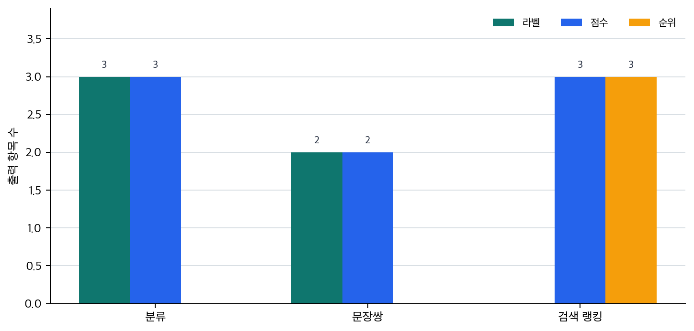

# P6-20.2 긴 답변보다 판단값을 먼저 내는 이해 중심 태스크

> Section ID: `P6-20.2`
> Version: `v2026.07.26`

BERT 계열을 Transformer 인코더 기반의 표현 모델로 읽었다면, 그 표현이 어떤 작업 묶음으로 이어지는지도 구분해야 합니다. 이해 중심 태스크는 입력 전체를 읽고 분류, 관련도 판단, 검색, 임베딩처럼 `무엇인지` 또는 `얼마나 맞는지`를 판단하는 작업이며, BERT 계열 표현 모델과 잘 맞습니다.

## 이해 중심 출력의 형식

이해 중심 출력은 다음 질문에서 시작합니다.

- `이해 중심 태스크`란 무엇이라고 설명할 수 있는가?
- BERT 계열은 어떤 작업에서 특히 유용했는가?
- 분류, 검색, 문장쌍 비교, 임베딩은 어떻게 한 흐름으로 묶을 수 있는가?

이해 중심 태스크는 `입력을 읽고 라벨, 점수, 벡터를 내는 작업 묶음`으로 잡는 편이 안전합니다. 그래야 왜 이런 흐름이 BERT 계열과 잘 맞는지도 더 선명해집니다.

이 비교 기준은 검색 파이프라인 안에서 구조가 어떻게 갈라지는지를 볼 때 P6-12.1 벡터 데이터베이스와 P6-12.2 인덱스와 검색 품질에서 다시 회수할 수 있습니다.

태스크 이름을 많이 나열하기보다, `입력을 읽고 판단하는 흐름`을 한 묶음으로 이해하는 편이 더 중요합니다. 앞 절이 BERT 계열의 위치를 비교 기준으로 잡았다면, 여기서는 그 비교를 실제 작업 묶음으로 좁혀 `라벨`, `점수`, `순위`, `벡터`가 왜 한 종류의 출력으로 묶이는가를 먼저 구분합니다.

따라서 태스크 이름 목록보다 `읽고 판단값을 내는 구조`와 `길게 생성하는 구조`의 차이를 봐야 합니다. 이해 중심 태스크를 새 목록으로 외우기보다, 분류, 관련도 판단, 검색, 임베딩이 모두 `입력을 읽고 판단값을 내는 구조`라는 공통점을 잡으면 충분합니다.

## 긴 답변 생성과 판단값 출력의 구분

- 이해 중심 태스크를 입문 수준에서 설명할 수 있습니다.
- 분류, 관련도 판단, 검색, 임베딩을 같은 계열의 작업으로 묶어 설명할 수 있습니다.
- 왜 이런 작업이 BERT 계열과 잘 맞는지 말할 수 있습니다.
- 앞서 읽은 GPT 계열과의 대비를 더 선명하게 읽을 수 있습니다.

## 이해 중심 태스크란 무엇인가

여기서 `이해 중심 태스크`는 사람처럼 이해한다는 철학적 뜻이 아니라, 다음과 같은 작업 묶음을 가리킵니다.

- 이 입력은 어떤 라벨인가?
- 이 두 문장은 같은 뜻에 가까운가?
- 이 질문과 이 문서는 얼마나 관련 있는가?
- 이 문장을 대표하는 벡터는 어떤가?

즉, 출력이 긴 생성 문장이라기보다:

- 라벨
- 점수
- 관련도
- 대표 표현

으로 이어지는 작업입니다.

## 이해 중심 태스크의 입력과 출력

이 흐름은 `문장을 보고 다음 문장을 길게 이어 쓰는가`보다 `입력을 보고 어떤 판단 결과를 내는가`로 보면 더 빨리 잡힙니다.

| 작업 | 입력 | 출력 |
| --- | --- | --- |
| 분류 | 문장 하나 | 라벨 |
| 문장쌍 판단 | 문장 두 개 | related / not related 같은 관계 라벨 또는 점수 |
| 검색 랭킹 | 질문과 문서 후보 | 관련도 점수, 정렬 순서 |
| 임베딩 | 문장이나 문서 | 벡터 표현 |

즉, 이해 중심 태스크의 출력은 대개 `다음 문장`이 아니라 `판단을 위한 결과물`입니다.

## 대표적인 작업 1. 문서 분류와 감성 분류

가장 익숙한 예는 분류(classification)입니다.

예를 들어:

- 스팸 / 정상 메일 분류
- 문의 카테고리 분류
- 감성 분류(긍정 / 부정 / 중립)

같은 작업은 문장 전체를 읽고 `어느 범주에 넣을지` 판단하는 흐름입니다.

BERT 계열은 입력 전체 문맥을 반영한 표현을 만들기 때문에 이런 작업과 잘 맞습니다.

## 대표적인 작업 2. 문장쌍 판단

두 문장 관계를 판단하는 작업도 중요합니다.

예를 들어:

- 두 문장이 같은 의미에 가까운가?
- 질문과 답이 서로 맞는가?
- 문장 A가 문장 B를 함의(entailment)하는가?

이런 작업은 단일 문장 분류보다 한 단계 더 나아가, 두 입력 사이 관계를 보는 문제입니다.

다음처럼 이해하면 충분합니다.

`문장쌍 판단은 입력 하나를 읽는 일이 아니라, 두 입력의 관계를 비교해 점수나 라벨을 내는 작업이다.`

## 대표적인 작업 3. 검색과 랭킹

검색(search)도 이해 중심 태스크로 볼 수 있습니다.

질문을 입력으로 주고:

- 어떤 문서가 관련 있는지
- 여러 후보 중 어느 문서를 더 위에 둘지

판단하는 작업이기 때문입니다.

이때 BERT 계열은 다음 두 방식으로 연결될 수 있습니다.

- 질문과 문서를 함께 읽고 관련도 점수를 내는 방식
- 질문과 문서를 각각 표현 벡터로 바꾼 뒤 비교하는 방식

후자는 임베딩 검색과도 직접 연결됩니다.

## 대표적인 작업 4. 임베딩과 표현 재사용

BERT 계열과 그 이후의 encoder 중심 모델은 문장을 임베딩으로 바꾸는 데도 널리 쓰입니다.

예를 들어:

- 비슷한 문장 찾기
- FAQ 중복 질문 찾기
- 문서 군집화
- 검색용 dense vector 생성

이런 작업은 `생성`보다 `표현 재사용`에 가깝습니다.

즉, BERT 계열은 단지 분류 모델이 아니라, 다양한 판단 작업의 공통 표현 엔진으로도 볼 수 있습니다.

## 왜 이런 작업들이 한 흐름으로 묶이나

이 작업들은 겉으로는 달라 보여도 중심 질문이 비슷합니다.

- 무엇인가?
- 서로 얼마나 비슷한가?
- 얼마나 관련 있는가?
- 어떤 범주에 속하는가?

즉, `다음 문장을 길게 생성하는 일`보다 `입력을 읽고 판단하는 일`에 가깝습니다.

그래서 다음처럼 하나의 흐름으로 묶을 수 있습니다.

```mermaid
--8<-- "assets/part-06/chapter-20/p6-c20-s02-understanding-output-flow-ko.mmd"
```

이 도식은 BERT 계열의 실무 사용 감각을 가장 단순하게 묶은 것입니다. 그래서 이 도식에서 확인해야 할 결과는 긴 답변 생성보다 `읽고 구분하고 연결하는 흐름`이 먼저 필요한 업무가 실제로 따로 보이는가입니다.

## 출력 형식의 구분

먼저 남겨야 할 구분은 하나입니다.

`BERT 계열은 긴 답을 생성하는 일보다, 입력을 읽고 라벨·점수·관련도·임베딩을 만드는 일에 더 자연스럽다.`

이 한 줄이 잡히면 세부 태스크 이름을 모두 외우지 않아도 P6-5.1, P6-6.1의 GPT 및 다음 토큰 예측 설명과 P6-11.1, P6-11.2의 RAG 설명을 읽는 데 큰 문제는 없습니다.

## 사례 및 예시

### 사례 1. 고객 문의 분류

고객 문의를 `배송`, `계정`, `결제`, `오류`로 나누는 작업은 전형적인 이해 중심 태스크입니다. 이런 장면에서도 모델이 친절한 설명을 길게 잘 써 주면 좋은 서비스라고 생각하기 쉽습니다. 하지만 실제 운영에서는 긴 답변보다 `어느 처리 흐름으로 보내야 하는가`를 먼저 판단하는 일이 더 중요합니다.

예를 들어 `결제는 됐는데 주문이 안 보여요` 같은 문장은 겉으로는 결제와 주문이 같이 보이지만, 실제 운영에서는 어느 팀이 먼저 봐야 하는지가 더 중요합니다. 답을 길게 생성하는 것보다 `결제 확인 팀`과 `주문 동기화 점검 팀` 중 어디로 먼저 보내는지가 서비스 처리 속도에 더 직접적입니다.

잘못된 큐로 보내면 답변을 길게 잘 써도 실제 처리 시간은 더 늦어질 수 있습니다. 즉, 중요한 일은 긴 답변을 쓰는 것이 아니라 들어온 문장을 읽고 어느 처리 흐름으로 보낼지 결정하는 것입니다. 여기서 바로잡아야 할 오해는 `잘 설명하면 일단 도움이 된다`는 감각입니다. 실제로는 `누가 먼저 처리해야 하는가`가 닫혀야 그다음 설명도 의미가 생깁니다. 그래서 이 사례에서 확인해야 할 결과는 응답 문장 품질보다 올바른 처리 큐로 먼저 들어가는가, 그리고 그 큐 선택만 보고도 다음 운영 조치를 바로 이어 갈 수 있는가입니다.

### 사례 2. FAQ 검색

사용자 질문과 기존 FAQ를 비교해 가장 가까운 항목을 찾는 일은 관련도 판단과 임베딩 검색이 함께 쓰이는 사례입니다. 이 장면에서도 `모델이 새 설명을 예쁘게 다시 써 주면 더 좋아 보이지 않을까`라고 생각하기 쉽습니다. 하지만 사람도 이 장면에서는 새 설명을 쓰기보다 `이미 있는 답 중 무엇이 가장 맞는가`를 먼저 고릅니다.

예를 들어 `비밀번호를 잊어버렸어요`와 `로그인 비밀번호 재설정은 어떻게 하나요?`는 표면 표현이 달라도 같은 도움말로 연결되는 편이 더 실용적입니다. 기존 FAQ가 이미 단계별 스크린샷까지 포함하고 있다면, 새 답을 생성하는 것보다 그 항목으로 정확히 연결하는 쪽이 훨씬 안전합니다.

반대로 관련 없는 FAQ를 골라 새 문장으로 덧붙이면 말은 자연스러워도 사용자는 잘못된 경로로 이동할 수 있습니다. 이때 핵심은 `새 문장을 만드는 일`이 아니라 `가장 맞는 문서를 고르는 일`입니다. 여기서 바로잡아야 할 오해는 `생성형 답변이면 검색보다 항상 더 똑똑해 보인다`는 기대입니다. 실제로는 이미 있는 정확한 문서를 잘 연결하는 편이 훨씬 실용적일 때가 많습니다. 그래서 이 사례에서 확인해야 할 결과는 새 답 생성보다 실제로 가장 가까운 FAQ 항목이 먼저 연결되는가, 그리고 그 연결만으로 사용자가 후속 행동을 할 수 있는가입니다.

### 사례 3. 문서 중복 탐지

문서 제목과 본문이 거의 같은지 판별하는 일은 문장쌍 비교와 유사도 판단 흐름으로 볼 수 있습니다. 이 작업에서도 모델이 문서를 다시 요약하거나 합쳐 써 주는 쪽을 먼저 떠올리기 쉽습니다. 하지만 사람은 이 작업에서 보통 `둘 다 새로 쓰기`보다 `둘이 얼마나 같은가`를 먼저 점검합니다.

예를 들어 공지 두 개가 문장 순서만 조금 다르고 핵심 내용은 같다면, 새 답변을 만드는 것보다 중복으로 묶는 편이 운영상 더 중요할 수 있습니다. 하나는 제목이 `점검 안내`, 다른 하나는 `서비스 점검 공지`여도 실제 본문이 같은 이벤트를 설명한다면 중복 판단이 더 중요합니다.

중복을 놓치면 비슷한 문서가 계속 쌓여 검색 결과까지 지저분해질 수 있습니다. 결국 이 사례도 `읽고 비교해 점수를 매기는 일`이라는 점에서 같은 계열입니다. 여기서 바뀌는 점은 `새 설명을 다시 만드는가`를 보던 기준에서 `두 문서가 실제로 같은 묶음인지 판단하는가`를 보는 기준으로 이동한다는 것입니다. 여기서 바로잡아야 할 오해는 `텍스트 작업이면 일단 생성이 중심일 것`이라는 기대입니다. 그래서 이 사례에서 확인해야 할 결과는 새 문서로 남기기보다 실제로 중복 문서가 하나의 묶음으로 정리되는가, 그리고 그 판단값이 이후 검색 정리에도 바로 쓰일 수 있는가입니다.

세 사례를 이해 중심 태스크 관점으로 다시 묶으면 다음과 같습니다.

| 상황 | 생성보다 먼저 필요한 판단 | 실제 출력으로 먼저 남는 것 |
| --- | --- | --- |
| 고객 문의 분류 | 어느 처리 큐로 보낼지 | 라벨 |
| FAQ 검색 | 어떤 기존 항목이 가장 가까운지 | 관련도 순위 |
| 문서 중복 탐지 | 두 문서가 같은 묶음인지 | 유사도 점수 또는 중복 판정 |

## 판단값이 먼저 필요한 장면

이해 중심 태스크를 처음 읽을 때 자주 생기는 오해는 `AI면 일단 답을 길게 생성해야 한다`고 생각하는 점입니다. 하지만 먼저 봐야 하는 것은 장문 생성보다 `필요한 출력이 라벨인가, 점수인가, 순위인가`입니다. 이 기준을 실무 질문으로 바꾸면 다음처럼 읽을 수 있습니다.

| 이런 의심이 들면 | 먼저 던질 질문 |
| --- | --- |
| `이건 답을 써야 하나, 먼저 분류해야 하나?` | 필요한 출력이 문장인가 라벨인가? |
| `이미 있는 문서가 더 낫지 않나?` | 새 생성보다 관련도 순위를 먼저 뽑아야 하는가? |
| `둘이 비슷한데 같은 처리 흐름인가?` | 비교 결과를 점수나 판정으로 먼저 남겨야 하는가? |

먼저 익혀야 하는 기준은 단순합니다. 이해 중심 태스크는 `긴 답변 생성`보다 `읽기 -> 라벨/점수/순위/벡터`로 이어지는 판단 구조에 가깝습니다. 그래서 BERT 계열은 생성 경쟁자가 아니라, 읽고 구분하는 앞단 구조로 읽는 편이 정확합니다.

## 연습 및 예제

예제의 목표는 이해 중심 태스크가 실제로 `라벨`, `관계 점수`, `검색 순위` 같은 판단 결과를 낸다는 점을 작은 벡터 표현 실험으로 확인하는 것입니다.

아래 예제는 생성형 응답과 달리 이해 중심 태스크가 읽고 판단값을 내는 구조를 확인합니다. 입력 CSV [p6-20-understanding-task-cases.csv](../../../assets/part-06/chapter-20/p6-20-understanding-task-cases.csv){ .csv-preview }는 분류, 문장쌍 판단, 검색 랭킹 사례를 각각 12개씩 담고 있습니다. 한 행은 하나의 판단 사례이며, `task_type`은 출력 형식을, `scenario_pattern`은 직접 신호·경계 신호·서로 다른 의도 같은 관찰 역할을 알려 줍니다.

확인할 핵심은 이해 중심 태스크가 긴 답변보다 라벨, 점수, 순위 같은 판단 결과를 먼저 낸다는 점입니다. 여기서는 BERT를 직접 내려받아 실행하지 않고, 로컬에서 재현 가능한 TF-IDF 벡터를 작은 대체 표현으로 사용합니다. 실제 BERT 계열에서는 이 표현이 더 풍부한 문맥 표현으로 바뀌지만, `입력을 표현으로 바꾼 뒤 판단값을 낸다`는 출력 흐름은 같습니다.

코드에서 바꿔 볼 값은 `relation_threshold`입니다. 이 값을 높이면 문장쌍 판단이 더 보수적으로 바뀌고, 경계 사례 일부가 `related`에서 `not_related`로 이동합니다. 이 변화가 보여 주는 것은 이해 중심 태스크의 출력이 긴 문장이 아니라 `표현 사이 점수를 기준으로 어떤 판단값을 내는가`에 더 가깝다는 점입니다.

```python
# CSV에 담긴 분류, 문장쌍 관계, 문서 순위화 사례를 읽어
# 입력 표현이 라벨, 관계 점수, 문서 순위로 바뀌는 흐름을 확인하는 예제입니다.
import csv
from pathlib import Path

from sklearn.feature_extraction.text import TfidfVectorizer
from sklearn.metrics.pairwise import cosine_similarity

case_path = Path("docs/assets/part-06/chapter-20/p6-20-understanding-task-cases.csv")

domain_terms = {
    "배송": ["배송", "택배", "출고", "배송지", "주소", "도착", "박스"],
    "계정": ["계정", "로그인", "비밀번호", "인증번호", "잠금", "인증", "재설정"],
    "결제": ["결제", "환불", "취소", "영수증", "청구", "돈", "내역", "주문"],
    "문서": ["FAQ", "공지", "중복", "문서", "점검", "안내"],
    "장비": ["퇴사", "오프보딩", "장비", "자산", "반납", "회수"],
}

queue_prototypes = {
    "배송": "배송 지연 택배 출고 주소 박스 배송 조회 배송지",
    "계정": "로그인 비밀번호 계정 인증번호 잠금 인증 메일 재설정",
    "결제": "결제 환불 취소 영수증 청구 돈 내역 주문 결제 상태",
}

def enrich(text):
    if text == "-":
        return ""
    tags = []
    for tag, terms in domain_terms.items():
        if any(term in text for term in terms):
            tags.extend([tag, tag])
    return text + " " + " ".join(tags)

def cosine_scores(left_texts, right_texts):
    vectorizer = TfidfVectorizer(analyzer="char_wb", ngram_range=(2, 4))
    matrix = vectorizer.fit_transform([enrich(text) for text in left_texts + right_texts])
    left_matrix = matrix[:len(left_texts)]
    right_matrix = matrix[len(left_texts):]
    return cosine_similarity(left_matrix, right_matrix)

with case_path.open(encoding="utf-8", newline="") as file:
    cases = list(csv.DictReader(file))

classification_rows = [row for row in cases if row["task_type"] == "classification"]
pair_rows = [row for row in cases if row["task_type"] == "pair_relation"]
ranking_rows = [row for row in cases if row["task_type"] == "ranking"]

queue_names = list(queue_prototypes)
queue_scores = cosine_scores(
    [row["text_a"] for row in classification_rows],
    list(queue_prototypes.values()),
)
classification_outputs = []
for row, scores in zip(classification_rows, queue_scores):
    best_index = scores.argmax()
    classification_outputs.append(
        {
            "case_id": row["case_id"],
            "pattern": row["scenario_pattern"],
            "output": queue_names[best_index],
            "score": round(float(scores[best_index]), 2),
        }
    )

relation_threshold = 0.24
strict_relation_threshold = 0.34
pair_scores = cosine_scores(
    [row["text_a"] for row in pair_rows],
    [row["text_b"] for row in pair_rows],
)
pair_outputs = []
for index, row in enumerate(pair_rows):
    similarity = float(pair_scores[index][index])
    pair_outputs.append(
        {
            "case_id": row["case_id"],
            "pattern": row["scenario_pattern"],
            "similarity": round(similarity, 2),
            "output": "related" if similarity >= relation_threshold else "not_related",
            "strict_output": "related" if similarity >= strict_relation_threshold else "not_related",
        }
    )

ranking_outputs = []
for row in ranking_rows:
    candidates = [row["candidate_1"], row["candidate_2"], row["candidate_3"]]
    scores = cosine_scores([row["text_a"]], candidates)[0]
    ranked = sorted(zip(candidates, scores), key=lambda item: item[1], reverse=True)
    ranking_outputs.append(
        {
            "case_id": row["case_id"],
            "pattern": row["scenario_pattern"],
            "top_document": ranked[0][0],
            "top_score": round(float(ranked[0][1]), 2),
        }
    )

by_task = {
    "classification": classification_outputs,
    "pair_relation": pair_outputs,
    "ranking": ranking_outputs,
}

print("[dataset]")
print("case_count =", len(cases))
print("task_counts =", {task: len(items) for task, items in by_task.items()})
print("representation = char_wb 2-4 gram TF-IDF + domain terms")
print("relation_threshold =", relation_threshold)
print("strict_relation_threshold =", strict_relation_threshold)
print()

for task_type in ["classification", "pair_relation", "ranking"]:
    print(f"[{task_type} preview]")
    for item in by_task[task_type][:3]:
        print(item)
    print("---")

changed = [item for item in pair_outputs if item["output"] != item["strict_output"]]
print("[threshold sensitivity]")
print("changed_pair_cases =", changed[:5])
```

실행 결과 예시는 다음처럼 읽을 수 있습니다. `representation` 줄은 이 예제가 문장을 그대로 키워드로만 세지 않고, 작은 벡터 표현으로 바꾼 뒤 라벨, 관계 점수, 문서 순위를 만든다는 뜻입니다.

```text
[dataset]
case_count = 36
task_counts = {'classification': 12, 'pair_relation': 12, 'ranking': 12}
representation = char_wb 2-4 gram TF-IDF + domain terms
relation_threshold = 0.24
strict_relation_threshold = 0.34

[classification preview]
{'case_id': 'C01', 'pattern': 'direct_label', 'output': '배송', 'score': 0.5}
{'case_id': 'C02', 'pattern': 'direct_label', 'output': '계정', 'score': 0.37}
{'case_id': 'C03', 'pattern': 'direct_label', 'output': '결제', 'score': 0.43}
---
[pair_relation preview]
{'case_id': 'P01', 'pattern': 'same_intent', 'similarity': 0.42, 'output': 'related', 'strict_output': 'related'}
{'case_id': 'P02', 'pattern': 'different_intent', 'similarity': 0.0, 'output': 'not_related', 'strict_output': 'not_related'}
{'case_id': 'P03', 'pattern': 'same_intent', 'similarity': 0.38, 'output': 'related', 'strict_output': 'related'}
---
[ranking preview]
{'case_id': 'R01', 'pattern': 'semantic_match', 'top_document': '오프보딩 장비 반납 안내', 'top_score': 0.32}
{'case_id': 'R02', 'pattern': 'semantic_match', 'top_document': '로그인 비밀번호 재설정 안내', 'top_score': 0.38}
{'case_id': 'R03', 'pattern': 'semantic_match', 'top_document': '취소 후 환불 접수 절차', 'top_score': 0.4}
---
[threshold sensitivity]
changed_pair_cases = [{'case_id': 'P06', 'pattern': 'near_boundary', 'similarity': 0.33, 'output': 'related', 'strict_output': 'not_related'}, {'case_id': 'P08', 'pattern': 'same_intent', 'similarity': 0.28, 'output': 'related', 'strict_output': 'not_related'}, {'case_id': 'P12', 'pattern': 'same_intent', 'similarity': 0.25, 'output': 'related', 'strict_output': 'not_related'}]
```

이 예제에서 읽어야 할 핵심은 다음입니다.

- 이해 중심 태스크는 대개 `판단 결과`를 출력합니다
- 생성형 모델처럼 긴 답변을 만드는 것이 중심은 아닙니다
- 분류, 관계 판단, 검색 랭킹도 모두 같은 `읽고 점수나 라벨을 내는 흐름`으로 묶을 수 있습니다
- 작은 TF-IDF 벡터만으로도 어떤 입력이 어느 판단값으로 바뀌는지는 확인할 수 있고, 실제 BERT 계열은 이 점수 계산을 더 풍부한 문맥 표현에서 수행합니다
- `relation_threshold`를 높이면 경계 문장쌍이 더 쉽게 `not_related`로 바뀌며, 판단 기준이 출력 라벨을 바꾼다는 점을 볼 수 있습니다
- BERT 계열은 이런 판단 작업과 잘 맞습니다

아래 그래프는 같은 CSV를 기준으로 태스크별 사례 수와 출력 형식별 등장 수를 요약합니다. 여기서 중요한 점은 그래프의 막대값 자체가 아니라, 분류·문장쌍·랭킹이 모두 긴 답변 대신 라벨, 점수, 순위 같은 판단값을 남긴다는 점입니다.



## 운영 판단으로 다시 묶기

앞의 세 사례는 각각 분류, 관련도 판단, 유사도 판단을 보여 줍니다. 이제 같은 내용을 운영 관점으로 다시 줄이면, 생성보다 먼저 확인해야 하는 질문이 무엇인지 더 분명해집니다.

| 장면 | 먼저 내려야 할 판단 | 생성이 먼저 오면 생기는 문제 |
| --- | --- | --- |
| 고객 문의 분류 | 어느 처리 큐로 보낼 것인가 | 정중한 답을 써도 담당 팀이 잘못 잡혀 실제 해결이 늦어짐 |
| FAQ 검색 | 이미 있는 답 중 무엇이 가장 가까운가 | 새 문장을 덧붙이다가 잘못된 FAQ로 연결될 수 있음 |
| 문서 중복 탐지 | 두 문서가 같은 내용을 말하는가 | 중복을 놓쳐 검색 결과와 문서 관리가 계속 지저분해짐 |

이 표를 읽을 때 핵심은 간단합니다. 생성형 모델은 길고 자연스러운 문장을 만드는 데 강할 수 있지만, 실제 운영 첫 단계에서는 `무엇을 먼저 분류하고 비교하고 연결해야 하는가`가 더 시급한 경우가 많습니다.

예를 들어 환불 문의를 계정 잠금 큐로 잘못 보내면, 답변 문장이 아무리 매끄러워도 처리 시간은 더 늦어집니다. 반대로 라우팅과 검색 판단이 먼저 정확하면, 그 뒤에 붙는 생성 답변도 더 안전한 위치에서 시작할 수 있습니다. 그래서 다시 확인해야 할 결과는 긴 답변 초안의 자연스러움보다, 문의가 올바른 처리 흐름으로 먼저 들어가고 관련 문서가 먼저 정확히 연결되는가입니다.

BERT가 중요했던 이유는 단지 새로운 구조였기 때문이 아닙니다. Transformer encoder 기반 사전학습 표현이 다양한 NLP 과업에 강하게 전이된다는 점을 강하게 보여 주었기 때문입니다.

이 시기를 거치며 많은 실무 팀은:

- 분류
- 검색
- 랭킹
- 문장 유사도
- 임베딩 생성

을 하나의 표현 모델 계열로 묶어 다루기 시작했습니다.

## 왜 생성 중심 구조와 따로 봐야 하나

여기까지 오면 이 비교가 왜 필요한지도 더 분명해집니다.

- 입력을 읽고 판단하는 BERT 계열과 달리, GPT 계열은 어떻게 `계속 이어서 생성`하는가?
- 왜 사용자 경험은 GPT 계열에서 더 크게 바뀌었는가?

이 질문은 본류의 P6-5.1 `디코더 기반 누적 생성 구조로 보는 GPT 계열`을 다시 읽게 만듭니다. 핵심은 생성 구조가 중요하지 않다는 뜻이 아니라, 서비스 앞단에서는 `먼저 분류하고 비교하고 연결하는 판단 구조`가 별도로 필요하다는 점입니다. 이 기준이 잡혀야 GPT 계열을 `모든 일을 대신하는 구조`처럼 읽지 않고, BERT 계열을 `읽기와 판단을 맡는 다른 축`으로 다시 구분할 수 있습니다.

## 체크리스트
- 이해 중심 태스크를 `입력을 읽고 라벨·점수·관련도·임베딩을 내는 작업 묶음`으로 설명할 수 있어야 합니다.
- 분류, 검색, 문장쌍 판단, 임베딩이 서로 다른 이름이라도 같은 판단 흐름으로 묶인다는 점을 말할 수 있어야 합니다.
- 생성 구조와 판단 구조를 다른 출력 문제로 구분해야, GPT 계열과 BERT 계열의 용도 차이를 과업 기준으로 다시 설명할 수 있어야 합니다.

## 출처와 참고 자료

- Jacob Devlin et al., [BERT: Pre-training of Deep Bidirectional Transformers for Language Understanding](https://arxiv.org/abs/1810.04805){: target="_blank" rel="noopener noreferrer" }, arXiv, 2018, 확인 날짜: 2026-07-19.
- Daniel Jurafsky, James H. Martin, [Speech and Language Processing](https://web.stanford.edu/~jurafsky/slp3/){: target="_blank" rel="noopener noreferrer" }, draft materials, 확인 날짜: 2026-07-19.
- Matthew E. Peters et al., [Deep contextualized word representations](https://arxiv.org/abs/1802.05365){: target="_blank" rel="noopener noreferrer" }, arXiv, 2018, 확인 날짜: 2026-07-19.
- scikit-learn, [TfidfVectorizer](https://scikit-learn.org/stable/modules/generated/sklearn.feature_extraction.text.TfidfVectorizer.html){: target="_blank" rel="noopener noreferrer" }, 확인 날짜: 2026-07-24.
- scikit-learn, [cosine_similarity](https://scikit-learn.org/stable/modules/generated/sklearn.metrics.pairwise.cosine_similarity.html){: target="_blank" rel="noopener noreferrer" }, 확인 날짜: 2026-07-24.
