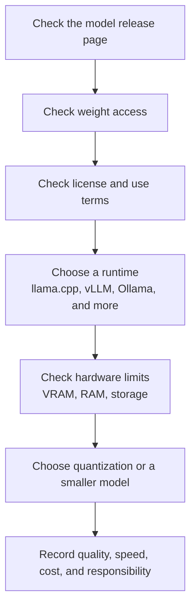

# P6-21.1 What Does an Open-Weight Model Make Available?

> Section ID: `P6-21.1`
> Version: `v2026.08.11`

An [open-weight model](../../../reference/concept-glossary-alpha/o.en.md#open-weight-model) should be checked through `model_id`, `weight_access`, `license_terms`, `training_transparency`, `runtime_path`, and `deployment_responsibility` together. This record prevents `I can download it`, `it is open source`, and `I can operate it responsibly` from being treated as the same statement.

When Part 6 reads a model as a service structure, models called through a public API and models downloaded for direct execution diverge. A public API sends a request to the provider's execution environment without directly viewing or moving model files. An open-weight model, by contrast, makes trained [weights](../../../reference/concept-glossary-alpha/w.en.md#weight) available, so a user can run it on their own hardware or a chosen hosting environment.

But open-weight does not immediately mean open source. A model may make weight files available while providing insufficient detail about training data, training code, filtering, or evaluation. The question in this Section is therefore not `is it open?` but `what is open, and to what degree?`

## The Difference Between Released Weights and a Fully Open Release

Running a model usually requires its architecture, [parameters](../../../reference/concept-glossary-alpha/p.en.md#parameter), tokenizer, inference code, and execution environment. Weights are the parameter values left after training. The term open-weight is used to mean that, at a minimum, those weights can be accessed.

However, weights alone are insufficient for properly understanding or reproducing a model. One also needs to know how training data was collected, what filtering it received, which code and settings trained the model, and what evaluation and safety checks were performed. The OSI Open Source AI Definition 1.0 likewise explains that an open AI system needs data information, code, and parameters together with freedoms to use, study, modify, and share it.

It is safer to read a weight-centered release as follows.

| What is available | What a user can do | What may still be unknown |
| --- | --- | --- |
| Weight files | Run inference directly, adjust inference-cost structure, and perform some fine-tuning or adapter training | Training-data composition, filtering criteria, and reproducibility of training |
| Inference code and settings | Reproduce execution in the same runtime and compare speed and memory | The full training procedure, evaluation data, and safety-adjustment method |
| Training code and data information | Perform deeper review, assess reproducibility, and develop variants | Whether the actual data can be accessed and whether its use is legally allowed |
| [Licenses](../../../reference/concept-glossary-alpha/m.en.md#license) | Judge whether use, modification, redistribution, and commercial use are permitted | Responsibility for outputs, policy violations, and third-party data rights |

The point of this table is not to judge openness in one line. `Weights are available` is an important starting point, but it does not automatically mean `the training process is reproducible` or `the model may be used freely for every purpose`.

## Open Source, Open Weight, and Public APIs

In open-source software, the central rights are usually to inspect, modify, and distribute source code. For AI models, source code alone is not enough because behavior is strongly tied to training data and weights as well as code. AI therefore needs a more detailed account of what is available.

| Category | What the user receives directly | Benefit | What to watch |
| --- | --- | --- | --- |
| Public API | Sends input and receives output only | Easy to start and lower operational burden | Processing occurs in the provider environment, so check data-transfer and retention terms and the scope of model changes |
| Open-weight model | Trained weights and some execution materials | Can run and adjust it directly in local, internal, or cloud environments | Licenses, hardware, security, updates, and operation become the user's responsibility |
| More fully open model | Weights, code, data information, evaluation material, and more | Greater opportunity for research, verification, reproduction, and modification | Verify the actual openness scope; data rights and safety responsibility do not disappear |

It is therefore better not to read open-weight as immediately `better than a closed model` or `always dangerous`. The more precise question is `what will I have to control differently?`

For example, when using a public API, the provider handles model updates, serving, incident response, and some safety policies. The user is instead affected by cost, usage limits, data-transfer and retention terms, and possible model changes. Operating an open-weight model directly gives more direct control over data location and execution conditions, but requires attention to server cost, security patches, quality evaluation, safety filters, and license review.

## Why Local Execution and Quantization Appear Together

Open-weight models are often linked to local execution because users can obtain the weights. But being able to obtain weights does not mean that they will run comfortably on one's own machine. Model size, memory, GPU performance, context length, and concurrent requests all affect feasibility.

This is where quantization often appears. Quantization changes weights to a smaller numeric representation to reduce memory use and execution burden. Quality, speed, and stability can vary by model and runtime. The next Section, [P6-21.2](section-02.en.md), separates GPU VRAM, CPU RAM, dtype, quantization, and CPU offloading in a local runtime. This makes the local LLM and image-generation practice in Part 7 a natural follow-up experiment for the open-weight concept.

The same flow can be simplified as follows.

The important point in this diagram is that execution does not follow download immediately. Licenses, runtimes, hardware, security, and evaluation criteria sit between downloading and running.

## Why Is There an Argument for Choosing Open Weights?

The argument for choosing open weights is not simply that model files should be free to obtain. Its core claim is that the people using a model should be able to choose data location, execution conditions, change timing, and verification methods more directly. A provider API can make starting and operation easier, but users cannot determine every model change, usage limit, or data-transfer condition themselves.

Supporters of open weights commonly emphasize the following four points.

| Claim | Choice gained by the user | Conditions needed for it to hold |
| --- | --- | --- |
| Data control | Process sensitive input in a directly managed environment | Internal execution environment, access control, and security operations |
| Verification and reproduction | Compare candidates using model cards, evaluation material, and execution records | Actually inspect the release scope and evaluation material |
| Purpose-specific adjustment | Choose runtime, quantization, adapters, and deployment environment within allowed bounds | License compliance, hardware, and operating staff |
| Reduced provider dependence | Choose an execution path rather than being tied only to one API's price, policy, or changes | Take responsibility for updates, incident response, and quality evaluation |

This argument does not conclude that `open weights are always better`. As control points increase, responsibility for checking, operating, and safety also moves. The argument should therefore be read as asking both `who should control the model more directly?` and `can that party carry the responsibility required by that control?`

## Benefits of Open-Weight Models

The benefit of an open-weight model is closer to `the control points change` than to `it is free`.

| Benefit | Practical meaning |
| --- | --- |
| Control of data location | Sensitive input can be processed in an internal environment instead of being sent to an external API |
| Choice of cost structure | API-call costs can be traded for self-managed hardware or chosen hosting costs |
| Adjustable execution conditions | Context length, batch, quantization, cache, and runtime can be adapted to the purpose |
| Modification and adjustment | Fine-tuning, LoRA, adapters, and prompt templates can be tried within the permitted scope |
| Greater opportunity to verify | Candidates can be compared with model cards, evaluation results, and community reproduction records |

These benefits matter especially in research, education, internal experiments, and settings where data export is sensitive. They do not arrive automatically: the more directly a model is run, the more judgments its operator must make.

## Limits and Responsibilities of Open Weights

Using an open-weight model directly moves some burdens that a provider handled to the user.

| Limit or responsibility | Question to check |
| --- | --- |
| License restrictions | Have commercial use, redistribution, derivative-model publication, and policy restrictions been checked? |
| Opaque training data | Can one know what the model learned and what data was included or omitted? |
| Safety filters and policy | Where will unsafe output, security risks, and personal-data handling be controlled? |
| Operating cost | Are hardware, power, storage, and maintenance costs actually preferable to API cost? |
| Update responsibility | Who tracks new versions, vulnerabilities, and runtime compatibility? |
| Evaluation responsibility | Has the model been tested with a separate evaluation set for the intended use? |

An important misunderstanding is `I downloaded the model, so I am free`. Downloadability is an access question; permitted use is a license-and-policy question; safe operation is a question of evaluation and operational design.

## What to Check First in a Model Card

When considering an open-weight model candidate, check the following before its name.

| Item to check | Why it comes first |
| --- | --- |
| License | This is where permission for use, modification, redistribution, and commercial use diverges |
| Weight-release location | Check whether files can actually be obtained and whether access approval is required |
| Model size and active parameters | The starting point for judging execution memory and speed |
| Supported runtimes | Check whether it runs in the target environment and has community examples |
| Model card and technical report | Check training scope, evaluation, limits, and safety adjustment information |
| Use policy | A license may permit use while a separate policy still prohibits particular uses |

Using this table, choosing an open-weight model is not picking the highest-ranked name on a leaderboard. It is choosing an openness scope and execution path that fit one's purpose, data, hardware, and responsibility range.

## A Short Decision About Openness Scope and Purpose

Suppose a team must not send internal documents outside its organization and is selecting a model candidate. Checking only that weights can be obtained is insufficient. The team must also decide whether a runtime can operate internally, whether the license permits that use, and who will review quality and safety.

| Situation | Check first | Next decision |
| --- | --- | --- |
| Documents cannot be sent to an external API | Weight access, internal execution path, and storage location | Keep only candidates that can run locally or internally, then record operational responsibility |
| Model behavior must be reproduced for education | Openness scope of training code, data information, and evaluation material | Separate a weights-only release from a model with more reproduction material |
| The model will enter a commercial service | License, use policy, and who handles updates and safety response | Compare only candidates that pass redistribution and operational conditions as well as feasibility |

In all three cases, the first judgment is not `open or closed`. Write the openness scope required by the purpose and the responsibility assumed by that choice as a pair.

## Questions to Carry into Part 7 Practice

Part 7 local LLM practice should turn the concepts in this Section into execution records. Even for the same open-weight model, a small quantized file and a larger original file differ in execution burden and quality. The same model can also differ in installation difficulty, speed, memory use, and operating method across runtimes such as `llama.cpp`, `Ollama`, and `vLLM`.

Part 7 should therefore retain the following values.

| Value to record | Judgment it supports |
| --- | --- |
| Model name and version | Avoid mixing different versions with the same name |
| License and use-policy check | Judge how far practice results may be published or reused |
| Weight format and quantization level | Compare differences in memory and quality |
| Execution runtime | The execution path can change results and speed even for the same model |
| Input length and context setting | Observe how speed and quality change with a long context |
| Output-quality note | Check whether the result fits the purpose, not merely whether it ran |

Holding on to this connection makes open weight not a buzzword but a concept that asks `how much of the model will I control and take responsibility for?`

## Checklist

- Can you explain why open-weight is not the same term as open source?
- Can you inspect weight release, training-code release, data-information release, and license release separately?
- Can you explain the difference in responsibility between using a public API and operating an open-weight model directly?
- Can you check a model card first for its license, model size, runtime, use policy, and evaluation information?
- Can you judge the openness scope required for your purpose together with the operating responsibility you will assume?
- Can you explain which execution-record fields Part 7 local LLM practice should retain?

## Sources and References

- Open Source Initiative, [The Open Source AI Definition - 1.0](https://opensource.org/ai/open-source-ai-definition){: target="_blank" rel="noopener noreferrer" }, accessed 2026-08-11.
- Matt White et al., [The Model Openness Framework: Promoting Completeness and Openness for Reproducibility, Transparency, and Usability in Artificial Intelligence](https://arxiv.org/abs/2403.13784){: target="_blank" rel="noopener noreferrer" }, accessed 2026-08-11.
- Hugging Face, [The Open Source FAQ](https://github.com/huggingface/faq){: target="_blank" rel="noopener noreferrer" }, accessed 2026-08-11.
- OpenAI, [OpenAI open-weight models (gpt-oss)](https://help.openai.com/en/articles/11870455-openai-open-weight-models-gpt-oss){: target="_blank" rel="noopener noreferrer" }, accessed 2026-08-11.
- Linux Foundation, [Linux Foundation Welcomes the Open Model Initiative to Promote Openly Licensed AI Models](https://www.linuxfoundation.org/press/linux-foundation-welcomes-the-open-model-initiative-to-promote-openly-licensed-ai-models){: target="_blank" rel="noopener noreferrer" }, accessed 2026-08-11.
