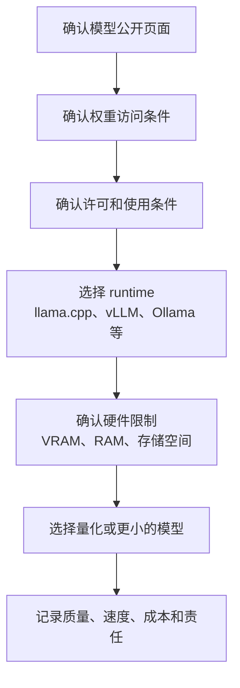

# P6-21.1 开放权重模型公开了什么？

> Section ID: `P6-21.1`
> Version: `v2026.08.11`

[开放权重模型](../../../reference/concept-glossary-pinyin/k.zh.md#open-weight-model)应同时检查 `model_id`、`weight_access`、`license_terms`、`training_transparency`、`runtime_path`、`deployment_responsibility`。留下这些记录，才不会把“可以下载”“是开源”“我可以负责任地运营”混成同一句话。

在 Part 6 中把模型读成服务结构时，通过公开 API 调用的模型和下载后直接运行的模型会分开。公开 API 不会让用户直接查看或移动模型文件，而是把请求发送到提供方的执行环境。相反，开放权重模型允许取得训练完成的[权重](../../../reference/concept-glossary-pinyin/q.zh.md#weight)，用户可以在自己的设备或选定的托管环境中运行它。

但开放权重并不立刻等于开源。有些模型可以取得权重文件，却没有充分公开训练数据细节、训练代码、过滤流程或评价流程。因此，本节的问题不是“它是否开放”，而是“什么以什么程度开放”。

## 权重公开与完整公开的差别

运行模型通常需要模型结构、[参数](../../../reference/concept-glossary-pinyin/c.zh.md#parameter)、tokenizer、推理代码和执行环境。参数经过训练后留下的数值就是权重。开放权重这个说法至少表示可以访问这些权重。

不过，要正确理解或复现模型，仅有权重还不够。还需要知道训练数据怎样收集、经过哪些过滤、使用哪些代码和设置训练、进行了哪些评价和安全检查。OSI 的 Open Source AI Definition 1.0 也说明，一个开放 AI 系统除了使用、研究、修改、分享的自由，还需要数据资料、代码和参数等组成部分。

以权重公开为中心的模型，适合这样阅读。

| 公开的内容 | 用户可以做什么 | 仍可能不知道什么 |
| --- | --- | --- |
| 权重文件 | 直接运行、调整推理成本结构、进行部分微调或 adapter 训练 | 训练数据构成、过滤标准、训练过程的可复现性 |
| 推理代码和设置 | 在相同 runtime 中复现执行，比较速度和内存 | 完整训练流程、评价数据、安全调整方式 |
| 训练代码和数据资料 | 做更深入的检查、评价可复现性、开发变体模型 | 实际数据能否访问、是否合法可用 |
| [许可](../../../reference/concept-glossary-pinyin/z.zh.md#license) | 判断使用、修改、再分发、商业使用是否允许 | 输出责任、违反政策的责任、第三方数据权利风险 |

这张表的重点是不把开放程度用一行判定。“权重公开了”是重要起点，但不会自动表示“训练过程可以复现”或“任何用途都可以自由使用”。

## 开源、开放权重与公开 API

在开源软件中，核心权利通常是查看、修改和分发源代码。对 AI 模型来说，仅有源代码还不够，因为模型行为除了代码，也强烈依赖训练数据和权重。因此，在 AI 中要把公开程度分得更细。

| 区分 | 用户直接得到什么 | 优点 | 注意点 |
| --- | --- | --- | --- |
| 公开 API | 只发送输入并接收输出 | 容易开始，运营负担较小 | 在提供方执行环境中处理，因此要确认数据传输、保存条件和模型变更范围 |
| 开放权重模型 | 训练后的权重和部分执行资料 | 可在本地、内部或云环境中直接运行和调整 | 许可、硬件、安全、更新和运营责任会落到用户身上 |
| 更完整公开的模型 | 权重、代码、数据资料、评价资料等 | 研究、验证、复现和变更的可能性更大 | 必须确认实际公开范围；数据权利和安全责任不会消失 |

因此，阅读开放权重时，不宜立刻分成“比封闭模型好”或“一定危险”。更准确的问题是“我需要控制的东西变成了什么”。

例如，使用公开 API 时，模型更新、服务、故障应对和部分安全政策由提供方承担。用户则会受到成本、使用量限制、数据传输和保存条件、模型可能变更的影响。直接运营开放权重模型能更直接控制数据位置和执行条件，但必须亲自处理服务器成本、安全补丁、质量评价、安全过滤和许可审查。

## 为什么本地执行与量化会一起出现

开放权重模型可以取得权重，所以常常与本地执行联系在一起。但能够取得权重并不表示它能立刻舒适地在自己的设备上运行。模型大小、内存、GPU 性能、context 长度和并发请求数都会改变可执行性。

这时常会出现量化（quantization）。量化把权重换成更小的数值表示，以减少内存使用和执行负担。不过质量、速度和稳定性会因模型和 runtime 而不同。下一节 [P6-21.2](section-02.zh.md)会先整理在本地执行环境中怎样区分 GPU VRAM、CPU RAM、dtype、量化和 CPU offloading。因此，Part 7 的本地 LLM 与图像生成实习就成为开放权重概念的自然后续实验。

把同一流程简化后如下。

这张图的重要点是，下载之后不会立刻进入执行。下载和执行之间还有许可、runtime、硬件、安全和评价标准。

## 为什么会出现选择开放权重的主张

选择开放权重的主张，并不只是说模型文件应该免费取得。核心是模型使用者应该能够更直接地选择数据位置、执行条件、变更时点和验证方法。使用提供方 API 可以更容易开始和运营，但用户无法自行决定每一次模型变更、使用量限制或数据传输条件。

支持开放权重的一方通常强调以下四点。

| 主张 | 用户获得的选择权 | 成立所需的条件 |
| --- | --- | --- |
| 数据控制 | 在直接管理的环境中处理敏感输入 | 内部执行环境、访问控制和安全运营 |
| 验证与复现 | 根据模型卡、评价资料和执行记录比较候选模型 | 实际确认公开范围和评价资料 |
| 按目的调整 | 在允许范围内选择 runtime、量化、adapter 和部署环境 | 遵守许可、具备硬件和运营人员 |
| 降低提供方依赖 | 不只受限于一个 API 的价格、政策或变更，而能选择执行路径 | 自己承担更新、故障应对和质量评价 |

这项主张并不等于“开放权重总是更好”。控制点增加时，检查、运营和安全责任也会一起转移。因此，应把它理解为同时询问“谁应更直接地控制模型”和“该主体能否承担这种控制所需的责任”。

## 开放权重带来的益处

开放权重模型的益处，与其说是“免费”，不如说是“控制点改变了”。

| 益处 | 实际含义 |
| --- | --- |
| 控制数据位置 | 可以不把敏感输入发送到外部 API，而在内部环境中处理 |
| 选择成本结构 | 可以把 API 调用成本换成自有硬件或选定托管的成本 |
| 调整执行条件 | 可按目的改变 context 长度、batch、量化、缓存和 runtime |
| 变更与调整 | 可在允许范围内尝试微调、LoRA、adapter 和 prompt 模板调整 |
| 扩大验证可能性 | 可以结合模型卡、评价结果和社区复现记录比较候选模型 |

这些益处在研究、教育、内部实验和数据外发敏感的环境中尤其重要。不过益处不会自动实现：越直接地运行模型，运营者越要作出更多判断。

## 开放权重的限制与责任

直接使用开放权重模型，会把原先交给提供方的一部分负担移到用户一侧。

| 限制或责任 | 要确认的问题 |
| --- | --- |
| 许可限制 | 是否确认商业使用、再分发、衍生模型公开和使用政策限制？ |
| 训练数据不透明 | 能否知道模型学了什么，以及哪些数据被包含或遗漏？ |
| 安全过滤与政策 | 不适当输出、安全风险和个人信息处理标准应在哪里阻止？ |
| 运营成本 | 硬件、电力、存储和维护成本真的比 API 成本更合适吗？ |
| 更新责任 | 谁追踪新版本、漏洞和 runtime 兼容性问题？ |
| 评价责任 | 是否用单独的评价集确认它在自己的使用场景中足够好？ |

一个重要误解是“我下载了模型，所以我是自由的”。能否下载是访问问题；能用到什么程度是许可和使用政策问题；能否安全运营则是评价和运营设计问题。

## 模型卡中应先看什么

查看开放权重模型候选时，应先看以下项目，而不是模型名称。

| 要确认的项目 | 为什么先看 |
| --- | --- |
| 许可 | 使用、修改、再分发和商业使用是否允许在这里分开 |
| 权重公开位置 | 要确认是否真的能取得文件，以及是否需要访问批准 |
| 模型大小和激活参数 | 判断执行内存和速度的起点 |
| 支持的 runtime | 确认能否在目标环境运行，以及是否有社区示例 |
| 模型卡和技术报告 | 确认训练范围、评价、限制和安全调整资料 |
| 使用政策 | 许可即使允许使用，也可能有额外禁止用途 |

按这张表来看，选择开放权重模型并不是从排行榜中挑最高的名字，而是选择适合自己目的、数据、硬件和责任范围的公开程度与执行路径。

## 按目的选择公开范围的简短判断

假设一个团队不能把内部文件发送到组织外，正在选择模型候选。只确认能否取得权重并不够，还要决定是否有能在内部运行的 runtime、许可是否允许这种使用，以及由谁检查质量和安全问题。

| 情况 | 先确认什么 | 下一步判断 |
| --- | --- | --- |
| 文件不能发送到外部 API | 权重访问、内部执行路径、存储位置 | 只保留可以本地或内部运行的候选，并记录运营责任 |
| 教育中必须复现模型行为 | 训练代码、数据资料和评价资料的公开范围 | 区分只公开权重的模型与具有更多复现资料的模型 |
| 要投入商业服务 | 许可、使用政策、更新和安全应对责任人 | 除了可执行性，只比较通过再分发和运营条件的候选 |

三种情况的第一判断都不是“开放或封闭”。应把目的所需的公开范围与该选择带来的责任写成一对。

## 交给 Part 7 实习的问题

Part 7 的本地 LLM 实习应把本节概念变成实际执行记录。即使是同一开放权重模型，小型量化文件和较大的原始文件也会有不同的执行负担和质量。同一模型在 `llama.cpp`、`Ollama`、`vLLM` 等 runtime 中，安装难度、速度、内存使用和运营方式也可能不同。

因此，Part 7 应留下以下值。

| 要记录的值 | 应阅读的判断 |
| --- | --- |
| 模型名称和版本 | 避免把同名的不同版本混在一起 |
| 许可和使用政策确认 | 判断实习结果可以公开或再利用到什么范围 |
| 权重格式和量化级别 | 比较内存与质量差异 |
| 执行 runtime | 即使是同一模型，执行路径也会改变结果和速度 |
| 输入长度和 context 设置 | 观察长上下文下速度和质量怎样变化 |
| 输出质量记录 | 不只确认执行成功，还要确认是否符合目的 |

把握这种连接，开放权重就不再是流行词，而是询问“我要在多大程度上控制模型并承担责任”的概念。

## 检查清单

- 能否说明开放权重不是开源的同义词？
- 能否分别查看权重公开、训练代码公开、数据资料公开和许可公开？
- 能否说明使用公开 API 与直接运营开放权重模型的责任差异？
- 能否先从模型卡确认许可、模型大小、runtime、使用政策和评价资料？
- 能否同时判断自己的目的所需公开范围和将承担的运营责任？
- 能否说明 Part 7 本地 LLM 实习应留下哪些执行记录项目？

## 来源与参考资料

- Open Source Initiative, [The Open Source AI Definition - 1.0](https://opensource.org/ai/open-source-ai-definition){: target="_blank" rel="noopener noreferrer" }, 确认日期：2026-08-11。
- Matt White 等, [The Model Openness Framework: Promoting Completeness and Openness for Reproducibility, Transparency, and Usability in Artificial Intelligence](https://arxiv.org/abs/2403.13784){: target="_blank" rel="noopener noreferrer" }, 确认日期：2026-08-11。
- Hugging Face, [The Open Source FAQ](https://github.com/huggingface/faq){: target="_blank" rel="noopener noreferrer" }, 确认日期：2026-08-11。
- OpenAI, [OpenAI open-weight models (gpt-oss)](https://help.openai.com/en/articles/11870455-openai-open-weight-models-gpt-oss){: target="_blank" rel="noopener noreferrer" }, 确认日期：2026-08-11。
- Linux Foundation, [Linux Foundation Welcomes the Open Model Initiative to Promote Openly Licensed AI Models](https://www.linuxfoundation.org/press/linux-foundation-welcomes-the-open-model-initiative-to-promote-openly-licensed-ai-models){: target="_blank" rel="noopener noreferrer" }, 确认日期：2026-08-11。
