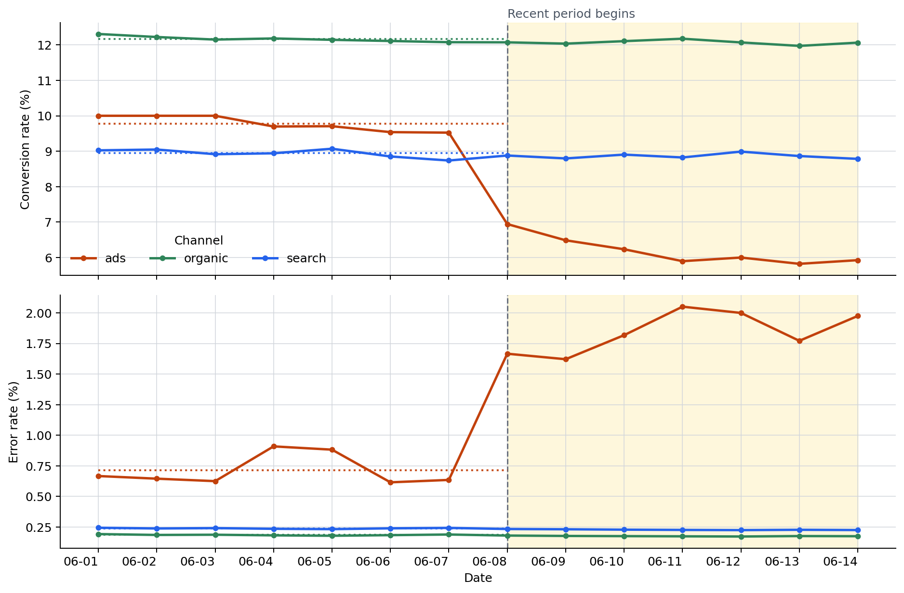

# P7-1.1 Defining the Project Question and Input

> Section ID: `P7-1.1`
> Version: `v2026.08.01`

Before choosing a model, define what you want to learn, what one row represents, and what period you will compare. Those three choices make a summary value evidence for the next analysis rather than an isolated number.

## Questions and units come before models

Before model selection, inspect the rows and columns, the unit represented by a row, and the period used for comparison. The same log leads to different tables and different review priorities depending on whether one whole day is one observation or one date-channel pair is one observation. This section establishes that distinction before introducing a model. A summary is useful only when its grouping rule remains visible to the reader who must act on it.

## Dates and channel-days

Use an excerpt from a fourteen-day acquisition-channel operations log. A daily total shows only a mild decline, while grouping the same records as `channel-day` rows reveals that paid ads alone deteriorated sharply.

In this example, one row is not a whole day. It is one channel on one date. The first practical lesson is therefore to state what a row means before calculating anything. Here, a row is a channel-day observation; it is not a claim that the three channels are interchangeable.

| date | channel | visitors | signups | errors |
| --- | --- | ---: | ---: | ---: |
| 2026-06-01 | organic | 520 | 64 | 1 |
| 2026-06-01 | search | 410 | 37 | 1 |
| 2026-06-01 | ads | 300 | 30 | 2 |
| 2026-06-08 | organic | 555 | 67 | 1 |
| 2026-06-08 | search | 428 | 38 | 1 |
| 2026-06-08 | ads | 360 | 25 | 6 |
| 2026-06-14 | organic | 572 | 69 | 1 |
| 2026-06-14 | search | 444 | 39 | 1 |
| 2026-06-14 | ads | 405 | 24 | 8 |

This is a synthetic example, not a copied production log. It is designed to resemble an operational situation in which totals do not move much while one acquisition channel degrades quickly. It should be read as a practice case for deciding what to inspect next, not as evidence about a real service.

## Interpretation to pause before aggregation

The first question is: “Did the overall conversion rate fall during the most recent seven days?” Even after answering yes, do not immediately write that the whole service became worse. Aggregation is only the starting signal. Return to channel-day rows to locate where the signal is concentrated.

```mermaid
--8<-- "assets/part-07/chapter-01/p7-1-1-case-reading-flow-en.mmd"
```

A safer conclusion does not mean that the cause is known. It means that the next review can be narrowed: investigate a whole-service issue first, or investigate one channel first. The following tables and chart are evidence for that review order, not proof of causation. In particular, an error-rate increase and a conversion-rate decrease can share a cause, or one can be unrelated to the other.

## Comparing daily and channel-day aggregation

Read the fourteen-day log at two levels: daily totals and channel-day rows. First compare the baseline seven days with the recent seven days. Then find the three recent channel-days with the lowest conversion rate.

- Situation: a report says signup conversion fell during the most recent seven days.
- Input: `date`, `channel`, `visitors`, `signups`, and `errors`.
- Expected output: baseline-versus-recent conversion rates, plus the three recent channel-days with the lowest conversion rate and their error rates.
- What to confirm:
  - The meaning of one row must be fixed before a comparison can be trusted.
  - A channel-level comparison can expose a problem hidden by a total.
  - The first success of an analysis project is to set the next review priority, not to assert a cause.

Write the question and the comparison unit down before running the code. That small record makes it possible to explain later why a date was classified as baseline or recent.

The practice CSV is kept in [`p7-1-traffic-log.csv`](../../../assets/part-07/chapter-01/p7-1-traffic-log.csv){ .csv-preview }, not embedded in the code. The example starts by reading that file, so run it from the repository root.

`summarize()` adds visitors, signups, and errors before computing rates. This avoids giving a day with 100 visitors the same weight as a day with 1,000 visitors. The baseline rate of 10.51% is therefore total baseline signups divided by total baseline visitors, not a simple average of seven daily rates.

```python
import csv
from collections import defaultdict
from datetime import datetime
from pathlib import Path

data_path = Path("docs/assets/part-07/chapter-01/p7-1-traffic-log.csv")
rows = list(csv.DictReader(data_path.open(encoding="utf-8")))
for row in rows:
    row["date"] = datetime.strptime(row["date"], "%Y-%m-%d").date()
    row["visitors"] = int(row["visitors"])
    row["signups"] = int(row["signups"])
    row["errors"] = int(row["errors"])
    if row["visitors"] <= 0:
        raise ValueError("visitors must be positive for every channel-day row.")

cutoff = datetime.strptime("2026-06-08", "%Y-%m-%d").date()
baseline_rows = [row for row in rows if row["date"] < cutoff]
recent_rows = [row for row in rows if row["date"] >= cutoff]
if not baseline_rows or not recent_rows:
    raise ValueError("Both sides of cutoff need rows. Check the date range.")

ads_recent_error_adjustment = 0
for row in recent_rows:
    if row["channel"] == "ads":
        row["errors"] = max(0, row["errors"] + ads_recent_error_adjustment)

def summarize(group_rows):
    visitors = sum(row["visitors"] for row in group_rows)
    signups = sum(row["signups"] for row in group_rows)
    errors = sum(row["errors"] for row in group_rows)
    if visitors == 0:
        raise ValueError("The comparison period has no visitors.")
    return {
        "visitors": visitors,
        "signups": signups,
        "errors": errors,
        "conversion_rate": round(signups / visitors, 4),
        "error_rate": round(errors / visitors, 4),
    }

# Combining the three channels on a date turns a day into one sample.
by_date = defaultdict(list)
for row in rows:
    by_date[row["date"]].append(row)
daily_summary = [{"date": date, **summarize(day_rows)} for date, day_rows in sorted(by_date.items())]
baseline_daily = [row for row in daily_summary if row["date"] < cutoff]
recent_daily = [row for row in daily_summary if row["date"] >= cutoff]
daily_baseline = summarize(baseline_daily)
daily_recent = summarize(recent_daily)

# The original row already represents one channel-day.
recent_channel_days = [
    {
        "date": row["date"].isoformat(),
        "channel": row["channel"],
        "conversion_rate": round(row["signups"] / row["visitors"], 4),
        "error_rate": round(row["errors"] / row["visitors"], 4),
    }
    for row in recent_rows
]
recent_channel_days.sort(key=lambda row: row["conversion_rate"])

channel_comparisons = []
for channel in sorted({row["channel"] for row in rows}):
    baseline = summarize([row for row in baseline_rows if row["channel"] == channel])
    recent = summarize([row for row in recent_rows if row["channel"] == channel])
    channel_comparisons.append({
        "channel": channel,
        "baseline_conversion": baseline["conversion_rate"],
        "recent_conversion": recent["conversion_rate"],
        "baseline_error": baseline["error_rate"],
        "recent_error": recent["error_rate"],
    })

print("daily baseline =", daily_baseline)
print("daily recent =", daily_recent)
print("file read =", data_path)
print("lowest recent channel-days =")
for row in recent_channel_days[:3]:
    print(row)
print("channel baseline/recent =")
for comparison in channel_comparisons:
    print(comparison)
```

## Reading the same rows three ways

| Constructed value | Grouping rule | Question answered |
| --- | --- | --- |
| `daily_summary` | Combine the three channels on the same date | Did the overall trend change recently? |
| `channel_comparisons` | Split each channel into baseline and recent periods | Which channel moved furthest from its baseline? |
| `recent_channel_days` | Keep the original channel-day row | Which date-channel row should be opened first? |

The three outputs do not repeat the same number. The first finds a change signal, the second locates the channel where the change is concentrated, and the third selects the actual rows a person should open next. This is why it is useful to keep all three forms in the project note instead of replacing them with a single score.

With the default cutoff, each period contains seven days. Moving the cutoff changes the length of both periods as well as the rows that count as recent.

```text
daily baseline = {'visitors': 8950, 'signups': 941, 'errors': 30, 'conversion_rate': 0.1051, 'error_rate': 0.0034}
daily recent = {'visitors': 9759, 'signups': 920, 'errors': 64, 'conversion_rate': 0.0943, 'error_rate': 0.0066}
lowest recent channel-days =
{'date': '2026-06-13', 'channel': 'ads', 'conversion_rate': 0.0582, 'error_rate': 0.0177}
{'date': '2026-06-11', 'channel': 'ads', 'conversion_rate': 0.059, 'error_rate': 0.0205}
{'date': '2026-06-14', 'channel': 'ads', 'conversion_rate': 0.0593, 'error_rate': 0.0198}
channel baseline/recent =
{'channel': 'ads', 'baseline_conversion': 0.0978, 'recent_conversion': 0.0617, 'baseline_error': 0.0071, 'recent_error': 0.0185}
{'channel': 'organic', 'baseline_conversion': 0.1217, 'recent_conversion': 0.1207, 'baseline_error': 0.0019, 'recent_error': 0.0018}
{'channel': 'search', 'baseline_conversion': 0.0894, 'recent_conversion': 0.0886, 'baseline_error': 0.0024, 'recent_error': 0.0023}
```

## Locating the change with a channel-day chart

The chart redraws the same CSV by channel-day. Dotted lines are weighted baseline rates for each channel; the pale yellow area is the recent seven-day period.



First observe that both ads lines move away from their baselines in the recent period. In the upper panel, ads conversion falls below its dotted baseline; in the lower panel, ads error rate rises above its dotted baseline. Organic and search do not make a comparably large directional turn in either panel.

Keep three statements separate when reading this image.

1. **Observation:** ads conversion falls while its error rate rises in the recent period.
2. **Still unknown:** this CSV cannot establish whether rising errors caused lower conversion, or whether both are effects of another change.
3. **Next check:** open ads landing-page deployment history, tracking-error types, and browser- or campaign-specific logs first.

The chart therefore does not prove a cause. Together with the period summary, it makes the case for reviewing the ads acquisition path first.

## Conclusions that change with the aggregation unit

| View | Baseline seven days | Recent seven days | Interpretation |
| --- | ---: | ---: | --- |
| Daily conversion rate | 10.51% | 9.43% | A decline is visible at the total level. |

| Channel | Baseline conversion | Recent conversion | Baseline error | Recent error | Interpretation |
| --- | ---: | ---: | ---: | ---: | --- |
| ads | 9.78% | 6.17% | 0.71% | 1.85% | Conversion fell and errors rose. |
| organic | 12.17% | 12.07% | 0.19% | 0.18% | Nearly unchanged. |
| search | 8.94% | 8.86% | 0.24% | 0.23% | Nearly unchanged. |

The three lowest recent channel-days make the first review targets concrete.

| Recent channel-day | Conversion rate | Error rate | Why review it? |
| --- | ---: | ---: | --- |
| 2026-06-13 ads | 5.82% | 1.77% | Lowest recent conversion rate. |
| 2026-06-11 ads | 5.90% | 2.05% | Highest error rate among these rows. |
| 2026-06-14 ads | 5.93% | 1.98% | Recheck conversion and error signals together. |

The project conclusion changes with the sample unit: a whole day yields only “conversion fell slightly,” while channel-day rows identify three ads records as the first review targets.

There is a second lesson in reading error rate beside conversion rate. Because ads alone moves far below its conversion baseline and above its error baseline, the next checks can start with the ads acquisition path: its tracking script, landing page, and particular browsers. The output does not decide which of those is responsible.

The first success is not claiming a cause; it is narrowing the next review priority. The code need not write the interpretation sentence for the learner. What matters is that the learner can separate the daily and channel-day outputs, then add a defensible next question.

## How the baseline boundary changes the recent rows

With the default `cutoff = 2026-06-08`, `2026-06-11` is among the three lowest-conversion recent rows. If the cutoff becomes `2026-06-12`, that date moves into the baseline and `2026-06-12 ads` enters the recent list instead.

| cutoff | Recent period | Three lowest-conversion recent channel-days | First change in interpretation |
| --- | --- | --- | --- |
| 2026-06-08 | Jun 8–14 | Jun 13 ads, Jun 11 ads, Jun 14 ads | Treat Jun 11 as a recent anomaly signal. |
| 2026-06-12 | Jun 12–14 | Jun 13 ads, Jun 14 ads, Jun 12 ads | Jun 11 is now baseline, not a recent review row. |

The code cannot select the correct boundary. A person must connect it to the question: for example, a deployment date, campaign start, or incident date.

## How the error signal changes the next question

`ads_recent_error_adjustment` adds or subtracts the same error count from every recent ads row. With the default cutoff it affects all seven recent ads rows. The conversion ranking stays the same when the adjustment is `-3`, but the error signal and therefore the next question change.

| Recent ads comparison | Adjustment 0 | Adjustment -3 | Next question |
| --- | ---: | ---: | --- |
| Conversion rate | 6.17% | 6.17% | Acquisition quality or the landing page may still need review. |
| Error rate | 1.85% | 1.07% | There is less reason to prioritize tracking-script or browser errors. |

Lower error rates still do not establish a cause. They simply weaken one signal that had been moving with the conversion decline.

## Change the boundary and error signal

Changing a value is useful here only when the resulting comparison changes what you inspect. Do not treat the altered output as a new fact about a real service; it is a way to rehearse how a project question constrains an interpretation.

1. Change `cutoff` to `2026-06-10` or `2026-06-12`.
   - Observe how the dates, channels, and rates in the three lowest recent channel-days change.
   - Record whether a row disappeared because its rate changed or simply because the comparison boundary moved.
2. Set `ads_recent_error_adjustment` to `-3`.
   - Observe whether the next question shifts from service errors toward acquisition quality when conversion ranks stay the same but error rates fall.
   - Keep conversion and error rate separate: changing the error count does not change the signup count in this example.

The main check is not merely whether the arithmetic runs. It is whether changing one boundary or one signal changes the interpretation and the next question that will be written down.

In a real project, preserve the original input separately from this kind of scenario adjustment. That makes it possible to distinguish a reproducible observation from a teaching or planning experiment.

Return to the unchanged CSV before recording a result as a project fact.

That separation also lets another reviewer reproduce the initial comparison.

It also keeps a changed teaching scenario from being mistaken for source evidence.

## Checklist

| Check | Question to answer |
| --- | --- |
| Question | Did you state the first project question in one sentence? |
| Input unit | Did you distinguish what one row means from what one sample means? |
| Comparison unit | Did you confirm that totals and channel-days can lead to different conclusions? |
| Baseline | Did you keep the summaries and comparison table as a baseline for the next comparison? |
| Next question | Did you write at least two further columns or periods to inspect? |

If those five fields are filled in, the question, input unit, baseline, and next question remain in the project record. The project is ready for its next comparison even before a model is built.

## Final handoff

Keep the question, input unit, time range, baseline, and named next inspection together.
Do not let an aggregate replace the rows that created it.
Preserve the current comparison before adding a model.
State which column or period will be inspected next.
Keep uncertainty separate from an observed change.
Use the same record fields in the next run.

## Sources and references

- Python Software Foundation, [`csv — CSV File Reading and Writing`](https://docs.python.org/3/library/csv.html){: target="_blank" rel="noopener noreferrer" }, Python 3 Documentation. Accessed 2026-06-29.
