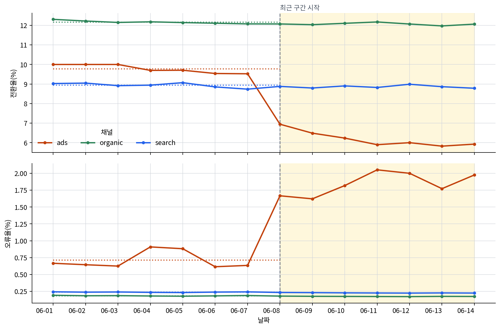

# P7-1.1 프로젝트 질문과 입력 정의

> Section ID: `P7-1.1`
> Version: `v2026.08.01`

프로젝트는 모델을 고르기 전에 `무엇을 알고 싶은가`, `한 행이 무엇을 뜻하는가`, `무엇과 비교할 것인가`를 정합니다. 이 세 가지가 있어야 요약값이 다음 분석의 근거가 됩니다.

## 모델보다 앞서는 질문과 단위

모델 선택보다 먼저 데이터의 행과 열, 행이 뜻하는 단위, 비교할 기간을 확인합니다. 같은 로그라도 하루를 한 건으로 합칠지, 특정 날짜의 특정 채널을 한 건으로 볼지에 따라 다음 표와 검토 우선순위가 달라집니다. 이 절은 그 차이를 모델 없이 먼저 확인합니다.

## 일자와 채널-일자

`최근 14일 유입 채널 운영 로그` 발췌를 사용합니다. 핵심은 전체 일별 합계만 보면 약한 하락처럼 보이지만, `채널-일자(channel-day)` 단위로 다시 묶으면 광고 유입만 크게 무너졌다는 점이 드러난다는 것입니다.

예제에서 한 행은 `하루 전체`가 아니라 `특정 날짜의 특정 채널`입니다. 즉, 이 절의 첫 실습 포인트는 숫자를 계산하는 일보다 먼저 `한 행이 무엇을 뜻하는가`를 분명히 잡는 데 있습니다.

아래는 본문에서 실제로 쓸 CSV의 일부 발췌입니다.

| date | channel | visitors | signups | errors |
| --- | --- | ---: | ---: | ---: |
| 2026-06-01 | organic | 520 | 64 | 1 |
| 2026-06-01 | search | 410 | 37 | 1 |
| 2026-06-01 | ads | 300 | 30 | 2 |
| 2026-06-08 | organic | 555 | 67 | 1 |
| 2026-06-08 | search | 428 | 38 | 1 |
| 2026-06-08 | ads | 360 | 25 | 6 |
| 2026-06-14 | organic | 572 | 69 | 1 |
| 2026-06-14 | search | 444 | 39 | 1 |
| 2026-06-14 | ads | 405 | 24 | 8 |

이 예제는 외부 로그를 그대로 복제한 것은 아니지만, `전체 합계는 크게 흔들리지 않는데 특정 유입 채널만 급격히 악화되는 운영 상황`을 실제 프로젝트처럼 읽을 수 있도록 만든 자체 사례입니다.

## 집계 전에 멈춰야 할 해석

이 사례의 첫 질문은 `최근 7일의 전체 전환율이 낮아졌는가?`입니다. 하지만 그 질문에 `그렇다`라고 답한 다음 곧바로 `서비스 전체가 나빠졌다`고 쓰면, 행의 단위가 지워집니다. 아래 흐름처럼 전체 집계는 이상 신호를 찾는 출발점으로만 쓰고, 그 다음에 채널-일자 행으로 돌아와 신호가 모인 위치를 확인합니다.

```mermaid
--8<-- "assets/part-07/chapter-01/p7-1-1-case-reading-flow-ko.mmd"
```

여기서 `더 안전한 판단`은 원인을 알아냈다는 뜻이 아닙니다. `전체 문제`와 `특정 채널 문제` 중 어느 쪽을 먼저 검토할지 좁혔다는 뜻입니다. 이 차이를 유지하면, 뒤의 표와 그래프를 원인 증명 자료가 아니라 다음 로그를 열 순서를 정하는 자료로 읽을 수 있습니다.

## 일자 집계와 채널-일자 집계 비교

예제는 14일 운영 로그를 읽고 `하루 전체`와 `채널-일자`라는 두 단위에서 무엇이 보이는지 비교합니다. 기준선 7일과 최근 7일의 일자 집계를 먼저 읽고, 최근 기간에서 전환율이 가장 낮은 채널-일자 세 건을 찾습니다.

- 문제 상황: 최근 7일 동안 가입 전환율(conversion rate)이 떨어졌다는 제보가 들어왔다.
- 입력: `date`, `channel`, `visitors`, `signups`, `errors`
- 기대 출력:
  - 기준선 7일과 최근 7일의 전체 전환율 비교
  - 전환율이 가장 낮은 최근 채널-일자 세 건과 오류율
- 확인할 개념:
  - `한 행이 무엇인가`를 먼저 잡아야 비교 기준이 흔들리지 않는다
  - 전체 합계만 보면 놓치는 문제가 채널 단위 비교에서 드러날 수 있다
  - 데이터 분석 프로젝트의 첫 성공은 원인을 단정하는 것이 아니라 `다음 검토 우선순위`를 만드는 것이다

실습용 CSV를 코드 안에 직접 넣지 않고 [`p7-1-traffic-log.csv`](../../../assets/part-07/chapter-01/p7-1-traffic-log.csv){ .csv-preview }에 둡니다. Python 코드는 그 파일을 읽는 단계부터 시작합니다. 아래 코드는 이 저장소의 최상위 디렉터리에서 실행합니다.

이 코드에서 `summarize()`는 먼저 `visitors`, `signups`, `errors`를 각각 더한 뒤 전환율과 오류율을 계산합니다. 하루 방문자가 100명인 날과 1,000명인 날을 같은 비중으로 평균내지 않기 위해서입니다. 따라서 `일자 집계 기준선`의 10.51%는 7일 전환율의 단순 평균이 아니라, 기준선 7일의 전체 가입 수를 전체 방문자 수로 나눈 값입니다.

```python
# 웹 트래픽 로그를 일자와 채널-일자 단위로 읽어 이상 신호가 드러나는 위치를 비교하는 예제입니다.
import csv
from collections import defaultdict
from datetime import datetime
from pathlib import Path

data_path = Path("docs/assets/part-07/chapter-01/p7-1-traffic-log.csv")
rows = list(csv.DictReader(data_path.open(encoding="utf-8")))
for row in rows:
    row["date"] = datetime.strptime(row["date"], "%Y-%m-%d").date()
    row["visitors"] = int(row["visitors"])
    row["signups"] = int(row["signups"])
    row["errors"] = int(row["errors"])
    if row["visitors"] <= 0:
        raise ValueError(f"{row['date']}, {row['channel']} 행의 visitors는 0보다 커야 합니다.")

# 조작 변수: 이 날짜를 바꾸면 기준선과 최근 구간의 경계가 달라집니다.
cutoff = datetime.strptime("2026-06-08", "%Y-%m-%d").date()
baseline_rows = [row for row in rows if row["date"] < cutoff]
recent_rows = [row for row in rows if row["date"] >= cutoff]
if not baseline_rows or not recent_rows:
    raise ValueError("cutoff 양쪽에 행이 있어야 합니다. 입력 파일의 날짜 범위를 확인하세요.")

# 조작 변수: 최근 ads 행마다 더하거나 뺄 오류 건수입니다.
ads_recent_error_adjustment = 0
for row in recent_rows:
    if row["channel"] == "ads":
        row["errors"] = max(0, row["errors"] + ads_recent_error_adjustment)

def summarize(group_rows):
    visitors = sum(row["visitors"] for row in group_rows)
    signups = sum(row["signups"] for row in group_rows)
    errors = sum(row["errors"] for row in group_rows)
    if visitors == 0:
        raise ValueError("비교 구간에 visitors가 없습니다. cutoff 날짜나 입력 파일을 확인하세요.")
    return {
        "visitors": visitors,
        "signups": signups,
        "errors": errors,
        "conversion_rate": round(signups / visitors, 4),
        "error_rate": round(errors / visitors, 4),
    }

# 같은 날짜의 세 채널을 합치면 하루가 한 샘플이 됩니다.
by_date = defaultdict(list)
for row in rows:
    by_date[row["date"]].append(row)

daily_summary = [
    {"date": date, **summarize(day_rows)}
    for date, day_rows in sorted(by_date.items())
]
baseline_daily = [row for row in daily_summary if row["date"] < cutoff]
recent_daily = [row for row in daily_summary if row["date"] >= cutoff]
daily_baseline = summarize(baseline_daily)
daily_recent = summarize(recent_daily)

# 원본의 한 행은 이미 하나의 채널-일자입니다.
recent_channel_days = []
for row in recent_rows:
    recent_channel_days.append({
        "date": row["date"].isoformat(),
        "channel": row["channel"],
        "conversion_rate": round(row["signups"] / row["visitors"], 4),
        "error_rate": round(row["errors"] / row["visitors"], 4),
    })
recent_channel_days.sort(key=lambda row: row["conversion_rate"])

channel_comparisons = []
for channel in sorted({row["channel"] for row in rows}):
    baseline = summarize([row for row in baseline_rows if row["channel"] == channel])
    recent = summarize([row for row in recent_rows if row["channel"] == channel])
    channel_comparisons.append({
        "channel": channel,
        "baseline_conversion": baseline["conversion_rate"],
        "recent_conversion": recent["conversion_rate"],
        "baseline_error": baseline["error_rate"],
        "recent_error": recent["error_rate"],
    })

print("일자 집계 기준선 =", daily_baseline)
print("일자 집계 최근 =", daily_recent)
print("읽은 파일 =", str(data_path))
print("전환율이 낮은 최근 채널-일자 3건 =")
for row in recent_channel_days[:3]:
    print(row)
print("채널별 기준선/최근 =")
for comparison in channel_comparisons:
    print(comparison)
```

## 같은 행을 세 방식으로 읽기

코드는 CSV의 원본 행을 세 가지 방식으로 사용합니다.

| 코드에서 만드는 것 | 묶는 기준 | 답하는 질문 |
| --- | --- | --- |
| `daily_summary` | 같은 날짜의 세 채널을 합친다 | 전체 흐름이 최근에 달라졌는가? |
| `channel_comparisons` | 같은 채널을 기준선과 최근으로 나눈다 | 어느 채널이 기준선에서 가장 크게 벗어났는가? |
| `recent_channel_days` | 원본의 채널-일자 행을 그대로 둔다 | 실제로 어느 날짜·채널 행을 먼저 열어 볼 것인가? |

세 출력은 같은 숫자를 중복해서 보여 주는 것이 아닙니다. 첫 출력은 변화 신호를 찾고, 두 번째 출력은 변화가 모인 채널을 찾고, 세 번째 출력은 사람이 바로 검토할 행을 고릅니다.

기본 `cutoff`에서는 기준선과 최근 구간이 각각 7일입니다. 다른 날짜로 바꾸면 두 구간의 길이도 함께 달라집니다. 실행 결과 예시는 다음과 같습니다.

```text
일자 집계 기준선 = {'visitors': 8950, 'signups': 941, 'errors': 30, 'conversion_rate': 0.1051, 'error_rate': 0.0034}
일자 집계 최근 = {'visitors': 9759, 'signups': 920, 'errors': 64, 'conversion_rate': 0.0943, 'error_rate': 0.0066}
읽은 파일 = docs/assets/part-07/chapter-01/p7-1-traffic-log.csv
전환율이 낮은 최근 채널-일자 3건 =
{'date': '2026-06-13', 'channel': 'ads', 'conversion_rate': 0.0582, 'error_rate': 0.0177}
{'date': '2026-06-11', 'channel': 'ads', 'conversion_rate': 0.059, 'error_rate': 0.0205}
{'date': '2026-06-14', 'channel': 'ads', 'conversion_rate': 0.0593, 'error_rate': 0.0198}
채널별 기준선/최근 =
{'channel': 'ads', 'baseline_conversion': 0.0978, 'recent_conversion': 0.0617, 'baseline_error': 0.0071, 'recent_error': 0.0185}
{'channel': 'organic', 'baseline_conversion': 0.1217, 'recent_conversion': 0.1207, 'baseline_error': 0.0019, 'recent_error': 0.0018}
{'channel': 'search', 'baseline_conversion': 0.0894, 'recent_conversion': 0.0886, 'baseline_error': 0.0024, 'recent_error': 0.0023}
```

## 채널-일자 그래프로 변화 위치 읽기

기간별 표는 기준선과 최근의 차이를 압축해 보여 줍니다. 아래 그래프는 같은 CSV를 채널-일자 단위로 다시 그려, 그 차이가 어느 날짜부터 어느 채널에서 이어졌는지 보여 줍니다. 점선은 각 채널의 기준선 7일 가중 비율이고, 옅은 노란 영역은 최근 7일입니다.



그래프에서 먼저 읽을 사실은 `ads의 두 선이 최근 구간에서 함께 멀어진다`는 것입니다. 위 패널에서는 ads 전환율이 기준선 점선 아래로 내려가고, 아래 패널에서는 ads 오류율이 기준선 점선 위로 올라갑니다. 반면 organic과 search는 두 패널에서 큰 방향 전환이 없습니다.

이 그림을 읽을 때는 세 단계를 구분합니다.

1. **관찰:** 최근 구간에서 ads의 전환율 하락과 오류율 상승이 함께 보인다.
2. **아직 모르는 것:** 오류 증가가 전환율 하락을 일으켰는지, 둘 다 다른 변화의 결과인지는 이 CSV만으로 알 수 없다.
3. **다음 확인:** ads landing page 배포 이력, 추적 스크립트 오류 유형, 브라우저·캠페인별 로그를 먼저 비교한다.

따라서 그래프는 원인을 증명하지 않습니다. 기간 전체의 요약값과 함께 `ads 유입 경로를 먼저 검토할 근거`를 더 분명하게 만드는 역할을 합니다.

## 집계 단위가 바꾸는 결론

이 출력은 `일자 집계`, `채널별 기간 비교`, `최근 채널-일자`라는 세 단위에서 읽어야 합니다.

하루를 한 샘플로 합치면 전체 하락 신호는 보이지만 원인은 아직 흐릿합니다.

| 일자 집계 | 기준선 7일 | 최근 7일 | 해석 |
| --- | ---: | ---: | --- |
| 전환율 | 10.51% | 9.43% | 전체 수준에서 하락 신호가 보인다 |

채널별 기준선과 최근을 나란히 놓으면 하락이 ads에만 집중됐음을 확인할 수 있습니다.

| 채널 | 기준선 전환율 | 최근 전환율 | 기준선 오류율 | 최근 오류율 | 해석 |
| --- | ---: | ---: | ---: | ---: | --- |
| ads | 9.78% | 6.17% | 0.71% | 1.85% | 전환율은 낮고 오류율은 높아졌다 |
| organic | 12.17% | 12.07% | 0.19% | 0.18% | 거의 유지된다 |
| search | 8.94% | 8.86% | 0.24% | 0.23% | 거의 유지된다 |

최근 채널-일자 세 건은 실제로 어느 날짜와 채널을 먼저 열어 볼지 알려 줍니다.

| 최근 채널-일자 | 전환율 | 오류율 | 검토 이유 |
| --- | ---: | ---: | --- |
| 2026-06-13 ads | 5.82% | 1.77% | 최근 전환율이 가장 낮다 |
| 2026-06-11 ads | 5.90% | 2.05% | 오류율이 가장 높다 |
| 2026-06-14 ads | 5.93% | 1.98% | 전환율과 오류율을 함께 다시 볼 대상이다 |

이 세 표가 보여 주는 첫 번째 교훈은 `한 행을 무엇으로 볼 것인가`에 따라 프로젝트 결론이 달라진다는 점입니다.

- `하루 전체`를 샘플로 보면 `전환율이 조금 내려갔다`는 약한 결론만 남습니다.
- `채널-일자`를 샘플로 보면 최근 전환율이 가장 낮은 세 건이 모두 ads라는 더 구체적인 사실이 나옵니다.

두 번째 교훈은 `전환율 하락`만 보는 것보다 `오류율 변화`를 같이 봐야 다음 질문이 더 선명해진다는 점입니다.

- ads만 기준선보다 전환율이 크게 낮아지고 오류율이 높아졌으므로, 다음 확인은 `서비스 전체 메시지 문제`보다 ads 유입 경로의 추적 스크립트, landing page, 특정 브라우저 쪽으로 좁혀집니다.

즉, 데이터 분석 프로젝트의 첫 성공은 `원인을 단정했다`가 아니라 `다음 검토 우선순위를 더 좁혔다`는 데 있습니다.

예제에서 확인해야 할 결과는 코드가 해석 문장까지 대신 쓰는가가 아닙니다. 코드 출력에서 `일자 집계`와 `채널-일자`를 분리해 얻고, 그 위에 사람이 다음 질문을 얹을 수 있는가가 더 중요합니다.

## 기준선 경계가 바꾸는 최근 세 건

기본값인 `cutoff = 2026-06-08`에서는 최근 7일의 최저 전환율 세 건에 `2026-06-11`이 들어갑니다. `2026-06-12`로 바꾸면 그 날은 기준선 쪽으로 이동하고, 최근 세 건에는 `2026-06-12`가 새로 들어옵니다.

| cutoff | 최근 구간 | 전환율이 낮은 최근 채널-일자 세 건 | 먼저 달라지는 판단 |
| --- | --- | --- | --- |
| 2026-06-08 | 6월 8일~14일 | 6월 13일 ads, 6월 11일 ads, 6월 14일 ads | 6월 11일도 최근 이상 신호로 본다 |
| 2026-06-12 | 6월 12일~14일 | 6월 13일 ads, 6월 14일 ads, 6월 12일 ads | 6월 11일은 기준선에 들어가고 최근 검토 목록에서 빠진다 |

이 비교는 `어느 날부터 최근으로 볼 것인가`가 보고서의 사실 목록을 바꾼다는 뜻입니다. 어느 경계가 정답인지는 코드가 결정하지 않습니다. 배포일, 캠페인 시작일, 장애 발생일처럼 질문과 연결되는 기준을 사람이 선택해야 합니다.

## 오류 신호가 바꾸는 다음 질문

`ads_recent_error_adjustment`는 최근 ads 행마다 같은 오류 건수를 더하거나 뺍니다. 기본 `cutoff`에서는 ads 행 7건 모두에 적용됩니다. 기본값과 `-3`을 비교하면 전환율 순위는 같지만, 오류 신호를 해석하는 방향은 달라집니다.

| ads 최근 비교 | 조정값 0 | 조정값 -3 | 다음 질문 |
| --- | ---: | ---: | --- |
| 전환율 | 6.17% | 6.17% | 유입 품질이나 landing page 문제가 남는다 |
| 오류율 | 1.85% | 1.07% | 추적 스크립트나 브라우저 오류를 우선 의심할 근거는 약해진다 |

오류율이 낮아져도 원인이 확정되는 것은 아닙니다. 다만 전환율과 함께 움직이던 오류 신호가 약해졌으므로, 다음 확인의 우선순위가 달라집니다.

## 경계와 오류 신호를 바꾸면

값을 조금만 바꿔도 `어떤 비교 단위에서 이상 신호가 보이는가`가 달라집니다. 처음 실행한 뒤에는 다음 두 가지만 직접 바꿔 보는 편이 좋습니다.

1. `cutoff` 날짜를 `2026-06-10`이나 `2026-06-12`로 바꿔 봅니다.
   관찰할 점: 전환율이 가장 낮은 최근 채널-일자 세 건의 날짜, 채널, 전환율이 어떻게 바뀌는가?

2. `ads_recent_error_adjustment`를 `-3`으로 바꿔 봅니다.
   관찰할 점: 전환율 순서는 그대로인데 오류율이 낮아지면, 다음 질문이 `서비스 오류`보다 `유입 품질 변화` 쪽으로 이동하는가?

즉, 핵심 확인 기준은 `숫자를 맞게 계산했는가`보다 `비교 구간과 열 하나를 바꾸면 본문에서 정리할 해석과 다음 질문이 어떻게 달라지는가`입니다.

## 체크리스트

| 확인할 것 | 스스로 답할 질문 |
| --- | --- |
| 질문 | 이 프로젝트의 첫 질문을 한 문장으로 적었는가? |
| 입력 단위 | 한 행이 무엇이고, 한 샘플을 어디까지로 볼지 구분했는가? |
| 비교 단위 | 전체 합계와 채널-일자 비교가 서로 다른 결론을 만들 수 있음을 확인했는가? |
| 기준점 | 요약값과 비교표를 다음 비교가 기대는 기준점(baseline)으로 남겼는가? |
| 다음 질문 | 결과를 보고 추가로 확인할 열이나 구간을 최소 2개 이상 적었는가? |

이 다섯 칸이 채워지면 질문과 입력 단위, 기준점, 다음 질문이 문서에 남습니다. 아직 모델을 만들지 않았더라도 프로젝트는 이미 다음 비교를 시작할 수 있는 상태입니다.

## 출처와 참고 자료

- Python Software Foundation, `csv — CSV File Reading and Writing`, Python 3 Documentation, 확인 날짜: 2026-06-29. [https://docs.python.org/3/library/csv.html](https://docs.python.org/3/library/csv.html){: target="_blank" rel="noopener noreferrer" }
