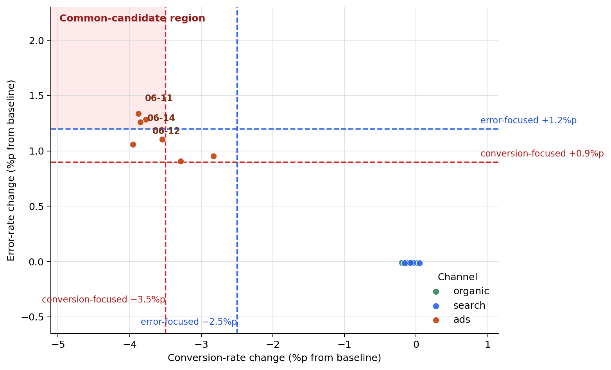

# P7-1.2 Baselines and the First Comparison

> Section ID: `P7-1.2`
> Version: `v2026.08.01`

In a first comparison, decide the baseline, candidate rules, unit of comparison, and metric before interpreting results. Then read the result as facts, interpretations, and next questions. A baseline becomes a reusable comparison point rather than a number copied into a report.

Calculating an average, maximum, or rate does not by itself establish that a result is good or bad. The first comparison asks what actually changed from the baseline and what deserves inspection first.

## The first comparison placed on a baseline

- Why should a baseline come before a calculated result?
- How should the baseline and current value be placed side by side?
- How can a first comparison record distinguish a confirmed fact from an interpretation that remains a hypothesis?

The essential structure is `baseline → current value → comparison result → next question`. A calculation is useful because of the reference point it is placed on, not because it stands alone.

Part 7 fixes its shared comparison-record form here. Later failure records and improvement plans reuse the same `fact`, `interpretation`, and `next question` structure, but they must first state what the baseline was.

When the distinction between a retrospective and a review becomes unclear, use this working distinction: a retrospective organizes material for the next iteration, while a review rechecks an item that is not yet settled.

## What the baseline comparison should make possible

- Explain what comparison axis a baseline establishes and how the current value differs from it.
- Record `fact`, `interpretation`, and `next question` separately in a project document.
- Explain how changing a comparison rule moves different items to the front of the first comparison record.
- Leave limitations and follow-up work beside the result summary.

## Numbers alone are not a comparison

A project report is often reduced to sentences such as these.

- “Average visitors were 150.7.”
- “2026-06-05 was the best day.”

Those sentences do not say whether the value is unusual, within the normal range, or connected to a decision. A project record should preserve the baseline and where the current value departs from it.

| Question | Short answer |
| --- | --- |
| Why put the baseline first? | To create an axis for deciding how to read the current value. |
| What must be separated? | The baseline itself, current value, difference, and interpretation. |
| How does the document change? | It becomes a comparison record instead of a list of numbers. |

In a data-analysis project, “how far did it depart from the baseline?” often produces a more useful next question than “what was the value?”

For example, finding the day with the most errors is not enough. Ask whether the errors coincide with a deployment, whether they rise with declining signups, and whether the next iteration needs another experiment or another log column.

## Why facts, interpretations, and next questions are separate

Use five fields to make a first comparison record readable.

| Field | What to record |
| --- | --- |
| Baseline | Usual value, reference period, or basic comparison axis. |
| Current value | The value just calculated. |
| Fact | A value directly established by the code. |
| Interpretation | A possibility suggested by the value. |
| Next question | What should be checked immediately afterward. |

The current value has little meaning alone; a difference can be read only on a baseline; and an interpretation can still be a hypothesis after the difference is visible.

In P7-1.1, the daily aggregate, channel baseline/recent comparison, and recent channel-day rows are all candidates for facts. “The change is concentrated in ads” is an interpretation. Asking whether to inspect the landing page or tracking script is a next question. Keep these layers separate so the first comparison can lead into another iteration.

## Separating fact and hypothesis in the ads case

The P7-1.1 output can be recorded as follows.

| Fact | Interpretation | Next question |
| --- | --- | --- |
| Overall conversion fell from 10.51% in the seven-day baseline to 9.43% in the recent seven days. | A decline is visible overall, but its cause is still unclear. | Did every channel change in the same way? |
| Ads conversion fell from 9.78% to 6.17%. | The decline may be concentrated in ads rather than the whole service. | Should the ads landing page, tracking script, or campaign settings be checked first? |
| Ads error rate rose from 0.71% to 1.85%. | The change may be connected to an operational signal, not just acquisition volume. | Should error type, browser, and deployment history be compared together? |

The word “may” matters. Even with a visible difference from baseline, it is safer to write: “Errors increased while signups decreased, so their relationship needs further checking.”

- Risky statement: “Errors caused signups to fall.”
- Safer statement: “Errors and declining signups appear together, so further checking is needed.”

A comparison that begins with “the ads campaign failed” skips evidence. Record the departure from baseline, the accompanying error-rate rise, and the fact that other channels do not show the same pattern first. The baseline is a device for pausing an early causal conclusion.

```mermaid
--8<-- "assets/part-07/chapter-01/p7-1-2-channel-anomaly-flow-en.mmd"
```

## Changing the rule changes the first comparison

Before polishing a retrospective sentence, decide what counts as a meaningful departure from baseline. This example places a conversion-focused rule and an error-focused rule side by side, then finds rows that remain candidates under both rules.

- Situation: reread the recent seven-day log and decide which dates and channels to keep as review candidates.
- Input: [`p7-1-traffic-log.csv`](../../../assets/part-07/chapter-01/p7-1-traffic-log.csv){ .csv-preview } and two review rules.
- Expected output: candidate lists by rule, their overlap, and a fact–interpretation–next-question record.
- What to confirm:
  - A retrospective fixes review priorities rather than copying calculation results.
  - Changing a rule changes the candidate list.
  - Items that remain under both rules can be stronger review signals.

## Conditions for selecting candidates under two rules

- Put the baseline beside the current value and its difference.
- Mark conversion-focused and error-focused candidates separately.
- Put candidates shared by both rules at the front of the retrospective.
- Do not mix facts, interpretations, and next questions in one sentence.

The rules do not merely select a wide and a narrow version of the same group. The conversion-focused rule requires a larger conversion drop but a smaller error rise; the error-focused rule reverses that emphasis. Their common candidates therefore have large changes in both metrics. This is an operational review rule, not proof of causation or statistical significance.

The code reads decimal differences as percentage points: `-0.035` means a conversion decline of at least 3.5 percentage points, and `0.009` means an error-rate rise of at least 0.9 percentage points.

| Review rule | Condition for a candidate |
| --- | --- |
| Conversion-focused | Conversion down at least 3.5%p and error rate up at least 0.9%p. |
| Error-focused | Conversion down at least 2.5%p and error rate up at least 1.2%p. |

With the default `cutoff = 2026-06-08`, a comparison unit is one recent channel-day row compared with the same channel’s weighted baseline rate. Changing the cutoff also changes the length of the baseline and recent periods. A daily value is more variable than a baseline aggregate, so the result selects rows to open first; it does not make a final judgment about one day.

Run the code from the repository root.

```python
import csv
from collections import defaultdict
from datetime import datetime
from pathlib import Path

review_rules = [
    {
        "name": "conversion-focused",
        # Start with rows where the conversion decline is especially large.
        "conversion_drop_max": -0.035,
        "error_rise_min": 0.009,
    },
    {
        "name": "error-focused",
        # Start with rows where the error-rate rise is especially large.
        "conversion_drop_max": -0.025,
        "error_rise_min": 0.012,
    },
]

def conversion_rate(row):
    if row["visitors"] == 0:
        raise ValueError(f"Cannot calculate a rate for zero visitors: {row}")
    return row["signups"] / row["visitors"]

def error_rate(row):
    return row["errors"] / row["visitors"]

data_path = Path("docs/assets/part-07/chapter-01/p7-1-traffic-log.csv")
rows = list(csv.DictReader(data_path.open(encoding="utf-8")))
for row in rows:
    row["date"] = datetime.strptime(row["date"], "%Y-%m-%d").date()
    row["visitors"] = int(row["visitors"])
    row["signups"] = int(row["signups"])
    row["errors"] = int(row["errors"])

# Changing this date changes the baseline and recent periods.
cutoff = datetime.strptime("2026-06-08", "%Y-%m-%d").date()
baseline_rows = [row for row in rows if row["date"] < cutoff]
recent_rows = [row for row in rows if row["date"] >= cutoff]
if not baseline_rows or not recent_rows:
    raise ValueError("Both sides of cutoff need rows. Check the input date range.")

# A scenario changes rows only in memory; the input CSV is never edited.
scenario_channel = None
recent_signups_adjustment = 0
recent_errors_adjustment = 0
for row in recent_rows:
    if row["channel"] == scenario_channel:
        row["signups"] = max(0, row["signups"] + recent_signups_adjustment)
        row["errors"] = max(0, row["errors"] + recent_errors_adjustment)

baseline_by_channel = defaultdict(lambda: {"visitors": 0, "signups": 0, "errors": 0})
for row in baseline_rows:
    totals = baseline_by_channel[row["channel"]]
    totals["visitors"] += row["visitors"]
    totals["signups"] += row["signups"]
    totals["errors"] += row["errors"]

for channel, totals in baseline_by_channel.items():
    if totals["visitors"] == 0:
        raise ValueError(f"No visitors in the baseline for channel {channel}.")
    totals["conversion_rate"] = totals["signups"] / totals["visitors"]
    totals["error_rate"] = totals["errors"] / totals["visitors"]

candidate_rows = []
for row in recent_rows:
    if row["channel"] not in baseline_by_channel:
        raise ValueError(f"No baseline exists for channel {row['channel']}.")
    baseline = baseline_by_channel[row["channel"]]
    current_conversion = conversion_rate(row)
    current_error = error_rate(row)
    candidate_rows.append({
        "date": row["date"],
        "channel": row["channel"],
        "conversion_rate": round(current_conversion, 4),
        "error_rate": round(current_error, 4),
        # Use unrounded values for selection; round only for display.
        "conversion_delta_raw": current_conversion - baseline["conversion_rate"],
        "error_delta_raw": current_error - baseline["error_rate"],
        "conversion_delta": round(current_conversion - baseline["conversion_rate"], 4),
        "error_delta": round(current_error - baseline["error_rate"], 4),
    })

review_results = {}
for rule in review_rules:
    review_results[rule["name"]] = [
        {
            "date": row["date"].isoformat(),
            "channel": row["channel"],
            "conversion_delta": row["conversion_delta"],
            "error_delta": row["error_delta"],
        }
        for row in candidate_rows
        if row["conversion_delta_raw"] <= rule["conversion_drop_max"]
        and row["error_delta_raw"] >= rule["error_rise_min"]
    ]

conversion_keys = {(row["date"], row["channel"]) for row in review_results["conversion-focused"]}
error_keys = {(row["date"], row["channel"]) for row in review_results["error-focused"]}
common_keys = sorted(conversion_keys & error_keys)
candidate_by_key = {
    (row["date"].isoformat(), row["channel"]): {
        "date": row["date"].isoformat(), "channel": row["channel"],
        "conversion_delta": row["conversion_delta"], "error_delta": row["error_delta"],
    }
    for row in candidate_rows
}
common_candidates = [candidate_by_key[key] for key in common_keys]

def print_candidates(title, candidates):
    print(title)
    if not candidates:
        print("  none")
        return
    print("  date        channel  conversion change  error change")
    for row in candidates:
        print(f"  {row['date']}  {row['channel']:<7} {row['conversion_delta'] * 100:+.2f}%p             {row['error_delta'] * 100:+.2f}%p")

print("candidates by rule =")
print("file read =", data_path)
for name, candidates in review_results.items():
    print_candidates(name, candidates)
print_candidates("common review candidates", common_candidates)
```

The output can be read as follows.

```text
candidates by rule =
file read = docs/assets/part-07/chapter-01/p7-1-traffic-log.csv
conversion-focused
  date        channel  conversion change  error change
  2026-06-10  ads     -3.54%p             +1.10%p
  2026-06-11  ads     -3.88%p             +1.34%p
  2026-06-12  ads     -3.78%p             +1.29%p
  2026-06-13  ads     -3.95%p             +1.06%p
  2026-06-14  ads     -3.85%p             +1.26%p
error-focused
  2026-06-11  ads     -3.88%p             +1.34%p
  2026-06-12  ads     -3.78%p             +1.29%p
  2026-06-14  ads     -3.85%p             +1.26%p
common review candidates
  2026-06-11  ads     -3.88%p             +1.34%p
  2026-06-12  ads     -3.78%p             +1.29%p
  2026-06-14  ads     -3.85%p             +1.26%p
```

The default output contains five conversion-focused candidates, three error-focused candidates, and three candidates common to both: ads on 2026-06-11, 2026-06-12, and 2026-06-14.

If a changed cutoff or threshold prints `none`, execution has not failed. That rule has no priority row in that comparison. Recheck all three of these conditions.

- Does the cutoff fit the project question?
- Is the threshold too high for the size of the departure?
- Is there enough recent input to compare with the baseline?

An empty list is a result to interpret, not a signal to silently relax the rule until a candidate appears.

## Reading the candidate-threshold chart

The chart places conversion-rate change and error-rate change on two axes. Each point is one recent channel-day; color indicates channel. The pale upper-left area is where both rules select the same row.



Ads on 06-11, 06-12, and 06-14 lie in that area and remain under both rules. Ads on 06-10 and 06-13 have larger conversion drops but do not reach the 1.2%p error-rise condition, so they are excluded by the error-focused rule.

This difference explains a useful review discipline.

- Put common candidates at the front because both signals are strong under their respective rules.
- Keep single-rule candidates as observation candidates rather than discarding them.
- Do not turn a point’s position on this plot into an assertion about the cause of the change.

The chart makes the rule boundary visible; it does not choose the business consequence or the remedial action.

## Why common candidates become priorities

| Observation | What to read from it |
| --- | --- |
| The conversion-focused rule selects five rows. | It keeps rows with larger conversion declines first. |
| The error-focused rule selects three rows. | It keeps rows with larger error-rate rises first. |
| Every common candidate is ads. | A signal that survives a rule change moves to the front of the priority list. |
| Organic and search are not candidates. | Do not turn an overall decline into a claim about every channel. |

## Turning common candidates into next questions

| Fact | Interpretation | Next question |
| --- | --- | --- |
| The conversion-focused rule returns five rows and the error-focused rule returns three. | The retrospective scope changes with the immediate-response criterion. | Which signal should define immediate response: conversion or error rate? |
| Ads on Jun 11, 12, and 14 recur under both rules. | Both signals may be strong in the same interval. | Should ads landing page, tracking script, or campaign settings be opened first? |
| Organic and search do not become candidates. | An apparent overall decline may be concentrated in one channel. | Should the channel be subdivided by browser, campaign, or device? |

The important question is not “are there many candidates?” but “which ones survive when the rule changes?” In a real project, those rows go at the front of the retrospective record.

The rule itself should also remain in that record. A reader needs to see whether a row was selected because conversion decline, error-rate increase, or both met a stated threshold. Without that context, a candidate list can look more certain than it is.

## Change candidate range and channel scenario

The rule shapes the retrospective sentence, so vary it after the default run. `scenario_channel = None` makes no input change. Setting a channel name applies adjustments only in memory to that channel’s recent rows; it never changes the source CSV.

1. Raise or lower either rule’s thresholds.
   - Observe whether the dates that survive in common stay the same or whether the front of the retrospective changes.
2. Set `scenario_channel = "organic"`, `recent_signups_adjustment = -20`, and `recent_errors_adjustment = 7`.
   - Observe whether the retrospective changes from “one channel anomaly” to “multiple-channel anomaly.”

The check is not whether the sentence sounds polished. It is whether changing the review rule changes the review priority in a way the record makes visible.

After each scenario, write one factual line about the candidate list and one separate line about the next inspection. This makes it harder to mistake a simulated condition for an observed production event.

## Causal claims and next questions are different

| Type | Example |
| --- | --- |
| Weak retrospective | “Many errors made signups fall. Do better next time.” |
| Useful retrospective | “Ads on 2026-06-11, 06-12, and 06-14 remained under both review rules. Keep this interval as a priority review candidate; in the next iteration record campaign, release_version, and error_type as well.” |

A weak retrospective leaves an impression but not an action. A useful one records what was seen, what is still unknown, and what should be added. It is a record of items requiring review, not an automatic diagnosis.

## Why this matters in practice

The practical value of analysis is often how an organization can reuse it, not how complicated the calculation was.

- Operations can connect high-error dates to incident records.
- Product teams can connect high-signup days to interface changes.
- Data teams can add log columns needed for next week’s experiment.

A good project record lets another person decide a next action.

That handoff has three practical parts.

- The operations reader can locate the date and channel to compare with incident records.
- The product reader can see which outcome needs to be checked against a release or interface change.
- The data reader can see which missing field would make the next comparison more informative.

None of those actions requires the first comparison to diagnose the cause. They require it to preserve the baseline, the observed difference, and the boundary between fact and interpretation.

## Checklist

| Check | Question to answer |
| --- | --- |
| Baseline | What is the baseline, and why does it fit the current question? |
| Fact | Did you record only values directly established by code? |
| Interpretation | Did you separate possibilities and limitations instead of asserting a cause? |
| Priority | Did you put candidates that survive a rule change at the front? |
| Next iteration | Did you state specific additional columns, comparison units, or operating rules? |

The checklist is not a request for a long retrospective. Numbers, possibilities, and next actions must occupy different fields so that the next reader can continue from the same record.

When a baseline changes, retain the prior baseline and the reason for the replacement. Otherwise a later reader cannot tell whether an apparent improvement is a new result or only a new reference point.

Likewise, preserve the date range and the comparison unit. A channel-day candidate and a seven-day channel aggregate answer different questions, even when both describe the same channel.

The first comparison succeeds when it makes the next inspection reproducible, not when it produces the strongest-sounding diagnosis.
Record that inspection owner or review queue when the project has one.

## Final handoff

Keep the candidate definition with the baseline window.
Preserve both recovered and newly wrong records.
Separate a review signal from a confirmed cause.
Use the same comparison unit in the next run.
Record the owner of the follow-up inspection.
Keep the raw evidence available for review.
Do not turn the first comparison into a final diagnosis.
State the next fixed reference explicitly.
Keep the date range visible.

## Sources and references

This section’s example data and retrospective structure are original material created for this book’s project practice. It does not quote external material directly.
