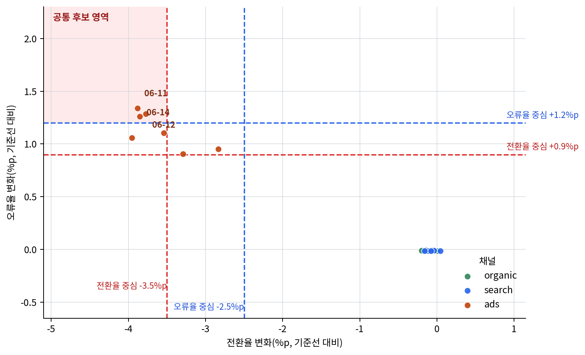

# P7-1.2 baseline과 첫 비교

> Section ID: `P7-1.2`
> Version: `v2026.08.01`

첫 비교에서는 baseline, 후보 규칙, 비교 단위, 지표를 먼저 정하고, 그 결과를 사실·해석·다음 질문으로 나눠 읽습니다. 그래야 baseline이 단순한 비교 대상이 아니라 다음 실험을 여는 비교 기준으로 남습니다.

운영 로그를 읽고 평균, 최대값, 비율을 계산했다고 해서 바로 `좋다`, `나쁘다`를 말할 수는 없습니다. baseline과 첫 비교는 숫자를 다시 적는 절이 아니라, `무엇이 기준선보다 실제로 달라졌는가`, `그 차이 가운데 무엇이 먼저 볼 만한가`를 가르는 자리입니다.

## 기준선 위에 놓을 첫 비교

- baseline은 왜 계산 결과 앞에 먼저 놓아야 하는가?
- 기준선과 현재 값을 어떻게 나란히 비교해야 하는가?
- 첫 비교에서 확인한 사실과 아직 가설인 해석을 어떻게 구분해 적어야 하는가?

핵심은 `baseline -> 현재 값 -> 비교 결과 -> 다음 질문`으로 이어지는 첫 비교 구조를 세우는 데 있습니다. 계산 기록은 혼자 놓일 때보다 어떤 기준선 위에 올려 두었는지가 더 중요하며, 그 기준이 있어야 다음 반복 판단으로 이어집니다.

Part 7의 공통 비교 기록 형식은 이 절에서 처음 고정됩니다. 이후 프로젝트의 실패 기록과 개선 계획도 모두 여기서 세운 `사실, 해석, 다음 질문` 구조를 다시 사용하지만, 그 앞에는 언제나 `무엇을 기준선으로 두었는가`가 먼저 와야 합니다.

Part 7에서 `회고(retrospective)`와 `검토(review)`의 구분이 다시 흔들리면, 먼저 `회고는 다음 반복을 준비하는 정리`, `검토는 아직 확정하지 않은 항목을 다시 보는 확인`으로 읽고 이 절과 개념사전의 회고(retrospective), 검토(review) 항목으로 돌아오면 됩니다.

## 기준선이 만드는 비교 문장

- baseline이 어떤 비교 기준을 만들고, 현재 값이 그 기준과 어떻게 달라지는지 설명할 수 있습니다.
- 프로젝트 문서에서 `사실`, `해석`, `다음 질문`을 구분해 적을 수 있습니다.
- 비교 기준을 바꾸면 어떤 항목이 첫 비교 문서의 앞줄로 올라오는지 설명할 수 있습니다.
- 결과 요약만으로 끝나지 않고 한계와 보완점을 함께 남길 수 있습니다.

## 숫자만으로는 비교가 되지 않는다

프로젝트를 끝내면 종종 다음 두 문장으로 끝내려 합니다.

- `평균 방문자 수는 150.7명이었다.`
- `2026-06-05가 가장 좋았다.`

하지만 이런 문장만으로는 지금 값이 평소보다 나쁜 것인지, 원래 변동 범위 안에 있는 것인지 알 수 없습니다. 프로젝트 문서는 계산 결과를 옮겨 적는 곳이 아니라, `무엇을 기준선으로 보았고`, `그 기준선에서 어디가 실제로 벗어났는지`를 남기는 곳입니다.

baseline과 첫 비교가 계산 기록과 어떻게 다른지 판단 기준을 표로 고정하면 다음과 같습니다.

| 질문 | 짧은 답 |
| --- | --- |
| 왜 baseline을 먼저 두는가? | 현재 값을 좋은지 나쁜지 가를 비교축을 만들기 위해 |
| 무엇을 먼저 구분해야 하는가? | 기준선 자체, 현재 값, 차이, 해석 |
| 그래서 프로젝트 문서가 달라지는 점은 무엇인가? | 단순 숫자 나열에서 비교 기록으로 바뀐다 |

특히 데이터 분석 프로젝트에서는 `얼마였는가`보다 `기준선에서 얼마나 벗어났는가`가 다음 단계로 이어지는 질문을 더 잘 만듭니다.

예를 들어 `오류가 가장 많았던 날`을 찾는 것만으로는 충분하지 않습니다. 실제로는 다음이 더 중요합니다.

- 그 오류가 배포와 연결되었는가?
- 오류 증가가 가입 감소와 함께 나타났는가?
- 다음 실험이나 로그 추가가 필요한가?

## 사실, 해석, 다음 질문을 나누는 이유

첫 비교 문서도 다음 다섯 칸으로 나누면 훨씬 읽기 쉬워집니다.

| 구분 | 적을 내용 |
| --- | --- |
| baseline | 평소값, 기준 구간, 기본 비교축 |
| 현재 값 | 방금 계산한 값 |
| 사실 | 코드로 직접 확인한 값 |
| 해석 | 그 값이 시사하는 가능성 |
| 다음 질문 | 바로 이어서 확인해야 할 것 |

이 구분이 중요한 이유는, `현재 값`은 혼자서는 의미가 약하고 `차이`는 baseline 위에서만 읽히며, 해석은 그 뒤에도 여전히 가설 수준일 수 있기 때문입니다.

방금 P7-1.1에서 본 `일자 집계`, `채널별 기준선/최근`, `최근 채널-일자` 출력은 각각 사실 후보입니다. 그 출력에서 `ads에 변화가 집중됐다`고 읽는 문장은 해석이고, landing page나 추적 스크립트를 확인할지 묻는 문장은 다음 질문입니다. 이 세 층을 섞지 않아야 P7-1.1의 비교가 다음 반복으로 이어집니다.

## ads 사례에서 사실과 가설을 나누기

P7-1.1의 결과를 이 구조에 맞추면 다음처럼 적을 수 있습니다.

| 사실 | 해석 | 다음 질문 |
| --- | --- | --- |
| 전체 전환율은 기준선 7일 10.51%에서 최근 7일 9.43%로 내려갔다. | 서비스 전체에서는 하락 신호가 보이지만, 원인은 아직 흐릿하다. | 이 하락이 모든 채널에서 같이 나타났는가? |
| ads 채널 전환율은 9.78%에서 6.17%로 크게 떨어졌다. | 하락의 중심이 서비스 전체가 아니라 ads 채널일 가능성이 크다. | ads landing page, 추적 스크립트, 캠페인 설정 중 무엇을 먼저 볼 것인가? |
| ads 채널 오류율은 0.71%에서 1.85%로 올라갔다. | 단순 유입량 변화보다 운영 이상 신호와 연결될 가능성이 있다. | 오류 유형, 브라우저, 배포 이력을 함께 확인해야 하는가? |

이 표에서 중요한 점은 `가능성`과 `사실`을 섞지 않는 것입니다. 기준선과 비교한 차이가 보여도, 먼저 `추가 확인이 필요한가`를 적는 수준에 머무르는 편이 안전합니다.

`오류 때문에 가입이 떨어졌다`고 단정하는 것은 아직 이릅니다. 지금 단계에서 안전한 표현은 다음과 같습니다.

`오류 증가와 가입 감소가 함께 보였으므로, 관련 가능성을 추가로 확인할 필요가 있다.`

이 문장 차이를 꼭 익혀 두는 편이 좋습니다.

- 위험한 문장: `오류 때문에 가입이 떨어졌다.`
- 안전한 문장: `오류와 가입 감소가 함께 보여 추가 확인이 필요하다.`

예를 들어 `ads 채널 전환율이 내려갔다`는 한 줄만 보면, 빠르게는 `ads 캠페인이 실패했다`고 적고 싶어집니다. 하지만 더 안전한 다음 판단은 그렇게 단정하는 것이 아니라, `기준선 대비 하락`, `오류율 동반 상승`, `다른 채널은 같은 패턴이 아닌가`를 먼저 나눠 적는 것입니다. 그래야 첫 비교 문서가 감상문이 아니라, 실제로 어디부터 다시 볼지를 정하는 기록이 됩니다. 이 장면에서 baseline은 숫자를 예쁘게 정리하는 장치가 아니라, 성급한 원인 단정을 한 번 멈추게 하는 장치입니다.

```mermaid
--8<-- "assets/part-07/chapter-01/p7-1-2-channel-anomaly-flow-ko.mmd"
```

## 비교 기준을 바꾸면 첫 비교도 달라진다

실제 프로젝트에서는 회고 문장을 예쁘게 쓰는 일보다 `무엇이 baseline 대비 의미 있는 차이인가`를 먼저 정해야 합니다. 이 예제는 전환율 하락을 먼저 보는 기준과 오류율 상승을 먼저 보는 기준을 나란히 두고, 두 관점에서 모두 남는 후보를 찾습니다.

같은 운영 로그를 이어 받아, 예제에서는 `어떤 날짜와 채널을 회고 후보로 올릴 것인가`를 기준에 따라 나눠 보겠습니다.

- 문제 상황:
  - 최근 7일 로그를 다시 읽으며 어떤 날짜와 채널을 검토 후보로 남길지 정해야 한다.
  - 하지만 전환율 하락과 오류율 상승을 어느 수준부터 심각 신호로 볼지는 팀이나 단계마다 다를 수 있다.
- 입력:
  - [`p7-1-traffic-log.csv`](../../../assets/part-07/chapter-01/p7-1-traffic-log.csv){ .csv-preview }
  - 두 가지 검토 기준: `전환율 중심`, `오류율 중심`
- 기대 출력:
  - 기준별 검토 후보 목록
  - 어떤 날짜가 두 기준 모두에서 올라오는지
  - 회고 문서에 바로 옮길 `사실`, `해석`, `다음 질문`
- 확인할 개념:
  - 회고는 계산 결과를 옮겨 적는 문서가 아니라 검토 우선순위를 고정하는 문서다
  - 기준을 바꾸면 회고 후보도 달라진다
  - 그래도 두 기준에서 공통으로 올라오는 항목은 더 강한 검토 신호로 읽을 수 있다

## 두 기준에서 후보를 고르는 조건

- 기준선을 먼저 적고, 현재 값과 차이를 그 옆에 둡니다.
- 전환율 중심과 오류율 중심에서 각각 올라오는 검토 후보를 따로 표시합니다.
- 두 기준에서 공통으로 남는 후보를 회고 앞줄 후보로 고릅니다.
- `사실`, `해석`, `다음 질문`을 한 문장 안에 섞지 않고 분리해 씁니다.

## 전환율 중심과 오류율 중심

두 기준은 후보 수를 넓고 좁게 나누는 관계가 아닙니다. 전환율 중심은 전환율 하락을 더 크게 요구하는 대신 오류율 상승 기준을 낮추고, 오류율 중심은 그 반대로 둡니다. 따라서 공통 후보는 두 지표가 모두 크게 변한 행이며, 한 기준의 결과를 그대로 다시 세는 것이 아닙니다. 다만 이는 검토 순서를 정하는 운영 규칙일 뿐, 원인이나 통계적 유의성을 증명하지는 않습니다.

코드의 비율 차이는 소수가 아니라 퍼센트포인트 차이로 읽습니다. `-0.035`는 전환율이 3.5%p 이상 내려갔다는 뜻이고, `0.009`는 오류율이 0.9%p 이상 올라갔다는 뜻입니다.

| 검토 기준 | 후보로 남기는 조건 |
| --- | --- |
| 전환율 중심 | 전환율 3.5%p 이상 하락, 오류율 0.9%p 이상 상승 |
| 오류율 중심 | 전환율 2.5%p 이상 하락, 오류율 1.2%p 이상 상승 |

기본 `cutoff = 2026-06-08`에서 이 예제의 비교 단위는 `최근 채널-일자` 한 행이고, 각 행은 같은 채널의 기준선 7일 집계 비율과 비교합니다. cutoff를 바꾸면 기준선과 최근 구간의 길이도 함께 달라집니다. 하루 값은 기준선 집계보다 흔들리기 쉬우므로, 이 결과는 하루의 차이를 확정하는 판정이 아니라 먼저 열어 볼 날짜와 채널을 고르는 검토 후보입니다.

아래 코드는 저장소 최상위 디렉터리에서 실행합니다.

```python
# 트래픽 로그에서 전환율과 오류율을 서로 다른 기준으로 비교해 공통 검토 후보를 고르는 예제입니다.
import csv
from collections import defaultdict
from datetime import datetime
from pathlib import Path

review_rules = [
    {
        "name": "전환율 중심",
        # 전환율 하락이 특히 큰 행을 먼저 봅니다.
        "conversion_drop_max": -0.035,
        "error_rise_min": 0.009,
    },
    {
        "name": "오류율 중심",
        # 오류율 상승이 특히 큰 행을 먼저 봅니다.
        "conversion_drop_max": -0.025,
        "error_rise_min": 0.012,
    },
]

def conversion_rate(row):
    if row["visitors"] == 0:
        raise ValueError(f"visitors가 0인 행은 비율을 계산할 수 없습니다: {row}")
    return row["signups"] / row["visitors"]

def error_rate(row):
    return row["errors"] / row["visitors"]

data_path = Path("docs/assets/part-07/chapter-01/p7-1-traffic-log.csv")
rows = list(csv.DictReader(data_path.open(encoding="utf-8")))
for row in rows:
    row["date"] = datetime.strptime(row["date"], "%Y-%m-%d").date()
    row["visitors"] = int(row["visitors"])
    row["signups"] = int(row["signups"])
    row["errors"] = int(row["errors"])

# 조작 변수: 이 날짜를 바꾸면 기준선과 최근 구간이 달라집니다.
cutoff = datetime.strptime("2026-06-08", "%Y-%m-%d").date()
baseline_rows = [row for row in rows if row["date"] < cutoff]
recent_rows = [row for row in rows if row["date"] >= cutoff]
if not baseline_rows or not recent_rows:
    raise ValueError("cutoff 양쪽에 행이 있어야 합니다. 입력 파일의 날짜 범위를 확인하세요.")

# 조작 변수: 원본 CSV를 바꾸지 않고 최근 특정 채널의 상황을 가정합니다.
scenario_channel = None
recent_signups_adjustment = 0
recent_errors_adjustment = 0
for row in recent_rows:
    if row["channel"] == scenario_channel:
        row["signups"] = max(0, row["signups"] + recent_signups_adjustment)
        row["errors"] = max(0, row["errors"] + recent_errors_adjustment)

baseline_by_channel = defaultdict(lambda: {"visitors": 0, "signups": 0, "errors": 0})
for row in baseline_rows:
    baseline_by_channel[row["channel"]]["visitors"] += row["visitors"]
    baseline_by_channel[row["channel"]]["signups"] += row["signups"]
    baseline_by_channel[row["channel"]]["errors"] += row["errors"]

for channel, totals in baseline_by_channel.items():
    if totals["visitors"] == 0:
        raise ValueError(f"기준선 {channel} 채널에 visitors가 없습니다.")
    totals["conversion_rate"] = totals["signups"] / totals["visitors"]
    totals["error_rate"] = totals["errors"] / totals["visitors"]

candidate_rows = []
for row in recent_rows:
    if row["channel"] not in baseline_by_channel:
        raise ValueError(f"{row['channel']} 채널의 기준선이 없습니다.")
    baseline = baseline_by_channel[row["channel"]]
    current_conversion = conversion_rate(row)
    current_error = error_rate(row)
    candidate_rows.append({
        "date": row["date"],
        "channel": row["channel"],
        "conversion_rate": round(current_conversion, 4),
        "error_rate": round(current_error, 4),
        # 판정에는 원값을 쓰고, 출력에서만 소수 넷째 자리로 읽기 쉽게 표시합니다.
        "conversion_delta_raw": current_conversion - baseline["conversion_rate"],
        "error_delta_raw": current_error - baseline["error_rate"],
        "conversion_delta": round(current_conversion - baseline["conversion_rate"], 4),
        "error_delta": round(current_error - baseline["error_rate"], 4),
    })

review_results = {}
for rule in review_rules:
    selected = []
    for row in candidate_rows:
        if (
            row["conversion_delta_raw"] <= rule["conversion_drop_max"]
            and row["error_delta_raw"] >= rule["error_rise_min"]
        ):
            selected.append({
                "date": row["date"].isoformat(),
                "channel": row["channel"],
                "conversion_delta": row["conversion_delta"],
                "error_delta": row["error_delta"],
            })
    review_results[rule["name"]] = selected

conversion_focus_keys = {
    (row["date"], row["channel"]) for row in review_results["전환율 중심"]
}
error_focus_keys = {
    (row["date"], row["channel"]) for row in review_results["오류율 중심"]
}
common_keys = sorted(conversion_focus_keys & error_focus_keys)
candidate_by_key = {
    (row["date"].isoformat(), row["channel"]): {
        "date": row["date"].isoformat(),
        "channel": row["channel"],
        "conversion_delta": row["conversion_delta"],
        "error_delta": row["error_delta"],
    }
    for row in candidate_rows
}
common_candidates = [candidate_by_key[key] for key in common_keys]

def print_candidates(title, rows):
    print(title)
    if not rows:
        print("  없음")
        return
    print("  날짜        채널    전환율 변화  오류율 변화")
    for row in rows:
        print(
            f"  {row['date']}  {row['channel']:<7} "
            f"{row['conversion_delta'] * 100:+.2f}%p      "
            f"{row['error_delta'] * 100:+.2f}%p"
        )

print("기준별 검토 후보 =")
print("읽은 파일 =", str(data_path))
for rule_name, rows in review_results.items():
    print_candidates(rule_name, rows)
print_candidates("공통 검토 후보", common_candidates)
```

실행 결과 예시는 다음처럼 읽을 수 있습니다.

```text
기준별 검토 후보 =
읽은 파일 = docs/assets/part-07/chapter-01/p7-1-traffic-log.csv
전환율 중심
  날짜        채널    전환율 변화  오류율 변화
  2026-06-10  ads     -3.54%p      +1.10%p
  2026-06-11  ads     -3.88%p      +1.34%p
  2026-06-12  ads     -3.78%p      +1.29%p
  2026-06-13  ads     -3.95%p      +1.06%p
  2026-06-14  ads     -3.85%p      +1.26%p
오류율 중심
  날짜        채널    전환율 변화  오류율 변화
  2026-06-11  ads     -3.88%p      +1.34%p
  2026-06-12  ads     -3.78%p      +1.29%p
  2026-06-14  ads     -3.85%p      +1.26%p
공통 검토 후보
  날짜        채널    전환율 변화  오류율 변화
  2026-06-11  ads     -3.88%p      +1.34%p
  2026-06-12  ads     -3.78%p      +1.29%p
  2026-06-14  ads     -3.85%p      +1.26%p
```

cutoff나 임계값을 바꾼 뒤 후보 목록에 `없음`이 표시돼도 실행 실패는 아닙니다. 그 기준선과 규칙에서는 우선 검토할 행이 없다는 뜻입니다. 이때는 cutoff가 질문에 맞는지, 임계값이 너무 높은지, 최근 구간에 비교할 입력이 충분한지를 다시 확인합니다.

출력의 전환율 변화와 오류율 변화를 좌표로 놓으면, 각 기준이 무엇을 더 엄격하게 보는지 더 쉽게 읽을 수 있습니다. 아래 차트의 점 하나는 최근 채널-일자 한 행이며, 색은 채널을 뜻합니다. 왼쪽 위의 옅은 영역은 두 기준을 모두 통과해 공통 후보가 되는 위치입니다.



`ads`의 06-11, 06-12, 06-14는 이 영역 안에 있어 두 기준에서 모두 남습니다. 06-10과 06-13은 전환율 하락은 더 크지만 오류율 상승이 1.2%p에 못 미쳐 오류율 중심 후보에서는 빠집니다. 이 차이가 공통 후보를 먼저 확인하되, 한 기준에서만 잡힌 행도 바로 버리지 않고 추가 관찰 후보로 남겨야 하는 이유입니다.

## 두 기준에서 반복되는 후보

이 예제에서 확인해야 할 결과는 `문장을 잘 썼는가`가 아니라, `검토 기준을 바꾸었을 때도 계속 남는 신호가 무엇인가`입니다. 그래야 회고 문서가 단순 감상문이 아니라 다음 행동의 우선순위 표가 됩니다.

## 공통 후보가 우선순위가 되는 이유

| 관찰 | 읽어야 할 뜻 |
| --- | --- |
| 전환율 중심은 5건을 고른다 | 전환율 하락이 큰 행을 먼저 남긴다 |
| 오류율 중심은 3건을 고른다 | 오류율 상승이 큰 행을 먼저 남긴다 |
| 공통 후보는 모두 ads 채널이다 | 기준을 바꿔도 사라지지 않는 신호가 우선순위 앞줄로 올라간다 |
| organic과 search는 후보가 아니다 | 전체 하락을 모든 채널 문제로 단정하지 않아야 한다 |

## 공통 후보를 다음 질문으로 바꾸기

위 출력은 회고 문서 안에서 다음처럼 바로 읽을 수 있습니다.

| 사실 | 해석 | 다음 질문 |
| --- | --- | --- |
| 전환율 중심에서는 5건, 오류율 중심에서는 3건이 검토 후보로 올라왔다. | 무엇을 먼저 볼지에 따라 회고 범위가 달라진다. | 전환율과 오류율 중 어떤 신호를 즉시 대응 기준으로 둘 것인가? |
| 두 기준 모두에서 `ads`의 2026-06-11, 06-12, 06-14가 반복 등장했다. | 두 신호가 함께 강한 구간일 가능성이 있다. | ads landing page, 추적 스크립트, 캠페인 설정을 먼저 볼 것인가? |
| organic과 search는 같은 기준에서 검토 후보로 올라오지 않았다. | 전체 하락처럼 보여도 실제 운영 이상은 특정 채널에 집중됐을 수 있다. | 채널 단위를 더 잘게 쪼개 브라우저, 캠페인, 디바이스 기준도 확인할 것인가? |

이 표에서 중요한 점은 `후보가 많다`보다 `어떤 후보가 기준을 바꿔도 살아남는가`입니다. 실제 프로젝트에서는 바로 그 항목이 먼저 회고 문서의 앞줄로 올라옵니다.

## 후보 범위와 채널 시나리오를 바꾸면

`기준을 어떻게 쓰는가`에 따라 회고 문장이 달라지는 구조이므로, 실행 뒤에는 검토 기준을 직접 흔들어 보는 편이 좋습니다.

기본값 `scenario_channel = None`은 입력값을 바꾸지 않습니다. 채널 이름을 넣으면 그 채널의 현재 최근 구간 행마다 조정값이 메모리에서만 적용되며, 원본 CSV 파일은 바뀌지 않습니다.

1. 전환율 중심 또는 오류율 중심의 기준을 조금 더 높이거나 낮춰 봅니다.
   관찰할 점: 공통으로 살아남는 날짜는 그대로인가, 아니면 회고 앞줄에 올라올 후보가 달라지는가?

2. `scenario_channel = "organic"`, `recent_signups_adjustment = -20`, `recent_errors_adjustment = 7`로 바꿔 봅니다.
   관찰할 점: 회고 문장이 `특정 채널 이상`에서 `여러 채널 동시 이상`으로 바뀌는가?

핵심 확인 기준은 `문장을 예쁘게 쓰는가`보다 `검토 기준을 바꾸면 회고 우선순위가 어떻게 달라지는가`입니다.

## 원인 단정과 다음 질문의 차이

회고를 쓸 때는 `결과 요약`과 `해석`을 한 줄에 섞기 쉽습니다. 아래처럼 대비해서 보면 차이가 더 분명합니다.

| 구분 | 예시 |
| --- | --- |
| 나쁜 회고 | `오류가 많아서 가입이 떨어졌다. 다음에는 더 잘하자.` |
| 좋은 회고 | `ads 채널의 2026-06-11, 06-12, 06-14는 두 검토 규칙에서 반복해서 남았다. 이 구간을 우선 검토 후보로 두고, 다음 반복에서는 campaign, release_version, error_type을 함께 기록한다.` |

나쁜 회고는 감상은 남지만 다음 행동이 남지 않습니다. 좋은 회고는 `무엇을 봤는가`, `무엇을 아직 모르는가`, `무엇을 더 넣을 것인가`가 같이 남습니다. 즉, 회고의 경고 문장도 자동 진단이 아니라 검토 필요 항목을 남기는 기록으로 읽혀야 합니다.

## 실무에서 왜 이 방식이 중요한가

실무에서는 분석 결과보다 `분석 결과를 조직이 어떻게 다시 쓸 수 있느냐`가 더 중요합니다.

예를 들어:

- 운영 팀은 오류가 많은 날짜를 보고 장애 기록과 연결합니다.
- 제품 팀은 가입이 높은 날을 보고 UI 변경과 연결합니다.
- 데이터 팀은 다음 주 실험 설계에 필요한 로그 열을 추가합니다.

즉, 프로젝트 문서가 좋다는 뜻은 `계산이 복잡하다`가 아니라 `다른 사람이 다음 행동을 결정할 수 있다`는 뜻에 더 가깝습니다.

## 체크리스트

| 확인할 것 | 스스로 답할 질문 |
| --- | --- |
| baseline | 무엇을 기준선으로 두었고, 왜 그 기준이 현재 질문에 맞는가? |
| 사실 | 코드로 직접 확인한 값만 따로 적었는가? |
| 해석 | 원인 단정 대신 가능성과 한계를 분리해 적었는가? |
| 우선순위 | 기준을 바꿔도 남는 검토 후보를 앞줄로 올렸는가? |
| 다음 반복 | 추가할 데이터 열, 비교 단위, 운영 기준을 구체적으로 적었는가? |

이 체크리스트의 핵심은 회고를 길게 쓰는 일이 아닙니다. 숫자, 가능성, 다음 행동이 서로 다른 칸에 있어야 다음 사람이 같은 기록을 보고 이어서 실행할 수 있습니다.

## 출처와 참고 자료

이 절의 예시 데이터와 회고 구조는 이 책의 프로젝트 실습을 위해 구성한 자체 예시입니다. 외부 자료를 직접 인용하지 않았습니다.
