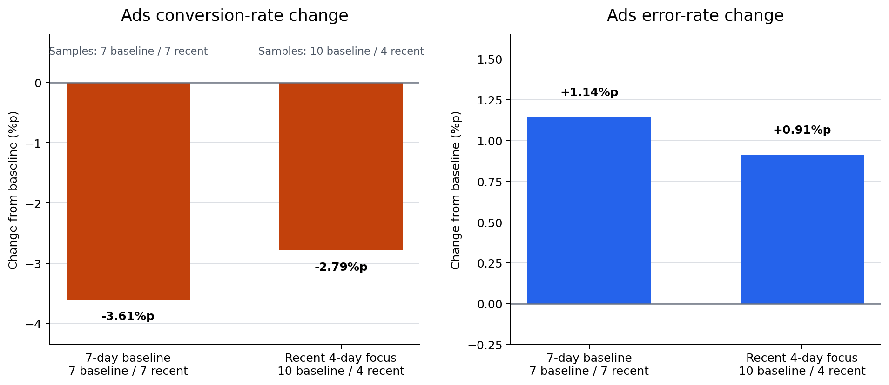

# P7-1.3 Baseline Redesign Practice

> Section ID: `P7-1.3`
> Version: `v2026.08.01`

Record `old_baseline`, `new_baseline`, `boundary_change`, `affected_samples`, `changed_interpretation`, and `follow_up_check` when redesigning a baseline. The separation makes visible where changing a comparison rule changes a conclusion.

The same log can produce a different first sentence in a project record depending on where the baseline period begins and whether the unit is a whole-date total or a channel-day. This practice changes those choices by hand.

## Questions changed by baseline design

- What changes when the baseline period changes?
- Why can date totals and `channel-day` units produce different conclusions?
- How does a baseline design change what becomes an immediate review item?

The point is to reread the same log after changing the baseline period and sample unit, then ask which design makes the next question clearer. A more complex model is not needed to learn that a comparison design changes the opening line of a retrospective.

## Criteria for judgment

- Reread the same log using more than one baseline design.
- Explain why an overall total can show a mild decline while channel-level data show a sharp decline in one channel.
- Choose the baseline that fits the current question before writing the retrospective.

## Why redesign the baseline?

After P7-1.2, it is tempting to think that a retrospective merely needs careful writing. In an actual project, deciding which comparison table comes first is more important than polishing the retrospective sentence.

| Comparison design | What appears first | What is easy to miss |
| --- | --- | --- |
| Date total | Whether the whole service declined | A sharp change in one channel |
| Channel-day | Which channel moved | The size of the overall trend |
| Recent 7 vs previous 7 days | A signal that changed now | The usual level over a longer reference |
| Recent 4 vs previous 10 days | An urgent operational signal | Interpretation can weaken with fewer samples |

If ads appears to decline more under the recent-four-day design, do not conclude that it must always be used because it is more sensitive. State whether the current question is overall health or narrowing cause candidates, and how the smaller sample changes interpretation strength.

```mermaid
--8<-- "assets/part-07/chapter-01/p7-1-3-baseline-case-flow-en.mmd"
```

A baseline is not merely a date split. It is a design for deciding what to inspect first.

## Input and practice flow

- Input file: [`p7-1-traffic-log.csv`](../../../assets/part-07/chapter-01/p7-1-traffic-log.csv){ .csv-preview }
- Meaning of a row: one acquisition channel on one date.
- Values to change: baseline boundaries `2026-06-08` and `2026-06-11`; units `date-total` and `channel-day`.

The input does not grow. The lesson is that changing the comparison design changes the first interpretation even on the same records.

```mermaid
--8<-- "assets/part-07/chapter-01/p7-1-3-baseline-review-flow-en.mmd"
```

The important result is not “more calculations.” It is recording what becomes the front-line problem when the comparison unit changes.

## Execution record

1. Divide the same CSV at two or more baseline boundaries.
2. Compare whole-date totals and channel-day results for the same period.
3. State which design fits the current question as `fact → interpretation → next question`.

## Python: compare baseline designs

- Situation: a conversion decline has been reported, but it is unclear whether it is service-wide or channel-specific.
- Designs: a 7-day baseline at `2026-06-08`, a channel-day version of that design, and a four-day recent focus at `2026-06-11`.
- Expected output: a rate-change summary, first review item, and retrospective note for each design.

Run from the repository root.

```python
import csv
from collections import defaultdict
from datetime import datetime
from pathlib import Path

data_path = Path("docs/assets/part-07/chapter-01/p7-1-traffic-log.csv")
rows = list(csv.DictReader(data_path.open(encoding="utf-8")))
for row in rows:
    row["date"] = datetime.strptime(row["date"], "%Y-%m-%d").date()
    for column in ("visitors", "signups", "errors"):
        row[column] = int(row[column])

def summarize(group_rows):
    visitors = sum(row["visitors"] for row in group_rows)
    signups = sum(row["signups"] for row in group_rows)
    errors = sum(row["errors"] for row in group_rows)
    if visitors == 0:
        raise ValueError("The comparison period has no visitors. Check the baseline boundary.")
    return {"visitors": visitors, "signups": signups, "conversion_rate": round(signups / visitors, 4), "error_rate": round(errors / visitors, 4)}

def aggregate_by_day(group_rows):
    grouped = defaultdict(lambda: {"visitors": 0, "signups": 0, "errors": 0})
    for row in group_rows:
        for column in ("visitors", "signups", "errors"):
            grouped[row["date"]][column] += row[column]
    return [{"date": date, **values} for date, values in sorted(grouped.items())]

experiments = [
    {"name": "date total / 7-day baseline", "cutoff": "2026-06-08", "unit": "date-total"},
    {"name": "channel-day / 7-day baseline", "cutoff": "2026-06-08", "unit": "channel-day"},
    {"name": "channel-day / recent 4-day focus", "cutoff": "2026-06-11", "unit": "channel-day"},
]

results = []
for experiment in experiments:
    cutoff = datetime.strptime(experiment["cutoff"], "%Y-%m-%d").date()
    baseline_rows = [row for row in rows if row["date"] < cutoff]
    recent_rows = [row for row in rows if row["date"] >= cutoff]
    if experiment["unit"] == "date-total":
        baseline, recent = summarize(aggregate_by_day(baseline_rows)), summarize(aggregate_by_day(recent_rows))
        priority = "recheck overall decline"
        detail = {"conversion_delta": round(recent["conversion_rate"] - baseline["conversion_rate"], 4), "error_delta": round(recent["error_rate"] - baseline["error_rate"], 4)}
    else:
        by_channel = defaultdict(lambda: {"baseline": [], "recent": []})
        for row in rows:
            by_channel[row["channel"]]["recent" if row["date"] >= cutoff else "baseline"].append(row)
        deltas = []
        for channel, grouped in by_channel.items():
            baseline, recent = summarize(grouped["baseline"]), summarize(grouped["recent"])
            deltas.append({"channel": channel, "conversion_delta": round(recent["conversion_rate"] - baseline["conversion_rate"], 4), "error_delta": round(recent["error_rate"] - baseline["error_rate"], 4)})
        deltas.sort(key=lambda row: row["conversion_delta"])
        detail, priority = deltas[0], f"review {deltas[0]['channel']} first"
    results.append({"experiment": experiment["name"], "boundary": experiment["cutoff"], "unit": experiment["unit"], "priority": priority, "main_change": detail})

for result in results:
    print(result)
```

The resulting priority is “recheck overall decline” for the date-total design and “review ads first” for both channel-day designs. The date-total conversion change is `-0.0108`; the ads channel-day changes are `-0.0361` for the seven-day design and `-0.0279` for the recent-four-day design.

The execution record also makes the comparison boundary explicit.

```text
{'experiment': 'date total / 7-day baseline',
 'boundary': '2026-06-08',
 'unit': 'date-total',
 'priority': 'recheck overall decline',
 'main_change': {'conversion_delta': -0.0108, 'error_delta': 0.0032}}
{'experiment': 'channel-day / 7-day baseline',
 'boundary': '2026-06-08',
 'unit': 'channel-day',
 'priority': 'review ads first',
 'main_change': {'channel': 'ads', 'conversion_delta': -0.0361, 'error_delta': 0.0114}}
{'experiment': 'channel-day / recent 4-day focus',
 'boundary': '2026-06-11',
 'unit': 'channel-day',
 'priority': 'review ads first',
 'main_change': {'channel': 'ads', 'conversion_delta': -0.0279, 'error_delta': 0.0091}}
```

The first result is useful for asking whether a service-wide signal exists. It cannot say which acquisition path should be opened. The second result narrows that path to ads. The third does not make the ads change larger in this dataset; instead, it shows how a shorter recent interval changes both the rate difference and the number of observations behind it.

Write a retrospective note for each design rather than copying its score alone.

| Design | Fact | Interpretation | Next question |
| --- | --- | --- | --- |
| Date total / 7-day baseline | Overall conversion changes by -0.0108 and error rate by +0.0032. | The overall flow moved weakly, but no channel is isolated. | Which channel moves first after disaggregation? |
| Channel-day / 7-day baseline | Ads has the largest conversion decline, -0.0361. | A channel-level baseline fits a cause-narrowing question better. | Should ads be split by campaign, browser, or release version? |
| Channel-day / recent 4-day focus | Ads remains first, with -0.0279 conversion change. | The latest interval remains relevant but carries fewer observations. | Is the short interval sufficient for an operational decision? |

## How to read the result

| Experiment | What appears first | Appropriate reading |
| --- | --- | --- |
| Date total / 7-day baseline | Overall conversion declines slightly | Useful for rapid service-health reading, weak for cause separation. |
| Channel-day / 7-day baseline | Ads falls sharply | Narrows an operational anomaly sooner. |
| Channel-day / recent 4-day focus | Ads remains first but magnitude differs | Useful for recent signals; use more caution with fewer samples. |

The lesson is not that one design creates more numbers. Choose the design that fits the current question.

## Rate changes and sample counts by design

The chart compares the two channel-day designs. Moving a baseline closer does not always increase the change: ads conversion moves from `-3.61%p` under the seven-day baseline to `-2.79%p` under the recent-four-day focus, and the recent sample count falls from seven to four.



Read the chart in three steps.

1. **Question:** Is the goal to find an immediate recent signal or a more stable comparison?
2. **Evidence:** Are direction and sample counts both recorded?
3. **Judgment:** Do both designs retain ads as a priority without claiming its cause or persistence from a short period alone?

Date-total baselines are a useful entrance for overall flow. Channel-day baselines are more useful for assigning the next review priority. Baseline redesign clarifies what to inspect first; it does not decorate a result.

Do not choose the design with the larger-looking bar automatically. A larger magnitude can come from a shorter or differently composed period. Before adopting a new baseline, state the operational date that motivated it, the baseline and recent sample counts, and the precise question it is intended to answer.

The same record also protects against a reverse mistake: a smaller magnitude under a recent design does not mean that the signal vanished. Both channel-day designs retain ads as the first review item. The magnitude, uncertainty, and follow-up scope are what change.

## Interpreting and recording the design

Ask whether a newer boundary makes a signal larger or smaller; how much a weak total-level signal grows after disaggregation; what further axis is needed inside ads; and whether changing baselines more often may weaken interpretation.

| Record field | What to write |
| --- | --- |
| Comparison design | Baseline period and unit used. |
| Fact | Conversion rate, error rate, and first review item. |
| Interpretation | Why the design fits or does not fit the current question. |
| Next question | Whether another axis should be split or the baseline redesigned again. |

For this log, the date total can look like a service-wide decline, but channel-day grouping makes the ads conversion decline and error-rate rise much stronger. A recent focus is not a rule for magnifying urgent signals: it rereads another period and must be interpreted with its sample count. The current retrospective should therefore begin with “review ads first,” not “the whole service declined.”

## Extending the practice to action-unit sensor summaries

The same redesign can be applied to public-style synthetic sensor data. These are not equipment logs; they are synthetic summaries of an action-unit sensor flow.

- Raw log: [`p7-action-unit-sensor-log.csv`](../../../assets/part-07/chapter-01/p7-action-unit-sensor-log.csv){ .csv-preview }
- Action summary: [`p7-action-unit-summary.csv`](../../../assets/part-07/chapter-01/p7-action-unit-summary.csv){ .csv-preview }

| Comparison design | Question |
| --- | --- |
| Recent 4 vs previous 8 actions | Did mid-flow mean and late decline change together? |
| Recent 3 vs previous 9 actions | Does a shorter recent period make the signal more sensitive? |
| `review_needed=yes` ratio | Does the difference recur enough to alter review priority? |

```python
import csv
from pathlib import Path

summary_path = Path("docs/assets/part-07/chapter-01/p7-action-unit-summary.csv")
rows = list(csv.DictReader(summary_path.open(encoding="utf-8")))
for row in rows:
    row["event_order"] = int(row["event_order"])
    row["mid_flow_mean"] = float(row["mid_flow_mean"])
    row["late_drop_rate"] = float(row["late_drop_rate"])

def summarize(group_rows):
    if not group_rows:
        raise ValueError("The comparison period is empty. Check cutoff_order.")
    count = len(group_rows)
    return {"count": count, "mid_flow_mean": round(sum(row["mid_flow_mean"] for row in group_rows) / count, 3), "late_drop_rate": round(sum(row["late_drop_rate"] for row in group_rows) / count, 3), "review_ratio": round(sum(row["review_needed"] == "yes" for row in group_rows) / count, 3)}

comparison_rows = [row for row in rows if row["period"] in {"baseline", "recent"}]
for cutoff_order in [9, 10]:
    baseline = [row for row in comparison_rows if row["event_order"] < cutoff_order]
    recent = [row for row in comparison_rows if row["event_order"] >= cutoff_order]
    baseline_summary, recent_summary = summarize(baseline), summarize(recent)
    print({"recent_start_order": cutoff_order, "baseline_count": baseline_summary["count"], "recent_count": recent_summary["count"], "mid_flow_gap": round(recent_summary["mid_flow_mean"] - baseline_summary["mid_flow_mean"], 3), "late_drop_gap": round(recent_summary["late_drop_rate"] - baseline_summary["late_drop_rate"], 3), "recent_review_ratio": recent_summary["review_ratio"]})
```

The two results are `-0.219` / `+0.064` with four recent actions and `-0.172` / `+0.051` with three. The safe retrospective is not “the sensor became worse.” It is that reduced mid-flow mean and increased late decline recur in the recent period, while the shorter comparison has only three samples.

The corresponding output is useful to retain in a project note.

```text
{'recent_start_order': 9,
 'baseline_count': 8,
 'recent_count': 4,
 'mid_flow_gap': -0.219,
 'late_drop_gap': 0.063,
 'recent_review_ratio': 0.75}
{'recent_start_order': 10,
 'baseline_count': 9,
 'recent_count': 3,
 'mid_flow_gap': -0.172,
 'late_drop_gap': 0.051,
 'recent_review_ratio': 0.667}
```

The first comparison leaves three of four recent actions marked for review. The second begins later and leaves only three recent actions total. It can be more sensitive to an immediate operational change, but its smaller count makes a broad conclusion less defensible.

| Observation | What it does not prove | Appropriate next check |
| --- | --- | --- |
| Mid-flow mean falls | That a sensor failed | Compare the action context and raw trace. |
| Late-drop rate rises | That the rise will persist | Add more recent actions. |
| Review ratio is high | That every action has the same cause | Inspect individual action records. |

## Rewrite the question using the same raw data

| Problem definition | Input to keep | Expected output |
| --- | --- | --- |
| Action-summary problem | Per-action mid-flow mean, late-decline rate, tracking error | A summary card for each action. |
| Baseline-comparison problem | Baseline and recent summary difference | A signal that changed recently. |
| Review-priority problem | Differences, sample count, `review_needed` | A list of actions to reopen first. |

One raw dataset is not one fixed question. Changing the question changes the columns and output statement that should remain in the project record.

For example, an action-summary question keeps per-action values so a reviewer can compare a single movement. A baseline-comparison question keeps period boundaries and differences. A review-priority question needs those differences plus sample counts and the `review_needed` marker. Treating any one output as the only valid view would remove information needed by the other two questions.

## Try changes directly

1. Change the traffic-log cutoff to `2026-06-10`; check whether ads remains first or the recent period becomes too short.
2. Exclude one of organic, search, or ads; check how sensitive a date total is to channel composition.
3. Write which of `campaign`, `browser`, and `release_version` you would check first if those columns were available.
4. Redefine the synthetic sensor log as an action-summary, baseline-comparison, or review-priority problem.

For each change, retain the old design and the new design instead of overwriting the first output.

| Record field | Example of a useful entry |
| --- | --- |
| Old baseline | `2026-06-08`, date-total, previous seven dates. |
| New baseline | `2026-06-10`, channel-day, shorter recent interval. |
| Boundary change | Two dates moved from recent review into baseline context. |
| Affected samples | State which ads channel-day rows entered or left the recent list. |
| Changed interpretation | The priority may remain ads while the strength of the claim changes. |
| Follow-up check | Compare campaign, browser, or release-version rows before describing a cause. |

Changing the cutoff to `2026-06-10` is not a way to search for a preferred result. It asks whether the same priority remains under a design tied to a specific operational date. If the priority changes, record whether this is because the period definition changed, because a rate changed, or because the input now has too few observations.

Removing one channel is likewise not a valid way to improve the model. It is an explanatory experiment: a date-total result is sensitive to the composition of channels. Record which channel was removed and do not compare that altered total directly with the original total as if they measured the same population.

The final data-request note should be specific. “Inspect ads more” is too broad. A stronger note is: “For recent ads channel-day rows, add campaign identifier, browser family, release version, and tracking-error type; then compare the same baseline boundary by those fields.”

## How to choose a design for the question

| Current question | Preferred first design | Caution |
| --- | --- | --- |
| Is the whole service moving? | Date total with a stable baseline period. | It may hide a channel-specific failure. |
| Which acquisition path needs review? | Channel-day comparison with channel baselines. | It does not prove the cause inside that channel. |
| Did an incident-date signal change recently? | A recent-focus boundary tied to that incident date. | State the smaller sample count explicitly. |
| Which action records should reopen? | Per-action summary with review markers. | Do not infer a hardware cause from the aggregate. |

The same comparison can therefore be useful in more than one project stage. What changes is the claim a learner may make from it. A whole-service question permits a whole-service observation; a channel question permits a channel review priority; neither alone permits a causal diagnosis.

## A short project-record example

> **Comparison design:** Channel-day, seven-day baseline ending before 2026-06-08.
> **Fact:** Ads conversion fell by 3.61 percentage points and error rate rose by 1.14 percentage points relative to its baseline.
> **Interpretation:** The current evidence makes ads the first acquisition path to inspect; it does not establish whether tracking, landing page, or campaign quality caused the change.
> **Next question:** Split the ads rows by campaign, browser, and release version while keeping the comparison boundary visible.

This short record is sufficient to hand the next review to another person. It preserves the chosen comparison, the observed signal, the boundary on interpretation, and the immediate next data request.

Before closing the practice, review the following distinctions.

- A baseline boundary is selected for a question; it is not selected because it makes a chart dramatic.
- A comparison unit specifies what is being compared; it is not merely a display format.
- A date-total result can be a useful opening observation even when it is not sufficient for diagnosis.
- A channel-day result can be a useful priority signal even when it does not identify a cause inside the channel.
- A short recent period can be useful for an incident-focused question even when it should lower confidence in a broad statement.
- A review marker identifies what to inspect; it does not label a record as a confirmed failure cause.

When a conclusion changes after redesign, do not treat the earlier conclusion as necessarily wrong. The two designs may answer different questions. Make the boundary, unit, affected records, and interpretation change visible so a reader can decide which question matters for the next action.

The expected learning outcome is therefore a comparison record that can be rerun and revised. It includes the source file, the chosen boundary, the grouping unit, the observed rate difference, the sample counts, the review priority, and a further question. That record is more useful than a single “best baseline” label because the project can adapt when a new incident date or a new input field becomes available.

Use this final self-review before saving the record.

| Self-review | Yes/no question |
| --- | --- |
| Reproducibility | Can another reader find the same CSV and rerun the boundary? |
| Boundary | Is the operational reason for the date written down? |
| Unit | Is it clear whether the result groups dates or channel-days? |
| Counts | Are baseline and recent sample counts present? |
| Evidence | Are conversion and error changes both displayed where relevant? |
| Interpretation | Does the sentence avoid claiming a cause? |
| Handoff | Does the next question name a concrete field or log to inspect? |

If any answer is no, revise the comparison record before presenting the result as a project conclusion.

This is the point of baseline redesign practice: make a next comparison safer, clearer, and reproducible.

It is not a search for a single permanent baseline.

## Checklist

| Check | Question to answer |
| --- | --- |
| Baseline design | Did you compare the same log under at least two designs? |
| Comparison unit | Did you record that totals and disaggregated units can give different conclusions? |
| Design choice | Did you state which design fits the present question? |
| Next question | Did redesign narrow the next question? |
| Problem definition | Did you check how another question changes the output for the same raw data? |

## Sources and references

- Practice data: [`p7-1-traffic-log.csv`](../../../assets/part-07/chapter-01/p7-1-traffic-log.csv){ .csv-preview }
- Synthetic action-unit raw log: [`p7-action-unit-sensor-log.csv`](../../../assets/part-07/chapter-01/p7-action-unit-sensor-log.csv){ .csv-preview }
- Synthetic action-unit summary: [`p7-action-unit-summary.csv`](../../../assets/part-07/chapter-01/p7-action-unit-summary.csv){ .csv-preview }
- This section uses original practice examples and does not quote external material directly.
