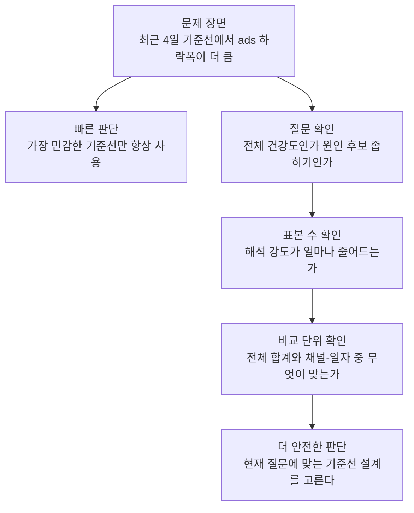
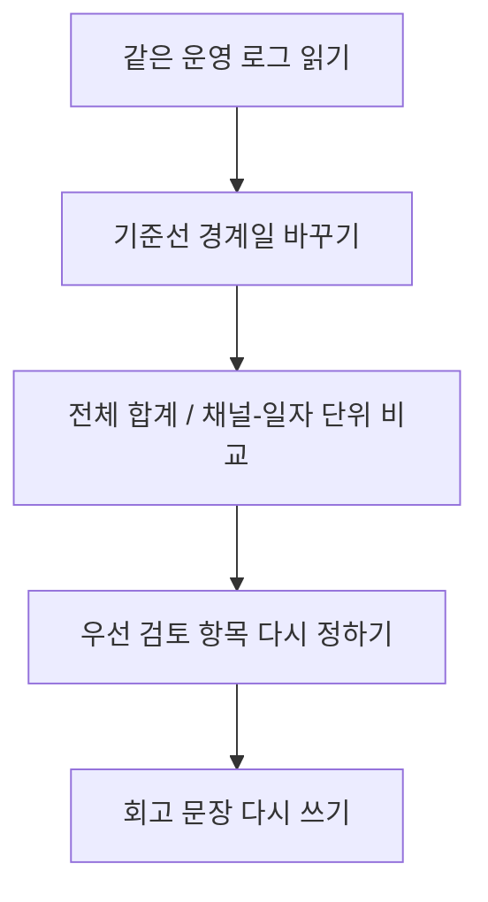

# P7-1.3 기준선 재설계 연습

> Section ID: `P7-1.3`
> Version: `v2026.07.18`

같은 로그라도 `기준선 구간을 어디로 잡는가`, `전체 합계로 볼 것인가 채널-일자 단위로 볼 것인가`에 따라 프로젝트 문서의 첫 줄이 달라집니다. 이번 절은 그 차이를 손으로 바꿔 보며 확인하는 연습입니다.

이번 절은 새 이론을 늘리는 자리가 아니라, 같은 운영 로그를 다른 비교 기준으로 다시 읽는 절입니다. 핵심은 `데이터는 같아도 기준선 설계가 바뀌면 회고 앞줄이 달라진다`는 점을 손으로 확인하는 데 있습니다.

## 이 절의 범위

- 기준선(baseline) 구간을 바꾸면 어떤 차이가 생기는가?
- 전체 일자 합계와 `채널-일자(channel-day)` 단위는 왜 다른 결론을 만들 수 있는가?
- 같은 로그에서 무엇을 즉시 검토 항목으로 올릴지 기준선 설계가 어떻게 바꾸는가?

이 절의 핵심은 `기준선 구간`과 `샘플 단위`를 바꿔 같은 로그를 다시 읽었을 때 어떤 비교 설계가 다음 질문을 더 선명하게 만드는지 확인하는 데 있습니다. 지금 필요한 것은 더 복잡한 모델이 아니라, 같은 데이터에서도 무엇을 비교 기준으로 삼느냐에 따라 회고의 첫 문장이 달라진다는 사실입니다.

## 이 절의 목표

- 같은 로그를 서로 다른 기준선 설계로 다시 읽을 수 있습니다.
- `전체 합계에서는 약한 하락`, `채널 단위에서는 특정 채널 급락`처럼 다른 결론이 왜 생기는지 설명할 수 있습니다.
- 회고 문장을 쓰기 전에 어떤 기준선이 현재 질문에 더 적합한지 고를 수 있습니다.

## 왜 기준선 재설계 연습이 필요한가

P7-1.2까지 읽으면 보통 `회고는 잘 남기면 된다`고 생각하기 쉽습니다. 하지만 실제 프로젝트에서는 회고 문장을 잘 쓰는 것보다 먼저 `무슨 비교표를 회고 앞에 둘 것인가`가 더 중요합니다.

같은 로그라도 기준선 설계에 따라 회고가 어떻게 달라지는지 먼저 표로 고정하면 다음과 같습니다.

| 비교 설계 | 먼저 보이는 것 | 놓치기 쉬운 것 |
| --- | --- | --- |
| 전체 일자 합계 | 서비스 전체가 내려가는지 | 특정 채널 급락 |
| 채널-일자 단위 | 어떤 채널이 흔들리는지 | 전체 흐름의 크기 |
| 최근 7일 vs 이전 7일 | 지금 당장 달라진 신호 | 더 긴 기준선에서의 평소 수준 |
| 더 최근 4일 vs 이전 10일 | 급한 운영 이상 신호 | 표본 수가 작아 해석이 흔들릴 수 있음 |

예를 들어 `최근 4일 집중` 설정에서 `ads` 하락폭이 더 크게 보이면, 빠르게는 `이 기준선이 가장 민감하니 항상 이것만 쓰면 된다`고 적고 싶어질 수 있습니다. 하지만 이 절에서 더 안전한 다음 판단은 하락폭 크기만 보고 기준선을 고정하는 것이 아니라, `지금 질문이 전체 건강도 확인인가`, `원인 후보 좁히기인가`, `표본 수가 줄어 해석 강도가 얼마나 약해지는가`를 함께 적는 것입니다. 그렇게 적어야 `더 크게 보이는 설계`와 `현재 질문에 더 맞는 설계`를 구분할 수 있습니다.



즉, 기준선은 단순한 날짜 나누기가 아니라 `무엇을 먼저 보려는가`를 고정하는 설계입니다.

## 입력 파일

- 파일 경로: [`p7-1-traffic-log.csv`](../../../assets/part-07/chapter-01/p7-1-traffic-log.csv)
- 한 행의 의미: `특정 날짜의 특정 유입 채널`
- 이번 연습에서 바꿔 볼 것:
  - 기준선 경계일 `2026-06-08`, `2026-06-11`
  - 비교 단위 `date-total`, `channel-day`

이번 절은 같은 운영 로그를 두고 `기준선 경계`와 `비교 단위`를 바꿨을 때 무엇이 달라지는지 확인합니다. 핵심은 입력을 새로 늘리는 것이 아니라, 같은 기록 위에서도 비교 설계가 달라지면 해석의 앞줄이 달라진다는 점입니다.

## 연습 흐름



이 흐름에서 중요한 점은 `숫자를 더 많이 계산하는 것`이 아니라, `비교 단위를 바꾸자 무엇이 문제 앞줄로 올라오는가`를 함께 적는 것입니다.

## 이 절에서 직접 할 일

1. 같은 CSV를 두 개 이상의 기준선 경계일로 나눠 봅니다.
2. 같은 기간이라도 `전체 합계`와 `채널-일자` 단위 결과를 나란히 비교합니다.
3. 어떤 설계가 현재 질문에 더 적합한지 `사실 -> 해석 -> 다음 질문`으로 다시 적습니다.

## Python 예제

이번 예제의 목적은 `비교 설계를 바꾸면 회고가 어떻게 바뀌는가`를 바로 확인하는 것입니다.

- 문제 상황: 전환율 하락 제보가 들어왔지만, 전체 문제인지 특정 채널 문제인지 아직 불분명하다.
- 비교 대상:
  - 기준선 경계일 `2026-06-08`, `2026-06-11`
  - 비교 단위 `전체 합계`, `채널-일자`
- 기대 출력:
  - 설계별 전환율 변화 요약
  - 가장 먼저 검토할 항목
  - 설계별 회고 메모
- 확인할 개념:
  - 기준선 설계는 질문에 따라 달라져야 한다
  - 전체 합계만 보면 약하게 보이던 문제가 채널 단위에서는 강하게 드러날 수 있다
  - 더 짧은 최근 구간 비교는 빠른 이상 탐지에 유리하지만 해석은 더 보수적이어야 한다

```python
import csv
from collections import defaultdict
from datetime import datetime
from pathlib import Path

data_path = Path("docs/assets/part-07/chapter-01/p7-1-traffic-log.csv")
rows = list(csv.DictReader(data_path.open(encoding="utf-8")))

for row in rows:
    row["date"] = datetime.strptime(row["date"], "%Y-%m-%d").date()
    row["visitors"] = int(row["visitors"])
    row["signups"] = int(row["signups"])
    row["errors"] = int(row["errors"])

def summarize(group_rows):
    visitors = sum(row["visitors"] for row in group_rows)
    signups = sum(row["signups"] for row in group_rows)
    errors = sum(row["errors"] for row in group_rows)
    return {
        "visitors": visitors,
        "signups": signups,
        "conversion_rate": round(signups / visitors, 4),
        "error_rate": round(errors / visitors, 4),
    }

def aggregate_by_day(group_rows):
    grouped = defaultdict(lambda: {"visitors": 0, "signups": 0, "errors": 0})
    for row in group_rows:
        grouped[row["date"]]["visitors"] += row["visitors"]
        grouped[row["date"]]["signups"] += row["signups"]
        grouped[row["date"]]["errors"] += row["errors"]
    return [
        {"date": date, **values}
        for date, values in sorted(grouped.items())
    ]

experiments = [
    {"name": "전체 합계 / 7일 기준선", "cutoff": "2026-06-08", "unit": "date-total"},
    {"name": "채널-일자 / 7일 기준선", "cutoff": "2026-06-08", "unit": "channel-day"},
    {"name": "채널-일자 / 최근 4일 집중", "cutoff": "2026-06-11", "unit": "channel-day"},
]

results = []
for experiment in experiments:
    cutoff = datetime.strptime(experiment["cutoff"], "%Y-%m-%d").date()
    baseline_rows = [row for row in rows if row["date"] < cutoff]
    recent_rows = [row for row in rows if row["date"] >= cutoff]

    if experiment["unit"] == "date-total":
        baseline = summarize(aggregate_by_day(baseline_rows))
        recent = summarize(aggregate_by_day(recent_rows))
        priority = "전체 하락 여부 재확인"
        detail = {
            "conversion_delta": round(recent["conversion_rate"] - baseline["conversion_rate"], 4),
            "error_delta": round(recent["error_rate"] - baseline["error_rate"], 4),
        }
    else:
        by_channel = defaultdict(lambda: {"baseline": [], "recent": []})
        for row in rows:
            period = "recent" if row["date"] >= cutoff else "baseline"
            by_channel[row["channel"]][period].append(row)

        channel_deltas = []
        for channel, grouped in by_channel.items():
            baseline = summarize(grouped["baseline"])
            recent = summarize(grouped["recent"])
            channel_deltas.append({
                "channel": channel,
                "conversion_delta": round(recent["conversion_rate"] - baseline["conversion_rate"], 4),
                "error_delta": round(recent["error_rate"] - baseline["error_rate"], 4),
            })

        channel_deltas.sort(key=lambda row: row["conversion_delta"])
        detail = channel_deltas[0]
        priority = f"{detail['channel']} 채널 우선 검토"

    results.append({
        "실험": experiment["name"],
        "기준선 경계일": experiment["cutoff"],
        "단위": experiment["unit"],
        "우선 검토 항목": priority,
        "핵심 변화": detail,
    })

retrospective = []
for result in results:
    if result["unit"] == "date-total":
        retrospective.append({
            "실험": result["실험"],
            "사실": f"전체 합계 기준으로 보면 전환율 변화는 {result['핵심 변화']['conversion_delta']}이고 오류율 변화는 {result['핵심 변화']['error_delta']}이다.",
            "해석": "서비스 전체 흐름이 약하게 흔들렸는지는 볼 수 있지만, 어떤 채널이 원인인지는 아직 분해되지 않는다.",
            "다음 질문": "채널-일자 단위로 다시 쪼개면 어느 채널이 먼저 튀는가?",
        })
    else:
        retrospective.append({
            "실험": result["실험"],
            "사실": f"{result['핵심 변화']['channel']} 채널의 전환율 변화가 {result['핵심 변화']['conversion_delta']}로 가장 크게 내려갔다.",
            "해석": "현재 질문이 원인 후보 좁히기라면 채널 단위 기준선이 더 적합하다.",
            "다음 질문": "ads 안에서도 campaign, browser, release_version 같은 더 세분화된 축이 필요한가?",
        })

print("기준선 재설계 결과 =")
for row in results:
    print(row)
print("[회고 메모]")
for row in retrospective:
    print(row)
```

실행 결과 예시는 다음처럼 읽을 수 있습니다.

```text
기준선 재설계 결과 =
{'실험': '전체 합계 / 7일 기준선', '기준선 경계일': '2026-06-08', '단위': 'date-total', '우선 검토 항목': '전체 하락 여부 재확인', '핵심 변화': {'conversion_delta': -0.0108, 'error_delta': 0.0034}}
{'실험': '채널-일자 / 7일 기준선', '기준선 경계일': '2026-06-08', '단위': 'channel-day', '우선 검토 항목': 'ads 채널 우선 검토', '핵심 변화': {'channel': 'ads', 'conversion_delta': -0.0361, 'error_delta': 0.0114}}
{'실험': '채널-일자 / 최근 4일 집중', '기준선 경계일': '2026-06-11', '단위': 'channel-day', '우선 검토 항목': 'ads 채널 우선 검토', '핵심 변화': {'channel': 'ads', 'conversion_delta': -0.0423, 'error_delta': 0.0132}}
[회고 메모]
{'실험': '전체 합계 / 7일 기준선', '사실': '전체 합계 기준으로 보면 전환율 변화는 -0.0108이고 오류율 변화는 0.0034이다.', '해석': '서비스 전체 흐름이 약하게 흔들렸는지는 볼 수 있지만, 어떤 채널이 원인인지는 아직 분해되지 않는다.', '다음 질문': '채널-일자 단위로 다시 쪼개면 어느 채널이 먼저 튀는가?'}
{'실험': '채널-일자 / 7일 기준선', '사실': 'ads 채널의 전환율 변화가 -0.0361로 가장 크게 내려갔다.', '해석': '현재 질문이 원인 후보 좁히기라면 채널 단위 기준선이 더 적합하다.', '다음 질문': 'ads 안에서도 campaign, browser, release_version 같은 더 세분화된 축이 필요한가?'}
```

## 결과를 어떻게 읽는가

이번 연습에서 먼저 읽어야 할 것은 `숫자가 더 많아졌다`가 아니라, `어떤 설계가 지금 질문에 더 맞는가`입니다.

| 실험 | 먼저 보이는 것 | 읽어야 할 점 |
| --- | --- | --- |
| 전체 합계 / 7일 기준선 | 전체 전환율이 약하게 내려감 | 전체 서비스 건강도를 빠르게 보는 데는 좋지만 원인 분해에는 약함 |
| 채널-일자 / 7일 기준선 | `ads` 급락 | 실제 운영 이상을 더 빨리 좁힐 수 있음 |
| 채널-일자 / 최근 4일 집중 | `ads` 급락이 더 강하게 보임 | 최근 이상 감지에는 좋지만 표본이 더 적어 해석은 더 보수적이어야 함 |

이 차이를 통해 독자는 두 가지를 잡아야 합니다.

- `전체 합계 기준선`은 전체 흐름을 보는 입구에 좋습니다.
- `채널-일자 기준선`은 다음 검토 우선순위를 정하는 데 더 좋습니다.

즉, 기준선 재설계는 결과를 꾸미는 일이 아니라 `무엇을 먼저 보려는가`를 분명히 하는 일입니다.

## 관찰 포인트

- 기준선 경계일을 더 최근으로 당기면 어떤 신호가 더 커지고 어떤 신호는 약해지는가?
- 전체 합계에서는 약하게 보이던 문제가 세분화 단위에서는 얼마나 크게 드러나는가?
- `ads` 채널이 우선 검토 항목으로 남는다면, 그다음에는 어떤 축을 더 세분화해야 하는가?
- 기준선을 더 자주 바꾸는 것이 항상 좋은가, 아니면 해석 강도를 약하게 만들 수 있는가?

## 기록 템플릿

실습 뒤에는 다음 형식으로 짧게 기록해 두는 편이 좋습니다.

| 항목 | 적을 내용 |
| --- | --- |
| 비교 설계 | 어떤 기준선 구간과 어떤 단위를 썼는가 |
| 사실 | 전환율, 오류율, 우선 검토 항목 |
| 해석 | 이 설계가 현재 질문에 왜 맞거나 덜 맞는가 |
| 다음 질문 | 더 세분화할 축이 필요한가, 기준선을 다시 잡아야 하는가 |

한 문단으로 쓰면 예를 들어 다음처럼 정리할 수 있습니다.

> 전체 합계 기준선에서는 전환율 하락이 약하게 보여 서비스 전체 문제처럼 읽힐 수 있었지만, 같은 로그를 `채널-일자` 단위로 다시 묶자 `ads` 채널의 전환율 하락과 오류율 상승이 훨씬 강하게 드러났다. 특히 기준선을 더 최근 구간으로 당기면 이 하락폭이 더 커져 긴급 검토 대상으로는 유용하지만, 표본 수가 줄어 해석은 더 보수적으로 해야 한다. 따라서 지금 단계의 회고 앞줄은 `서비스 전체 하락`보다 `ads 채널 우선 검토`가 더 적합하다.

## 직접 바꿔 보며 확인할 것

1. `cutoff`를 `2026-06-10`으로 바꿔 봅니다.
   관찰할 점: `ads` 하락은 여전히 가장 먼저 남는가, 아니면 최근 구간이 너무 짧아 해석이 흔들리는가?

2. `organic`, `search`, `ads` 중 하나를 제외하고 비교를 다시 돌려 봅니다.
   관찰할 점: 전체 합계 흐름이 채널 구성에 얼마나 민감한가?

3. 코드 주석 대신 메모에 `campaign`, `browser`, `release_version` 열이 있다면 무엇을 먼저 확인할지 적어 봅니다.
   관찰할 점: 기준선 재설계가 다음 데이터 요청 항목까지 바꾸는가?

## 체크리스트

- 같은 로그를 두 개 이상의 기준선 설계로 다시 비교했는가?
- 전체 합계와 세분화 단위가 다른 결론을 만들 수 있다는 점을 기록했는가?
- 어떤 설계가 현재 질문에 더 적합한지 한 문장으로 적었는가?
- 기준선 재설계 뒤의 다음 질문이 더 구체적으로 좁혀졌는가?

## 출처와 참고 자료

- 실습 로그 파일: [`p7-1-traffic-log.csv`](../../../assets/part-07/chapter-01/p7-1-traffic-log.csv)
- 이 문서는 자체 실습 예시를 사용했습니다. 외부 자료를 직접 인용하지 않았습니다.
