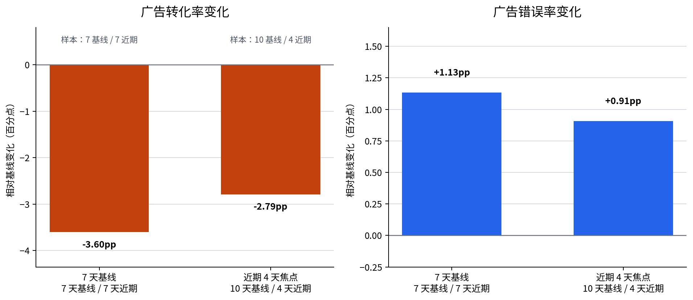

# P7-1.3 重新设计基线的练习

> Section ID: `P7-1.3`
> Version: `v2026.08.01`

重新设计基线时，要分开记录 `old_baseline`、`new_baseline`、`boundary_change`、`affected_samples`、`changed_interpretation` 和 `follow_up_check`。同一份日志在不同窗口与不同比较单位下，项目回顾的第一句话可能不同。

## 基线设计会改变的问题

本节检查三个问题：改变基线边界会发生什么；为何日期总计与渠道-日期会给出不同焦点；何种设计更适合当前的下一问题。

| 比较设计 | 首先看到的信号 | 容易忽略的内容 |
| --- | --- | --- |
| 日期总计 | 整体服务是否变化 | 某一渠道的急剧下降 |
| 渠道-日期 | 哪个渠道在何日变化 | 整体变化的大小 |
| 最近7天与此前7天 | 较稳定的近期比较 | 更急的短期异常 |
| 最近4天与此前10天 | 快速的运营信号 | 更少样本带来的不稳定性 |

较大的下降幅度并不自动意味着该基线最好。先问当前目标是整体健康检查、缩小原因候选，还是快速发现近期异常；再写清样本量和解释限制。

```mermaid
--8<-- "assets/part-07/chapter-01/p7-1-3-baseline-case-flow-zh.mmd"
```

## 输入与比较设计

使用 [`p7-1-traffic-log.csv`](../../../assets/part-07/chapter-01/p7-1-traffic-log.csv){ .csv-preview }。每行是一日、一个流量渠道。练习只改变基线边界与比较单位，不增加新数据。

| 设计 | 边界日 | 单位 | 首要问题 |
| --- | --- | --- | --- |
| 日期总计 / 7天基线 | 2026-06-08 | date-total | 服务整体是否下降？ |
| 渠道-日期 / 7天基线 | 2026-06-08 | channel-day | 哪一渠道日期最需检查？ |
| 渠道-日期 / 最近4天 | 2026-06-11 | channel-day | 最近的异常是否更集中？ |

```mermaid
--8<-- "assets/part-07/chapter-01/p7-1-3-baseline-review-flow-zh.mmd"
```

## 计算三种设计

```python
import csv
from collections import defaultdict
from datetime import datetime
from pathlib import Path

rows = list(csv.DictReader(Path("docs/assets/part-07/chapter-01/p7-1-traffic-log.csv").open(encoding="utf-8")))
for row in rows:
    row["date"] = datetime.strptime(row["date"], "%Y-%m-%d").date()
    for field in ("visitors", "signups", "errors"):
        row[field] = int(row[field])

def summarize(items):
    visitors = sum(item["visitors"] for item in items)
    signups = sum(item["signups"] for item in items)
    errors = sum(item["errors"] for item in items)
    return {"visitors": visitors, "signups": signups, "errors": errors,
            "conversion_rate": round(signups / visitors, 4),
            "error_rate": round(errors / visitors, 4)}

experiments = [
    ("日期总计 / 7天基线", "2026-06-08", "date-total"),
    ("渠道-日期 / 7天基线", "2026-06-08", "channel-day"),
    ("渠道-日期 / 最近4天", "2026-06-11", "channel-day"),
]
for name, cutoff_text, unit in experiments:
    cutoff = datetime.strptime(cutoff_text, "%Y-%m-%d").date()
    baseline = [row for row in rows if row["date"] < cutoff]
    recent = [row for row in rows if row["date"] >= cutoff]
    if unit == "date-total":
        before, after = summarize(baseline), summarize(recent)
        detail = {"conversion_delta": round(after["conversion_rate"] - before["conversion_rate"], 4),
                  "error_delta": round(after["error_rate"] - before["error_rate"], 4)}
    else:
        detail = {}
        for channel in sorted({row["channel"] for row in rows}):
            before = summarize([row for row in baseline if row["channel"] == channel])
            after = summarize([row for row in recent if row["channel"] == channel])
            detail[channel] = round(after["conversion_rate"] - before["conversion_rate"], 4)
    print({"design": name, "cutoff": cutoff_text, "detail": detail})
```

代码先保持原始日志不变，再为每个设计建立自己的基线和最近区间。日期总计使用所有渠道的总分子和总分母；渠道-日期设计则保留每个渠道与自身基线的差异。

## 如何读取不同的答案

| 输出形态 | 安全的解释 | 下一问题 |
| --- | --- | --- |
| 日期总计轻微下降 | 整体指标有下降信号，但来源仍不清楚。 | 哪个渠道贡献了变化？ |
| 广告渠道急降 | 广告渠道是更明确的检查候选。 | 流量、错误、活动或页面何者不同？ |
| 最近4天差异更大 | 短窗口更敏感于近期变化。 | 样本量是否足以支持强解释？ |
| 两种设计都显示同一渠道 | 该渠道在多种比较下值得优先审查。 | 是否有相同日期的反例？ |

基线设计不是寻找唯一正确答案。它明确了哪一个问题被放在回顾的前面。



## 记录设计变化

```text
旧基线：日期总计，边界 2026-06-08。
新基线：渠道-日期，边界 2026-06-08。
变化：比较单位从整体日期改为渠道-日期。
受影响样本：广告渠道的最近日期行进入优先检查。
改变的解释：整体轻微下降变成渠道特有下降的候选。
后续检查：检查广告渠道的活动、错误和流量构成。
```

记录“改变了什么”与记录“得到了什么”同样重要。否则后续读者无法知道是数据、窗口还是单位造成了新结论。

## 传感器行动单元的扩展

同一原则也适用于传感器日志。若一行代表一个动作单元，应选择与行动节奏相符的基线，而不是把所有时间点混成单个总体平均。

| 单位 | 可以发现 | 需要谨慎的地方 |
| --- | --- | --- |
| 全部传感器时间点 | 整体漂移 | 具体动作被稀释 |
| 行动单元 | 某步骤的异常 | 每个单元的样本量 |
| 早段与晚段 | 暖机或疲劳差异 | 边界选择和外部条件 |

更换项目领域不改变方法：保留原始单位、明确定义基线、记录变化的解释和下一检查。

## 学习检查

1. 为什么“最近4天差异更大”不能单独决定使用最近4天基线？
2. 日期总计和渠道-日期各回答什么问题？
3. 重新设计时，哪些字段必须写入项目记录？
4. 如何区分受影响样本与根因？
5. 如何把同一方法应用到行动单元传感器记录？

## 读取三种设计的实际差异

默认运行给出一个重要对照。日期总计的转化率差异是 `-0.0108`，看起来像温和的整体下降；相同的 7 天边界改成渠道-日期后，广告渠道差异是 `-0.0361`，而自然与搜索渠道接近零。这并不表示两个计算中只有一个正确，而是它们聚焦的单位不同。

| 设计 | 观测到的差异 | 第一条安全结论 |
| --- | ---: | --- |
| 日期总计 / 7天 | 转化率 `-0.0108`，错误率 `0.0032` | 整体近期记录与基线不同。 |
| 渠道-日期 / 7天 | ads `-0.0361` | 广告渠道是更具体的优先审查对象。 |
| 渠道-日期 / 最近4天 | ads `-0.0279` | 最近窗口仍显示广告下降，但样本更少。 |

日期总计适合先问“服务是否有整体信号”；渠道-日期适合问“从哪个渠道和哪一天开始检查”。若把渠道差异隐去，整体结果会使广告问题显得较弱；若只看广告，也可能忽略整体是否同时变化。

### 不同设计的事实、解释和下一问题

| 设计 | 事实 | 有限解释 | 下一问题 |
| --- | --- | --- | --- |
| 日期总计 / 7天 | 总体转化率低于早期7天。 | 存在整体下降信号，来源未定。 | 所有渠道是否贡献相同？ |
| 渠道-日期 / 7天 | ads 的下降远大于其他渠道。 | 变化可能集中于广告渠道。 | 查看广告流量、页面、错误和活动。 |
| 渠道-日期 / 最近4天 | ads 在短窗口中仍然下降。 | 近期信号值得快速审查，但估计更不稳定。 | 增加相邻日期和样本量检查。 |

解释不应写成“短窗口证明广告问题更严重”。短窗口会改变基线样本和最近样本数，因此可见差异的大小与不确定性会一起改变。

## 把样本数写进基线设计

较短窗口的优点是更敏感，代价是样本少。项目记录必须把样本数与比例差异放在一起；否则读者只能看到更大的差而看不到更弱的证据基础。

| 设计 | 基线日期数 | 最近日期数 | 解释时的提醒 |
| --- | ---: | ---: | --- |
| 7天边界 | 7 | 7 | 两侧窗口相对平衡，适合近期总体对照。 |
| 最近4天边界 | 10 | 4 | 最近窗口更短，快速但更易受单日波动影响。 |
| 单个渠道-日期 | 多个基线行 | 一个或少数最近行 | 必须回看每行访问量和原始计数。 |

样本数不是一个可选的脚注。它决定一条回顾应使用“观察到的信号”还是“稳定的趋势”这样的语言强度。

### 当更敏感的设计更合适时

最近4天设计适用于明确的近期运营问题，例如刚刚发布页面或修改追踪后要快速检查。但应同时保留更长窗口：它能显示短期变化是否只是更长历史中的常见波动。

```text
当前问题：是否存在刚发生的运营异常？
可用设计：最近4天与此前10天。
保留限制：最近4天样本较少，不能单独证明长期趋势。
对照设计：7天与此前7天。
下一检查：查看短窗口内的错误类别、部署和活动时间线。
```

更敏感并不等于更真实；它只更快地放大近期变化。基线选择应由问题决定，而不是由哪一个图表看起来最明显决定。

## 用受影响样本防止笼统结论

每次重新设计都应列出受影响的样本或行。受影响样本不是原因，它们是下一次检查必须能重新找到的证据。

| 设计变化 | 受影响的样本 | 该记录的作用 |
| --- | --- | --- |
| 日期总计改为渠道-日期 | 最近广告渠道-日期行 | 让调查从总体比例转向具体渠道。 |
| 7天改为最近4天 | 06-11 至 06-14 的广告行 | 检查近期集中模式。 |
| 传感器全体改为行动单元 | 特定动作阶段的读数 | 检查异常是否只在特定操作出现。 |
| 阈值或过滤改变 | 进入或离开候选的行 | 区分规则效果和数据效果。 |

若没有受影响样本列表，“新基线更好”无法被检验。审查者需要知道哪些原始行被新的比较设计提升到回顾前列。

## 行动单元传感器的基线练习

传感器数据常被误读为连续曲线上的一个总体平均。若记录与重复操作相关，行动单元可以是更合适的样本单位。例如把一次取件、移动、放置或一次固定时长的操作作为一组，再比较早期与晚期单元。

| 问题 | 全部时间点基线 | 行动单元基线 |
| --- | --- | --- |
| 整体信号是否漂移 | 容易查看 | 可以查看，但不突出步骤。 |
| 哪个操作阶段异常 | 容易被平均稀释 | 更容易定位到动作。 |
| 样本量如何解释 | 时间点多但可能相关 | 单元较少但与任务更接近。 |
| 下一步检查 | 传感器或环境整体变化 | 特定动作、姿态或设备条件。 |

行动单元不自动优于时间点。若任务本身关心连续时间趋势，时间点仍是必要单位。关键是让单位与项目问题一致。

### 早段与晚段的比较记录

```text
原始数据：行动单元传感器日志。
旧基线：所有动作的总体平均。
新基线：早段动作与晚段动作的分别汇总。
受影响样本：晚段单位的读数。
事实：晚段相对早段的某指标变化。
解释限制：可能是暖机、疲劳、负载或环境变化；尚未确认。
后续检查：固定设备条件后重复同一动作并比较。
```

这与渠道案例结构相同：先说明单位与边界，再说明变化，最后提出可验证的检查。

## 设计选择的决策表

| 当前问题 | 优先设计 | 仍需保留的对照 |
| --- | --- | --- |
| 服务整体是否有变化 | 日期总计与较长基线 | 渠道拆分以定位贡献。 |
| 哪个渠道近期异常 | 渠道-日期与同渠道基线 | 日期总计以检查是否全站变化。 |
| 刚发布后是否出现问题 | 短最近窗口 | 更长窗口和原始样本量。 |
| 某操作阶段是否异常 | 行动单元基线 | 连续时间点和外部条件记录。 |
| 一个候选是否稳定 | 多个边界与相邻日期 | 固定的数据版本和定义。 |

决策表不是自动选择器。它使选择理由公开，让项目成员可以根据风险、样本量和业务问题提出不同的设计。

## 控制实验：一次只改变一个设计元素

1. 保持渠道-日期单位，只有切分日期从 06-08 改为 06-11。
2. 保持 06-08 边界，只有单位从日期总计改为渠道-日期。
3. 保持边界和单位，改变一个候选阈值并记录进入/离开的行。
4. 保持原始日志，增加一个明确的情景调整而不写回 CSV。
5. 为每次运行保存基线行数、最近行数和优先候选。

不要同时更改边界、单位和数据。那样即使回顾第一句改变，也无法知道是哪一个设计决定造成的。

### 运行之间的比较格式

| 字段 | 运行 A | 运行 B |
| --- | --- | --- |
| 数据版本 | 相同 CSV | 相同 CSV |
| 基线边界 | 2026-06-08 | 2026-06-11 |
| 比较单位 | channel-day | channel-day |
| 基线样本数 | 7 天 | 10 天 |
| 最近样本数 | 7 天 | 4 天 |
| 优先候选 | 记录渠道与日期 | 记录渠道与日期 |
| 解释限制 | 较长近期窗口 | 更短、较敏感窗口 |

把这些字段排在一起可以显示设计变化，而不是把两个图的差异留给读者猜测。

## 项目回顾示例

> 使用日期总计与7天基线时，整体转化率下降 1.08 个百分点。改为渠道-日期后，广告渠道相对同渠道基线下降 3.61 个百分点，而自然和搜索变化很小。这个对照把广告渠道列为优先检查对象，但不证明广告活动或页面是原因。最近4天设计仍显示广告下降，不过最近样本更少；下一步将保留两种窗口，检查广告日期行的访问量、错误类别、活动和部署记录。

这段回顾说明了数据相同、设计不同以及解释为何改变。它没有把更大的数字当作最终事实。

## 直接检查的问题

| 检查 | 要回答的问题 |
| --- | --- |
| 边界 | 选择这个日期边界是为了回答什么？ |
| 单位 | 一行代表日期、渠道-日期还是行动单元？ |
| 样本量 | 两侧各有多少可比较行？ |
| 变化量 | 比例差异是百分点还是别的定义？ |
| 受影响样本 | 哪些行因重新设计进入回顾前列？ |
| 限制 | 哪些解释仍需额外证据？ |
| 下一步 | 能否写出一个最小、可验证的检查？ |

## 最终检查表

- 是否保存了旧基线和新基线，而非只保存新结果？
- 是否写明边界、比较单位和样本数？
- 是否让日期总计与渠道-日期回答不同的问题？
- 是否将短窗口的敏感性与不稳定性一起记录？
- 是否为每个优先候选保留原始行？
- 是否把传感器行动单位与项目问题对应起来？
- 是否将事实、解释和后续检查分开？
- 是否避免从一个设计直接宣称根因？

完成这些检查后，重新设计基线就成为一种可复查的项目方法，而不是为了让某个变化看起来更大。

## 结果表应同时显示幅度和样本

只显示转化率差异会让短窗口看起来总是更有说服力。更完整的结果表把窗口、单位、样本数和变化量并列。

| 设计名称 | 基线样本 | 最近样本 | 转化率差异 | 错误率差异 | 优先读取 |
| --- | ---: | ---: | ---: | ---: | --- |
| 日期总计 / 7天 | 7 个日期 | 7 个日期 | `-0.0108` | `0.0032` | 总体健康信号。 |
| 渠道-日期 / 7天 | 每渠道 7 日 | 每渠道 7 日 | ads `-0.0361` | 同时记录 | 渠道特有候选。 |
| 渠道-日期 / 最近4天 | 每渠道 10 日 | 每渠道 4 日 | ads `-0.0279` | 同时记录 | 近期运营检查。 |

表中的样本数不用于宣称统计显著性。它提醒读者比较设计的证据量不同，从而调整解释的强度。

### 不同设计如何改变回顾的第一句话

| 设计 | 可能的回顾第一句 | 不应替代的后续内容 |
| --- | --- | --- |
| 日期总计 | 最近区间的总体转化率低于此前区间。 | 哪个渠道、哪一天、哪种错误相关。 |
| 渠道-日期 | 广告渠道相对自身基线下降更明显。 | 活动或页面已被证明为原因。 |
| 最近4天 | 最近广告记录仍显示下降，需快速检查。 | 短窗口代表长期趋势。 |
| 行动单元 | 特定动作阶段与早段基线不同。 | 设备或人员已被证明造成变化。 |

第一句话的作用是决定读者先看什么，不是替代完整的调查。每一种设计都应在第二句或表格中写出限制与下一问题。

## 何时回到旧基线

新的基线设计有时会让候选更清晰，有时会让结论更不稳定。遇到下列情形时，应把旧设计保留在报告中而不是删除。

| 情形 | 为什么回到旧基线 |
| --- | --- |
| 最近窗口只有少数行 | 检查大差异是否由单日波动主导。 |
| 新单位突出一个渠道 | 检查整体是否同时变化。 |
| 候选在边界附近进出 | 检查阈值和切分日期敏感性。 |
| 数据采集规则改变 | 比较是否仍然针对相同的输入定义。 |
| 传感器动作定义改变 | 检查新单元是否与旧单元可比。 |

保留旧基线不是拒绝新问题，而是让设计选择本身接受审查。

## 把基线变化交接给下一位读者

```text
数据：固定的流量或传感器日志版本。
旧设计：边界、单位、样本数和主要差异。
新设计：边界、单位、样本数和主要差异。
共同证据：两种设计都突出的行或模式。
差异证据：只在某一设计中突出的行或模式。
限制：短窗口、分母、缺失上下文或单位定义。
下一检查：一个可以执行的日志、活动或传感器查询。
```

交接记录应使另一位读者无需重建整段思考过程，就能理解为什么问题从“整体是否下降”转向“广告渠道的哪一天需要检查”。

### 练习：写两个不同但都正确的回顾

用相同的 CSV 写两段回顾：第一段使用日期总计，第二段使用渠道-日期。两段都应包括一个事实、一个限制和一个下一问题。然后比较它们：哪一段更适合整体健康检查，哪一段更适合定位候选？

这项练习的答案不是选择其中一段为真、另一段为假。它要求说明比较设计如何改变问题的粒度。

## 最后的学习产物

完成本节后，应保留以下材料：

- 至少两种基线设计及其明确边界。
- 每种设计的单位、样本数、转化率和错误率差异。
- 被设计变化影响的渠道-日期或行动单元。
- 一段说明解释为何改变但仍未证明根因的回顾。
- 一个针对优先候选的最小后续检查。
- 一个稳定或未被选中的反例，用于防止过度解释。

这些材料把“重新计算一个平均值”变成“重新设计一个可以被验证的问题”。

### 发布前的设计核对

1. 新旧基线是否都写明了日期边界？
2. 比较单位是否与中心问题一致？
3. 两侧的样本数是否在结果表中可见？
4. 原始日志是否保持未修改？
5. 是否保留了日期总计与渠道拆分的对照？
6. 受影响样本是否可以回到原始记录？
7. 短窗口的解释是否比长窗口更谨慎？
8. 传感器行动单位是否有明确的操作定义？
9. 回顾是否把事实与解释分开？
10. 后续检查是否能产生新证据？
11. 是否保留了一个未被选中的比较行？
12. 是否避免把基线选择写成根因证明？
13. 是否让下一节可以复用这份比较记录？
14. 是否能向另一位读者解释设计为何改变？

### 设计改变后的保存项

保存旧设计与新设计的完整配置。
保存两个设计各自的样本数和候选行。
保存不受设计改变影响的稳定对照。
保存仅在一个设计中出现的行。
保存每个结论使用的比较单位。
保存短窗口带来的不确定性说明。
保存行动单元的定义及其边界。
保存下一次检查所需的日志或传感器字段。

## 来源与参考

本节的数据和示例为本书创建的练习材料。
