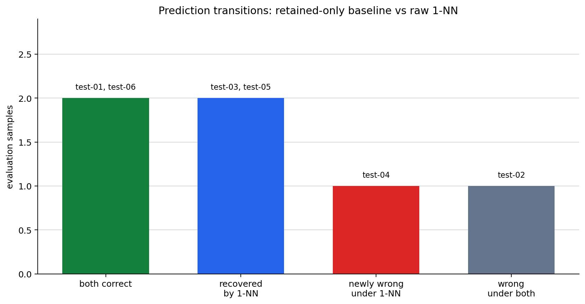

# P7-2.1 Reading Comparison Tables and Error Cases

> Section ID: `P7-2.1`
> Version: `v2026.08.01`

Read `baseline_result`, `candidate_result`, `metric_delta`, `error_sample_id`, `error_pattern`, and `review_note` together. The error cases left behind, rather than one score, start the next iteration.

This section attaches a prediction model to a project and reads it through a comparison table and individual failures. The project begins with problem definition, a data split, a baseline, and comparable outputs—not with the model name.

## A comparable prediction record

- How should a prediction project start?
- Why keep training and test data separate?
- Why is accuracy unsafe without a baseline?
- How can a NumPy-only classification practice follow an operational workflow?

Use the sequence `problem → data split → baseline → model → comparison`. The initial artifact is a project record that makes a baseline and candidate model comparable.

## Criteria for reading scores and errors

- Explain the project using the five-step sequence above.
- Record baseline and model performance together.
- Read predictions and failure rows in an operational example rather than relying only on aggregate accuracy.

## Project question and example data

The practice question is: “Can we predict churn risk for subscription customers?” It uses differently scaled features: unresolved inquiries in 30 days, days since last login, and recent usage minutes. The label is retained (`0`) or churn risk (`1`).

| Question | Short answer |
| --- | --- |
| What is decided first? | Input features, label, and split. |
| Why begin with a baseline? | To make the model score interpretable. |
| What is the minimum artifact? | Baseline prediction, model prediction, and a test comparison. |

```mermaid
--8<-- "assets/part-07/chapter-02/p7-2-1-project-compare-flow-en.mmd"
```

The flow preserves the project order: define the customer-risk question, split records, make a baseline prediction, run a model, compare outcomes, and inspect error cases.

The second flow starts from the fixed split and makes the score transition visible. It records recovered cases, new errors, and errors that remain under both methods.

```mermaid
--8<-- "assets/part-07/chapter-02/p7-2-1-baseline-review-flow-en.mmd"
```

The practice CSV is [`p7-2-churn-dataset.csv`](../../../assets/part-07/chapter-02/p7-2-churn-dataset.csv){ .csv-preview }. A row represents one subscription customer record. Keep the specified train/test split fixed when comparing this baseline and candidate.

## A baseline and a 1-nearest-neighbor candidate

The baseline predicts every test customer as retained. The candidate is raw 1-nearest-neighbor (1-NN): it assigns a test row the label of its nearest training row using the three feature values without preprocessing.

```python
import csv
from math import sqrt
from pathlib import Path

data_path = Path("docs/assets/part-07/chapter-02/p7-2-churn-dataset.csv")
rows = list(csv.DictReader(data_path.open(encoding="utf-8")))
for row in rows:
    for column in ("unresolved_tickets", "days_since_login", "usage_minutes_30d", "label"):
        row[column] = int(row[column])

train_rows = [row for row in rows if row["split"] == "train"]
test_rows = [row for row in rows if row["split"] == "test"]
features = ["unresolved_tickets", "days_since_login", "usage_minutes_30d"]
if not train_rows or not test_rows:
    raise ValueError("Both train and test rows are required.")

def predict_1nn(test_row):
    def squared_distance(train_row):
        return sum((test_row[name] - train_row[name]) ** 2 for name in features)
    return min(train_rows, key=squared_distance)["label"]

baseline_predictions = [0 for row in test_rows]
raw_predictions = [predict_1nn(row) for row in test_rows]

def accuracy(predictions):
    return sum(prediction == row["label"] for prediction, row in zip(predictions, test_rows)) / len(test_rows)

print("baseline accuracy =", round(accuracy(baseline_predictions), 3))
print("raw 1-NN accuracy =", round(accuracy(raw_predictions), 3))
for row, baseline, raw in zip(test_rows, baseline_predictions, raw_predictions):
    print({"sample_id": row["sample_id"], "actual": row["label"], "baseline": baseline, "raw_1nn": raw})
```

The baseline accuracy is `0.500` and raw 1-NN accuracy is `0.667` on the same test rows. That is a fact about this synthetic practice split, not evidence that 1-NN will perform similarly on an operational population.

## Read prediction cases beside the score

| Test sample | Actual | Baseline | Raw 1-NN | What to read |
| --- | ---: | ---: | ---: | --- |
| test-02 | 1 | 0 | 0 | A churn-risk row is missed because it is close to a high-usage retained row. |
| test-03 | 1 | 0 | 1 | Raw 1-NN captures one risk row that the baseline misses. |
| test-04 | 0 | 0 | 1 | It is drawn toward a churn-risk row with similar usage time. |
| test-05 | 1 | 0 | 1 | Inquiry count and days since login help identify risk. |

The candidate is better than the baseline here, but usage minutes have a much larger scale than the other features and can dominate raw distance. The next question is not “is the model good?” but “which feature scale and error pattern should be checked first?”

## Input rows and feature scale

Each row contains three deliberately different numeric scales: unresolved-ticket counts, days since login, and thirty-day usage minutes. A raw distance treats a one-minute difference as the same arithmetic unit as a one-ticket difference. Since usage is in the thousands, it can dominate nearest-neighbor choice even when the smaller features are important.

| Feature | Typical range in this practice file | Raw-distance concern |
| --- | ---: | --- |
| Unresolved tickets | 1–8 | A small but potentially meaningful count. |
| Days since login | 3–28 | A medium-scale recency signal. |
| Usage minutes | 2,200–4,200 | Can dominate the unscaled distance. |

This is a representation hypothesis, not a causal explanation of customer behavior. The next comparison tests a scale change while holding the model rule and evaluation rows fixed.

## Comparison table and review note

| Model | Description | Test accuracy | Review note |
| --- | --- | ---: | --- |
| Baseline | Predict every customer as retained | 0.500 | Misses every churn-risk test row. |
| Raw 1-NN | Use raw distance across three features | 0.667 | Improves some risk detection but still has scale-related errors. |

Separate three statements in the record.

1. **Fact:** Raw 1-NN scores higher than the retained-only baseline on this fixed test set.
2. **Interpretation:** Large usage-minute values may dominate the distance calculation.
3. **Next question:** Does scaling features change the missed and newly wrong samples?

Do not turn an accuracy difference into a causal claim about customers. It is evidence for the next preprocessing comparison.

## What the 0.167 difference contains

Accuracy rises by only `0.167`, from `0.500` to `0.667`. That net difference comes from three distinct sample transitions, not from one uniform improvement.

| Outcome transition | Samples | Effect on the score | What to inspect next |
| --- | --- | --- | --- |
| Recovered by 1-NN | test-03, test-05 | Two churn-risk rows missed by the baseline become correct. | Which training row becomes nearest? |
| Newly wrong under 1-NN | test-04 | One retained row correct under baseline becomes wrong. | Why is a churn-risk row nearest? |
| Wrong under both | test-02 | A remaining churn-risk error remains. | Is scale or boundary data insufficient? |

The two recoveries and one new error explain why the score improves by one net case. A sentence such as “1-NN is better” is therefore accurate only when it is paired with the new error and the still-missed error.

The chart makes the transition count visible. A bar counts fixed evaluation rows, and its label identifies the rows; the categories are not claims that every operational error has equal cost.



| Comparison item | Retained-only baseline | Raw 1-NN | Review meaning |
| --- | --- | --- | --- |
| What it uses | One majority label | Raw distance across three features | The candidate uses information but may be dominated by scale. |
| Accuracy | 0.500 | 0.667 | Better on this split, still unstable. |
| Representative failure | It misses most churn-risk rows | test-02 and test-04 select unsuitable neighbors | Recheck feature scale and distance. |

The evaluation set has only six rows. It may contain an unusually easy or difficult split, and another customer segment may not give the same result. The project record must therefore retain both performance and limits.

## Read each transition before changing the classifier

| Transition | What is known | Limited interpretation | Next check |
| --- | --- | --- | --- |
| test-03 and test-05 recover | Raw 1-NN uses features ignored by the baseline | Some risk patterns are represented by training rows | Inspect and retain the recovered IDs. |
| test-04 becomes newly wrong | A retained row is drawn to a risk neighbor | Raw feature magnitude may alter geometry | Re-run with a documented scale change. |
| test-02 remains wrong | Both methods miss a risk row | Scale or boundary examples may be insufficient | Test scaling separately from new training data. |

## Run independent follow-up experiments

Do not change feature scale and training composition in the same run; they answer different questions.

1. Divide `usage_minutes_30d` by `60` while holding rows and the 1-NN rule fixed.
   - In the current practice data, test-02 changes its nearest row from train-02 to train-08 and test-04 changes from train-11 to train-04.
   - Both become correct; raw 1-NN reaches `1.000` on this six-row test set.
   - Record scale as influential, not universally sufficient.

2. Restore raw scales. Add the **training** row `train,학습-13,6,21,4000,1`.
   - The retained baseline remains the majority prediction.
   - Test-02 gains a close churn-risk row, raw 1-NN reaches `0.833`, and test-04 remains wrong.
   - Record this as a data-coverage experiment, not preprocessing.

If the row is added as a test record, the evaluation population changes. Do not compare that score as a fixed-test experiment.

## Project record and limits

```text
prediction question: churn-risk classification for subscription customers
features: unresolved tickets, days since login, 30-day usage minutes
fixed split: the CSV split column
baseline: retained-only; accuracy 0.500
candidate: raw 1-NN; accuracy 0.667
recovered cases: test-03, test-05
new error: test-04
remaining error: test-02
next question: does a documented feature scale change alter nearest neighbors?
```

The six-row evaluation set is too small to estimate field performance. It can support a transparent first comparison if the sample IDs, feature construction, split, and baseline remain with the score.

## Final learning check

- Did baseline and candidate use exactly the same test rows?
- Can you name the recovered cases, the new error, and the remaining error?
- Did you distinguish a scale hypothesis from a boundary-data hypothesis?
- Does the next experiment modify only one of those hypotheses?
- Does the record avoid turning this synthetic score difference into a claim about all customers?

## What a baseline protects against

The retained-only baseline is intentionally weak. Its role is not to compete with the candidate on every modeling idea. It protects the project from treating any positive-looking candidate score as evidence of useful prediction.

| Without a baseline | With a stated baseline |
| --- | --- |
| “Raw 1-NN accuracy is 0.667.” | “Raw 1-NN improves from 0.500 to 0.667 on the fixed six-row test set.” |
| It is unclear whether the model uses useful information. | The gain and its per-row transitions can be inspected. |
| New errors can be hidden by an aggregate. | test-04 remains visible as a baseline regression. |

This baseline also makes an honest limit easier to write. A candidate that wins on a small split can still be unsuitable if the new error is costly or if the evidence does not cover relevant customer groups.

## Inspect nearest neighbors, not only labels

For 1-NN, a prediction is an inherited training label. The review record should therefore retain the nearest training sample ID for each test row. That ID links the classification outcome to the feature values that produced it.

| Evaluation row | Raw result to inspect | Reason |
| --- | --- | --- |
| test-02 | Its retained nearest neighbor | A churn-risk row remains missed. |
| test-04 | Its churn-risk nearest neighbor | A retained row becomes a new error. |
| test-03 and test-05 | Their churn-risk neighbors | They explain the candidate’s two recoveries. |

The nearest-neighbor explanation remains limited. It tells which stored row dominated the current distance; it does not prove that the same relationship governs a customer population.

## Reproducible run checklist

Before comparing another candidate, preserve these fields:

```text
CSV version and row identifiers:
feature names and units:
feature scaling rule:
train/test split:
baseline prediction rule:
candidate rule and tie behavior:
test accuracy for both methods:
per-row prediction transition and nearest training ID:
remaining error and next single change:
```

If a later run has a different result, this list identifies whether the difference came from the data, representation, split, baseline, or candidate rule. It is more useful than an accuracy table without provenance.

### A small review exercise

Write a three-sentence retrospective for this exact run.

1. State the fixed baseline and candidate result.
2. Name two recovered rows, one new error, and one remaining error.
3. State one scale or data-boundary question without claiming that it is already the cause.

Then repeat the exercise after one independent change. If the retrospective cannot explain both the improvement and any regression, the comparison has not yet produced a safe next action.

### Evidence boundary for this section

This section demonstrates a project-start method, not a production churn model. Its evidence is limited by the synthetic rows, the fixed split, the simple retained-only baseline, and the raw Euclidean-distance rule.

The following claims are supported:

- the candidate outperforms this baseline on the displayed six test rows;
- the gain contains two recoveries and one new error;
- raw feature scale is a justified next hypothesis to test.

The following claims are not supported:

- raw 1-NN will outperform every baseline or classifier in deployment;
- usage minutes cause churn risk or cause each nearest-neighbor error;
- the added training row is a general solution rather than one boundary-data test.

Stating both lists keeps the project record useful for the next iteration without overstating what this first comparison can prove.

### Closing check

Keep the baseline result beside every candidate result.
Keep the train/test boundary fixed before changing feature scale.
Keep recovered, new-error, and remaining-error IDs separate.
Keep the nearest training ID with each 1-NN prediction.
Keep a single next hypothesis for the following run.
Keep claims no broader than this documented comparison.

## Keep the execution record, not just a score

An operational comparison record has two linked outputs.

| Record type | Why keep it now? | Where it is reused |
| --- | --- | --- |
| Run summary | Keep baseline and candidate results in one place. | A later rerun and improvement decision. |
| Per-sample rows | Keep the actual cases behind the difference. | Error clusters, retrospective notes, and reevaluation candidates. |

The record should include the question, feature set, label, train/test split, baseline result, candidate result, recovered cases, new errors, and next change to test. This is enough for another reviewer to reproduce the comparison without inferring the intended baseline from the score alone.

```text
Prediction question: Can we predict churn risk for subscription customers?
Input features: unresolved tickets, days since login, usage minutes in 30 days
Label: retained (0) / churn risk (1)
Train/test split: use the split column in p7-2-churn-dataset.csv
Baseline result: predict retained for every test row; accuracy 0.500
Candidate result: raw 1-NN; accuracy 0.667
Improved cases: test-03, test-05
New error: test-04
Remaining error: test-02
Next question: Does feature scaling change nearest-neighbor choices?
```

## Try two independent changes

Do not combine these experiments, because then the source of a changed result cannot be identified.

1. Scale `usage_minutes_30d` by a fixed factor such as 60.
   - Observe whether test-02 and test-04 change nearest neighbors.
   - Record whether a recovery also creates a new error.
2. Add one stated training boundary row, such as a churn-risk customer whose usage remains high.
   - Observe whether the remaining test-02 error changes.
   - Record that the training population changed; do not compare it as if it were preprocessing only.

The first change tests representation scale. The second tests whether the training boundary lacks an example. Both may improve the same score, but they answer different project questions.

## Reading a failure before changing a model

The useful next decision is not “replace 1-NN.” First separate these possibilities.

| Signal | Limited interpretation | Next action |
| --- | --- | --- |
| A raw-distance error changes after scaling | Feature magnitude was influential. | Preserve scaling in a repeatable preprocessing step. |
| An error remains after scaling | Current boundary examples or features may be weak. | Collect or construct a boundary case. |
| A new error appears after scaling | The representation trade-off changed. | Keep the new error in the comparison record. |
| Baseline and candidate both miss a row | The simple baseline is not the only limitation. | Inspect input and class evidence. |

This is why a small prediction model is sufficient for practice: it exposes the project-record discipline before a larger library or model makes the error path harder to see.

## Move the input scale without changing the model

The preprocessing experiment should be run independently from a data-composition experiment. Restore the default scale before beginning the second one.

1. Divide `usage_minutes_30d` by 60 while leaving the other two axes unchanged.
   - Test-02’s nearest row changes from train-02 to train-08.
   - Test-04’s nearest row changes from train-11 to train-04.
   - Both rows become correct; raw 1-NN accuracy becomes `1.000` and the error list is empty.
2. Restore the raw scale, then append this **training** row: `train,학습-13,6,21,4000,1`.
   - The majority baseline remains retained because training labels are still 7 retained and 6 churn-risk rows.
   - Test-02 `(6, 21, 4050)` is now closest to the new churn-risk row.
   - Raw 1-NN recovers test-02, reaches `0.833`, and leaves test-04 as the only error.

If the added row is instead marked `split=test`, the evaluation population changes and the experiment answers a different question. Keep that distinction in the record.

| Change | What changed | What did not change | What it tests |
| --- | --- | --- | --- |
| Scale usage minutes | The relative distance contribution of a feature | Training and test records | A preprocessing hypothesis. |
| Add a training boundary row | The available class example near a test row | The model rule and fixed test rows | A data-coverage hypothesis. |

Both experiments can raise an accuracy score. They must not be described as the same improvement. One changes how a distance is calculated; the other changes the examples from which the nearest label can be selected.

## Operational questions before a score claim

The synthetic practice connects to several operational questions.

- Is a feature-based model better than a simple fixed rule on the stated evaluation rows?
- Which cases create the measured improvement?
- Is an error caused by model capacity, or first by input scale?
- Does preprocessing recover the error without a new regression?
- Does a new training example fill a missing boundary or simply overfit one remembered row?

The code does not answer all of these. It creates a record that makes them answerable in a later comparison.

## Final self-review

| Check | Question to answer |
| --- | --- |
| Problem | Did you state the label and features in one sentence? |
| Split | Did you state which rows are train and which are test? |
| Baseline | Did you read the model score as a difference from a baseline? |
| Per-row comparison | Did you retain the rows where predictions diverged? |
| Error list | Does each remaining error lead to a concrete preprocessing or data question? |

If one of these fields is empty, adding another classifier will not make the comparison record stronger. Close the sequence `problem → split → baseline → per-sample comparison → error list` before beginning the next experiment.

## Checklist

| Check | Question to answer |
| --- | --- |
| Problem | Did you state the target label and input features? |
| Split | Did you keep train and test records separate? |
| Baseline | Did you record the simple comparison point? |
| Comparison | Did you use the same test rows for both methods? |
| Errors | Did you identify concrete missed and newly wrong rows? |
| Next question | Did you state what to change or inspect next? |

## Final handoff

Keep the test rows fixed across the baseline and learned comparison.
Record the missed and newly wrong samples by ID.
Separate an aggregate gain from a sample-level regression.
State the smallest next data or representation question.
Do not call the current synthetic result production evidence.
Keep the error review available for the next experiment.
Compare one changed component at a time.
Preserve the baseline result.

## Sources and references

The subscription records are synthetic practice data created for this book. This section does not quote external material directly.
