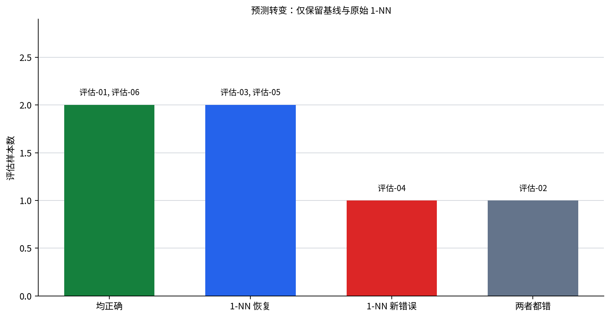

# P7-2.1 阅读比较表和错误案例

> Section ID: `P7-2.1`
> Version: `v2026.08.01`

阅读预测项目的比较表时，应同时保留 `baseline_result`、`candidate_result`、`metric_delta`、`error_sample_id`、`error_pattern` 和 `review_note`。分数不是下一轮的唯一起点；仍然错误、被恢复和新出现的样本同样重要。

## 可比较的预测记录

项目从“能否预测订阅客户的流失风险”开始。先固定问题、输入、标签、训练/评估划分、基线和候选模型，才可以比较模型输出。

| 项目问题 | 本练习的选择 |
| --- | --- |
| 输入 | 未解决工单数、距上次登录天数、近30天使用分钟数 |
| 标签 | 保留 `0` / 流失风险 `1` |
| 训练记录 | 用于建立基线和候选模型 |
| 评估记录 | 不参与拟合，用于比较输出 |
| 最小产物 | 基线预测、模型预测、指标和样本级比较 |

```mermaid
--8<-- "assets/part-07/chapter-02/p7-2-1-project-compare-flow-zh.mmd"
```

## 为什么基线先出现

基线使用训练集中更常见的标签来预测所有评估行。它很简单，但回答关键问题：候选模型是否至少优于忽略输入特征的比较标准？

| 记录 | 能说明什么 | 不能说明什么 |
| --- | --- | --- |
| 多数标签基线 | 不使用输入时的固定比较点 | 每个客户的风险原因 |
| 1-NN 模型 | 特征距离能否改善此固定评估集 | 该模型适合所有未来客户 |
| 准确率 | 正确预测的比例 | 哪些样本改变、为何改变 |
| 错误列表 | 哪些记录需要审查 | 错误的唯一根因 |

只有写出基线，`0.667` 或 `0.833` 这样的分数才有比较含义。即使候选模型高于基线，也必须检查它恢复了什么、又新错了什么。

```mermaid
--8<-- "assets/part-07/chapter-02/p7-2-1-baseline-review-flow-zh.mmd"
```

## 从 CSV 读取训练与评估记录

使用 [`p7-2-churn-dataset.csv`](../../../assets/part-07/chapter-02/p7-2-churn-dataset.csv){ .csv-preview }。每行是一位订阅客户在固定观察窗口中的记录。

```python
import csv
from pathlib import Path
import numpy as np

rows = list(csv.DictReader(Path("docs/assets/part-07/chapter-02/p7-2-churn-dataset.csv").open(encoding="utf-8")))
train = [row for row in rows if row["split"] == "train"]
test = [row for row in rows if row["split"] == "test"]
features = ["unresolved_tickets", "days_since_login", "usage_minutes_30d"]
X_train = np.array([[float(row[name]) for name in features] for row in train])
X_test = np.array([[float(row[name]) for name in features] for row in test])
y_train = np.array([int(row["label"]) for row in train])
y_test = np.array([int(row["label"]) for row in test])

baseline_label = int(np.bincount(y_train).argmax())
baseline_predictions = np.full(len(test), baseline_label)
distances = ((X_test[:, None, :] - X_train[None, :, :]) ** 2).sum(axis=2)
nearest = distances.argmin(axis=1)
model_predictions = y_train[nearest]

records = []
for row, actual, base, prediction, neighbor in zip(test, y_test, baseline_predictions, model_predictions, nearest):
    records.append({
        "sample": row["sample_id"], "actual": int(actual),
        "baseline": int(base), "model": int(prediction),
        "nearest_train": train[int(neighbor)]["sample_id"],
        "baseline_correct": bool(base == actual), "model_correct": bool(prediction == actual),
    })
print("baseline_accuracy =", round(float((baseline_predictions == y_test).mean()), 3))
print("model_accuracy =", round(float((model_predictions == y_test).mean()), 3))
for record in records:
    print(record)
```

此代码有意保持简单。它没有声称欧氏距离已是合适的客户风险表示；它提供一份可以逐行阅读的基线与 1-NN 对照记录。

## 阅读指标与错误转换

| 样本结果 | 意义 | 下一步记录 |
| --- | --- | --- |
| 基线错、模型对 | 被候选模型恢复 | 保存样本、最近训练邻居和特征差异。 |
| 基线对、模型错 | 新出现的错误 | 检查距离、尺度和边界样本。 |
| 两者都错 | 未解决错误 | 检查标签、数据范围和表示。 |
| 两者都对 | 稳定参考 | 保留以防后续回归。 |

准确率差异只是这些转换的汇总。若模型从 `0.500` 提升到 `0.667`，应问是哪一个或哪些评估行改变，而不是把 `0.167` 当成完整解释。

## 选择下一个问题

本例的三个特征尺度不同：使用时长以分钟计，而工单数和未登录天数很小。若原始距离主要由使用时长决定，1-NN 的邻居选择可能无法表达真正的风险结构。这会打开“是否需要缩放”的问题，而不是立刻证明模型容量不足。

| 观察 | 合理的下一问题 |
| --- | --- |
| 多数标签基线较低 | 候选模型是否在相同评估行上真正改善？ |
| 模型恢复一些样本 | 恢复是否伴随新的错误？ |
| 最近邻受大尺度特征支配 | 标准化会改变哪些邻居和错误？ |
| 同一错误持续存在 | 训练范围、标签或特征是否缺少边界案例？ |

## 回顾模板

```text
问题：预测订阅客户的流失风险。
划分：固定的训练记录与评估记录。
基线：训练多数标签及其准确率。
候选：原始特征上的 1-NN 及其准确率。
恢复样本：
新错误样本：
未解决样本：
解释限制：距离结果不证明特征因果关系。
下一问题：是否在相同记录上比较缩放后的特征？
```

## 学习检查

1. 为什么训练与评估记录必须分开？
2. 为什么候选模型高于基线仍不足以结束比较？
3. 如何从样本级记录区分恢复与新错误？
4. 为什么原始特征尺度会影响 1-NN？
5. 下一 Section 如何在相同数据上测试表示变化？

## 读取本次比较的六个样本

程序显示基线准确率为 `0.500`，原始特征上的 1-NN 准确率为 `0.667`。这一提升来自样本转换，而不只是一个抽象的小数。

| 评估样本 | 基线 | 1-NN | 转换状态 | 最近训练记录 |
| --- | ---: | ---: | --- | --- |
| 评估-01 | 对 | 对 | 稳定正确 | 学习-03 |
| 评估-02 | 错 | 错 | 未解决 | 学习-02 |
| 评估-03 | 错 | 对 | 被恢复 | 学习-09 |
| 评估-04 | 对 | 错 | 新错误 | 学习-11 |
| 评估-05 | 错 | 对 | 被恢复 | 学习-11 |
| 评估-06 | 对 | 对 | 稳定正确 | 学习-05 |

模型恢复了 `评估-03` 和 `评估-05`，但把 `评估-04` 从正确改成错误。因而 `0.167` 的准确率提升不等于“模型在所有方面更好”。项目回顾必须同时保留两种恢复和一种新错误。

### 四种转换各自打开的问题

| 转换 | 事实 | 最小审查问题 |
| --- | --- | --- |
| 基线错、模型对 | 输入距离改变了该样本的标签预测。 | 哪些特征使最近训练记录更接近？ |
| 基线对、模型错 | 模型新增了一个错误。 | 尺度或边界为何让该邻居胜出？ |
| 两者都错 | 该样本未被当前比较解决。 | 训练数据、标签或表示是否缺少相近模式？ |
| 两者都对 | 两种方法均能处理该样本。 | 后续变化会否破坏这个稳定参考？ |

转换是评价记录的核心。仅报告准确率会隐藏模型用什么交换了改进。



## 为什么原始尺度会影响 1-NN

三个输入列的单位不同。未解决工单通常只有个位数，未登录天数为几十，而使用时长为数千分钟。未经缩放的欧氏距离会让使用时长的数值差异更容易主导最近邻。

| 特征 | 示例范围 | 原始距离中的风险 |
| --- | ---: | --- |
| 未解决工单 | 1 到 8 | 数值小，贡献可能被淹没。 |
| 未登录天数 | 3 到 28 | 有中等贡献。 |
| 近30天使用分钟 | 2200 到 4200 | 数值大，可能主导邻居选择。 |

这不是说使用时长不重要。问题是：原始单位的大小是否恰好等同于项目希望赋予的特征权重？若没有明确理由，下一步应在相同训练/评估记录上比较缩放版本。

### 对评估-04的限制性回顾

`评估-04` 实际为保留客户，基线预测正确，原始 1-NN 却预测为风险，并选择 `学习-11` 作为最近邻。安全的记录是：原始距离下该训练记录最接近；不安全的记录是：客户一定类似于高风险客户。

| 已知 | 尚未知道 | 后续检查 |
| --- | --- | --- |
| 原始 1-NN 把评估-04预测为 1。 | 哪个特征或尺度造成邻居选择。 | 比较缩放后邻居与预测。 |
| 基线预测为 0 且正确。 | 基线是否在所有类似客户上更可靠。 | 保留该样本作为回归参考。 |
| 最近邻为学习-11。 | 该邻居是否具有业务上的相似性。 | 逐列查看特征差与标签范围。 |

## 一份可复查的比较报告

```text
问题：预测订阅客户的流失风险。
数据版本：p7-2-churn-dataset.csv。
训练/评估划分：按 split 列固定。
基线：训练多数标签，准确率 0.500。
候选：原始特征欧氏距离的 1-NN，准确率 0.667。
恢复：评估-03、评估-05。
新错误：评估-04。
未解决：评估-02。
限制：原始特征尺度不同，距离的业务含义尚未验证。
下一问题：在相同六个评估样本上比较标准化的特征。
```

报告的价值不在于看起来完整，而在于下一次实验可以明确比较“表示改变”而不是不小心同时改变数据、划分和模型。

## 比较表中的错误模式

错误样本不应仅按“正确/错误”排序。把它们与输入条件和最近训练样本联系起来，才可能形成可检验的模式。

| 观察模式 | 当前证据 | 不应过早推出 |
| --- | --- | --- |
| 高使用时长影响邻居 | 原始距离包含分钟差。 | 使用时长是导致流失的原因。 |
| 边界客户被误判 | 评估-04由模型新错。 | 标签或客户记录必然错误。 |
| 1-NN恢复两行 | 评估-03、05改变为正确。 | 原始 1-NN 可直接部署。 |
| 一行持续错误 | 评估-02两种方法均错。 | 更大模型一定会解决。 |

模式是提出下一问题的基础，而不是给输入特征贴上因果标签。

## 用同一数据做受控比较

下一次运行应一次只改变一个部分。

1. 保持训练/评估划分、标签和 1-NN 规则不变，只对训练与评估特征使用同一缩放方法。
2. 保存原始表示的六行结果，尤其是 `评估-04` 新错误。
3. 重新记录基线，但不要因模型改变而改变基线定义。
4. 比较恢复、仍错和新错的 ID，而非只比较最终准确率。
5. 若添加训练记录，先写明缺少的边界模式及其标签依据。

| 改变 | 保持固定 | 将回答的问题 |
| --- | --- | --- |
| 特征缩放 | CSV、划分、标签、1-NN | 单位大小是否改变错误转换？ |
| 添加训练行 | 评估六行、比较报告字段 | 数据覆盖是否恢复某个未解决错误？ |
| 修改阈值或规则 | 存储的预测与标签 | 操作规则有什么错误权衡？ |
| 更换模型家族 | 数据版本和回归样本 | 表示关系是否值得更复杂模型？ |

## 不应遗漏的运营问题

在讨论模型前，先检查预测项目的运营条件。

| 问题 | 为什么先问 |
| --- | --- |
| 标签代表什么观察窗口？ | 标签定义改变会使比较失效。 |
| 特征在预测时是否可获得？ | 未来不可见的信息会造成泄漏。 |
| 评估样本与训练样本是否独立？ | 重复或泄漏会夸大分数。 |
| 错误的业务成本是否相同？ | 准确率可能不符合实际决策风险。 |
| 小评估集中的每一行能否回查？ | 一个样本会大幅改变分数。 |

这些问题并不要求停止小型练习；它们规定了小型练习不能声称什么。

## 最终学习检查

1. 能否从比较表列出被恢复、新错、未解决和稳定的样本？
2. 能否解释为什么 1-NN 的原始距离需要检查尺度？
3. 能否写出一条事实而不把最近邻解释成因果？
4. 能否说明下一次缩放实验中必须固定哪些内容？
5. 能否说明为何基线的定义不能随候选模型改变？
6. 能否指出一个模型评分之外的运营检查？

如果这些问题能回答，比较表就成为下一次可控实验的起点，而不是一次性成绩单。

## 评估记录的阅读顺序

当比较表很长时，按固定顺序阅读可以防止只挑选支持模型的行。

1. 确认数据版本、划分和标签定义。
2. 读取基线准确率和候选模型准确率。
3. 列出所有被恢复的样本。
4. 列出所有新出现的错误。
5. 列出两种方法都错的样本。
6. 读取最近训练记录和输入尺度，但不把它们当作原因。
7. 写下只改变一个组件的下一实验。

这个顺序让错误转换先于模型故事。若最终指标改善，却没有列出新错误，比较尚未完成。

### 预测记录的字段说明

| 字段 | 为什么保留 |
| --- | --- |
| `sample_id` | 让同一客户记录可在下一次运行中重找。 |
| `actual` | 说明比较使用的标签。 |
| `baseline` | 显示不使用特征的参照输出。 |
| `model` | 显示候选模型输出。 |
| `nearest_train` | 让距离选择可以被检查。 |
| `baseline_correct` | 支持恢复和新错误的分类。 |
| `model_correct` | 支持恢复和新错误的分类。 |
| `review_note` | 保留限制、模式和下一问题。 |

字段不是为了把控制台输出做得复杂。它们使一个准确率变化可以还原为可审查的样本转换。

## 反例与回归参考

若缩放后 `评估-04` 恢复正确，也不能只报告这一个好消息。必须检查 `评估-03`、`评估-05` 是否仍然正确，以及 `评估-01`、`评估-06` 是否出现回归。一个好的比较总是同时包含目标错误、已恢复样本和稳定样本。

| 参考组 | 在下一实验中的用途 |
| --- | --- |
| 评估-04 | 原始模型新错误，优先观察是否恢复。 |
| 评估-03、评估-05 | 原始模型恢复，检查是否被新表示破坏。 |
| 评估-02 | 原始未解决错误，检查问题是否仍存在。 |
| 评估-01、评估-06 | 稳定正确，检查不必要的回归。 |

这份参考组把六行小数据变成一个完整的回归集。即使未来使用不同模型，仍可在相同样本上比较错误权衡。

## 提交比较前的检查表

- 是否从真实 CSV 而非手写数组读取了训练和评估记录？
- 是否明确了三个特征、标签和 `split` 的含义？
- 是否先计算并报告了基线？
- 是否将候选模型与基线放在相同的六个评估行上？
- 是否保存了每个样本的预测和正确性？
- 是否区分了恢复、新错误、未解决和稳定结果？
- 是否记录了原始特征尺度的限制？
- 是否避免将最近邻当作因果解释？
- 是否保留了下一次表示实验的固定参考样本？
- 是否说明了准确率不能表达的业务和标签问题？
- 是否只改变一个组件来测试下一假设？
- 是否让另一位读者可以重新运行并获得同一比较结构？

满足这些条件后，P7-2.1 的输出可以交给 P7-2.2：后者会在相同数据与参考样本上检验缩放如何改变距离、预测和错误转换。

## 用比较表避免三种常见误读

| 常见误读 | 为什么不够 | 应补充的记录 |
| --- | --- | --- |
| 模型准确率高于基线，所以已经完成。 | 忽略新错误和未解决错误。 | 所有样本的转换分类。 |
| 最近邻就是业务上最相似的客户。 | 原始距离受单位和特征选择影响。 | 逐列特征、缩放规则和距离限制。 |
| 基线很简单，所以不需要再看。 | 基线提供稳定参考和错误对照。 | 基线预测、正确性和其遗漏模式。 |
| 评估-04 只是一个偶然错误。 | 小评估集中每一行都改变指标。 | 样本 ID、标签、邻居和后续回归状态。 |
| 添加更多特征一定更好。 | 新特征也可能泄漏、噪声或改变距离结构。 | 特征可用时间、范围和受控比较。 |

这些误读都把比较的一个部分当成完整答案。项目记录的作用是让分数、输入、错误和限制彼此可见。

### 如果结果发生改变，应写什么

未来运行可能改变模型准确率、某一邻居或标签策略。每次改变都应回答下面的四个问题。

```text
改变了什么：数据、表示、模型、阈值还是标签规则？
保持了什么：评估行、基线定义、参考样本和报告字段？
恢复了什么：哪些原先错误的 ID 变为正确？
代价是什么：哪些原先正确的 ID 变为错误，哪些仍未解决？
```

若不能回答“保持了什么”，就不应把两个运行当作因果比较。它们至多是探索性结果。

## 练习：检查邻居而不做过度解释

选择 `评估-03`、`评估-04` 和 `评估-05`，为每个样本建立一张小表。

| 字段 | 要填写的内容 |
| --- | --- |
| 评估 ID | 要重新找到的客户记录。 |
| 实际标签 | 保存的保留或流失风险标签。 |
| 基线与模型输出 | 两种预测以及正确性。 |
| 最近训练 ID | 原始表示下被选中的邻居。 |
| 特征差异 | 三个输入列的差，但不写成原因。 |
| 变化类型 | 恢复、新错误或未解决。 |
| 下一问题 | 缩放、数据覆盖或标签检查中的一个。 |

完成后比较三张表：为何同一模型能恢复两个基线错误，却又制造一个新错误？答案应指向表示和数据检查，而不是泛泛地称模型“好”或“坏”。

## 作为项目起点的最小交付物

| 交付物 | 本节中的形式 |
| --- | --- |
| 问题定义 | 预测订阅客户流失风险。 |
| 输入和标签说明 | 三个运营特征与二元标签。 |
| 固定划分 | CSV 中的 train/test 行。 |
| 基线记录 | 多数标签预测与 0.500 准确率。 |
| 候选记录 | 原始 1-NN 与 0.667 准确率。 |
| 样本比较 | 六个 ID 的预测转换与最近邻。 |
| 限制说明 | 特征尺度、样本量、标签和业务成本。 |
| 下一实验 | 在相同参考集上标准化特征。 |

这八项共同组成一个可继续的预测项目，而不是一段一次性代码。

### 交接给下一次表示实验

保存本次原始特征结果作为“之前”状态。
固定六个评估样本及其标签。
固定多数标签基线和报告字段。
只改变缩放或标准化规则。
比较每个样本的最近邻和预测转换。
报告恢复、新错误、稳定和未解决的 ID。
不要因结果不理想而删除评估-04或评估-02。
将准确率变化与样本级变化放在同一份回顾中。
记录缩放参数只能从训练记录计算。
检查测试记录没有参与拟合任何表示参数。
由此开始 P7-2.2 的受控比较。

## 来源与参考

本节的数据和示例为本书创建的练习材料。
