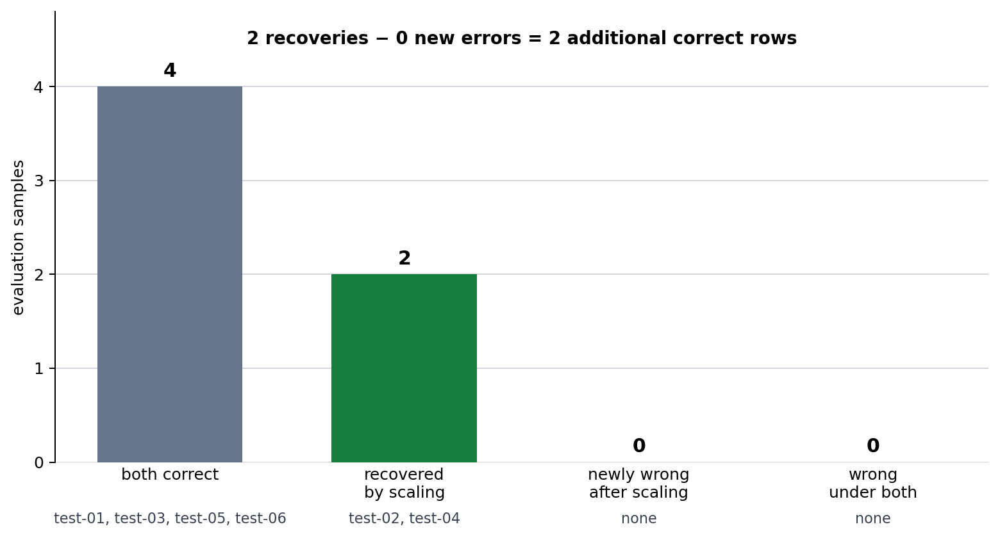

# P7-2.2 Building a Retrospective and Next Question

> Section ID: `P7-2.2`
> Version: `v2026.08.01`

Separate `fact`, `interpretation`, `remaining_error`, `next_question`, `next_data_need`, and `decision_log`. This turns a result explanation into a question for the next experiment instead of an impression.

After comparing a baseline and model, improvement must mean what changed against the same reference—not merely that a score rose.

## Evidence required to claim improvement

| Requirement | Why it matters |
| --- | --- |
| Baseline | A candidate model needs a comparison point. |
| Same evaluation set | A score difference is not interpretable if the tested rows change. |
| Prediction examples | One score does not show which samples changed. |
| Limitation record | Small, synthetic, or lucky results must not be generalized. |

P7-2.1 gives baseline accuracy `0.500` and raw 1-NN accuracy `0.667`. That establishes a fact: using the features helps on this test set. It does not settle why two errors remain or whether the result will generalize.

| Test sample | Actual | Baseline | Raw 1-NN | Reading |
| --- | ---: | ---: | ---: | --- |
| test-02 | 1 | 0 | 0 | A high-usage retained neighbor still hides churn risk. |
| test-03 | 1 | 0 | 1 | The model recovers a risk row missed by the baseline. |
| test-04 | 0 | 0 | 1 | Similar usage time draws it to a churn-risk neighbor. |
| test-05 | 1 | 0 | 1 | Inquiry count and inactive days help. |

The remaining pattern suggests that usage minutes are overly influential in raw Euclidean distance. The next comparable experiment is to standardize features using the training-set mean and standard deviation, then inspect scores, neighbor identities, and prediction changes on exactly the same test rows.

```mermaid
--8<-- "assets/part-07/chapter-02/p7-2-2-raw-distance-risk-flow-en.mmd"
```

The flow is: observe a raw-distance failure, check the scale difference, apply a training-only preprocessing rule, compare the same evaluation rows, and leave a next question.

## Compare preprocessing in execution

This practice keeps [`p7-2-churn-dataset.csv`](../../../assets/part-07/chapter-02/p7-2-churn-dataset.csv){ .csv-preview } and its split unchanged. A `Pipeline` connects `StandardScaler` and 1-NN so the evaluation rows receive the training-derived transformation.

```python
import csv
from pathlib import Path
import numpy as np
from sklearn.neighbors import KNeighborsClassifier
from sklearn.pipeline import Pipeline
from sklearn.preprocessing import StandardScaler

rows = list(csv.DictReader(Path("docs/assets/part-07/chapter-02/p7-2-churn-dataset.csv").open(encoding="utf-8")))
for row in rows:
    for column in ("unresolved_tickets", "days_since_login", "usage_minutes_30d", "label"):
        row[column] = int(row[column])
train_rows = [row for row in rows if row["split"] == "train"]
test_rows = [row for row in rows if row["split"] == "test"]
features = ["unresolved_tickets", "days_since_login", "usage_minutes_30d"]
X_train = np.array([[row[name] for name in features] for row in train_rows], dtype=float)
X_test = np.array([[row[name] for name in features] for row in test_rows], dtype=float)
y_train = np.array([row["label"] for row in train_rows])
y_test = np.array([row["label"] for row in test_rows])

raw = KNeighborsClassifier(n_neighbors=1).fit(X_train, y_train)
scaled = Pipeline([("scaler", StandardScaler()), ("knn", KNeighborsClassifier(n_neighbors=1))]).fit(X_train, y_train)
raw_pred, scaled_pred = raw.predict(X_test), scaled.predict(X_test)
raw_ids = [train_rows[index]["sample_id"] for index in raw.kneighbors(X_test, return_distance=False).ravel()]
scaled_test = scaled.named_steps["scaler"].transform(X_test)
scaled_ids = [train_rows[index]["sample_id"] for index in scaled.named_steps["knn"].kneighbors(scaled_test, return_distance=False).ravel()]

print("raw accuracy =", round(float((raw_pred == y_test).mean()), 3))
print("scaled accuracy =", round(float((scaled_pred == y_test).mean()), 3))
for row, before, after, raw_id, scaled_id in zip(test_rows, raw_pred, scaled_pred, raw_ids, scaled_ids):
    print({"sample_id": row["sample_id"], "actual": row["label"], "raw": int(before), "scaled": int(after), "raw_neighbor": raw_id, "scaled_neighbor": scaled_id})
```

The result changes from `0.667` to `1.000`. Predictions change for test-02 and test-04: test-02 switches from retained to churn risk and its neighbor changes from train-02 to train-08; test-04 switches from churn risk to retained and its neighbor changes from train-11 to train-04.

The transition chart separates recovery from regression. It uses the same fixed six evaluation rows as the code, so its bars explain the accuracy difference instead of replacing it.



Read this in three stages.

1. **Fact:** the two recovered samples and zero new errors occur on the same six evaluation rows.
2. **Interpretation:** the large usage-minute scale probably distorted raw neighbor selection.
3. **Next experiment:** test additional boundary cases and other splits to see whether recovery remains and new errors appear.

Normalization can change who the model treats as a nearest neighbor; it is not cosmetic score formatting. However, six synthetic test rows are not sufficient evidence for a general performance claim.

## Keep the neighbor transition with each changed prediction

The two changed rows make the preprocessing effect concrete.

| Test sample | Before scaling | After z-score scaling | Neighbor transition | What the transition suggests |
| --- | --- | --- | --- | --- |
| test-02 | Retained, wrong | Churn risk, correct | train-02 → train-08 | Usage minutes had pulled the raw distance toward a retained customer. |
| test-04 | Churn risk, wrong | Retained, correct | train-11 → train-04 | Inquiry count and days since login become more influential after scaling. |

The remaining four evaluation rows keep the same predicted label. A prediction change is not automatically a success, and no change is not automatically a failure. The record must identify whether the changed sample became correct, became newly wrong, or still needs a boundary explanation.

```text
training mean = [3.83, 12.83, 3158.33]
training standard deviation = [2.34, 8.52, 570.76]
comparison summary = {
  'raw accuracy': 0.667,
  'scaled accuracy': 1.000,
  'prediction-change count': 2,
  'raw error samples': ['test-02', 'test-04'],
  'scaled error samples': []
}
```

The mean and standard deviation must be estimated from training rows only. If test rows determine the transformation, the evaluation has information from the labels it is meant to test indirectly through preprocessing. Keeping the scaler and classifier in one pipeline makes that boundary explicit.

## Read the same result as a retrospective

Use a comparison record with these fields.

```text
Comparison basis: fixed train/test split; raw 1-NN versus StandardScaler + 1-NN
Raw result: accuracy 0.667; errors test-02 and test-04
Scaled result: accuracy 1.000; no errors on this evaluation set
Changed predictions: test-02 and test-04
Nearest-neighbor changes: train-02 to train-08; train-11 to train-04
Evidence for improvement: both changed cases became correct with no newly wrong row
Limit not to claim: a six-row synthetic test set does not establish general performance
Next iteration: test more customer segments, more boundary cases, and another split
```

This format separates a score from the explanation that makes the score useful. A retrospective with only “accuracy increased” cannot tell a later reader whether the change came from the intended preprocessing rule, a different test set, or a new error that was ignored.

## Why the same evaluation set matters

| Comparison mistake | Why it weakens the claim |
| --- | --- |
| Change preprocessing and test rows together | The score difference has more than one possible cause. |
| Fit scaling values on train and test rows together | Evaluation information leaks into the representation. |
| Report only accuracy | Recovered and newly wrong samples disappear. |
| Omit nearest-neighbor IDs | The explanation for a changed prediction cannot be checked. |
| Omit the small-data limit | A practice result can be mistaken for a general claim. |

An improvement statement is justified only on a shared comparison basis. In this practice, the label, split, six evaluation rows, and 1-NN rule are fixed; the feature transformation is the experiment variable.

## Extend the next experiment carefully

1. Replace z-score normalization with a deliberate manual scaling of usage minutes.
   - Check whether test-02 and test-04 both change or only one changes.
   - Record any newly wrong row rather than keeping only the better score.
2. Add an ambiguous customer that both raw and scaled models miss.
   - Keep the original six-row comparison distinct from this enlarged evaluation case set.
   - Add the remaining error to the retrospective even if the original comparison still improves.
3. Repeat the same pipeline with a different train/test split.
   - Check whether the two recovered patterns persist.
   - Avoid calling the first result a general performance increase before this check.

## How to phrase the conclusion

Safe wording is conditional: “On this fixed synthetic evaluation set, z-score preprocessing changed two nearest-neighbor choices, recovered both previously wrong rows, and created no new error.”

Unsafe wording is broader than the evidence: “Normalization solves customer churn prediction.”

The distinction protects the project record from turning a small comparison into a claim about every future customer.

## What standardization changes

Z-score standardization is a representation change. For each feature, it subtracts the training-set mean and divides by the training-set standard deviation. The operation changes the relative contribution of feature differences to distance; it does not add labels or change the 1-NN decision rule.

| Item held fixed | Item changed |
| --- | --- |
| Customer-risk label | Feature representation |
| Train/test split | Distance scale of each feature |
| Six evaluation rows | Nearest-neighbor identity for some rows |
| One-neighbor classifier | Training-only mean and standard deviation |

The distinction matters because an accuracy change can otherwise be described vaguely as a model change. In this run the model rule remains 1-NN. The experiment asks whether a training-derived feature transformation alters the error path.

### Why training-only values matter

The scaler learns its mean and standard deviation from training rows. Test rows are transformed with those already-fixed values. If a preprocessing rule uses all rows before the split, the evaluation inputs influence the representation that is being tested. This is information leakage even when their labels are not passed directly to the classifier.

The pipeline is useful because it keeps the training-only fitting order explicit. It is still the author’s responsibility to keep the split fixed and to record the scaler as part of the candidate definition.

## Follow the two changed neighbor paths

The two recovered cases are not interchangeable.

| Row | Raw geometry | Scaled geometry | Narrow conclusion |
| --- | --- | --- | --- |
| test-02 | Closest to retained train-02 | Closest to churn-risk train-08 | The raw usage scale had outweighed other useful differences for this row. |
| test-04 | Closest to churn-risk train-11 | Closest to retained train-04 | Standardization made ticket and inactivity differences more influential. |

The phrase “more influential” describes this particular distance calculation. It does not prove that usage minutes are unimportant, nor that one feature causes churn. The next experiment must include rows that could challenge the same explanation.

## Classify every transition

Compare prediction status before and after preprocessing, not just labels.

| Transition | Review decision |
| --- | --- |
| Incorrect → correct | Keep the recovered row as evidence for the candidate. |
| Correct → incorrect | Record a new error before making an improvement claim. |
| Correct → correct | Keep it as stable evidence; inspect neighbor changes only if relevant. |
| Incorrect → incorrect | Keep it as a remaining boundary case. |

In the current six rows, test-02 and test-04 are incorrect → correct, while the other four remain correct. There is no newly wrong row. This supports the narrow statement that scaling improved this fixed comparison; it does not remove the need for a different split or additional boundary data.

## Write a fact, interpretation, and next question

Use these three fields after each run:

```text
fact: z-score 1-NN changed accuracy from 0.667 to 1.000 on the same six rows;
      test-02 and test-04 became correct and no row became newly wrong.
interpretation: raw usage-minute magnitude may have distorted the two neighbor selections.
next question: do the two recoveries persist on other customer segments and a new split?
```

The interpretation is intentionally conditional. A score rise establishes a result; it does not uniquely establish the mechanism or the future behavior of the pipeline.

## Controlled extensions

Run each extension from the original CSV and preserve the default comparison separately.

1. Apply a manual divisor only to usage minutes.
   - This isolates whether reducing one large unit is sufficient for both recovered rows.
   - Record the exact divisor and every transition, including any new error.

2. Add one ambiguous evaluation customer that both variants miss.
   - Keep the six-row result as its own comparison.
   - Use the added error to formulate a boundary-data or feature question.

3. Create a second, documented train/test split.
   - Fit the scaler again on that split’s training rows only.
   - Compare the pattern of recovery rather than combining the two score tables.

4. Replace the standardizer with another stated preprocessing rule.
   - Keep the 1-NN classifier and labels fixed.
   - State what feature relation the new rule preserves or discards.

These extensions can falsify the first interpretation. They are more informative than repeatedly tuning settings until the original six rows look best.

## Retrospective handoff

Include this information when handing the result to another reviewer:

```text
data and split version:
raw candidate definition:
scaled candidate definition and training-only statistics:
fixed evaluation IDs:
accuracy before and after:
recovered, newly wrong, and remaining IDs:
nearest-neighbor transitions for changed predictions:
claim supported by the run:
claim explicitly not supported:
next independent experiment:
```

A later reader should be able to reconstruct why test-02 and test-04 were highlighted without inferring it from the final `1.000` alone.

## Limits to preserve

- The practice data are synthetic and contain only six evaluation rows.
- The two class labels simplify a real retention decision.
- A z-score rule may be unsuitable for another feature distribution or operating objective.
- Accuracy does not represent the different operational costs of retained and churn-risk errors.
- The current result does not compare alternative classifiers.

These limits do not weaken the observed transition. They prevent it from being used beyond its evidence boundary.

## Final learning check

- Did the scaler learn values only from training rows?
- Did raw and scaled 1-NN use the same labels, split, and six evaluation rows?
- Can you name both recovered rows and their neighbor transitions?
- Did you search explicitly for newly wrong rows rather than assuming every prediction change is an improvement?
- Can you write a conditional interpretation and a falsifiable next question?

### Closing record discipline

Keep the raw and scaled feature definitions together.
Keep the training mean and standard deviation with the scaled run.
Keep the sample IDs behind every accuracy number.
Keep recovered and newly wrong cases in different lists.
Keep the original split available for a later rerun.
Keep any additional split in a separate comparison record.
Keep the smallest next experiment separate from a production decision.
Keep the claim conditional on the documented six-row evaluation.
Keep the nearest-neighbor identity for every changed prediction.
Keep the preprocessing version with any deployed or reviewed result.
Keep a note of which operational error cost was not measured here.
Keep the next question open until a broader evaluation answers it.

## A useful retrospective

> In this churn-risk practice, baseline accuracy was 0.500, raw 1-NN accuracy was 0.667, and normalized 1-NN accuracy was 1.000. The raw usage-minute scale selected unsuitable neighbors for test-02 and test-04; after z-score scaling, inquiry and inactivity signals were considered alongside usage and both samples became correct. Because the dataset is small and synthetic, the next iteration must test more customer segments and splits before claiming a general improvement.

## Try changes and record limits

1. Scale only `usage_minutes_30d` into a smaller range; check whether both recovered samples change or only one.
2. Add an ambiguous test customer that raw and normalized models both miss; record the remaining failure even if aggregate accuracy still improves.

| Check | Question to answer |
| --- | --- |
| Same test set | Were raw and scaled results compared on the same rows? |
| Changed cases | Did you record prediction changes beside accuracy? |
| Prediction path | Did you inspect changed nearest training samples? |
| Limit | Did you avoid generalizing from small synthetic data? |
| Next question | Did you state remaining failures or boundary cases to collect? |

## Sources and references

- [NumPy documentation](https://numpy.org/doc/stable/){: target="_blank" rel="noopener noreferrer" }
- [scikit-learn Nearest Neighbors](https://scikit-learn.org/stable/modules/neighbors.html){: target="_blank" rel="noopener noreferrer" } and [Pipeline](https://scikit-learn.org/stable/modules/compose.html#pipeline){: target="_blank" rel="noopener noreferrer" }
- The data are synthetic practice records created for this book.
