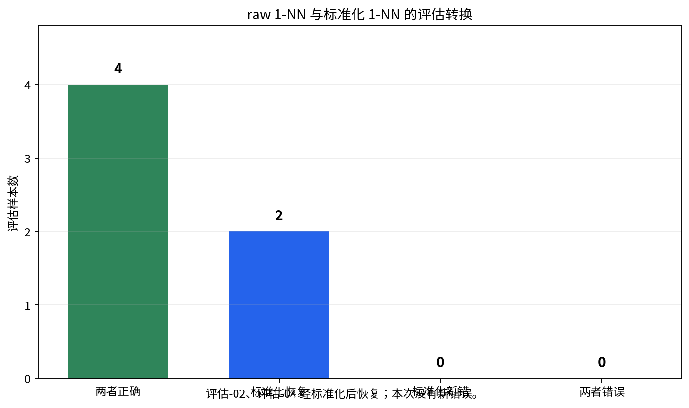

# P7-2.2 构建回顾与下一问题

> Section ID: `P7-2.2`
> Version: `v2026.08.01`

回顾应分开记录 `fact`、`interpretation`、`remaining_error`、`next_question`、`next_data_need` 和 `decision_log`。这样“改善”不只是分数上升，而是同一比较条件下哪些样本、邻居和错误发生了变化。

## 在什么条件下说“改善”

对模型作出改善声明至少需要基线、同一评估集、样本级预测和限制记录。

| 必需记录 | 为什么需要 |
| --- | --- |
| 基线 | 给候选模型提供最小比较标准。 |
| 同一评估集 | 防止分数变化来自不同样本。 |
| 样本预测 | 显示哪些案例真正改变。 |
| 错误转换 | 显示恢复与新错误的权衡。 |
| 限制 | 防止小型或合成数据被过度解释。 |

P7-2.1 的多数标签基线为 `0.500`，原始 1-NN 为 `0.667`。这一事实支持“使用特征优于当前基线”的有限表述；它仍不说明每个样本、每个特征或未来客户都会改善。

## 先读样本，再解释分数

| 评估样本 | 实际 | 基线 | raw 1-NN | 应阅读的内容 |
| --- | ---: | ---: | ---: | --- |
| 评估-02 | 1 | 0 | 0 | 两种方法都遗漏，仍需检查。 |
| 评估-03 | 1 | 0 | 1 | raw 1-NN恢复基线错误。 |
| 评估-04 | 0 | 0 | 1 | raw 1-NN产生新错误。 |
| 评估-05 | 1 | 0 | 1 | 原始输入信号恢复一个风险案例。 |

raw 1-NN 已经恢复两个风险案例，但 `评估-04` 因邻近高风险训练行而成为新错误。下一问题不是“模型是否有用”，而是“原始距离为何选择这个邻居”。

```mermaid
--8<-- "assets/part-07/chapter-02/p7-2-2-raw-distance-risk-flow-zh.mmd"
```

## 用训练集统计量比较标准化

未解决工单数、未登录天数与使用分钟数具有不同尺度。z-score 标准化只从训练数据估计均值与标准差，再对训练与评估应用同一变换。这样评估记录不会泄漏到表示参数中。

```python
import csv
from pathlib import Path

import numpy as np
from sklearn.neighbors import KNeighborsClassifier
from sklearn.pipeline import Pipeline
from sklearn.preprocessing import StandardScaler

rows = list(csv.DictReader(Path("docs/assets/part-07/chapter-02/p7-2-churn-dataset.csv").open(encoding="utf-8")))
train = [row for row in rows if row["split"] == "train"]
test = [row for row in rows if row["split"] == "test"]
features = ["unresolved_tickets", "days_since_login", "usage_minutes_30d"]
X_train = np.array([[float(row[name]) for name in features] for row in train])
X_test = np.array([[float(row[name]) for name in features] for row in test])
y_train = np.array([int(row["label"]) for row in train])
y_test = np.array([int(row["label"]) for row in test])

raw = KNeighborsClassifier(n_neighbors=1).fit(X_train, y_train)
scaled = Pipeline([("scaler", StandardScaler()), ("knn", KNeighborsClassifier(n_neighbors=1))]).fit(X_train, y_train)
raw_pred = raw.predict(X_test)
scaled_pred = scaled.predict(X_test)
for row, actual, before, after in zip(test, y_test, raw_pred, scaled_pred):
    print({"sample": row["sample_id"], "actual": int(actual), "raw": int(before),
           "scaled": int(after), "changed": bool(before != after),
           "raw_correct": bool(before == actual), "scaled_correct": bool(after == actual)})
print("raw_accuracy =", round(float((raw_pred == y_test).mean()), 3))
print("scaled_accuracy =", round(float((scaled_pred == y_test).mean()), 3))
```

管道（Pipeline）使缩放与 1-NN 成为同一个训练流程。重要的是缩放器只从 `X_train` 学习；不能在合并训练和评估记录后计算均值和标准差。

## 读取错误转换

| 转换 | 含义 | 回顾中的写法 |
| --- | --- | --- |
| raw错、scaled对 | 标准化恢复一个原始错误。 | 写出 ID、原始与新预测、邻居是否改变。 |
| raw对、scaled错 | 标准化引入新错误。 | 保留为回归样本，而非隐藏。 |
| 两者都对 | 稳定正确。 | 保留以观察意外回归。 |
| 两者都错 | 未解决。 | 转向数据、标签或表示范围问题。 |

改善必须包含上述四类转换。即使标准化提高准确率，也不能忽略它若造成新的客户风险误判。

## 回顾模板

```text
比较条件：同一 CSV、同一 train/test 划分、同一 1-NN。
改变组件：使用训练集均值和标准差的 z-score 标准化。
基线：多数标签准确率。
raw 结果：准确率、错误 ID、最近邻。
标准化结果：准确率、错误 ID、最近邻。
恢复：
新错误：
未解决：
有限解释：标准化改变距离的相对权重；不证明任何特征的因果作用。
下一问题：是否需要更多边界案例或另一种表示？
```

## 学习检查

1. 为什么“同一评估集”是改善声明的前提？
2. 为什么标准化参数必须只从训练集计算？
3. 如何从样本记录识别恢复和新错误？
4. 原始距离的尺度问题与模型容量问题有什么不同？
5. 下一次实验中哪些内容必须保持不变？

## 阅读本次标准化运行

当前运行中，raw 1-NN 的准确率为 `0.667`，标准化后的 1-NN 为 `1.000`。两个样本改变了预测：`评估-02` 从错误的保留预测变为正确的流失风险预测，`评估-04` 从错误的流失风险预测变为正确的保留预测。

| 样本 | raw 预测 | 标准化预测 | 实际标签 | 转换 | 应保留的事实 |
| --- | ---: | ---: | ---: | --- | --- |
| 评估-01 | 0 | 0 | 0 | 稳定正确 | 表示改变没有破坏该参考。 |
| 评估-02 | 0 | 1 | 1 | 恢复 | 标准化改变了该行的预测。 |
| 评估-03 | 1 | 1 | 1 | 稳定正确 | raw 的恢复仍被保留。 |
| 评估-04 | 1 | 0 | 0 | 恢复 | 标准化消除了 raw 的新错误。 |
| 评估-05 | 1 | 1 | 1 | 稳定正确 | 原始信号仍然有效。 |
| 评估-06 | 0 | 0 | 0 | 稳定正确 | 没有新的回归。 |

本次固定评估集没有“标准化后新错”的行，也没有两种表示都错的行。这个事实支持有限结论：在这六条记录上，训练集 z-score 标准化改善了最近邻的预测结果。它不证明标准化在所有客户数据、所有窗口或所有模型中都同样有效。



## 为什么邻居会改变

1-NN 的预测取决于哪个训练行距离最近。原始表示中，使用时长的分钟差可能大于其他两个特征的数值差；标准化后，每个特征以训练集的标准差为尺度，工单数和未登录天数能在距离中发挥相对更大的作用。

| 表示 | 距离的比较方式 | 可能的影响 |
| --- | --- | --- |
| raw 特征 | 直接比较原始单位 | 大数值列容易主导距离。 |
| z-score 特征 | 减去训练均值并除以训练标准差 | 列的典型离散程度更接近。 |
| 业务加权特征 | 使用明确的业务权重 | 需要单独说明权重来源和风险。 |
| 学得的表示 | 由模型或特征工程生成 | 必须记录训练数据和评估边界。 |

标准化不是给每个特征宣布相同的业务重要性。它只是让原始单位的量纲不直接决定欧氏距离的大小。是否应该使用这种表示，仍要由同一评估集上的错误转换和项目目标判断。

### 标准化参数的边界

| 步骤 | 正确做法 | 不能做的事 |
| --- | --- | --- |
| 估计均值与标准差 | 只使用训练行。 | 把评估行合并进统计量。 |
| 变换训练行 | 使用训练统计量。 | 为每个训练行单独重新缩放。 |
| 变换评估行 | 使用同一训练统计量。 | 从评估集重新拟合 scaler。 |
| 比较预测 | 固定相同的评估 ID。 | 因表示改变而替换难样本。 |

这条边界避免了数据泄漏。若评估样本参与计算均值或标准差，后续准确率不再表示真正未见记录上的比较。

## 改善不是只有准确率

准确率从 `0.667` 到 `1.000` 的变化是重要事实，但应与错误转换放在同一表中。

| 报告字段 | raw 1-NN | 标准化 1-NN | 如何解释 |
| --- | ---: | ---: | --- |
| 评估行数 | 6 | 6 | 分母保持不变。 |
| 正确数 | 4 | 6 | 两个固定 ID 发生恢复。 |
| 准确率 | 0.667 | 1.000 | 聚合结果。 |
| 恢复 | 无相对此模型的比较 | 评估-02、评估-04 | 样本级改善。 |
| 新错误 | 评估-04相对基线是新错误 | 无 | 必须显式报告。 |
| 未解决 | 评估-02 | 无 | 不能从分数单独读出。 |

表中“raw 的新错误”是相对 P7-2.1 基线比较的描述；“标准化的恢复”是相对 raw 1-NN 的描述。每次回顾都必须说明比较对象，否则“恢复”一词没有明确参照。

## 把图表读成样本转换，而非装饰

若使用比较图，图中应至少显示 raw、标准化、被恢复和新错误的数量，并在文字中写出对应 ID。图表可以帮助看见模式，但不能替代样本列表、数据版本或训练统计量的记录。

| 图表问题 | 读者仍需回到的记录 |
| --- | --- |
| 多少样本被恢复？ | 哪些 sample ID、它们的实际标签和预测。 |
| 是否有新错误？ | 每个新错误的原始与新表示输出。 |
| 分数提高多少？ | 同一评估集的分母和基线。 |
| 邻居为何改变？ | 训练特征、缩放规则和最近邻索引。 |

本练习的小评估集尤其需要这种对应关系：一个样本已经相当于准确率的 `1/6`，图上的大幅变化可能只来自一行。

## 将结果写成项目回顾

> 在固定的训练/评估划分中，raw 1-NN 的准确率为 0.667，训练集 z-score 标准化后的 1-NN 为 1.000。`评估-02` 与 `评估-04` 从 raw 错误变为正确，其他四行保持正确，本次没有新错误。该结果支持“原始单位影响了这个固定数据集上的距离比较”这一有限解释；它不证明使用时长、工单数或未登录天数的业务因果作用。下一步将保留同一参考样本，检查缩放后最近邻，并在新增边界案例上再次比较。

这段回顾包括比较条件、事实、恢复、新错误状态、解释限制和下一问题。少任何一项，改善声明就更容易被误读为普遍结论。

### 回顾中不要写的句子

| 不安全句子 | 原因 | 替代句子 |
| --- | --- | --- |
| 标准化证明模型已经可用。 | 六行合成评估不能证明部署质量。 | 标准化在固定六行上改善了当前 1-NN 比较。 |
| 使用时长导致评估-04被错分。 | 距离观察不是因果证据。 | 原始单位可能使使用时长对距离有较大影响。 |
| 没有新错误，所以任何缩放都安全。 | 只检验了一个规则和小数据。 | 本次 z-score 运行未在当前参考行产生新错误。 |
| 评估-02已经解决。 | 仅当前表示和标签下恢复。 | 评估-02在标准化 1-NN 中恢复，仍应保留作回归检查。 |

## 设计下一次受控实验

| 想检查的假设 | 只改变什么 | 必须保持什么 |
| --- | --- | --- |
| 尺度造成距离失衡 | 从 raw 改为 z-score | CSV、划分、标签、1-NN、评估 ID。 |
| 另一种缩放是否更合适 | 更换 scaler | 训练来源、报告字段和参考 ID。 |
| 数据范围不足 | 添加明确标注的训练边界案例 | 原始六行评估与基线定义。 |
| 模型关系不足 | 更换模型家族 | 数据版本、表示说明和回归集。 |
| 业务阈值不合适 | 改变决策规则 | 存储概率或距离、真实标签。 |

一次实验若同时更换 scaler、数据和模型，即使分数更高也无法说明哪一个组件负责。将探索性运行与受控比较分开记录。

## 直接修改并观察

1. 将 `StandardScaler` 改为另一种已说明的缩放方法，并保留原始运行输出。
2. 只改变 `n_neighbors`，说明这不再是“仅表示变化”的比较。
3. 为训练集添加一个明确的边界客户，保持六个评估行不变。
4. 输出 raw 与 scaled 的最近邻训练 ID，检查邻居是否真的改变。
5. 把 `评估-02` 和 `评估-04` 作为回归样本，检查后续任何改动。
6. 写出一个没有被当前数据回答的问题，例如不同时间窗口上的稳定性。

每次练习都要写明改变的组件。否则读者无法把错误转换与某一个可复现决定关联起来。

## 最后检查表

- 是否使用同一 CSV、标签、划分和六个评估 ID？
- 标准化是否只从训练记录拟合？
- 是否同时报告 raw、标准化和基线？
- 是否列出被恢复、新错误、稳定和未解决的样本？
- 是否保存了 raw 运行作为之前状态？
- 是否避免把距离变化写成特征因果作用？
- 是否记录了小样本和合成数据限制？
- 是否让下一次实验只改变一个组件？
- 是否将评估-02和评估-04保留为回归参考？
- 是否让项目回顾包含事实、解释限制与下一问题？

完成这些检查后，标准化结果才成为可继续的比较记录，而不是一个脱离上下文的满分。

## 从输出到下一项运营判断

模型比较不应脱离实际决策条件。即使当前六行都正确，项目仍需要说明预测在何时生成、哪些字段在当时可用、错误的代价是否不同，以及何时应由人工复查。

| 运营问题 | 为什么与本节有关 | 需要补充的记录 |
| --- | --- | --- |
| 特征可用时间 | 预测时不可见的使用量会造成泄漏。 | 每个特征的观测截止时间。 |
| 标签时间窗口 | “流失风险”必须有明确后续窗口。 | 标签定义与生成日期。 |
| 错误成本 | 漏掉高风险客户与误报风险客户的代价可能不同。 | 业务后果和升级规则。 |
| 数据漂移 | 使用时长的分布可能在新时期改变。 | 新旧训练窗口和缩放统计量。 |
| 人工检查 | 边界样本可能需要复核。 | 审查阈值和记录方式。 |

标准化只改变表示；它不自动解决这些运营问题。因此回顾应把“本次表示比较有效”与“预测流程准备部署”严格分开。

### 何时不应直接复用 scaler

| 情形 | 风险 | 正确做法 |
| --- | --- | --- |
| 新训练窗口明显不同 | 旧均值和标准差不再代表训练分布。 | 用新的训练窗口重新拟合并保留版本。 |
| 特征定义改变 | 同名列可能不再可比。 | 先记录定义变化，再建立新的比较。 |
| 缺失值处理改变 | 距离和标准化统计可能改变。 | 将缺失规则纳入 pipeline。 |
| 线上单位改变 | 分钟、小时或聚合周期不一致。 | 验证单位并重新运行参考集。 |
| 新客户群体加入 | 当前训练范围可能不足。 | 保存群体范围并评估代表性。 |

这不是要求每次数据更新都否定旧运行，而是要求显示哪些前提仍然成立。

## 回顾的最小证据包

```text
输入文件与版本：
训练/评估划分：
特征及单位：
raw pipeline：
scaled pipeline：
scaler 只拟合训练集：是/否
基线与评估指标：
恢复 ID：
新错误 ID：
未解决 ID：
稳定参考 ID：
限制：
后续检查：
```

证据包比一段口头“效果不错”的总结更适合交接。它让下一位读者可以重新运行、发现输入变化，并判断是否应相信本次转换。

## 练习：写出两种不同强度的结论

| 结论强度 | 可接受的写法 |
| --- | --- |
| 事实 | 在固定六个评估行上，标准化 1-NN 为 6/6 正确。 |
| 有限解释 | 训练集 z-score 标准化在此比较中改变了距离并恢复两个 raw 错误。 |
| 未证实的扩展 | 标准化会在所有客户和未来月份中消除风险误判。 |
| 下一问题 | 新时间窗口或新增边界客户下是否仍无新错误？ |

完成练习时，把第三行明确标记为不能由当前结果支持的说法。学习改善记录的目的之一就是识别这类越界结论。

## 与下一 Section 的连接

P7-2.3 会把“表示改变是否恢复错误”扩展为更完整的实验比较。带入下一节的不是一个 `1.000` 分数，而是 raw、标准化、回归样本、固定划分和一份限制性回顾。只有这些材料都保留，后续实验才能说明自己究竟改变了什么。

## 发布前自查

1. 是否达到相同评估行上的 raw 与标准化比较？
2. 是否把标准化器放在训练流程中而不是先处理全部数据？
3. 是否保存了具体恢复的两个 ID？
4. 是否确认当前运行没有新错误，而未把它说成普遍保证？
5. 是否保留了 raw 新错误和 raw 未解决错误的历史记录？
6. 是否记录了指标分母、特征单位和数据限制？
7. 是否把下一实验写成一个可以改变且可复查的组件？
8. 是否避免用“改善”掩盖尚未检查的运营条件？

满足这些项后，回顾和下一问题才会让模型比较继续产生可验证的学习。

保存 raw 预测和标准化预测的完整表。
保存训练统计量的拟合范围，而非只保存名称。
保留恢复样本和稳定样本的原始输入值。
在新数据到来时先检查定义和时间窗口。
将探索性结果与受控结果标记为不同运行。
不要让完美的小评估分数取代限制说明。

## 来源与参考

本节的数据和示例为本书创建的练习材料。
