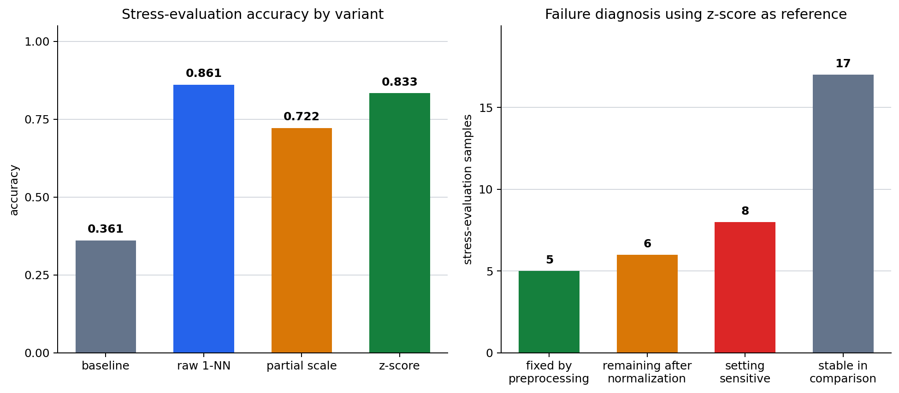

# P7-2.3 Comparison-Experiment Practice

> Section ID: `P7-2.3`
> Version: `v2026.08.01`

Record `experiment_variant`, `preprocessing_change`, `baseline_gap`, `fixed_error`, `new_error`, and `next_boundary_case`. Comparing several variants makes it possible to distinguish a preprocessing problem from a missing data-boundary problem.

## Separate failures before choosing a winner

Compare baseline, raw 1-NN, partial scaling, and z-score normalization on the same evaluation rows. A failure fixed after preprocessing points to scale, encoding, or missing-value handling. A failure that remains after normalization points to a need for more boundary cases or more useful features. Predictions that disagree across settings are ambiguous boundary cases.

The point is not to declare the highest score “best.” It is to narrow the kind of failure and choose the next action.

## Learning questions and criteria

- Which evidence shows that a failure is fixed by a representation change rather than by a new data row?
- Which failures remain after z-score normalization and therefore need boundary evidence or another feature?
- Why can the highest aggregate score coexist with setting-sensitive cases?

You have completed the practice when you can identify the fixed evaluation rows, run all variants on the same stress rows, and propose one next experiment that changes either preprocessing, data coverage, or feature design—but not all three at once.

| Failure type | Typical signal | Next action |
| --- | --- | --- |
| Preprocessing problem | Raw is wrong; normalized prediction is correct | Recheck scale, encoding, and missing-value handling. |
| Missing boundary data | Raw and normalized predictions are both wrong | Collect boundary cases and reconsider features. |
| Ambiguous boundary case | Settings disagree | Ask whether present features are sufficient. |

Use [`p7-2-churn-dataset.csv`](../../../assets/part-07/chapter-02/p7-2-churn-dataset.csv){ .csv-preview } for training and basic evaluation and [`p7-2-stress-test.csv`](../../../assets/part-07/chapter-02/p7-2-stress-test.csv){ .csv-preview } for additional failure-reading cases. A basic row is one subscription customer record; a stress row is an extra evaluation case for interpreting boundaries.

The flow makes the diagnostic decision explicit. It does not treat all disagreements as evidence against the model; it routes each observed transition toward a more specific question.

```mermaid
--8<-- "assets/part-07/chapter-02/p7-2-3-preprocessing-case-flow-en.mmd"
```

```mermaid
--8<-- "assets/part-07/chapter-02/p7-2-3-experiment-compare-flow-en.mmd"
```

## Record the comparison

1. Evaluate baseline, raw 1-NN, partial scaling, and z-score 1-NN on the same rows.
2. Label each notable row as fixed by preprocessing, still remaining, or ambiguous.
3. Write whether the next change is preprocessing or boundary-data collection.

The original Korean practice code and chart asset produce the experiment table. The English manuscript preserves its learning decision: `stress-01` is an example of a failure solved by preprocessing, `stress-02` remains after normalization and needs boundary evidence, and `stress-03` is sensitive to scale treatment and needs closer inspection.

Run the following code from the repository root to reproduce the four variants.

```python
import csv
from pathlib import Path
import numpy as np

train_path = Path("docs/assets/part-07/chapter-02/p7-2-churn-dataset.csv")
stress_path = Path("docs/assets/part-07/chapter-02/p7-2-stress-test.csv")
train_rows = list(csv.DictReader(train_path.open(encoding="utf-8")))
stress_rows = list(csv.DictReader(stress_path.open(encoding="utf-8")))
for row in train_rows + stress_rows:
    for column in ("unresolved_tickets", "days_since_login", "usage_minutes_30d", "label"):
        row[column] = int(row[column])
train_only = [row for row in train_rows if row["split"] == "train"]

def matrix(selected):
    return np.array([[row["unresolved_tickets"], row["days_since_login"], row["usage_minutes_30d"]] for row in selected], dtype=float)
def predict_1nn(train_x, train_y, test_x):
    predictions, nearest_ids = [], []
    for values in test_x:
        nearest_index = int(np.argmin(np.linalg.norm(train_x - values, axis=1)))
        predictions.append(int(train_y[nearest_index])); nearest_ids.append(train_only[nearest_index]["sample_id"])
    return np.array(predictions), nearest_ids

X_train, X_stress = matrix(train_only), matrix(stress_rows)
y_train = np.array([row["label"] for row in train_only]); y_stress = np.array([row["label"] for row in stress_rows])
baseline_label = int(np.bincount(y_train).argmax()); baseline = np.full(len(y_stress), baseline_label)
raw, raw_nearest = predict_1nn(X_train, y_train, X_stress)
partial_train, partial_stress = X_train.copy(), X_stress.copy()
partial_train[:, 2] /= 60; partial_stress[:, 2] /= 60
partial, partial_nearest = predict_1nn(partial_train, y_train, partial_stress)
mean, standard_deviation = X_train.mean(axis=0), X_train.std(axis=0)
if np.any(standard_deviation == 0): raise ValueError("A zero-standard-deviation feature cannot be z-score normalized.")
zscore, z_nearest = predict_1nn((X_train - mean) / standard_deviation, y_train, (X_stress - mean) / standard_deviation)

records = []
for row, base, raw_prediction, partial_prediction, z_prediction, raw_id, z_id in zip(stress_rows, baseline, raw, partial, zscore, raw_nearest, z_nearest):
    if raw_prediction != row["label"] and z_prediction == row["label"]: diagnosis = "fixed by preprocessing"
    elif z_prediction != row["label"]: diagnosis = "remaining boundary case after normalization"
    elif len({int(raw_prediction), int(partial_prediction), int(z_prediction)}) > 1: diagnosis = "setting-sensitive boundary case"
    else: diagnosis = "stable in current comparison"
    records.append({"sample": row["sample_id"], "actual": row["label"], "baseline": int(base), "raw": int(raw_prediction), "partial": int(partial_prediction), "zscore": int(z_prediction), "raw_nearest": raw_id, "z_nearest": z_id, "diagnosis": diagnosis})

print({"baseline": round(float((baseline == y_stress).mean()), 3), "raw": round(float((raw == y_stress).mean()), 3), "partial": round(float((partial == y_stress).mean()), 3), "zscore": round(float((zscore == y_stress).mean()), 3)})
for record in records:
    if record["sample"] in {"stress-01", "stress-02", "stress-03", "stress-04"}: print(record)
```

## Interpret the comparison

| Observation | Interpretation | Next question |
| --- | --- | --- |
| A row changes from wrong to correct after normalization | Feature scale had distorted the raw distance. | Is scaling consistently applied in the evaluation pipeline? |
| A row remains wrong under normalized features | Current data or features do not separate the boundary well. | Which boundary cases or feature should be collected? |
| A row changes direction across variants | The present representation may be unstable. | Is the label, feature, or neighborhood definition adequate? |

Small synthetic experiments do not establish production performance. Their value is to turn a score into a concrete next data request or preprocessing check.

## Stress-evaluation results and failure diagnoses

The shared stress evaluation makes four variants visible at once.

```text
comparison summary = {
  'baseline accuracy': 0.361,
  'raw 1-NN accuracy': 0.861,
  'partial-scale 1-NN accuracy': 0.722,
  'z-score 1-NN accuracy': 0.833,
  'fixed by preprocessing': ['stress-01', 'stress-05', 'stress-13', 'stress-21', 'stress-29'],
  'remaining after normalization': ['stress-02', 'stress-03', 'stress-06', 'stress-14', 'stress-22', 'stress-30']
}
```

Raw 1-NN has the highest accuracy on this stress set. That does not make raw distance the universal choice: five rows are recovered by preprocessing, six remain after normalization, and eight rows vary by setting. The score and the failure diagnosis answer different questions.

The English chart presents these two layers together: the left panel is the four-variant score table; the right panel is the z-score-reference diagnosis distribution.



| Sample | What happens | Appropriate next action |
| --- | --- | --- |
| stress-01 | Raw distance chooses retained; scaling and z-score recover churn risk. | Recheck scale and preprocessing. |
| stress-02 | Raw is correct but normalized variants become wrong. | Do not claim normalization resolves every boundary case. |
| stress-03 | Raw is correct but scale-adjusted variants become wrong. | Reconsider whether the present features separate retained cases. |
| stress-04 | Most variants classify it as churn risk. | Keep it as a stable reference case. |

Read the result in this order.

1. **Fact:** raw 1-NN has the highest stress-evaluation accuracy here.
2. **Failure diagnosis:** normalization still leaves boundary cases and setting-sensitive rows.
3. **Next action:** preserve preprocessing checks for recovered rows; collect similar customers or new features for remaining and unstable rows.

The conclusion is not “always use z-score” or “always use raw distance.” It is “identify what kind of failure the present row represents.”

## Read the 36-row stress result in layers

The stress set deliberately creates cases beyond the basic six-row evaluation. Its purpose is diagnostic coverage, not a new production score. Keep the following layers distinct.

| Layer | Current result | What it supports |
| --- | --- | --- |
| Aggregate score | Raw `0.861`, partial `0.722`, z-score `0.833` | Raw distance is highest on this particular stress set. |
| Preprocessing recovery | Five rows are raw-wrong and z-score-correct | Scale is a plausible source of those raw failures. |
| Remaining boundary | Six rows are wrong after z-score | Current features or available examples do not separate them sufficiently. |
| Setting sensitivity | Eight rows differ across raw, partial, and z-score | The boundary deserves closer inspection rather than a simple winner label. |

The aggregate and the diagnosis can point in different directions without contradiction. Raw distance has the largest score here, while some particular rows are made correct only by preprocessing. A responsible record preserves both facts.

### Four representative stress rows

| Row | Variant pattern | Diagnosis | First next action |
| --- | --- | --- |
| stress-01 | Raw retained; partial and z-score churn risk | Fixed by preprocessing | Check that scale treatment is repeatable. |
| stress-02 | Raw correct; adjusted variants wrong | Remaining after normalization | Collect nearby churn-risk boundary examples. |
| stress-03 | Raw correct; scale-adjusted variants wrong | Setting-sensitive retained boundary | Check feature sufficiency and labels. |
| stress-04 | Most variants identify churn risk | Stable reference | Preserve as a regression example. |

Do not call stress-02 or stress-03 “noise” merely because their settings disagree. The disagreement is evidence that the current representation does not make the needed separation robustly.

## Convert a diagnosis into a next data request

| Diagnosis | Do first | Keep fixed | Evidence to collect |
| --- | --- | --- | --- |
| Fixed by preprocessing | Document the selected scale rule | Labels, stress rows, and 1-NN rule | Similar rows under another split. |
| Remaining boundary | Add cases near the unresolved region | Existing preprocessing variant | Neighbor IDs and a new feature hypothesis. |
| Setting-sensitive | Inspect values and label definition | The stress row itself | Whether a small scale change reverses the result. |
| Stable reference | Retain in regression set | Row and expected label | Whether later changes preserve it. |

This is why “collect more data” is too vague. A good next-data request identifies the feature region, expected label, and failure transition that the new row is intended to test.

## Add a second representation example

The same comparison discipline applies to action-unit sensor records. A raw tracking-error average may identify a one-off spike, while segment features and a baseline gap can identify repeated drift across comparable stages.

| Representation | What it can reveal | What it can miss |
| --- | --- | --- |
| Raw tracking-error mean | Large isolated error spikes | Repeated changes with modest average error. |
| Segment features | Mid-flow decline or late-stage rise | Exact absolute timing. |
| Baseline gap | Departure from usual level | Whether the event is repeatable without more rows. |

For the reused action-unit summary, E009, E011, and E012 are not raw-error flags but are segment-feature and baseline-gap candidates. E010 is a raw-error spike without the repeated segment signal. The appropriate action is different: reproduce E010, but investigate whether the repeated drift candidates share an upstream condition.

### Choose a comparison axis before aggregating

| Axis | Useful when | Risk |
| --- | --- | --- |
| Absolute time | Actual seconds are the operational question | Different action stages can be mixed when durations differ. |
| Progress axis | Equivalent stages should be compared | Actual duration differences can be hidden. |

This is another representation choice, not another classifier choice. Write which axis matches the project question before reporting an average across actions.

## Independent experiments to try

1. Add two training rows near stress-02 while leaving scale rules unchanged.
   - Determine whether data coverage resolves the remaining boundary more directly than normalization.
2. Replace usage minutes with a stated behavioral feature such as session count.
   - Check whether stress-03 becomes stable across variants.
3. Change the partial-scale divisor from `60` to `30` and `120`.
   - Record every row whose diagnosis changes; do not keep only the best accuracy.
4. Compare unequal actions using five-second bins and 25-percent progress bins.
   - State which axis answers the question and which information it discards.

Each is a separate experiment. Combining a new feature, new training rows, and a scale change would prevent a later reviewer from locating the source of a recovered or regressed result.

## Project comparison log

```text
training data version and fixed stress rows:
variant definitions and feature scales:
aggregate result for each variant:
fixed-by-preprocessing rows:
remaining-after-normalization rows:
setting-sensitive rows:
stable regression rows:
interpretation limited to the current comparison:
one next boundary row, feature, or preprocessing test:
```

The log makes a future score table interpretable. It also makes it possible to notice when a new variant improves a total score by trading one boundary failure for another.

## Final learning check

- Did every variant use the same training and stress evaluation rows?
- Can you name a preprocessing recovery, a remaining boundary case, and a setting-sensitive case?
- Did you distinguish the highest aggregate score from the best diagnosis for one row?
- Did the next experiment change only one of scale, data coverage, feature choice, or comparison axis?
- Does the conclusion avoid claiming that any one representation is universally safest?

## Keep score selection separate from action selection

A team may still need to select one variant for a constrained pilot. That selection should be documented separately from the failure diagnosis.

| Decision | Required evidence | Example wording |
| --- | --- | --- |
| Choose a variant for a pilot | Fixed data version, expected error cost, and regression rows | “Use raw distance for this pilot while preserving stress-01 as a scale review case.” |
| Change preprocessing | Recovered rows and absence of unacceptable regression | “Test z-score on the next split because it recovers named scale-sensitive rows.” |
| Request data | Remaining boundary IDs and target region | “Collect churn-risk customers near the stress-02 feature region.” |
| Request a feature | A failure pattern the current inputs cannot separate | “Evaluate payment-failure count for setting-sensitive retained cases.” |

The highest score can inform a pilot decision. It cannot erase the list of diagnostics that made other variants useful. In particular, a raw-distance choice should retain tests that would expose scale dominance in the next data slice.

### A safe comparison sentence

> On the fixed 36-row synthetic stress set, raw 1-NN has the highest displayed accuracy, 0.861. Z-score preprocessing recovers five raw failures but leaves six boundary cases and the settings disagree on eight rows. The next iteration will retain all variants, collect cases near the unresolved boundaries, and test one stated feature change before selecting a general rule.

This sentence contains an aggregate fact, a sample-level diagnosis, and a bounded next action. It does not claim that raw or z-score is universally correct.

## Inspect the source of a disagreement

When variants disagree, inspect four pieces of evidence before changing labels or features:

1. The raw feature values and units for the stress row.
2. The nearest training IDs under each representation.
3. The expected label and the label guideline used for that row.
4. The exact transformation, including any divisor or training-derived statistic.

The first two identify how the geometry changed. The third prevents a disputed business rule from being mistaken for a model issue. The fourth makes the run reproducible. If any field is missing, classify the row as “needs review” rather than as proof that a representation is defective.

### Boundary-data request example

For a row like stress-02, a useful request is not “collect more churn data.” A more useful request is: “Collect both retained and churn-risk customers with similar ticket count, inactive days, and usage minutes to stress-02; retain payment outcome and recent session count if available.” This request names the region and the potential separating information.

For a setting-sensitive retained row like stress-03, collect nearby retained cases as well. Gathering only one label can make a nearest-neighbor boundary look artificially clear.

## What remains outside this practice

The exercise does not estimate uncertainty across many random splits, choose a production decision threshold, or compare families of models. It also does not establish that the three provided features are ethically or operationally appropriate for a retention decision. Those questions require a broader data, governance, and evaluation process.

Its narrower value is to practice a reusable sequence:

```text
fixed comparison rows → multiple stated representations → per-row transitions
→ failure diagnosis → one next preprocessing, data, feature, or axis question
```

Use this sequence before increasing model complexity. A larger model can still be evaluated through the same fixed rows, transitions, limits, and next-question record.

## Reviewer checklist

| Review prompt | Evidence to locate |
| --- | --- |
| Was the evaluation set held fixed? | Dataset paths and stress-row IDs. |
| Were all variants defined? | Raw, partial scale, and z-score rules. |
| Was a recovery shown? | A named raw-wrong, z-score-correct row. |
| Was a remaining failure shown? | A named z-score-wrong row. |
| Was disagreement shown? | A row whose predictions vary by setting. |
| Is the next action falsifiable? | One data, feature, scale, or axis change. |
| Is the claim bounded? | Acknowledgment of the synthetic stress set. |

If a comparison omits one of these fields, add it before naming a winner. The missing field is usually the information needed to tell a promising score from a reliable project decision.

## A practical experiment sequence

Use the results in this order rather than tuning every setting at once.

1. **Reproduce the default run.** Verify the four accuracies and the named representative stress rows.
2. **Choose one diagnosis.** Select either a preprocessing recovery, a remaining boundary, or a setting-sensitive row.
3. **State one intervention.** Change one divisor, add one documented training region, or add one feature definition.
4. **Keep the original stress rows.** They are the regression evidence for the new run.
5. **Compare transitions, not only the new score.** List recoveries, regressions, and unchanged unresolved rows.
6. **Update the next question.** If a boundary remains, request more specific data instead of repeating the same scale change.

This sequence is slow enough to be explainable and fast enough to guide a small project. It replaces “try another model” with an experiment whose result can rule out at least one hypothesis.

### Example next-iteration log

```text
iteration: stress comparison, feature-scale review
unchanged evidence: 12 training rows and the 36 named stress rows
observed issue: stress-01 recovered by scaling; stress-02 remains unresolved
intervention: add a documented pair of retained/churn rows near stress-02
regression rows to retain: stress-01, stress-02, stress-03, stress-04
result fields: per-variant accuracy, neighbor ID, prediction transition, diagnosis
decision boundary: do not choose a new default until regressions are reviewed
```

The log records what was deliberately held fixed as well as what changed. That is what lets a future reader distinguish an experiment from an accumulation of untraceable improvements.

### Final reminder

The goal is not to make every row agree across every setting. Some disagreement is valuable because it identifies where current data, features, or evaluation rules are too weak to support a confident decision. Preserve that disagreement as a target for the next comparison.

Keep the variant definitions with every score table.
Keep the fixed stress-row IDs with every diagnosis.
Keep raw and transformed feature units visible to reviewers.
Keep a recovered row and a regression-risk row in the next test set.
Keep a remaining boundary case open until new evidence changes it.
Keep comparison-axis choices explicit for sensor summaries.
Keep the selected pilot rule separate from the diagnostic evidence.
Keep the conclusion limited to the documented synthetic comparison.

## A comparison record for the next iteration

| Field | What to record |
| --- | --- |
| Variants | Baseline, raw, partial scale, and z-score that were run. |
| Fixed error | Which row became correct after a representation change. |
| Remaining error | Which row stays wrong after normalization. |
| Interpretation | Whether the signal points first to preprocessing or boundary data. |
| Next question | Which similar case or feature should be added. |

For example: stress-01 is misread as retained under raw distance, but becomes churn risk after scaling. Stress-02 and stress-03 change in different directions by variant, showing that normalization is not automatically safer for every boundary. The next iteration should collect boundary-region customer cases and consider a feature such as payment-failure count, rather than only tuning preprocessing further.

## Extend the comparison to action-unit sensor records

The same reasoning applies to the synthetic action-unit summary in [`p7-action-unit-summary.csv`](../../../assets/part-07/chapter-01/p7-action-unit-summary.csv){ .csv-preview }.

| Comparison setting | Decision rule | Failure reading |
| --- | --- | --- |
| Raw tracking errors only | Flag high `tracking_error_mean`. | Sensitive to one-off spikes; can miss repeated drift. |
| Segment features | Use mid-flow decline or late-drop rise. | Makes repeated pattern changes visible. |
| Baseline gap | Compare with baseline averages. | Explains how far a current signal departs from usual level. |

The current example separates one-off event `E010` from repeated segment-structure changes in `E009`, `E011`, and `E012`. The priority is not merely raising the raw-error threshold. It is retaining segment features and baseline gaps together so repeated drift has evidence.

```text
E009: raw flag false, segment flag true, baseline-gap flag true → missed by raw errors but found by segment features
E010: raw flag true, segment flag false, baseline-gap flag false → possible one-off spike; reproduce it
E011: raw flag false, segment flag true, baseline-gap flag true → repeated drift candidate
E012: raw flag false, segment flag true, baseline-gap flag true → repeated drift candidate
```

## Choose an axis before comparing actions

| Axis | What it reveals | What it can hide |
| --- | --- | --- |
| Absolute time | At what second a signal changed | Equivalent stages of short and long actions can mix. |
| Progress axis | Whether the same action stage changed | Actual duration differences can be hidden. |

This is not a request for another model. It is a representation choice: decide whether the present question concerns elapsed seconds or comparable action stages before aggregating the sensor records.

## Try changes directly

1. Add two training cases similar to stress-02; determine whether data coverage helps more directly than normalization.
2. Replace usage minutes with another behavioral feature such as average session count; determine whether stress-03 separates more clearly.
3. Change the partial scale divisor from 60 to 30 and 120; record how sensitive the variant is.
4. Compare unequal actions by five-second windows and by 25% progress windows; state which axis fits the question.

The decision criterion is not the highest score alone. A failure removed after preprocessing suggests a scale issue; a failure surviving every setting suggests that data boundaries or the question definition need review.

## Checklist

| Check | Question to answer |
| --- | --- |
| Fixed evaluation set | Did every variant use the same rows? |
| Fixed failure | Which row was recovered by preprocessing? |
| Remaining failure | Which row needs more boundary evidence? |
| New error | Did a variant create a newly wrong row? |
| Next boundary case | What case or feature should be collected next? |

## Sources and references

The customer and stress records are synthetic practice data created for this book.
