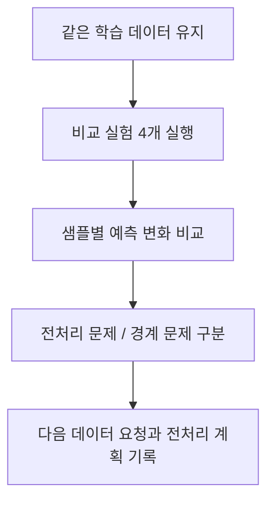

# P7-2.3 비교 실험 연습

> Section ID: `P7-2.3`
> Version: `v2026.07.18`

P7-2.1에서는 baseline과 raw 1-NN을 나란히 두었고, P7-2.2에서는 정규화가 실제 예측 경로를 바꾸는 장면을 확인했습니다. 이제 한 걸음 더 가서, `비교 실험을 여러 개 한 줄로 붙여 놓았을 때 무엇이 전처리 문제이고 무엇이 데이터 경계 문제인가`를 직접 구분해 볼 차례입니다.

이번 절은 새 모델 이론을 늘리는 자리가 아니라, 같은 학습 데이터 위에서 여러 비교 실험을 한 번에 읽는 연습 절입니다. 핵심은 `정확도 한 줄`이 아니라 `어떤 샘플은 전처리로 해결되고 어떤 샘플은 여전히 남는가`를 손으로 분리하는 데 있습니다.

## 이 절의 범위

- baseline, raw 1-NN, 부분 스케일 조정, z-score 정규화를 한 화면에서 어떻게 비교할까?
- 어떤 실패는 전처리(preprocessing) 문제이고 어떤 실패는 더 많은 경계 사례나 특징이 필요한 문제인가?
- 실험 결과를 `사실 -> 해석 -> 다음 질문`으로 어떻게 다시 묶을까?

이 절에서는 `여러 비교 실험을 같은 평가 셋에서 나란히 읽는 감각`에만 집중합니다. 즉, 여기서는 더 복잡한 모델로 넘어가지 않고 `현재 실패가 어느 종류인가`를 구분하는 데서 닫습니다. 이후 구조 선택과 학습 결과 해석은 P7-3, P7-4에서 다시 이어집니다.

## 이 절의 목표

- 여러 실험 설정을 같은 평가 셋에서 나란히 비교할 수 있습니다.
- `전처리로 해결된 실패`와 `여전히 남는 경계 실패`를 구분해 적을 수 있습니다.
- 비교 실험 뒤에 무엇을 더 모으고 무엇을 더 전처리할지 판단할 수 있습니다.

## 왜 비교 실험 연습이 필요한가

P7-2.2까지 읽으면 보통 `정규화하면 좋아진다`는 인상을 받기 쉽습니다. 하지만 실제 프로젝트에서는 그 다음 질문이 더 중요합니다.

- 좋아진 것은 어떤 샘플인가?
- 좋아지지 않은 샘플은 왜 남는가?
- 전처리를 더 하면 되는가, 아니면 학습 데이터 경계가 비어 있는가?

이 차이를 먼저 표로 고정하면 다음과 같습니다.

| 실패 유형 | 흔한 신호 | 다음 행동 |
| --- | --- | --- |
| 전처리 문제 | raw는 틀리고 정규화 후 맞음 | 스케일, 인코딩, 누락값 처리 다시 보기 |
| 경계 데이터 부족 | raw도 틀리고 정규화 후도 틀림 | 더 많은 경계 사례 수집, 특징 보강 검토 |
| 애매한 경계 사례 | 설정마다 예측이 서로 엇갈림 | 현재 특징만으로 충분한지 다시 보기 |

즉, 비교 실험의 목적은 `이 설정이 최고다`를 선언하는 것이 아니라 `실패의 종류를 좁히는 것`입니다.

## 입력 파일

- 학습/기본 평가 파일: [`p7-2-churn-dataset.csv`](../../../assets/part-07/chapter-02/p7-2-churn-dataset.csv)
- 추가 스트레스 평가 파일: [`p7-2-stress-test.csv`](../../../assets/part-07/chapter-02/p7-2-stress-test.csv)
- 기본 파일의 한 행 의미: `한 명의 구독 고객 기록`
- 스트레스 파일의 한 행 의미: `경계와 실패 해석을 확인하기 위한 추가 평가 사례`

이번 절은 앞 절과 같은 학습 데이터는 그대로 두고, 추가 평가 사례만 별도 CSV로 붙입니다. 이렇게 하면 `학습 데이터는 그대로인데 비교 실험 결과만 어떻게 달라지는가`를 더 또렷하게 읽을 수 있습니다.

## 연습 흐름



이 흐름에서 중요한 점은 `가장 높은 점수`보다 `어느 샘플이 왜 달라졌는가`를 먼저 읽는 것입니다.

## 이 절에서 직접 할 일

1. baseline, raw 1-NN, 부분 스케일 조정 1-NN, 정규화 1-NN을 같은 평가 셋에서 비교합니다.
2. 샘플별로 `전처리로 해결됨`, `여전히 남음`, `경계가 애매함`을 분류합니다.
3. 전처리를 더 할지, 경계 사례를 더 모을지 회고 문장으로 정리합니다.

## Python 예제

이번 예제의 목적은 `비교 실험을 여러 줄로 붙여 놓으면 실패 해석이 어떻게 달라지는가`를 바로 확인하는 것입니다.

- 문제 상황: 어떤 실패는 전처리로 해결되고, 어떤 실패는 데이터 경계 자체가 비어 있어 남는다.
- 입력:
  - 기존 학습 데이터 12건
  - 스트레스 평가 사례 4건
- 비교 설정:
  - baseline
  - raw 1-NN
  - `usage_minutes_30d`만 60으로 나눈 부분 스케일 조정 1-NN
  - z-score 정규화 1-NN
- 기대 출력:
  - 설정별 정확도
  - 샘플별 예측 비교
  - 실패 진단 분류
- 확인할 개념:
  - 전처리 효과는 샘플별 변화로 읽어야 한다
  - 모든 실패가 전처리 문제는 아니다
  - 경계 데이터가 비어 있으면 더 많은 사례나 더 적절한 특징이 필요하다

```python
import csv
import numpy as np
from pathlib import Path

train_path = Path("docs/assets/part-07/chapter-02/p7-2-churn-dataset.csv")
stress_path = Path("docs/assets/part-07/chapter-02/p7-2-stress-test.csv")

train_rows = list(csv.DictReader(train_path.open(encoding="utf-8")))
stress_rows = list(csv.DictReader(stress_path.open(encoding="utf-8")))

for row in train_rows:
    row["unresolved_tickets"] = int(row["unresolved_tickets"])
    row["days_since_login"] = int(row["days_since_login"])
    row["usage_minutes_30d"] = int(row["usage_minutes_30d"])
    row["label"] = int(row["label"])

for row in stress_rows:
    row["unresolved_tickets"] = int(row["unresolved_tickets"])
    row["days_since_login"] = int(row["days_since_login"])
    row["usage_minutes_30d"] = int(row["usage_minutes_30d"])
    row["label"] = int(row["label"])

train_only = [row for row in train_rows if row["split"] == "train"]

def to_matrix(rows):
    return np.array([
        [row["unresolved_tickets"], row["days_since_login"], row["usage_minutes_30d"]]
        for row in rows
    ], dtype=float)

X_train = to_matrix(train_only)
y_train = np.array([row["label"] for row in train_only])
X_test = to_matrix(stress_rows)
y_test = np.array([row["label"] for row in stress_rows])

def predict_1nn(train_x, train_y, test_x):
    predictions = []
    nearest_ids = []
    for x in test_x:
        distances = np.linalg.norm(train_x - x, axis=1)
        nearest_index = int(np.argmin(distances))
        predictions.append(int(train_y[nearest_index]))
        nearest_ids.append(train_only[nearest_index]["sample_id"])
    return np.array(predictions), nearest_ids

baseline_class = int(np.bincount(y_train).argmax())
baseline_pred = np.full(len(y_test), baseline_class, dtype=int)

raw_pred, raw_nearest = predict_1nn(X_train, y_train, X_test)

X_train_scaled = X_train.copy()
X_test_scaled = X_test.copy()
X_train_scaled[:, 2] = X_train_scaled[:, 2] / 60.0
X_test_scaled[:, 2] = X_test_scaled[:, 2] / 60.0
scaled_pred, scaled_nearest = predict_1nn(X_train_scaled, y_train, X_test_scaled)

train_mean = X_train.mean(axis=0)
train_std = X_train.std(axis=0)
X_train_z = (X_train - train_mean) / train_std
X_test_z = (X_test - train_mean) / train_std
z_pred, z_nearest = predict_1nn(X_train_z, y_train, X_test_z)

comparison_rows = []
for i, row in enumerate(stress_rows):
    model_errors = {
        "baseline": int(baseline_pred[i] != y_test[i]),
        "raw_1nn": int(raw_pred[i] != y_test[i]),
        "scaled_1nn": int(scaled_pred[i] != y_test[i]),
        "zscore_1nn": int(z_pred[i] != y_test[i]),
    }

    if model_errors["raw_1nn"] and not model_errors["zscore_1nn"]:
        diagnosis = "전처리로 해결됨"
    elif all(model_errors[name] for name in ["raw_1nn", "scaled_1nn", "zscore_1nn"]):
        diagnosis = "경계 사례 추가 또는 특징 보강 필요"
    elif len({int(raw_pred[i]), int(scaled_pred[i]), int(z_pred[i])}) > 1:
        diagnosis = "설정에 따라 갈리는 경계 사례"
    else:
        diagnosis = "현재 비교 실험에서는 안정적"

    comparison_rows.append({
        "샘플": row["sample_id"],
        "focus": row["focus"],
        "정답": row["label"],
        "baseline": int(baseline_pred[i]),
        "raw_1nn": int(raw_pred[i]),
        "scaled_1nn": int(scaled_pred[i]),
        "zscore_1nn": int(z_pred[i]),
        "raw_nearest": raw_nearest[i],
        "z_nearest": z_nearest[i],
        "failure_diagnosis": diagnosis,
    })

summary = {
    "baseline 정확도": round(float((baseline_pred == y_test).mean()), 3),
    "raw 1-NN 정확도": round(float((raw_pred == y_test).mean()), 3),
    "부분 스케일 조정 1-NN 정확도": round(float((scaled_pred == y_test).mean()), 3),
    "z-score 1-NN 정확도": round(float((z_pred == y_test).mean()), 3),
    "전처리로 해결된 샘플": [
        row["샘플"] for row in comparison_rows if row["failure_diagnosis"] == "전처리로 해결됨"
    ],
    "여전히 남는 샘플": [
        row["샘플"] for row in comparison_rows if row["failure_diagnosis"] == "경계 사례 추가 또는 특징 보강 필요"
    ],
}

print("비교 실험 요약 =", summary)
print("학습 파일 =", str(train_path))
print("스트레스 평가 파일 =", str(stress_path))
print("샘플별 비교 =")
for row in comparison_rows:
    print(row)
```

실행 결과 예시는 다음처럼 읽을 수 있습니다.

```text
비교 실험 요약 = {'baseline 정확도': 0.25, 'raw 1-NN 정확도': 0.5, '부분 스케일 조정 1-NN 정확도': 0.75, 'z-score 1-NN 정확도': 0.75, '전처리로 해결된 샘플': ['stress-01'], '여전히 남는 샘플': ['stress-02']}
학습 파일 = docs/assets/part-07/chapter-02/p7-2-churn-dataset.csv
스트레스 평가 파일 = docs/assets/part-07/chapter-02/p7-2-stress-test.csv
샘플별 비교 =
{'샘플': 'stress-01', 'focus': 'raw 거리에서는 retained 고객과 가까워 보이지만 전처리 후에는 churn 신호가 살아나는 사례', '정답': 1, 'baseline': 0, 'raw_1nn': 0, 'scaled_1nn': 1, 'zscore_1nn': 1, 'raw_nearest': '학습-01', 'z_nearest': '학습-08', 'failure_diagnosis': '전처리로 해결됨'}
{'샘플': 'stress-02', 'focus': '현재 학습 데이터 경계가 비어 있어 전처리만으로는 해결되지 않는 경계 사례', '정답': 1, 'baseline': 0, 'raw_1nn': 0, 'scaled_1nn': 0, 'zscore_1nn': 0, 'raw_nearest': '학습-04', 'z_nearest': '학습-04', 'failure_diagnosis': '경계 사례 추가 또는 특징 보강 필요'}
{'샘플': 'stress-03', 'focus': '질문 수와 미접속 일수는 높지만 실제로는 유지 고객인 애매한 retained 사례', '정답': 0, 'baseline': 0, 'raw_1nn': 0, 'scaled_1nn': 1, 'zscore_1nn': 1, 'raw_nearest': '학습-06', 'z_nearest': '학습-11', 'failure_diagnosis': '설정에 따라 갈리는 경계 사례'}
{'샘플': 'stress-04', 'focus': '대부분의 비교 실험에서 일관되게 churn으로 잡혀야 하는 명확한 사례', '정답': 1, 'baseline': 0, 'raw_1nn': 1, 'scaled_1nn': 1, 'zscore_1nn': 1, 'raw_nearest': '학습-09', 'z_nearest': '학습-09', 'failure_diagnosis': '현재 비교 실험에서는 안정적'}
```

## 결과를 어떻게 읽는가

이번 연습에서 먼저 읽어야 할 것은 `z-score가 제일 높다`가 아니라 `어떤 실패가 왜 남는가`입니다.

| 샘플 | 읽어야 할 점 | 다음 행동 |
| --- | --- | --- |
| `stress-01` | raw 거리에서는 틀렸지만 전처리 후 맞았다 | 스케일과 전처리 점검을 우선한다 |
| `stress-02` | 모든 비교 실험에서 여전히 틀렸다 | 경계 사례 수집이나 특징 보강을 검토한다 |
| `stress-03` | 설정에 따라 retained/churn이 갈린다 | 현재 특징만으로 충분한지 다시 본다 |
| `stress-04` | 대부분의 실험에서 안정적으로 맞는다 | 현재 구조의 기준 사례로 남긴다 |

이 차이를 통해 독자는 두 가지를 잡아야 합니다.

- `전처리로 해결된 실패`는 설정을 더 다듬을 가치가 있다는 신호입니다.
- `여전히 남는 실패`는 데이터 경계나 특징 자체를 다시 봐야 한다는 신호입니다.

즉, 비교 실험의 결론은 `무조건 z-score`가 아니라 `현재 실패가 어느 종류인가`입니다.

## 관찰 포인트

- raw는 틀리고 정규화는 맞는 샘플이 실제로 얼마나 있는가?
- 정규화 뒤에도 틀리는 샘플은 현재 학습 데이터의 어떤 빈 구간을 보여 주는가?
- 설정마다 예측이 엇갈리는 샘플은 왜 애매한가?
- 다음 반복에서 먼저 할 일은 전처리 보강인가, 경계 사례 수집인가?

## 기록 템플릿

실습 뒤에는 다음 형식으로 짧게 기록해 두는 편이 좋습니다.

| 항목 | 적을 내용 |
| --- | --- |
| 비교 설정 | baseline, raw, scaled, z-score 중 무엇을 돌렸는가 |
| 전처리로 해결된 샘플 | 어떤 실패가 설정 변경으로 사라졌는가 |
| 여전히 남는 샘플 | 어떤 실패는 전처리 뒤에도 남는가 |
| 해석 | 전처리 문제인지, 데이터 경계 문제인지 |
| 다음 질문 | 더 모을 사례와 더 바꿀 특징은 무엇인가 |

한 문단으로 쓰면 예를 들어 다음처럼 정리할 수 있습니다.

> `stress-01`은 raw 거리에서는 retained 쪽으로 잘못 붙었지만, 사용 시간 스케일을 줄이거나 z-score 정규화를 적용하자 churn으로 바로잡혔다. 반면 `stress-02`는 모든 비교 실험에서 retained로 남아, 지금 문제는 전처리보다도 `4건 안팎의 문의 수와 10일대 미접속 구간`에 해당하는 churn 사례가 학습 데이터에 거의 없다는 점에 더 가깝다. 따라서 다음 반복에서는 전처리 튜닝만 더 하는 대신 경계 구간 고객 사례를 추가 수집하고, 필요하면 결제 실패 횟수 같은 새 특징도 검토하는 편이 적절하다.

## 직접 더 바꿔 볼 것

1. `stress-02`와 비슷한 churn 사례를 학습 파일에 두 건 더 추가했다고 가정하고 직접 넣어 봅니다.
   관찰할 점: 정규화보다 데이터 보강이 더 직접적으로 듣는가?

2. `usage_minutes_30d`를 `30일 평균 세션 수`처럼 다른 행동 특징으로 바꾼다고 가정해 봅니다.
   관찰할 점: `stress-03` 같은 애매한 retained 사례를 더 잘 분리할 수 있을까?

3. `scaled_1nn`에서 사용 시간 나누기 값을 `60` 대신 `30`, `120`으로 바꿔 봅니다.
   관찰할 점: 부분 스케일 조정은 얼마나 민감하고 왜 z-score보다 해석이 불안정할 수 있는가?

## 체크리스트

- 여러 비교 실험을 같은 평가 셋에서 나란히 실행했는가?
- `전처리로 해결된 실패`와 `여전히 남는 실패`를 구분했는가?
- 점수뿐 아니라 샘플별 실패 진단을 기록했는가?
- 다음 반복의 우선순위를 `전처리`와 `데이터 보강` 중 어디에 둘지 적었는가?
