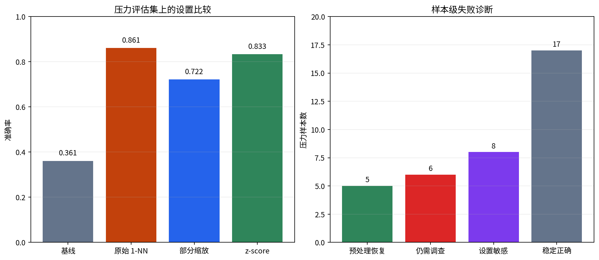

# P7-2.3 比较实验练习

> Section ID: `P7-2.3`
> Version: `v2026.08.01`

比较实验应保留 `experiment_variant`、`preprocessing_change`、`baseline_gap`、`fixed_error`、`new_error` 和 `next_boundary_case`。目的不是宣布哪一个设置最高，而是区分可由预处理解决的失败、仍需边界数据的失败，以及在设置之间不稳定的案例。

## 在同一评估集上分开失败

| 失败类型 | 常见信号 | 下一行动 |
| --- | --- | --- |
| 预处理问题 | raw 错、标准化后对 | 检查尺度、编码、缺失值处理。 |
| 边界数据不足 | raw 与标准化都错 | 收集边界案例或补充特征。 |
| 模糊边界 | 各设置预测彼此不同 | 检查当前特征与标签是否足够。 |

最高准确率不能替代这三类区分。某一设置可能在总分上最好，却仍无法解释特定压力案例为何不稳定或持续错误。

```mermaid
--8<-- "assets/part-07/chapter-02/p7-2-3-preprocessing-case-flow-zh.mmd"
```

## 输入与实验变体

使用训练数据 [`p7-2-churn-dataset.zh.csv`](../../../assets/part-07/chapter-02/p7-2-churn-dataset.zh.csv){ .csv-preview } 和额外压力评估集 [`p7-2-stress-test.zh.csv`](../../../assets/part-07/chapter-02/p7-2-stress-test.zh.csv){ .csv-preview }。压力集不用于拟合；它用于让不同设置的失败模式更清晰。

| 变体 | 改变的组件 | 保持不变的组件 |
| --- | --- | --- |
| baseline | 忽略特征、预测多数标签 | 训练数据和压力评估标签。 |
| raw 1-NN | 原始三列距离 | 同一训练/压力行。 |
| 部分缩放 | 仅将使用分钟除以 60 | 标签、1-NN、评估集。 |
| z-score | 用训练集统计量标准化三列 | 标签、1-NN、评估集。 |

```mermaid
--8<-- "assets/part-07/chapter-02/p7-2-3-experiment-compare-flow-zh.mmd"
```

## 执行四种比较

```python
import csv
from pathlib import Path
import numpy as np

train_rows = list(csv.DictReader(Path("docs/assets/part-07/chapter-02/p7-2-churn-dataset.zh.csv").open(encoding="utf-8")))
stress_rows = list(csv.DictReader(Path("docs/assets/part-07/chapter-02/p7-2-stress-test.zh.csv").open(encoding="utf-8")))
features = ["unresolved_tickets", "days_since_login", "usage_minutes_30d"]
train = [row for row in train_rows if row["split"] == "train"]
def matrix(rows): return np.array([[float(row[name]) for name in features] for row in rows])
X_train, X_test = matrix(train), matrix(stress_rows)
y_train = np.array([int(row["label"]) for row in train])
y_test = np.array([int(row["label"]) for row in stress_rows])
def one_nn(train_x, test_x):
    nearest = ((test_x[:, None, :] - train_x[None, :, :]) ** 2).sum(axis=2).argmin(axis=1)
    return y_train[nearest], nearest

baseline = np.full(len(y_test), int(np.bincount(y_train).argmax()))
raw, raw_nearest = one_nn(X_train, X_test)
partial_train, partial_test = X_train.copy(), X_test.copy()
partial_train[:, 2] /= 60; partial_test[:, 2] /= 60
partial, partial_nearest = one_nn(partial_train, partial_test)
mean, std = X_train.mean(axis=0), X_train.std(axis=0)
scaled, scaled_nearest = one_nn((X_train - mean) / std, (X_test - mean) / std)
for name, prediction in [("baseline", baseline), ("raw", raw), ("partial", partial), ("zscore", scaled)]:
    print(name, "accuracy =", round(float((prediction == y_test).mean()), 3))
for index, row in enumerate(stress_rows):
    print({"sample": row["sample_id"], "actual": int(y_test[index]), "raw": int(raw[index]),
           "partial": int(partial[index]), "zscore": int(scaled[index]),
           "raw_neighbor": train[int(raw_nearest[index])]["sample_id"],
           "zscore_neighbor": train[int(scaled_nearest[index])]["sample_id"]})
```

所有变体使用相同训练记录和 36 条压力评估记录。只有表示组件发生变化，因而每个预测转换可以被阅读为对一个具体设置的回应。

## 如何诊断压力案例

| 样本模式 | 诊断问题 |
| --- | --- |
| raw 错、z-score 对 | 哪个原始单位主导了距离，标准化后哪个邻居改变？ |
| raw 对、z-score 错 | 标准化引入何种回归，是否存在边界案例？ |
| 四种设置都错 | 训练范围、标签或特征是否缺少信息？ |
| raw、部分缩放、z-score 互相不同 | 当前边界是否对表示选择过度敏感？ |

样本诊断是下一行动的起点。它不自动证明某个设置或特征在业务上是根因。

## 回顾模板

```text
固定条件：训练数据、压力评估集、标签、1-NN规则。
实验变体：
准确率：
raw 与 z-score 都正确的参考样本：
预处理恢复的样本：
新错误：
标准化后仍错的边界样本：
有限解释：
下一边界案例：
```

## 学习检查

1. 为什么压力评估案例不能参与训练？
2. 为什么“最高准确率”不足以选择最终设置？
3. 如何区分预处理问题与边界数据不足？
4. 为什么部分缩放是独立的实验变体？
5. 下一次实验中哪些记录必须固定？

## 阅读四种设置的分数

当前压力评估集有 36 条记录。多数标签基线为 `0.361`，raw 1-NN 为 `0.861`，只缩放使用分钟的部分缩放为 `0.722`，z-score 为 `0.833`。raw 的总分最高，但这不是结束诊断的理由。

| 设置 | 准确率 | 首先应阅读什么 |
| --- | ---: | --- |
| baseline | 0.361 | 不使用特征时漏掉哪些风险案例。 |
| raw 1-NN | 0.861 | 高分由哪些恢复与遗漏构成。 |
| 部分缩放 | 0.722 | 单独修改使用时长单位会产生哪些新错误。 |
| z-score | 0.833 | 全列标准化恢复或破坏哪些案例。 |

分数说明固定评估集上的聚合结果；样本转换说明下一行动。一个设置可以在总分上领先，却在一个重要边界样本上不稳定。



## 将压力案例分成三类

| 类别 | 判断条件 | 当前例子 | 下一行动 |
| --- | --- | --- |
| 预处理可恢复 | raw 错而部分缩放或 z-score 对 | `stress-01`、`stress-05` | 记录表示改变和最近邻转换。 |
| 标准化后仍需调查 | 目标设置仍错 | `stress-02`、`stress-03` 等 | 查找边界数据、标签或特征缺口。 |
| 设置敏感 | raw、部分缩放和 z-score 预测不同 | `stress-02`、`stress-03`、`stress-06` | 检查距离、单位与当前边界。 |

这些类别可以重叠。例如一行既可能在某设置下恢复，也可能在另一设置下成为新错误。分类不是给样本贴永久标签，而是说明本次比较打开了什么问题。

### 预处理恢复案例

`stress-01` 和 `stress-05` 的实际标签为风险。raw 1-NN 预测为保留；部分缩放与 z-score 都把它们改为风险，并把最近训练邻居从 `学习-02` 改为 `学习-08`。这是表示影响距离选择的直接证据。

| 样本 | 实际 | raw | 部分缩放 | z-score | raw 邻居 | z-score 邻居 |
| --- | ---: | ---: | ---: | ---: | --- | --- |
| stress-01 | 1 | 0 | 1 | 1 | 学习-02 | 学习-08 |
| stress-05 | 1 | 0 | 1 | 1 | 学习-02 | 学习-08 |

安全的解释是：“在当前训练与压力记录中，缩放改变了这两行的最近邻并恢复了预测。”不安全的解释是：“使用分钟是流失原因”或“任何标准化都会恢复相同客户”。

### 不稳定或仍错的案例

| 样本 | 实际 | raw | 部分缩放 | z-score | 应提出的问题 |
| --- | ---: | ---: | ---: | ---: | --- |
| stress-02 | 1 | 1 | 0 | 0 | 为什么缩放后从风险变为保留？边界训练例是否不足？ |
| stress-03 | 0 | 0 | 1 | 1 | 当前特征是否把正常客户拉向高风险邻居？ |
| stress-06 | 1 | 1 | 1 | 0 | 全列标准化为何改变该邻居？ |
| 其他仍错行 | 见完整输出 | 见完整输出 | 见完整输出 | 是否需要标注的边界数据或新特征？ |

这些行不能简单归入“标准化失败”。它们提示项目应检查训练范围、标签规则和距离表示，而不是重复同一预处理操作。

## 记录错误转换而不是只记录排名

每个实验变体都应与一个明确参照比较。下面的字段让结果可以复查。

```text
experiment_variant:
preprocessing_change:
fixed_train_data:
fixed_stress_evaluation:
baseline_gap:
recovered_ids:
fixed_error_ids:
new_error_ids:
unstable_ids:
nearest_neighbor_change:
limited_interpretation:
next_boundary_case:
```

`fixed_error_ids` 指在一个变体中仍未解决的样本；`new_error_ids` 指相对参照设置由对变错的样本。不要把两者合并，否则无法知道表示是没有帮助，还是带来了新损害。

## 用相同参照阅读部分缩放与 z-score

部分缩放和 z-score 都是表示实验，但它们回答不同问题。部分缩放只减少使用分钟的数值量级；z-score 用训练分布分别转换全部三列。

| 比较 | 改变 | 可以检验 | 不能证明 |
| --- | --- | --- | --- |
| raw → 部分缩放 | 使用分钟除以60 | 该列单位是否改变邻居选择 | 60 是唯一正确权重。 |
| raw → z-score | 所有列用训练统计量标准化 | 原始量纲是否扭曲距离 | 所有特征业务上同等重要。 |
| 部分缩放 → z-score | 缩放规则范围 | 哪些案例对表示细节敏感 | 一个设置对所有时间稳定。 |

当部分缩放从 raw 的 `0.861` 降到 `0.722`，不应直接说“缩放有害”。应列出它修复和破坏的 ID，检查它是否只调整了一个实际上需要与其他特征共同处理的单位问题。

## 失败诊断的决策顺序

1. 固定训练数据、压力评估、标签和基线。
2. 运行各变体并保存完整预测，不只保存准确率。
3. 找出 raw 错、变体对的恢复样本。
4. 找出 raw 对、变体错的新错误。
5. 找出所有设置都错的未解决边界样本。
6. 找出设置间反复翻转的敏感样本。
7. 为每类样本写一个数据、表示或标签问题。
8. 选择只改变一个组件的下一实验。

顺序先从可观察的转换开始，再提出原因假设。它避免了从“z-score较低”跳到“标准化不该使用”这类过度结论。

## 边界数据问题

若一个压力案例在合理的表示变化后仍错误，下一步可能不是增加更多相同的普通训练行，而是定义缺少的边界案例。

| 观察 | 可能缺少的内容 | 需要写明 |
| --- | --- | --- |
| 高风险但高使用量 | 与普通高使用客户相邻的风险案例 | 标签依据、时间窗口和特征范围。 |
| 正常但工单较多 | 不应被高工单数单独推向风险的案例 | 业务背景和反例。 |
| 未登录天数接近边界 | 相邻天数的两类客户 | 观察时间和标签政策。 |
| 多设置预测翻转 | 当前特征无法稳定区分的区域 | 需要新特征还是人工审查。 |

添加数据前先说明边界。否则“更多数据”只是数量请求，无法检验它是否填补了当前失败的条件。

## 传感器行动单元的比较扩展

同样的比较逻辑可以应用到传感器动作日志。固定相同的行动单元评估案例，比较原始时间、相对进度或归一化表示；再把变化分为表示恢复、持续异常和设置敏感案例。

| 传感器实验 | 固定内容 | 改变内容 | 需要记录 |
| --- | --- | --- | --- |
| 原始时间轴 | 行动单元与标签 | 绝对时间读数 | 早晚阶段、错误单元。 |
| 进度轴 | 相同单元与标签 | 按动作进度对齐 | 被恢复或新异常单元。 |
| 归一化读数 | 同一传感器范围 | 缩放规则 | 均值、标准差、边界单元。 |

无论是客户表还是传感器曲线，比较实验都需要相同的三件事：固定参照、单一改变和样本级错误记录。

## 回顾示例

> 在固定的 12 条训练记录和 36 条压力评估记录上，raw 1-NN 的准确率最高，但 `stress-01` 与 `stress-05` 只有在部分缩放和 z-score 下才被恢复。`stress-02`、`stress-03` 与 `stress-06` 对表示选择敏感，其中部分或全部标准化会引入错误。该结果支持“部分失败来自距离尺度”的有限解释，也表明仍需定义高使用量、工单和未登录天数交界处的训练边界案例。下一次实验将固定压力案例，只补充一个明确标注的边界数据组并报告所有回归。

回顾没有把 raw 的最高分写成最终选择，也没有把每个错误归为预处理问题。

## 用错误集合比较实验，而非只比较分数

为每个变体保存错误 ID 集合。然后与参照变体比较新增、恢复和持续错误。

```text
参照设置：raw 1-NN。
比较设置：部分缩放或 z-score。
恢复：参照错误、比较正确的 ID。
新错误：参照正确、比较错误的 ID。
持续错误：两种设置都错误的 ID。
稳定正确：两种设置都正确的 ID。
敏感案例：多个设置给出不一致预测的 ID。
```

| 错误集合关系 | 对项目意味着什么 |
| --- | --- |
| 恢复多于新错误 | 表示可能改善当前参照，但仍需查看具体代价。 |
| 新错误出现 | 改变有回归，不能只报告准确率。 |
| 持续错误集中 | 可能需要新的边界数据、标签复核或特征。 |
| 敏感案例集中 | 当前表示选择对决策影响很大，应增加审查。 |

错误集合可用于任何模型，不限于 1-NN。它把“分数变化”转换为可以在下一次运行中重新检验的案例清单。

### 不同参照会改变“新错误”的含义

| 比较对象 | “新错误”指什么 |
| --- | --- |
| baseline → raw | 基线正确而 raw 错的样本。 |
| raw → 部分缩放 | raw 正确而部分缩放错的样本。 |
| raw → z-score | raw 正确而 z-score 错的样本。 |
| z-score → 新模型 | z-score 正确而新模型错的样本。 |

因此报告必须写出参照设置。离开参照，“恢复”与“新错误”没有稳定含义。

## 如何选择下一次实验

| 当前证据 | 首先测试 | 保持固定 | 预期观察 |
| --- | --- | --- | --- |
| raw 错、z-score 对 | 表示缩放规则 | 数据、标签、压力案例、1-NN | 是否在相同 ID 上恢复。 |
| 多种缩放都错 | 新的边界训练案例 | 压力案例与报告字段 | 持续错误是否减少且无回归。 |
| 设置间频繁翻转 | 特征定义或标签政策 | 当前案例与审查规则 | 翻转是否可由明确边界解释。 |
| 高分但有重要新错误 | 操作阈值或人工审查路径 | 存储的预测与标签 | 是否减少高成本错误。 |
| 每种设置都稳定错误 | 数据来源与标签审核 | 样本 ID 与时间窗口 | 是否存在错误标签或缺失输入。 |

选择实验的依据应是当前错误类型，而不是“下一步总是更复杂的模型”。如果简单缩放已经恢复一个错误，先验证它的范围；如果所有表示都错，先定义缺少的边界证据。

## 边界案例的收集计划

边界案例应根据持续错误或敏感案例来定义，而不只是从总体数据中随机增加更多行。

| 边界组 | 标签 | 收集理由 | 保留的对照 |
| --- | ---: | --- | --- |
| 高使用量且有流失风险 | 1 | 检查使用量是否掩盖风险信号。 | 高使用量保留客户。 |
| 工单较多但保持稳定 | 0 | 防止工单数成为简单捷径。 | 高工单风险客户。 |
| 未登录天数接近阈值 | 0 与 1 | 检查天数边界是否真的可分。 | 相邻天数的同类记录。 |
| 多设置翻转的组合 | 按验证标签 | 让表示选择接受压力测试。 | 当前压力案例。 |

每个新增组都需要来源、观察时间、标签依据和特征定义。否则后续“恢复”可能只是改变了任务或标签规则。

### 数据增加后必须检查的事

1. 原始 36 条压力评估记录是否仍作为固定参考？
2. 新训练案例是否只放入训练集，而没有混入评估？
3. 新组是否同时包含正例和相近反例？
4. 标签规则是否在添加前后保持一致？
5. 哪些旧错误恢复，哪些旧正确变错？
6. 是否出现新的设置敏感样本？

增加数据不是对模型的奖励，而是一个需要同样严格比较条件的实验改变。

## 传感器的绝对时间轴与进度轴

传感器行动单元常可用两种坐标比较：绝对时间轴保留真实发生时间；进度轴把不同长度的动作按完成比例对齐。两者会突出不同失败。

| 坐标选择 | 擅长回答的问题 | 可能遮蔽的内容 |
| --- | --- | --- |
| 绝对时间轴 | 某时刻是否发生延迟、漂移或事件？ | 不同动作长度造成的位置错位。 |
| 进度轴 | 同一动作阶段是否具有相似模式？ | 真实时间延迟和停顿。 |
| 原始幅值 | 设备的绝对读数是否异常？ | 设备间量纲差异。 |
| 归一化幅值 | 形状或相对变化是否异常？ | 绝对强度的业务意义。 |

这与 raw、部分缩放、z-score 的表格案例相同：改变表示可以恢复一种失败，也可能隐藏另一种信号。记录应说明使用的时间轴、缩放规则、行动单元和回归案例。

### 传感器比较回顾模板

```text
固定行动单元：
固定传感器与标签：
参照表示：绝对时间轴 / 原始幅值。
比较表示：进度轴 / 归一化幅值。
恢复的异常单元：
新出现的异常单元：
持续异常单元：
设置敏感单元：
有限解释：
下一动作或环境边界案例：
```

不要把进度对齐后的曲线更整齐直接写成设备更稳定。曲线是表示下的观察；需要与绝对时间、动作条件和原始读数共同判断。

## 将实验选择写成决策日志

| 字段 | 示例内容 |
| --- | --- |
| 决策日期 | 本次比较运行的日期。 |
| 参照变体 | raw 1-NN。 |
| 被测试变体 | z-score 1-NN。 |
| 固定条件 | 12 条训练、36 条压力评估、标签和 1-NN。 |
| 改变条件 | 从训练集拟合的三列标准化。 |
| 证据 | 分数、错误集合、邻居转换。 |
| 接受或保留 | 本次恢复和新错误情况。 |
| 未解决问题 | 仍错或敏感的边界案例。 |
| 下一实验 | 新边界数据或另一表示。 |

决策日志让团队可以在以后重看为何选择一个变体，也能在新证据出现时修订选择，而非凭记忆重述结果。

## 常见的实验设计失误

| 失误 | 为什么会误导 | 修正方式 |
| --- | --- | --- |
| 每个变体使用不同评估集 | 分数差无法归因于设置。 | 固定压力评估案例。 |
| 在全部数据上拟合 scaler | 评估信息泄漏进表示。 | 只在训练集拟合。 |
| 只报告最高分 | 隐藏新错误和持续错误。 | 报告错误集合转换。 |
| 同时改数据和表示 | 不能知道哪个改变负责。 | 分开受控运行。 |
| 删除困难压力案例 | 人为提高分数。 | 将其保留为边界回归集。 |
| 把模拟情景当成观测数据 | 混淆假设与事实。 | 单独标记情景变量。 |

## 最终检查表

- 是否为每个变体记录了准确率和完整预测？
- 是否固定了训练、压力评估、标签和基线？
- 是否列出恢复、新错误、持续错误和敏感 ID？
- 是否说明了部分缩放与 z-score 的不同改变？
- 是否把 raw 最高分与样本级限制一起报告？
- 是否为持续错误定义了明确的边界数据需要？
- 是否在数据增加后保留原始压力案例？
- 是否区分绝对时间轴与进度轴的传感器问题？
- 是否将事实、有限解释和下一问题分开？
- 是否保存了可交接的决策日志？

完成这些检查后，比较实验将成为筛选下一问题的工具，而不是一场只寻找最高数字的竞赛。

### 提交前的十六个问题

1. 参照设置是否明确？
2. 每个设置是否使用同一压力评估集？
3. scaler 是否只从训练集拟合？
4. raw、部分缩放与 z-score 的改变是否分开？
5. 分数的分母是否记录为 36？
6. 是否列出预处理恢复的样本？
7. 是否列出每个新错误？
8. 是否列出持续错误？
9. 是否标记设置敏感案例？
10. 最近邻变化是否可回查？
11. 边界数据计划是否有标签依据？
12. 原始压力案例是否保留？
13. 传感器扩展是否固定行动单元？
14. 是否区分绝对时间和进度轴？
15. 回顾是否包含限制？
16. 下一实验是否只改变一个组件？

## 来源与参考

本节的数据和示例为本书创建的练习材料。
