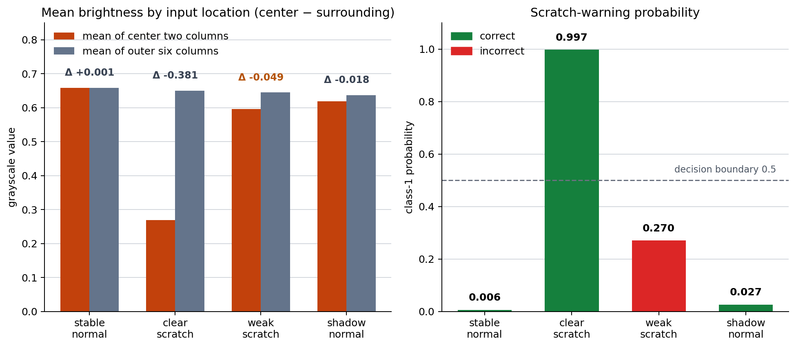

# P7-3.1 How Input Structure Changes a Project

> Section ID: `P7-3.1`
> Version: `v2026.08.01`

An input representation is a project decision: it determines what relationship a model can use and what errors can be diagnosed. This section compares image-like grids, sequential records, and grouped feature tables before selecting a model family.

## Start with the structure of the input

Ask what one row, sequence, region, or relation means; which order or neighborhood must be preserved; and what information is lost by flattening or aggregating it. The same values can support different questions when represented as a table, sequence, or grid.

| Input structure | Relationship to preserve | Typical project question |
| --- | --- | --- |
| Image or grid | Local spatial neighborhood | Which visual pattern is present? |
| Sequence | Order and recent context | What changes over time or position? |
| Tabular record | Feature combination | Which record belongs to which class? |

Do not choose CNN, sequential, or attention-family terminology before stating what structure the model must retain. The next question should describe an input relation, not merely request a more complex architecture.

## Learning questions and criteria

- What is one observation in this project: a table row, a time step, or a spatial patch?
- Which location relation is visible in the original 8×8 grid but less explicit after flattening?
- Which held-out patch is an error or review sample, and what representation question does it open?

You have completed this section when you can document the input shape, labels, split, training loop, evaluation result, and one error-driven next question without treating an architecture name as the explanation.

The first project flow records that sequence.

```mermaid
--8<-- "assets/part-07/chapter-03/p7-3-1-project-structure-flow-en.mmd"
```

## An 8×8 surface-patch project

The concrete project question is: “Can an 8×8 grayscale camera patch distinguish a normal surface from a scratch warning?” A row in the practice CSV is not a tabular customer record. It holds one spatial pixel group with a `split`, `sample`, `pattern_name`, `label`, and `pixel_00` through `pixel_77`.

- Class 0: normal surface.
- Class 1: scratch warning.
- Training input: 12 patches; evaluation input: 4 patches.

The synthetic patches are designed to resemble a surface with lighting variation and a vertical scratch near the center or slightly offset. The important signal is not one pixel alone; it is which location pattern becomes dark.

The case-reading flow keeps the emphasis on evidence. A probability is part of an evaluation record; it is not a visual diagnosis of a physical surface by itself.

```mermaid
--8<-- "assets/part-07/chapter-03/p7-3-1-case-reading-flow-en.mmd"
```

Use [`p7-3-surface-patches.csv`](../../../assets/part-07/chapter-03/p7-3-surface-patches.csv){ .csv-preview } from the repository root.

```python
import csv
from pathlib import Path
import numpy as np

data_path = Path("docs/assets/part-07/chapter-03/p7-3-surface-patches.csv")
pixel_columns = [f"pixel_{row}{column}" for row in range(8) for column in range(8)]
records = []
for raw in csv.DictReader(data_path.open(encoding="utf-8")):
    records.append({
        "split": raw["split"], "sample": raw["sample"], "pattern": raw["pattern_name"],
        "label": int(raw["label"]),
        "image": np.array([float(raw[column]) for column in pixel_columns]).reshape(8, 8),
    })
train_rows = [row for row in records if row["split"] == "train"]
test_rows = [row for row in records if row["split"] == "test"]
X_train = np.array([row["image"] for row in train_rows]); y_train = np.array([row["label"] for row in train_rows])
X_test = np.array([row["image"] for row in test_rows]); y_test = np.array([row["label"] for row in test_rows])
original_train_shape, original_test_shape = X_train.shape, X_test.shape
X_train, X_test = X_train.reshape(len(X_train), -1), X_test.reshape(len(X_test), -1)

W, b = np.zeros((64, 2)), np.zeros(2)
Y_train = np.eye(2)[y_train]
def softmax(values):
    values = values - values.max(axis=1, keepdims=True)
    exp_values = np.exp(values)
    return exp_values / exp_values.sum(axis=1, keepdims=True)
for _ in range(700):
    probabilities = softmax(X_train @ W + b)
    W -= .35 * X_train.T @ (probabilities - Y_train) / len(X_train)
    b -= .35 * (probabilities - Y_train).mean(axis=0)
test_probabilities = softmax(X_test @ W + b)
test_predictions = test_probabilities.argmax(axis=1)

print("original train/test shape =", original_train_shape, original_test_shape)
print("flattened train/test shape =", X_train.shape, X_test.shape)
print("test accuracy =", round(float((test_predictions == y_test).mean()), 3))
for row, probabilities, prediction in zip(test_rows, test_probabilities, test_predictions):
    margin = float(abs(probabilities[0] - probabilities[1]))
    review_needed = prediction != row["label"] or margin <= .15
    print({"sample": row["sample"], "pattern": row["pattern"], "actual": row["label"], "prediction": int(prediction), "probabilities": np.round(probabilities, 3).tolist(), "margin": round(margin, 3), "review_needed": bool(review_needed)})
```

The original 8×8 representation becomes a 64-dimensional vector for this deliberately simple softmax classifier. That flattening makes the code short, but it also removes explicit local-neighborhood structure—a reason to ask later whether a spatial model is appropriate. A low margin or an incorrect patch becomes a review sample, not a proof about the cause of the error.

## Read the input shape before the score

The code starts with arrays shaped `(12, 8, 8)` for training and `(4, 8, 8)` for evaluation. Each first dimension indexes a patch; the next two locate brightness in an 8-by-8 region. Flattening changes those shapes to `(12, 64)` and `(4, 64)`.

| Representation | What is explicit | What becomes less explicit |
| --- | --- | --- |
| 8×8 grid | Row and column neighborhood | The simple classifier cannot consume it directly here. |
| 64-value vector | One feature value per pixel | Adjacency and local patch shape. |
| Column or band profile | Broad spatial signal | Fine row-level or local detail. |

Flattening does not erase the numbers, but it changes the inductive structure available to a model. The simple softmax classifier can still assign different weights to locations; it does not explicitly encode that two neighboring pixels have a special relationship. This is the representation question that later comparisons test.

## Interpret the current evaluation output

The current run has training accuracy `1.000` and evaluation accuracy `0.750`. The difference matters because the four test patches were not used to update `W` or `b`.

| Evaluation patch | Actual label | Predicted label | Probability for scratch | Review reading |
| --- | ---: | ---: | ---: | --- |
| Stable normal | 0 | 0 | `0.006` | Stable normal reference case. |
| Clear scratch | 1 | 1 | `0.997` | Strong scratch signal is recognized. |
| Weak scratch | 1 | 0 | `0.270` | Error: weak spatial signal remains below the decision boundary. |
| Shadow normal | 0 | 0 | `0.027` | A lighting variation stays normal in this run. |

The weak scratch is not a zero-information case. Its scratch probability is `0.270`, lower than the decision boundary but higher than the stable normal reference. This supports a next question about weak-defect data or a spatial representation; it does not prove which of those is the cause.

The chart puts the position signal and probability record beside each other. Its dashed probability line is a classification boundary, not a physical defect threshold.



### Compare center and surrounding signal

The practice patches place a clear scratch near a central band. A useful descriptive statistic is the difference between the mean of the central two columns and the mean of the other six columns. Negative values indicate a darker central band.

| Patch | Center-minus-surrounding signal | Scratch probability | Interpretation limit |
| --- | ---: | ---: | --- |
| Stable normal | `+0.001` | `0.006` | A near-flat reference, not a universal normal rule. |
| Clear scratch | `-0.381` | `0.997` | A strong central darkness pattern. |
| Weak scratch | `-0.049` | `0.270` | A weaker signal that the classifier misses. |
| Shadow normal | `-0.018` | `0.027` | Darkness alone does not establish a scratch. |

The comparison guards against an overly simple rule such as “a dark center is always a defect.” The shadow-normal patch can also have a slightly darker center. What matters is signal strength, location pattern, and the limits of the current small dataset.

## Separate training from evaluation

Training accuracy says the weights fit the twelve training patches. Evaluation accuracy says how those fixed weights behave on four held-out patches. A training score of `1.000` therefore does not cancel the weak-scratch evaluation error.

| Stage | Input | Parameters | Result to retain |
| --- | --- | --- | --- |
| Training | 12 labeled 8×8 patches | `W` and `b` are updated | Training loss or accuracy for optimization context. |
| Evaluation | 4 held-out patches | `W` and `b` stay fixed | Per-patch probability, prediction, error, and margin. |

Keep the split column, sample ID, and label mapping in the project record. Without them, a later reader cannot tell whether a score is an optimization result or an independent evaluation result.

## Read the learning loop in the code

The code uses full-batch gradient descent. One loop step reads all twelve flattened training patches, produces two-class probabilities, compares them with one-hot labels, and updates the weight matrix `W` and bias `b`.

```mermaid
--8<-- "assets/part-07/chapter-03/p7-3-1-learning-loop-flow-en.mmd"
```

| Term | Location in this example | What to verify |
| --- | --- | --- |
| Input batch | `X_train`, `y_train` | The full training set is used in one update. |
| Forward pass | `X_train @ W + b`, then `softmax` | The code creates class probabilities. |
| Gradient | `X_train.T @ (probabilities - Y_train)` | The direction for changing parameters. |
| Update | `W -= ...`, `b -= ...` | Parameters actually move here. |
| Inference | `test_probabilities` | Evaluation uses fixed final parameters. |

This is a deliberately small implementation. Its value is that the update boundary and the evaluation boundary are visible without framework abstractions.

## Turn the error into a next experiment

| Observation | Limited interpretation | Smallest next experiment |
| --- | --- | --- |
| Weak scratch is wrong | The present training examples or representation may not distinguish weak defects | Add weak scratches at varied positions while keeping the test split documented. |
| Shadow normal is correct | The current classifier has not confused this particular lighting pattern | Add more shadow variations before treating that as robust. |
| Clear scratch is correct | Strong central patterns are represented | Check whether off-center scratches remain recognizable. |

Do not change data, flattening, learning rate, and model family all at once. A useful next run isolates one question so that a changed weak-scratch transition has an interpretable cause.

## Project record template

```text
input unit: one 8×8 grayscale surface patch
label mapping: normal surface (0), scratch warning (1)
train/evaluation split: 12 / 4 fixed CSV rows
representation: 8×8 grid flattened to 64 values for a softmax classifier
training result: accuracy 1.000 on training patches
evaluation result: accuracy 0.750 on held-out patches
review patch: weak scratch; probability [0.730, 0.270], predicted normal
next question: add weak or off-center scratch cases, or compare a spatial representation
claim limit: this synthetic patch set does not estimate production inspection performance
```

## Final learning check

- Can you describe why one patch is an 8×8 spatial object rather than an ordinary customer record?
- Did the run preserve the original and flattened shapes in the record?
- Can you name the weak-scratch error and its scratch probability?
- Did you separate a low or incorrect evaluation result from a physical causal explanation?
- Can you identify the forward, gradient, update, and evaluation parts of the loop?
- Does the next experiment change one representation or data condition at a time?

## Work through an input patch manually

Before running a classifier, read an 8×8 patch as a small grid of evidence. The row and column coordinates are part of the input meaning.

| Question about the patch | What to inspect | Why it matters |
| --- | --- | --- |
| Where is the darker region? | Central columns, edges, or an isolated pixel | A scratch may be a location pattern rather than one low value. |
| Does it repeat down rows? | Several adjacent rows in the same band | Repetition is stronger evidence than a single dark pixel. |
| Is there a lighting trend? | Smooth brightness change across the patch | A smooth shadow can resemble a weak local change. |
| Is the pattern in training? | Similar labeled patch IDs | A classifier needs relevant examples to separate cases. |

This manual pass does not replace the model. It supplies a readable hypothesis for the error record. If a learner cannot describe the relevant spatial relation, it will be difficult to decide what kind of representation or data change to try.

### Normal, clear-scratch, weak-scratch, and shadow cases

The four held-out cases play different roles in the project:

| Case role | Current label/result | Why retain it |
| --- | --- | --- |
| Stable normal | Correct normal prediction | A reference for ordinary surface variation. |
| Clear scratch | Correct scratch prediction | Evidence that an obvious central scratch is represented. |
| Weak scratch | Incorrect normal prediction | The primary error and boundary-data target. |
| Shadow normal | Correct normal prediction | A potential confounder that must remain separate from defect cases. |

Keep all four rows when adding a weak-scratch training example or altering the representation. A later improvement that fixes the weak scratch but turns the shadow normal into a scratch warning is a trade-off, not an unqualified success.

## Compare representation choices deliberately

The flattened 64-value input is one comparison point, not the only sensible form. The table below names alternatives without claiming that any is automatically superior.

| Representation | Input size | Preserves | Loses or assumes | Useful next question |
| --- | ---: | --- | --- | --- |
| Raw flattened pixels | 64 | Every pixel value | Explicit neighborhood relation | Does more weak-defect data help this simple view? |
| Column averages | 8 | Broad vertical band changes | Row position and small local shape | Is the scratch mainly a vertical band signal? |
| Center-band profile | 3 | Center-versus-side contrast | Off-center detail | Is a center-only hypothesis too restrictive? |
| Spatial grid model | 8×8 relation | Local neighborhood by design | Requires a defined model and more evidence | Does spatial locality improve weak or off-center defects? |

Comparing these views does not make the current softmax run wrong. It turns its limitation into a testable representation question. P7-3.3 holds labels and evaluation cases fixed while carrying out such a comparison.

## Define review thresholds carefully

The code labels a patch for review when it is incorrect or its class-probability margin is at most `0.15`. The error condition and low-margin condition answer different questions.

| Condition | What it means | Required response |
| --- | --- | --- |
| Incorrect prediction | The known label and current output differ | Keep the row in the error set. |
| Low margin, correct prediction | The current decision is close under this model | Keep as a preventive review candidate. |
| High margin, incorrect prediction | The model is confidently wrong | Check data, labels, representation, and class evidence. |
| High margin, correct prediction | The case is stable in this small run | Retain as a regression reference, not as a proof of robustness. |

The weak-scratch example is already an error, so it requires review regardless of its margin. Do not turn the selected threshold into a claim about inspection safety; it is a practice rule for prioritizing a small set of follow-up cases.

## Plan independent changes

Use one change per experiment and retain the original comparison output.

1. **Weak-defect data change:** add several labeled scratches with smaller central darkness.
   - Keep the representation, learning rate, and existing held-out rows fixed.
   - Observe whether the weak-scratch row recovers and whether shadow normals regress.

2. **Position change:** add scratches one or two columns away from the center.
   - Check whether the error is tied to a center-only training pattern.
   - Record new low-margin or incorrect positions separately.

3. **Representation change:** replace raw pixels with column averages or a center-band profile.
   - Keep the split and classifier settings fixed.
   - Compare accuracy, error IDs, and margins instead of one score alone.

4. **Optimization change:** vary the learning rate or number of full-batch steps.
   - Record training and evaluation behavior separately.
   - Do not attribute a changed representation error to optimization unless the representation stayed fixed.

These changes may interact in a later study, but separating them first makes the initial error interpretation more credible.

## Record facts, interpretations, and next questions

The following table prevents a common overreach in small image exercises.

| Record layer | Example for the weak scratch |
| --- | --- |
| Fact | The held-out weak-scratch patch has label 1, predicted label 0, and scratch probability 0.270. |
| Interpretation | The available patch examples or flattened representation may not separate a weak scratch from lighting variation. |
| Next question | Would weak and off-center scratch examples, with the same held-out references, change this transition? |

The interpretation uses “may” because multiple changes could explain a later recovery. It is a guide for designing the next comparison, not an explanation of the physical inspection process.

## Handoff to an image-project reviewer

```text
project question: distinguish normal surface from scratch warning
input unit: 8×8 grayscale region of interest
input columns: pixel_00 through pixel_77, restored to a grid before training
label mapping: normal 0, scratch warning 1
split: 12 train patches, 4 held-out evaluation patches
current representation: 64 flattened pixel values
training loop: full-batch softmax, stated learning rate and steps
evaluation result: 0.750; weak scratch is the error
review evidence: class probabilities, margin, center-versus-surrounding signal
next experiment: one documented data or representation change
claim limit: synthetic patch set is not a production camera evaluation
```

This handoff makes the choice of image-like input visible to someone who did not run the code. It also prevents an architecture discussion from skipping the project’s evidence and failure record.

## Limits of the example

The patch data are synthetic, grayscale, small, and already aligned to an 8×8 grid. A real inspection system may face camera movement, focus changes, occlusion, sensor noise, additional surface types, and a cost difference between missed defects and false warnings. None of these are estimated by the four held-out rows.

The example nevertheless establishes a useful project discipline: start with the input unit and spatial structure; maintain a split; read per-patch predictions; and turn a named error into a bounded next experiment. That discipline remains relevant when the model or dataset becomes larger.

### Final reviewer questions

1. Can another person reconstruct the 8×8 input and label mapping from the project record?
2. Does the record distinguish training fit from held-out evaluation behavior?
3. Is the weak-scratch error preserved after a new patch or representation is added?
4. Are shadow-normal cases retained as potential regression tests?
5. Does each proposed change state what remains fixed?
6. Does the conclusion stay within the evidence of a small synthetic patch set?

If the answer to any question is no, strengthen the record before increasing model complexity.

## Decide what the model is allowed to learn from

An input representation is also a statement about available evidence. The flattened-pixel model is allowed to use every stored brightness value. It is not allowed to use a camera ID, a production batch, an operator label, or an unseen future frame unless those variables are explicitly added and evaluated.

| Evidence field | Present in this practice | Question before adding it |
| --- | --- | --- |
| Pixel brightness | Yes | Does the pixel pattern correspond to the inspection task? |
| Patch location in source image | No | Would location represent a physical condition or a shortcut? |
| Camera identifier | No | Could it leak a camera-specific artifact into the label? |
| Production time | No | Is time a valid predictive signal or a confounder to inspect? |
| Operator decision | Only as label | Is label quality documented for ambiguous weak defects? |

This check prevents a project from treating every available column as a harmless model input. The smallest patch exercise already demonstrates the principle: an input choice changes what error patterns can be detected and what bias or shortcut risks must be reviewed.

## Use an error review meeting format

For one error such as the weak scratch, a short review can follow this agenda:

1. Open the source patch and confirm the expected label and label guideline.
2. Compare its central and surrounding signal with the clear-scratch and shadow-normal references.
3. Read the predicted probabilities and margin without treating them as a cause.
4. Check whether a similar weak or offset scratch appears in the training rows.
5. Choose one next data, representation, or optimization experiment.
6. Add the patch to the regression list before rerunning anything.

The agenda is intentionally concrete. “Inspect the model” is too vague to reproduce. A named patch, fixed comparison references, and one next intervention make the investigation useful to another reviewer.

### Example review outcome

> The weak-scratch patch is labeled as a scratch warning but receives scratch probability 0.270 and is predicted normal. Its central band is darker than its surrounding area, although far less than the clear-scratch case. The current flattened-pixel training set may not cover this weak pattern or may not preserve the helpful spatial relation strongly enough. Retain the weak scratch and shadow normal as regression cases; next add a documented family of weak scratches at varied positions before changing the classifier family.

The wording records evidence and uncertainty together. It does not state that the model “failed to see the scratch” as if the code had human visual understanding.

## Link this section to later comparisons

P7-3.2 uses the same held-out patches to organize error review. P7-3.3 changes the representation while holding the classifier comparison structure fixed. This section supplies the initial record both later sections need:

| Later question | Evidence supplied here |
| --- | --- |
| Which patch should error analysis open first? | Weak-scratch ID, actual label, prediction, probability, and margin. |
| What does a representation comparison hold fixed? | The 8×8 source rows, labels, split, and review cases. |
| Why might a spatial model be considered? | Flattening makes local neighborhood less explicit. |
| What must not be claimed? | A four-patch synthetic result is not inspection performance. |

The handoff makes the chapter a sequence of comparisons rather than a set of unrelated model descriptions.

## Closing practice

Choose one of the four held-out patches and write a complete three-line record:

```text
input evidence:
prediction evidence:
next question:
```

For the weak scratch, include the 8×8 input role, the 0.270 scratch probability and incorrect normal prediction, and one bounded data or representation question. For a correct patch, explain why it is a reference case and what future change could make it a regression candidate.

This exercise is complete when the record makes a next comparison possible without relying on an unstated architecture preference.

### Preserve these invariants

- Keep every original 8×8 pixel value with its sample ID.
- Keep the label mapping and the train/test split stable during a representation comparison.
- Keep the weak-scratch and shadow-normal rows in the regression set.
- Keep learning rate and step count fixed when testing a feature representation.
- Keep the original and flattened input shapes in each run summary.
- Keep evaluation probabilities separate from training updates.
- Keep an incorrect patch separate from a low-margin but correct patch.
- Keep the physical interpretation conditional on the observed patch evidence.
- Keep new weak-defect rows documented by position and intensity.
- Keep model-family changes separate from data-coverage changes.
- Keep the next experiment limited to one stated question.
- Keep a record of what the example does not measure in real inspection work.
- Keep the reviewer able to reproduce the error transition from the CSV.
- Keep the conclusion about this synthetic set, not a broader camera population.
- Keep the project question visible when choosing a representation.
- Keep uncertainty visible even when a training score is perfect.
- Keep the error record useful after a later model changes.

## Review record

Record the input unit, representation, relation preserved, output, representative error, and next missing information. That record lets another reader see why a project uses a particular representation and what a failure says about it.

## Checklist

| Check | Question to answer |
| --- | --- |
| Input unit | What does one observation represent? |
| Structure | Which order, location, or grouping matters? |
| Representation | What becomes visible or invisible after encoding? |
| Error | Which failure points to a representation limit? |
| Next question | What representation comparison should be tested next? |

## Final handoff

Keep the input shape, the named weak-scratch error, and the fixed regression patches together.
Record before guessing.
Compare before claiming.
Read samples before relying on one total score.
Keep the conclusion within the practice-data range.

## Sources and references

This section uses the book’s practice examples; it does not quote external material directly.
