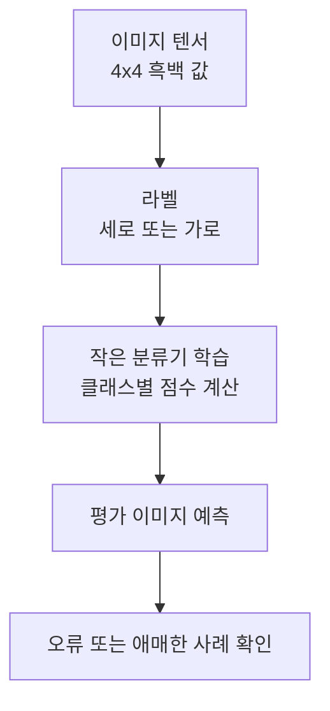

# P7-3.1 이미지 분류 모델 목표

> Section ID: `P7-3.1`
> Version: `v2026.07.17`

P7-2까지는 표 데이터와 작은 분류 문제를 다뤘습니다. 이제 입력이 `표의 행(row)`이 아니라 `이미지 텐서(tensor)`일 때 프로젝트 문서가 어떻게 바뀌는지 확인합니다.

하지만 여기서도 먼저 분명히 해야 할 점이 있습니다.

이미지 분류 프로젝트의 핵심은 멋진 합성곱 신경망(CNN) 코드를 길게 쓰는 것이 아니라, 입력 모양(shape), 라벨(label), 예측 결과, 오류 사례를 함께 기록하는 것이다.

이 절의 목적은 딥러닝 성능 경쟁이 아니라, 이미지 분류 프로젝트 문서에 무엇을 먼저 적어야 하는지 익히는 것이다.

## 이 절의 범위

- 이미지 분류 프로젝트는 표 데이터 프로젝트와 무엇이 다른가?
- 작은 이미지 텐서를 분류 문제로 바꾸려면 무엇을 먼저 적어야 하는가?
- 딥러닝 프로젝트의 가장 작은 실습 단위는 어떻게 만들 수 있는가?

이 절은 이미지 프로젝트의 입력, 라벨, 예측, 오류 기록 구조를 먼저 잡는 데 집중합니다. 즉, 여기서는 `입력 모양 -> 라벨 -> 학습 -> 예측 -> 오류`로 이미지 프로젝트 문서를 어떻게 시작할지까지를 먼저 닫습니다. 실제 오류 사례를 어떻게 읽고 다음 개선으로 넘길지는 바로 다음 P7-3.2 오류 사례 분석에서 다시 회수하고, 뒤의 실패 기록 절들에서도 같은 검토 구조를 다시 사용합니다.

이미지 입력으로 바뀌어도 프로젝트 메모의 기본 항목은 여기서 그대로 유지됩니다. 이 절은 이미지 텐서, 라벨, 예측, 테스트 기록을 어떤 문서 항목으로 남길지 정리합니다.

## 이 절의 목표

- 이미지 분류 프로젝트를 `입력 모양 -> 라벨 -> 학습 -> 예측 -> 오류` 흐름으로 설명할 수 있습니다.
- 이미지도 결국 숫자 배열(array)이라는 점을 다시 확인할 수 있습니다.
- 작은 실습으로 train/test 예측 흐름을 직접 기록할 수 있습니다.

## 왜 작은 이미지 프로젝트가 필요한가

독자는 이미지 분류를 들으면 곧바로 복잡한 모델 구조부터 떠올리기 쉽습니다. 하지만 프로젝트 문서에서 먼저 필요한 것은 다음입니다.

- 이미지 한 장은 어떤 숫자 배열인가?
- 분류 클래스(class)는 몇 개인가?
- 학습용 샘플과 평가용 샘플은 어떻게 구분되는가?
- 잘 맞춘 사례와 애매한 사례는 무엇인가?

즉, Part 7의 이미지 프로젝트는 `딥러닝 프레임워크 훈련법`을 전부 배우는 자리가 아니라, Part 4에서 본 신경망 감각을 실제 프로젝트 기록 형태로 바꾸는 자리입니다.

이미지 분류 프로젝트 입구에서 바로 확인해야 할 판단 기준을 표로 고정하면 다음과 같습니다.

| 질문 | 짧은 답 |
| --- | --- |
| 이 프로젝트에서 먼저 적을 것은 무엇인가? | 입력 모양, 클래스 라벨, train/test 분리 |
| 왜 작은 패턴 이미지로 시작하는가? | 픽셀 배열과 예측 흐름을 눈으로 확인하기 위해 |
| 최소 산출물은 무엇인가? | 예측값, 정확도, 애매한 샘플 기록 |

여기에 한 가지를 더 붙이면 이미지 프로젝트의 입구부터 기록 구조가 더 분명해집니다. 입력 모양과 라벨만 적는 데서 끝내지 말고, `어떤 샘플을 추가 검토 대상으로 남길 것인가`, `어떤 예측이 비교 기준선이 되는가`, `다음 절에서 어떤 오류 사례를 더 볼 것인가`를 같이 적어 두는 것입니다.

| 입구에서 같이 남길 기록 | 왜 필요한가 |
| --- | --- |
| 입력 모양(shape) | 어떤 숫자 배열을 다루는지 고정하기 위해서입니다. |
| 클래스 라벨 | 예측 목표를 분명히 하기 위해서입니다. |
| 추가 검토 대상 샘플 기준 | 확신 차이(margin)가 낮거나 오분류된 샘플을 따로 보기 위해서입니다. |
| 다음 점검 질문 | 데이터, 표현, 모델 중 어디를 먼저 볼지 정하기 위해서입니다. |

## 프로젝트 질문 설정

이번 절은 `4x4 흑백 패턴 이미지에서 세로 막대와 가로 막대를 구분할 수 있는가?`라는 작은 질문에서 시작합니다. 픽셀(pixel) 배열을 직접 눈으로 볼 수 있고, 라벨이 명확하며, 애매한 혼합 패턴을 일부러 넣어 오류 분석까지 이어 갈 수 있기 때문입니다.

## 프로젝트 흐름



이 도식은 이미지 분류 프로젝트를 `복잡한 CNN 구현`이 아니라 `입력 배열과 예측 기록의 흐름`으로 다시 보여 줍니다. 이미지도 결국 숫자 텐서이고, 프로젝트 문서에서는 그 텐서가 라벨과 예측으로 어떻게 이어지는지를 먼저 남겨야 합니다.

프로젝트 기록으로 남기면 순서는 다음과 같습니다.

| 단계 | 문서에 남길 것 |
| --- | --- |
| 입력 | 이미지 모양과 픽셀 예시 |
| 라벨 | 클래스 정의 |
| 학습 | 어떤 작은 분류기를 썼는가 |
| 결과 | train/test 예측과 정확도 |
| 오류 | 애매하거나 틀린 샘플 |

## 예제 데이터

이번 절에서는 흑백 4x4 이미지를 직접 배열로 넣습니다.

- 클래스 0: 세로 막대
- 클래스 1: 가로 막대

예시 이미지를 글자로 보면 다음과 같습니다.

### 세로 막대(class 0)

```text
0 1 1 0
0 1 1 0
0 1 1 0
0 1 1 0
```

### 가로 막대(class 1)

```text
0 0 0 0
1 1 1 1
1 1 1 1
0 0 0 0
```

이 데이터는 실제 사진이 아니라 `이미지 텐서와 라벨의 관계`를 설명하기 위한 장난감 데이터입니다.

## Python 예제

이번 예제의 목적은 4x4 이미지를 펼쳐 16차원 입력으로 바꾸고, 매우 작은 소프트맥스(softmax) 분류기를 학습해 평가 예측을 확인하는 것입니다. 이번에는 `정확도`만 보는 대신, 어떤 평가 이미지가 애매했는지 바로 추적할 수 있도록 평가 샘플 이름, 패턴 이름, 확신 차이도 함께 남기겠습니다.

- 문제 상황: 세로 막대와 가로 막대를 구분한다.
- 입력: 4x4 흑백 이미지 4장(학습), 3장(평가)
- 정답 라벨: 세로 막대 = 0, 가로 막대 = 1
- 확인할 개념:
  - 이미지도 숫자 배열이다
  - 분류기는 클래스 점수(score)를 비교해 예측을 만든다
  - test 데이터에서 애매한 이미지가 틀릴 수 있다
  - 오류 사례로 이어질 수 있게 샘플별 예측 기록을 남겨야 한다

```python
import numpy as np

train_rows = [
    {
        "샘플": "학습-세로-01",
        "패턴 이름": "세로 막대",
        "이미지": [[0, 1, 1, 0], [0, 1, 1, 0], [0, 1, 1, 0], [0, 1, 1, 0]],
        "라벨": 0,
    },
    {
        "샘플": "학습-세로-02",
        "패턴 이름": "세로 막대",
        "이미지": [[0, 1, 1, 0], [0, 1, 1, 0], [0, 1, 1, 0], [0, 1, 1, 0]],
        "라벨": 0,
    },
    {
        "샘플": "학습-가로-01",
        "패턴 이름": "가로 막대",
        "이미지": [[0, 0, 0, 0], [1, 1, 1, 1], [1, 1, 1, 1], [0, 0, 0, 0]],
        "라벨": 1,
    },
    {
        "샘플": "학습-가로-02",
        "패턴 이름": "가로 막대",
        "이미지": [[0, 0, 0, 0], [1, 1, 1, 1], [1, 1, 1, 1], [0, 0, 0, 0]],
        "라벨": 1,
    },
]

test_rows = [
    {
        "샘플": "평가-세로-명확",
        "패턴 이름": "세로 막대",
        "이미지": [[0, 1, 1, 0], [0, 1, 1, 0], [0, 1, 1, 0], [0, 1, 1, 0]],
        "라벨": 0,
    },
    {
        "샘플": "평가-가로-명확",
        "패턴 이름": "가로 막대",
        "이미지": [[0, 0, 0, 0], [1, 1, 1, 1], [1, 1, 1, 1], [0, 0, 0, 0]],
        "라벨": 1,
    },
    {
        "샘플": "평가-혼합-패턴",
        "패턴 이름": "혼합 막대",
        "이미지": [[0, 1, 1, 0], [0, 1, 1, 0], [1, 1, 1, 1], [0, 0, 0, 0]],
        "라벨": 1,
    },
]

X_train = np.array([row["이미지"] for row in train_rows], dtype=float)
y_train = np.array([row["라벨"] for row in train_rows])
X_test = np.array([row["이미지"] for row in test_rows], dtype=float)
y_test = np.array([row["라벨"] for row in test_rows])

original_train_shape = X_train.shape
original_test_shape = X_test.shape

X_train = X_train.reshape(len(X_train), -1)
X_test = X_test.reshape(len(X_test), -1)

W = np.zeros((16, 2))
b = np.zeros(2)

def softmax(z):
    z = z - z.max(axis=1, keepdims=True)
    exp_z = np.exp(z)
    return exp_z / exp_z.sum(axis=1, keepdims=True)

def one_hot(y, num_classes=2):
    out = np.zeros((len(y), num_classes))
    out[np.arange(len(y)), y] = 1
    return out

Y_train = one_hot(y_train)
learning_rate = 0.2

for _ in range(400):
    logits = X_train @ W + b
    probs = softmax(logits)
    grad_W = X_train.T @ (probs - Y_train) / len(X_train)
    grad_b = (probs - Y_train).mean(axis=0)
    W -= learning_rate * grad_W
    b -= learning_rate * grad_b

train_probs = softmax(X_train @ W + b)
train_pred = train_probs.argmax(axis=1)
test_probs = softmax(X_test @ W + b)
test_pred = test_probs.argmax(axis=1)

test_records = []
for index, row in enumerate(test_rows):
    probs = np.round(test_probs[index], 3)
    confidence_margin = round(
        float(np.sort(test_probs[index])[-1] - np.sort(test_probs[index])[-2]), 3
    )
    test_records.append({
        "평가 샘플": row["샘플"],
        "패턴 이름": row["패턴 이름"],
        "실제 라벨": row["라벨"],
        "예측 라벨": int(test_pred[index]),
        "정답 여부": "예" if test_pred[index] == y_test[index] else "아니오",
        "클래스별 확률": probs.tolist(),
        "확신 차이": confidence_margin,
        "오류 검토 필요": "예" if confidence_margin <= 0.1 else "아니오",
    })

project_run = {
    "원래 학습 입력 모양": original_train_shape,
    "원래 평가 입력 모양": original_test_shape,
    "펼친 학습 입력 모양": X_train.shape,
    "펼친 평가 입력 모양": X_test.shape,
    "학습 정확도": round(float((train_pred == y_train).mean()), 3),
    "평가 정확도": round(float((test_pred == y_test).mean()), 3),
    "추가 검토 샘플": [
        row["평가 샘플"] for row in test_records if row["오류 검토 필요"] == "예"
    ],
}

print("실행 요약 =", project_run)
print("샘플별 평가 =")
for row in test_records:
    print(row)
```

실행 결과 예시는 다음과 같습니다.

```text
실행 요약 = {'원래 학습 입력 모양': (4, 4, 4), '원래 평가 입력 모양': (3, 4, 4), '펼친 학습 입력 모양': (4, 16), '펼친 평가 입력 모양': (3, 16), '학습 정확도': 1.0, '평가 정확도': 0.667, '추가 검토 샘플': ['평가-혼합-패턴']}
샘플별 평가 =
{'평가 샘플': '평가-세로-명확', '패턴 이름': '세로 막대', '실제 라벨': 0, '예측 라벨': 0, '정답 여부': '예', '클래스별 확률': [0.997, 0.003], '확신 차이': 0.994, '오류 검토 필요': '아니오'}
{'평가 샘플': '평가-가로-명확', '패턴 이름': '가로 막대', '실제 라벨': 1, '예측 라벨': 1, '정답 여부': '예', '클래스별 확률': [0.003, 0.997], '확신 차이': 0.994, '오류 검토 필요': '아니오'}
{'평가 샘플': '평가-혼합-패턴', '패턴 이름': '혼합 막대', '실제 라벨': 1, '예측 라벨': 0, '정답 여부': '아니오', '클래스별 확률': [0.5, 0.5], '확신 차이': 0.0, '오류 검토 필요': '예'}
```

## 결과를 어떻게 읽는가

이 결과에서 읽어야 할 핵심은 세 가지입니다.

1. 입력 모양  
   예제의 실행 요약에는 원래 모양(shape) `(4, 4, 4)`와 펼친 뒤 모양 `(4, 16)`이 함께 남습니다. 즉, 이미지가 원래는 4x4 픽셀 묶음이었고, 학습 직전에는 16개 숫자 입력으로 바뀌었다는 점을 한 번에 확인할 수 있습니다.

2. 학습 데이터와 평가 데이터 분리  
   학습에서는 모두 맞았지만, 평가에서는 `평가-혼합-패턴`을 틀렸습니다. 즉, 학습 성공과 일반화 성공은 같은 말이 아닙니다.

3. 확률 분포의 애매함  
   세 번째 샘플의 확률이 `[0.5, 0.5]`로 나온 것은 현재 모델이 이 이미지를 뚜렷하게 가르지 못했다는 신호입니다. `확신 차이 = 0.0`과 `오류 검토 필요 = 예`를 함께 남겼기 때문에, 이 결과를 원인 확정으로 읽기보다 다음 절에서 어떤 샘플을 우선 검토해야 하는지 바로 정할 수 있습니다.

이 결과는 다음 세 줄로 요약할 수 있습니다.

- 이미지는 결국 16개 숫자 입력으로 바뀌었다
- 학습에서는 맞아도 평가에서는 애매한 샘플이 틀릴 수 있다
- 샘플 ID와 불확실성 기록이 있어야 다음 오류 분석으로 자연스럽게 이어진다
- 애매한 확률 출력은 다음 절 오류 분석의 출발점이다

이 작은 실습은 Part 4와 Part 7을 연결합니다.

- Part 4에서는 입력층(input layer), 출력층(output layer), 손실(loss), 학습(learning)을 개념으로 설명했습니다.
- Part 7에서는 그 흐름을 아주 작은 이미지 프로젝트 문서로 바꿉니다.

즉, 이번 절은 `CNN을 배웠다`가 아니라 `이미지 분류 프로젝트를 어떤 구조로 기록해야 하는가`를 익히는 자리입니다.

이 절은 Part 7 전체 흐름에서 `입력 표현이 표가 아니라 이미지가 되었을 때도 프로젝트 문서의 뼈대는 유지된다`는 점을 보여 줍니다.

같은 흐름을 최소 기록으로 줄이면 다음 표처럼 정리할 수 있습니다.

| 단계 | 다시 검토가 필요한 상태 | 다음 행동 |
| --- | --- | --- |
| 입력 확인 | 입력 모양이 예상과 다르다 | 전처리 다시 확인 |
| 예측 확인 | 확신 차이가 낮다 | 오류 사례 분석으로 넘김 |
| 평가 결과 | 오분류 샘플이 있다 | 데이터/모델/표현 확인 질문 기록 |

이 표가 있으면 이미지 분류 프로젝트 입구부터 `입력 -> 비교 기준 -> 다시 볼 질문` 구조가 보입니다.

## 체크리스트

다음처럼 이미지 모델 이야기를 시작했는데 프로젝트 기록의 뼈대가 아직 없는 상태라면 이 절의 관점을 먼저 떠올리는 편이 좋습니다.

- 합성곱 신경망(CNN)이나 프레임워크 이름부터 적기 시작했지만 입력 모양(shape)과 라벨 정의가 문서에 고정되지 않은 경우
- 학습 정확도는 봤지만 평가 오분류 샘플과 검토 대상을 따로 남기지 않은 경우
- 이미지가 숫자 배열이라는 설명은 했지만 어떤 예측 기록을 다음 절로 넘길지 비어 있는 경우

이때는 모델 구조를 더 늘리기 전에 `입력 모양 -> 라벨 -> 예측 -> 오류 사례` 순서를 먼저 문서에 세우는 편이 안전합니다.

- 이미지도 숫자 배열(array)이라는 점을 설명할 수 있는가?
- 이미지 분류 프로젝트는 입력 모양, 라벨, 예측값, 오류 사례를 함께 남겨야 한다는 점을 말할 수 있는가?
- 학습 정확도와 평가 정확도는 반드시 분리해서 읽어야 한다는 점을 설명할 수 있는가?
- 애매한 확률 출력은 오류 분석의 출발점이 된다는 점을 말할 수 있는가?
- 이미지 입력이 어떤 모양(shape)으로 모델에 들어가는지 설명할 수 있는가?
- 클래스 라벨이 무엇인지 분명히 적을 수 있는가?
- 학습과 평가 결과를 분리해 기록했는가?
- 애매하거나 틀린 샘플을 다음 절 분석 대상으로 남겼는가?

## 출처와 참고 자료

- NumPy Developers, `NumPy documentation`, 확인 날짜: 2026-06-29. [https://numpy.org/doc/stable/](https://numpy.org/doc/stable/){: target="_blank" rel="noopener noreferrer" }

이 절의 이미지 데이터는 프로젝트 실습을 위해 만든 자체 장난감 데이터입니다.
