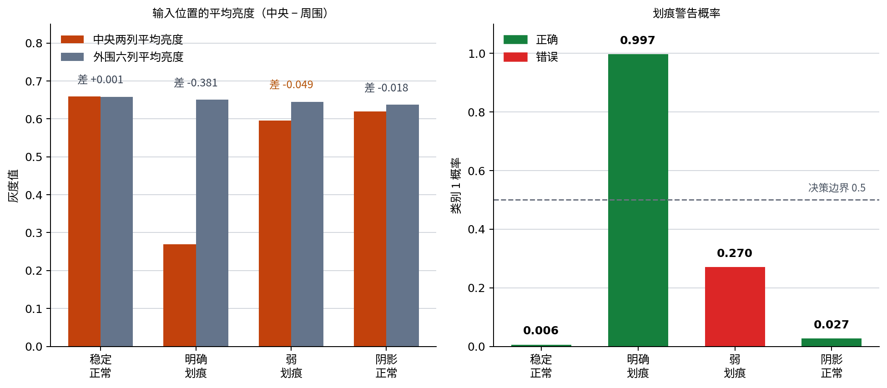

# P7-3.1 输入结构如何改变项目

> Section ID: `P7-3.1`
> Version: `v2026.08.01`

当输入结构从表格行变为图像张量时，应同时记录 `input_shape`、`representation_choice`、`model_family`、`prep_code_change`、`comparison_metric` 和 `review_sample`。图像项目的重点不是先写很长的 CNN，而是让输入形状、标签、预测和错误案例可以被复查。

## 图像输入改变的记录

本练习的问题是：能否从 `8×8` 灰度相机补丁中区分正常表面与划痕警告？每个补丁是空间排列的像素数组，而不是三个互不相关的表格列。

| 项目字段 | 需要记录的内容 |
| --- | --- |
| 输入形状 | 一张补丁为 `8×8`，训练集合为样本数×8×8。 |
| 类别标签 | 正常表面 `0`，划痕警告 `1`。 |
| 划分 | 训练补丁与评估补丁分开。 |
| 表示选择 | 保留二维结构或为简单分类器展平为64列。 |
| 评估 | 准确率、概率、置信差和需要审查的补丁。 |
| 错误 | 错分或低置信度补丁及其位置模式。 |

```mermaid
--8<-- "assets/part-07/chapter-03/p7-3-1-case-reading-flow-zh.mmd"
```

## 从图像张量到项目流程

图像最终仍是数值数组，但空间位置带有意义。展平后，简单线性分类器能读取 64 个值，却不会显式保留“相邻像素形成局部模式”这一结构。

```mermaid
--8<-- "assets/part-07/chapter-03/p7-3-1-project-structure-flow-zh.mmd"
```

| 阶段 | 文档中保留的内容 |
| --- | --- |
| 输入 | 像素列、原始形状与代表补丁。 |
| 标签 | 每类含义与标签规则。 |
| 准备 | 是否展平、标准化或保留空间布局。 |
| 训练 | 分类器、步数和学习率。 |
| 评估 | 预测、概率、准确率和样本 ID。 |
| 错误 | 位置模式、置信差和下一问题。 |

## 从 CSV 训练简单分类器

使用 [`p7-3-surface-patches.zh.csv`](../../../assets/part-07/chapter-03/p7-3-surface-patches.zh.csv){ .csv-preview }。CSV 的一行代表一个 `8×8` 补丁，`pixel_00` 到 `pixel_77` 是像素值。

```python
import csv
from pathlib import Path
import numpy as np

pixels = [f"pixel_{row}{col}" for row in range(8) for col in range(8)]
rows = []
for raw in csv.DictReader(Path("docs/assets/part-07/chapter-03/p7-3-surface-patches.zh.csv").open(encoding="utf-8")):
    rows.append({"split": raw["split"], "sample": raw["sample"], "pattern": raw["pattern_name"],
                 "label": int(raw["label"]), "image": np.array([float(raw[p]) for p in pixels]).reshape(8, 8)})
train, test = [row for row in rows if row["split"] == "train"], [row for row in rows if row["split"] == "test"]
X_train = np.array([row["image"] for row in train]); X_test = np.array([row["image"] for row in test])
y_train = np.array([row["label"] for row in train]); y_test = np.array([row["label"] for row in test])
original_shapes = {"train": X_train.shape, "test": X_test.shape}
X_train, X_test = X_train.reshape(len(train), -1), X_test.reshape(len(test), -1)
W, b = np.zeros((64, 2)), np.zeros(2)
Y = np.eye(2)[y_train]
def softmax(values):
    values = values - values.max(axis=1, keepdims=True); e = np.exp(values); return e / e.sum(axis=1, keepdims=True)
for _ in range(700):
    probabilities = softmax(X_train @ W + b)
    W -= .35 * X_train.T @ (probabilities - Y) / len(train)
    b -= .35 * (probabilities - Y).mean(axis=0)
probabilities = softmax(X_test @ W + b); predictions = probabilities.argmax(axis=1)
print("original_shapes =", original_shapes, "flattened_shapes =", {"train": X_train.shape, "test": X_test.shape})
print("train_accuracy =", round(float((softmax(X_train @ W + b).argmax(axis=1) == y_train).mean()), 3))
print("test_accuracy =", round(float((predictions == y_test).mean()), 3))
for row, actual, prediction, probability in zip(test, y_test, predictions, probabilities):
    margin = round(float(abs(probability[1] - probability[0])), 3)
    print({"sample": row["sample"], "pattern": row["pattern"], "actual": int(actual), "prediction": int(prediction), "probabilities": np.round(probability, 3).tolist(), "margin": margin, "review": bool(prediction != actual or margin <= .15)})
```

代码为了观察记录结构而把 `8×8` 展平为 `64` 个输入。它不是 CNN，也不试图代表生产视觉系统；它使原始形状、展平形状和样本级错误可以在同一运行中出现。

## 阅读弱划痕错误

当前运行的训练准确率为 `1.000`，评估准确率为 `0.750`。四个评估补丁中，弱划痕补丁实际为警告，却被预测为正常；其划痕警告概率为 `0.270`。

| 补丁 | 实际 | 预测 | 概率 | 审查理由 |
| --- | ---: | ---: | --- | --- |
| 评估-正常-稳定 | 0 | 0 | `[0.994, 0.006]` | 稳定正常参考。 |
| 评估-缺陷-明确 | 1 | 1 | `[0.003, 0.997]` | 明确缺陷参考。 |
| 评估-缺陷-弱 | 1 | 0 | `[0.730, 0.270]` | 确认错误，需检查局部弱信号。 |
| 评估-正常-阴影 | 0 | 0 | `[0.973, 0.027]` | 阴影正常参考。 |

弱划痕案例说明准确率不能替代补丁阅读。它可能涉及训练数据中弱缺陷的范围、展平表示是否弱化局部位置，或简单线性边界是否不足。

```mermaid
--8<-- "assets/part-07/chapter-03/p7-3-1-learning-loop-flow-zh.mmd"
```

## 学习循环中的术语

| 术语 | 本练习中的含义 |
| --- | --- |
| 前向计算 | 64 个展平像素生成两个类别概率。 |
| 损失 | 预测概率与训练标签的不一致。 |
| 更新 | 用梯度调整 `W` 与 `b`。 |
| step | 一次完整训练补丁的参数更新。 |
| epoch | 一次遍历训练补丁；这里用 700 个全批量步骤简化演示。 |
| 评估 | 在四个未参与训练的补丁上记录预测。 |

## 回顾模板

```text
输入形状：训练与评估的样本数×8×8。
表示：展平为64列用于简单 softmax 分类器。
训练/评估结果：
错误补丁：
低置信度补丁：
空间模式观察：
有限解释：
下一问题：补充弱划痕数据、改变表示，还是测试局部空间模型？
```

## 学习检查

1. 为什么图像补丁的空间位置需要写入项目记录？
2. 原始 `8×8` 与展平 `64` 的形状分别说明什么？
3. 为什么训练准确率 1.000 不足以结束项目？
4. 弱划痕错误如何打开数据、表示和模型问题？
5. 下一次实验必须保留哪些评估补丁？

## 将位置线索与预测一起阅读

弱划痕不是随机错误。该补丁的中央附近有较暗的窄带，但展平的线性分类器仍将它归为正常。阅读时应把位置线索、预测概率和标签放在一起，而不是只说“模型错了”。

| 补丁类型 | 中央位置观察 | 划痕警告概率 | 项目读取 |
| --- | --- | ---: | --- |
| 稳定正常 | 没有持续的局部暗带 | 0.006 | 正常参考。 |
| 明确划痕 | 中央或局部暗带明显 | 0.997 | 明确缺陷参考。 |
| 弱划痕 | 局部暗带较弱 | 0.270 | 目标错误和边界案例。 |
| 阴影正常 | 亮度变化但非划痕结构 | 0.027 | 防止暗度成为简单捷径。 |

概率是当前分类器在这个表示下的输出，不是物理世界中存在划痕的校准概率。弱划痕的 0.270 说明分类器偏向正常，而不是说该补丁有 27% 的真实缺陷机会。



### 为什么保留阴影正常补丁

如果只添加更多弱划痕正例，模型可能把任何较暗区域都当成缺陷。阴影正常补丁是必要的反例：它测试表示或数据扩展是否把照明变化误认为划痕。

| 回归补丁 | 目的 |
| --- | --- |
| 稳定正常 | 检测普通表面上的新误报。 |
| 明确划痕 | 确认明显缺陷仍可识别。 |
| 弱划痕 | 检查原始漏检边界是否恢复。 |
| 阴影正常 | 检查暗化捷径或误报。 |
| 新错误补丁 | 防止整体分数掩盖可重复回归。 |

一个后续实验即使提高总体准确率，若让阴影正常变为划痕警告，也应报告这一权衡。

## 展平表示改变了什么

原始 `8×8` 数组保留了行列位置。展平为 64 列后，每个像素值仍然存在，但“第 3 列与第 4 列相邻”不再是模型结构明确使用的关系。简单线性模型可以学习像素权重，却不会像局部空间模型那样直接利用邻域模式。

| 表示 | 保留的信息 | 容易失去或弱化的信息 | 可打开的模型问题 |
| --- | --- | --- | --- |
| 原始 8×8 张量 | 行列、邻近和局部形状 | 需要合适的模型读取它。 | CNN 或局部空间表示。 |
| 展平 64 列 | 每个像素的数值 | 邻近关系的明确结构。 | 线性分类器是否足够。 |
| 位置汇总特征 | 已说明的中心或带状关系 | 细粒度形状细节。 | 简单特征是否能解决边界。 |
| 更宽上下文 | 补丁外的环境关系 | 可能增加不必要复杂度。 | 是否真需要远距离关系。 |

这不是“展平一定错误”的结论。它给出一个可以测试的假设：若补充可比弱划痕数据后仍漏检，是否需要保留局部空间关系的表示？

## 事实、解释和下一问题

| 层次 | 弱划痕案例的记录 |
| --- | --- |
| 事实 | 该评估补丁标签为划痕警告，预测为正常，概率 `[0.730, 0.270]`。 |
| 输入观察 | 中央附近存在较弱的暗带。 |
| 有限解释 | 训练范围、展平表示或简单边界可能使该位置线索不足。 |
| 未证实内容 | 不知道哪一个因素单独造成错误。 |
| 下一问题 | 添加弱划痕与阴影边界数据后，错误是否仍在相同补丁上出现？ |

把这些句子分开可防止从一张补丁直接跳到“必须使用更大模型”的结论。

## 训练循环在本练习中的意义

```mermaid
--8<-- "assets/part-07/chapter-03/p7-3-1-learning-loop-flow-zh.mmd"
```

这里的 700 次更新是为了显示一个可运行的训练循环，不是为真实视觉任务推荐的固定训练方案。每一步读取全部训练补丁、计算 softmax 概率、比较标签、计算梯度并更新参数。

| 循环记录 | 应保存的内容 |
| --- | --- |
| 输入批次 | 本例为 12 个训练补丁的全批量。 |
| 参数 | `W` 的 64×2 权重与两个偏置。 |
| 学习率 | `0.35`，作为本例的明确设定。 |
| 步数 | 700 次全批量更新。 |
| 训练结果 | 训练准确率与训练样本数。 |
| 评估结果 | 四个评估补丁的预测、概率和错误。 |

训练准确率达到 1.000 并不表示模型泛化。训练补丁本来就是参数更新看到的记录；评估补丁和错误案例才测试当前比较的范围。

### 训练与评估记录不能混合

| 不安全做法 | 风险 | 正确记录 |
| --- | --- | --- |
| 用评估补丁挑选每一步最佳参数 | 评估信息参与训练选择。 | 固定评估集，只报告运行后的结果。 |
| 把弱划痕补丁加入训练后继续当评估 | 目标错误不再是未见案例。 | 保存原始弱划痕作为回归参考，新增独立训练补丁。 |
| 只保存最终准确率 | 错误与概率被隐藏。 | 保存每个评估补丁的结果。 |
| 只保存图像截图 | 输入形状和数据版本无法重建。 | 保存 CSV、像素列和表示规则。 |

## 数据、表示和模型的分层问题

弱划痕错误可以打开三个不同层次的假设。不要在没有比较前把它们合并成“模型问题”。

| 层次 | 问题 | 最小受控试验 |
| --- | --- | --- |
| 数据 | 训练集中是否有可比的弱划痕与阴影组合？ | 添加带标签的边界补丁，固定评估参考。 |
| 表示 | 展平是否使局部窄带不够明确？ | 比较一个说明清楚的空间汇总或保留位置的表示。 |
| 模型 | 简单线性边界是否不足？ | 在相同数据与回归集上测试局部空间模型。 |
| 标签 | 弱划痕标签是否遵循明确的检验规则？ | 复核来源与标签依据，不改变模型。 |

试验的顺序应由证据决定。若训练范围明显缺少弱划痕，先增加可比数据比立即改变模型更能回答当前问题。

## 图像项目的最小回顾

```text
任务：从 8×8 灰度补丁识别正常表面与划痕警告。
输入：样本数×8×8；用于本例的展平表示为样本数×64。
训练/评估：12 个训练补丁，4 个固定评估补丁。
模型：全批量 softmax 线性分类器，700 次更新。
结果：训练准确率 1.000，评估准确率 0.750。
错误：评估-缺陷-弱被预测为正常，划痕概率 0.270。
回归参考：稳定正常、明确划痕、弱划痕、阴影正常。
有限解释：数据范围、空间表示和模型边界都仍需检验。
下一问题：在固定四个补丁上比较边界数据或局部空间表示。
```

## 直接修改并检查

1. 将更新步数从 700 改为较小值，记录训练与评估错误是否变化。
2. 改变学习率，但固定训练补丁、评估补丁和标签。
3. 增加一个独立的弱划痕训练补丁，保留原弱划痕评估补丁。
4. 输出每个补丁的中间列与周围列平均亮度，检查位置观察。
5. 使用一项明确的空间汇总特征，与原始展平结果比较。
6. 将阴影正常保留为误报回归案例。

每次只改变一个组件，并报告恢复、新错误、持续错误与稳定参考。这样图像项目的改进不会退化为只看最后一个准确率。

## 最终检查表

- 是否写明了原始形状、展平形状和像素列？
- 是否保存了类别标签与 train/test 划分？
- 是否将训练准确率和评估准确率分开？
- 是否列出弱划痕的实际、预测、概率和边际？
- 是否保留稳定正常、明确划痕和阴影正常反例？
- 是否将位置观察与因果解释分开？
- 是否将数据、表示、模型和标签问题分层？
- 是否让下一实验只改变一个组件？
- 是否保存了学习率、步数和训练数据版本？
- 是否避免把这个小型练习写成生产视觉系统证明？

完成这些记录后，输入结构就成为可比较的项目选择，而不是只在代码里出现的一串形状数字。

## 读取图表时不要跳过样本

左图把中央两列与外围六列的平均亮度分开。这个汇总只是一种可读的观察方式；它不能替代原始 `8×8` 图像，也不能证明所有划痕都位于中央。

右图显示同一批评估补丁的类别 1 概率。绿色柱表示当前标签与预测一致，红色柱表示不一致。弱划痕的红色柱提醒我们：即使其他三张补丁表现稳定，也必须保留该样本作为后续比较的回归参考。

| 图表读法 | 可以说什么 | 不能直接说什么 |
| --- | --- | --- |
| 中央与外围差值 | 该补丁在这两个位置汇总下存在亮度差。 | 亮度差单独导致了模型预测。 |
| 划痕警告概率 | 当前模型给出的类别 1 分数。 | 真实世界的缺陷发生概率。 |
| 绿色柱 | 此次运行的预测与标签一致。 | 模型已经适合所有新图像。 |
| 红色柱 | 此样本值得复核和保留。 | 应立刻删除模型或数据。 |

图表的价值在于把“位置观察”和“模型输出”放进同一个可复查对象。下一次运行应使用相同的图表结构，才容易比较修改前后的变化。

## 输入形状的检查顺序

在更换模型前，先确认数据读取是否真的保留了预期结构。图像项目中常见的问题不是算法名称，而是像素顺序、形状或划分在处理中悄悄改变。

| 检查 | 本例的预期 | 发现异常时先问什么 |
| --- | --- | --- |
| 像素列数 | 每个样本 64 列。 | 是否漏列、重复列或读取了非像素字段？ |
| 重塑前形状 | 训练为 `12×8×8`，评估为 `4×8×8`。 | 样本数和行列方向是否正确？ |
| 展平后形状 | 训练为 `12×64`，评估为 `4×64`。 | 训练和评估是否采用同一顺序？ |
| 标签数量 | 每个输入补丁有一个二元标签。 | 标签是否与样本 ID 对齐？ |
| 划分 | train 与 test 字段明确分开。 | 是否有同一补丁或近重复补丁跨越划分？ |

可以在运行开头打印这些形状，但打印不是验证本身。项目记录应说明每个维度代表什么，例如第一个维度是样本数，后两个维度是高度与宽度。

### 像素顺序为何重要

CSV 中的 `pixel_00` 到 `pixel_77` 需要以与写入时相同的顺序重组。若列名排序或循环规则改变，数值数量仍然是 64，代码也可能继续运行，但补丁的空间含义已经被破坏。

| 规则 | 可复查写法 |
| --- | --- |
| 行优先顺序 | `pixel_00`、`pixel_01` … `pixel_07` 后接下一行。 |
| 重塑大小 | `.reshape(8, 8)`。 |
| 模型输入 | 仅在简单分类器前使用 `.reshape(len(rows), -1)`。 |
| 代表样本 | 保存样本 ID 与原始 `8×8` 值。 |

如果未来改为彩色图像，形状还会增加通道维度。那时应重新记录例如 `样本数×高度×宽度×通道`，而不是沿用本例的二维补丁说明。

## 标签规则与边界案例

标签 `0` 和 `1` 只是编码。真正需要写清楚的是：什么视觉证据使补丁被标为正常或划痕警告，以及边界案例由谁、依据什么规则处理。

| 标签问题 | 本练习的安全表达 |
| --- | --- |
| 正常 0 | 没有被本练习规则标为划痕警告的表面补丁。 |
| 划痕警告 1 | 按练习标签规则需要进一步检查的划痕模式。 |
| 弱划痕 | 用来暴露当前范围不足的边界案例。 |
| 阴影正常 | 用来检验亮度变化不应自动成为缺陷标签的反例。 |

不能从模型预测反推标签规则。若人类复核改变了标签，应单独记录标签版本和原因，然后在固定的比较条件下重新训练与评估。

## 让下一次比较可回答

一个良好的后续实验需要事先写下比较问题和判断方式。例如，“加入弱划痕训练补丁能否恢复原弱划痕评估样本，同时不把阴影正常变成误报？”比“提高准确率”更具体。

| 实验字段 | 示例 |
| --- | --- |
| 比较问题 | 边界训练数据是否改善弱划痕漏检？ |
| 固定内容 | 原始四个评估补丁、标签规则、训练步骤和输出格式。 |
| 单一修改 | 添加独立训练弱划痕补丁。 |
| 主结果 | 原弱划痕是否恢复。 |
| 回归结果 | 阴影正常是否仍预测为正常。 |
| 限制 | 小型合成练习不能估计真实现场性能。 |

如果同时改变数据、展平方式、模型和阈值，即使分数变好也无法知道哪个修改与变化有关。先做小而可解释的比较，才能决定是否值得增加复杂度。

## 常见误读与修正

| 误读 | 为什么不够 | 修正问题 |
| --- | --- | --- |
| “训练准确率是 1，所以模型完成。” | 训练样本已参与更新。 | 固定评估补丁上发生了什么？ |
| “弱划痕概率低，所以标签可能错。” | 预测不是标签依据。 | 标签规则和原始观察是什么？ |
| “中心较暗，所以必须用 CNN。” | 图表没有隔离因果因素。 | 比较数据、表示和模型假设了吗？ |
| “总体准确率提高，所以没有风险。” | 可能新产生阴影误报。 | 每个回归补丁的结果是否保存？ |
| “四个样本足以证明泛化。” | 样本很少且是教学材料。 | 结论适用到什么范围？ |

这些修正不会让练习变得更慢，反而会使讨论从口号回到输入、输出和可比较的证据。

## 小结

本节把图像输入项目拆成可记录的选择：原始形状、像素顺序、展平表示、标签规则、训练循环、评估补丁和错误回顾。`8×8` 不是装饰性的尺寸；它决定了哪些空间关系可能被保留或弱化。

弱划痕漏检是一个起点，不是模型选择的答案。下一节将把这种样本级错误放入模型比较和误差审查流程，以判断应先改数据、表示、模型还是记录方式。

## 提交前的可复现实验记录

即使是很小的练习，也应让另一位读者能够知道本次输出从哪里来。可复现不等于保证每一台机器给出完全相同的浮点最后一位；它首先要求数据、处理规则和比较范围可追踪。

| 记录项 | 本节应保留的值 | 用途 |
| --- | --- | --- |
| 数据文件 | `p7-3-surface-patches.zh.csv` | 找到输入与划分。 |
| 像素规则 | `pixel_00` 到 `pixel_77`，重塑为 `8×8` | 防止空间顺序丢失。 |
| 随机性 | 本例没有随机初始化。 | 说明结果是否依赖随机种子。 |
| 模型设定 | 线性 softmax、学习率 0.35、700 步。 | 重建当前基线。 |
| 评估参考 | 四个保留补丁及其样本 ID。 | 比较恢复与回归。 |
| 输出 | 准确率、概率、置信差和图表。 | 复核判断依据。 |

若后来引入随机抽样、随机初始化或数据增强，还应记录随机种子和库版本。否则两次差异可能只是运行条件不同，而不是所测试修改的效果。

### 练习范围的边界

本节使用的是为学习而创建的小型数据集。它不包含真实相机噪声、设备差异、长期漂移、标注分歧或完整的现场工作流。

因此，安全的结论是“在这四个保留补丁和这个训练设置下，弱划痕被漏检”，而不是“该分类器在生产中会以 75% 准确率工作”。范围写清楚后，读者才知道哪些部分可以学习，哪些部分仍需要真实验证。

## 练习后的自我提问

1. 若像素列的顺序被打乱，形状打印是否仍可能看起来正确？
2. 弱划痕被漏检时，哪一句是事实，哪一句只是待检验的解释？
3. 为什么阴影正常应与弱划痕一起保留为回归参考？
4. 图表中的类别 1 概率为什么不能直接当作现实缺陷概率？
5. 若只允许修改一个组件，你会先选择数据、表示、模型还是标签复核？为什么？
6. 下一次运行要保存什么，才能让比较不只依赖记忆？

## 本节完成标准

完成本节不要求读者立即训练复杂视觉网络，而要求能把一次小型图像分类运行读成项目记录。

| 完成层次 | 可交付证据 |
| --- | --- |
| 输入层次 | 能说明 `8×8`、64 列与像素顺序的关系。 |
| 运行层次 | 能重跑代码并得到训练 1.000、评估 0.750 的当前结果。 |
| 样本层次 | 能指出弱划痕的实际、预测、概率和审查理由。 |
| 图表层次 | 能区分位置亮度汇总与划痕概率各自说明的内容。 |
| 比较层次 | 能提出只改变一个组件的下一次实验。 |
| 限制层次 | 能说明该练习不能代表真实现场性能。 |

若其中一项无法回答，不要用更多模型术语填补空白。回到 CSV、形状打印、评估补丁和记录表，先找到缺失的证据。

这一完成标准也适用于后续更大的图像项目：输入规模会变，模型会变，但把结构、样本、错误与比较条件写清楚的需要不会消失。

### 交付时的最后核对

- 图表文件是否来自与正文相同的 CSV 和训练设置？
- 图表标签是否明确指出比较的是中央、外围和类别 1 概率？
- 代码输出中的四个评估样本是否都能在表格中找到？
- 是否没有把 `0.270` 写成现实发生概率？
- 下一节的模型比较是否仍使用可识别的错误样本？

这些问题通过后，读者才可以把本节的记录带入下一次模型选择。

记录优先于猜测。
比较优先于口号。
样本优先于单一总分。

## 来源与参考

本节的数据和示例为本书创建的练习材料。
