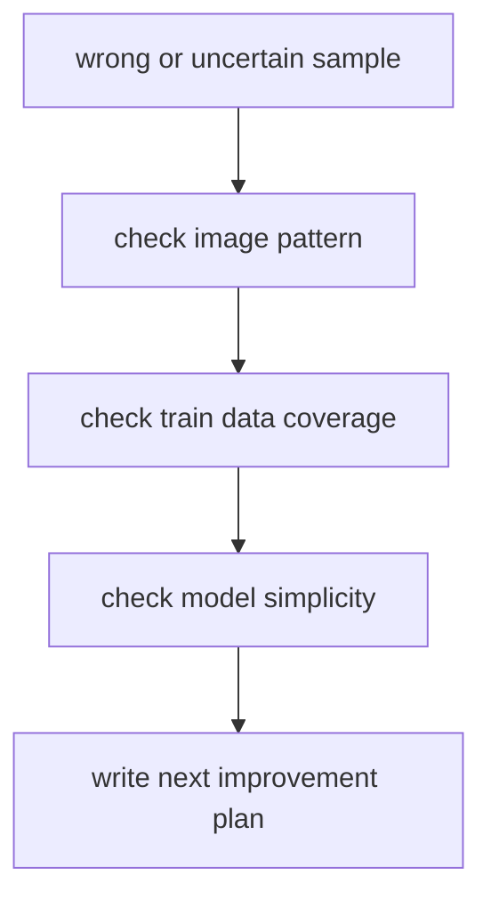

# P7-3.2 오류 사례 분석

> Section ID: `P7-3.2`
> Version: `v2026.07.05`

P7-3.1에서는 작은 이미지 분류기 하나를 학습하고, test 정확도가 `0.667`로 끝나는 장면을 확인했습니다. 여기서 중요한 것은 점수가 낮았다는 사실 자체보다, `왜 틀렸는가`를 프로젝트 문서에 남기는 일입니다.

이미지 분류 프로젝트는 특히 이 단계가 중요합니다. 같은 정확도라도 어떤 이미지에서 틀렸는지에 따라 다음 개선 방향이 완전히 달라질 수 있기 때문입니다.

오류 사례 분석의 목적은 틀렸다는 사실을 적는 것이 아니라, 다음 반복에서 무엇을 바꿔야 할지 좁혀 가는 것이다.

## 이 절의 범위

이 절은 다음 질문에 답합니다.

- 이미지 분류 프로젝트에서 오류 사례(error case)는 왜 따로 봐야 하는가?
- `틀렸다`는 기록만으로는 왜 부족한가?
- 애매한 이미지, 데이터 부족, 표현 한계를 어떻게 문서로 남길 수 있는가?

이 절은 다음 내용은 깊게 다루지 않습니다.

- confusion matrix의 전체 계산
- 시각 설명 가능성(explainability) 기법
- saliency map과 feature visualization

이 절에서는 오류 사례를 프로젝트 회고로 남기는 최소 감각만 다룹니다. 더 다양한 평가 축과 기록 방식은 P7-4.2 토큰화와 평가, P7-7.2 실패 기록과 개선 계획에서 다시 이어지며, 설명 가능성 기법의 본격 구현은 현재 본편 범위 밖으로 둡니다.

## 이 절의 목표

- 틀린 예측 하나를 가지고도 프로젝트 회고를 작성할 수 있습니다.
- 점수와 사례를 함께 읽어야 하는 이유를 설명할 수 있습니다.
- 개선 방향을 `데이터`, `모델`, `입력 표현`으로 나누어 정리할 수 있습니다.

## 이번 프로젝트의 오류 사례

P7-3.1에서 test 셋의 세 번째 샘플은 다음처럼 생겼습니다.

```text
0 1 1 0
0 1 1 0
1 1 1 1
0 0 0 0
```

이 패턴은 위쪽 두 줄만 보면 세로 막대처럼 보이지만, 세 번째 줄은 가로 막대 요소를 강하게 포함합니다. 즉, 이 샘플은 `세로`와 `가로`가 섞인 혼합 패턴입니다.

모델 출력도 그 애매함을 그대로 드러냈습니다.

```text
test_probs =
[[0.997 0.003]
 [0.003 0.997]
 [0.5   0.5  ]]
```

세 번째 샘플에서 두 클래스 확률이 정확히 반반에 가깝다는 점이 중요합니다.

먼저 다음 세 질문으로 읽으면 좋습니다.

| 질문 | 짧은 답 |
| --- | --- |
| 왜 이 샘플을 따로 보아야 하는가? | 점수보다 더 많은 검토 단서를 주기 때문 |
| 무엇을 다시 확인해야 하는가? | 원본 패턴, 학습 데이터 범위, 모델 단순성 |
| 그래서 문서에 무엇을 남기는가? | 확인된 사실, 해석 가설, 다음 개선 계획 |

## 왜 이런 오류가 생겼을까

여기서 바로 한 가지를 구분해야 합니다. 현재 예제는 작은 장난감 데이터로 만든 한 번의 실행 기록이므로, 아래 내용은 `확정된 원인`이 아니라 `다음 검토를 위한 가설 정리`로 읽는 편이 맞습니다.

이번 절에서는 원인을 세 층위(level)로 나눠 기록하는 것이 좋습니다.

| 층위(level) | 이번 사례에서의 질문 |
| --- | --- |
| 데이터(data) | 학습 데이터에 혼합 패턴이 있었는가? |
| 입력 표현(representation) | 4x4 흑백 배열만으로 충분한가? |
| 모델(model) | 현재 분류기가 너무 단순해 경계가 거칠지 않은가? |

이렇게 나누면 `모델이 멍청하다` 같은 막연한 결론 대신, 다음 수정 지점을 더 정확히 적을 수 있습니다. 특히 작은 표본에서는 한 샘플의 오분류를 곧바로 원인 확정으로 읽지 말고, review 우선순위를 올리는 변화 신호로 남겨 두는 편이 안전합니다.

여기에 한 가지를 더 붙이면 오류 사례 분석 절이 Part 7 전체의 공통 review 구조와 더 직접 연결됩니다. 오류 사례는 단순히 `틀린 이미지 1장`이 아니라, `확인된 사실`, `review가 필요한 사례`, `다음에 보강할 데이터 또는 모델 질문`을 한 묶음으로 남겨야 합니다.

| 같이 남길 기록 | 왜 필요한가 |
| --- | --- |
| 오류 샘플 ID | 다음 반복에서 같은 사례를 다시 찾기 위해서입니다. |
| review 이유 | 확률이 애매했는지, 데이터 범위가 부족했는지 분리하기 위해서입니다. |
| 다음 보강 항목 | 데이터 추가, 표현 변경, 모델 확장 중 어디를 먼저 볼지 정하기 위해서입니다. |
| 공통 회고 문장 | 다른 프로젝트와 같은 형식으로 결과를 남기기 위해서입니다. |

## 오류 분석 흐름



이 도식은 오류 사례 분석이 단순히 `틀린 샘플 표시`로 끝나지 않는다는 점을 보여 줍니다. 잘못된 예측을 본 뒤 원본 패턴, 학습 데이터 범위, 모델 단순성을 차례로 점검해야 다음 개선 계획이 프로젝트 문서 안에서 구체적으로 남습니다.

프로젝트 기록으로 남기면 순서는 다음과 같습니다.

| 단계 | 문서에 남길 것 |
| --- | --- |
| 오류 샘플 | 원본 형태 |
| 패턴 확인 | 왜 애매한가 |
| 데이터 범위 | 학습에 비슷한 사례가 있었는가 |
| 모델 한계 | 현재 구조가 읽기 어려운 부분 |
| 다음 계획 | 데이터/표현/모델 중 어디를 바꿀지 |

## 이번 사례를 해석해 보면

### 1. 데이터 관점

학습 데이터에는 `순수한 세로 막대`와 `순수한 가로 막대`만 있었습니다. 혼합 패턴은 한 번도 보지 못했습니다. 따라서 test의 세 번째 샘플은 모델 입장에서 낯선 입력입니다.

### 2. 입력 표현 관점

이미지를 16개 숫자로 평평하게(flatten) 펼치면 위치 구조가 많이 단순화됩니다. 사람이 보기에는 `위쪽은 세로, 아래쪽은 가로`라는 공간 정보가 중요하지만, 단순 선형 분류기는 이를 충분히 섬세하게 다루지 못할 수 있습니다.

### 3. 모델 관점

이번 모델은 매우 작은 softmax 분류기입니다. Part 4에서 본 깊은 층(deep layer)이나 합성곱(convolution)을 전혀 쓰지 않았기 때문에, 복합 패턴을 더 세밀하게 구분하기 어렵습니다.

## Python 예제

이번 예제의 목적은 P7-3.1의 애매한 샘플 하나를 실제 프로젝트 회고 기록으로 바꾸는 것입니다.

- 문제 상황: `test-mixed-pattern`이 왜 틀렸는지 기록한다.
- 입력(input): test 샘플별 예측 결과와 학습 데이터 패턴 목록
- 기대 출력(output): 오류 사례 기록, 원인 가설, 다음 조치 목록
- 확인할 개념:
  - 오류 사례는 샘플 ID 기준으로 다시 추적할 수 있어야 한다
  - 원인을 데이터 / 표현 / 모델 층위로 나누어 적을 수 있어야 한다
  - 다음 반복을 위한 조치가 함께 남아야 한다

```python
test_records = [
    {
        "sample_id": "test-vertical-clear",
        "pattern_name": "vertical_bar",
        "true_label": 0,
        "pred_label": 0,
        "probs": [0.997, 0.003],
        "confidence_margin": 0.994,
        "needs_error_review": False,
    },
    {
        "sample_id": "test-horizontal-clear",
        "pattern_name": "horizontal_bar",
        "true_label": 1,
        "pred_label": 1,
        "probs": [0.003, 0.997],
        "confidence_margin": 0.994,
        "needs_error_review": False,
    },
    {
        "sample_id": "test-mixed-pattern",
        "pattern_name": "mixed_bar",
        "true_label": 1,
        "pred_label": 0,
        "probs": [0.5, 0.5],
        "confidence_margin": 0.0,
        "needs_error_review": True,
        "image": [
            [0, 1, 1, 0],
            [0, 1, 1, 0],
            [1, 1, 1, 1],
            [0, 0, 0, 0],
        ],
    },
]

train_pattern_names = [
    "vertical_bar",
    "vertical_bar",
    "horizontal_bar",
    "horizontal_bar",
]

label_names = {0: "vertical_bar", 1: "horizontal_bar"}

error_case_record = None
for row in test_records:
    if row["needs_error_review"]:
        contains_mixed_pattern = row["pattern_name"] == "mixed_bar"
        seen_in_train = row["pattern_name"] in train_pattern_names
        error_case_record = {
            "sample_id": row["sample_id"],
            "true_label_name": label_names[row["true_label"]],
            "pred_label_name": label_names[row["pred_label"]],
            "probs": row["probs"],
            "confidence_margin": row["confidence_margin"],
            "contains_mixed_pattern": contains_mixed_pattern,
            "seen_in_train": seen_in_train,
            "data_hypothesis": "train data lacks mixed examples",
            "representation_hypothesis": "flattened 4x4 input loses local layout emphasis",
            "model_hypothesis": "linear softmax boundary is too simple for mixed patterns",
        }
        break

next_actions = [
    {
        "action": "add_mixed_patterns_to_train",
        "reason": "current train data only contains pure vertical/horizontal patterns",
    },
    {
        "action": "add_shifted_or_noisy_variants",
        "reason": "current examples are too clean and repetitive",
    },
    {
        "action": "try_cnn_style_followup",
        "reason": "spatial structure may matter more than flattened pixels",
    },
]

review_summary = {
    "error_case_count": sum(row["needs_error_review"] for row in test_records),
    "review_target_ids": [
        row["sample_id"] for row in test_records if row["needs_error_review"]
    ],
    "next_action_count": len(next_actions),
}

print("review_summary =", review_summary)
print("error_case_record =", error_case_record)
print("next_actions =")
for row in next_actions:
    print(row)
```

실행 결과 예시는 다음과 같습니다.

```text
review_summary = {'error_case_count': 1, 'review_target_ids': ['test-mixed-pattern'], 'next_action_count': 3}
error_case_record = {'sample_id': 'test-mixed-pattern', 'true_label_name': 'horizontal_bar', 'pred_label_name': 'vertical_bar', 'probs': [0.5, 0.5], 'confidence_margin': 0.0, 'contains_mixed_pattern': True, 'seen_in_train': False, 'data_hypothesis': 'train data lacks mixed examples', 'representation_hypothesis': 'flattened 4x4 input loses local layout emphasis', 'model_hypothesis': 'linear softmax boundary is too simple for mixed patterns'}
next_actions =
{'action': 'add_mixed_patterns_to_train', 'reason': 'current train data only contains pure vertical/horizontal patterns'}
{'action': 'add_shifted_or_noisy_variants', 'reason': 'current examples are too clean and repetitive'}
{'action': 'try_cnn_style_followup', 'reason': 'spatial structure may matter more than flattened pixels'}
```

## 이 출력은 어떻게 읽는가

이 예제에서 중요한 점은 세 가지입니다.

1. 검토 요약  
   회고 대상 샘플이 몇 개인지, 어떤 샘플 ID를 다시 볼지 바로 정리합니다.
   즉, 긴 오류 분석 문서를 다시 열기 전에 `이번 반복에서 무엇부터 다시 봐야 하는가`를 한 줄로 잡아 주는 표지 역할을 합니다.

2. 오류 사례 기록  
   단순히 `틀렸다`가 아니라, 정답/예측 클래스 이름, 확률, 학습 데이터 포함 여부, 해석 가설까지 한 묶음으로 남깁니다.

3. 다음 조치 목록  
   개선 계획을 막연한 문장으로 끝내지 않고, 바로 다음 반복에서 실행할 작업 목록으로 바꿉니다.

즉, 오류 분석 문서는 감상문이 아니라 `다음 실험을 여는 기록`이어야 합니다.

프로젝트 메모 형식으로 줄이면 다음처럼 적을 수 있습니다.

| 기록 항목 | 예 |
| --- | --- |
| fact | `test-mixed-pattern`은 오분류되었다 |
| 검토 대상 사례 | `confidence_margin = 0.0`이라 매우 애매했다 |
| 다음 조치 | `mixed pattern을 train에 추가해 다시 확인한다` |
| 다음 질문 | `공간 구조를 더 읽는 CNN이 필요한가` |

이 표가 있으면 오류 사례 분석 절이 `사실 -> 검토 사례 -> 다음 보강 질문` 구조로 먼저 읽힙니다.

## 회고 문장 예시

이 프로젝트의 오류 사례 회고는 다음처럼 정리할 수 있습니다.

> test 셋의 세 번째 이미지에서는 세로 막대와 가로 막대 패턴이 동시에 나타나 모델이 두 클래스를 거의 동일한 확률로 보았다. 현재 학습 데이터에는 이런 혼합 패턴이 없었으므로, 이번 결과는 데이터 범위 부족이나 모델 단순화를 먼저 의심해 볼 신호로 읽을 수 있다. 다음 반복에서는 혼합 패턴을 더 추가하거나, 공간 구조를 더 잘 읽는 CNN 계열 모델로 확장한 뒤 같은 샘플을 다시 확인하는 방향을 검토할 수 있다.

이 문단에서 독자가 익혀야 할 형식은 다음 네 가지입니다.

- 어떤 샘플이 문제였는가
- 왜 애매했는가
- 원인을 어느 층위에서 해석하는가
- 다음에 무엇을 바꿀 것인가

## 실무에서 왜 중요한가

실제 이미지 프로젝트에서도 이 원리는 그대로 남습니다.

- 의료 영상에서는 경계가 애매한 사례가 중요합니다.
- 공장 검사에서는 긁힘과 얼룩이 동시에 보이는 이미지가 중요합니다.
- 자율주행에서는 가려진 표지판처럼 `혼합 정보`가 들어온 사례가 중요합니다.

즉, 잘 맞춘 이미지보다 `애매하게 틀린 이미지`가 프로젝트를 더 많이 가르쳐 줍니다.

이 점 때문에 이미지 프로젝트 문서에서는 성공 사례 모음보다 `대표 오류 사례 1~2개`를 남기는 편이 더 유익합니다.

## 다음 개선 계획 예시

이번 프로젝트라면 다음 정도의 개선 계획을 적는 것이 적절합니다.

- 혼합 패턴 이미지를 학습 데이터에 추가한다.
- 순수 흑백 패턴보다 약간의 위치 변형을 포함한 데이터를 만든다.
- 단순 선형 분류기 대신 CNN 구조 예시를 후속 실습으로 연결한다.
- 정확도만이 아니라 `애매한 확률 출력` 샘플 수를 함께 기록한다.

## 다음 프로젝트와의 연결

이 절의 오류 분석 습관은 텍스트 분류 프로젝트로 그대로 이어집니다. 텍스트에서도 `왜 틀렸는가`를 보려면 결국 다음을 봐야 합니다.

- 토큰이 훈련 어휘(vocabulary)에 있었는가?
- 문장 길이와 표현 방식이 달랐는가?
- OOV(out-of-vocabulary) 토큰이 많았는가?

이 질문이 바로 P7-4.2 토큰화와 평가로 이어집니다.

## 이 절에서 기억할 관점

- 오류 사례는 프로젝트 문서의 핵심 자산입니다.
- 틀린 이유를 검토할 때는 데이터, 입력 표현, 모델 구조로 나누어 가설을 적는 것이 좋습니다.
- 애매한 확률 출력은 중요한 단서입니다.
- 이미지 프로젝트의 다음 개선은 보통 `데이터 추가`와 `모델 구조 확장`으로 이어집니다.

## 체크리스트

- 틀린 샘플을 원문 형태로 다시 보여 줄 수 있는가?
- 오류 원인을 데이터 / 표현 / 모델로 나누어 적을 수 있는가?
- 다음 반복에서 무엇을 먼저 바꿀지 적을 수 있는가?
- 점수와 사례가 함께 남아 있는가?

## 출처와 참고 자료

이 절의 오류 사례는 P7-3.1의 자체 장난감 이미지 데이터를 바탕으로 정리한 프로젝트 회고입니다.
