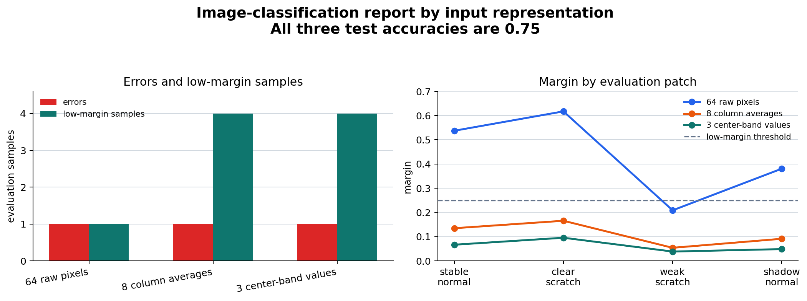

# P7-3.3 Recompare Input Representations with a Classifier

> Section ID: `P7-3.3`
> Version: `v2026.08.01`

Use an actual classifier to compare representations rather than treating an architecture name as evidence. Keep the label and evaluation cases fixed while changing the representation, then inspect which cases are recovered or newly wrong.

## Representation is an experiment variable

| Record | Purpose |
| --- | --- |
| Representation variant | States what input form changed. |
| Fixed evaluation cases | Prevents a score difference from coming from different rows. |
| Recovered error | Identifies a case helped by the representation. |
| New error | Prevents improvement claims from hiding regressions. |
| Next boundary case | States what example or feature is needed next. |

The experiment should end with a fact–interpretation–next-question note. A better score may show that one encoding exposes a useful relation, but it does not prove that the representation is universally preferable.

The learner should keep three things fixed: the task label, the train/test split, and the classifier settings. Only then can a changed error or margin be attributed to the input representation rather than a different evaluation condition.

## Learning questions and criteria

- What spatial detail is retained and discarded by each representation?
- Why can a representation with the same accuracy deserve a different review priority?
- Which samples are errors, and which correct samples are nevertheless close to the decision boundary?

You have completed the comparison when the project note names the representation, its input shape, its error cases, its low-margin cases, and a concrete next data question.

## Run three representations on the same patches

The input is the same [`p7-3-surface-patches.csv`](../../../assets/part-07/chapter-03/p7-3-surface-patches.csv){ .csv-preview } used in P7-3.1. Compare 64 raw pixels, eight column averages, and a three-value center-band profile. The latter representations retain progressively less spatial information.

```python
import csv
from pathlib import Path
import numpy as np
from sklearn.linear_model import LogisticRegression
from sklearn.metrics import accuracy_score

rows = list(csv.DictReader(Path("docs/assets/part-07/chapter-03/p7-3-surface-patches.csv").open(encoding="utf-8")))
pixel_columns = [name for name in rows[0] if name.startswith("pixel_")]
train_rows = [row for row in rows if row["split"] == "train"]
test_rows = [row for row in rows if row["split"] == "test"]
def pixels(selected):
    return np.array([[float(row[column]) for column in pixel_columns] for row in selected])
def column_profile(matrix):
    return matrix.reshape(len(matrix), 8, 8).mean(axis=1)
def center_band_profile(matrix):
    images = matrix.reshape(len(matrix), 8, 8)
    return np.column_stack([images[:, :, 3:5].mean(axis=(1, 2)), images[:, :, :3].mean(axis=(1, 2)), images[:, :, 5:].mean(axis=(1, 2))])

raw_train, raw_test = pixels(train_rows), pixels(test_rows)
y_train = np.array([int(row["label"]) for row in train_rows])
y_test = np.array([int(row["label"]) for row in test_rows])
representations = {"64 raw pixels": (raw_train, raw_test), "8 column averages": (column_profile(raw_train), column_profile(raw_test)), "3 center-band values": (center_band_profile(raw_train), center_band_profile(raw_test))}
for name, (X_train, X_test) in representations.items():
    model = LogisticRegression(max_iter=1000, random_state=7).fit(X_train, y_train)
    predictions, probabilities = model.predict(X_test), model.predict_proba(X_test)
    margins = np.abs(probabilities[:, 1] - probabilities[:, 0])
    errors = [row["sample"] for row, actual, predicted in zip(test_rows, y_test, predictions) if actual != predicted]
    low_margin = [row["sample"] for row, margin in zip(test_rows, margins) if margin < .25]
    print({"representation": name, "train_shape": tuple(X_train.shape), "test_accuracy": round(float(accuracy_score(y_test, predictions)), 3), "errors": errors, "low_margin": low_margin})
```

All three representations obtain `0.750` on the four evaluation patches, and all miss the weak-scratch patch. Yet raw pixels leave only that patch below the `.25` margin threshold; column averages and center-band values leave all four evaluation patches at low margin. Same accuracy is therefore not the same review signal.

The report shows the two signals on separate axes. Accuracy is held in the title as a common fact. The left panel counts errors and low-margin samples; the right panel retains the margin of each fixed evaluation patch.



| Representation | Test shape | Accuracy | Errors / low-margin samples | Next judgment |
| --- | ---: | ---: | --- | --- |
| 64 raw pixels | `(4, 64)` | 0.75 | `1 / 1` | Collect patches similar to the weak scratch. |
| 8 column averages | `(4, 8)` | 0.75 | `1 / 4` | Check information lost by averaging row positions. |
| 3 center-band values | `(4, 3)` | 0.75 | `1 / 4` | Check whether a center-only hypothesis is too restrictive. |

## Read an error and a low margin differently

An error is a confirmed mismatch between prediction and label under this evaluation setup. A low margin is not an error. It says the two class probabilities are close enough that the case deserves inspection, even if the current predicted label is correct.

| Signal | In this practice run | Appropriate record |
| --- | --- | --- |
| Error | Every representation misses the weak-scratch patch | Add or inspect patches near that weak-defect boundary. |
| Low margin with raw pixels | Only the weak-scratch patch | The uncertainty is localized to a plausible boundary case. |
| Low margin after compression | All four evaluation patches | The compression may remove information useful for confident separation. |

The output does not show that raw pixels are always the best feature view. There are only twelve training patches and four test patches. It does show why a project note should not declare the three views equivalent solely because their displayed accuracy matches.

## Information retained by the three views

| View | Retains | Discards | Review consequence |
| --- | --- | --- | --- |
| Raw pixels | Every brightness value at every location | No explicit spatial simplification | A localized unusual patch can remain visible. |
| Column averages | Broad change across columns | Row location and small local structure | A scratch at different row positions can look similar. |
| Center-band values | Center-versus-side intensity contrast | Most position and shape details | A defect outside the assumed band can be underrepresented. |

This is a representation decision, not an architecture contest. The classifier is deliberately held constant so the exercise can ask what information was available to it.

## Write a comparison record

```text
task and labels: normal surface (0) versus scratch warning (1)
fixed evaluation: four held-out 8x8 patches
representation: 8 column averages
common accuracy: 0.750
confirmed error: weak-scratch patch
additional review signal: all four patches have margin below 0.25
limited interpretation: row-position information may have been lost
next probe: add or synthesize scratches at several row positions
```

The phrase “may have been lost” is intentional. The small experiment supports a question about information loss, not a final causal conclusion about every column-average classifier.

## Try changes

1. Change the low-margin rule from `.25` to `.4`; note which representation adds review candidates first.
2. Move the center band from columns `3:5` to `4:6`; note whether a small positional change alters the review set.
3. Remove a representation from the comparison; note how much less specific the retrospective becomes.

4. Change only the low-margin threshold and keep the model, split, and representations fixed. Record which review candidates are added; do not call them new errors.
5. Move the center band by one column and compare its input shape, margins, and missed cases before changing any other setting.

## Project handoff checklist

Before recommending one representation, include the following evidence in the handoff:

- the exact feature construction rule and resulting training/test shapes;
- the fixed data split, label mapping, classifier, and random state;
- accuracy, error IDs, and low-margin IDs as separate fields;
- a statement of what the view removes as well as what it preserves;
- the smallest next dataset or representation change needed to test the interpretation.

This makes a later comparison reproducible. It also prevents an apparently simpler feature view from being adopted merely because a small score table did not reveal its broader uncertainty.

## Limits of this small comparison

The experiment has twelve training patches and four evaluation patches. The `0.750` figure therefore summarizes three correct labels out of four; it is not a stable estimate of field performance. The low-margin rule, `.25`, is also a chosen review threshold rather than a universal safety boundary.

These limits do not make the exercise useless. They define its purpose: learn how to preserve comparable evidence while changing one representation. A later project can use more patches, a defined acceptance threshold, group-specific slices, and repeated splits, while retaining the same record structure.

### Avoid these conclusions

- Do not conclude that raw pixels are always superior because they leave fewer low-margin cases here.
- Do not conclude that a correct low-margin prediction is an error.
- Do not conclude that a compressed view caused every uncertainty without testing another dataset or a targeted feature change.
- Do not compare accuracy after changing the split, labels, and representation at the same time.

Instead, make the narrow conclusion supported by the run: the two compressed representations produced the same displayed accuracy but a wider review set under the selected margin rule.

## Guided retrospective

Answer the following after running the code:

1. Which single weak-scratch example is missed in every representation?
2. Which representation leaves its uncertainty localized to that example?
3. What positional information is removed when eight rows are averaged into one column value?
4. Which feature construction would you test if defects could appear away from the center band?
5. What remains unknown even after the accuracy and margin comparison?

Use the answers to decide whether the next experiment should add boundary data, alter the representation, or simply collect a larger evaluation set.

## From comparison to a next experiment

Choose one decision and write its evidence boundary.

| If you observe | Reasonable next experiment | Do not claim yet |
| --- | --- | --- |
| The same weak scratch is missed in all views | Add several weak scratches around the observed intensity and position | That the classifier family cannot detect weak scratches |
| Low margins expand after averaging | Restore one positional feature or compare a less aggressive profile | That every average feature is harmful |
| A center-band shift changes review candidates | Test several bands with a fixed validation protocol | That one selected center band is the true physical defect location |

This table turns the retrospective into a falsifiable next step. Each option changes one item and names the observation that would challenge the current interpretation.

### Example review note

> The three representations each scored 0.750 on the same four patches. They all missed the weak-scratch case. Raw pixels marked only that case as low margin, while the two reduced views marked all four. The next experiment will add weak scratches at varied row positions before recommending a compressed feature view. This result does not establish a general ranking of classifiers.

The note retains the shared result, the changed review signal, the proposed action, and the limit on the conclusion.

### Final learning check

Before closing the section, verify all of the following:

- the classifier and random state stayed fixed across the three views;
- each accuracy used exactly the same four evaluation patches;
- the weak-scratch error is named rather than hidden inside the aggregate;
- low-margin but correct patches are recorded separately from errors;
- the next experiment changes one representation or data condition at a time.

These checks turn a score comparison into a reproducible learning record.

Keep the CSV sample IDs with the record so a reviewer can reopen the same patch.
Keep the margin threshold with the record so later comparisons use the same review rule.

## Sources and references

- [scikit-learn LogisticRegression](https://scikit-learn.org/stable/modules/generated/sklearn.linear_model.LogisticRegression.html){: target="_blank" rel="noopener noreferrer" }

## Checklist

| Check | Question to answer |
| --- | --- |
| Fixed label | Did the task target remain unchanged? |
| Fixed test cases | Did representations use the same evaluation examples? |
| Recovered case | Which error improved? |
| New case | Which error appeared after the change? |
| Next data need | Which boundary example would test the interpretation? |

## Final handoff

Keep the split, classifier setting, and margin threshold fixed when comparing representations.
Report both the weak-scratch error and any new shadow-normal regression.
The small synthetic exercise does not establish production performance.
Use the same named samples in the next representation comparison.

## Sources and references

This section uses book-created practice examples.
