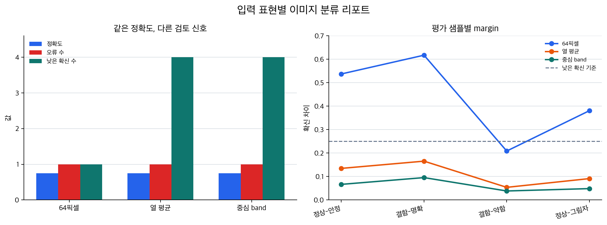

# P7-3.3 실제 분류기로 입력 표현을 다시 비교하기

Section ID: `P7-3.3`
Version: `v2026.07.23`

P7-3.1과 P7-3.2에서는 이미지 패치 프로젝트를 `입력 모양(shape)`, `라벨(label)`, `예측`, `오류 사례`로 읽었습니다. 이제 같은 데이터를 실제 분류기(classifier)에 넣어, 입력 표현을 바꾸면 정확도뿐 아니라 확신 차이와 검토 대상 샘플이 어떻게 달라지는지 확인합니다.

여기서 목표는 이미지 분류 성능을 높이는 것이 아닙니다. 같은 8x8 패치라도 `64개 픽셀을 그대로 펼친 입력`, `열 평균으로 줄인 입력`, `중심 band만 본 입력`은 서로 다른 프로젝트 기록을 남깁니다. 점수가 같아 보여도 어떤 표현이 더 불안한지, 어떤 샘플을 다시 봐야 하는지는 달라질 수 있습니다.

## 같은 이미지, 다른 입력 표현

- 실제 분류기를 붙이면 입력 구조 기록이 어떻게 더 구체화되는가?
- 같은 정확도라도 확신 차이(margin)는 왜 다르게 읽어야 하는가?
- 표현을 줄였을 때 오류 사례와 추가 검토 대상은 어떻게 남겨야 하는가?

핵심은 `모델을 하나 더 붙였다`가 아니라, 입력 표현을 바꾸면 프로젝트 문서에 남길 검토 신호도 바뀐다는 점입니다. 이미지 프로젝트에서 입력 구조는 모델 이름 앞에 놓이는 판단입니다. 어떤 표현을 만들었는지, 그 표현이 어떤 실패를 흐리게 만들었는지 함께 적어야 합니다.

## 판단 기준

- 8x8 이미지 패치를 실제 scikit-learn 분류기의 입력으로 바꿀 수 있습니다.
- 정확도가 같아도 확신 차이와 검토 대상 샘플이 달라질 수 있음을 설명할 수 있습니다.
- 입력 표현 축소가 공간 정보를 얼마나 잃는지 프로젝트 회고 문장으로 남길 수 있습니다.

## 입력 파일

- 표면 패치 파일: [`p7-3-surface-patches.csv`](../../../assets/part-07/chapter-03/p7-3-surface-patches.csv){ .csv-preview }
- 한 행의 의미: `8x8 grayscale 표면 패치 하나`
- 주요 열:
  - `split`: 학습용 또는 평가용 구분
  - `sample`: 샘플 ID
  - `pattern_name`: 사람이 읽는 패턴 이름
  - `label`: `0`은 정상 표면, `1`은 스크래치 경고
  - `pixel_00`부터 `pixel_77`: 8x8 픽셀 값

이 파일은 이미 P7-3.1에서 사용한 입력입니다. 이번 절에서는 같은 파일을 다시 쓰되, 실제 분류기에 넣을 표현을 여러 방식으로 바꿔 봅니다.

| 표현 | 입력 차원 | 무엇을 보존하는가 | 무엇을 잃기 쉬운가 |
| --- | ---: | --- | --- |
| 64개 픽셀 | 64 | 각 위치의 밝기 값 | 작은 데이터에서는 위치별 잡음까지 그대로 들어갈 수 있음 |
| 열 평균 | 8 | 세로 방향 변화의 대략적 흔적 | 행별 위치와 국소 패턴 |
| 중심 band | 3 | 가운데 결함 후보 영역과 주변 평균 차이 | 세부 위치와 패턴 모양 |

## Python 예제

예제는 scikit-learn의 `LogisticRegression`을 사용합니다. 로지스틱 회귀(logistic regression)는 이름에 `regression`이 들어가지만, 여기서는 정상 표면과 스크래치 경고를 나누는 이진 분류기로 씁니다. 이 절의 관심은 알고리즘 상세가 아니라, 입력 표현을 바꿨을 때 같은 평가 샘플이 어떻게 다른 확신 차이를 남기는지입니다.

- 문제 상황: 8x8 표면 패치를 실제 분류기에 넣고 표현별 결과 기록을 비교한다.
- 입력: 같은 CSV에서 읽은 학습/평가 패치
- 조작할 값: `representations`에 넣는 입력 표현 함수
- 관찰할 출력: 입력 shape, 평가 정확도, 오류 샘플, 낮은 확신 샘플

```python
import csv
from pathlib import Path

import numpy as np
from sklearn.linear_model import LogisticRegression
from sklearn.metrics import accuracy_score

data_path = Path("docs/assets/part-07/chapter-03/p7-3-surface-patches.csv")
rows = list(csv.DictReader(data_path.open(encoding="utf-8")))
pixel_columns = [name for name in rows[0] if name.startswith("pixel_")]

train_rows = [row for row in rows if row["split"] == "train"]
test_rows = [row for row in rows if row["split"] == "test"]

def pixel_matrix(selected_rows):
    return np.array(
        [[float(row[column]) for column in pixel_columns] for row in selected_rows],
        dtype=float,
    )

def column_profile(matrix):
    # 8x8 공간을 열 평균 8개로 줄이면 세로 결함의 큰 흐름만 남는다.
    images = matrix.reshape(len(matrix), 8, 8)
    return images.mean(axis=1)

def center_band_profile(matrix):
    # 가운데 결함 후보 영역과 양쪽 주변 밝기만 비교하는 강한 축약 표현이다.
    images = matrix.reshape(len(matrix), 8, 8)
    center = images[:, :, 3:5].mean(axis=(1, 2))
    left = images[:, :, :3].mean(axis=(1, 2))
    right = images[:, :, 5:].mean(axis=(1, 2))
    return np.column_stack([center, left, right])

raw_train = pixel_matrix(train_rows)
raw_test = pixel_matrix(test_rows)
y_train = np.array([int(row["label"]) for row in train_rows])
y_test = np.array([int(row["label"]) for row in test_rows])

representations = {
    "64개 픽셀 그대로": (raw_train, raw_test),
    "열 평균 8개": (column_profile(raw_train), column_profile(raw_test)),
    "중심 band 3개": (center_band_profile(raw_train), center_band_profile(raw_test)),
}

experiment_summaries = []
sample_records = []

for representation_name, (x_train, x_test) in representations.items():
    model = LogisticRegression(max_iter=1000, random_state=7)
    model.fit(x_train, y_train)

    predictions = model.predict(x_test)
    probabilities = model.predict_proba(x_test)
    margins = np.abs(probabilities[:, 1] - probabilities[:, 0])

    errors = []
    low_margin_samples = []

    for row, actual, predicted, probability, margin in zip(
        test_rows, y_test, predictions, probabilities, margins
    ):
        record = {
            "표현": representation_name,
            "샘플": row["sample"],
            "패턴": row["pattern_name"],
            "실제": int(actual),
            "예측": int(predicted),
            "클래스별 확률": [round(float(value), 3) for value in probability],
            "확신 차이": round(float(margin), 3),
        }
        sample_records.append(record)

        if actual != predicted:
            errors.append(row["sample"])
        if margin < 0.25:
            low_margin_samples.append(row["sample"])

    experiment_summaries.append(
        {
            "표현": representation_name,
            "학습 입력 shape": tuple(x_train.shape),
            "평가 정확도": round(float(accuracy_score(y_test, predictions)), 3),
            "오류 샘플": errors,
            "낮은 확신 샘플": low_margin_samples,
        }
    )

print("표현별 실행 요약 =")
for summary in experiment_summaries:
    print(summary)

print("평가 샘플별 기록 =")
for record in sample_records:
    print(record)
```

실행하면 다음과 같은 결과를 볼 수 있습니다.

```text
표현별 실행 요약 =
{'표현': '64개 픽셀 그대로', '학습 입력 shape': (12, 64), '평가 정확도': 0.75, '오류 샘플': ['평가-결함-약함'], '낮은 확신 샘플': ['평가-결함-약함']}
{'표현': '열 평균 8개', '학습 입력 shape': (12, 8), '평가 정확도': 0.75, '오류 샘플': ['평가-결함-약함'], '낮은 확신 샘플': ['평가-정상-안정', '평가-결함-명확', '평가-결함-약함', '평가-정상-그림자']}
{'표현': '중심 band 3개', '학습 입력 shape': (12, 3), '평가 정확도': 0.75, '오류 샘플': ['평가-결함-약함'], '낮은 확신 샘플': ['평가-정상-안정', '평가-결함-명확', '평가-결함-약함', '평가-정상-그림자']}
```

같은 실행 결과를 보고서에 넣을 때는 숫자 출력만 붙이지 말고, 표현별 검토 신호를 이미지로 저장해 둡니다. 다음 리포트 이미지는 [`p7_3_input_representation_report.py`](../../../assets/part-07/chapter-03/p7_3_input_representation_report.py)가 같은 CSV를 읽어 다시 만든 결과입니다.



왼쪽 그래프는 정확도, 오류 수, 낮은 확신 샘플 수를 한 번에 보여 줍니다. 정확도는 같지만 낮은 확신 샘플 수가 표현마다 달라지는 점을 보고서 첫 장에서 바로 확인할 수 있습니다. 오른쪽 그래프는 평가 샘플별 확신 차이(margin)를 보여 줍니다. 이처럼 그림을 함께 남기면 다음 회의나 회고에서 `정확도는 같은데 왜 다시 봐야 하는가`를 더 짧게 설명할 수 있습니다.

세 표현은 모두 평가 정확도 `0.75`로 끝납니다. 하지만 같은 결과라고 읽으면 안 됩니다. 64개 픽셀을 그대로 쓴 표현에서는 낮은 확신 샘플이 `평가-결함-약함` 하나로 좁혀집니다. 반면 열 평균이나 중심 band로 줄이면 모든 평가 샘플의 확신 차이가 낮아집니다. 즉, 축약 표현은 같은 오답을 만들 뿐 아니라 정답 샘플도 더 불안하게 만듭니다.

이 차이는 프로젝트 회고에서 중요합니다. 정확도만 보면 세 표현이 같은 후보처럼 보이지만, 다음 반복에서는 다르게 적어야 합니다.

| 표현 | 회고 문장 |
| --- | --- |
| 64개 픽셀 그대로 | 약한 결함 샘플을 놓쳤으므로 비슷한 강도의 결함 데이터를 더 보강한다. |
| 열 평균 8개 | 세로 결함의 큰 흐름은 남지만 전체 확신이 낮아져, 행별 위치 정보 손실을 의심한다. |
| 중심 band 3개 | 중심 영역 가설만 남긴 강한 축약이므로, 빠른 점검 기준으로는 가능하지만 최종 판단 표현으로는 부족하다. |

## 직접 바꿔 보며 확인할 것

1. `margin < 0.25` 기준을 `margin < 0.4`로 바꿔 봅니다.
   - 관찰할 점: 어떤 표현에서 추가 검토 대상이 더 빨리 늘어나는가?

2. `center_band_profile()`에서 중심 열을 `3:5`가 아니라 `4:6`으로 바꿔 봅니다.
   - 관찰할 점: 결함 후보 영역을 조금만 옮겨도 낮은 확신 샘플이 바뀌는가?

3. `representations`에서 `열 평균 8개`를 빼고 실행해 봅니다.
   - 관찰할 점: 비교 표현이 줄어들면 회고 문장이 얼마나 덜 구체적이 되는가?

핵심은 실제 분류기를 붙인 뒤에도 `정확도 하나`로 끝내지 않는 것입니다. 프로젝트 기록에는 어떤 입력 표현을 만들었고, 그 표현이 어떤 샘플을 불안하게 만들었는지까지 남겨야 합니다.

## 체크리스트

- [ ] 이미지 패치를 실제 분류기 입력으로 바꾸는 과정에서 `shape`를 확인했는가?
- [ ] 입력 표현을 바꿨을 때 정확도 외에 확신 차이와 오류 샘플을 함께 보았는가?
- [ ] 같은 정확도라도 회고 문장이 달라질 수 있음을 설명할 수 있는가?
- [ ] 표현 축소가 공간 정보를 잃을 수 있다는 점을 다음 실험 질문으로 남겼는가?

## 출처와 참고 자료

- scikit-learn, [LogisticRegression](https://scikit-learn.org/stable/modules/generated/sklearn.linear_model.LogisticRegression.html){: target="_blank" rel="noopener noreferrer" }, 확인일: 2026-07-23.
