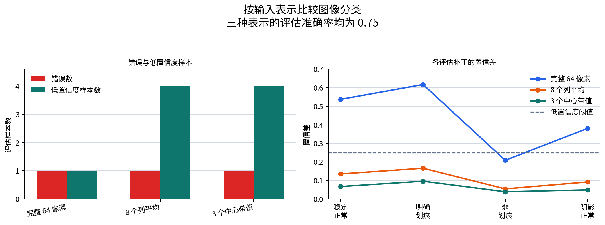

# P7-3.3 用实际分类器重新比较输入表示

> Section ID: `P7-3.3`
> Version: `v2026.08.01`

实际分类器比较应保存 `feature_view`、`classifier`、`train_setting`、`prediction_change`、`error_case` 和 `model_choice_note`。即使使用同一数据，输入表示改变也会改变模型选择和复核的含义。

P7-3.1 与 P7-3.2 已把图像补丁项目读成输入形状、标签、预测和错误案例。本节把同一数据送入实际分类器，检查表示变化如何同时改变准确率、置信差和待审查样本。

目标不是提高图像分类性能。相同 `8×8` 补丁可以表示为完整 64 像素、列平均或只看中心带；即使得分相同，不稳定的样本和需要再次查看的原因也会不同。

## 相同图像，不同输入表示

- 接入实际分类器后，输入结构记录如何变得更具体？
- 为什么相同准确率仍要用不同方式阅读置信差？
- 缩减表示后，如何保存错误与额外审查样本？

重点不是“又加了一个模型”，而是改变表示会改变项目文档中的复核信号。图像项目中，输入表示的选择在模型名称之前；应同时写明表示保留了什么、可能模糊了什么失败。

## 判断标准

- 能把 `8×8` 图像补丁转换为实际 scikit-learn 分类器输入。
- 能说明相同准确率下置信差与审查样本仍会不同。
- 能把表示缩减可能丢失的空间信息写成项目回顾句。

## 输入文件

- 表面补丁：[`p7-3-surface-patches.csv`](../../../assets/part-07/chapter-03/p7-3-surface-patches.csv){ .csv-preview }
- 一行含义：一个 `8×8` 灰度表面补丁。
- `split`：训练或评估划分。
- `sample`：样本 ID。
- `pattern_name`：人可读的模式名称。
- `label`：`0` 为正常表面，`1` 为划痕警告。
- `pixel_00` 至 `pixel_77`：`8×8` 像素值。

该文件已在 P7-3.1 使用。本节再次使用它，但以多种方式构造实际分类器的输入。

| 表示 | 输入维度 | 保留的内容 | 容易丢失的内容 |
| --- | ---: | --- | --- |
| 完整 64 像素 | 64 | 每个位置的亮度。 | 小数据中也会保留位置噪声。 |
| 8 个列平均 | 8 | 纵向变化的大致痕迹。 | 行位置与局部模式。 |
| 3 个中心带值 | 3 | 中央候选区域与两侧平均差。 | 细节位置和图案形状。 |

## Python 示例

示例使用 scikit-learn 的 `LogisticRegression`。虽然名称含有 regression，它在这里是区分正常表面与划痕警告的二元分类器。重点不是算法细节，而是相同评估样本如何在不同表示下留下不同置信差。

- 问题：用实际分类器比较 `8×8` 表面补丁的表示结果。
- 输入：同一 CSV 的训练与评估补丁。
- 可修改项：`representations` 中的表示函数。
- 输出：输入形状、评估准确率、错误样本和低置信度样本。

```python
import csv
from pathlib import Path

import numpy as np
from sklearn.linear_model import LogisticRegression
from sklearn.metrics import accuracy_score

data_path = Path("docs/assets/part-07/chapter-03/p7-3-surface-patches.csv")
rows = list(csv.DictReader(data_path.open(encoding="utf-8")))
pixel_columns = [name for name in rows[0] if name.startswith("pixel_")]
train_rows = [row for row in rows if row["split"] == "train"]
test_rows = [row for row in rows if row["split"] == "test"]

def pixel_matrix(selected_rows):
    return np.array([[float(row[column]) for column in pixel_columns] for row in selected_rows], dtype=float)

def column_profile(matrix):
    return matrix.reshape(len(matrix), 8, 8).mean(axis=1)

def center_band_profile(matrix):
    images = matrix.reshape(len(matrix), 8, 8)
    center = images[:, :, 3:5].mean(axis=(1, 2))
    left = images[:, :, :3].mean(axis=(1, 2))
    right = images[:, :, 5:].mean(axis=(1, 2))
    return np.column_stack([center, left, right])

raw_train, raw_test = pixel_matrix(train_rows), pixel_matrix(test_rows)
y_train = np.array([int(row["label"]) for row in train_rows])
y_test = np.array([int(row["label"]) for row in test_rows])
representations = {
    "完整 64 像素": (raw_train, raw_test),
    "8 个列平均": (column_profile(raw_train), column_profile(raw_test)),
    "3 个中心带值": (center_band_profile(raw_train), center_band_profile(raw_test)),
}
summaries, sample_records = [], []
for name, (x_train, x_test) in representations.items():
    model = LogisticRegression(max_iter=1000, random_state=7).fit(x_train, y_train)
    predictions, probabilities = model.predict(x_test), model.predict_proba(x_test)
    margins = np.abs(probabilities[:, 1] - probabilities[:, 0])
    errors, low_margin = [], []
    for row, actual, predicted, probability, margin in zip(test_rows, y_test, predictions, probabilities, margins):
        sample_records.append({"表示": name, "样本": row["sample"], "实际": int(actual), "预测": int(predicted),
                               "类别概率": [round(float(value), 3) for value in probability], "置信差": round(float(margin), 3)})
        if actual != predicted: errors.append(row["sample"])
        if margin < .25: low_margin.append(row["sample"])
    summaries.append({"表示": name, "训练输入形状": tuple(x_train.shape), "评估准确率": round(float(accuracy_score(y_test, predictions)), 3),
                      "错误样本": errors, "低置信度样本": low_margin})
print("表示运行摘要 =")
for summary in summaries: print(summary)
print("评估样本记录 =")
for record in sample_records: print(record)
```

当前运行得到以下摘要。

```text
完整 64 像素：训练形状 (12, 64)，评估准确率 0.75，错误为弱划痕，低置信度为弱划痕。
8 个列平均：训练形状 (12, 8)，评估准确率 0.75，错误为弱划痕，四个样本都低置信度。
3 个中心带值：训练形状 (12, 3)，评估准确率 0.75，错误为弱划痕，四个样本都低置信度。
```

把结果放进报告时，不应只贴数字。应保存一张将错误数、低置信度样本数和各样本置信差分开的图表。它由与正文相同数据生成。



图表先固定共同条件：三种表示的评估准确率都为 `0.75`。左侧只显示错误数与低置信度数，右侧显示每个评估样本的置信差，因此不会把准确率与样本计数误读为同一个柱高。

三种表示都有 `0.75` 准确率，但不应把它们当作同一候选。完整 64 像素表示只把弱划痕标为低置信度；列平均与中心带缩减后，全部评估样本的置信差都变低。缩减表示不仅产生同一错误，也使原本正确的样本更不稳定。

| 输入表示 | 评估形状 | 共同准确率 | 错误数 / 低置信度数 | 应留下的判断 |
| --- | ---: | ---: | ---: | --- |
| 完整 64 像素 | `(4, 64)` | `0.75` | `1 / 1` | 优先复核一个弱缺陷。 |
| 8 个列平均 | `(4, 8)` | `0.75` | `1 / 4` | 检查行位置损失后所有样本的判断余量。 |
| 3 个中心带值 | `(4, 3)` | `0.75` | `1 / 4` | 检查中央假设是否不足以作最终判断。 |

## 回顾句应如何不同

| 表示 | 有限的回顾句 |
| --- | --- |
| 完整 64 像素 | 弱缺陷被遗漏，应补充相近强度的数据。 |
| 8 个列平均 | 纵向大趋势仍在，但整体置信差变低，应检查行位置丢失。 |
| 3 个中心带值 | 强缩减只保留中心假设，可用于快速检查，却不足以作为最终表示。 |

准确率相同并不代表项目回顾相同。报告还要保存哪些正确样本变得不稳定，以及下一次比较应固定哪些参考。

## 直接修改并观察

1. 将 `margin < .25` 改为 `margin < .4`，记录哪种表示的额外审查样本增长最快。
2. 将 `center_band_profile()` 的中心列从 `3:5` 改为 `4:6`，观察候选区域轻微移动是否改变低置信度样本。
3. 从 `representations` 删除列平均表示，比较回顾句是否变得不够具体。
4. 在三种准确率都是 `0.75` 时，分别用一句话写错误数和低置信度数。
5. 固定弱划痕与阴影正常，之后每次只改变一个表示规则。

核心是：接入实际分类器后仍不能只用一个准确率结束。项目记录需要说明构造了什么输入表示，以及它使哪些样本变得不稳定。

## 学习检查表

- [ ] 是否在转换图像补丁为分类器输入时检查了形状？
- [ ] 是否同时查看准确率、置信差和错误样本？
- [ ] 是否能解释错误数与低置信度数是不同的复核信号？
- [ ] 是否能说明相同准确率仍可能产生不同回顾句？
- [ ] 是否把空间信息损失写成下一次实验问题？
- [ ] 是否把图表中的计数与准确率分开阅读？
- [ ] 是否保留了固定回归样本？
- [ ] 是否把本练习限制在小型合成数据范围内？

## 把表示比较写成可复核结论

表示比较的结论应同时包含共同结果、不同信号和下一问题。只写“准确率相同”会丢失本节最重要的观察。

| 结论组成 | 本例的写法 |
| --- | --- |
| 共同结果 | 三种表示在四个评估补丁上都是 `0.75`。 |
| 不同信号 | 缩减表示把四个样本都变成低置信度。 |
| 已确认错误 | 弱划痕在三种表示下仍被遗漏。 |
| 有限解释 | 位置缩减可能降低判断余量，但当前数据不足以证明原因。 |
| 下一问题 | 固定回归补丁，比较数据补充或不同空间表示。 |

这里的“低置信度”是按当前代码的 `margin < .25` 阈值产生的审查信号。若阈值改变，样本数也会改变；因此报告应同时保存阈值，而不是把它当作自然事实。

### 哪些内容必须保持固定

| 固定项 | 为什么固定 |
| --- | --- |
| 训练/评估划分 | 避免把数据差异误当成表示差异。 |
| 标签映射 | 避免任务定义悄悄变化。 |
| 分类器与随机状态 | 让本轮只比较表示。 |
| 低置信度阈值 | 让审查计数可比较。 |
| 弱划痕与阴影正常 | 让恢复和新误报都能被看见。 |

如果一次运行同时替换分类器、表示和数据，图表即使变化也无法归因。本节的三个表示正因为共享同一训练与评估条件，才可以把差异读成表示相关的复核信号。

## 小结

实际分类器不会取消输入结构的责任。它让形状、表示、概率、边际和错误样本更容易被具体记录。

选择下一次表示时，应先看哪些样本稳定、哪些样本变得不稳定，再决定是否需要数据补充、空间特征或不同模型族。

### 结束前的问题

1. 哪一种表示把正确样本也变为低置信度？
2. 为什么这一变化不能由共同准确率看出？
3. 若弱划痕恢复但阴影正常变错，报告应如何写？
4. 哪个表示规则是本次唯一改变的组件？
5. 图表、代码和表格是否使用同一阈值？
6. 结论是否保留了数据规模与范围限制？

记录不同信号。
固定比较条件。

## 来源与参考

- scikit-learn, [LogisticRegression](https://scikit-learn.org/stable/modules/generated/sklearn.linear_model.LogisticRegression.html){: target="_blank" rel="noopener noreferrer" }，确认日期：2026-07-23。
