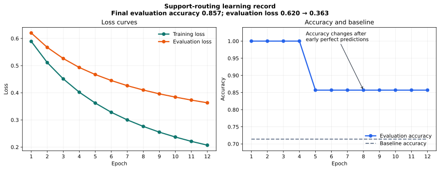

# P7-4.1 Reading Loss, Metrics, and Error Cases Together

> Section ID: `P7-4.1`
> Version: `v2026.08.01`

Loss, metrics, and individual error cases answer different questions. Read them together: loss describes the optimization signal, a metric summarizes task performance, and an error case identifies what a person should inspect next.

## Do not let one curve decide the project record

| Evidence | Question it answers |
| --- | --- |
| Training and validation loss | Is the optimization signal changing across epochs? |
| Metric | How well does the model meet the chosen task measure? |
| Error case | Which input and prediction require diagnosis? |

A lower loss does not by itself establish that every important error disappeared. A metric rise does not identify whether a minority or boundary case got worse. Preserve all three kinds of evidence in the run record.

## Reproduce a text-routing learning record

The project question is: “Should a customer inquiry go to the refund team or the delivery team?” Use [`p7-4-support-routing-dataset.csv`](../../../assets/part-07/chapter-04/p7-4-support-routing-dataset.csv){ .csv-preview } for 12 training inquiries and 7 evaluation inquiries. A majority-label baseline reaches `0.714`; the learned bag-of-words softmax model reaches `0.857` and leaves evaluation sample `평가-05` for review.

```python
import csv
from pathlib import Path
import numpy as np

rows = list(csv.DictReader(Path("docs/assets/part-07/chapter-04/p7-4-support-routing-dataset.csv").open(encoding="utf-8")))
train_rows = [row for row in rows if row["split"] == "train"]
test_rows = [row for row in rows if row["split"] == "test"]
def tokens(text): return text.split()
vocab = sorted({token for row in train_rows for token in tokens(row["text"])})
index = {token: position for position, token in enumerate(vocab)}
def vectorize(selected):
    matrix = np.zeros((len(selected), len(vocab)))
    for row_number, row in enumerate(selected):
        for token in tokens(row["text"]):
            if token in index: matrix[row_number, index[token]] += 1
    return matrix
X_train, X_test = vectorize(train_rows), vectorize(test_rows)
y_train = np.array([int(row["label"]) for row in train_rows]); y_test = np.array([int(row["label"]) for row in test_rows])
W, b = np.zeros((len(vocab), 2)), np.zeros(2)
Y = np.eye(2)[y_train]
def softmax(values):
    shifted = values - values.max(axis=1, keepdims=True)
    e = np.exp(shifted); return e / e.sum(axis=1, keepdims=True)
def loss_accuracy(X, y):
    probabilities = softmax(X @ W + b)
    return float(-np.log(probabilities[np.arange(len(y)), y] + 1e-12).mean()), float((probabilities.argmax(axis=1) == y).mean())
baseline = int(np.bincount(y_train).argmax())
baseline_accuracy = float((np.full_like(y_test, baseline) == y_test).mean())
history = []
for epoch in range(1, 13):
    probabilities = softmax(X_train @ W + b)
    W -= .35 * X_train.T @ (probabilities - Y) / len(X_train); b -= .35 * (probabilities - Y).mean(axis=0)
    train_loss, train_accuracy = loss_accuracy(X_train, y_train); eval_loss, eval_accuracy = loss_accuracy(X_test, y_test)
    history.append({"epoch": epoch, "train_loss": round(train_loss, 3), "eval_loss": round(eval_loss, 3), "train_accuracy": round(train_accuracy, 3), "eval_accuracy": round(eval_accuracy, 3)})
predictions = softmax(X_test @ W + b).argmax(axis=1)
errors = [row["sample_id"] for row, prediction, actual in zip(test_rows, predictions, y_test) if prediction != actual]
print("baseline accuracy =", round(baseline_accuracy, 3)); print("first/last epoch =", history[0], history[-1]); print("error samples =", errors)
```

In the current CSV, evaluation accuracy is `1.000` in the earliest epochs and ends at `0.857`, while evaluation loss falls from `0.620` to `0.363`. This is an important counterexample: a lower loss and a metric can move differently, and a final loss value does not erase a newly visible error. Read the `평가-05` error together with the tokens that could imply either a cancelled/refund request or a shipping-tracking request.

| Fact | Interpretation | Next question |
| --- | --- | --- |
| Baseline is 0.714 and final evaluation accuracy is 0.857. | The learned representation improves this fixed split. | Does the improvement persist across another split? |
| Evaluation loss declines while final accuracy is lower. | Aggregate confidence and the count of correct labels can move differently. | Which sample changed class as epochs continued? |
| `평가-05` remains wrong. | Its wording may mix routing signals. | Should vocabulary, labels, or boundary cases be reviewed? |

## What an epoch log records in this practice

This example uses full-batch learning deliberately. All 12 training inquiries are read, one parameter update is made, and that unit is recorded as one epoch. A production run often uses mini-batches, where an epoch contains several updates. The simplified structure makes the reading order visible.

| Log field | What it means here |
| --- | --- |
| Epoch | One pass through the 12 training inquiries. |
| Step | One full-batch update in this simplified example. |
| Train loss | How strongly training probabilities support their correct labels. |
| Evaluation loss | The same probability-sensitive quantity on held-out inquiries. |
| Evaluation accuracy | The fraction of the 7 evaluation labels predicted correctly. |
| Baseline accuracy | The majority-label comparison result, fixed at 0.714. |

The first and final entries in the current run are:

```text
epoch 1:  train loss 0.589, evaluation loss 0.620, train accuracy 1.000, evaluation accuracy 1.000
epoch 2:  train loss 0.511, evaluation loss 0.567, train accuracy 1.000, evaluation accuracy 1.000
epoch 3:  train loss 0.451, evaluation loss 0.526, train accuracy 1.000, evaluation accuracy 1.000
epoch 10: train loss 0.237, evaluation loss 0.384, train accuracy 1.000, evaluation accuracy 0.857
epoch 11: train loss 0.221, evaluation loss 0.373, train accuracy 1.000, evaluation accuracy 0.857
epoch 12: train loss 0.207, evaluation loss 0.363, train accuracy 1.000, evaluation accuracy 0.857
```

This trace is more useful than a final score alone. Training loss falls throughout; evaluation loss also falls; evaluation accuracy changes from a perfect early value to six correct out of seven. The record should trigger a sample-level review rather than the claim that lower evaluation loss necessarily means a better final routing decision.

## Read the remaining routing error

| Evaluation sample | Text | Predicted team | Actual team | Probability reading |
| --- | --- | --- | --- | --- |
| 평가-05 | `캔슬 후 송장 남아 있어요` | Delivery | Refund | The wording includes a cancellation intent but a shipping-document term; the current representation favors delivery. |

The other six evaluation rows are correct at the last epoch. This one error is not enough to diagnose tokenization, label quality, or model capacity. It is enough to make a next review item concrete.

The project note should therefore retain both a stable summary and the individual record.

```text
Question: Route each support inquiry to refund or delivery.
Training count: 12
Evaluation count: 7
Baseline accuracy: 0.714
Final evaluation accuracy: 0.857
Evaluation loss at final epoch: 0.363
Remaining error sample: 평가-05
Next review: inspect cancellation vocabulary, shipping terms, and coverage for this sentence.
```

## Do not overread a curve

| Observation | What it supports | What it does not support |
| --- | --- | --- |
| Train loss declines | Parameters fit training labels more strongly. | That every evaluation group improves. |
| Evaluation loss declines | Correct-label probabilities changed on held-out rows. | That accuracy must rise at the same time. |
| Accuracy is above baseline at the end | The fixed split improves over the majority rule. | That the routing model is ready for every inquiry. |
| One error remains | A concrete review target exists. | A confirmed root cause. |

The phrase “learning has stopped” needs evidence from more than one number. Check whether loss has flattened, whether the error set is stable or changing, whether probabilities changed, and whether the comparison split is sufficiently large for a decision.

## Recreate the same record with a library

The NumPy implementation exposes loss and update mechanics. A production-oriented implementation may instead use a text vectorizer, a log-loss classifier, and a dummy baseline. The tooling changes, but the record fields do not: preserve baseline, epoch log, evaluation metric, error samples, split, and next question.

| Component | Role in a library workflow |
| --- | --- |
| `TfidfVectorizer` | Converts training text into reproducible feature weights. |
| `DummyClassifier` | Provides a simple comparison baseline. |
| `SGDClassifier` with log loss | Updates a linear text classifier by iterations. |
| Accuracy and log loss | Preserve metric and probability-sensitive reading. |

```python
import csv
from pathlib import Path

import numpy as np
from sklearn.dummy import DummyClassifier
from sklearn.feature_extraction.text import TfidfVectorizer
from sklearn.linear_model import SGDClassifier
from sklearn.metrics import accuracy_score, log_loss

rows = list(csv.DictReader(Path("docs/assets/part-07/chapter-04/p7-4-support-routing-dataset.csv").open(encoding="utf-8")))
train_rows = [row for row in rows if row["split"] == "train"]
test_rows = [row for row in rows if row["split"] == "test"]
X_train_text = [row["text"] for row in train_rows]
X_test_text = [row["text"] for row in test_rows]
y_train = np.array([int(row["label"]) for row in train_rows])
y_test = np.array([int(row["label"]) for row in test_rows])

vectorizer = TfidfVectorizer(ngram_range=(1, 2), min_df=1)
X_train = vectorizer.fit_transform(X_train_text)
X_test = vectorizer.transform(X_test_text)
baseline = DummyClassifier(strategy="most_frequent").fit(X_train, y_train)
model = SGDClassifier(loss="log_loss", penalty="l2", alpha=0.0001, learning_rate="constant", eta0=0.15, random_state=7, shuffle=False)
classes = np.array([0, 1])
history = []
for epoch in range(1, 13):
    model.partial_fit(X_train, y_train, classes=classes)
    train_probabilities = model.predict_proba(X_train)
    eval_probabilities = model.predict_proba(X_test)
    history.append({
        "epoch": epoch,
        "train_loss": round(float(log_loss(y_train, train_probabilities, labels=classes)), 3),
        "eval_loss": round(float(log_loss(y_test, eval_probabilities, labels=classes)), 3),
        "train_accuracy": round(float(accuracy_score(y_train, train_probabilities.argmax(axis=1))), 3),
        "eval_accuracy": round(float(accuracy_score(y_test, eval_probabilities.argmax(axis=1))), 3),
    })

predictions = model.predict(X_test)
errors = [row["sample_id"] for row, prediction, actual in zip(test_rows, predictions, y_test) if prediction != actual]
print({
    "vectorizer": "TfidfVectorizer",
    "model": "SGDClassifier(log_loss)",
    "vocabulary_size": len(vectorizer.get_feature_names_out()),
    "baseline_accuracy": round(float(accuracy_score(y_test, baseline.predict(X_test))), 3),
    "final_epoch": history[-1],
    "error_samples": errors,
})
```

On the current small fixed split, this library run also keeps baseline accuracy at `0.714`, reaches final evaluation accuracy `0.857`, and leaves `평가-05` as the error. Its probabilities and losses differ from the NumPy bag-of-words implementation because the representation and optimization procedure differ. That difference is expected; the comparison remains meaningful because both runs preserve the same split, baseline, epoch fields, and sample-level review.

The library does not remove the need for error analysis. It makes the same question easier to repeat on a larger dataset, but it cannot decide whether `평가-05` is a vocabulary, coverage, data-range, or label-policy issue.

## Read the learning curve before choosing the next action



The chart gives the chronological record that a final metric hides. Evaluation accuracy is perfect in the earliest epochs and finishes at `0.857`; at the same time, evaluation loss falls from `0.620` to `0.363`. Therefore, neither of these shortcuts is safe: “loss fell, so every routing decision improved” or “accuracy later fell, so learning stopped helping.”

| Evidence | Epoch 1 | Epoch 12 | Bounded interpretation |
| --- | ---: | ---: | --- |
| Evaluation loss | `0.620` | `0.363` | The model assigns stronger correct-label probability in aggregate on this fixed split. |
| Evaluation accuracy | `1.000` | `0.857` | One of seven routing decisions changes from correct to incorrect. |
| Remaining error | none | `평가-05` | A mixed cancellation-and-shipping expression needs sample-level review. |

```mermaid
--8<-- "assets/part-07/chapter-04/p7-4-1-training-read-flow-en.mmd"
```

The next action is not automatically more epochs. Compare the changing error set, inspect the words present in the remaining sentence, and decide whether the next controlled change concerns vocabulary coverage, label policy, representation, or training data.

## Connect the log to the text-project pipeline

```mermaid
--8<-- "assets/part-07/chapter-04/p7-4-1-text-project-flow-en.mmd"
```

This simplified practice uses a full batch: all 12 training inquiries make one update, and that update is called one epoch. A mini-batch training run would have several updates in an epoch. Keep the distinction in a project record because a curve indexed by epochs cannot reveal the number of optimizer steps by itself.

| Loop term | Meaning in this practice | What to record |
| --- | --- | --- |
| Batch | All 12 training inquiries | Batch size and whether it is full-batch or mini-batch. |
| Step | One gradient-based parameter update | Optimizer setting when it can change results. |
| Epoch | One pass over the training inquiries | Train and evaluation values at the same epoch. |
| Loss | Probability-sensitive disagreement with labels | Split, loss definition, and direction of change. |
| Accuracy | Fraction of labels predicted correctly | Evaluation count and the decision rule. |

## Turn the result into a bounded project note

> On this fixed support-routing split, the majority baseline reached 0.714 and the final NumPy model reached 0.857. Evaluation loss fell from 0.620 to 0.363 while the final error set included `평가-05`. This supports a limited claim that the learned representation improves over the majority rule on these seven rows. It does not identify why the mixed cancellation-and-shipping wording remains difficult. The next review compares vocabulary coverage and similarly mixed inquiries before changing the architecture.

The note separates observed values from a causal story. A final score alone cannot tell whether an error came from tokenization, a missing training example, a label rule, or a boundary introduced by the small split.

## Experiments to vary without changing the question

1. Reduce the epoch count from 12 to 4. Record whether loss has less time to decrease and whether the error set changes.
2. Change the NumPy learning rate from `0.35` to `0.10` and `0.60`. Record stability as well as final accuracy.
3. Add a new mixed cancellation-and-shipping evaluation inquiry. Record its coverage and prediction separately from the original seven rows.
4. Change the library vectorizer from bigrams to unigrams. Compare vocabulary size, loss, and the named error sample rather than only the final metric.
5. Copy epoch 1 and epoch 12 values into one project note before writing an interpretation.

## Continue the review in P7-4.2

The sentence `평가-05` is evidence of a particular routing failure, not merely one count in an accuracy score. The next section examines token coverage and separates input evidence from model-output evidence before selecting a correction.

## Keep facts, interpretations, and decisions separate

A project log becomes misleading when it jumps from a curve to an explanation without keeping the intermediate evidence. Use three different sentences.

| Sentence type | Example for this run | What it must not claim |
| --- | --- | --- |
| Fact | Final evaluation accuracy is `0.857`; `평가-05` is wrong. | Why that inquiry is wrong. |
| Interpretation | The fixed split shows an improvement over the majority baseline. | That the improvement will generalize to all support language. |
| Decision | Inspect cancellation vocabulary and mixed-intent examples next. | That vocabulary is already the confirmed root cause. |

This distinction is especially useful with a seven-row evaluation split. A one-row change has a large effect on accuracy. The error record makes that sensitivity visible instead of hiding it behind three decimal places.

### Read score changes as counts too

| Evaluation accuracy | Count out of seven | Reading |
| ---: | ---: | --- |
| `1.000` | 7 correct | No error is visible in this small split at that epoch. |
| `0.857` | 6 correct | Exactly one sentence is wrong; retrieve its ID. |
| `0.714` | 5 correct | The majority baseline's result on this fixed split. |
| `0.000` | 0 correct | A possible metric value, but not evidence about why every decision failed. |

Never compare a count and a rate as if they were different evidence. They are two views of the same held-out rows. Record both when the evaluation set is small enough for a reader to inspect every case.

### A sample-level review table

The final record should retain the actual text with the ID. A privacy-sensitive production project would use an approved redacted form or a stable reference key; the learning purpose is to preserve retrievability.

| Sample | Visible signal to inspect | Final status | Next review use |
| --- | --- | --- | --- |
| `평가-01` | Refund progress wording | Correct | Stable refund reference. |
| `평가-02` | Tracking and delivery wording | Correct | Stable delivery reference. |
| `평가-03` | Return plus refund schedule | Correct | Mixed refund reference. |
| `평가-04` | Dispatch delay and arrival wording | Correct | Mixed delivery reference. |
| `평가-05` | Cancellation plus shipping-document wording | Incorrect | Primary regression case. |
| `평가-06` | Card approval cancellation | Correct | Cancellation vocabulary reference. |
| `평가-07` | Defective-product refund schedule | Correct | Refund-coverage reference. |

The table does not prove that any particular token caused the prediction. It tells a reviewer which comparison to make first. For example, `평가-05` can be compared with `평가-06` before adding a model family, because both contain cancellation-related meaning but have different surrounding evidence.

## Diagnose a curve with an error-set transition

For every selected epoch, create a set of error IDs. Then compare the sets instead of relying only on the metric.

```text
epoch 1 errors:  []
epoch 12 errors: [평가-05]
newly wrong:     [평가-05]
recovered:       []
still wrong:     []
```

This particular trace has an important teaching value: aggregate evaluation loss decreases while the error set gains one sample. The two measures emphasize different aspects of the probability output. Loss changes when confidence changes; accuracy changes only when the predicted class crosses a decision boundary.

| Observation | Plausible next check | Not a safe conclusion |
| --- | --- | --- |
| Loss falls and error set is unchanged | Compare confidence on correct rows and inspect whether more training is worthwhile. | Every class is equally well represented. |
| Loss falls and a new error appears | Retrieve the changed row and compare its probability vector. | Lower loss guarantees better decisions. |
| Accuracy rises but loss rises | Check which rows flipped and whether confidence became extreme. | The higher accuracy is automatically preferable. |
| Both values flatten | Check data size, variance across splits, and unresolved errors. | Training can never improve further. |

## A minimal run record for repetition

Keep this information beside an experiment, whether it was written with NumPy or a library.

```text
run ID:
dataset and split version:
text preprocessing rule:
vocabulary or feature representation:
baseline definition and score:
model and key settings:
epoch / step accounting:
train and evaluation loss:
evaluation metric and evaluation count:
error IDs before and after:
newly wrong and recovered IDs:
interpretation limited to the fixed evidence:
next controlled change:
```

The fields are deliberately plain. Their role is to allow a reader to reproduce the comparison and to distinguish a changed representation from a changed split, a changed threshold, or a changed data version.

### What can change between runs

| Changed component | Keep fixed when possible | Question the comparison answers |
| --- | --- | --- |
| Epoch count or learning rate | Dataset, split, representation, and labels | Does optimization behavior change under the same task? |
| Tokenization or vectorizer | Dataset, split, classifier family, and error IDs | Does representation alter coverage or the named error? |
| Training-data additions | Evaluation references and label policy | Does coverage recover a boundary case without a regression? |
| Model family | Data version, evaluation set, and reporting fields | Does the modeled relation add useful evidence? |
| Decision threshold | Probabilities, labels, and evaluation rows | What error trade-off does the operating rule make? |

If more than one row changes at once, label the result as an exploratory run rather than a causal comparison. It may still be useful, but it cannot isolate which modification produced the outcome.

## Questions a reviewer should ask before extending training

1. Which error IDs are unchanged, recovered, or newly wrong?
2. Does the same sentence contain tokens absent from the training vocabulary?
3. Is the label policy clear for a sentence that mentions two support themes?
4. Does another split yield the same baseline-to-model comparison?
5. Is a lower loss driven by stronger confidence on already easy cases?
6. Would more data, a representation change, or an operating-rule change test the next hypothesis most directly?

Answering these questions does not require a larger model. It requires a legible relationship between a learning trace and the cases that generated it.

## Decide what the next experiment is allowed to change

The following decision table turns the record into a small, testable follow-up rather than an open-ended request to improve the classifier.

| Symptom in the record | First bounded action | Evidence that must be retained | Follow-up question |
| --- | --- | --- | --- |
| One mixed-intent inquiry remains wrong | Add or inspect comparable mixed-intent examples | Original error ID and label policy | Is the issue coverage rather than optimization? |
| A cancellation token occurs in an error | Compare token coverage with a correct cancellation inquiry | Preprocessing rule and vocabulary version | Does the representation expose the needed distinction? |
| Error IDs change across epochs | Save before/after probabilities for each changed row | Same split and epoch identifiers | Which boundary crossing changed the metric? |
| Loss and accuracy disagree | Report both values and the error-set transition | Loss definition and decision rule | Which measure maps to the project risk? |
| A new representation improves one error | Re-run every named reference inquiry | Original and transformed input versions | Did the recovery create a regression? |

The first action is deliberately small. It lets an evaluator state whether the evidence changed before a more expensive data collection or architecture comparison begins.

### A reviewer-facing handoff note

```text
Observed: the majority baseline is 0.714; the final model is 0.857 on seven rows.
Observed: evaluation loss falls while 평가-05 becomes the final error.
Not established: whether cancellation vocabulary, shipping vocabulary, label policy, or coverage causes the error.
Next controlled comparison: retain the original seven rows and add a documented mixed-intent reference.
Decision rule: report baseline, loss, accuracy, and every recovered or newly wrong sample ID.
```

This handoff makes a later reviewer capable of challenging the conclusion. They can request another split, a clearer label rule, or a vocabulary audit without having to infer the project state from a chart alone.

## Limits of this teaching run

This example is intentionally small and synthetic. It does not estimate real customer-support performance, fairness across user groups, service-level cost, or a production routing policy. A live system also needs approved data handling, monitoring, escalation paths for uncertain cases, and evaluation on representative language.

The example still demonstrates an enduring practice: preserve the baseline, learning trace, evaluation definition, and named error examples in one record. That practice scales to a larger project even though these exact numbers do not.

### Practice: make the evidence comparison explicit

For each alteration below, predict which record fields can change and which fields must remain available for comparison.

| Alteration | Fields likely to change | Fields to preserve |
| --- | --- | --- |
| Four rather than twelve epochs | Loss trace, probabilities, error IDs | Data version, split, baseline, sample IDs. |
| Lower learning rate | Loss trajectory and possibly final decisions | Tokenization, labels, evaluation rows. |
| New mixed-intent training examples | Vocabulary, data version, error set | Original seven-row evaluation reference. |
| Unigram rather than bigram TF-IDF | Feature count, probabilities, loss | Split, classifier settings, review format. |
| A new routing threshold | Predicted labels and accuracy | Stored probabilities and true labels. |

After a run, write one fact-only sentence first. Then write one sentence beginning with “This may indicate …” and one question beginning with “Next, test whether …”. This order makes it harder to turn a chart into an unsupported causal claim.

If a new experiment improves the final score, inspect every retained reference sentence before accepting it. The improvement is incomplete if it silently makes a previously stable routing decision worse.

### Reporting rule for the next run

| Report item | Why it is included |
| --- | --- |
| Baseline and final metric | States the aggregate comparison. |
| First and final loss | Shows the probability-sensitive trajectory. |
| Evaluation count | Gives the metric its denominator. |
| Recovered and newly wrong IDs | Makes the trade-off reviewable. |
| One unresolved error | Connects the graph to the next question. |

Do not replace this table with a screenshot of a curve. The curve is useful evidence, but the named rows and fixed evaluation definition give the evidence its practical meaning.
Keep the text record with the chart in every run archive.

## Final project self-review

| Check | Question to answer |
| --- | --- |
| Baseline | Is the simple comparison score recorded? |
| Trace | Are train and evaluation loss/accuracy kept by epoch? |
| Unit | Is it clear whether an epoch contains one update or many batches? |
| Error | Is at least one remaining sentence identified by sample ID? |
| Interpretation | Are curve facts kept separate from a causal explanation? |
| Next fix | Does the note name a vocabulary, data, or evaluation check? |

## Checklist

| Check | Question to answer |
| --- | --- |
| Loss | Which split and epoch does the curve describe? |
| Metric | Is its definition appropriate for the task? |
| Error case | Which concrete example remains wrong? |
| Interpretation | What remains unproven by the curves? |
| Next question | What should be inspected or collected next? |

## Sources and references

### Final review handoff

Keep the baseline, both loss traces, the metric definition, and the named error in the same record.
Compare error IDs between selected epochs before extending training.
Treat a lower loss as probability evidence, not as proof that every routing decision improved.
Keep the seven-row split and the mixed-intent limitation visible in the next experiment.
State the next action as a test of vocabulary, coverage, label policy, or representation.
Do not infer a root cause from the curve alone.
Preserve any newly wrong row as a regression reference.
Report the count behind each small-split accuracy.
Use the same fields when reproducing the run with a library.
Keep production claims outside this synthetic teaching result.
Read the curve, metric, and sample together.

The examples are book-created practice material. For the library concepts used in the supplemental code, see the [scikit-learn text feature extraction documentation](https://scikit-learn.org/stable/modules/feature_extraction.html#text-feature-extraction), [SGDClassifier documentation](https://scikit-learn.org/stable/modules/generated/sklearn.linear_model.SGDClassifier.html), and [DummyClassifier documentation](https://scikit-learn.org/stable/modules/generated/sklearn.dummy.DummyClassifier.html).
