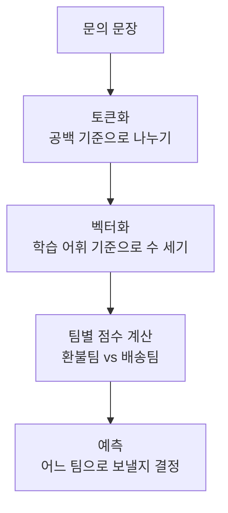

# P7-4.1 텍스트 분류 모델 목표

> Section ID: `P7-4.1`
> Version: `v2026.07.18`

이미지 프로젝트를 지나면 자연스럽게 텍스트 프로젝트로 넘어가게 됩니다. 텍스트 분류(text classification)는 LLM 이전부터 오래 쓰였고, 지금도 고객 문의 라우팅, 스팸 분류, 리뷰 분류, 장애 티켓 분류처럼 실제 운영 흐름과 바로 연결됩니다.

이번 절에서는 `고객 문의를 어느 팀으로 보내야 하는가`라는 현실적인 문제를 기준으로, 문장이 어떻게 토큰(token) 묶음으로 바뀌고 어떤 기준으로 라벨(label)이 붙는지 확인합니다. 목표는 거대한 언어 모델 설명이 아니라, 텍스트 프로젝트를 실제 실행 기록으로 시작하는 최소 구조를 잡는 것입니다.

## 이 절의 범위

- 텍스트 분류 프로젝트는 어떤 입력과 출력을 갖는가?
- 문장을 숫자 벡터(vector)로 바꾸는 최소 방법은 무엇인가?
- baseline과 실제 분류기를 같이 두면 무엇을 더 읽을 수 있는가?

이 절은 `문의 문장 -> 토큰 -> 벡터 -> 팀 라벨 예측`이라는 최소 프로젝트 흐름에 집중합니다. 즉, 여기서는 텍스트 프로젝트를 시작할 때 어떤 데이터와 어떤 비교 기록이 필요한지 먼저 닫습니다. 토큰화(tokenization)가 평가 해석을 어떻게 흔드는지는 바로 다음 P7-4.2에서 이어서 설명합니다.

Part 7에서 `토큰(token)`, `토큰화(tokenization)`, `어휘(vocabulary)`의 뜻이 다시 겹쳐 보이면, 이 절과 [개념사전](../../../reference/concept-glossary.md)으로 돌아와 기본 구분을 다시 잡는 편이 안전합니다.

## 이 절의 목표

- 텍스트 분류 프로젝트를 `문장 -> 토큰 -> 벡터 -> 라벨 예측` 흐름으로 설명할 수 있습니다.
- baseline과 실제 분류기를 같은 평가 셋에서 비교해야 하는 이유를 말할 수 있습니다.
- 샘플별 예측 기록을 남겨 다음 절의 오류 분석으로 넘길 수 있습니다.

## 왜 텍스트 분류 프로젝트가 중요한가

텍스트 프로젝트는 Part 5의 LLM 맥락과도 직접 연결되지만, 여기서는 생성(generation)이 아니라 분류(classification)입니다. 즉, 이번 절의 질문은 `어떤 답을 길게 만들 것인가`가 아니라 `이 문장을 어디로 보낼 것인가`입니다.

실무에서는 다음처럼 매우 자주 등장합니다.

| 상황 | 모델이 해야 하는 일 |
| --- | --- |
| 고객센터 문의 분배 | 환불팀, 배송팀, 기술지원팀 중 어디로 보낼지 예측 |
| 리뷰 분류 | 칭찬, 불만, 중립 중 무엇인지 예측 |
| 메일 분류 | 스팸인지 일반 문의인지 예측 |

즉, 텍스트 분류 프로젝트의 첫걸음은 화려한 언어 생성이 아니라 `입력 문장을 어떤 기준으로 나눌 것인가`를 문서로 고정하는 일입니다.

텍스트 분류 프로젝트 입구에서 바로 확인해야 할 판단 기준을 표로 고정하면 다음과 같습니다.

| 질문 | 짧은 답 |
| --- | --- |
| 이 프로젝트에서 먼저 적을 것은 무엇인가? | 문장, 라벨, 토큰화 방식 |
| 왜 baseline이 먼저인가? | 모델 점수의 의미를 비교하기 위해 |
| 최소 산출물은 무엇인가? | 어휘 기준, 샘플별 예측 기록, 오류 샘플 |

## 프로젝트 질문 설정

이번 프로젝트는 `고객 문의를 환불팀(refund)과 배송팀(delivery) 중 어디로 보내야 하는가?`라는 질문에서 시작합니다. 이 문제는 실제 서비스 운영과 가깝고, 같은 문의라도 어떤 단어가 포함되었는지에 따라 라우팅이 달라질 수 있어 텍스트 분류의 기본 감각을 익히기에 적합합니다.

## 프로젝트 흐름



이 도식은 텍스트 분류를 `문장을 읽어 의미를 이해했다`가 아니라 `문장을 토큰으로 나누고, 학습 때 본 단어 분포와 비교해 어느 쪽에 더 가까운지 계산했다`는 구조로 보게 해 줍니다.

프로젝트 기록으로 정리하면 순서는 다음과 같습니다.

| 단계 | 문서에 남길 것 |
| --- | --- |
| 문의 문장 | 원문 입력 예시 |
| 토큰화 | 어떤 단위로 쪼갰는가 |
| 벡터화 | 어떤 어휘 공간으로 바꿨는가 |
| 점수 비교 | 환불팀 점수와 배송팀 점수 |
| 예측 | 어느 팀으로 보냈는가 |
| 결과 | baseline 대비 개선과 오류 샘플 |

## 학습 데이터

이번 절에서는 실제 개인정보가 없는 `실습용 고객 문의 로그` 형식으로 예제를 구성합니다. 각 행은 한 건의 문의이고, 라벨은 `환불팀`, `배송팀` 두 개만 둡니다.

| 샘플 | 팀 라벨 | 문의 문장 |
| --- | --- | --- |
| 학습-01 | 환불팀 | `환불 요청 카드 취소` |
| 학습-02 | 환불팀 | `주문 취소 환불 문의` |
| 학습-03 | 환불팀 | `결제 오류 환불 부탁` |
| 학습-04 | 환불팀 | `불량 제품 환불 원함` |
| 학습-05 | 환불팀 | `반품 접수 환불 일정` |
| 학습-06 | 환불팀 | `환불 금액 아직 미입금` |
| 학습-07 | 환불팀 | `취소 처리 상태 문의` |
| 학습-08 | 배송팀 | `배송 조회 번호 확인` |
| 학습-09 | 배송팀 | `출고 일정 배송 문의` |
| 학습-10 | 배송팀 | `택배 도착 예정 확인` |
| 학습-11 | 배송팀 | `배송 지연 언제 오나요` |
| 학습-12 | 배송팀 | `송장 번호 재발급 요청` |

이 데이터는 아주 짧게 축약했지만, 실제 고객센터에서 자주 보이는 `환불`, `취소`, `배송`, `송장`, `출고` 같은 운영 단어를 남겨 두었습니다. 그래서 단순한 숫자 배열보다 `어떤 단어가 어느 팀 신호로 쓰였는가`를 더 직접 읽을 수 있습니다.

## Python 예제

이번 예제의 목적은 공백 기준 토큰화와 단어 수 세기 벡터만으로도 `팀 라우팅 분류` 흐름을 재현하는 것입니다. 이번에는 정확도 숫자만 남기지 않고, `baseline`, `팀별 점수`, `샘플별 예측`, `오류 샘플`을 함께 남겨 다음 절의 토큰화 검토로 자연스럽게 이어지게 하겠습니다.

- 문제 상황: 고객 문의를 환불팀과 배송팀 중 하나로 보낸다.
- 입력: 학습 문의 12개, 평가 문의 6개
- 정답 라벨: 환불팀 = 0, 배송팀 = 1
- 확인할 개념:
  - 토큰화 후 어휘를 만든다
  - 문장을 단어 수 세기 벡터로 바꾼다
  - baseline과 실제 분류기를 같은 평가 셋에서 비교한다
  - 샘플별 예측 기록이 남아야 다음 오류 분석으로 이어질 수 있다

이번 절에서는 실습용 고객 문의를 코드 안에 직접 적지 않고 [`p7-4-support-routing-dataset.csv`](../../../assets/part-07/chapter-04/p7-4-support-routing-dataset.csv)에 둡니다. Python 코드는 `split` 열을 기준으로 학습(train)과 평가(test)를 나누는 단계부터 시작합니다.

## 입력 파일

- 파일 경로: [`p7-4-support-routing-dataset.csv`](../../../assets/part-07/chapter-04/p7-4-support-routing-dataset.csv)
- 한 행의 의미: `한 건의 고객 문의와 그 라우팅 정답`
- 핵심 열: `split`, `sample_id`, `text`, `label`

입력 파일의 앞부분만 짧게 다시 보면 다음과 같습니다.

| split | sample_id | text | label |
| --- | --- | --- | ---: |
| train | 학습-01 | 환불 요청 카드 취소 | 0 |
| train | 학습-02 | 주문 취소 환불 문의 | 0 |
| train | 학습-03 | 결제 오류 환불 부탁 | 0 |
| train | 학습-04 | 불량 제품 환불 원함 | 0 |

```python
import csv
import numpy as np
from pathlib import Path

data_path = Path("docs/assets/part-07/chapter-04/p7-4-support-routing-dataset.csv")
rows = list(csv.DictReader(data_path.open(encoding="utf-8")))
for row in rows:
    row["샘플"] = row["sample_id"]
    row["문장"] = row["text"]
    row["라벨"] = int(row["label"])

train_rows = [row for row in rows if row["split"] == "train"]
test_rows = [row for row in rows if row["split"] == "test" and row["샘플"] != "평가-07"]

라벨_이름 = {0: "환불팀", 1: "배송팀"}

def tokenize(text):
    return text.split()

vocab = sorted({token for row in train_rows for token in tokenize(row["문장"])})
token_to_index = {token: i for i, token in enumerate(vocab)}

def vectorize(rows):
    X = np.zeros((len(rows), len(vocab)), dtype=float)
    token_lists = []
    for i, row in enumerate(rows):
        tokens = tokenize(row["문장"])
        token_lists.append(tokens)
        for token in tokens:
            if token in token_to_index:
                X[i, token_to_index[token]] += 1
    return X, token_lists

X_train, train_tokens = vectorize(train_rows)
y_train = np.array([row["라벨"] for row in train_rows])

# 팀별로 어떤 단어가 얼마나 자주 나왔는지 합산해 단순 점수표로 사용
class_profiles = np.vstack([
    X_train[y_train == 0].sum(axis=0),
    X_train[y_train == 1].sum(axis=0),
])

X_test, test_tokens = vectorize(test_rows)
y_test = np.array([row["라벨"] for row in test_rows])

# baseline: 학습 데이터에서 더 자주 나온 팀 하나만 계속 예측
baseline_class = int(np.bincount(y_train).argmax())
baseline_pred = np.full_like(y_test, baseline_class)

predictions = []
test_records = []
for index, x in enumerate(X_test):
    scores = class_profiles @ x
    pred_label = int(np.argmax(scores))
    predictions.append(pred_label)
    test_records.append({
        "평가 샘플": test_rows[index]["샘플"],
        "문장": test_rows[index]["문장"],
        "토큰": test_tokens[index],
        "환불팀 점수": int(scores[0]),
        "배송팀 점수": int(scores[1]),
        "baseline 예측": 라벨_이름[baseline_class],
        "모델 예측": 라벨_이름[pred_label],
        "실제 팀": 라벨_이름[y_test[index]],
        "정답 여부": "예" if pred_label == y_test[index] else "아니오",
    })

predictions = np.array(predictions)

project_run = {
    "질문": "고객 문의를 환불팀과 배송팀 중 어디로 보내야 하는가?",
    "학습 샘플 수": len(train_rows),
    "평가 샘플 수": len(test_rows),
    "baseline 팀": 라벨_이름[baseline_class],
    "baseline 정확도": round(float((baseline_pred == y_test).mean()), 3),
    "분류기 정확도": round(float((predictions == y_test).mean()), 3),
    "오류 샘플": [
        row["평가 샘플"] for row in test_records if row["정답 여부"] == "아니오"
    ],
}

print("실행 요약 =", project_run)
print("읽은 파일 =", str(data_path))
print("샘플별 평가 =")
for row in test_records:
    print(row)
```

실행 결과 예시는 다음과 같습니다.

```text
실행 요약 = {'질문': '고객 문의를 환불팀과 배송팀 중 어디로 보내야 하는가?', '학습 샘플 수': 12, '평가 샘플 수': 6, 'baseline 팀': '환불팀', 'baseline 정확도': 0.667, '분류기 정확도': 0.833, '오류 샘플': ['평가-05']}
읽은 파일 = docs/assets/part-07/chapter-04/p7-4-support-routing-dataset.csv
샘플별 평가 =
{'평가 샘플': '평가-01', '문장': '환불 진행 상태 확인', '토큰': ['환불', '진행', '상태', '확인'], '환불팀 점수': 7, '배송팀 점수': 2, 'baseline 예측': '환불팀', '모델 예측': '환불팀', '실제 팀': '환불팀', '정답 여부': '예'}
{'평가 샘플': '평가-02', '문장': '배송 조회 언제 가능', '토큰': ['배송', '조회', '언제', '가능'], '환불팀 점수': 0, '배송팀 점수': 5, 'baseline 예측': '환불팀', '모델 예측': '배송팀', '실제 팀': '배송팀', '정답 여부': '예'}
{'평가 샘플': '평가-03', '문장': '불량 반품 후 환불 일정', '토큰': ['불량', '반품', '후', '환불', '일정'], '환불팀 점수': 9, '배송팀 점수': 1, 'baseline 예측': '환불팀', '모델 예측': '환불팀', '실제 팀': '환불팀', '정답 여부': '예'}
{'평가 샘플': '평가-04', '문장': '출고 지연 도착 예정 문의', '토큰': ['출고', '지연', '도착', '예정', '문의'], '환불팀 점수': 2, '배송팀 점수': 5, 'baseline 예측': '환불팀', '모델 예측': '배송팀', '실제 팀': '배송팀', '정답 여부': '예'}
{'평가 샘플': '평가-05', '문장': '캔슬 후 송장 번호 남아 있어요', '토큰': ['캔슬', '후', '송장', '번호', '남아', '있어요'], '환불팀 점수': 0, '배송팀 점수': 3, 'baseline 예측': '환불팀', '모델 예측': '배송팀', '실제 팀': '환불팀', '정답 여부': '아니오'}
{'평가 샘플': '평가-06', '문장': '카드 승인 취소 금액 언제 돌아오나요', '토큰': ['카드', '승인', '취소', '금액', '언제', '돌아오나요'], '환불팀 점수': 5, '배송팀 점수': 1, 'baseline 예측': '환불팀', '모델 예측': '환불팀', '실제 팀': '환불팀', '정답 여부': '예'}
```

## 결과를 어떻게 읽는가

이번 결과에서 먼저 봐야 할 것은 `정확도 0.833` 자체보다 `baseline 0.667 -> 분류기 0.833`으로 무엇이 달라졌는가입니다.

| 비교 항목 | baseline | 이번 분류기 | 읽어야 할 점 |
| --- | --- | --- | --- |
| 무엇을 보나 | 항상 환불팀으로 보냄 | 단어 분포를 보고 점수를 계산함 | 입력 문장을 실제로 사용하기 시작했다 |
| 정확도 | 0.667 | 0.833 | 모델이 단순 고정 규칙보다 나아졌다 |
| 대표 실패 | 배송 문의를 거의 못 잡음 | `평가-05` 같은 OOV와 혼합 신호에 약함 | 다음 절에서 토큰화와 coverage를 봐야 한다 |

샘플별 기록을 보면 두 가지가 분명해집니다.

- `평가-02`, `평가-04`에서는 `배송`, `조회`, `출고`, `도착`, `예정` 같은 단어가 배송팀 쪽 점수를 끌어올렸습니다.
- `평가-05`에서는 실제로는 환불팀으로 보내야 했지만, `캔슬`은 학습 어휘에 없었고 `송장`, `번호`만 강하게 읽혀 배송팀으로 잘못 갔습니다.

즉, 이 절의 핵심은 `텍스트 분류기가 분명히 baseline보다 낫다`는 점과 `그래도 낯선 표현과 혼합 문의에서는 여전히 흔들린다`는 점을 동시에 읽는 것입니다.

이번 실행은 다음 세 줄로 요약할 수 있습니다.

- 텍스트 분류 프로젝트에서도 baseline과 실제 분류기를 같이 남겨야 한다.
- 샘플별 팀 점수와 오류 샘플을 남겨야 다음 해석이 가능하다.
- 정확도가 올라도 `왜 틀렸는가`를 읽지 않으면 프로젝트 문서가 비어 있다.

## 직접 바꿔 보며 확인할 것

이 절에서는 문장 한두 개만 바꿔도 예측이 금방 달라집니다. 그래서 코드를 읽은 뒤에는 꼭 입력 문장을 직접 흔들어 보는 편이 좋습니다.

1. `평가-05`의 `캔슬`을 `취소`로 바꿔 다시 실행합니다.
   관찰할 점: 학습 어휘에 있는 표현으로 바꾸면 환불팀 점수와 최종 예측이 어떻게 달라지는가?

2. `배송 문의` 문장에 `환불` 단어를 일부러 섞어 봅니다.
   관찰할 점: 혼합 문의에서 어느 단어가 더 강하게 점수에 반영되는가? 한 문장이 한 팀으로만 깔끔하게 떨어지지 않는다는 점이 보이는가?

이 절에서 직접 확인해야 하는 핵심은 `정확도`보다 `단어 선택 하나가 라우팅 점수를 어떻게 흔드는가`입니다.

## 다음 절로 이어지는 질문

방금 본 `평가-05`는 단순 오답이 아니라, 토큰화와 어휘 범위를 같이 봐야 하는 사례입니다.

| 질문 | 왜 다음 절에서 다시 보나 |
| --- | --- |
| `캔슬` 같은 낯선 표현은 왜 점수 계산에서 거의 사라졌는가? | 학습 어휘 밖 토큰(OOV token)을 따로 기록해야 하기 때문이다 |
| 같은 정확도라도 어떤 문장은 더 위험한가? | 기존 어휘 포함 비율(token coverage)을 같이 봐야 하기 때문이다 |
| 오답을 모델 문제로만 읽어도 되는가? | 입력 표현 문제인지 먼저 분리해야 하기 때문이다 |

## 체크리스트

다음처럼 텍스트 분류 이야기를 시작했는데 입력과 비교 기록이 아직 약하다면 이 절의 관점을 먼저 떠올리는 편이 좋습니다.

- 문장 라벨은 적었지만 baseline을 두지 않은 경우
- 정확도는 적었지만 샘플별 예측 기록이 없는 경우
- 오답 사례를 남겼지만 어느 단어가 어느 팀 점수에 기여했는지 보이지 않는 경우

이때는 모델 복잡도를 올리기 전에 `문장 -> 토큰 -> 벡터 -> 팀 라벨` 흐름과 baseline 대비 결과를 먼저 고정해야 합니다.

- 텍스트 분류는 `문장 -> 토큰 -> 벡터 -> 라벨` 흐름으로 읽을 수 있다는 점을 설명할 수 있는가?
- baseline과 실제 분류기를 같은 평가 셋에서 비교해야 한다는 점을 말할 수 있는가?
- 오류 샘플을 다음 절의 토큰화 검토 대상으로 넘길 수 있는가?

## 출처와 참고 자료

- NumPy Developers, `NumPy documentation`, 확인 날짜: 2026-06-29. [https://numpy.org/doc/stable/](https://numpy.org/doc/stable/){: target="_blank" rel="noopener noreferrer" }

이 절의 텍스트 데이터는 개인정보가 없는 실습용 고객 문의 예시를 위해 직접 구성한 synthetic 데이터입니다.
