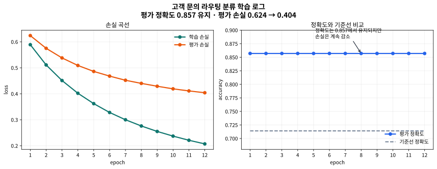

# P7-4.1 loss, metric, 오류 사례 함께 읽기

> Section ID: `P7-4.1`
> Version: `v2026.07.18`

고객 문의를 어느 팀으로 보내야 하는지 분류하는 모델을 만들었다고 해도, 정확도 숫자 하나만 적어 두면 실제로 무엇이 좋아졌는지 읽기 어렵습니다. 학습 루프 관점으로 다시 보면, 프로젝트 문서에는 `baseline`, `loss`, `accuracy`, `epoch별 로그`, `오류 샘플`이 함께 남아 있어야 다음 판단이 가능합니다.

이번 절에서는 `고객 문의를 환불팀(refund)과 배송팀(delivery) 중 어디로 보낼 것인가`라는 문제를 다시 사용해, 텍스트 분류 프로젝트의 학습 로그를 실제로 만들고 읽는 기준을 정리합니다. 핵심은 모델 구조를 복잡하게 늘리는 것이 아니라, `문장 -> 토큰 -> 벡터 -> 학습 로그 -> 오류 샘플` 흐름이 어떻게 기록되는지 직접 확인하는 데 있습니다.

## 이 절의 범위

- baseline 정확도와 학습된 분류기 정확도를 같이 두면 무엇이 보이는가?
- loss와 accuracy를 같이 읽어야 하는 이유는 무엇인가?
- epoch별 로그를 남기면 어떤 오류 샘플을 우선 검토할 수 있는가?

이 절은 `텍스트 분류기의 학습 결과를 어떤 로그와 그래프로 읽을 것인가`를 닫는 데 집중합니다. 즉, 여기서는 `문장 -> 토큰 -> 벡터` 준비를 이미 했다는 전제 위에서, 그 입력으로 실제 학습을 반복했을 때 `loss`, `accuracy`, `오류 샘플`이 어떻게 남는지를 먼저 정리합니다. 토큰화(tokenization)와 coverage가 오류 해석을 어떻게 흔드는지는 다음 입력 해석 단계에서 별도로 다룹니다.

## 이 절의 목표

- 텍스트 분류 프로젝트의 학습 로그를 `baseline`, `loss`, `accuracy`, `오류 샘플`로 요약할 수 있습니다.
- accuracy가 그대로여도 loss가 더 내려갈 수 있는 이유를 설명할 수 있습니다.
- epoch 로그를 `step`, `batch`, `epoch`, `update` 관점으로 다시 읽을 수 있습니다.

## 왜 학습 로그를 따로 읽어야 하나

텍스트 분류 프로젝트에서는 `맞았다`와 `얼마나 안정적으로 맞았는가`가 다를 수 있습니다. 예를 들어 평가 정확도가 0.857로 같게 유지되더라도, 각 epoch에서 손실(loss)이 내려간다면 모델은 같은 정답을 더 강한 확신으로 내고 있을 가능성이 있습니다.

따라서 텍스트 분류 프로젝트의 결과를 읽을 때는 처음부터 다음 네 가지를 함께 남기는 편이 좋습니다.

| 기록 항목 | 왜 필요한가 |
| --- | --- |
| baseline 정확도 | 모델이 단순 고정 규칙보다 실제로 나아졌는지 보기 위해 |
| 학습 손실과 평가 손실 | 같은 정확도 안에서도 점수 분포가 어떻게 달라지는지 보기 위해 |
| 평가 정확도 | 실제 분류 결과가 몇 건 맞았는지 보기 위해 |
| 오류 샘플 | 어떤 문장을 다시 봐야 하는지 고정하기 위해 |

여기서 `loss`와 `accuracy`를 같이 두는 이유는 역할이 다르기 때문입니다.

- accuracy는 `몇 건 맞았는가`를 요약합니다.
- loss는 `정답 쪽 확신이 얼마나 안정적으로 커졌는가`를 더 민감하게 보여 줍니다.

예를 들어 평가 정확도가 몇 epoch째 `0.857`로 그대로면, 빠르게는 `학습이 이미 멈췄다`고 적고 싶어질 수 있습니다. 하지만 이 절에서 더 안전한 다음 판단은 정확도 한 줄로 결론 내리는 것이 아니라, `loss가 계속 내려가는가`, `같은 오답 샘플이 남아 있는가`, `확률 분포가 더 또렷해졌는가`를 같이 보는 것입니다. 그래야 `더 이상 맞는 개수는 늘지 않았지만 확신은 커지고 있다`는 장면과 `정말 더 배울 것이 없어졌다`는 장면을 구분할 수 있습니다.

```mermaid
--8<-- "assets/part-07/chapter-04/p7-4-1-training-read-flow-ko.mmd"
```

즉, 학습 로그는 성적표 한 줄이 아니라 `모델이 어느 속도로 좋아졌고 어디서 멈췄는가`를 읽는 자료입니다.

## 프로젝트 질문 설정

이번 프로젝트는 `고객 문의를 환불팀과 배송팀 중 어디로 보내야 하는가?`라는 질문에서 시작합니다. 이번 절에서는 같은 문제를 `학습 로그` 관점으로 다시 읽습니다. 그래서 이번에 더 중요하게 볼 것은 최종 예측표만이 아니라, 그 예측표가 만들어질 때 epoch마다 어떤 값이 남았는가입니다.

## 프로젝트 흐름

```mermaid
--8<-- "assets/part-07/chapter-04/p7-4-1-text-project-flow-ko.mmd"
```

이번 절의 흐름에서 달라지는 지점은 `학습` 단계입니다. OOV와 coverage를 따로 따지기 전에, 먼저 `학습이 실제로 반복되면 어떤 기록이 남는가`를 눈으로 붙잡아야 합니다.

## 입력 파일

- 문의 데이터: [`p7-4-support-routing-dataset.csv`](../../../assets/part-07/chapter-04/p7-4-support-routing-dataset.csv)
- 학습 로그: [`p7-4-training-log.csv`](../../../assets/part-07/chapter-04/p7-4-training-log.csv)
- 그래프 생성 스크립트: [`p7_4_training_curves.py`](../../../assets/part-07/chapter-04/p7_4_training_curves.py)

입력 파일의 역할을 나누어 보면 다음과 같습니다.

| 파일 | 역할 |
| --- | --- |
| `p7-4-support-routing-dataset.csv` | 학습용 문의와 평가용 문의를 담는다 |
| `p7-4-training-log.csv` | epoch마다 기록한 손실과 정확도를 담는다 |
| `p7_4_training_curves.py` | 데이터셋에서 로그와 그래프를 다시 생성한다 |

즉, 이번 절에서는 `모델 입력`과 `학습 결과 기록`을 분리해 두고 읽습니다. 이렇게 해야 나중에 같은 데이터셋으로 토큰화 규칙만 바꿔도 무엇이 달라졌는지 다시 비교하기 쉽습니다.

## Python 예제

이번 예제의 목적은 공백 기준 토큰화와 bag-of-words 벡터를 유지한 채, 기본 softmax 분류기를 실제로 학습해 epoch 로그를 남기는 것입니다. 이 예제는 `문장 -> 토큰 -> 벡터` 준비보다 `반복 학습 결과를 어떻게 읽을 것인가`에 더 초점을 둡니다.

- 문제 상황: 고객 문의를 환불팀과 배송팀 중 하나로 보낸다.
- 입력: 학습 문의 12개, 평가 문의 7개
- 비교 기준: baseline 정확도 vs 학습된 분류기 정확도
- 확인할 개념:
  - loss와 accuracy는 같은 값이 아니다
  - full-batch 학습에서는 `한 epoch = 한 번의 update`가 될 수 있다
  - 샘플별 예측과 epoch 로그를 같이 남겨야 오류 검토 우선순위를 분명히 남길 수 있다

이번 코드는 이해를 위해 `full-batch`로 학습합니다. 즉, 학습 문의 12개 전체를 한 번에 보고 한 번 update를 수행합니다. 실제 프로젝트에서는 mini-batch를 쓰는 경우가 많지만, 여기서는 epoch별 로그를 단순하게 읽기 위해 step 구조를 일부러 줄였습니다.

```python
import csv
from pathlib import Path

import numpy as np

data_path = Path("docs/assets/part-07/chapter-04/p7-4-support-routing-dataset.csv")
rows = list(csv.DictReader(data_path.open(encoding="utf-8")))
for row in rows:
    row["라벨"] = int(row["label"])

train_rows = [row for row in rows if row["split"] == "train"]
test_rows = [row for row in rows if row["split"] == "test"]

라벨_이름 = {0: "환불팀", 1: "배송팀"}

def tokenize(text):
    return text.split()

vocab = sorted({token for row in train_rows for token in tokenize(row["text"])})
token_to_index = {token: i for i, token in enumerate(vocab)}

def vectorize(target_rows):
    X = np.zeros((len(target_rows), len(vocab)), dtype=float)
    for i, row in enumerate(target_rows):
        for token in tokenize(row["text"]):
            if token in token_to_index:
                X[i, token_to_index[token]] += 1.0
    return X

X_train = vectorize(train_rows)
y_train = np.array([row["라벨"] for row in train_rows])
X_test = vectorize(test_rows)
y_test = np.array([row["라벨"] for row in test_rows])

W = np.zeros((len(vocab), 2), dtype=float)
b = np.zeros(2, dtype=float)

Y_train = np.zeros((len(y_train), 2), dtype=float)
Y_train[np.arange(len(y_train)), y_train] = 1.0

def softmax(logits):
    shifted = logits - logits.max(axis=1, keepdims=True)
    exp_shifted = np.exp(shifted)
    return exp_shifted / exp_shifted.sum(axis=1, keepdims=True)

def loss_and_accuracy(X, y):
    probs = softmax(X @ W + b)
    loss = float(-np.log(probs[np.arange(len(y)), y] + 1e-12).mean())
    accuracy = float((probs.argmax(axis=1) == y).mean())
    return loss, accuracy

baseline_class = int(np.bincount(y_train).argmax())
baseline_pred = np.full_like(y_test, baseline_class)
baseline_accuracy = float((baseline_pred == y_test).mean())

learning_rate = 0.35
training_log = []
for epoch in range(1, 13):
    probs = softmax(X_train @ W + b)
    grad_W = X_train.T @ (probs - Y_train) / len(X_train)
    grad_b = (probs - Y_train).mean(axis=0)
    W -= learning_rate * grad_W
    b -= learning_rate * grad_b

    train_loss, train_accuracy = loss_and_accuracy(X_train, y_train)
    eval_loss, eval_accuracy = loss_and_accuracy(X_test, y_test)
    training_log.append({
        "epoch": epoch,
        "train_loss": round(train_loss, 3),
        "eval_loss": round(eval_loss, 3),
        "train_accuracy": round(train_accuracy, 3),
        "eval_accuracy": round(eval_accuracy, 3),
        "baseline_accuracy": round(baseline_accuracy, 3),
    })

test_probs = softmax(X_test @ W + b)
test_pred = test_probs.argmax(axis=1)

test_records = []
for index, row in enumerate(test_rows):
    probs = np.round(test_probs[index], 3)
    test_records.append({
        "평가 샘플": row["sample_id"],
        "문장": row["text"],
        "예측 팀": 라벨_이름[int(test_pred[index])],
        "실제 팀": 라벨_이름[int(y_test[index])],
        "정답 여부": "예" if int(test_pred[index]) == int(y_test[index]) else "아니오",
        "팀별 확률": probs.tolist(),
    })

summary = {
    "학습 샘플 수": len(train_rows),
    "평가 샘플 수": len(test_rows),
    "기준선 정확도": round(baseline_accuracy, 3),
    "마지막 epoch 평가 정확도": training_log[-1]["eval_accuracy"],
    "오류 샘플": [
        row["평가 샘플"] for row in test_records if row["정답 여부"] == "아니오"
    ],
}

print("실행 요약 =", summary)
print("처음 3개 epoch =", training_log[:3])
print("마지막 3개 epoch =", training_log[-3:])
print("샘플별 평가 =")
for row in test_records:
    print(row)
```

실행 결과 예시는 다음과 같습니다.

```text
실행 요약 = {'학습 샘플 수': 12, '평가 샘플 수': 7, '기준선 정확도': 0.714, '마지막 epoch 평가 정확도': 0.857, '오류 샘플': ['평가-05']}
처음 3개 epoch = [{'epoch': 1, 'train_loss': 0.589, 'eval_loss': 0.624, 'train_accuracy': 1.0, 'eval_accuracy': 0.857, 'baseline_accuracy': 0.714}, {'epoch': 2, 'train_loss': 0.511, 'eval_loss': 0.575, 'train_accuracy': 1.0, 'eval_accuracy': 0.857, 'baseline_accuracy': 0.714}, {'epoch': 3, 'train_loss': 0.451, 'eval_loss': 0.538, 'train_accuracy': 1.0, 'eval_accuracy': 0.857, 'baseline_accuracy': 0.714}]
마지막 3개 epoch = [{'epoch': 10, 'train_loss': 0.237, 'eval_loss': 0.419, 'train_accuracy': 1.0, 'eval_accuracy': 0.857, 'baseline_accuracy': 0.714}, {'epoch': 11, 'train_loss': 0.221, 'eval_loss': 0.411, 'train_accuracy': 1.0, 'eval_accuracy': 0.857, 'baseline_accuracy': 0.714}, {'epoch': 12, 'train_loss': 0.207, 'eval_loss': 0.404, 'train_accuracy': 1.0, 'eval_accuracy': 0.857, 'baseline_accuracy': 0.714}]
샘플별 평가 =
{'평가 샘플': '평가-01', '문장': '환불 진행 상태 확인', '예측 팀': '환불팀', '실제 팀': '환불팀', '정답 여부': '예', '팀별 확률': [0.808, 0.192]}
{'평가 샘플': '평가-02', '문장': '배송 조회 언제 가능', '예측 팀': '배송팀', '실제 팀': '배송팀', '정답 여부': '예', '팀별 확률': [0.131, 0.869]}
{'평가 샘플': '평가-03', '문장': '불량 반품 후 환불 일정', '예측 팀': '환불팀', '실제 팀': '환불팀', '정답 여부': '예', '팀별 확률': [0.97, 0.03]}
{'평가 샘플': '평가-04', '문장': '출고 지연 도착 예정 문의', '예측 팀': '배송팀', '실제 팀': '배송팀', '정답 여부': '예', '팀별 확률': [0.313, 0.687]}
{'평가 샘플': '평가-05', '문장': '캔슬 후 송장 번호 남아 있어요', '예측 팀': '배송팀', '실제 팀': '환불팀', '정답 여부': '아니오', '팀별 확률': [0.416, 0.584]}
{'평가 샘플': '평가-06', '문장': '카드 승인 취소 금액 언제 돌아오나요', '예측 팀': '환불팀', '실제 팀': '환불팀', '정답 여부': '예', '팀별 확률': [0.804, 0.196]}
{'평가 샘플': '평가-07', '문장': '하자 제품 환불 스케줄 알고 싶어요', '예측 팀': '환불팀', '실제 팀': '환불팀', '정답 여부': '예', '팀별 확률': [0.899, 0.101]}
```

## 학습 곡선을 눈으로 읽기

학습 로그를 숫자 표로만 보면 `정확도 0.857`이 반복된다는 사실만 남기 쉽습니다. 그래프로 보면 이번 실행에서 더 중요한 점이 드러납니다.



그래프를 읽을 때 먼저 봐야 할 것은 다음 두 줄입니다.

- 평가 정확도는 첫 epoch부터 `0.857`에 도달한 뒤 그대로 유지됩니다.
- 그런데 학습 손실과 평가 손실은 그 뒤에도 계속 내려갑니다.

이 장면은 `정확도는 같은데도 학습이 완전히 멈춘 것은 아니다`라는 사실을 보여 줍니다. 즉, 이미 맞추고 있는 문의들에 대해 모델이 더 강한 확신을 갖게 되면서 loss는 더 내려갈 수 있습니다. 반대로 오답 샘플 수는 그대로 1개이기 때문에 accuracy는 더 이상 올라가지 않습니다.

## 이 로그를 학습 루프 용어로 다시 읽기

이번 예제는 학습 루프 용어를 프로젝트 문서 위에서 다시 읽기 좋게 단순화해 둔 형태입니다.

| 학습 루프 용어 | 이번 예제에서 무엇을 뜻하나 |
| --- | --- |
| batch | 학습 문의 12개 전체 |
| step | batch 전체를 보고 gradient를 계산한 뒤 한 번 update한 것 |
| epoch | 학습 문의 12개 전체를 한 번 훑은 것 |
| loss | 현재 파라미터가 정답 라벨에 얼마나 어긋나는지 요약한 값 |
| accuracy | 평가 문의 7개 중 몇 건을 맞혔는지 요약한 값 |
| update | `W`, `b`를 gradient 방향으로 실제로 바꾼 순간 |

이번 코드가 `full-batch`이므로 `한 epoch = 한 step`으로 보입니다. 실제 mini-batch 학습에서는 한 epoch 안에 여러 step이 들어가지만, 여기서는 그 차이를 줄여 `epoch 로그를 읽는 감각`에 집중했습니다.

## 결과를 어떻게 읽는가

이번 결과에서는 세 가지를 같이 읽어야 합니다.

### 1. 기준선보다 실제 학습 모델이 낫다

baseline은 항상 다수 클래스인 환불팀으로 보내므로 정확도는 `0.714`입니다. 반면 학습된 분류기는 `0.857`까지 올라가므로, 입력 문장을 실제로 사용했을 때 이득이 있다는 점이 먼저 확인됩니다.

### 2. accuracy가 고정돼도 loss는 더 내려갈 수 있다

이번 실행은 첫 epoch부터 평가 정확도 `0.857`를 기록했습니다. 그런데 이후 epoch에서도 평가 손실이 `0.624 -> 0.404`로 계속 내려갑니다. 이것은 `맞춘 샘플을 더 확실하게 맞추는 중`이라는 뜻입니다.

즉, accuracy만 보면 `이미 끝난 것처럼` 보일 수 있지만, loss까지 같이 보면 아직 점수 분포가 정리되고 있다는 사실을 볼 수 있습니다.

### 3. 오답 샘플은 그대로 남는다

마지막까지 남는 오답은 `평가-05`입니다.

| 샘플 | 최종 예측 | 왜 다시 검토하나 |
| --- | --- | --- |
| `평가-05` `캔슬 후 송장 번호 남아 있어요` | 배송팀 | accuracy 개선만으로는 해결되지 않는 표현 불일치와 OOV 가능성이 보이기 때문 |

따라서 이 절의 결론은 `정확도 0.857`가 아니라, `기준선보다 나아졌지만 특정 표현에서는 여전히 흔들리므로 토큰화와 coverage를 함께 다시 봐야 한다`입니다.

## 학습 로그에서 바로 적어 둘 문장

프로젝트 회고 문장을 한 문단으로 적으면 다음처럼 정리할 수 있습니다.

> 이번 고객 문의 라우팅 분류 실습에서 baseline 정확도는 0.714였고, 학습된 softmax 분류기는 평가 정확도 0.857을 기록했다. 평가 정확도는 첫 epoch부터 0.857로 유지됐지만 평가 손실은 0.624에서 0.404까지 계속 내려갔다. 따라서 이 로그는 `오답 건수는 그대로지만, 맞춘 문의들에 대한 확신은 더 안정화됐다`는 뜻이다. 마지막 오답인 `평가-05`는 OOV와 token coverage 관점에서 다시 검토할 필요가 있다.

이 회고에서 독자가 붙잡아야 할 형식은 다음입니다.

- baseline과 학습 모델을 같은 숫자 표 안에 둔다
- accuracy와 loss를 같이 적는다
- 마지막 오답 샘플을 이름 그대로 남긴다
- 다시 볼 질문을 한 줄로 남긴다

## 직접 바꿔 보며 확인할 것

1. epoch 수를 12에서 4로 줄여 봅니다.
   관찰할 점: 정확도는 그대로여도 손실 곡선이 덜 내려간 채 멈추는가?

2. learning rate를 `0.35`에서 `0.1`, `0.6`으로 바꿔 봅니다.
   관찰할 점: 손실 곡선이 더 천천히 내려가거나 흔들리는가?

3. `평가-05`와 비슷한 혼합 문의를 하나 더 넣어 봅니다.
   관찰할 점: accuracy가 그대로여도 어떤 유형의 문장에서만 계속 흔들리는가?

이 절에서 직접 확인해야 하는 핵심은 `마지막 정확도`보다 `로그 곡선과 오답 샘플이 다음 수정 방향을 어떻게 알려 주는가`입니다.

## 이어서 점검할 질문

방금 본 `평가-05`는 단순히 한 건 틀렸다는 사실로 끝나지 않습니다.

| 질문 | 왜 이어서 점검하나 |
| --- | --- |
| 왜 `캔슬` 같은 표현은 학습이 끝나도 흔들리는가? | 학습 어휘 밖 토큰(OOV token) 여부를 따로 봐야 하기 때문이다 |
| 정확도는 같은데 어떤 문장이 더 위험한가? | token coverage를 같이 기록해야 하기 때문이다 |
| 오답을 구조 문제로 볼지 표현 문제로 볼지 어떻게 나누나? | 오류를 coverage, baseline, 반복 패턴 관점으로 분리해야 하기 때문이다 |

## 체크리스트

| 확인할 것 | 스스로 답할 질문 |
| --- | --- |
| baseline | 다수 클래스 기준선과 학습 모델을 같은 평가 셋에서 비교했는가? |
| 로그 | epoch별 `loss`와 `accuracy`를 함께 남겼는가? |
| 해석 | accuracy가 그대로여도 loss가 내려갈 수 있는 이유를 설명했는가? |
| 오류 샘플 | 마지막 오답 샘플을 토큰화 검토 대상으로 적었는가? |
| 다음 질문 | 표현 변경, learning rate, 혼합 문의 중 무엇을 먼저 실험할지 정했는가? |

## 출처와 참고 자료

- NumPy Developers, `NumPy documentation`, 확인 날짜: 2026-06-29. [https://numpy.org/doc/stable/](https://numpy.org/doc/stable/){: target="_blank" rel="noopener noreferrer" }

이 절의 문의 데이터와 학습 로그는 실습용 설명을 위해 직접 구성한 synthetic 데이터와 재현 가능한 예제 스크립트를 기준으로 작성했습니다.
