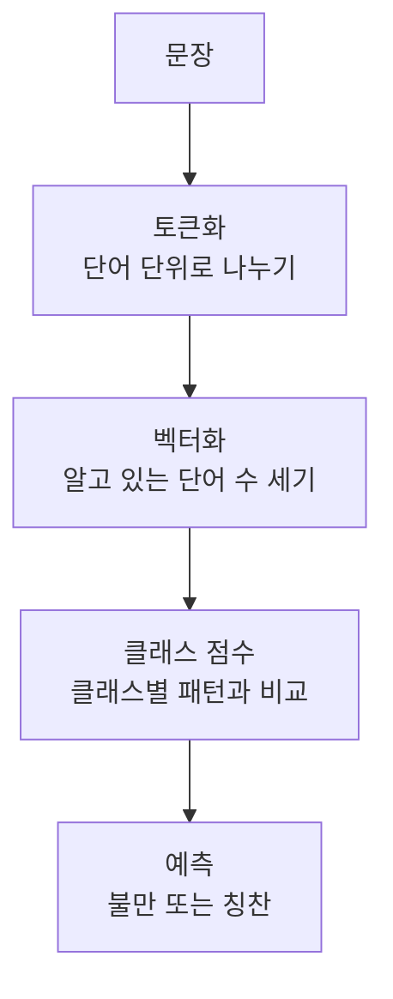

# P7-4.1 텍스트 분류 모델 목표

> Section ID: `P7-4.1`
> Version: `v2026.07.17`

이미지 프로젝트를 지나면 자연스럽게 텍스트 프로젝트로 넘어가게 됩니다. 텍스트 분류(text classification)는 LLM 이전에도 매우 오래 쓰인 기본 과업(task)이며, 감정 분류, 스팸 분류, 문의 라우팅, 뉴스 주제 분류 같은 실무 문제와 직접 연결됩니다.

이번 절의 목적은 복잡한 언어 모델을 바로 쓰는 것이 아니라, `문장을 토큰(token) 묶음으로 바꾸고 라벨(label)을 예측하는 최소 프로젝트 흐름`을 확인하는 데 있습니다.

이 절의 목적은 LLM을 바로 다루는 것이 아니라, 텍스트 분류 프로젝트에서 입력 문장이 어떻게 벡터가 되고 라벨 예측으로 이어지는지 기록하는 것이다.

## 이 절의 범위

- 텍스트 분류 프로젝트는 어떤 입력과 출력을 갖는가?
- 문장을 숫자 벡터(vector)로 바꾸는 최소 방법은 무엇인가?
- 작은 텍스트 분류 프로젝트에서도 baseline이나 비교 기준이 왜 필요한가?

이 절은 `문장 -> 벡터 -> 라벨 예측`이라는 최소 분류 프로젝트 흐름에 집중합니다. 즉, 여기서는 텍스트 프로젝트를 `문장 -> 토큰 -> 벡터 -> 라벨 예측` 기록 구조로 어떻게 시작할지까지를 먼저 닫습니다. 토큰화가 평가 해석에 미치는 영향은 바로 다음 P7-4.2 토큰화와 평가에서 다시 회수하고, 뒤의 검색/평가 프로젝트에서도 같은 입력 표현 기록 구조를 다시 사용합니다.

텍스트 프로젝트에서는 문장과 토큰이 어떤 기록 항목이 되는지 여기서 먼저 잡습니다. 이 절은 벡터와 라벨 예측까지 이어지는 최소 문서 구조를 고정합니다.

Part 7에서 `토큰(token)`, `토큰화(tokenization)`, `어휘(vocabulary)`의 뜻이 다시 겹쳐 보이면, 이 절과 [개념사전](../../../reference/concept-glossary.md)으로 돌아와 기본 구분을 먼저 다시 잡는 편이 안전합니다.

## 이 절의 목표

- 텍스트 분류 프로젝트를 `문장 -> 토큰 -> 벡터 -> 클래스 예측` 흐름으로 설명할 수 있습니다.
- 어휘(vocabulary)와 라벨 구조를 프로젝트 문서에 적을 수 있습니다.
- 작은 실습으로 예측값과 정확도를 직접 확인할 수 있습니다.

## 왜 텍스트 분류 프로젝트가 중요한가

텍스트 프로젝트는 Part 5의 LLM 문맥과도 직접 연결됩니다. 다만 여기서는 생성(generation)이 아니라 분류(classification)입니다. 그래서 다음 차이를 분명히 보는 것이 중요합니다.

| 구분 | 이번 프로젝트 |
| --- | --- |
| 입력 | 짧은 문장 |
| 출력 | 정해진 라벨(class) 하나 |
| 중심 질문 | 어떤 단어와 표현이 어떤 라벨과 연결되는가? |

즉, 이번 절은 `문장을 이해하는 모델`을 거대하게 설명하기보다, `문장을 라벨에 연결하는 작은 프로젝트`부터 다룹니다.

텍스트 분류 프로젝트 입구에서 바로 확인해야 할 판단 기준을 표로 고정하면 다음과 같습니다.

| 질문 | 짧은 답 |
| --- | --- |
| 이 프로젝트에서 먼저 적을 것은 무엇인가? | 문장, 라벨, 토큰화 방식 |
| 왜 작은 라벨 두 개로 시작하는가? | 분류 구조와 어휘 기록을 단순하게 보기 위해 |
| 최소 산출물은 무엇인가? | 어휘 기준, 입력 벡터 모양, 예측값, 정확도 |

여기에 한 가지를 더 붙이면 텍스트 프로젝트의 입구부터 기록 구조가 더 분명해집니다. 문장과 라벨만 적는 데서 끝내지 말고, `어떤 어휘 기준을 비교 바탕으로 삼는가`, `어떤 문장을 추가 검토 대상으로 남길 것인가`, `다음 절에서 무엇을 더 점검할 것인가`를 같이 적어 두는 것입니다.

| 입구에서 같이 남길 기록 | 왜 필요한가 |
| --- | --- |
| 어휘 기준 | 모델이 어떤 어휘 범위 안에서 읽는지 고정하기 위해서입니다. |
| 샘플별 토큰 기록 | 입력 표현을 다시 확인하기 위해서입니다. |
| 추가 검토 질문 | 사전에 없던 토큰(OOV token)이 많거나 애매한 문장을 다음 절에서 다시 보기 위해서입니다. |
| 다음 점검 항목 | 기존 어휘 포함 비율, 토큰화 규칙, 오류 샘플을 어디서 볼지 정하기 위해서입니다. |

## 프로젝트 질문 설정

이번 프로젝트는 `고객 문장을 불만과 칭찬 두 라벨로 나눌 수 있는가?`라는 질문에서 시작합니다. 분류 라벨이 명확하고, 토큰화(tokenization)와 어휘(vocabulary) 개념을 바로 붙일 수 있으며, 이후 사전에 없던 토큰(OOV token) 문제와 평가 해석으로 이어지기 쉽습니다.

## 프로젝트 흐름



이 도식은 텍스트 분류 프로젝트를 문장 하나의 의미 해석이 아니라 `토큰화 -> 벡터화 -> 점수 비교 -> 라벨 결정`의 구조로 단순화합니다. 독자는 이 흐름을 통해 텍스트도 결국 분류기가 읽을 수 있는 숫자 표현으로 바뀐다는 점을 먼저 잡으면 됩니다.

프로젝트 기록으로 정리하면 순서는 다음과 같습니다.

| 단계 | 문서에 남길 것 |
| --- | --- |
| 문장 | 원문 입력 예시 |
| 토큰화 | 어떻게 쪼갰는가 |
| 벡터화 | 어떤 어휘 공간으로 바꿨는가 |
| 예측 | 어떤 라벨이 나왔는가 |
| 결과 | 정확도와 이후 점검 포인트 |

## 학습 데이터

이번 절에서는 여섯 개의 짧은 학습 문장을 사용합니다.

### 불만

- `refund delay angry`
- `broken product complaint`
- `refund request not working`

### 칭찬

- `thank you fast delivery`
- `love this product great`
- `happy with quick support`

이 데이터는 실제 고객 로그가 아니라 프로젝트 실습용 장난감 문장입니다.

## Python 예제

이번 예제의 목적은 아주 단순한 공백 기준 토큰화와 단어 수 세기 벡터를 이용해 문장 분류 흐름을 확인하는 것입니다. 이번에는 정확도 숫자만 남기지 않고, 평가 샘플 이름, 토큰 목록, 예측 라벨 이름, 최근접 클래스 거리까지 함께 기록해 다음 평가 절로 자연스럽게 이어지게 하겠습니다.

- 문제 상황: 고객 문장을 불만(complaint)과 칭찬(praise)으로 나눈다.
- 입력: 학습 문장 6개, 평가 문장 4개
- 정답 라벨: 불만 = 0, 칭찬 = 1
- 확인할 개념:
  - 토큰화 후 어휘를 만든다
  - 문장을 단어 수 세기 벡터로 바꾼다
  - 클래스별 중심 패턴과의 거리를 비교해 예측한다
  - 샘플별 예측 기록이 남아야 다음 오류 분석으로 이어질 수 있다

```python
import numpy as np

train_rows = [
    {"샘플": "학습-01", "문장": "refund delay angry", "라벨": 0},
    {"샘플": "학습-02", "문장": "broken product complaint", "라벨": 0},
    {"샘플": "학습-03", "문장": "thank you fast delivery", "라벨": 1},
    {"샘플": "학습-04", "문장": "love this product great", "라벨": 1},
    {"샘플": "학습-05", "문장": "refund request not working", "라벨": 0},
    {"샘플": "학습-06", "문장": "happy with quick support", "라벨": 1},
]
train_texts = [row["문장"] for row in train_rows]
y_train = np.array([row["라벨"] for row in train_rows])  # 0 불만, 1 칭찬
라벨_이름 = {0: "불만", 1: "칭찬"}

vocab = sorted({token for text in train_texts for token in text.split()})
token_to_index = {token: i for i, token in enumerate(vocab)}

def vectorize(texts):
    X = np.zeros((len(texts), len(vocab)), dtype=float)
    token_lists = []
    for i, text in enumerate(texts):
        tokens = text.split()
        token_lists.append(tokens)
        for token in text.split():
            if token in token_to_index:
                X[i, token_to_index[token]] += 1
    return X, token_lists

X_train, train_tokens = vectorize(train_texts)
class_centroids = np.vstack([
    X_train[y_train == 0].mean(axis=0),
    X_train[y_train == 1].mean(axis=0),
])

test_rows = [
    {"샘플": "평가-01", "문장": "refund for broken product", "라벨": 0},
    {"샘플": "평가-02", "문장": "great support thank you", "라벨": 1},
    {"샘플": "평가-03", "문장": "delay but quick refund", "라벨": 0},
    {"샘플": "평가-04", "문장": "love fast delivery", "라벨": 1},
]
test_texts = [row["문장"] for row in test_rows]
y_test = np.array([row["라벨"] for row in test_rows])
X_test, test_tokens = vectorize(test_texts)

predictions = []
test_records = []
for index, x in enumerate(X_test):
    distances = np.linalg.norm(class_centroids - x, axis=1)
    pred_label = int(np.argmin(distances))
    predictions.append(pred_label)
    test_records.append({
        "평가 샘플": test_rows[index]["샘플"],
        "문장": test_rows[index]["문장"],
        "토큰": test_tokens[index],
        "예측 라벨": 라벨_이름[pred_label],
        "실제 라벨": 라벨_이름[y_test[index]],
        "정답 여부": "예" if pred_label == y_test[index] else "아니오",
        "최근접 클래스 거리": round(float(distances[pred_label]), 3),
    })

predictions = np.array(predictions)

project_run = {
    "어휘 수": len(vocab),
    "어휘 예시": vocab[:8],
    "학습 벡터 모양": X_train.shape,
    "평가 정확도": round(float((predictions == y_test).mean()), 3),
    "오류 샘플": [
        row["평가 샘플"] for row in test_records if row["정답 여부"] == "아니오"
    ],
}

print("실행 요약 =", project_run)
print("샘플별 평가 =")
for row in test_records:
    print(row)
```

실행 결과 예시는 다음과 같습니다.

```text
실행 요약 = {'어휘 수': 20, '어휘 예시': ['angry', 'broken', 'complaint', 'delay', 'delivery', 'fast', 'great', 'happy'], '학습 벡터 모양': (6, 20), '평가 정확도': 1.0, '오류 샘플': []}
샘플별 평가 =
{'평가 샘플': '평가-01', '문장': 'refund for broken product', '토큰': ['refund', 'for', 'broken', 'product'], '예측 라벨': '불만', '실제 라벨': '불만', '정답 여부': '예', '최근접 클래스 거리': 1.291}
{'평가 샘플': '평가-02', '문장': 'great support thank you', '토큰': ['great', 'support', 'thank', 'you'], '예측 라벨': '칭찬', '실제 라벨': '칭찬', '정답 여부': '예', '최근접 클래스 거리': 1.633}
{'평가 샘플': '평가-03', '문장': 'delay but quick refund', '토큰': ['delay', 'but', 'quick', 'refund'], '예측 라벨': '불만', '실제 라벨': '불만', '정답 여부': '예', '최근접 클래스 거리': 1.528}
{'평가 샘플': '평가-04', '문장': 'love fast delivery', '토큰': ['love', 'fast', 'delivery'], '예측 라벨': '칭찬', '실제 라벨': '칭찬', '정답 여부': '예', '최근접 클래스 거리': 1.528}
```

## 결과를 어떻게 읽는가

이 결과에서 읽어야 할 핵심은 다음입니다.

- 이번 프로젝트는 `문장`을 직접 이해한 것이 아니라, 먼저 어휘(vocabulary)를 만들고 단어 수 세기 벡터로 바꾼 뒤 분류했습니다.
- 예제의 실행 요약은 어휘 크기, 벡터 모양, 정확도, 오류 샘플 ID를 한 번에 남기는 최소 기록입니다.
- `학습 벡터 모양 = (6, 20)`은 학습 문장 6개가 20개 어휘 차원의 벡터로 바뀌었음을 뜻합니다.
- 예제의 테스트 기록을 보면 각 문장이 어떤 토큰으로 쪼개졌고, 어떤 라벨로 예측되었는지까지 바로 읽을 수 있습니다.
- 작은 예제에서는 평가 정확도가 1.0으로 나왔지만, 이것이 곧바로 강한 일반화(generalization)를 뜻하는 것은 아닙니다.
- 이번 실행에서 `오류 샘플`이 비어 있어도, 그것만으로 검토가 끝난 것은 아닙니다. 어떤 어휘를 기준으로 읽었는지와 다음 절에서 어떤 포함 비율 질문을 더 볼지 같이 남겨야 합니다.

즉, 텍스트 분류 프로젝트도 이미지 프로젝트와 마찬가지로 `입력 표현`을 먼저 봐야 합니다.

이 결과는 다음 세 줄로 요약할 수 있습니다.

- 문장은 어휘 기반 벡터로 바뀌었다
- 샘플별 토큰과 예측 기록이 함께 남아야 다음 평가가 쉬워진다
- 작은 예제의 성공이 곧 일반화 성공은 아니다
- 텍스트 프로젝트에서도 입력 표현 기록이 예측 해석만큼 중요하다

이번 절은 Part 3와 Part 5를 함께 연결합니다.

- Part 3의 분류(classification) 구조를 텍스트 문제에 다시 적용합니다.
- Part 5의 토큰(token) 개념이 왜 중요한지 작은 프로젝트에서 확인합니다.

즉, 이번 절은 LLM 이전의 고전적 텍스트 분류 감각과, LLM 이후에도 계속 남는 토큰화 감각 사이의 다리 역할을 합니다.

이 절은 Part 7 전체 흐름에서 `입력이 표에서 텍스트로 바뀌어도 프로젝트 문서의 기본 구조는 유지된다`는 점을 보여 줍니다.

같은 흐름을 최소 기록으로 줄이면 다음 표처럼 정리할 수 있습니다.

| 단계 | 검토가 필요한 상태 | 다음 행동 |
| --- | --- | --- |
| 어휘 확인 | 어휘 범위가 너무 좁아 보임 | 토큰화 평가로 넘김 |
| 예측 확인 | 오류 샘플이 생기거나 낯선 표현이 보임 | 오류 문장 다시 읽기 |
| 결과 요약 | 정확도만으로 해석이 부족함 | 포함 비율과 OOV 확인 |

이 표가 있으면 텍스트 프로젝트 입구부터 `입력 -> 비교 기준 -> 추가 검토 질문` 구조가 보입니다.

## 체크리스트

다음처럼 텍스트 모델 이야기를 시작했는데 입력 표현과 기록 구조가 아직 고정되지 않았다면 이 절의 관점을 먼저 떠올리는 편이 좋습니다.

- 라벨 예측은 말하고 있지만 문장, 토큰화 방식, 어휘 기준이 문서에 정리되지 않은 경우
- 정확도 숫자는 적었지만 샘플별 토큰과 예측 기록이 빠져 있는 경우
- LLM이나 더 큰 모델 얘기로 넘어가려 하지만 고전적 텍스트 분류의 최소 흐름이 아직 보이지 않는 경우

이때는 모델 복잡도를 올리기 전에 `문장 -> 토큰 -> 벡터 -> 라벨` 흐름과 최소 기록 항목을 먼저 고정해야 합니다.

- 텍스트 분류는 `문장 -> 토큰 -> 벡터 -> 라벨` 흐름으로 읽을 수 있다는 점을 설명할 수 있는가?
- 어휘(vocabulary)를 어떻게 만들었는지가 프로젝트 품질에 큰 영향을 준다는 점을 말할 수 있는가?
- 작은 성공 사례만으로 일반화를 단정하면 안 된다는 점을 설명할 수 있는가?
- 토큰화와 평가는 분리된 주제가 아니라 같은 프로젝트 안의 연결된 문제라는 점을 말할 수 있는가?
- 텍스트 분류의 입력과 출력이 무엇인지 설명할 수 있는가?
- 토큰화와 어휘 생성 과정을 한 문단으로 적을 수 있는가?
- 문장이 벡터로 바뀐다는 뜻을 `모양(shape)`과 함께 설명할 수 있는가?
- 정확도 숫자와 함께 입력 표현 방식을 기록했는가?

## 출처와 참고 자료

- NumPy Developers, `NumPy documentation`, 확인 날짜: 2026-06-29. [https://numpy.org/doc/stable/](https://numpy.org/doc/stable/){: target="_blank" rel="noopener noreferrer" }

이 절의 텍스트 데이터는 프로젝트 실습을 위해 만든 자체 장난감 문장입니다.
