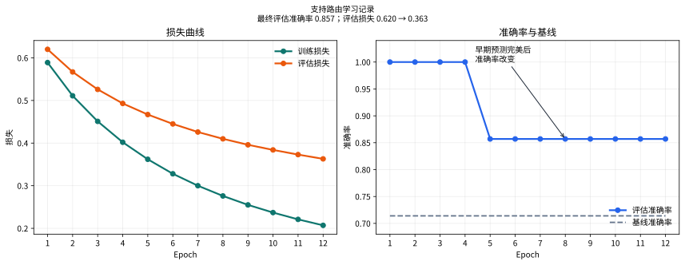

# P7-4.1 一起阅读损失、指标与错误案例

> Section ID: `P7-4.1`
> Version: `v2026.08.01`

损失、指标和单个错误案例回答不同问题。应一起阅读：损失描述优化信号，指标概括任务表现，错误案例指出人下一步该检查什么。

## 不要让一条曲线决定项目记录

| 证据 | 它回答的问题 |
| --- | --- |
| 训练与评估损失 | 优化信号是否随 epoch 改变？ |
| 指标 | 模型在选定任务度量上表现如何？ |
| 错误案例 | 哪个输入和预测需要诊断？ |

较低的损失本身不能证明每个重要错误已经消失。指标上升也不能说明少数或边界案例没有变差。运行记录应同时保留三类证据。

## 复现文本路由学习记录

项目问题是：“客户咨询应转给退款团队还是配送团队？”使用 [`p7-4-support-routing-dataset.zh.csv`](../../../assets/part-07/chapter-04/p7-4-support-routing-dataset.zh.csv){ .csv-preview }，其中有 12 条训练咨询和 7 条评估咨询。多数标签基线达到 `0.714`；学习得到的词袋 softmax 模型达到 `0.857`，并留下评估样本 `평가-05` 供复核。

```python
import csv
from pathlib import Path
import numpy as np

rows = list(csv.DictReader(Path("docs/assets/part-07/chapter-04/p7-4-support-routing-dataset.zh.csv").open(encoding="utf-8")))
train_rows = [row for row in rows if row["split"] == "train"]
test_rows = [row for row in rows if row["split"] == "test"]
def tokens(text): return text.split()
vocab = sorted({token for row in train_rows for token in tokens(row["text"])})
index = {token: position for position, token in enumerate(vocab)}
def vectorize(selected):
    matrix = np.zeros((len(selected), len(vocab)))
    for row_number, row in enumerate(selected):
        for token in tokens(row["text"]):
            if token in index: matrix[row_number, index[token]] += 1
    return matrix
X_train, X_test = vectorize(train_rows), vectorize(test_rows)
y_train = np.array([int(row["label"]) for row in train_rows])
y_test = np.array([int(row["label"]) for row in test_rows])
W, b = np.zeros((len(vocab), 2)), np.zeros(2)
Y = np.eye(2)[y_train]
def softmax(values):
    shifted = values - values.max(axis=1, keepdims=True)
    e = np.exp(shifted); return e / e.sum(axis=1, keepdims=True)
def loss_accuracy(X, y):
    probabilities = softmax(X @ W + b)
    return float(-np.log(probabilities[np.arange(len(y)), y] + 1e-12).mean()), float((probabilities.argmax(axis=1) == y).mean())
baseline = int(np.bincount(y_train).argmax())
baseline_accuracy = float((np.full_like(y_test, baseline) == y_test).mean())
history = []
for epoch in range(1, 13):
    probabilities = softmax(X_train @ W + b)
    W -= .35 * X_train.T @ (probabilities - Y) / len(X_train)
    b -= .35 * (probabilities - Y).mean(axis=0)
    train_loss, train_accuracy = loss_accuracy(X_train, y_train)
    eval_loss, eval_accuracy = loss_accuracy(X_test, y_test)
    history.append({"epoch": epoch, "train_loss": round(train_loss, 3), "eval_loss": round(eval_loss, 3), "train_accuracy": round(train_accuracy, 3), "eval_accuracy": round(eval_accuracy, 3)})
predictions = softmax(X_test @ W + b).argmax(axis=1)
errors = [row["sample_id"] for row, prediction, actual in zip(test_rows, predictions, y_test) if prediction != actual]
print("基线准确率 =", round(baseline_accuracy, 3))
print("首尾 epoch =", history[0], history[-1])
print("错误样本 =", errors)
```

当前 CSV 中，评估准确率在最早几个 epoch 为 `1.000`，最后为 `0.857`；同时评估损失从 `0.620` 降至 `0.363`。这是一个重要反例：更低损失和指标可以朝不同方向变化，最终损失值不会抹去后来出现的错误。

| 事实 | 有限解释 | 下一个问题 |
| --- | --- | --- |
| 基线为 0.714，最终评估准确率为 0.857。 | 学习表示在这个固定划分上优于多数规则。 | 另一种划分上是否也保持改善？ |
| 评估损失下降，最终准确率下降。 | 总体置信度与正确标签数量可以不同步。 | 随着 epoch 继续，哪个样本改变了类别？ |
| `평가-05` 仍错误。 | 句子可能混合路由信号。 | 应复核词汇、标签还是边界案例？ |

## 本练习中 epoch 日志记录什么

本例有意使用全批量学习。每一轮读取全部 12 条训练咨询，做一次参数更新，并把这一单位记录为一个 epoch。生产运行常使用小批量，此时一个 epoch 包含多次更新；简化结构能让读取顺序更清楚。

| 日志字段 | 本例中的含义 |
| --- | --- |
| Epoch | 一次遍历 12 条训练咨询。 |
| Step | 本简化例中的一次全批量更新。 |
| 训练损失 | 训练概率支持正确标签的强度。 |
| 评估损失 | 保留咨询上的相同概率敏感量。 |
| 评估准确率 | 7 个评估标签中预测正确的比例。 |
| 基线准确率 | 固定为 0.714 的多数标签比较。 |

当前运行的首尾记录如下。

```text
epoch 1：训练损失 0.589，评估损失 0.620，训练准确率 1.000，评估准确率 1.000
epoch 2：训练损失 0.511，评估损失 0.567，训练准确率 1.000，评估准确率 1.000
epoch 3：训练损失 0.451，评估损失 0.526，训练准确率 1.000，评估准确率 1.000
epoch 10：训练损失 0.237，评估损失 0.384，训练准确率 1.000，评估准确率 0.857
epoch 11：训练损失 0.221，评估损失 0.373，训练准确率 1.000，评估准确率 0.857
epoch 12：训练损失 0.207，评估损失 0.363，训练准确率 1.000，评估准确率 0.857
```

这条轨迹比单独最终分数更有用。训练损失持续下降，评估损失也下降，评估准确率却从早期的七对七正确变为六对七正确。记录应触发样本级复核，而不是宣称较低评估损失必然意味着更好的最终路由决策。

## 阅读剩余路由错误

| 评估样本 | 文本 | 预测团队 | 实际团队 | 概率读取 |
| --- | --- | --- | --- | --- |
| 평가-05 | `캔슬 후 송장 남아 있어요` | 配送 | 退款 | 句子同时有取消意图和配送文件词，当前表示偏向配送。 |

最后一个 epoch 的其他六行评估记录正确。这一个错误不足以诊断分词、标签质量或模型容量，却足以把下一项复核变得具体。

```text
问题：将每条客户咨询路由到退款或配送。
训练数量：12
评估数量：7
基线准确率：0.714
最终评估准确率：0.857
最终 epoch 的评估损失：0.363
剩余错误样本：평가-05
下一次复核：检查取消词、配送词，以及该句的训练覆盖范围。
```

## 不要过度阅读曲线

| 观察 | 它支持什么 | 它不支持什么 |
| --- | --- | --- |
| 训练损失下降 | 参数更强地拟合训练标签。 | 每个评估组都改善。 |
| 评估损失下降 | 正确标签概率在保留行上改变。 | 准确率必定同时上升。 |
| 末尾准确率高于基线 | 固定划分优于多数规则。 | 路由模型已适合所有咨询。 |
| 仍有一项错误 | 存在具体复核目标。 | 根因已经确认。 |

“学习已经停止”这句话需要不止一个数字的证据。检查损失是否趋平、错误集合是否稳定或变化、概率是否改变，以及比较划分是否大到足以支持决策。

## 用库复现相同记录

NumPy 实现暴露损失和更新机制。面向生产的实现可改用文本向量器、对数损失分类器和虚拟基线。工具会变，但记录字段不变：保留基线、epoch 日志、评估指标、错误样本、划分与下一问题。

| 组件 | 库工作流中的角色 |
| --- | --- |
| `TfidfVectorizer` | 将训练文本转换为可复现特征权重。 |
| `DummyClassifier` | 提供简单比较基线。 |
| `SGDClassifier` 与 log loss | 按迭代更新线性文本分类器。 |
| Accuracy 与 log loss | 同时保留指标与概率敏感读取。 |

## 学习曲线与错误记录



图表给出最终指标会隐藏的时间记录。评估准确率在最早 epoch 完美、最终为 `0.857`；与此同时评估损失从 `0.620` 降至 `0.363`。因此“损失下降，所以每项路由决策改善”和“准确率后来下降，所以学习没有帮助”都不安全。

| 证据 | Epoch 1 | Epoch 12 | 有限解释 |
| --- | ---: | ---: | --- |
| 评估损失 | `0.620` | `0.363` | 在固定划分上，模型总体给正确标签更强概率。 |
| 评估准确率 | `1.000` | `0.857` | 七项路由中的一项从正确变为错误。 |
| 剩余错误 | 无 | `평가-05` | 取消与配送混合表达需要样本级复核。 |

## 待续的项目记录

本节的下一步不是自动增加更多 epoch。先比较变化的错误集合，检查剩余句中的词，再决定受控修改是词汇覆盖、标签规则、表示还是训练数据。

```mermaid
--8<-- "assets/part-07/chapter-04/p7-4-1-training-read-flow-zh.mmd"
```

## 将日志连接到文本项目流程

```mermaid
--8<-- "assets/part-07/chapter-04/p7-4-1-text-project-flow-zh.mmd"
```

本练习使用全批量：12 条训练咨询一起完成一次更新，这一次更新称为一个 epoch。小批量训练会在一个 epoch 中包含多次更新。项目记录必须保留这种区别，因为仅凭横轴上的 epoch 无法知道优化器执行了多少 step。

| 循环术语 | 本练习中的含义 | 应记录什么 |
| --- | --- | --- |
| Batch | 全部 12 条训练咨询。 | 批量大小，以及全批量还是小批量。 |
| Step | 一次基于梯度的参数更新。 | 可能影响结果的优化器设置。 |
| Epoch | 一次遍历训练咨询。 | 同一 epoch 的训练与评估值。 |
| Loss | 与标签的概率敏感不一致。 | 划分、损失定义和变化方向。 |
| Accuracy | 预测正确标签的比例。 | 评估数量和决策规则。 |

## 将结果写成有限项目说明

> 在这个固定的支持路由划分上，多数基线为 0.714，最终 NumPy 模型为 0.857。评估损失从 0.620 降至 0.363，同时最终错误集合包含 `평가-05`。这支持一个有限主张：在这七行上，学习表示优于多数规则。它不能说明取消和配送混合措辞为何仍困难。下一次复核将在改变架构前比较词汇覆盖和类似混合咨询。

这段说明将观察到的值与因果故事分开。最终分数不能告诉我们，错误来自分词、缺少训练案例、标签规则还是小划分形成的边界。

## 可以改变但不改变问题的实验

1. 将 epoch 数从 12 减到 4，记录损失是否来不及下降以及错误集合是否改变。
2. 将 NumPy 学习率从 `0.35` 改为 `0.10` 和 `0.60`，同时记录稳定性与最终准确率。
3. 添加一条新的取消与配送混合评估咨询，将其覆盖和预测与原七行分开记录。
4. 将库向量器从 bigram 改为 unigram，比较词汇表大小、损失和命名错误样本，而不是只比较最终指标。
5. 在解释之前，把 epoch 1 和 epoch 12 的值复制到同一项目说明中。

## 保持事实、解释和决定分开

项目日志若从曲线直接跳到解释，中间证据会消失。可以使用三种不同句子。

| 句子类型 | 本次运行示例 | 不应主张什么 |
| --- | --- | --- |
| 事实 | 最终评估准确率为 `0.857`；`평가-05` 错误。 | 该咨询为什么错误。 |
| 解释 | 固定划分显示比多数基线有改善。 | 改善会泛化到所有支持语言。 |
| 决定 | 下一步检查取消词与混合意图案例。 | 词汇已被证实为根因。 |

在只有七行的评估划分中，这种区分尤其重要。一行改变会显著影响准确率，错误记录让这种敏感性可见，而不是被三个小数位隐藏。

### 把分数变化也读成计数

| 评估准确率 | 七条中的计数 | 读取方式 |
| ---: | ---: | --- |
| `1.000` | 7 条正确 | 该早期 epoch 的小划分中未见错误。 |
| `0.857` | 6 条正确 | 恰有一条咨询错误，应取回其 ID。 |
| `0.714` | 5 条正确 | 多数基线在固定划分上的结果。 |
| `0.000` | 0 条正确 | 可能的指标值，但不说明每项为何失败。 |

计数与比率不是不同证据，而是同一保留行的两种视图。当评估集足够小时，应同时记录两者，方便读者检查每个案例。

### 样本级复核表

最终记录应将实际文本与 ID 保留在一起。隐私敏感的生产项目会使用已批准的脱敏形式或稳定引用键；这里的学习目标是保留可检索性。

| 样本 | 可检查的可见信号 | 最终状态 | 下一次复核用途 |
| --- | --- | --- | --- |
| `평가-01` | 退款进度措辞 | 正确 | 稳定退款参考。 |
| `평가-02` | 追踪与配送措辞 | 正确 | 稳定配送参考。 |
| `평가-03` | 退货与退款日程 | 正确 | 混合退款参考。 |
| `평가-04` | 发货延迟与到达措辞 | 正确 | 混合配送参考。 |
| `평가-05` | 取消与配送文件措辞 | 错误 | 主要回归案例。 |
| `평가-06` | 卡片批准取消 | 正确 | 取消词汇参考。 |
| `평가-07` | 缺陷商品退款日程 | 正确 | 退款覆盖参考。 |

该表不证明某个词造成预测。它告诉复核者首先应比较什么。例如，在新增模型族前，可以将 `평가-05` 与 `평가-06` 比较，因为两者都有取消相关含义，但周围证据不同。

## 用错误集合转变诊断曲线

对每个选定 epoch 创建错误 ID 集合，然后比较集合，而不是只看指标。

```text
epoch 1 错误：[]
epoch 12 错误：[평가-05]
新错误：[평가-05]
恢复：[]
持续错误：[]
```

这个轨迹具有重要教学价值：总体评估损失下降，错误集合却增加一条样本。两种度量强调概率输出的不同方面。损失在置信度改变时变化；准确率只在预测类别越过决策边界时变化。

| 观察 | 合理的下一检查 | 不安全结论 |
| --- | --- | --- |
| 损失下降且错误集合不变 | 比较正确行的置信度，检查是否值得继续训练。 | 每个类别都同样被覆盖。 |
| 损失下降且出现新错误 | 取回变化行并比较其概率向量。 | 更低损失保证更好决策。 |
| 准确率上升但损失上升 | 检查哪些行翻转及置信度是否极端。 | 更高准确率自动更好。 |
| 两者都趋平 | 检查数据量、划分方差和未解决错误。 | 训练永远不会再改善。 |

## 可重复运行的最小记录

```text
运行 ID：
数据集与划分版本：
文本预处理规则：
词汇或特征表示：
基线定义与分数：
模型与关键设置：
epoch / step 计数方式：
训练与评估损失：
评估指标与评估数量：
前后错误 ID：
新错误与恢复 ID：
限定于固定证据的解释：
下一次受控修改：
```

这些字段很朴素，但能让读者复现比较，并区分改变的是表示、划分、阈值还是数据版本。

### 运行之间可以改变什么

| 改变的组件 | 尽可能保持固定 | 比较回答的问题 |
| --- | --- | --- |
| Epoch 数或学习率 | 数据、划分、表示和标签。 | 相同任务下优化行为是否改变？ |
| 分词或向量器 | 数据、划分、分类器族和错误 ID。 | 表示是否改变覆盖或命名错误？ |
| 训练数据增加 | 评估参考和标签规则。 | 覆盖能否恢复边界案例而不回归？ |
| 模型族 | 数据版本、评估集和报告字段。 | 建模关系是否提供有用证据？ |
| 决策阈值 | 概率、标签和评估行。 | 操作规则带来什么错误权衡？ |

若一次改变多行，应把结果标为探索性运行而非因果比较。探索仍可能有价值，但无法隔离是哪项修改产生了结果。

## 在延长训练前应问的问题

1. 哪些错误 ID 未变、已恢复或新出现？
2. 同一句是否含有训练词汇表中不存在的词？
3. 对同时提到两个支持主题的句子，标签规则是否清楚？
4. 另一种划分是否给出相同的基线到模型比较？
5. 较低损失是否主要来自已容易样本的更强置信度？
6. 更多数据、表示变化或操作规则变化中，哪一个最直接检验下一假设？

回答这些问题不需要更大模型，而需要让学习轨迹与产生它的样本之间保持可读关系。

## 决定下一实验允许改变什么

下表把记录转为小而可检验的后续，而不是开放的“改进分类器”请求。

| 记录中的症状 | 首个有限行动 | 必须保留的证据 | 后续问题 |
| --- | --- | --- | --- |
| 一个混合意图咨询仍错误 | 添加或检查可比混合意图案例。 | 原错误 ID 和标签规则。 | 问题是覆盖而非优化吗？ |
| 错误中出现取消词 | 与正确取消咨询比较词汇覆盖。 | 预处理规则和词汇版本。 | 表示是否暴露所需区分？ |
| 错误 ID 随 epoch 改变 | 保存每条变化行的前后概率。 | 相同划分和 epoch 标识。 | 哪次边界越过改变了指标？ |
| 损失与准确率不一致 | 同时报出值和错误集合转变。 | 损失定义与决策规则。 | 哪个度量对应项目风险？ |
| 新表示恢复一项错误 | 重跑每个命名参考咨询。 | 原始与转换输入版本。 | 恢复是否制造回归？ |

首个行动故意很小。它让评估者能在更昂贵的数据收集或架构比较前说明证据是否改变。

### 面向复核者的交接说明

```text
观察到：多数基线为 0.714；最终模型在七行上为 0.857。
观察到：评估损失下降，同时 평가-05 成为最终错误。
尚未建立：取消词、配送词、标签规则或覆盖中的哪一项造成该错误。
下一受控比较：保留原七行，并增加一条有文档的混合意图参考。
决策规则：报告基线、损失、准确率，以及每个恢复或新错误样本 ID。
```

这份交接说明使后来的复核者能够质疑结论。他们可以要求另一种划分、更清楚的标签规则或词汇审计，而不用从一张图中猜测项目状态。

## 本教学运行的限制

本例有意很小且为合成材料。它不估计真实客服表现、不同用户群体的公平性、服务级成本或生产路由政策。实际系统还需要经批准的数据处理、不确定案例的升级路径、监控以及代表性语言上的评估。

本例仍展示一个长期有效的做法：将基线、学习轨迹、评估定义和命名错误案例保存在同一记录中。尽管这些具体数字不能外推，该做法可以扩展到更大项目。

## 学习检查

| 检查 | 要回答的问题 |
| --- | --- |
| 损失 | 曲线描述哪个划分和哪个 epoch？ |
| 指标 | 它的定义是否适合当前任务？ |
| 错误案例 | 哪个具体例子仍错误？ |
| 解释 | 曲线没有证明什么？ |
| 下一问题 | 接下来应检查或收集什么？ |

### 完成标准

- 能运行代码并复述基线 `0.714`、最终准确率 `0.857`、最终评估损失 `0.363`。
- 能解释为什么损失下降与准确率下降可以同时发生。
- 能从 `평가-05` 的 ID 回到实际输入，而不是只谈一个错误数。
- 能把事实、有限解释和下一决定写成不同句子。
- 能设计一次只改变一个组件的后续比较。
- 能说明七行合成划分不等于生产性能。

### 提交前核对

- 中文 SVG 是否从与正文相同的训练日志生成？
- 两个中文 Mermaid 是否保留与原流程相同的阅读顺序？
- 代码、图表和表格中的基线与末尾值是否一致？
- 是否保留了错误集合的前后转换？
- 是否避免把词汇解释写成已证实根因？

只有这些问题都能回答时，曲线、指标与样本才真正形成一个项目记录。

## 用库实现时仍要保留的证据

使用库可以减少实现细节，却不能减少项目记录。`TfidfVectorizer`、`DummyClassifier` 和 `SGDClassifier` 能让更大的文本实验易于重复，但不会自动解释某条咨询为什么被错分。

| 库组件 | 它替代的实现细节 | 仍需人工记录的内容 |
| --- | --- | --- |
| `TfidfVectorizer` | 将文本转换为特征矩阵。 | 词 n-gram 规则、词汇大小与拟合数据。 |
| `DummyClassifier` | 多数类别比较。 | 基线策略和评估分数。 |
| `SGDClassifier` | 迭代的线性 log-loss 更新。 | 迭代数、学习设置与随机状态。 |
| `accuracy_score` | 正确标签比例。 | 评估行数和每条错误 ID。 |
| `log_loss` | 正确类别概率损失。 | 划分、标签顺序和方向。 |

### 库运行的安全比较

库实现与前面的 NumPy 词袋实现可以在同一划分上比较，但它们的概率、损失和训练轨迹不必相同。TF-IDF 权重、bigram 特征和优化过程均不同；有意义的共同点是它们保留相同的七条评估咨询、同一个多数基线、epoch 字段和样本级复核。

| 可以比较 | 不应当作相同 |
| --- | --- |
| 固定评估划分上的基线与最终指标。 | 两种表示的每个概率数值。 |
| `평가-05` 是否仍为错误。 | 不同优化器的损失绝对值。 |
| 错误集合的变化。 | 不同词汇表的特征维度。 |
| 下一个复核问题。 | 一次运行的结果可推广到生产。 |

若库运行恢复了 `평가-05`，仍需检查其他六行是否保持正确。若它增加新错误，项目说明必须把恢复与回归一起报告。

## 概率为什么也需要样本上下文

损失使用正确标签的概率，不只查看最终预测类别。因此，预测类别没有翻转时，损失仍可下降或上升。概率很有价值，但其解释必须回到具体输入和标签。

| 概率变化 | 对准确率的直接影响 | 安全的复核问题 |
| --- | --- | --- |
| 正确类别从 0.55 提升至 0.80 | 预测可能仍正确。 | 哪些容易样本获得更多置信度？ |
| 错误类别从 0.51 降至 0.49 | 预测可能翻转为正确。 | 哪条样本穿过了决策边界？ |
| 正确类别从 0.99 降至 0.60 | 预测仍可能正确。 | 是否有新的低余量案例？ |
| 错误类别从 0.60 升至 0.90 | 预测仍错误。 | 模型为何在错误一侧更坚定？ |

不能把模型概率直接读作真实世界的客服意图概率。它是当前表示、参数和训练数据下的分类分数；若需要校准解释，还要进行额外的验证。

## 三种不完整的项目结论

| 不完整结论 | 为什么不足 | 更好的记录 |
| --- | --- | --- |
| “损失下降，所以模型更好。” | 忽略类别翻转和具体错误。 | 同时报损失、准确率和错误集合。 |
| “准确率是 0.857，所以可以部署。” | 七行小划分无法代表现场。 | 限制结论，并收集代表性评估。 |
| “取消词造成错误。” | 一个样本不能确立因果。 | 将其写为词汇覆盖假设并设计比较。 |
| “继续训练就能解决。” | 轨迹已经显示错误集合会改变。 | 固定样本，先检验数据或表示问题。 |

写清这些边界并不是削弱项目；它让后续改动可以真正回答一个问题。

## 本节练习后的反思

1. 如果最终损失降低而准确率保持不变，你会先查看什么？
2. 如果准确率降低一行，为什么要记录样本 ID 而不只记录百分比？
3. `평가-05` 与另一个包含取消词但正确的样本比较，能打开什么假设？
4. 全批量 epoch 与小批量 epoch 的日志为什么不能直接按横轴解释？
5. 如果要把本例换成真实客服数据，还需增加哪些数据治理与评估步骤？
6. 哪一项下一实验可以保持问题不变却检验词汇覆盖？

## 小结

损失、指标和错误案例不是竞争的分数。损失让读者看见概率敏感的优化信号，指标让读者看见任务计数，错误案例让读者知道下一步要打开哪条输入。

在这个练习中，较低评估损失与一个新错误同时出现。正确行动不是选择其中一个数字相信，而是保存两者、找回 `평가-05`、保留固定划分，并用一个受控问题继续复核。

## 读者可以交付的学习记录

完成本节后，读者应能把一次训练写成另一位读者能复核的简短记录。

| 交付物 | 必须包含的内容 |
| --- | --- |
| 运行摘要 | 数据划分、基线、模型设置和 epoch 计数。 |
| 曲线说明 | 训练损失、评估损失和评估准确率的变化。 |
| 错误清单 | 每个错误的样本 ID、实际、预测与可读输入。 |
| 解释边界 | 事实与仍未证实的根因分开写。 |
| 下一实验 | 一个改变、固定参考、预期转换与回归检查。 |

### 复核顺序

1. 先确认 CSV、划分和标签没有改变。
2. 再确认基线与模型使用相同评估行。
3. 阅读曲线的开始、转变与末尾，而不是只读最后一点。
4. 把每次准确率变化换算为七条中的具体样本数。
5. 打开新错误、持续错误和恢复样本。
6. 将解释写成条件句，并声明下一次受控比较。

这种顺序能防止“一个数字看起来改善”取代真正的项目诊断。

### 最后一句提醒

曲线告诉我们发生了什么变化。
指标告诉我们有多少标签正确。
样本告诉我们接下来应检查什么。

三者缺一不可。

保留曲线。
保留指标。
保留样本。
保留问题。

## 来源与参考

本节的练习数据与示例由本书创建。补充代码所用概念可参考 scikit-learn 的文本特征提取、`SGDClassifier` 与 `DummyClassifier` 官方文档。
