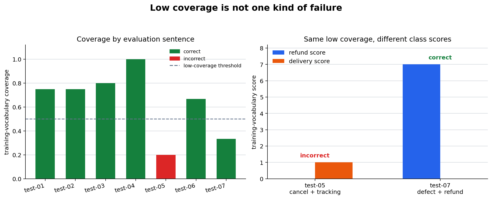

# P7-4.2 Decomposing a Failed Result Again

> Section ID: `P7-4.2`
> Version: `v2026.08.01`

When a result fails, decompose it before replacing the model. Separate data issues, representation issues, optimization signals, metric choice, and individual error patterns. A failure record should narrow the next check rather than assign blame to one component prematurely.

The practical sequence is baseline comparison, token coverage and OOV inspection, then a search for repeated error patterns. This order prevents a low score from becoming an unsupported demand for a larger model.

## Learning questions and criteria

- Which evidence distinguishes a baseline limit from an input-representation limit?
- Why is low vocabulary coverage a review signal rather than an automatic error label?
- What smallest follow-up test would separate normalization, missing data, and model-capacity hypotheses?

You should be able to write one failure record with a confirmed observation, a limited interpretation, and a next probe.

## A failure is several possible questions

| Observation | Possible next check |
| --- | --- |
| Loss remains high | Verify labels, scale, optimization settings, and split. |
| Metric is weak despite lower loss | Check class balance and metric suitability. |
| One group fails repeatedly | Inspect representation and boundary examples. |
| Results vary by run | Check sample size, seed, and data split. |

Write a confirmed fact, a limited interpretation, and a next test. Do not describe a failed result as proof that a model family is inherently unsuitable without inspecting these layers.

For the routing practice data, retain the same train/test split as P7-4.1. The purpose is not to claim production performance; it is to make the evidence needed for a failure diagnosis visible.

## Read token coverage beside the routing result

Keep the P7-4.1 support-routing data fixed. Token coverage is the fraction of an evaluation sentence that occurs in the training vocabulary. Low coverage is a review signal, not an automatic error label.

```python
import csv
from pathlib import Path
import numpy as np

rows = list(csv.DictReader(Path("docs/assets/part-07/chapter-04/p7-4-support-routing-dataset.en.csv").open(encoding="utf-8")))
train_rows = [row for row in rows if row["split"] == "train"]
test_rows = [row for row in rows if row["split"] == "test"]
def tokens(text): return text.split()
vocab = sorted({token for row in train_rows for token in tokens(row["text"])})
index = {token: position for position, token in enumerate(vocab)}
def vectorize(selected):
    matrix, token_sets, oov_sets = np.zeros((len(selected), len(vocab))), [], []
    for row_number, row in enumerate(selected):
        token_list = tokens(row["text"]); token_sets.append(token_list); oov = []
        for token in token_list:
            if token in index: matrix[row_number, index[token]] += 1
            else: oov.append(token)
        oov_sets.append(oov)
    return matrix, token_sets, oov_sets
X_train, _, _ = vectorize(train_rows)
y_train = np.array([int(row["label"]) for row in train_rows])
profiles = np.vstack([X_train[y_train == label].sum(axis=0) for label in (0, 1)])
X_test, token_sets, oov_sets = vectorize(test_rows)
for row, token_list, oov, vector in zip(test_rows, token_sets, oov_sets, X_test):
    scores = profiles @ vector; prediction = int(scores.argmax()); actual = int(row["label"])
    coverage = round((len(token_list) - len(oov)) / len(token_list), 3) if token_list else 0
    print({"sample": row["sample_id"], "tokens": token_list, "oov": oov, "coverage": coverage, "refund_score": int(scores[0]), "delivery_score": int(scores[1]), "prediction": prediction, "actual": actual, "review_needed": coverage < .5 or prediction != actual})
```

Two evaluation samples have low coverage, but they lead to different outcomes. In the current CSV, `평가-05` has coverage `0.200` and is a refund request predicted as delivery: its key intent word `캔슬` is out of vocabulary while the remaining shipping term receives score. `평가-07` has coverage `0.333` but remains correctly routed because known refund-related terms are strong.

The figure makes that distinction visible. Green bars are correct and red bars are incorrect; the dashed line is a review threshold, not an error boundary.



| Fact | Interpretation | Next probe |
| --- | --- | --- |
| Both samples have low coverage. | Low coverage alone does not identify an error cause. | Compare OOV tokens and class scores. |
| 평가-05 is wrong. | Missing intent vocabulary and mixed wording may matter. | Test normalization or add cancellation examples. |
| 평가-07 is correct. | Some known terms can outweigh multiple OOV tokens. | Keep it as a low-coverage review sample. |

The next stages are representation normalization, adding data for a missing expression family, and only then reconsidering a larger model structure.

The two-sample flow rejects the tempting but incorrect shortcut: “both are low coverage, so both have the same cause.”

```mermaid
--8<-- "assets/part-07/chapter-04/p7-4-2-coverage-case-flow-en.mmd"
```

## Interpret coverage and score together

Coverage answers “how much of this sentence is represented in the training vocabulary?” It does not answer “which team should receive this request?” Scores show which known words each class profile can use. An incorrect low-coverage sample may have a missing intent word, competing known words, or both.

| Sample type | Coverage result | Score/result reading | Responsible next action |
| --- | --- | --- | --- |
| Correct, high coverage | No immediate representation warning | Known signals support the intended class | Keep as a stable reference. |
| Incorrect, low coverage | Strong representation warning | Key intent may be invisible; competing terms may remain | Test normalization or add examples. |
| Correct, low coverage | Preventive review warning | Current known signals happen to be sufficient | Keep as a risk case and retest after changes. |

Do not erase the correct low-coverage case from the log. It is evidence that coverage is not a classifier metric by itself, and it can reveal regressions after a vocabulary or normalization change.

## Use a complete failure split

The broader decision flow keeps coverage in the right place. It comes after the baseline comparison and before a stronger claim about representation or model limits.

```mermaid
--8<-- "assets/part-07/chapter-04/p7-4-2-failure-split-flow-en.mmd"
```

When the baseline fails the same type of request, inspect labels, data distribution, and the baseline rule first. When the baseline is adequate but a key word is OOV, try a reversible representation change first. Only a repeated failure pattern with adequate coverage is stronger evidence for a feature or model limitation.

## Project record and controlled checks

Record the following fields for each review sample:

```text
sample identifier:
tokenization rule:
known tokens and OOV tokens:
coverage:
class scores, prediction, and actual label:
baseline result:
confirmed observation:
smallest next probe:
```

Then run controlled changes one at a time.

1. Replace `캔슬` with `취소` in test-05 and compare coverage, scores, and prediction.
2. Replace `스케줄` with `일정` in test-07; record whether the preventive-risk status changes even when the prediction remains correct.
3. Add a new unseen synonym without changing the model. Explain why a lower coverage result supports a representation hypothesis, not immediately a capacity hypothesis.
4. Pick one bar below the threshold and write both its observation and the causal claim that the data does **not** justify.

The next section tests a normalization rule directly. Keep this section’s before-state values so that any improvement can be attributed to a specified representation change rather than a vague “model improvement.”

## Turn a coverage result into a failure record

The code output is most useful when it is compressed into an auditable record rather than copied as a long console listing.

```text
task: route an inquiry to refund or delivery
tokenization: split on spaces
evaluation reference: seven fixed inquiries
coverage review threshold: below 0.500
incorrect sample: 평가-05
preventive review sample: 평가-07
confirmed observation: 평가-05 is low coverage and predicted delivery instead of refund
limited interpretation: a missing cancellation expression and known shipping words may compete
next probe: normalize a documented synonym, then rerun the same rows
```

The record has a deliberate boundary. It reports what occurred in the current representation; it does not assert that a tokenizer, data collector, or model architecture is the sole cause.

### Distinguish three review statuses

| Status | Example in this practice | What to preserve | First question |
| --- | --- | --- | --- |
| Confirmed error | `평가-05` is predicted delivery but labeled refund | Text, tokens, OOV list, scores, and label evidence | Which known or unknown terms create the competing signals? |
| Preventive risk | `평가-07` is correct despite low coverage | Text, OOV list, correct prediction, and score gap | Would a representation change make this stable case worse? |
| Stable reference | A high-coverage correct inquiry | Text and expected route | Does any later change create a regression? |
| Label question | A sentence has an unclear routing policy | Source policy or annotation rationale | Should label evidence be resolved before training changes? |

Coverage alone assigns none of these labels. It tells the reviewer where an input representation may deserve attention. Prediction and validated label evidence determine whether a row is an error.

## Read the two low-coverage inquiries side by side

| Field | `평가-05` | `평가-07` | Why the difference matters |
| --- | --- | --- | --- |
| Coverage | `0.200` | `0.333` | Both are below the review threshold. |
| Expected route | Refund | Refund | The task label is the same. |
| Predicted route | Delivery | Refund | Only the first is a confirmed error. |
| Known-score pattern | Delivery has the only positive score | Refund terms dominate | A score pattern gives evidence beyond coverage. |
| OOV concern | The cancellation expression is absent | Several terms are absent but refund remains known | Missing vocabulary has different practical effects. |
| Retained purpose | Primary correction test | Preventive regression test | A repair must be evaluated on both. |

The comparison provides a small counterexample to a tempting rule: “low coverage means low quality.” `평가-07` has low coverage but a correct route. The more defensible rule is: “low coverage requires a sample-level review, especially when it coincides with an error.”

## Separate representation, data, and model questions

One incorrect result can support several hypotheses. Make them testable by stating what changes and what stays fixed.

| Hypothesis layer | Question for `평가-05` | Smallest controlled probe | Evidence after the probe |
| --- | --- | --- | --- |
| Representation | Does `캔슬` need a documented mapping to a known cancellation form? | Normalize the token while retaining rows and labels. | Coverage, scores, prediction, and any changed references. |
| Data coverage | Are mixed cancellation-and-shipping inquiries absent from training? | Add labeled examples with a stated source and retain evaluation references. | Before/after error IDs and label-policy note. |
| Decision policy | Which team owns a mixed-intent request? | Review the routing rule without changing model parameters. | Approved label rationale and escalation rule. |
| Model limitation | Does the current bag-of-words representation fail after the earlier checks? | Compare one stated alternative on the same data version. | Same metric, same error set, and compute cost. |

The order is practical rather than universal. A reversible representation test is inexpensive and directly connected to the observed OOV. If it fails, the record gives a clearer reason to test data expansion or another representation.

### Avoid changing several explanations at once

| Unsafe change bundle | Why it prevents a conclusion | Safer sequence |
| --- | --- | --- |
| Normalize text, add examples, and change classifier together | A recovery cannot be attributed to one change. | Normalize first; keep a before/after record; then consider data. |
| Replace the evaluation split after a disappointing result | The original error may disappear without being fixed. | Retain the original seven rows as named references. |
| Remove low-coverage correct rows | A future regression becomes invisible. | Keep `평가-07` as a preventive reference. |
| Relabel the error without policy evidence | The metric may improve by changing the task definition. | Record the label rule and review it independently. |

## Inspect baseline and coverage in the right order

Baseline comparison answers a different question from coverage. A majority-label baseline shows what happens when the input text is ignored. Coverage shows what the selected text representation can recognize. Neither alone measures the quality of a routing policy.

| Evidence | It can support | It cannot settle |
| --- | --- | --- |
| Majority baseline | Whether text use improves this fixed split | Why a particular text fails. |
| Coverage | Whether the input contains known tokens | Which class should win. |
| Class scores | Which known words favor each class profile | Whether OOV words have the intended meaning. |
| Error IDs | Which decisions disagree with stored labels | Whether a label or data source is valid. |
| Repeated pattern across rows | A priority for a controlled test | A universal model limitation. |

This ordering prevents “the baseline is weak” from becoming “the model needs to be larger,” and prevents “coverage is low” from becoming “the predicted label is wrong.”

## A reusable retrospective sentence

> `평가-05` was routed to delivery although its stored label is refund. Under space-splitting tokenization, its coverage is 0.200 and the cancellation expression is out of the training vocabulary while a shipping-document term remains known. `평가-07` is also low coverage but stays correct, so coverage alone is not the explanation. First apply one documented normalization rule and compare both named references; then decide whether missing mixed-intent training examples or a different representation needs testing.

This sentence contains a fact, a limited interpretation, a counterexample, and a next experiment. It deliberately stops before claiming that normalization will fix the failure.

## Review fields to add to an evaluation report

| Field | Purpose |
| --- | --- |
| Dataset and split version | Makes the evaluation condition identifiable. |
| Tokenization and normalization rule | Makes coverage reproducible. |
| Coverage threshold and reason | Separates a review policy from a correctness rule. |
| Known and OOV tokens | Makes representation gaps inspectable. |
| Scores, prediction, and actual label | Shows the output evidence together. |
| Error, preventive, and stable IDs | Preserves reference cases for later runs. |
| Changed component | States whether the run altered representation, data, policy, or model. |
| Recovered and newly wrong IDs | Makes improvements and regressions visible. |

These fields are useful even when a project uses subword tokenization or an embedding model. The exact definition of “known token” changes, but the need to document input coverage, a decision rule, and error references remains.

## Practice questions before P7-4.3

1. Which facts make `평가-05` a representation review case rather than only a metric decrease?
2. Why does `평가-07` need to remain after a proposed correction?
3. What result would weaken the normalization hypothesis?
4. Which evidence would justify adding mixed-intent training examples?
5. Which elements must remain fixed to compare a model-family change fairly?

Answer the questions with the stored rows, not with an architecture name. P7-4.3 performs the normalization comparison and reports recovered as well as unchanged cases.

## Use a decision procedure after every failure

The procedure below makes the diagnosis order explicit. It is not a guarantee that every failure has one cause.

1. Confirm the evaluation row, actual label, split, and prediction.
2. Compare the model with the stated baseline on the same rows.
3. Inspect tokens, known coverage, OOV terms, and class scores.
4. Classify the row as error, preventive risk, stable reference, or label question.
5. State one representation, data, policy, or model hypothesis as a conditional sentence.
6. Choose one reversible or smallest practical probe.
7. Rerun every retained reference row and report recovered, unchanged, and newly wrong IDs.
8. Update the hypothesis only after recording the transition.

The point of the sequence is not bureaucracy. It protects the project from a common failure pattern: changing preprocessing, training data, and classifier together, then attributing an aggregate score change to the most attractive explanation.

### Example before-and-after report format

```text
before representation: split on spaces, no synonym normalization
before primary error: 평가-05, coverage 0.200, predicted delivery, actual refund
before preventive case: 평가-07, coverage 0.333, predicted refund, actual refund
changed component: one documented expression normalization rule
after primary error: record coverage, scores, and prediction
after preventive case: record coverage, scores, and prediction
recovered IDs:
unchanged error IDs:
newly wrong IDs:
bounded conclusion:
next question:
```

The blank fields are intentional. Do not fill them with a prediction about the outcome before the run. A useful experiment report distinguishes an expectation from an observed transition.

## What each outcome would mean

| Outcome after a normalization probe | Evidence strengthened | What remains unknown |
| --- | --- | --- |
| `평가-05` recovers and `평가-07` stays correct | The documented expression mismatch mattered for these rows. | Whether broader data coverage or another representation is needed elsewhere. |
| `평가-05` remains wrong with higher coverage | Coverage was not sufficient to resolve the class competition. | Whether data, label policy, or decision rule is responsible. |
| `평가-05` recovers but `평가-07` becomes wrong | The change creates a representation trade-off. | Which rule can preserve both cases. |
| Both low-coverage cases are unchanged | The tested mapping has little effect on these references. | Whether another OOV family or model question is relevant. |
| A stable high-coverage case becomes wrong | The change has a regression beyond the target pattern. | Whether the normalization rule is too broad. |

This table is a guardrail against declaring success from one recovered row. A controlled improvement includes the failures it introduces.

## Connect failure records to project decisions

| Project decision | Evidence required from this section | Decision that would be premature |
| --- | --- | --- |
| Add a synonym rule | OOV token, documented target mapping, before/after reference rows | “Normalize every unknown token.” |
| Collect new examples | Repeated error family and clear label policy | “Add more data” without naming the missing boundary. |
| Change tokenization | A representation limit not resolved by a small mapping | “Use a more advanced tokenizer” solely because accuracy is below 1.0. |
| Change model family | Repeated pattern after coverage and data checks | “Use a larger model” because one row is incorrect. |
| Revise routing policy | Evidence that the stored label is ambiguous or policy-dependent | Silently changing the label to match a prediction. |

The decisions have different owners in a real project. A data curator, domain policy owner, and modeling engineer may each need to review a different evidence field. Keeping the record structured makes that handoff possible.

## A compact learning review

Before leaving this section, a learner should be able to complete the following four statements.

1. `평가-05` is a confirmed error because its stored label and prediction disagree; its coverage is a supporting representation signal.
2. `평가-07` is a preventive review case because low coverage does not prevent a correct prediction.
3. A normalization test changes representation, so labels, evaluation IDs, and the reporting rule must remain fixed.
4. A recovery after normalization supports a narrow expression-mismatch explanation; it does not prove that the overall routing problem is solved.

These statements link the numerical output to a defensible next action. They are more useful than memorizing an arbitrary coverage threshold.

## Limits of a vocabulary-coverage check

Coverage is intentionally simple in this exercise: it counts space-separated tokens that occurred in the training vocabulary. Production text systems may use subword units, character models, embeddings, spelling correction, or multilingual normalization. Those choices can reduce the number of unseen units, but they do not remove the need to inspect whether the representation preserves the domain meaning of a request.

| Limitation | Why it matters | Record alongside coverage |
| --- | --- | --- |
| Space splitting treats each spelling form separately | Equivalent expressions can look unrelated. | Normalization rule and examples affected. |
| A token can be known but misleading | `송장` can favor delivery even in a cancellation request. | Per-class score and competing known terms. |
| OOV counts ignore word importance | One missing intent word may matter more than several modifiers. | Task meaning and error label. |
| A small split is unstable | One changed row moves accuracy substantially. | Evaluation count and named IDs. |
| Labels may encode policy choices | Mixed-intent language can require escalation rather than one team. | Label guideline and policy owner. |

Therefore, use coverage to prioritize reading, not to automate acceptance or rejection. The appropriate follow-up depends on the error’s input evidence, domain policy, and regression record.

### Final handoff to the normalization test

Keep `평가-05` and `평가-07` visible in the next report. P7-4.3 changes one explicitly documented expression rule and compares the original text with the normalized text. Its result should be read as a test of that rule, not as proof that every OOV expression has been solved.

## Final project retrospective

> The routing evaluation contains one confirmed error and one correct low-coverage reference. The error has coverage 0.200 and lacks the cancellation expression in the current vocabulary, while known shipping evidence remains. The correct low-coverage reference demonstrates that coverage is a review signal rather than a correctness rule. The next run changes one documented normalization rule, retains every evaluation ID, and reports recovered, unchanged, and newly wrong cases before making another diagnosis.

Use this structure for a later project as well:

- State the observed row-level facts.
- Name the representation or data signal without overclaiming cause.
- Preserve a counterexample or preventive reference.
- Specify one changed component and the fixed evaluation evidence.
- End with the question that remains after the run.

The threshold is a review convention for this exercise, not a universal operating rule.
Document why it was chosen before using it to prioritize work.
If the threshold changes, retain the earlier review list so that the change is visible.
The review convention cannot replace label validation or error analysis.
It only determines which stored rows are read first.

## Checklist

| Check | Question to answer |
| --- | --- |
| Data | Are labels and input units valid? |
| Split | Is the evaluation condition comparable? |
| Signal | What do loss and metric each show? |
| Error | Which row or group needs review? |
| Next test | What smallest change would distinguish hypotheses? |

## Sources and references

Keep the review threshold with the stored rows.
Separate confirmed errors from rows selected for preventive review.
Change one diagnosis component at a time.
Preserve the fixed evaluation condition.
Record the next question before choosing a remedy.
Do not let a priority signal become a causal claim.
Keep unresolved label evidence visible.
Report new regressions as well as recoveries.

This section uses internal practice examples.
