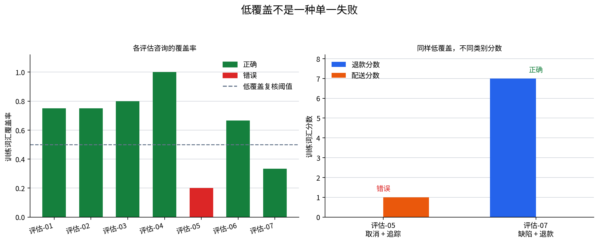

# P7-4.2 再次拆分失败结果

> Section ID: `P7-4.2`
> Version: `v2026.08.01`

结果失败时，先拆分再替换模型。应区分数据问题、表示问题、优化信号、指标选择和单个错误模式。失败记录的作用是缩小下一检查，而不是过早把责任归给某个组件。

实用顺序是：基线比较、词元覆盖与 OOV 检查、重复错误模式搜索。这个顺序防止低分变成没有证据的“换更大模型”要求。

## 学习问题与标准

- 哪些证据可区分基线限制和输入表示限制？
- 为什么低词汇覆盖是复核信号，而不是自动错误标签？
- 最小的后续试验如何区分标准化、缺少数据和模型容量假设？

完成后，应能写出一条包含确认观察、有限解释和下一探针的失败记录。

## 一个失败包含多个可能问题

| 观察 | 可能的下一检查 |
| --- | --- |
| 损失持续很高 | 检查标签、尺度、优化设置和划分。 |
| 损失下降但指标弱 | 检查类别平衡和指标适合性。 |
| 一个组反复失败 | 检查表示与边界案例。 |
| 每次运行结果不同 | 检查样本量、种子和数据划分。 |

写下确认事实、有限解释和下一测试。不要在检查这些层次前，把失败结果写成某个模型族天然不适合的证明。

对路由练习数据，保留 P7-4.1 相同的训练/测试划分。目的不是宣称生产性能，而是让失败诊断所需证据可见。

## 在路由结果旁读取词元覆盖

保持 P7-4.1 的支持路由数据不变。词元覆盖指评估句中出现在训练词汇表里的比例。低覆盖是复核信号，不是自动错误标签。

```python
import csv
from pathlib import Path
import numpy as np

rows = list(csv.DictReader(Path("docs/assets/part-07/chapter-04/p7-4-support-routing-dataset.zh.csv").open(encoding="utf-8")))
train_rows = [row for row in rows if row["split"] == "train"]
test_rows = [row for row in rows if row["split"] == "test"]
def tokens(text): return text.split()
vocab = sorted({token for row in train_rows for token in tokens(row["text"])})
index = {token: position for position, token in enumerate(vocab)}
def vectorize(selected):
    matrix, token_sets, oov_sets = np.zeros((len(selected), len(vocab))), [], []
    for row_number, row in enumerate(selected):
        token_list = tokens(row["text"]); token_sets.append(token_list); oov = []
        for token in token_list:
            if token in index: matrix[row_number, index[token]] += 1
            else: oov.append(token)
        oov_sets.append(oov)
    return matrix, token_sets, oov_sets
X_train, _, _ = vectorize(train_rows)
y_train = np.array([int(row["label"]) for row in train_rows])
profiles = np.vstack([X_train[y_train == label].sum(axis=0) for label in (0, 1)])
X_test, token_sets, oov_sets = vectorize(test_rows)
for row, token_list, oov, vector in zip(test_rows, token_sets, oov_sets, X_test):
    scores = profiles @ vector; prediction = int(scores.argmax()); actual = int(row["label"])
    coverage = round((len(token_list) - len(oov)) / len(token_list), 3) if token_list else 0
    print({"sample": row["sample_id"], "tokens": token_list, "oov": oov, "coverage": coverage, "refund_score": int(scores[0]), "delivery_score": int(scores[1]), "prediction": prediction, "actual": actual, "review_needed": coverage < .5 or prediction != actual})
```

两个评估样本覆盖率低，却得到不同结果。当前 CSV 中，`평가-05` 的覆盖率为 `0.200`，它是被预测为配送的退款请求：关键意图词 `캔슬` 不在词汇表，而剩下的配送词获得分数。`평가-07` 覆盖率为 `0.333`，但仍正确路由，因为已知的退款相关词很强。



| 事实 | 有限解释 | 下一探针 |
| --- | --- | --- |
| 两个样本覆盖率都低。 | 低覆盖本身不能确定错误原因。 | 比较 OOV 词和类别分数。 |
| `평가-05` 错误。 | 缺少意图词和混合措辞可能重要。 | 测试标准化或增加取消案例。 |
| `평가-07` 正确。 | 部分已知退款词可压过多个 OOV 词。 | 将它保留为低覆盖复核样本。 |

下一阶段依次是表示标准化、为缺少表达族增加数据，最后才重新考虑更大模型结构。

```mermaid
--8<-- "assets/part-07/chapter-04/p7-4-2-coverage-case-flow-zh.mmd"
```

## 同时解释覆盖与分数

覆盖回答“这句话有多少内容由训练词汇表示？”它不回答“请求应送到哪个团队？”分数显示每个类别轮廓能使用哪些已知词。错误的低覆盖样本可能有缺失意图词、竞争的已知词，或二者都有。

| 样本类型 | 覆盖结果 | 分数/结果读取 | 负责任的下一行动 |
| --- | --- | --- | --- |
| 正确且高覆盖 | 没有立即的表示警告。 | 已知信号支持目标类别。 | 保留为稳定参考。 |
| 错误且低覆盖 | 强表示警告。 | 关键意图可能不可见，竞争词仍存在。 | 测试标准化或增加案例。 |
| 正确但低覆盖 | 预防性复核警告。 | 当前已知信号恰好足够。 | 作为风险案例保留并在变化后重测。 |

不要从日志中删除正确的低覆盖案例。它证明覆盖不是分类指标本身，也可以在词汇或标准化变化后发现回归。

## 使用完整失败分支

更宽的决策流程将覆盖放在正确位置：它在基线比较之后，在关于表示或模型限制的更强主张之前。

```mermaid
--8<-- "assets/part-07/chapter-04/p7-4-2-failure-split-flow-zh.mmd"
```

当基线在同类请求上也失败时，先检查标签、数据分布和基线规则。当基线足够但关键词 OOV 时，先尝试可逆表示变化。只有在覆盖充分时仍出现重复失败模式，才更有力地指向特征或模型限制。

## 项目记录与受控检查

对每个复核样本记录以下字段。

```text
样本标识：
分词规则：
已知词与 OOV 词：
覆盖率：
类别分数、预测与实际标签：
基线结果：
确认观察：
最小下一探针：
```

然后每次只运行一个受控变化。

1. 将 test-05 的 `캔슬` 替换为 `취소`，比较覆盖、分数和预测。
2. 将 test-07 的 `스케줄` 替换为 `일정`，即使预测保持正确，也记录预防风险状态是否改变。
3. 添加一个未见同义词而不改变模型，说明较低覆盖为何支持表示假设而不立即支持容量假设。
4. 选择一根低于阈值的柱，写下观察和数据不能证明的因果主张。

下一节直接测试一项标准化规则。保留本节的变化前数值，以便将改善归因于明确表示变化，而不是模糊的“模型改善”。

## 将覆盖结果变成失败记录

```text
任务：将咨询路由到退款或配送
分词：按空格切分
评估参考：七条固定咨询
覆盖复核阈值：低于 0.500
错误样本：평가-05
预防性复核样本：평가-07
确认观察：평가-05 覆盖低，且被预测为配送而非退款
有限解释：缺少取消表达与已知配送词可能竞争
下一探针：标准化一个有文档的同义词，再重跑同一行
```

这条记录有明确边界。它报告当前表示中发生了什么；它不主张分词器、数据收集者或模型架构是唯一原因。

## 区分三种复核状态

| 状态 | 本练习中的例子 | 应保留什么 | 第一个问题 |
| --- | --- | --- | --- |
| 确认错误 | `평가-05` 预测配送，标签退款。 | 文本、词元、OOV、分数和标签证据。 | 哪些已知或未知词形成竞争信号？ |
| 预防风险 | `평가-07` 低覆盖但正确。 | 文本、OOV、正确预测和分数差。 | 表示变化会让这个稳定案例变差吗？ |
| 稳定参考 | 高覆盖且正确的咨询。 | 文本与预期路由。 | 后续变化是否造成回归？ |
| 标签问题 | 句子存在不清楚的路由规则。 | 来源政策或标注依据。 | 是否应先解决标签证据？ |

覆盖本身不会赋予这些标签。它告诉复核者输入表示可能值得注意的位置；预测和经过验证的标签证据决定一行是否为错误。

## 并排阅读两个低覆盖咨询

| 字段 | `평가-05` | `평가-07` | 差异为何重要 |
| --- | --- | --- | --- |
| 覆盖率 | `0.200` | `0.333` | 两者都低于复核阈值。 |
| 预期路由 | 退款 | 退款 | 任务标签相同。 |
| 预测路由 | 配送 | 退款 | 只有第一条是确认错误。 |
| 已知分数模式 | 配送有唯一正分数。 | 退款词占优势。 | 分数模式提供覆盖以外的证据。 |
| OOV 担忧 | 取消表达缺失。 | 多个词缺失但退款仍已知。 | 缺失词汇有不同实际影响。 |
| 保留用途 | 主要校正测试。 | 预防回归测试。 | 修复必须同时评估两者。 |

该比较是对诱人规则“低覆盖就是低质量”的小反例。更可辩护的规则是：低覆盖需要样本级复核，尤其在它与错误同时出现时。

## 分开表示、数据与模型问题

一个错误结果可以支持多个假设。通过写明改变什么、保持什么，使它们可测试。

| 假设层 | `평가-05` 的问题 | 最小受控探针 | 探针后的证据 |
| --- | --- | --- | --- |
| 表示 | `캔슬` 是否需要映射为已知取消形式？ | 标准化词元，保留行与标签。 | 覆盖、分数、预测和变化的参考。 |
| 数据覆盖 | 训练是否缺少取消与配送混合咨询？ | 增加有标签案例，保留评估参考。 | 前后错误 ID 和标签规则说明。 |
| 决策政策 | 混合意图请求由哪个团队负责？ | 不改参数，只复核路由规则。 | 批准的标签依据与升级规则。 |
| 模型限制 | 前面检查后词袋是否仍失败？ | 在同一数据版本上比较一个明确替代方案。 | 相同指标、错误集合与计算成本。 |

这个顺序是实用的，不是普适法则。可逆的表示测试成本低，也直接连接观察到的 OOV。若失败，记录会给出更清楚的理由去测试数据扩展或另一种表示。

### 避免同时改变多个解释

| 不安全的变化组合 | 为什么无法得出结论 | 更安全的顺序 |
| --- | --- | --- |
| 同时标准化文本、增加案例并更换分类器 | 无法把恢复归给一项变化。 | 先标准化，保存前后记录，再考虑数据。 |
| 结果不佳后更换评估划分 | 原错误可能未修复就消失。 | 把原七行保留为命名参考。 |
| 删除正确的低覆盖行 | 未来回归会不可见。 | 把 `평가-07` 保留为预防参考。 |
| 没有政策证据就重标错误 | 指标可能通过改变任务定义改善。 | 记录标签规则并独立复核。 |

## 按正确顺序检查基线与覆盖

基线比较回答的问题与覆盖不同。多数标签基线说明忽略文本时发生什么；覆盖说明选定文本表示能认识什么。两者都不能单独衡量路由政策质量。

| 证据 | 它可以支持 | 它不能解决 |
| --- | --- | --- |
| 多数基线 | 使用文本是否改善固定划分。 | 为什么特定文本失败。 |
| 覆盖率 | 输入是否含已知词。 | 哪个类别应获胜。 |
| 类别分数 | 哪些已知词偏向各类别轮廓。 | OOV 词是否具有目标含义。 |
| 错误 ID | 哪些决策与保留标签不同。 | 标签或数据来源是否有效。 |
| 跨行重复模式 | 受控测试的优先级。 | 普适模型限制。 |

这个顺序防止“基线很弱”变成“模型必须更大”，也防止“覆盖很低”变成“预测标签一定错”。

## 可复用的回顾句

> `평가-05` 被路由到配送，尽管其保留标签是退款。在按空格分词下，它的覆盖率为 0.200，取消表达不在训练词汇中，而配送文件词仍然已知。`평가-07` 也低覆盖却保持正确，所以覆盖本身不是解释。先应用一项有文档的标准化规则，并比较两个命名参考；之后再决定是否需要测试缺少的混合意图训练案例或不同表示。

这句话包含事实、有限解释、反例与下一实验。它刻意停在宣称标准化一定修复失败之前。

## 评估报告应增加的复核字段

| 字段 | 用途 |
| --- | --- |
| 数据集与划分版本 | 让评估条件可识别。 |
| 分词与标准化规则 | 让覆盖可复现。 |
| 覆盖阈值与理由 | 将复核政策与正确性规则分开。 |
| 已知词与 OOV 词 | 让表示缺口可检查。 |
| 分数、预测与实际标签 | 同时展示输出证据。 |
| 错误、预防与稳定 ID | 为以后运行保留参考案例。 |
| 改变的组件 | 说明运行改了表示、数据、政策还是模型。 |
| 恢复与新错误 ID | 让改善与回归可见。 |

即使项目使用子词、嵌入或其他文本模型，这些字段仍有价值。“已知词”的精确定义会改变，但记录输入覆盖、决策规则和错误参考的需要不会消失。

## P7-4.3 前的练习问题

1. 哪些事实使 `평가-05` 成为表示复核案例，而不只是指标下降？
2. 为什么在提出校正后仍要保留 `평가-07`？
3. 什么结果会削弱标准化假设？
4. 哪些证据能说明应增加混合意图训练案例？
5. 公平比较模型族变化时，哪些元素必须固定？

用保留行回答这些问题，不要用架构名称回答。P7-4.3 将执行标准化比较，并报告恢复和未改变案例。

## 每次失败后的决策程序

1. 确认评估行、实际标签、划分和预测。
2. 在同一行上用声明的基线比较模型。
3. 检查词元、已知覆盖、OOV 词和类别分数。
4. 将该行归为错误、预防风险、稳定参考或标签问题。
5. 用条件句写一个表示、数据、政策或模型假设。
6. 选择一个可逆或最小的实际探针。
7. 重跑每个保留参考行，报告恢复、未变和新错误 ID。
8. 只有记录转变后才更新假设。

该程序不是官僚流程。它防止项目中常见的失败：同时改预处理、训练数据与分类器，然后把总分变化归给最吸引人的解释。

### 前后报告格式示例

```text
变化前表示：按空格切分，无同义词标准化
变化前主要错误：평가-05，覆盖 0.200，预测配送，实际退款
变化前预防案例：평가-07，覆盖 0.333，预测退款，实际退款
改变的组件：一项有文档的表达标准化规则
变化后主要错误：记录覆盖、分数和预测
变化后预防案例：记录覆盖、分数和预测
恢复 ID：
未变错误 ID：
新错误 ID：
有限结论：
下一问题：
```

空字段是故意的。运行前不要用结果预测填满它们；有用的实验报告会区分期望和观察到的转变。

## 标准化探针的结果该怎样读

| 探针后的结果 | 被加强的证据 | 仍未知的内容 |
| --- | --- | --- |
| `평가-05` 恢复且 `평가-07` 正确 | 有文档表达不匹配对这些行重要。 | 其他地方是否需要更广数据或表示。 |
| `평가-05` 覆盖提高仍错误 | 覆盖不足以解决类别竞争。 | 数据、标签政策或规则中哪项负责。 |
| `평가-05` 恢复但 `평가-07` 变错 | 表示变化产生权衡。 | 哪项规则能保留两个案例。 |
| 两个低覆盖案例都未变 | 测试映射对这些参考影响很小。 | 另一 OOV 族或模型问题是否相关。 |
| 高覆盖稳定案例变错 | 变化有超出目标模式的回归。 | 标准化规则是否过宽。 |

该表防止从一行恢复就宣布成功。受控改善也必须包含它引入的失败。

## 小结与学习检查

覆盖是阅读优先级，不是接受或拒绝的自动规则。错误需要标签与预测不一致的证据；低覆盖正确行是有价值的预防参考。

- 能区分基线、覆盖、分数与错误 ID 分别回答的问题。
- 能把 `평가-05` 写成确认错误，把 `평가-07` 写成预防风险。
- 能提出一次只改变表示规则的标准化探针。
- 能保存前后覆盖、分数、预测和每个参考 ID。
- 能说明小型词汇覆盖练习不能代表生产语言覆盖。

先记录输入证据。
再比较固定参考。
最后才解释模型。

## 词汇覆盖检查的限制

本练习的覆盖定义有意简单：计算按空格切分后出现在训练词汇表中的词元。生产文本系统可能使用子词、字符模型、嵌入、拼写校正或多语言标准化。这些选择可能降低未见单元数量，却不会消除检查表示是否保留请求领域含义的需要。

| 限制 | 为什么重要 | 应与覆盖一起记录 |
| --- | --- | --- |
| 空格切分将每种拼写形式分开 | 等价表达可能看起来完全无关。 | 标准化规则与受影响案例。 |
| 一个词可能已知却有误导性 | `송장` 即使在取消请求中也可能偏向配送。 | 每类分数与竞争已知词。 |
| OOV 数量忽略词的重要性 | 一个缺失意图词可能比多个修饰词重要。 | 任务含义与错误标签。 |
| 小划分不稳定 | 一行变化会大幅移动准确率。 | 评估数量与命名 ID。 |
| 标签可编码政策选择 | 混合意图语言可能应升级，而非固定给一个团队。 | 标签指南与政策负责人。 |

因此，使用覆盖来排定阅读优先级，而不是自动接受或拒绝。适当后续行动取决于错误的输入证据、领域政策和回归记录。

### 给标准化测试的最后交接

在下一份报告中保持 `평가-05` 与 `평가-07` 可见。P7-4.3 改变一项明确记录的表达规则，并将原文本与标准化文本比较。其结果应被读作对该规则的测试，而不是所有 OOV 表达已经解决的证明。

## 最终项目回顾

> 路由评估包含一条确认错误和一条正确的低覆盖参考。错误覆盖为 0.200，当前词汇表缺少取消表达，而已知配送证据仍存在。正确的低覆盖参考说明覆盖是复核信号而不是正确性规则。下一运行改变一项有文档的标准化规则，保留每个评估 ID，并在作出另一诊断前报告恢复、未变和新错误案例。

也可以用以下结构写后续项目：

- 陈述观察到的行级事实。
- 命名表示或数据信号，但不夸大原因。
- 保留反例或预防参考。
- 指定一个变化组件和固定评估证据。
- 用运行后仍存在的问题结束记录。

阈值是本练习的复核约定，不是通用操作规则。
说明它为何被选择，再用它排定工作优先级。
阈值变化时，保留较早复核清单，使变化可见。
复核约定不能替代标签验证或错误分析。
它只决定先阅读哪些保存的行。

### 提交前检查

- 中文图表是否来自同一 CSV、同一词汇规则与同一阈值？
- 两张中文流程图是否区分低覆盖错误与低覆盖正确参考？
- Python 输出的 `평가-05` 与 `평가-07` 数字是否在正文表格中一致？
- 是否把标准化、数据覆盖、标签政策和模型限制写成不同假设？
- 是否保存了受控变化前后的命名参考？

通过这些检查，失败记录才能变成下一节可复用的实验起点。

## 学习产出

完成本节时，提交一份短失败报告即可。

| 项目 | 最低证据 |
| --- | --- |
| 目标行 | 明确的样本 ID、文本、预测与标签。 |
| 覆盖 | 已知词、OOV 词和计算规则。 |
| 对照行 | 一个正确的低覆盖或稳定参考。 |
| 假设 | 表示、数据、政策或模型中的一项条件句。 |
| 实验 | 单一改变和固定评估行。 |
| 结果 | 恢复、未变与新错误。 |

不要提交“模型失败”的总括句。
提交能让下一位读者重新检查的证据。

先问输入中遗漏了什么。
再问当前证据支持什么。
最后问最小的下一测试是什么。

保留错误。
保留反例。
保留条件。
保留问题。

## 来源与参考

本节使用本书创建的支持路由练习数据与示例。
