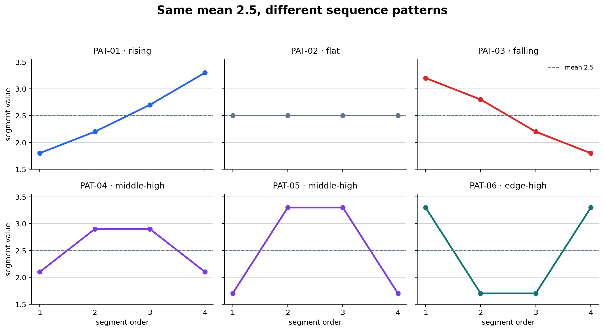

# P7-4.4 Comparing Same Averages with Different Patterns

> Section ID: `P7-4.4`
> Version: `v2026.08.01`

The same average can hide different patterns. Compare distribution, sequence, groups, and error cases before treating one summary number as the complete project result.

This is not an argument against averaging. A mean is useful for a fast magnitude comparison. It is a warning to state which information the mean removes: order, where values concentrate, and the cases that need a different follow-up.

## Learning questions and criteria

- When two records have the same mean, what additional representation could preserve their different sequence?
- Which details are deliberately discarded by an average, and which are retained by a shape token?
- Can the next review action name a stage or pattern instead of repeating the aggregate number?

You have completed this exercise when you can group the six records by mean, split that same group by pattern, and write two different next questions for records that share the mean.

## Averages need their pattern context

| Same summary | Different hidden pattern | Review question |
| --- | --- | --- |
| Same mean metric | One group is consistently weak | Which group needs separate evaluation? |
| Same loss average | One interval is unstable | Does time or order explain the change? |
| Same accuracy | Different recovered and new errors | Which cases changed? |

The exercise asks learners to preserve the aggregation rule and inspect the structure below it. A chart or table should make the hidden differences visible without asserting a cause.

The decision flow separates the two summaries. First calculate the mean to make the broad group. Then add a compact pattern representation only when the order changes the interpretation.

```mermaid
--8<-- "assets/part-07/chapter-04/p7-4-4-pattern-decision-flow-en.mmd"
```

## Run the equal-mean pattern comparison

Use [`p7-action-unit-pattern-pairs.csv`](../../../assets/part-07/chapter-04/p7-action-unit-pattern-pairs.csv){ .csv-preview }. A row is one action summarized into four segments. The six representative records all have mean `2.5`, yet they should not be assigned the same review note.

```python
import csv
from pathlib import Path

rows = list(csv.DictReader(Path("docs/assets/part-07/chapter-04/p7-action-unit-pattern-pairs.csv").open(encoding="utf-8")))
rows = [row for row in rows if row["event_id"] in {f"PAT-{number:02d}" for number in range(1, 7)}]
def values(row): return [float(row[f"segment_{index}"]) for index in range(1, 5)]
def shape_token(items):
    first, second, third, fourth = items
    if first < second < third < fourth: return "rising"
    if first > second > third > fourth: return "falling"
    if len({round(value, 2) for value in items}) == 1: return "flat"
    if second > first and third > fourth: return "middle_high"
    if first > second and fourth > third: return "edge_high"
    return "mixed"
records = []
for row in rows:
    segment_values = values(row); average = round(sum(segment_values) / len(segment_values), 3)
    records.append({"event_id": row["event_id"], "pair_id": row["pair_id"], "average": average, "shape_token": shape_token(segment_values), "expected_shape": row["expected_shape"]})
average_groups, pattern_groups = {}, {}
for record in records:
    average_groups.setdefault(f"avg={record['average']}", []).append(record["event_id"])
    pattern_groups.setdefault(f"avg={record['average']};shape={record['shape_token']}", []).append(record["event_id"])
print({"event_count": len(records), "average_groups": average_groups, "pattern_groups": pattern_groups, "mismatch": [record["event_id"] for record in records if record["shape_token"] != record["expected_shape"]]})
for record in records: print(record)
```

The result has one average-only group, `avg=2.5`, containing PAT-01 through PAT-06. Shape tokens split it into rising, flat, falling, middle_high (PAT-04 and PAT-05), and edge_high (PAT-06), with no expected-shape mismatch.

The chart reads the same six rows. Every small panel has the same dashed mean line, so the distinction is the sequence around that line rather than a difference in the aggregate.



| Pattern | Segment values | Mean | Human reading |
| --- | --- | ---: | --- |
| Rising | 1.8, 2.2, 2.7, 3.3 | 2.5 | Values grow toward the end. |
| Flat | 2.5, 2.5, 2.5, 2.5 | 2.5 | The action remains stable. |
| Falling | 3.2, 2.8, 2.2, 1.8 | 2.5 | Values decline toward the end. |

## Turn the grouping into different next actions

| Average-only record | Pattern-aware record | Different next question |
| --- | --- | --- |
| “All six actions average 2.5.” | “PAT-01 rises while PAT-03 falls.” | Is late-stage behavior becoming stronger or weaker? |
| “PAT-04 and PAT-06 are similar by mean.” | “PAT-04 is middle-high; PAT-06 is edge-high.” | Does the concern occur in the middle or at the boundaries? |
| “The group is stable on average.” | “Only PAT-02 is flat.” | Which actions need a stage-specific review? |

An average is not wrong. It is a compression choice. It keeps overall magnitude and discards order. A shape token also compresses, but it retains an interpretable direction or concentration pattern while discarding exact segment values.

For example, PAT-01 and PAT-03 both average `2.5`. PAT-01 rises toward the final segment, whereas PAT-03 falls. If the segment order represents the stages of a process, these lead to different questions: investigate a late increase for PAT-01 and a late decrease for PAT-03. The chart does not establish why either pattern occurred; it identifies the evidence that a mean alone would conceal.

PAT-04 and PAT-05 are both `middle_high`. This is a second compression: it keeps the fact that the middle is elevated but intentionally does not claim that the two records are identical. PAT-06, in contrast, is `edge_high`, so a boundary-stage review is more appropriate than a middle-stage review.

## Record the comparison, not a causal story

Use a project note that distinguishes observations from hypotheses:

```text
comparison unit: one action summarized in four ordered segments
shared aggregate: mean = 2.5 for PAT-01 through PAT-06
pattern distinction: PAT-01 rising; PAT-03 falling
information lost by mean: direction across the four segments
next review question: compare the final stage for rising and falling records
cause status: not established by this comparison alone
```

This wording prevents a common overreach. A rising curve may be important, but it does not prove a system fault, a user action, or a temporal cause. The next step may be to inspect raw examples, split by a relevant group, or collect more cases.

## Try controlled changes

1. Change PAT-02 to `2.4, 2.6, 2.4, 2.6`. Its mean remains `2.5`; decide whether `flat` still describes it.
2. Raise the final value of PAT-03 to `2.1`. Record whether the evidence is still strong enough to use `falling`.
3. Merge `middle_high` and `edge_high` into `non_flat`. List the review information this simpler label loses.
4. Choose PAT-01 and PAT-03. Write one mean-only note and one pattern-aware note, then make the next question different in the two notes.

After each change, rerun the program and compare the average-only and pattern-aware groups. The goal is not to find a universally correct token vocabulary; it is to make the representation choice and its information loss explicit.

## Read the result in layers

There are three useful layers in the output. Keep them separate in a review note.

| Layer | What the example reports | What it does not report |
| --- | --- | --- |
| Raw sequence | Four ordered values for one action | The cause of those values |
| Mean group | All six selected records have mean `2.5` | Their order or concentration |
| Shape group | A compact label such as `rising` or `edge_high` | Every numerical difference inside that label |

The first layer is the evidence closest to the data. The second makes a broad comparison cheap. The third restores one part of the lost structure. A good project record can link all three: retain a reference to the original row, state the summary rule, and explain why the token changes the next review question.

Do not treat the shape token as a label generated by an opaque model. Here it is a transparent rule based on four values. That makes disagreement productive: if a learner believes PAT-04 should not be called `middle_high`, they can inspect the rule, revise it, and state what newly differs.

### What the mean hides in this dataset

The mean hides at least four distinctions in the representative records:

- **Direction:** PAT-01 moves upward while PAT-03 moves downward.
- **Stability:** PAT-02 stays at the mean in every segment, unlike all non-flat records.
- **Concentration location:** PAT-04 and PAT-05 are high in the middle; PAT-06 is high at both edges.
- **Review target:** a late-stage comparison is relevant to rising/falling patterns, whereas a boundary check is relevant to edge-high patterns.

These are not claims about importance by themselves. They are candidate breakdowns. A real project still needs a domain question, enough examples, and a decision about which variation is material.

### When a mean may be enough

A mean can be a sufficient record when the order is not meaningful, when the variation is tiny relative to the task threshold, or when the next action genuinely does not change across shapes. State that choice explicitly. For example: “The four segments are unordered samples, so we retain their mean and spread but do not assign a directional token.”

The opposite statement is equally valuable: “Segment order represents successive stages, so mean-only reporting would hide a late-stage change.” The important practice is to connect a summary statistic to the decision it supports.

## Project handoff template

Use this template when passing the comparison to another learner or reviewer:

```text
data slice: representative actions PAT-01 to PAT-06
aggregation: arithmetic mean of segment_1 through segment_4
shared result: every selected action has mean 2.5
additional representation: rule-based shape token
visible difference: rising, flat, falling, middle-high, and edge-high groups
decision boundary: pattern is evidence for review, not proof of cause
next owner/question: inspect whether stage order is meaningful for the task
```

This handoff makes the calculation reproducible and preserves the uncertainty boundary. It also lets a later reviewer replace the token rule without losing the original aggregation result.

## Pairwise review examples

The pairs in the CSV offer small, concrete comparison exercises.

| Pair | Shared fact | Pattern difference | Review prompt |
| --- | --- | --- | --- |
| A: PAT-01 and PAT-02 | Both average `2.5` | Rising versus flat | Is a stable process being mixed with a late increase? |
| B: PAT-03 and PAT-04 | Both average `2.5` | Falling versus middle-high | Is the change directional or concentrated in the middle? |
| C: PAT-05 and PAT-06 | Both average `2.5` | Middle-high versus edge-high | Should a review start at the middle or at the boundaries? |

For each pair, write the smallest claim supported by the values. “The sequences differ” is supported. “The rising pattern is worse” is not supported until the task defines which direction, stage, or threshold matters.

This distinction also applies when an aggregate changes. If a future dataset has a different mean, first record the numerical change. Then ask whether the pattern comparison changes its interpretation. An aggregate and a pattern are complementary records, not competing ones.

### A practical stopping rule

Do not create ever more tokens only because a sequence is not flat. Stop refining when the additional label would not change the next question, when there are too few examples to support a stable grouping, or when reviewers cannot explain the rule consistently. In those cases, keep the raw sequence available and record the uncertainty rather than inventing precision.

Conversely, add a representation when mean-only notes merge cases that lead to different checks. In this exercise, the compact five-token vocabulary is enough to show that one shared average does not imply one shared project action.

### Self-review before closing the exercise

Answer these questions in your own words:

1. Which exact arithmetic operation created the mean in this example?
2. Which two records demonstrate that a shared mean does not preserve direction?
3. What raw evidence would you reopen if you disagreed with a shape token?
4. Which next question would become impossible to ask if only the mean were stored?
5. What causal claim must remain open after this comparison?

If those answers identify both the useful summary and its limit, the record is ready for a project review.

Keep the CSV row identifier with the note so another reviewer can reproduce the comparison.
Also retain the aggregation rule alongside every token label.

## Checklist

| Check | Question to answer |
| --- | --- |
| Comparison unit | Is one row one four-segment action summary? |
| Average group | Did you list which records share the mean? |
| Pattern group | Did a token split the same mean into distinct shapes? |
| Information loss | Which detail was removed by the average and by the token? |
| Next review | Does the next action refer to a stage or pattern rather than the mean alone? |

## Checklist

| Check | Question to answer |
| --- | --- |
| Summary | What averaging rule produced the number? |
| Pattern | Which groups, times, or cases differ underneath it? |
| Error | What does the aggregate hide? |
| Interpretation | What cannot be concluded from the average? |
| Next question | Which breakdown should be checked next? |
| Evidence boundary | Did the note avoid claiming a cause from the aggregate or shape alone? |

## Sources and references

State the averaging rule before interpreting its result.
Preserve the groups or patterns that the mean compresses.
Check whether a new token or breakdown changes the project decision.
Keep the aggregate and the sample-level evidence together.
Do not infer a causal mechanism from one shared average.

The comparison examples are created for this book.
