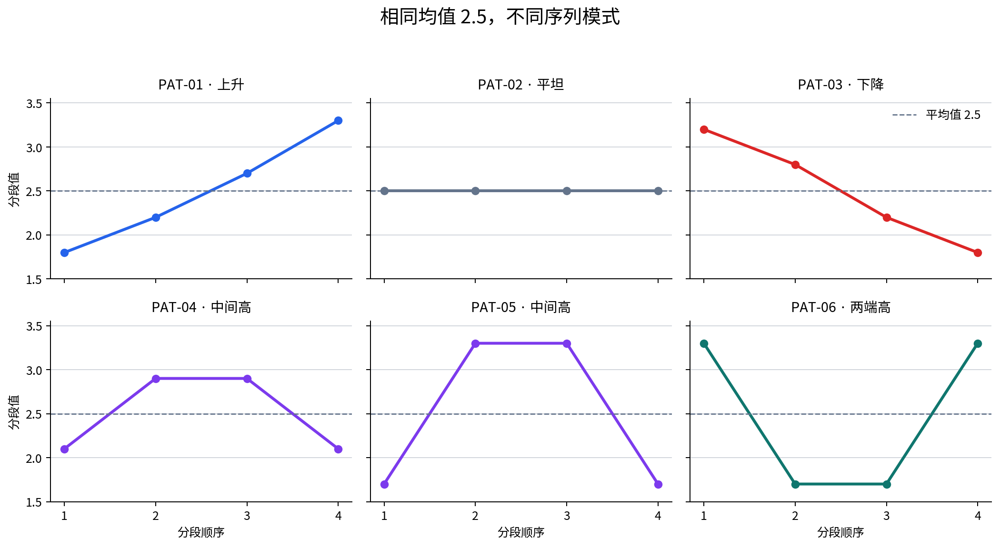

# P7-4.4 比较相同平均值的不同模式

> Section ID: `P7-4.4`
> Version: `v2026.08.01`

相同平均值可以隐藏不同模式。在把一个汇总数字当作完整项目结果前，应比较分布、顺序、群组和错误案例。

这不是反对平均。均值适合快速比较量级；它提醒我们写明均值移除了什么信息：顺序、数值集中位置，以及需要不同后续行动的案例。

## 学习问题与标准

- 两条记录均值相同时，哪种附加表示能保留不同序列？
- 平均故意丢弃哪些细节，形状词元又保留哪些？
- 下一项复核行动能否命名阶段或模式，而不是重复汇总数字？

当你能按均值将六条记录分组，再按模式拆分同一组，并为共享均值的记录写出两个不同问题时，就完成本练习。

## 平均值需要模式上下文

| 相同汇总 | 隐藏的不同模式 | 复核问题 |
| --- | --- | --- |
| 相同指标均值 | 一个组持续较弱。 | 哪个组需要单独评估？ |
| 相同损失平均 | 一个区间不稳定。 | 时间或顺序能解释变化吗？ |
| 相同准确率 | 恢复与新错误不同。 | 哪些案例改变？ |

练习要求学习者保留聚合规则，并检查规则下方的结构。图表或表格应让隐藏差异可见，却不主张原因。

```mermaid
--8<-- "assets/part-07/chapter-04/p7-4-4-pattern-decision-flow-zh.mmd"
```

## 运行同均值模式比较

使用 [`p7-action-unit-pattern-pairs.zh.csv`](../../../assets/part-07/chapter-04/p7-action-unit-pattern-pairs.zh.csv){ .csv-preview }。一行是一项行动的四个分段汇总。六条代表记录的均值都是 `2.5`，却不应得到相同复核说明。

```python
import csv
from pathlib import Path

rows = list(csv.DictReader(Path("docs/assets/part-07/chapter-04/p7-action-unit-pattern-pairs.zh.csv").open(encoding="utf-8")))
rows = [row for row in rows if row["event_id"] in {f"PAT-{number:02d}" for number in range(1, 7)}]
def values(row): return [float(row[f"segment_{index}"]) for index in range(1, 5)]
def shape_token(items):
    first, second, third, fourth = items
    if first < second < third < fourth: return "上升"
    if first > second > third > fourth: return "下降"
    if len({round(value, 2) for value in items}) == 1: return "平坦"
    if second > first and third > fourth: return "中间高"
    if first > second and fourth > third: return "两端高"
    return "混合"
records = []
for row in rows:
    segment_values = values(row); average = round(sum(segment_values) / len(segment_values), 3)
    records.append({"event_id": row["event_id"], "pair_id": row["pair_id"], "average": average, "shape_token": shape_token(segment_values), "expected_shape": row["expected_shape"]})
average_groups, pattern_groups = {}, {}
for record in records:
    average_groups.setdefault(f"avg={record['average']}", []).append(record["event_id"])
    pattern_groups.setdefault(f"avg={record['average']};shape={record['shape_token']}", []).append(record["event_id"])
print({"事件数": len(records), "平均组": average_groups, "模式组": pattern_groups})
for record in records: print(record)
```

结果有一个仅按平均的组 `avg=2.5`，包含 PAT-01 到 PAT-06。形状词元把它拆为上升、平坦、下降、中间高（PAT-04 与 PAT-05）和两端高（PAT-06）。



| 模式 | 分段值 | 均值 | 人可读的解释 |
| --- | --- | ---: | --- |
| 上升 | 1.8、2.2、2.7、3.3 | 2.5 | 数值在末尾变强。 |
| 平坦 | 2.5、2.5、2.5、2.5 | 2.5 | 行动保持稳定。 |
| 下降 | 3.2、2.8、2.2、1.8 | 2.5 | 数值向末尾下降。 |

## 把分组变成不同后续行动

| 仅平均记录 | 模式感知记录 | 不同下一问题 |
| --- | --- | --- |
| “六项行动均值都是 2.5。” | “PAT-01 上升，PAT-03 下降。” | 末阶段行为变强还是变弱？ |
| “PAT-04 与 PAT-06 的均值相似。” | “PAT-04 中间高，PAT-06 两端高。” | 担忧发生在中间还是边界？ |
| “这个组平均稳定。” | “只有 PAT-02 平坦。” | 哪些行动需要阶段特定复核？ |

平均并不错误，它是一种压缩选择：保留总体量级，丢弃顺序。形状词元也是压缩，却保留可解释的方向或集中模式，同时丢弃精确分段数值。

例如，PAT-01 与 PAT-03 的均值都是 `2.5`。PAT-01 向最后分段上升，PAT-03 下降。若分段顺序表示过程阶段，二者产生不同问题：对 PAT-01 检查后期增加，对 PAT-03 检查后期下降。图表不建立原因，只识别均值会隐藏的证据。

PAT-04 与 PAT-05 都是中间高。这是第二层压缩：保留中间升高的事实，却不说两行相同。PAT-06 则是两端高，因此边界阶段复核比中间阶段复核更合适。

## 记录比较，而非因果故事

```text
比较单位：一项行动的四个有序分段汇总
共享聚合：PAT-01 到 PAT-06 的均值均为 2.5
模式区分：PAT-01 上升；PAT-03 下降
均值丢失的信息：四个分段的方向
下一复核问题：比较上升与下降记录的最终阶段
原因状态：本比较本身不能建立
```

这段写法防止常见过度推断。上升曲线可能重要，却不证明系统故障、用户行为或时间原因。下一步可以检查原始例子、按相关组拆分或收集更多案例。

## 用受控变化检查表示

1. 将 PAT-02 改为 `2.4, 2.6, 2.4, 2.6`。均值仍是 `2.5`；判断 `平坦` 是否仍合适。
2. 将 PAT-03 的最终值提高到 `2.1`。记录证据是否仍足以使用 `下降`。
3. 将 `中间高` 与 `两端高` 合并为 `非平坦`。列出这个更简单标签失去的复核信息。
4. 选择 PAT-01 与 PAT-03。分别写均值说明和模式说明，让两种说明的下一问题不同。

每次修改后重跑程序，并比较仅平均组与模式感知组。目标不是找到普适正确的词元词汇，而是让表示选择及其信息损失可见。

## 分层阅读结果

输出中有三个有用层次，复核说明应将它们分开。

| 层次 | 示例报告什么 | 它不报告什么 |
| --- | --- | --- |
| 原始序列 | 一项行动的四个有序值。 | 这些值的原因。 |
| 均值组 | 所选六条记录均值都是 `2.5`。 | 它们的顺序或集中位置。 |
| 形状组 | 上升或两端高等紧凑标签。 | 标签内的每个数值差异。 |

第一层最接近数据；第二层使宽泛比较成本低；第三层恢复一部分丢失结构。良好的项目记录可连接三层：保留原始行引用，说明汇总规则，解释词元为何改变下一复核问题。

不要把形状词元当成不透明模型生成的标签。这里它是基于四个数值的透明规则。若学习者认为 PAT-04 不应叫中间高，可以检查规则、修订它，并说明新出现的差异。

### 本数据中均值隐藏了什么

- **方向：** PAT-01 向上，PAT-03 向下。
- **稳定性：** PAT-02 每个分段都等于均值，其他非平坦记录不是。
- **集中位置：** PAT-04 与 PAT-05 在中间高；PAT-06 在两端高。
- **复核目标：** 上升/下降适合后期比较；两端高适合边界检查。

这些本身不是重要性的主张，而是候选拆分。真实项目仍需要领域问题、足够案例，以及关于哪种变化重要的决定。

### 何时均值可能足够

当顺序没有意义、变化相对任务阈值很小，或不同形状不会改变下一行动时，均值可以成为充分记录。应明确写出选择，例如：“四个分段是无序样本，因此保留均值与离散度，但不分配方向词元。”

相反的说明同样有价值：“分段顺序代表连续阶段，因此只报均值会隐藏后期变化。”关键做法是让汇总统计量连接到它支持的决定。

## 项目交接模板

```text
数据切片：代表行动 PAT-01 到 PAT-06
聚合：segment_1 到 segment_4 的算术平均
共享结果：每项选定行动均值为 2.5
附加表示：基于规则的形状词元
可见差异：上升、平坦、下降、中间高和两端高组
决定边界：模式是复核证据，不是原因证明
下一负责人/问题：检查阶段顺序是否对任务有意义
```

这个交接使计算可复现，也保留不确定性边界。后来的复核者可以替换词元规则，却不丢失原聚合结果。

## 成对复核示例

| 配对 | 共享事实 | 模式差异 | 复核提示 |
| --- | --- | --- | --- |
| A：PAT-01 与 PAT-02 | 均值均为 `2.5`。 | 上升与平坦。 | 稳定过程是否和后期增加混在一起？ |
| B：PAT-03 与 PAT-04 | 均值均为 `2.5`。 | 下降与中间高。 | 变化有方向还是集中于中间？ |
| C：PAT-05 与 PAT-06 | 均值均为 `2.5`。 | 中间高与两端高。 | 复核应从中间还是边界开始？ |

对每一对，写数值支持的最小主张。“序列不同”得到支持；“上升模式更坏”在任务未定义方向、阶段或阈值前不被支持。

当未来数据集有不同均值时，也适用此区分。先记录数值变化，再问模式比较是否改变解释。聚合与模式是互补记录，不是竞争记录。

## 实用停止规则

不要只因序列不是平坦就不断创建更多词元。当附加标签不改变下一问题、案例太少不足以支持稳定分组，或复核者无法一致解释规则时，应停止细化。保留原始序列并记录不确定性，而不是发明精确性。

反过来，当仅均值说明把导向不同检查的案例合并时，应增加表示。本练习的五词元词汇足以展示：共享平均不代表共享项目行动。

## 结束前自检

1. 本例中的均值由哪个算术运算产生？
2. 哪两条记录说明共享均值不能保留方向？
3. 若不同意某个形状词元，应重新打开哪些原始证据？
4. 若只保存均值，哪个下一问题将无法提出？
5. 这次比较后必须保持开放的因果主张是什么？

若答案同时说明有用汇总和其限制，记录就可以进入项目复核。

保留 CSV 行标识，使另一位复核者能重现比较。
也要把聚合规则和每个词元标签放在一起。

## 学习检查表

| 检查 | 要回答的问题 |
| --- | --- |
| 比较单位 | 一行是否是一项四分段行动汇总？ |
| 平均组 | 是否列出哪些记录共享均值？ |
| 模式组 | 词元是否把同均值拆成不同形状？ |
| 信息损失 | 平均和词元各删除了哪些细节？ |
| 下一复核 | 行动是否指向阶段或模式，而非只指向均值？ |

### 最终提醒

先说明平均规则。
保留平均压缩的组和模式。
检查新的词元或拆分是否改变项目决定。
让聚合与样本级证据同时存在。
不要从一个共享平均推断因果机制。

## 可提交的学习产出

完成本节时，交付一张同均值记录表和一张形状拆分表。

| 产出 | 最低内容 |
| --- | --- |
| 平均说明 | 四个分段、计算规则与共享均值组。 |
| 形状说明 | 透明规则、词元与每条记录的分段值。 |
| 对比问题 | 至少一对共享均值但后续行动不同的记录。 |
| 限制说明 | 均值和词元都不能单独证明原因。 |
| 下一行动 | 一个与阶段、边界或模式有关的检查。 |

均值提供量级。
模式提供位置与方向。
项目决定需要两者一起阅读。

保留原始顺序。
保留汇总规则。
保留下一问题。

## 来源与参考

本节的比较数据和示例由本书创建。
