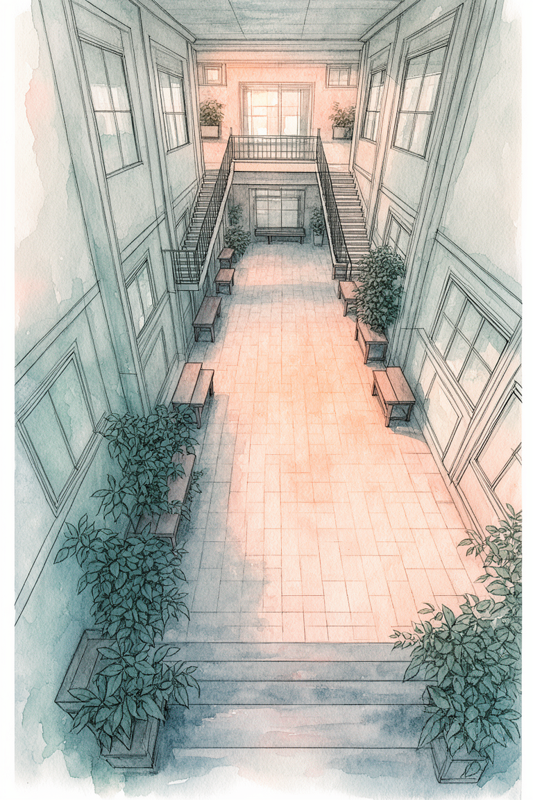

# P7-5.1 로컬 GPU로 프레임 없는 웹툰 화풍 참조 팩 만들기

> Section ID: `P7-5.1`
> Version: `v2026.08.03`

캐릭터를 만들기 전에 화풍 기준을 먼저 고정해야 할 때가 있습니다. 여기서 화풍 팩은 특정 배경 그림을 모아 두는 장식용 이미지 모음이 아닙니다. 인물과 소품을 넣기 전, 선의 역할, 색의 겹침, 시간대의 광원, 장소의 폭, 카메라 구도를 사람이 검수할 수 있는 입력 집합입니다. 이 절의 질문은 **8 GB급 로컬 GPU에서 만든 배경 화풍 표본이 다음 캐릭터 생성의 기준이 될 조건은 무엇인가**입니다.

## 화풍은 팔레트 하나로 고정되지 않는다

같은 청록색과 주황빛을 쓴다고 같은 웹툰 화풍이 되지는 않습니다. 선이 명암을 대신하는지, 수채화 색면 아래에 남는지, 실내의 인공광과 실외의 자연광에서 색의 대비가 어떻게 달라지는지, 높은 시점과 낮은 시점에서 원근선이 어떻게 놓이는지가 함께 반복되어야 합니다.

이 실습의 수채화 계약은 얇은 charcoal 윤곽선과 건축 구조선을 남기고, 그 아래에 pale teal·indigo shadow·muted olive·warm apricot·off-white의 투명 색면을 겹치는 것입니다. 해칭, crosshatching, 점묘, 검은 먹 번짐은 드로잉 라인이 아니라 명암을 채우는 질감으로 판단해 제외합니다. 수채화는 선을 흐리게 만드는 필터가 아니라 선이 구획한 면에 겹쳐지는 색층입니다.

| 확인 축 | 통과 조건 | 불합격 신호 |
| --- | --- | --- |
| 외곽 | 생성 원본이 프레임 없이 캔버스를 채움 | page border, panel frame, 사후 crop 필요 |
| 선 | 윤곽·구조·원근선이 읽힘 | 선이 색 번짐에 묻힘, 명암 해칭이 화면을 지배함 |
| 색 | 반투명 수채화 색층과 시간대별 광원이 함께 보임 | 단색 먹 질감, 불투명 airbrush, neon |
| 공간 | 실내와 실외가 모두 있음 | 한 장소 유형의 반복 |
| 카메라 | high angle, low angle, wide eye-level, oblique side, overhead high angle이 실제로 다름 | 세로 중앙 소실점·아이레벨 구도 반복 |

## 장소와 카메라를 교차하는 입력 행렬

한 장면에서 seed만 바꾸면 다른 장소와 카메라를 다뤘다고 볼 수 없습니다. 다음 다섯 행은 같은 장면의 변형이 아니라, 장소·시간·카메라가 모두 다른 최소 검수 집합입니다.

| scene ID | 장소 | 시간 | 카메라 |
| --- | --- | --- | --- |
| `indoor-dawn-high-angle` | 실내 | 새벽 | high angle |
| `indoor-night-oblique` | 실내 | 밤 | oblique side view |
| `outdoor-day-wide` | 실외 | 낮 | wide eye-level |
| `outdoor-sunset-low-angle` | 실외 | 해질녘 | low angle |
| `outdoor-rainy-night-overhead` | 실외 | 우천 야간 | overhead high angle |

각 행에는 사람·동물·차량·읽을 수 있는 표지·글자를 넣지 않습니다. 화풍 팩은 캐릭터 identity나 소품 geometry를 정하는 자산이 아니기 때문입니다. 프롬프트에는 `no border frame`, `no panel`, `fill the canvas edge to edge`를 함께 쓰되, 이 단어가 있다고 통과로 처리하지 않습니다. 출력 원본에서 프레임이 보이면 그 이미지는 crop으로 살리지 않고 불합격입니다.

## 로컬 GPU 실행 기록을 사람 검수와 연결하기

현재 로컬 `FLUX.2-klein-base-4B`는 sequential CPU offload에서 `768 x 1152`, 50 step, batch 1의 배경 후보를 만들 수 있었습니다. 그러나 실행 가능성은 화풍 팩 승인과 다릅니다. 첫 flat-color pack은 장소·시간·카메라 폭이 좁았고, 수채화 후보는 일부 출력의 page frame을 crop해야 했으며 여러 표본이 수직 중앙 소실점으로 수렴했습니다. 세탁소 야간 후보는 공간 원근은 맞았지만 해칭이 과도해 제외했습니다. 이 출력 PNG는 화풍 기준 자산으로 보존하지 않습니다. [검수 ledger](../../../assets/part-07/chapter-05/p7-5-0-local-style-pack-review.json)에 실패 원인과 다음 입력 행렬만 남깁니다.

아래 Python 예제는 실행 결과가 다음 단계로 넘어갈 수 있는지 확인합니다. `status`가 승인 상태가 아니거나 장소·시간·camera 행렬이 빠지면 `BLOCKED`를 출력합니다. 다음 생성에서는 각 PNG의 frame·선·색·장소·시간·camera를 사람이 ledger에 기록한 뒤에만 status를 바꿉니다.

```python
python docs/assets/part-07/chapter-05/p7_5_0_local_style_pack_gate.py
```

첫 high-angle 후보는 outer frame 없이 생성됐고, 아이레벨 복도와 다른 하향 시점을 실제로 보여 조건부 통과로 남겼습니다. 그러나 이 한 장은 나머지 camera family를 대신하지 못하므로 전체 출력은 계속 `BLOCKED style pack`입니다.



통과 뒤에만 이 팩을 `P7-5.2`의 character reference 생성 입력으로 사용합니다. [실행 기록](../../../assets/part-07/chapter-05/p7-5-0-style-high-angle-candidate.json)과 [high-angle probe](#local-style-high-angle-probe)를 함께 확인합니다.

<details id="local-style-pack-gate" class="aibook-lazy-source" data-source="../../../../assets/part-07/chapter-05/p7_5_0_local_style_pack_gate.py" data-language="python">
<summary>local style pack gate 전문 보기</summary>
<div class="aibook-lazy-source__body">펼치면 Python 원문을 불러옵니다.</div>
</details>

<details id="local-style-high-angle-probe" class="aibook-lazy-source" data-source="../../../../assets/part-07/chapter-05/p7_5_0_flux2_style_high_angle_probe.py" data-language="python">
<summary>frame-free high-angle style probe 전문 보기</summary>
<div class="aibook-lazy-source__body">펼치면 Python 원문을 불러옵니다.</div>
</details>

## 체크리스트

| 확인할 것 | 스스로 답할 질문 |
| --- | --- |
| 원본 | crop 없이 프레임 없는 생성 원본인가? |
| 선과 색 | 선화가 살아 있고 수채화 색층이 선을 덮지 않는가? |
| 시간 | 새벽·낮·해질녘·밤·우천 야간이 실제 광원 차이로 읽히는가? |
| 카메라 | 같은 중앙 소실점 반복이 아니라 camera family가 다른가? |
| 다음 입력 | 인물·소품을 넣기 전에 style pack 자체를 승인했는가? |

## 출처와 참고 자료

- Black Forest Labs, [FLUX.2 Klein 4B model card](https://huggingface.co/black-forest-labs/FLUX.2-klein-4B){: target="_blank" rel="noopener noreferrer" }, 확인일: 2026-08-03.
- Hugging Face, [Diffusers FLUX.2 Klein pipeline](https://huggingface.co/docs/diffusers/main/en/api/pipelines/flux2_klein){: target="_blank" rel="noopener noreferrer" }, 확인일: 2026-08-03.
