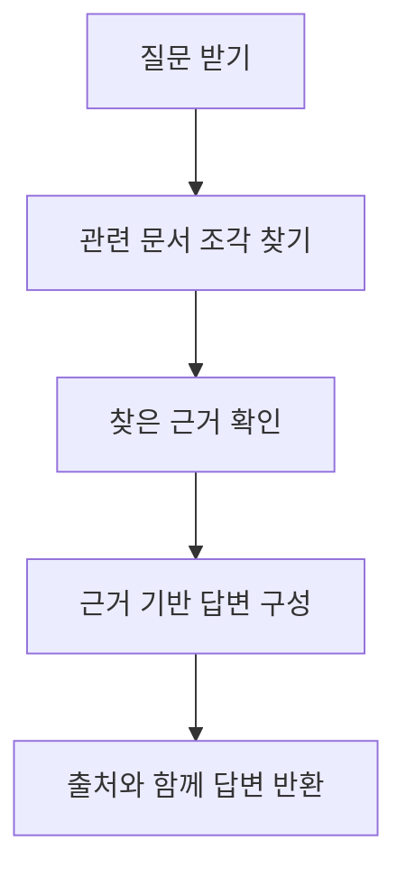

# P7-5.1 문서 기반 RAG 챗봇 목표

> Section ID: `P7-5.1`
> Version: `v2026.07.18`

Part 5에서 RAG(retrieval-augmented generation)를 개념으로 설명했다면, Part 7에서는 그 구조를 실제 검색 후보 비교와 근거 선택 장면으로 다시 확인해야 합니다.

핵심은 복잡한 챗봇 UI를 만드는 것이 아닙니다.

질문을 받고, 관련 문서를 찾고, 찾은 근거를 바탕으로 답을 구성하는 흐름을 문서로 남기는 것이 이번 프로젝트의 출발점입니다. 이 프로젝트의 목적은 챗봇을 화려하게 만드는 것이 아니라, `검색 후보가 어떻게 갈렸는지`, `어떤 근거를 실제로 채택했는지`, `그래서 왜 이 답이 나왔는지`를 분리해 기록하는 습관을 만드는 데 있습니다.

## 이 절의 범위

- RAG 프로젝트는 어떤 구성요소로 시작하면 좋은가?
- 검색(retrieval)과 생성(generation)을 왜 분리해서 적어야 하는가?
- 로컬 문서 집합에서도 검색 후보 사이의 경쟁과 근거 선택을 설명할 수 있는가?

이 절은 RAG의 최소 프로젝트 흐름을 문서화하는 데 집중합니다. 즉, 여기서는 `질문 -> 검색 -> 근거 -> 답변 -> 출처`로 RAG 프로젝트 문서를 어떻게 시작할지까지를 먼저 닫습니다. 검색 실패와 답변 실패를 구분하는 검증 구조는 바로 다음 P7-5.2 검색 품질과 답변 검증에서 다시 회수하고, 뒤의 실패 기록 절들에서도 같은 검토 구조를 다시 사용합니다.

RAG 프로젝트의 산출물은 이 절에서 질문, 검색, 근거, 답변의 네 칸으로 묶입니다. 이 절은 그 흐름을 하나의 프로젝트 문서로 정리하는 기준을 세웁니다.

Part 7에서 `검색 증강 생성(RAG)`, `근거(evidence)`, `검토(review)`의 역할이 다시 섞이면 이 절과 [개념사전](../../../reference/concept-glossary.md)으로 돌아오면 됩니다.

## 이 절의 목표

- RAG 프로젝트를 `질문 -> 문서 검색 -> 근거 선택 -> 답변 구성` 흐름으로 설명할 수 있습니다.
- 검색 단계와 답변 단계가 다른 역할이라는 점을 말할 수 있습니다.
- 근거가 있는 답변과 근거가 빈약한 답변을 구분하는 프로젝트 구조를 만들 수 있습니다.

## 왜 RAG 프로젝트가 필요한가

LLM 프로젝트를 처음 만들 때 종종 `모델이 그냥 알고 답하면 되지 않는가?`라고 생각합니다. 하지만 실제 서비스에서는 다음 문제가 바로 나타납니다.

- 모델이 최신 문서를 모를 수 있다.
- 프로젝트 전용 문서나 내부 규칙은 학습 데이터에 없을 수 있다.
- 답변이 그럴듯해 보여도 근거가 없을 수 있다.

그래서 RAG 프로젝트는 `모델 기억`이 아니라 `문서 검색과 근거 연결`을 먼저 다룹니다.

OpenAI Retrieval 가이드는 retrieval을 문서 검색과 모델 답변 결합 구조로 설명합니다. 핵심은 검색 결과가 모델 입력에 들어가 답변 근거가 된다는 점입니다. 여기서는 그 거대한 구조를 모두 구현하지 않고, `후보 비교 -> 근거 선택 -> 답변 구성` 흐름이 실제로 보이도록 예제를 축소합니다.

RAG 프로젝트 입구에서 바로 확인해야 할 판단 기준을 표로 고정하면 다음과 같습니다.

| 질문 | 짧은 답 |
| --- | --- |
| 이 프로젝트에서 먼저 남길 것은 무엇인가? | 질문, 검색 결과, 근거 문장 |
| 왜 답변보다 검색을 먼저 보나? | 근거가 없는 답을 줄이기 위해 |
| 최소 산출물은 무엇인가? | 가장 관련 높은 문서, 문서 식별자, 근거 기반 답변 |

여기에 한 가지를 더 붙이면 RAG 프로젝트의 입구부터 기록 구조가 더 분명해집니다. 질문과 가장 관련 높은 문서만 적는 데서 끝내지 말고, `어떤 검색 후보가 있었는가`, `어떤 근거를 실제로 채택했는가`, `어떤 질문은 다시 검토가 필요할 수 있는가`를 같이 적어 두는 것입니다.

| 입구에서 같이 남길 기록 | 왜 필요한가 |
| --- | --- |
| 검색 후보 목록 | 어떤 문서들이 비교되었는지 다시 보기 위해서입니다. |
| 선택한 근거 | 답변이 실제로 어디서 출발했는지 고정하기 위해서입니다. |
| 다시 볼 질문 | 근거가 약하거나 검색이 애매한 질문을 따로 보기 위해서입니다. |
| 다음 검토 질문 | 문서 분할, 검색 규칙, 답변 작성 규칙 중 어디를 먼저 바꿀지 정하기 위해서입니다. |

## 프로젝트 질문 설정

이번 프로젝트는 `문서 집합 안에서 RAG 프로젝트의 품질 점검 규칙을 설명하는 질문이 들어왔을 때, 검색 후보를 먼저 비교하고 그중 질문에 직접 답하는 근거만 골라 답할 수 있는가?`라는 질문에서 시작합니다. 이 질문은 `검색`과 `답변`을 분리해 기록할 수 있고, 검색 점수만 높다고 바로 좋은 근거가 되는 것은 아니라는 점도 함께 보여 줄 수 있습니다.

## 프로젝트 흐름



이 도식은 RAG 프로젝트의 핵심이 `답변 생성`보다 먼저 `근거 검색`에 있다는 점을 보여 줍니다. 질문을 받고 문서를 찾고, 그 문서가 정말 근거가 되는지 확인한 뒤에 답변을 구성해야, 나중에 출처와 함께 검토 가능한 결과가 남습니다.

프로젝트 기록으로 정리하면 순서는 다음과 같습니다.

| 단계 | 문서에 남길 것 |
| --- | --- |
| 질문 | 사용자가 무엇을 물었는가 |
| 검색 | 어떤 문서가 선택되었는가 |
| 근거 확인 | 실제로 어떤 문장을 근거로 삼았는가 |
| 답변 | 그 근거 범위 안에서 무엇을 말했는가 |
| 출처 | 어떤 문서 식별자를 남겼는가 |

이 구조의 장점은 입력 형태가 달라져도 기록 원칙이 크게 흔들리지 않는다는 점입니다. 표를 읽는 프로젝트든, 예측 모델 프로젝트든, 문서 검색 프로젝트든 결국 `무엇을 입력으로 받았는가`, `무엇을 근거로 선택했는가`, `무슨 결과를 남겼는가`를 분리해 적어야 나중에 다시 검토하고 비교하기 쉽습니다.

같은 흐름을 최소 기록으로 줄이면 다음 표처럼 정리할 수 있습니다.

| 단계 | 다시 검토가 필요한 상태 | 다음 행동 |
| --- | --- | --- |
| 검색 후보 비교 | 최고 점수가 낮거나 후보가 비슷함 | 검색 규칙 다시 검토 |
| 근거 선택 | 선택 문장이 질문에 직접 답하지 않음 | 근거 문장 다시 선택 |
| 답변 구성 | 근거 밖 문장이 섞일 위험이 있음 | 근거 안에서 답변 다시 작성 |

이 표가 있으면 RAG 프로젝트 입구부터 `검색 후보 -> 근거 -> 다시 볼 질문` 구조가 보입니다.

## 작은 문서 집합 예제

이번 절에서는 실제 외부 문서 대신, 운영 문서와 가이드 조각이 섞인 6개 문서 청크를 작은 지식베이스로 둡니다. 중요한 점은 질문과 관련 있어 보이는 문서가 여러 개 있지만, 그중에서도 `질문에 직접 답하는 문장`과 `주변 설명만 하는 문장`을 다시 구분해야 한다는 것입니다.

| 문서 식별자 | 내용 |
| --- | --- |
| 문서-1 | `RAG는 외부 문서를 검색해 모델 입력에 넣고, 그 근거 위에서 답변을 구성하는 구조다.` |
| 문서-2 | `프롬프트만으로는 최신 문서 근거를 보장할 수 없으므로, 최신 규칙이 필요한 서비스에서는 검색 단계가 먼저 필요하다.` |
| 문서-3 | `검색 후보 점수가 높아도 질문에 직접 답하지 않는 문장이 섞일 수 있으므로, 선택 근거를 따로 남겨야 한다.` |
| 문서-4 | `RAG 프로젝트 기록에는 질문, 검색 후보, 선택 근거, 최종 답변을 분리해 남겨야 검색 실패와 답변 실패를 나중에 구분할 수 있다.` |
| 문서-5 | `문서 분할(chunking)은 검색 범위를 세밀하게 만들지만, 너무 잘게 나누면 문맥이 끊길 수 있다.` |
| 문서-6 | `재정렬(reranking)은 상위 후보의 순서를 다시 바꾸어 질문에 더 직접 답하는 근거를 앞으로 당기는 단계다.` |

## Python 예제

이번 예제의 목적은 복잡한 임베딩 없이도 `질문 -> 검색 후보 비교 -> 선택 근거 -> 근거 포함 답변` 흐름을 눈으로 확인하는 것입니다. 이번에는 가장 높은 문서 하나만 찍고 끝내지 않고, 상위 후보 여러 개를 남기고 그중 질문에 직접 답하는 근거 두 개만 선택해 답변을 구성하겠습니다. 검색 기록은 후보 경쟁을 남기고, 선택 근거는 실제 답변에 올린 문장만 고정하며, 근거 답변 기록은 질문과 근거와 답변을 같은 묶음으로 보존합니다.

| 이 기록 종류 | 지금 남기는 이유 | 뒤에서 다시 쓰는 곳 |
| --- | --- | --- |
| 검색 기록 | 선택된 문서만 남기지 않고, 어떤 후보들이 어떤 점수로 비교되었는지 남기기 위해 | 검색 품질 검토, 누락 문서 점검, RAG 회고에서 후보 비교 근거가 된다 |
| 선택 근거 | 답변에 실제로 사용한 근거 한 조각을 고정하기 위해 | 답변 검토, 출처 확인, 근거 교체 실험에서 바로 다시 본다 |
| 근거 답변 기록 | 질문, 근거, 답변을 흩어 두지 않고 같은 실행 묶음으로 보존하기 위해 | 뒤 절의 평가 기록, 리뷰 요약, 응답 상태 판정으로 이어지는 최소 단위가 된다 |

- 문제 상황: RAG 흐름을 아주 작은 로컬 지식베이스로 재현한다.
- 입력: 질문 1개, 문서 조각 6개
- 기대 출력: 상위 검색 후보 목록, 실제로 채택한 근거 2개, 근거 기반 답변
- 확인할 개념:
  - 검색이 먼저다
  - 답변은 검색 결과 위에 작성된다
  - 검색 점수가 높다고 바로 좋은 근거가 되는 것은 아니다
  - 출처 문서 식별자를 함께 남길 수 있다
  - 질문별 검색 기록이 남아야 다음 검증 절로 이어질 수 있다

이번 절에서는 실습용 문서 조각을 코드 안에 직접 쓰지 않고 [`p7-5-rag-documents.csv`](../../../assets/part-07/chapter-05/p7-5-rag-documents.csv)에 둡니다. Python 코드는 그 파일을 읽고 질문 하나에 대한 검색 후보와 선택 근거를 만드는 단계부터 시작합니다.

## 입력 파일

- 파일 경로: [`p7-5-rag-documents.csv`](../../../assets/part-07/chapter-05/p7-5-rag-documents.csv)
- 한 행의 의미: `검색 가능한 문서 조각 하나`
- 핵심 열: `doc_id`, `text`

입력 파일의 앞부분만 짧게 다시 보면 다음과 같습니다.

| doc_id | text |
| --- | --- |
| 문서-1 | RAG는 외부 문서를 검색해 모델 입력에 넣고 그 근거 위에서 답변을 구성하는 구조다. |
| 문서-2 | 프롬프트만으로는 최신 문서 근거를 보장할 수 없으므로 최신 규칙이 필요한 서비스에서는 검색 단계가 먼저 필요하다. |
| 문서-3 | 검색 후보 점수가 높아도 질문에 직접 답하지 않는 문장이 섞일 수 있으므로 선택 근거를 따로 남겨야 한다. |

```python
import csv
from pathlib import Path

질문 = "RAG 프로젝트에서 왜 검색 후보와 선택 근거를 답변보다 먼저 기록해야 하는가?"

data_path = Path("docs/assets/part-07/chapter-05/p7-5-rag-documents.csv")
document_rows = list(csv.DictReader(data_path.open(encoding="utf-8")))
documents = {row["doc_id"]: row["text"] for row in document_rows}

def 토큰_정리(token):
    token = token.replace("?", "").replace(".", "")
    for keyword in ["RAG", "MCP"]:
        if token.startswith(keyword):
            return keyword
    return token

def 토큰화(text):
    return {토큰_정리(token) for token in text.split()}

질문_토큰 = 토큰화(질문)
검색_기록 = []

for 문서_식별자, text in documents.items():
    문서_토큰 = 토큰화(text)
    겹친_토큰_수 = len(질문_토큰 & 문서_토큰)
    질문_직접성_보너스 = 1 if ("기록" in text or "구분" in text) else 0
    최종_점수 = 겹친_토큰_수 + 질문_직접성_보너스
    검색_기록.append({
        "문서 식별자": 문서_식별자,
        "겹친 토큰 수": 겹친_토큰_수,
        "질문 직접성 보너스": 질문_직접성_보너스,
        "최종 점수": 최종_점수,
        "문장": text,
    })

검색_기록.sort(key=lambda x: (x["최종 점수"], x["겹친 토큰 수"]), reverse=True)

선택_근거 = []
for row in 검색_기록:
    if "기록" in row["문장"] or "선택 근거" in row["문장"] or "검색 단계" in row["문장"]:
        선택_근거.append(row)
    if len(선택_근거) == 2:
        break

답변_문장 = (
    f"{선택_근거[0]['문장']} "
    f"{선택_근거[1]['문장']} "
    "따라서 RAG 프로젝트에서는 답변만 남기면 검색 실패와 답변 실패를 나중에 구분하기 어려우므로, "
    "검색 후보와 선택 근거를 먼저 기록해야 한다."
)

근거_답변_기록 = {
    "질문": 질문,
    "상위 검색 후보": [
        {
            "문서 식별자": row["문서 식별자"],
            "최종 점수": row["최종 점수"],
            "문장": row["문장"],
        }
        for row in 검색_기록[:4]
    ],
    "선택한 근거": [
        {
            "문서 식별자": row["문서 식별자"],
            "문장": row["문장"],
        }
        for row in 선택_근거
    ],
    "답변": 답변_문장,
}

print("질문 =", 질문)
print("읽은 파일 =", str(data_path))
print("검색 기록 =")
for row in 검색_기록:
    print(row)
print("선택 근거 =")
for row in 선택_근거:
    print(row)
print("근거 답변 기록 =", 근거_답변_기록)
```

실행 결과 예시는 다음과 같습니다.

```text
질문 = RAG 프로젝트에서 왜 검색 후보와 선택 근거를 답변보다 먼저 기록해야 하는가?
읽은 파일 = docs/assets/part-07/chapter-05/p7-5-rag-documents.csv
검색 기록 =
{'문서 식별자': '문서-4', '겹친 토큰 수': 5, '질문 직접성 보너스': 1, '최종 점수': 6, '문장': 'RAG 프로젝트 기록에는 질문, 검색 후보, 선택 근거, 최종 답변을 분리해 남겨야 검색 실패와 답변 실패를 나중에 구분할 수 있다.'}
{'문서 식별자': '문서-3', '겹친 토큰 수': 4, '질문 직접성 보너스': 1, '최종 점수': 5, '문장': '검색 후보 점수가 높아도 질문에 직접 답하지 않는 문장이 섞일 수 있으므로, 선택 근거를 따로 남겨야 한다.'}
{'문서 식별자': '문서-2', '겹친 토큰 수': 2, '질문 직접성 보너스': 0, '최종 점수': 2, '문장': '프롬프트만으로는 최신 문서 근거를 보장할 수 없으므로, 최신 규칙이 필요한 서비스에서는 검색 단계가 먼저 필요하다.'}
{'문서 식별자': '문서-6', '겹친 토큰 수': 1, '질문 직접성 보너스': 0, '최종 점수': 1, '문장': '재정렬(reranking)은 상위 후보의 순서를 다시 바꾸어 질문에 더 직접 답하는 근거를 앞으로 당기는 단계다.'}
{'문서 식별자': '문서-1', '겹친 토큰 수': 1, '질문 직접성 보너스': 0, '최종 점수': 1, '문장': 'RAG는 외부 문서를 검색해 모델 입력에 넣고, 그 근거 위에서 답변을 구성하는 구조다.'}
{'문서 식별자': '문서-5', '겹친 토큰 수': 0, '질문 직접성 보너스': 0, '최종 점수': 0, '문장': '문서 분할(chunking)은 검색 범위를 세밀하게 만들지만, 너무 잘게 나누면 문맥이 끊길 수 있다.'}
선택 근거 =
{'문서 식별자': '문서-4', '겹친 토큰 수': 5, '질문 직접성 보너스': 1, '최종 점수': 6, '문장': 'RAG 프로젝트 기록에는 질문, 검색 후보, 선택 근거, 최종 답변을 분리해 남겨야 검색 실패와 답변 실패를 나중에 구분할 수 있다.'}
{'문서 식별자': '문서-3', '겹친 토큰 수': 4, '질문 직접성 보너스': 1, '최종 점수': 5, '문장': '검색 후보 점수가 높아도 질문에 직접 답하지 않는 문장이 섞일 수 있으므로, 선택 근거를 따로 남겨야 한다.'}
근거 답변 기록 = {'질문': 'RAG 프로젝트에서 왜 검색 후보와 선택 근거를 답변보다 먼저 기록해야 하는가?', '상위 검색 후보': [{'문서 식별자': '문서-4', '최종 점수': 6, '문장': 'RAG 프로젝트 기록에는 질문, 검색 후보, 선택 근거, 최종 답변을 분리해 남겨야 검색 실패와 답변 실패를 나중에 구분할 수 있다.'}, {'문서 식별자': '문서-3', '최종 점수': 5, '문장': '검색 후보 점수가 높아도 질문에 직접 답하지 않는 문장이 섞일 수 있으므로, 선택 근거를 따로 남겨야 한다.'}, {'문서 식별자': '문서-2', '최종 점수': 2, '문장': '프롬프트만으로는 최신 문서 근거를 보장할 수 없으므로, 최신 규칙이 필요한 서비스에서는 검색 단계가 먼저 필요하다.'}, {'문서 식별자': '문서-6', '최종 점수': 1, '문장': '재정렬(reranking)은 상위 후보의 순서를 다시 바꾸어 질문에 더 직접 답하는 근거를 앞으로 당기는 단계다.'}], '선택한 근거': [{'문서 식별자': '문서-4', '문장': 'RAG 프로젝트 기록에는 질문, 검색 후보, 선택 근거, 최종 답변을 분리해 남겨야 검색 실패와 답변 실패를 나중에 구분할 수 있다.'}, {'문서 식별자': '문서-3', '문장': '검색 후보 점수가 높아도 질문에 직접 답하지 않는 문장이 섞일 수 있으므로, 선택 근거를 따로 남겨야 한다.'}], '답변': 'RAG 프로젝트 기록에는 질문, 검색 후보, 선택 근거, 최종 답변을 분리해 남겨야 검색 실패와 답변 실패를 나중에 구분할 수 있다. 검색 후보 점수가 높아도 질문에 직접 답하지 않는 문장이 섞일 수 있으므로, 선택 근거를 따로 남겨야 한다. 따라서 RAG 프로젝트에서는 답변만 남기면 검색 실패와 답변 실패를 나중에 구분하기 어려우므로, 검색 후보와 선택 근거를 먼저 기록해야 한다.'}
```

## 결과를 어떻게 읽는가

이 예제에서 중요한 것은 `최고 점수 하나`가 아니라 `후보 경쟁과 선택 기준`이 함께 남는다는 점입니다.

| 구간 | 이번 예제에서 꼭 봐야 할 점 | 왜 중요한가 |
| --- | --- | --- |
| 검색 후보 비교 | `문서-4`, `문서-3`, `문서-2`가 모두 어느 정도 관련 있어 보인다 | 실제 RAG에서는 관련 있어 보이는 후보가 여러 개 경쟁하기 때문이다 |
| 선택 근거 | `문서-4`와 `문서-3`은 질문에 직접 답하지만 `문서-2`는 주변 설명에 더 가깝다 | 점수가 있다고 바로 답 근거로 쓰면 안 되기 때문이다 |
| 답변 구성 | 답변은 선택한 두 근거 문장 범위 안에서만 만들어진다 | 답변이 근거 밖으로 나가면 나중에 검증이 어려워지기 때문이다 |

따라서 이 절의 핵심은 `검색이 됐다`가 아니라 `왜 이 후보를 남기고 왜 저 후보는 답 근거에서 뺐는가`를 문서로 남기는 데 있습니다.

즉, 이 프로젝트의 최소 성공 기준은 `그럴듯한 답변`이 아니라 `근거가 붙은 답변`입니다.

이 결과는 다음 세 줄로 요약할 수 있습니다.

- 답변보다 먼저 검색 후보 경쟁이 기록되었다
- 질문별 검색 후보와 선택 근거가 함께 남았다
- 선택한 근거 문장만이 답변의 출발점이 되었다
- 문서 식별자를 남기면 나중에 근거 선택이 타당했는지 다시 검토할 수 있다

## 직접 바꿔 보며 확인할 것

이 절은 질문 문장과 선택 규칙을 조금만 바꿔도 검색 후보 순서가 달라집니다. 실행 뒤에는 다음 두 가지를 바로 바꿔 보는 편이 좋습니다.

1. `질문`을 `RAG에서 최신 문서 근거가 왜 필요한가?`처럼 바꿔 다시 실행합니다.
   관찰할 점: `문서-2`가 더 앞으로 올라오는가? 같은 문서 집합에서도 질문 표현이 후보 경쟁을 바꾸는가?

2. `선택_근거`를 고르는 조건에서 `기록`만 남기고 `검색 단계` 같은 표현은 빼 봅니다.
   관찰할 점: 검색 후보는 비슷해도 실제 답변에 들어가는 근거 문장은 얼마나 달라지는가?

이 절의 핵심 실험은 `검색 점수`와 `선택 규칙`이 서로 다른 단계라는 점을 눈으로 확인하는 것입니다.

## 실무 감각으로 번역하면

실제 RAG 서비스에서는 보통 다음 요소가 함께 붙습니다.

- 문서 분할(chunking)
- 임베딩 생성
- 벡터 저장소(vector store) 검색
- 재정렬(reranking)
- 출처 표시

하지만 이 모든 계층을 한 번에 다 넣기보다, `검색 후보 비교와 선택 근거를 답변 앞에 둔다`는 기준을 먼저 고정하는 편이 낫습니다.

이 절은 Part 7 전체 흐름에서 `LLM 프로젝트도 결국 질문, 근거, 결과를 분리해 기록해야 한다`는 기준을 보여 줍니다.

## 체크리스트

다음처럼 LLM 답변을 만들고 있지만 검색과 근거 기록 구조가 아직 느슨하다면 이 절의 관점을 먼저 떠올리는 편이 좋습니다.

- 답변 문장은 쓰고 있지만 어떤 질문에 어떤 후보들이 경쟁했고 어떤 문서가 선택되었는지 남기지 않은 경우
- 검색과 생성이 섞여 있어 검색 실패인지 답변 과장인지 나중에 구분하기 어려운 경우
- 출처를 붙이려 하지만 실제 근거 문장과 선택 이유가 문서에 고정되지 않은 경우

이때는 모델 성능을 더 논하기 전에 `질문 -> 검색 후보 -> 선택 근거 -> 답변` 순서를 먼저 문서에 세워야 합니다.

- RAG는 검색과 생성의 결합 구조라는 점을 설명할 수 있는가?
- 검색 단계와 답변 단계는 같은 작업이 아니라는 점을 말할 수 있는가?
- 프로젝트 문서에는 답변뿐 아니라 검색 후보와 선택 근거를 함께 남겨야 한다는 점을 설명할 수 있는가?
- 출처 문서 식별자를 남기는 습관이 중요하다는 점을 말할 수 있는가?
- 질문, 검색 결과, 답변을 분리해 적을 수 있는가?
- 답변의 근거가 되는 문장을 따로 보여 줄 수 있는가?
- 검색 단계가 실패하면 답변도 흔들린다는 점을 설명할 수 있는가?
- 출처를 프로젝트 기록에 남겼는가?

## 출처와 참고 자료

- OpenAI, `Retrieval`, OpenAI API Docs, 확인 날짜: 2026-06-29. [https://developers.openai.com/api/docs/guides/retrieval](https://developers.openai.com/api/docs/guides/retrieval){: target="_blank" rel="noopener noreferrer" }

이 절의 문서 조각은 프로젝트 실습을 위해 만든 자체 예시입니다.
