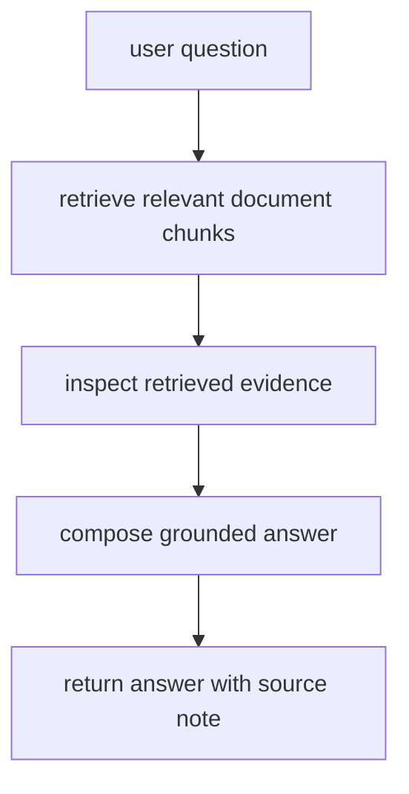

# P7-5.1 문서 기반 RAG 챗봇 목표

> Section ID: `P7-5.1`
> Version: `v2026.07.05`

Part 5에서 RAG(retrieval-augmented generation)를 개념으로 설명했다면, Part 7에서는 그 구조를 아주 작은 프로젝트로 다시 확인해야 합니다.

핵심은 복잡한 챗봇 UI를 만드는 것이 아닙니다.

질문을 받고, 관련 문서를 찾고, 찾은 근거를 바탕으로 답을 구성하는 흐름을 문서로 남기는 것이 이번 프로젝트의 출발점입니다. 이 프로젝트의 목적은 챗봇을 화려하게 만드는 것이 아니라, 검색된 근거와 답변을 분리해 기록하는 습관을 만드는 데 있습니다.

## 이 절의 범위

이 절은 다음 질문을 정리합니다.

- RAG 프로젝트는 어떤 구성요소로 시작하면 좋은가?
- 검색(retrieval)과 생성(generation)을 왜 분리해서 적어야 하는가?
- 아주 작은 로컬 문서 집합으로도 RAG 흐름을 설명할 수 있는가?

이 절은 다음 내용은 깊게 다루지 않습니다.

- 벡터 데이터베이스(vector database) 운영 최적화
- 임베딩 모델 선택의 심화 비교
- 고급 reranking
- 실제 API 비용 최적화

이 절은 RAG의 최소 프로젝트 흐름을 문서화하는 데 집중합니다. 검색 실패와 답변 실패를 구분하는 검증 구조는 바로 다음 P7-5.2 검색 품질과 답변 검증에서 다시 회수하고, 벡터 데이터베이스와 reranking의 개념적 배경은 Part 5의 P5-13.1 벡터 데이터베이스와 P5-13.2 인덱스와 검색 품질에서도 다시 읽을 수 있습니다.

## 이 절의 목표

- RAG 프로젝트를 `질문 -> 문서 검색 -> 근거 선택 -> 답변 구성` 흐름으로 설명할 수 있습니다.
- 검색 단계와 답변 단계가 다른 역할이라는 점을 말할 수 있습니다.
- 근거가 있는 답변과 근거가 빈약한 답변을 구분하는 프로젝트 구조를 만들 수 있습니다.

## 왜 RAG 프로젝트가 필요한가

LLM 프로젝트를 처음 만들 때 종종 `모델이 그냥 알고 답하면 되지 않는가?`라고 생각합니다. 하지만 실제 서비스에서는 다음 문제가 바로 나타납니다.

- 모델이 최신 문서를 모를 수 있다.
- 프로젝트 전용 문서나 내부 규칙은 학습 데이터에 없을 수 있다.
- 답변이 그럴듯해 보여도 근거가 없을 수 있다.

그래서 RAG 프로젝트는 `모델 기억`이 아니라 `문서 검색과 근거 연결`을 먼저 다룹니다.

OpenAI Retrieval 가이드는 retrieval을 문서 검색과 모델 답변 결합 구조로 설명합니다. 핵심은 검색 결과가 모델 입력에 들어가 답변 근거가 된다는 점입니다. 여기서는 그 거대한 구조를 모두 구현하지 않고, 흐름만 작은 예제로 축소합니다.

먼저 다음 세 질문으로 읽으면 좋습니다.

| 질문 | 짧은 답 |
| --- | --- |
| 이 프로젝트에서 먼저 남길 것은 무엇인가? | 질문, 검색 결과, 근거 문장 |
| 왜 답변보다 검색을 먼저 보나? | 근거가 없는 답을 줄이기 위해 |
| 최소 산출물은 무엇인가? | top 문서, doc_id, 근거 기반 답변 |

여기에 한 가지를 더 붙이면 RAG 프로젝트의 입구부터 기록 구조가 더 분명해집니다. 질문과 top 문서만 적는 데서 끝내지 말고, `어떤 검색 후보가 있었는가`, `어떤 근거를 실제로 채택했는가`, `어떤 질문은 review가 필요할 수 있는가`를 같이 적어 두는 것입니다.

| 입구에서 같이 남길 기록 | 왜 필요한가 |
| --- | --- |
| 검색 후보 목록 | 어떤 문서들이 비교되었는지 다시 보기 위해서입니다. |
| 선택한 근거 | 답변이 실제로 어디서 출발했는지 고정하기 위해서입니다. |
| review 질문 | 근거가 약하거나 검색이 애매한 질문을 따로 보기 위해서입니다. |
| 다음 검토 질문 | chunking, retrieval, prompt 중 어디를 먼저 바꿀지 정하기 위해서입니다. |

## 프로젝트 질문 설정

이번 프로젝트의 질문은 다음처럼 잡겠습니다.

> 책 문서 일부를 작은 지식베이스로 두었을 때, 질문에 맞는 문서를 먼저 찾고 그 문장만을 근거로 답할 수 있는가?

이 질문이 좋은 이유는 다음과 같습니다.

- `검색`과 `답변`을 분리해 기록할 수 있습니다.
- 나중에 검색 실패와 환각(hallucination)을 같은 프로젝트 안에서 다룰 수 있습니다.
- Part 5의 RAG 개념을 실제 프로젝트 문서 형식으로 옮길 수 있습니다.

## 프로젝트 흐름



이 도식은 RAG 프로젝트의 핵심이 `답변 생성`보다 먼저 `근거 검색`에 있다는 점을 보여 줍니다. 질문을 받고 문서를 찾고, 그 문서가 정말 근거가 되는지 확인한 뒤에 답변을 구성해야, 나중에 출처와 함께 검토 가능한 결과가 남습니다.

프로젝트 기록으로 정리하면 순서는 다음과 같습니다.

| 단계 | 문서에 남길 것 |
| --- | --- |
| 질문 | 사용자가 무엇을 물었는가 |
| 검색 | 어떤 문서가 선택되었는가 |
| 근거 확인 | 실제로 어떤 문장을 근거로 삼았는가 |
| 답변 | 그 근거 범위 안에서 무엇을 말했는가 |
| 출처 | 어떤 doc_id를 남겼는가 |

이 구조의 장점은 입력 형태가 달라져도 기록 원칙이 크게 흔들리지 않는다는 점입니다. 표를 읽는 프로젝트든, 예측 모델 프로젝트든, 문서 검색 프로젝트든 결국 `무엇을 입력으로 받았는가`, `무엇을 근거로 선택했는가`, `무슨 결과를 남겼는가`를 분리해 적어야 나중에 다시 검토하고 비교하기 쉽습니다.

같은 흐름을 최소 기록으로 줄이면 다음 표처럼 정리할 수 있습니다.

| 단계 | review가 필요한 상태 | 다음 행동 |
| --- | --- | --- |
| 검색 후보 비교 | top score가 낮거나 후보가 비슷함 | retrieval 재검토 |
| 근거 선택 | 선택 문장이 질문에 직접 답하지 않음 | evidence 다시 선택 |
| 답변 구성 | 근거 밖 문장이 섞일 위험이 있음 | grounded answer로 다시 작성 |

이 표가 있으면 RAG 프로젝트 입구부터 `검색 후보 -> 근거 -> review 질문` 구조가 보입니다.

## 작은 문서 집합 예제

이번 절에서는 실제 외부 문서 대신, 책 스타일에 맞춘 짧은 문서 조각 세 개를 자체 예제로 둡니다.

| doc_id | 내용 |
| --- | --- |
| doc_1 | `RAG는 외부 문서를 검색해 모델 입력에 넣는 구조다.` |
| doc_2 | `임베딩은 텍스트를 벡터로 바꾸어 유사도 비교를 가능하게 한다.` |
| doc_3 | `프롬프트만으로는 최신 문서 근거를 보장할 수 없다.` |

## Python 예제

이번 예제의 목적은 복잡한 임베딩 없이도 `질문 -> 문서 검색 -> 근거 포함 답변` 흐름을 눈으로 확인하는 것입니다. 이번에는 가장 높은 문서 하나만 찍고 끝내지 않고, 검색 기록, 선택 근거, 근거 답변 기록을 함께 남겨 프로젝트 실행 기록처럼 보이게 하겠습니다. 검색 기록은 검색 후보 전체를 남겨 왜 다른 문서가 탈락했는지 다시 보게 하고, 선택 근거는 실제로 답변에 올린 근거 한 조각을 고정하며, 근거 답변 기록은 질문과 근거와 답변을 같은 묶음으로 보존합니다.

| 이 기록 종류 | 지금 남기는 이유 | 뒤에서 다시 쓰는 곳 |
| --- | --- | --- |
| 검색 기록 | 선택된 문서만 남기지 않고, 어떤 후보들이 어떤 점수로 비교되었는지 남기기 위해 | 검색 품질 검토, 누락 문서 점검, RAG 회고에서 후보 비교 근거가 된다 |
| 선택 근거 | 답변에 실제로 사용한 근거 한 조각을 고정하기 위해 | 답변 검토, 출처 확인, 근거 교체 실험에서 바로 다시 본다 |
| 근거 답변 기록 | 질문, 근거, 답변을 흩어 두지 않고 같은 실행 묶음으로 보존하기 위해 | 뒤 절의 평가 기록, 리뷰 요약, 응답 상태 판정으로 이어지는 최소 단위가 된다 |

- 문제 상황: RAG 흐름을 아주 작은 로컬 지식베이스로 재현한다.
- 입력(input): 질문 1개, 문서 조각 3개
- 기대 출력(output): 가장 관련 높은 문서 1개와 근거 기반 답변
- 확인할 개념:
  - 검색이 먼저다
  - 답변은 검색 결과 위에 작성된다
  - 출처 doc_id를 함께 남길 수 있다
  - 질문별 검색 기록이 남아야 다음 검증 절로 이어질 수 있다

```python
documents = {
    "doc_1": "RAG는 외부 문서를 검색해 모델 입력에 넣는 구조다.",
    "doc_2": "임베딩은 텍스트를 벡터로 바꾸어 유사도 비교를 가능하게 한다.",
    "doc_3": "프롬프트만으로는 최신 문서 근거를 보장할 수 없다.",
}

question = "RAG가 왜 필요한가?"

def normalize_token(token):
    token = token.replace("?", "").replace(".", "")
    for keyword in ["RAG", "MCP"]:
        if token.startswith(keyword):
            return keyword
    return token

def tokenize(text):
    return {normalize_token(token) for token in text.split()}

q_tokens = tokenize(question)
retrieval_records = []

for doc_id, text in documents.items():
    overlap = len(q_tokens & tokenize(text))
    retrieval_records.append({
        "doc_id": doc_id,
        "overlap_score": overlap,
        "text": text,
    })

retrieval_records.sort(key=lambda x: x["overlap_score"], reverse=True)
selected_evidence = retrieval_records[0]

grounded_answer_record = {
    "question": question,
    "selected_doc_id": selected_evidence["doc_id"],
    "selected_score": selected_evidence["overlap_score"],
    "evidence_text": selected_evidence["text"],
    "answer": (
        f"{selected_evidence['text']} 따라서 질문에 답할 때 "
        "외부 근거를 함께 붙이기 위해 RAG가 필요하다."
    ),
}

print("question =", question)
print("retrieval_records =")
for row in retrieval_records:
    print(row)
print("selected_evidence =", selected_evidence)
print("grounded_answer_record =", grounded_answer_record)
```

실행 결과 예시는 다음과 같습니다.

```text
question = RAG가 왜 필요한가?
retrieval_records =
{'doc_id': 'doc_1', 'overlap_score': 1, 'text': 'RAG는 외부 문서를 검색해 모델 입력에 넣는 구조다.'}
{'doc_id': 'doc_2', 'overlap_score': 0, 'text': '임베딩은 텍스트를 벡터로 바꾸어 유사도 비교를 가능하게 한다.'}
{'doc_id': 'doc_3', 'overlap_score': 0, 'text': '프롬프트만으로는 최신 문서 근거를 보장할 수 없다.'}
selected_evidence = {'doc_id': 'doc_1', 'overlap_score': 1, 'text': 'RAG는 외부 문서를 검색해 모델 입력에 넣는 구조다.'}
grounded_answer_record = {'question': 'RAG가 왜 필요한가?', 'selected_doc_id': 'doc_1', 'selected_score': 1, 'evidence_text': 'RAG는 외부 문서를 검색해 모델 입력에 넣는 구조다.', 'answer': 'RAG는 외부 문서를 검색해 모델 입력에 넣는 구조다. 따라서 질문에 답할 때 외부 근거를 함께 붙이기 위해 RAG가 필요하다.'}
```

## 결과를 어떻게 읽는가

이 작은 예제에서 중요한 것은 검색 점수가 크냐 작으냐가 아닙니다. 더 중요한 것은 다음입니다.

- 검색 기록은 어떤 문서들이 후보였는지 보여 줍니다.
- 선택 근거는 실제로 어떤 문서를 답변 근거로 선택했는지 남깁니다.
- 근거 답변 기록은 질문, 근거 문장, 답변, 출처를 한 묶음으로 저장합니다.
- 답변은 검색된 문장 위에서 만들어졌다.
- 검색 결과가 바뀌면 답변도 바뀌어야 한다.
- doc_id를 같이 남기면 나중에 답변 근거를 다시 확인할 수 있다.
- 작은 예제에서 top 문서가 하나 골라졌더라도, 그것만으로 검색 품질이 충분하다고 단정하지는 않는다.

즉, 이 프로젝트의 최소 성공 기준은 `그럴듯한 답변`이 아니라 `근거가 붙은 답변`입니다.

이 결과는 다음 세 줄로 요약할 수 있습니다.

- 답변보다 먼저 검색 결과가 결정되었다
- 질문별 검색 후보와 선택 근거가 함께 남았다
- 검색된 문장이 답변의 출발점이 되었다
- doc_id를 남기면 나중에 근거를 다시 검토할 수 있다

## 실무 감각으로 번역하면

실제 RAG 서비스에서는 보통 다음이 함께 붙습니다.

- chunking
- 임베딩 생성
- vector store 검색
- reranking
- 출처 표시

하지만 프로젝트 입문 단계에서는 이 모든 계층을 한 번에 다 넣기보다, 먼저 `검색 결과를 답변 앞에 둔다`는 태도를 고정하는 편이 낫습니다.

이 절은 Part 7 전체 흐름에서 `LLM 프로젝트도 결국 질문, 근거, 결과를 분리해 기록해야 한다`는 기준을 보여 줍니다.

## 다음 절과의 연결

P7-5.2에서는 같은 프로젝트 안에서 다음 질문을 봅니다. 특히 `선택된 문서가 있었다`는 사실과 `그 문서가 정말 질문에 충분한 근거였는가`를 분리해 읽는 기준을 이어서 다룹니다.

- 검색이 잘못되면 답변은 어떻게 흔들리는가?
- 출처가 붙어도 답이 과장되거나 누락될 수 있는가?
- 검색 품질과 답변 검증을 어떻게 문서화할 것인가?

## 이 절에서 기억할 관점

- RAG는 검색과 생성의 결합 구조입니다.
- 검색 단계와 답변 단계는 같은 작업이 아닙니다.
- 프로젝트 문서에는 답변뿐 아니라 검색된 근거를 함께 남겨야 합니다.
- 작은 예제라도 출처 `doc_id`를 남기는 습관이 중요합니다.

## 체크리스트

- 질문, 검색 결과, 답변을 분리해 적을 수 있는가?
- 답변의 근거가 되는 문장을 따로 보여 줄 수 있는가?
- 검색 단계가 실패하면 답변도 흔들린다는 점을 설명할 수 있는가?
- 출처를 프로젝트 기록에 남겼는가?

## 출처와 참고 자료

- OpenAI, `Retrieval`, OpenAI API Docs, 확인 날짜: 2026-06-29. [https://developers.openai.com/api/docs/guides/retrieval](https://developers.openai.com/api/docs/guides/retrieval){: target="_blank" rel="noopener noreferrer" }

이 절의 문서 조각은 프로젝트 실습을 위해 만든 자체 예시입니다.
