# P7-5.1 캐릭터 참조 팩과 SD 1.5 LoRA로 기준 만들기

> Section ID: `P7-5.1`
> Version: `v2026.08.03`

웹툰 컷 생성에서는 pose보다 먼저 캐릭터 기준을 고정해야 합니다. 이 절은 새 캐릭터 `p7-mira`의 단일 이미지 참조 팩을 만들고, 학습 장면과 독립 평가 장면을 분리한 기록입니다. 이 팩은 LoRA 학습을 시작할 조건을 만족하지만, LoRA가 새 장면에서 같은 인물이나 화풍을 유지한다는 품질 증거는 아닙니다. 그 판단은 학습 뒤 held-out 비교에서 따로 합니다.

## 기준 캐릭터와 학습 분할

새 기준 자산은 한 장의 전신 이미지로 만듭니다. `p7-mira/single-01`은 청록 단발, silver hair clip, 흰 재킷, 청록 바지, 흰 운동화, 남색 가방을 기준 특징으로 정의합니다. 전신·신발과 가방의 본체·flap·단일 대각 스트랩·오른쪽 hip 위치가 한 화면에 보여야 합니다.

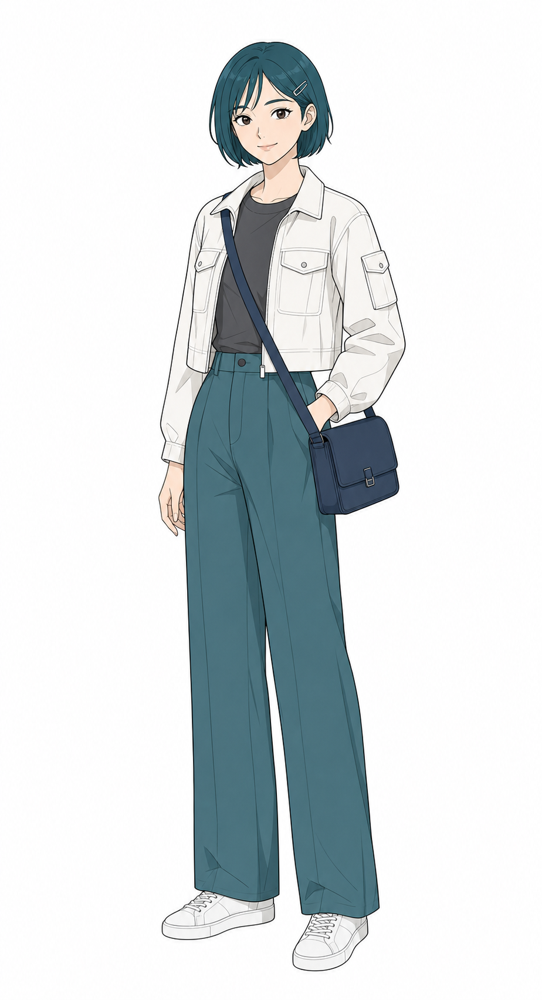

| 자산군 | 확보한 구성 | 역할 |
| --- | --- | --- |
| 기준·표정·전신 이미지 | 전신 단일 PNG 19장, detail PNG 2장 | 얼굴·의상·전신·손·가방 기준 |
| train scene | 장소·동작·camera가 다른 단일 장면 PNG 16장 | 캐릭터와 장면 렌더링 학습 |
| held-out scene | train과 장소·camera·source가 겹치지 않는 단일 PNG 4장 | 학습 뒤에만 쓰는 일반화 평가 |

시트 이미지는 사람의 비교 기준으로도 쓰지 않고, 학습 입력으로도 쓰지 않습니다. 한 파일에는 한 명의 전신 캐릭터와 하나의 view만 넣습니다. 19장 기준에는 정면·좌우 3/4·측면·후면, 표정과 손 제스처, 보행·체중 이동·후면 회전이 포함됩니다. detail은 전신 비례를 대신하지 않고 얼굴·눈·머리카락 및 손·가방 결합을 보완합니다. held-out은 학습 folder에 넣지 않습니다. 같은 캐릭터를 써도 학습에 없는 camera와 장소를 남겨야 LoRA가 기준 이미지를 외운 것과 새로운 장면에 적용한 것을 구분할 수 있습니다.

## LoRA가 새 장면에서도 같은 인물인가

가설은 `p7mira` LoRA를 켠 출력이 끈 baseline보다 held-out 네 장면에서 얼굴, 머리, 의상, 신발, 화풍을 더 잘 유지한다는 것입니다. base 모델, prompt의 장면 설명, seed, camera는 고정하고 LoRA off/on만 바꿉니다.

| 단계 | 고정값 | 비교값 | 남길 결과 |
| --- | --- | --- | --- |
| 자산 등록 | 단일 이미지 revision, source ID | train / held-out | manifest와 단일 PNG |
| 학습 | SD 1.5, `384 x 512`, batch 1 | LoRA revision | 학습 설정과 가중치 |
| 평가 | scene, camera, seed | LoRA off / on | panel별 PNG 두 장 |
| 판정 | 얼굴·머리·의상·신발·화풍 | pass / fail | 4 x 2 contact sheet |

학습 loss가 낮거나 PNG가 생성됐다는 사실만으로 통과시키지 않습니다. 네 장면에서 다섯 항목이 모두 유지될 때만 다음 실험으로 진행할 수 있습니다.

## 단일 자산을 검사하고 실행을 막는 코드

네 Python 스크립트는 서로 다른 역할을 맡습니다. 이들은 그림을 자동으로 승인하거나 3D 추정값을 절대 신체 치수로 바꾸지 않습니다.

| 도구 | 하는 일 | 확인할 경계 |
| --- | --- | --- |
| Reference asset inspector | 단일 PNG의 세로 framing과 최소 해상도만 검사 | 이미지를 자르거나 분할하거나 다시 저장하지 않으며, 가방·얼굴 품질은 사람 검수 대상 |
| Pose landmark reporter | 2D landmark와 world landmark, 인물 실루엣 상단·하단을 JSON으로 기록 | 스켈레톤 이미지를 만들지 않으며, 머리 위·턱은 기록용 좌표 |
| Proportion comparator | 기준과 후보의 실루엣/어깨·몸통/다리 비율 차이를 계산 | world landmark는 합격 기준이 아니라 camera 방향 보조값 |
| Experiment checker | 필수 view, 최소 16개 train, source ID 중복을 검사 | `PASS`는 학습 시작 조건일 뿐 품질 통과가 아님 |

한 장의 이미지에서 얻는 3D world landmark는 절대적인 신체 치수가 아닙니다. 따라서 비례 합격은 흰 배경에서 자동으로 찾은 인물 실루엣 상단·하단과 어깨·골반·발 landmark의 2D 비율만 사용합니다. `single-01`의 기준값은 실루엣/어깨 비율 약 `5.263`, 몸통/다리 비율 `0.555`입니다. 중립 정면 계열은 두 값이 각각 4%를 넘게 달라지면 제외합니다. 팔·다리의 투영이 달라지는 동작은 전신 framing, 관절·가방 접촉의 사람 검수와 15% 이내의 2D 변화로 판정합니다. 측면·후면은 정면의 어깨 폭과 골반-발 투영을 비교할 수 없으므로 landmark 가시성과 사람 검수로 판정합니다. 머리 위·턱 좌표는 기록하되 수기 오차가 커 합격 기준에는 쓰지 않습니다. 3D 좌표는 어깨와 골반의 앞뒤 깊이 차이만 기록해 camera 회전과 좌우 비대칭을 검토합니다.

실습에는 `pip install mediapipe`와 공식 Pose Landmarker Full task model이 필요합니다. task model은 `.tmp/`에서만 읽고 저장소에는 넣지 않습니다. reporter의 출력은 landmark JSON뿐이며, 이미지 위에 점·선·스켈레톤을 렌더하지 않습니다.

## 학습 시작 조건을 채운 참조 팩

이 팩은 단일 character reference 19장, train scene 16장, 독립 held-out 4장을 갖췄습니다. 16개 train source ID와 4개 held-out source ID는 겹치지 않으며, 필수 view인 front, three-quarter left, three-quarter right, side, back도 각각 검수했습니다. manifest와 checker는 이 구조를 확인해 `PASS ready for training`을 반환합니다.

이 통과는 **학습 입력의 준비 상태**를 뜻합니다. 각 이미지는 얼굴, 청록 단발·clip, 재킷·바지·신발, **가로형 네이비 crossbody 가방의 단일 대각 스트랩·flap·오른쪽 hip 위치**, camera와 clean-line-art 장면을 사람 검수했습니다. 가방 구조가 틀린 기존 sheet 후보는 분할하거나 재사용하지 않았습니다. 다음 실행에서는 하나의 adapter가 identity와 scene rendering을 함께 학습하며, Mira LoRA와 style LoRA를 다시 합성하지 않습니다.

## GPU 앵커 실행은 품질 판정이 아니다

새 SD 1.5 base에서 UNet의 `to_q`, `to_k`, `to_v`, `to_out.0`만 rank 8 LoRA로 열고, 16개 train scene을 순환해 `384 x 512`, batch 1로 100 step 실행했습니다. 입력은 crop 없이 종횡비를 보존해 축소하고 흰 여백만 넣습니다. RTX 5070 Laptop GPU 8 GB에서 BF16 실행은 손실 `0.2029 -> 0.1741`, peak VRAM 약 `2,351 MiB`로 100 step을 마쳤습니다.

처음에는 같은 profile을 FP16 AdamW로 실행했지만 마지막 손실이 비유한 값이 되어 실패로 판정했습니다. 따라서 이 profile은 BF16을 사용하며, 실행 스크립트도 비유한 loss 또는 gradient가 생기면 성공 보고서를 만들지 않습니다. 이 수치는 학습 반복과 메모리 경계만 검증합니다. 이번 실행은 어댑터를 보존하지 않았고 held-out PNG도 생성하지 않았으므로 얼굴, 가방, pose, camera, clean-line-art 화풍의 품질 통과 근거가 아닙니다.

새 BF16 adapter를 저장해 네 held-out 장면에서 scene·camera·prompt·seed를 고정하고 LoRA off/on을 비교했습니다. 처음에는 원본 caption이 CLIP의 77-token 한도를 넘어 scene과 camera 뒤쪽이 잘려, 그 결과를 품질 근거에서 제외했습니다. 평가기는 이를 생성 전에 막도록 고쳤고, 압축한 네 prompt로 다시 만들었습니다.

두 번째 비교도 **품질 미통과**입니다. LoRA on은 일부 컷을 청록·흰 의상 쪽으로 바꾸었지만, 네 컷 모두에서 승인된 얼굴, 청록 단발·clip, 가로형 네이비 flap 가방과 하나의 대각 스트랩, 전신 framing, 요청한 장소·camera, 절제된 clean-line-art를 함께 유지하지 못했습니다. 따라서 이 100-step adapter와 생성 PNG는 보존 자산으로 남기지 않습니다. 다음 run은 이 checkpoint의 step을 늘리는 일이 아니라 SD 1.5 base의 표현 사전과 data-to-prompt 결속을 먼저 진단하는 별도 gate여야 합니다.

## Base model은 고정 조건이 아니다

SD 1.5의 품질 실패 뒤에도 같은 base에서 step만 늘리는 것은 유효한 다음 실험이 아닙니다. 먼저 scene 이미지가 섞인 16장 train을 승인된 전신 다각도 19장으로 바꾸고, 얼굴·손 detail과 장소 이미지는 학습에서 제외했습니다. 이때 원래 caption이 CLIP의 77-token 한도를 `101~114 token`으로 넘겨 뒤쪽의 가방·화풍·시점 정보를 자른 결함도 확인했습니다. 새 caption은 핵심 외형과 view를 `68~73 token` 안에 넣고, 학습기는 초과 caption을 즉시 실패시킵니다.

같은 identity-only 데이터로 Animagine XL 4.0과 SDXL base 1.0을 rank 8, BF16, `384 x 512`, 100 step으로 각각 학습했습니다. Animagine XL은 수치상 loss가 내려갔지만 세 held-out 장면에서 인물이 사라져 제외했습니다. SDXL base 1.0은 8 GB에서 frozen text encoder와 VAE를 CPU로 내리는 방식으로 학습을 완료했고 peak VRAM 약 `6,315 MiB`, loss `0.0258 -> 0.00210`을 기록했습니다.

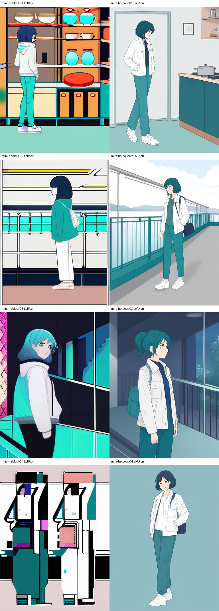

SDXL base LoRA on은 네 컷에서 청록 단발, 흰 재킷, 청록 바지, 흰 신발과 네이비 가방을 off보다 더 자주 함께 만들었습니다. 그러나 얼굴·hair clip·가방 geometry, 컵과 ticket의 손 접점, 저각도 camera는 아직 통과하지 못했습니다. 따라서 이는 **identity와 style의 부분 통과**이며 StoryDiffusion이나 inpaint로 넘어갈 근거는 아닙니다. 다음에는 이 base LoRA에 구조 조건 하나만 결합해 pose·camera가 실제로 개선되는지를 검증합니다. [통합 판정 기록](../../../assets/part-07/chapter-05/p7-5-1-base-change-lora-ablation.json)을 함께 확인합니다.

### Canny 강도 sweep: identity와 구조의 교차점이 없는지 확인하기

초기 adapter는 `384 x 512`에서 학습하고 전신 ControlNet 평가는 `512 x 768`에서 했습니다. 이 차이가 결함 원인인지 확인하려고, 같은 identity-only 19장을 `512 x 768`에서 다시 100 step 학습했습니다. 8 GB GPU에서 one-step peak는 약 `6,261 MiB`, 100-step peak는 약 `6,315 MiB`였으므로 이 해상도는 실행 후보에서 제외할 이유가 없습니다.

같은 low-side cinema held-out, prompt, seed, LoRA scale에서 Canny scale만 `0.0`, `0.10`, `0.35`, `0.75`로 바꿨습니다. `0.10`은 흰 재킷·청록 바지·네이비 가방을 대체로 지키지만 upright pose에 남았습니다. `0.35`부터 ticket을 향한 굽힘과 foyer 원근은 나오지만 재킷·바지·가방이 바뀌었고, `0.75`도 같은 결함을 더 강하게 보였습니다.

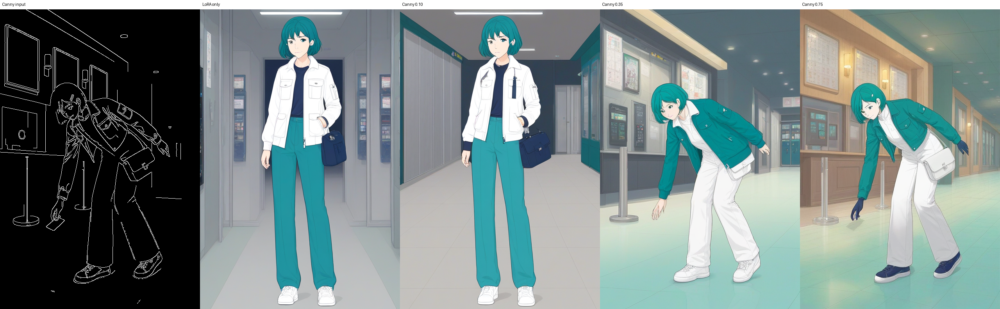

따라서 이 조건에서는 identity와 dynamic camera·pose를 함께 통과시키는 Canny 강도가 없습니다. Canny는 **구조 입력으로 유효**하지만 이 LoRA와의 결합 경로는 웹툰 컷 품질 미통과입니다. inpaint나 두 번째 조건을 추가하지 않고, [scale-sweep 실행·판정 기록](../../../assets/part-07/chapter-05/p7-5-1-sdxl-native-resolution-canny-scale-sweep.json)만 남깁니다. 재학습 adapter, materialized dataset, 개별 scale sheet는 제거합니다.

### scene-only Canny: 배경과 인물의 책임을 분리해 보기

전체 Canny가 재킷·바지·가방끈까지 다시 해석한 문제를 분리하기 위해, 같은 adapter를 다시 학습한 뒤 인물과 가방이 있던 사람 검수 ROI를 Canny map에서 지웠습니다. 같은 seed와 `0.35`, `0.75`에서 전체 Canny와 scene-only Canny를 직접 비교했습니다.

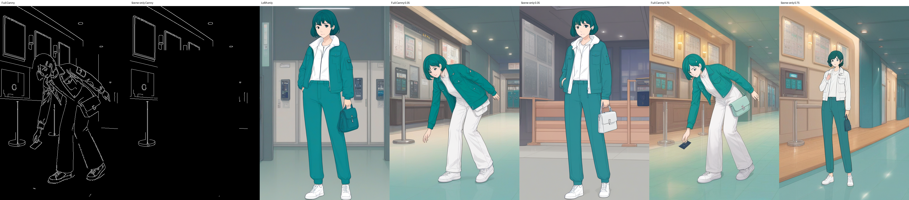

전체 Canny는 ticket을 향한 굽힘을 전달했지만 청록 재킷·흰 바지·다른 가방으로 바꿨습니다. scene-only Canny는 흰 재킷·청록 바지를 더 자주 보존하고 foyer 배경을 바꾸었지만, 인물은 upright로 남거나 작아졌으며 대각 가방끈도 만들지 못했습니다. 따라서 scene-only Canny는 **배경·camera 보조 입력으로만 부분 통과**이고, character pose를 맡길 수 없습니다. 다음 pose 실험은 Canny가 아니라 foreground 영역의 별도 human-pose 조건이어야 합니다. [비교 실행·판정 기록](../../../assets/part-07/chapter-05/p7-5-1-sdxl-lora-scene-only-canny-comparison.json)을 남기고 임시 adapter와 dataset은 제거합니다.

## Base 모델을 먼저 분리해 본 결과

LoRA 없이 같은 짧은 prompt, negative prompt, seed, 해상도, 25 inference step으로 일반 SD 1.5와 WD 1.5를 비교했습니다. 네 prompt는 모두 CLIP 77-token 한도 안인지 코드로 검사했습니다. 아래는 그 비교 결과이며, 이 그림은 Mira의 품질 통과 근거가 아니라 다음 실험의 base 후보를 좁히기 위한 진단입니다.

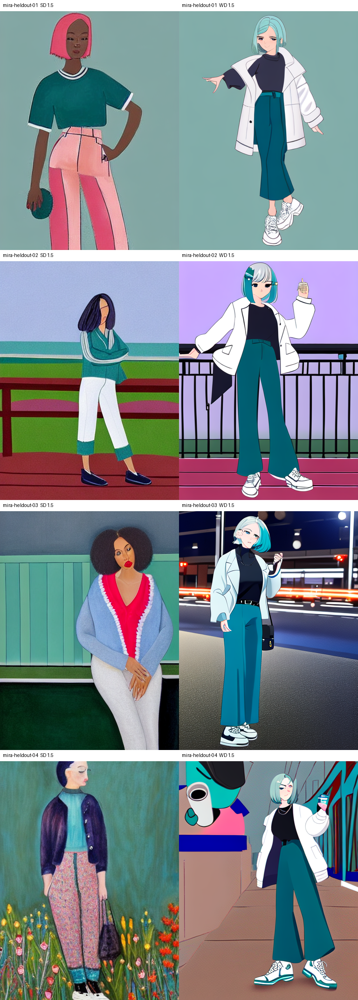

일반 SD 1.5는 얼굴·인체·화풍이 네 컷에서 크게 달라졌습니다. WD 1.5는 청록 단발, 흰 재킷, 청록 바지, 전신 일러스트를 더 자주 만들었고 peak VRAM도 약 `2,927 MiB`로 8 GB 안에 들었습니다. 그러나 네이비 flap 가방, 손 동작, 장소와 camera, 절제된 clean-line-art는 안정적이지 않았습니다. 그러므로 둘 다 prompt-only 웹툰 컷 생성기로 채택하지 않습니다. WD 1.5는 다음의 **참조 제어 기반 identity·소품 결속 실험 후보**일 뿐이며, 이 결과만으로 LoRA 재학습을 시작하지 않습니다.

## 참조 이미지를 직접 넣으면 무엇이 고정되는가

SD 1.5용 IP-Adapter 가중치는 현재 캐시에 없고, 있는 IP-Adapter는 SDXL 전용입니다. 추가 다운로드로 조건을 바꾸지 않고, WD 1.5 img2img에 승인된 `single-01` 전신 이미지를 초기 입력으로 넣었습니다. 네 held-out prompt와 seed는 고정하고 초기 이미지 영향인 `strength`만 `0.25`, `0.55`, `0.80`으로 바꿨습니다.

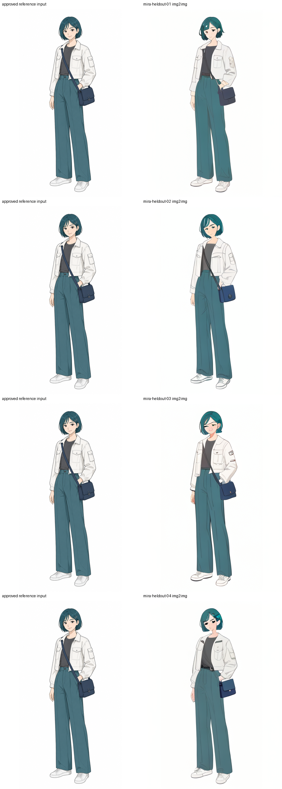

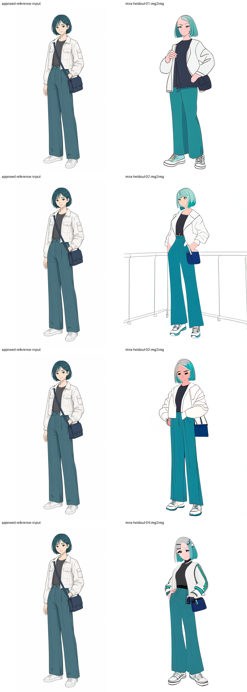

`0.25`에서는 얼굴, 전신, 의상, 가방이 비교적 남지만 네 결과가 모두 흰 배경의 비슷한 서 있는 전신 구도에 머뭅니다. `0.55`도 요청 장면·camera·동작을 만들지 못하고 세부가 흐트러졌습니다. `0.80`은 팔·몸통과 난간 일부를 바꾸지만 요청한 주방, 페리, 영화관, 도예 작업실의 camera와 동작에는 도달하지 못하며 얼굴·머리·재킷·가방도 더 이탈합니다. 따라서 단일 참조 img2img는 **가까운 전신 기준을 보존하는 도구**일 뿐, pose·projection·camera·배경을 독립적으로 바꾸는 웹툰 컷 생성기에는 채택하지 않습니다.

## 로컬 character/style anchor pack

외부 생성 기준을 쓰지 않는 참조팩도 별도 gate로 만들었습니다. 여기서 목표는 바로 웹툰 컷을 만드는 것이 아니라, 다음 생성의 입력이 될 **한 revision 안의 인물·화풍 원본**을 local GPU만으로 확보하는 것입니다. `FLUX.2-klein-base-4B`가 가방 없는 대칭 의상의 전신 master를 만들고, distilled `FLUX.2-klein-4B`가 한쪽 3/4, strict profile, rear 3/4를 확장했습니다. 반대쪽 view는 새로 추론하지 않고, 대칭 계약을 만족하는 승인 원본을 로컬 수평 반전해 만들었습니다.

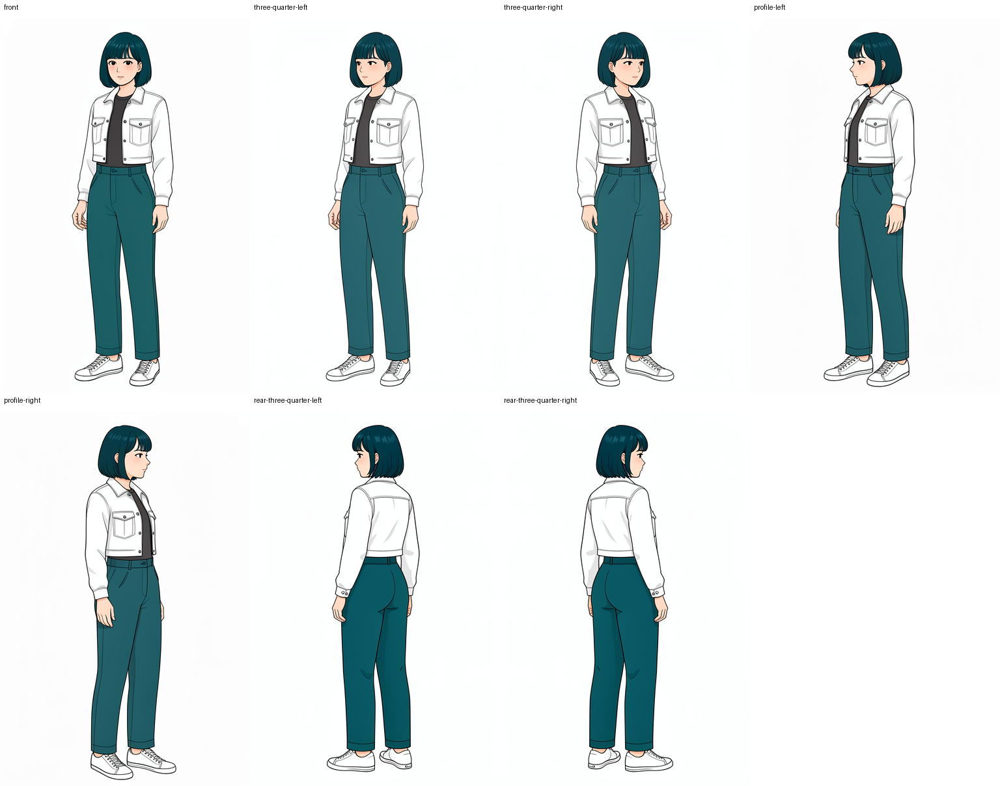

이 pack은 얇은 charcoal 선, 저채도 teal·white·charcoal palette, 약한 fold shadow, 흰 studio background를 화풍 계약으로, 대칭 deep-teal bob, 흰 cropped utility jacket, charcoal shirt, teal wide-leg trousers, 흰 sneakers를 인물 계약으로 기록합니다. base master는 `768 x 1152`, 50 step, guidance `4.0`, seed `410201`에서 `152.5`초, peak `2,894 MiB`로 생성했고, 세 reference 확장은 모두 4 step·guidance `1.0`에서 실행했습니다. [manifest](../../../assets/part-07/chapter-05/p7-5-1-local-character-style-pack-v1.json)는 각 view가 생성인지 mirror인지 구분합니다.

승인 범위는 **대칭 의상·무소품·중립 전신 turnaround와 화풍 anchor**로 제한합니다. 가방·strap·손-소품 접점, 비대칭 액세서리, dynamic pose·장면·극단 camera, face close-up은 이 pack의 통과 근거가 아닙니다. 즉 mirror는 모델이 알지 못하는 반대쪽 얼굴이나 소품 구조를 발명하는 수단이 아니라, 설계 단계에서 대칭으로 제한한 원본의 대응 view를 만드는 결정적 변환입니다. 이 경계를 지키면 8 GB에서도 local-only character/style pack을 만들 수 있지만, 비대칭 character나 prop pack은 별도 생성·사람 검수 gate가 필요합니다. [master probe](#local-mirror-safe-master-probe), [view probe](#local-mirror-safe-views-probe), [strict profile probe](#local-mirror-safe-profile-probe), [pack builder](#local-character-style-pack-builder)를 함께 제공합니다.

화풍 기준은 인물 기준과 분리합니다. `P7-5.0`의 frame-free style-pack gate를 먼저 통과한 출력만 다음 character master의 style reference가 될 수 있습니다. 현재 mirror-safe character pack은 대칭 의상·무소품·중립 전신 turnaround의 제한된 기준이고, 화풍 팩의 장소·시간·camera 다양성이나 전체 컷 보정의 근거는 아닙니다.

## 인증 없는 참조 편집 모델의 첫 전체 컷 게이트

앞의 img2img는 초기 이미지의 구도를 벗어나기 어려웠습니다. 반대로 [InvokeAI](https://github.com/invoke-ai/InvokeAI){: target="_blank" rel="noopener noreferrer" }의 현재 모델 관리 경로는 FLUX.2 Klein 4B를 참조 이미지를 직접 받는 모델로 등록합니다. 공개 `GGUF Q4` 변환기, 공개 FLUX.2 VAE, 공개 Qwen3 4B 인코더를 각각 설치했으며, 세 저장소는 로그인 없이 내려받았습니다. 따라서 이 실험은 Hugging Face 토큰이나 gated base를 전제로 하지 않습니다.

### 생성 도구와 이용 조건 공개

이 절의 PNG는 외부 삽화나 InvokeAI 화면을 복제한 자료가 아니라, 아래 실행에서 새로 생성한 실험 결과다. 기준 참조 `single-01`은 Codex `image_gen.imagegen` 호출로 생성했으며, 실제 지시문은 [Mira 생성 기록](#mira-generation-record)에 남겼다. `p7-5-1-flux2-klein-*.png` 두 장은 로컬에 설치한 InvokeAI runtime의 FLUX.2 Klein workflow로 생성했고, 이후 `p7-5-1-diffusers-flux2-*` 및 comparator 출력은 InvokeAI 없이 직접 Diffusers pipeline으로 생성했다.

| 구분 | 사용 도구 | 공개 범위 |
| --- | --- | --- |
| 기준 참조 | Codex `image_gen.imagegen` | 생성 지시문과 사람 검수 기록을 공개 |
| 첫 FLUX.2 whole-shot gate | 로컬 InvokeAI runtime | workflow 요청 코드, 모델 source ID, prompt·seed·실행 기록을 공개 |
| 후속 FLUX.2 비교 | 로컬 Diffusers | Python 코드, prompt·seed·실행 기록을 공개 |

InvokeAI 저장소의 코드는 Apache-2.0으로 제공되지만, 그 코드 라이선스가 모델 가중치·GGUF 변환물·VAE·text encoder 또는 생성 PNG의 이용 조건을 대신하지는 않는다. 이 실험은 InvokeAI 코드나 모델 가중치를 책에 재배포하지 않으며, 각 모델과 변환물의 이용 조건은 배포처에서 별도로 확인해야 한다. 이 표기는 생성물의 저작권 귀속이나 이용 가능 범위를 법적으로 판정하는 문장이 아니며, 도구와 생성 경로를 공개하기 위한 기록이다.

처음에는 단일 `single-01` 전신 참조 하나와 영화관 티켓 장면만 사용했습니다. `512 x 768`, Euler 4 step, seed `320241`, Qwen3 max sequence length `256`을 고정하고, 참조 이미지는 모델의 내장 reference conditioning으로 연결했습니다. 실행은 `14.4`초, 관측 peak VRAM `5,552 MiB`에서 끝났습니다. 전신, 얼굴·청록 단발·silver clip, 흰 재킷, 청록 바지, 흰 운동화, 오른쪽 hip의 가로형 navy flap bag, 하나의 대각 strap, 티켓과 영화관 배경을 함께 확인했습니다.

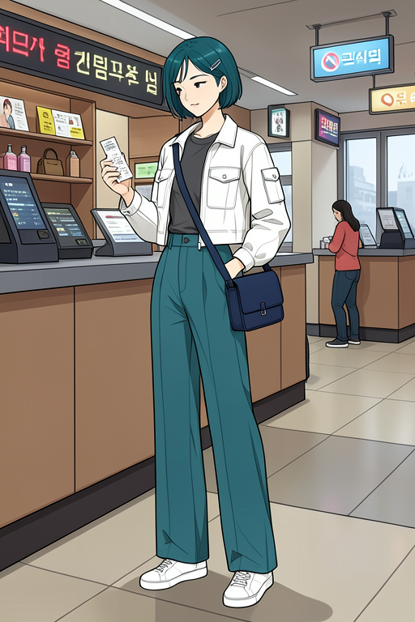

같은 참조와 seed에서 prompt의 동작·장소·camera만 바꿨습니다. 저각도 3/4 view, 지하철 계단 하행, 한 발을 다음 계단으로 내딛는 보행, 양팔의 자연스러운 균형을 요청했습니다. 이 실행은 `20.6`초, peak VRAM `5,673 MiB`였고, 전신과 의상·가방 contract는 남았습니다. 기준의 정면 서기와 달리 계단 원근, 보행 다리, 팔 벌림, 위쪽을 향한 camera가 출력에 나타났습니다.

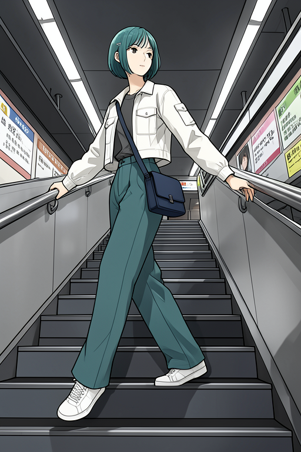

| gate | 고정한 것 | 바꾼 것 | 사람 검수 결과 |
| --- | --- | --- | --- |
| 기준 장면 | `single-01`, seed, 해상도, sampler·step | 영화관·티켓 지시 | full body와 얼굴·의상·가방 contract 통과 |
| pose + camera | `single-01`, seed, 해상도, sampler·step | 계단·보행·저각도 지시 | 전신 보행과 원근 변화, 얼굴·의상·가방 contract 통과 |

이 결과는 두 prompt에서의 **단일 참조 whole-shot gate**만 통과한 기록입니다. 저각도는 보이지만 극단적인 projection, side/rear view, 손-소품 접점, 서로 다른 장소에서의 반복, character reference와 가방 reference를 함께 쓰는 다중 참조는 아직 검증하지 않았습니다. 따라서 이 단계에서는 OpenPose나 inpaint를 붙이지 않습니다. 다음 gate는 같은 contract를 유지한 채 서로 다른 pose·camera·장소를 늘려 보고, 그 다음에만 가방과 strap의 국소 보정을 별도 비교합니다.

## InvokeAI를 빼도 같은 gate를 통과하는가

위 결과를 InvokeAI의 UI나 모델 관리 기능 덕분이라고 해석하면 재현 범위를 잘못 잡게 됩니다. 같은 공개 `black-forest-labs/FLUX.2-klein-4B`를 [Diffusers](https://github.com/huggingface/diffusers){: target="_blank" rel="noopener noreferrer" }의 `Flux2KleinPipeline`으로 직접 읽고 `enable_sequential_cpu_offload()`만 적용했습니다. 이 경로에는 InvokeAI 서버, 노드 그래프, 모델 DB, GGUF loader가 없습니다. reference 이미지는 pipeline의 `image` 인자에 직접 넣습니다.

| 구분 | BFL raw CLI | InvokeAI 실행 | 직접 Diffusers 실행 |
| --- | --- | --- | --- |
| 공통 모델 기능 | FLUX.2 Klein의 참조 편집 | 같은 기능 | 같은 기능 |
| 변환기 정밀도 | 원본 runner가 GPU component를 먼저 준비 | GGUF Q4 | 원본 BF16 Diffusers component |
| GPU 메모리 전략 | Qwen3·보조 모델·VAE의 초기 GPU 적재 | model manager의 component 교대 | `accelerate` sequential CPU offload |
| 이번 8 GB 결과 | auxiliary model 적재 단계에서 중단 | 두 gate 통과 | 두 gate 통과 |
| host-side 비용 | 별도 판단 전 중단 | Q4 변환기와 별도 인코더 저장 | 원본 pipeline cache 약 13 GB, 매 실행 component reload |

직접 Diffusers 기준 장면은 `11.7`초, peak `1,834 MiB`였고, 저각도 계단 보행은 `11.6`초, peak `2,090 MiB`였다. 이 숫자는 GPU peak만 기록한 값이다. 순차 offload는 원본 BF16 가중치를 CPU RAM과 disk cache에 유지하므로, 첫 실행의 공개 파일 다운로드와 CPU-side load 비용은 별도로 감수해야 합니다. 반대로 GUI나 custom node runtime에는 의존하지 않습니다.

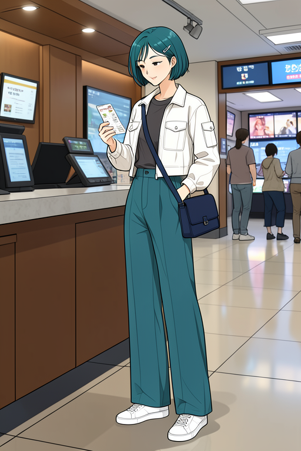

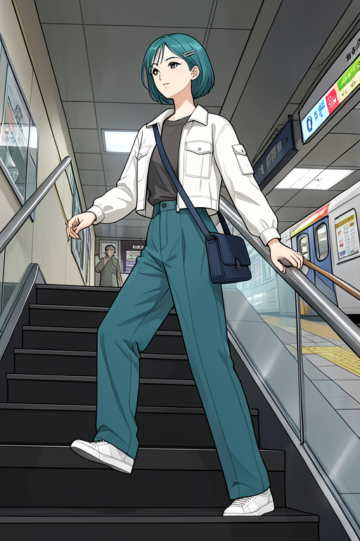

두 출력은 InvokeAI의 Q4 출력과 pixel-for-pixel으로 같지 않습니다. quantization과 component loader가 달라 같은 seed도 다른 이미지를 만들 수 있습니다. 그러나 두 장 모두 전신, teal bob + silver clip, 흰 재킷, 청록 바지, 흰 운동화, right-hip navy flap bag, 하나의 대각 strap, 그리고 각 장면의 ticket 또는 계단 보행·원근을 사람 검수에서 통과했습니다. 따라서 현재의 재현 가능한 결론은 **InvokeAI가 아니라 FLUX.2 Klein의 direct reference conditioning과 sequential CPU offload가 이 두 gate를 가능하게 했다**는 것입니다.

## 다른 캐릭터·화풍 참조가 들어오면 Mira가 남는가

참조 제어를 채택하려면 Mira 참조 한 장에서만 잘 되는지와, 입력 참조가 달라도 prompt의 Mira 계약이 우선하는지를 구분해야 합니다. 가방·strap은 Mira의 핵심 소품이므로 비교 참조에서는 모두 제거했습니다. 같은 영화관 티켓 장면, `512 x 768`, 4 step, `guidance_scale=1.0`을 고정하고 네 조건을 비교했습니다. 첫 조건은 Mira 참조 기준선, 두 번째는 가방 없는 남성 clean-webtoon 참조, 세 번째는 가방 없는 여성 수채화·ink graphic-novel 참조, 네 번째는 참조 없는 text-only입니다.

| 입력 조건 | 사람 검수 | 판정 |
| --- | --- | --- |
| Mira + clean webtoon | 전신, 청록 bob·silver clip, 흰 재킷·청록 바지·흰 신발, right-hip navy flap bag과 하나의 strap이 보임 | 통과 |
| 남성 + clean webtoon | 남성·안경·황색 재킷 대신 Mira의 외형·가방 계약이 회복됨 | 통과 |
| 여성 + 수채화·ink | braid·indigo coat·수채화 질감 대신 Mira와 clean flat-color webtoon rendering이 나옴 | 통과 |
| text-only | Mira의 주요 표식은 나왔지만 장면과 무관한 comic-panel 경계가 들어옴 | 이미지 제외 |

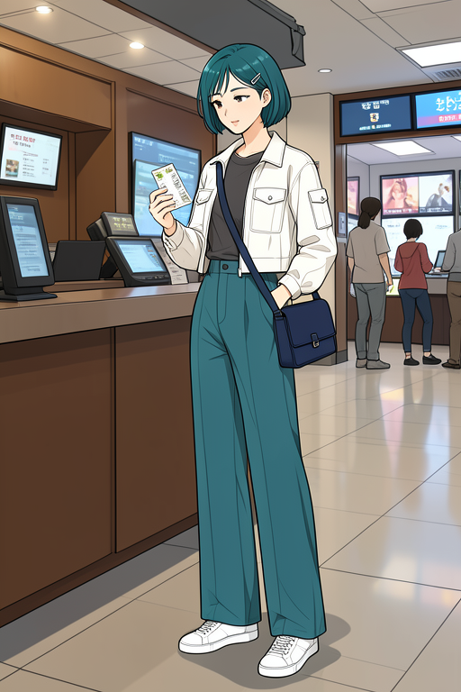

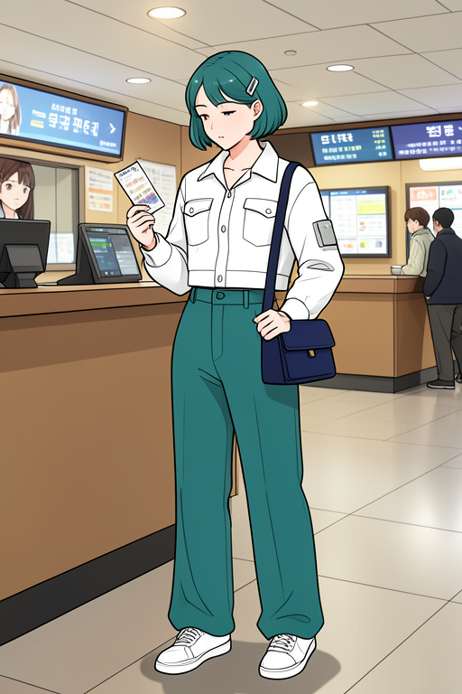

세 참조 조건의 출력은 Mira contract와 clean webtoon rendering으로 수렴했습니다. 이 장면에서는 단일 호환되지 않는 참조보다 text prompt가 강하게 작동한 것입니다. 이는 외부 참조를 임의로 섞어도 되는 근거가 아닙니다. 동일 비교군을 저각도 보행, side/rear view, 근접 얼굴·손, 다른 장소에서 반복하기 전에는 pose·camera·detail 일반화나 style lock을 주장하지 않습니다. text-only는 참조 효과의 하한을 보이지만 패널 경계 결함 때문에 출력 이미지를 보존하지 않았습니다. [실행 기록](../../../assets/part-07/chapter-05/p7-5-1-flux2-mira-reference-comparator-run.json)과 [사람 검수 판정](../../../assets/part-07/chapter-05/p7-5-1-flux2-mira-reference-comparator-review.json)을 함께 확인합니다.

## Pose·camera·detail 비교군을 늘린 whole-shot gate

같은 네 입력군을 저각도 계단 보행, 측면 보행, 고해상도 ticket detail, 후면 3/4 보행으로 확장했습니다. 저각도는 `카메라를 인물보다 한 계단 아래 무릎 높이에 두고 위를 향하게 한다`, `가까운 신발을 전경에 크게 둔다`까지 명시해야 했습니다. 이 수정 뒤 네 입력군 모두 전신·보행·상향 원근과 Mira contract를 유지했습니다. 단순히 “low angle”만 쓴 첫 출력은 계단 원근은 보였지만 low-angle view로 판정하지 않았으므로 보존하지 않았습니다.

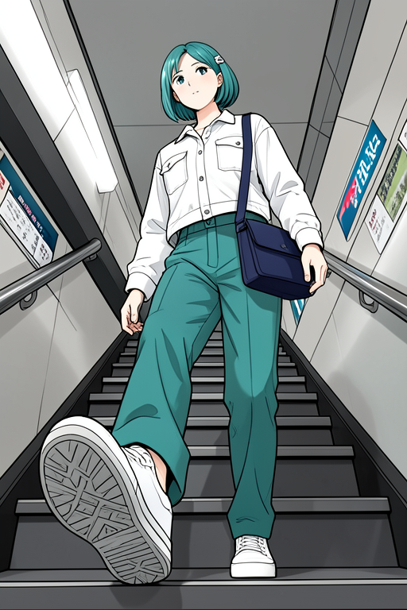

측면 보행도 네 조건이 true side profile, 우천 도로, 전신, 하나의 strap을 통과했습니다. 이로써 prompt만으로도 두 명시적 camera 구도는 만들 수 있음을 확인했습니다.

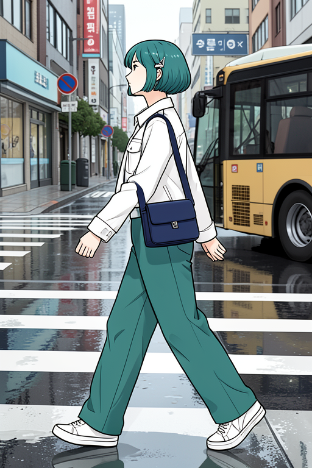

### Reference camera를 바꾼 side whole-shot 비교

측면 컷에서 참조 이미지의 camera를 맞추면 더 안정적인지 확인하려고, 정면 `single-01`과 `three-quarter-left`에서 멈춘 측면 `single-14`만 바꿨습니다. 나머지는 `512 x 768`, 4 step, guidance `1.0`, seed `320301`, 같은 cinema lobby·left-side walk prompt로 고정했습니다. 두 출력 모두 왼쪽을 향한 측면 보행, 전신과 신발, ticket, 청록 bob·clip, 의상, right-hip navy flap bag과 하나의 diagonal strap을 통과했습니다.

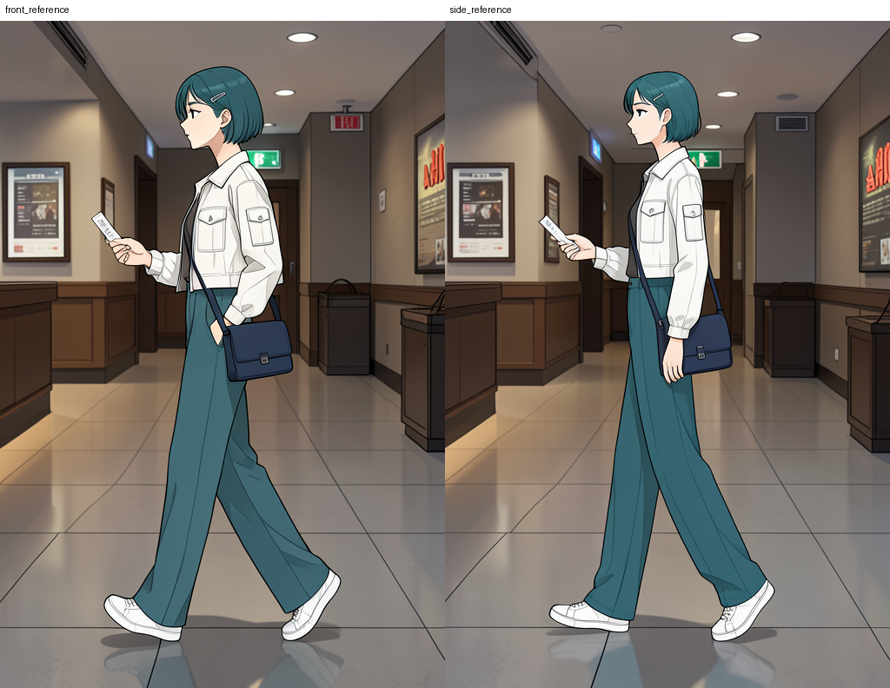

다만 이 조건에서는 camera를 맞춘 `single-14`가 정면 `single-01`보다 눈에 띄게 더 좋지 않았습니다. 즉 이 최소 실행에서는 참조의 view 수를 늘리는 일보다 whole-shot prompt와 FLUX.2 direct reference conditioning의 조합이 측면 컷 성패를 더 크게 좌우했습니다. 이는 측면 참조가 다른 pose·후면·복잡한 소품 접점에서 쓸모없다는 뜻은 아니며, 그 조건은 별도 gate로 검증합니다. 두 이미지는 합계 `22.4`초, peak `2,090 MiB`에서 생성했습니다. [실행 기록](../../../assets/part-07/chapter-05/p7-5-1-flux2-view-matched-reference-probe.json)과 [실행 코드](#flux2-view-matched-reference-probe)를 함께 확인할 수 있습니다.

얼굴·손은 full body를 먼저 그린 `768 x 1152` 결과에서 검사했습니다. Mira 기준, 남성 webtoon 참조, text-only의 세 출력은 눈, 양손, ticket 접점, 전신을 함께 통과했지만, 수채화 참조 출력은 rectangular flap bag을 지키지 못했습니다. 후면 3/4에서는 male webtoon과 text-only만 하나의 가방·strap을 지켰고, Mira 기준은 bag body가 둘로 갈라졌으며 수채화 참조는 strap이 교차했습니다. 따라서 local inpaint는 이 whole-shot gate를 통과한 이미지에만 허용합니다.

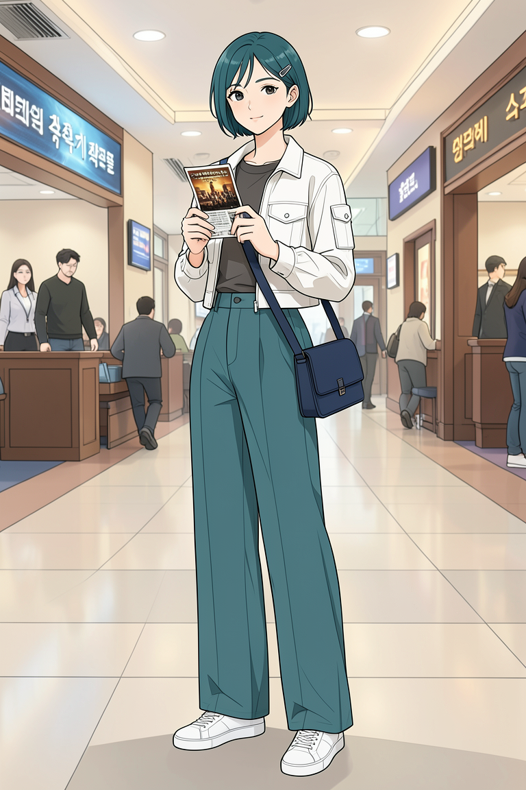

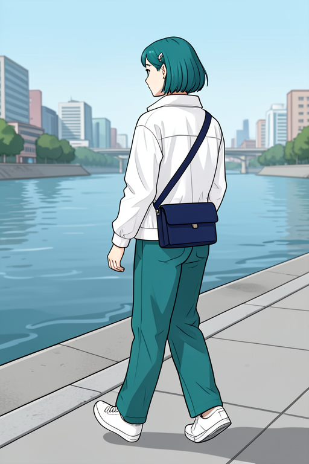

### Rear reference를 맞춘 후면 3/4 gate

앞선 네 입력군의 rear `2/4`는 호환되지 않는 외부 참조까지 섞은 일반화 비교였습니다. 직접 참조 파이프라인에서의 후면 한계를 분리하기 위해, 정면 `single-01`과 rear three-quarter `single-12`만 바꾸고, 같은 cinema lobby·rear three-quarter walk prompt, `512 x 768`, 4 step, guidance `1.0`, seed `320302`을 고정했습니다. 두 결과가 모두 후면 3/4 보행, 전신·두 신발, 흰 재킷·청록 바지, 하나의 navy flap bag과 등을 가로지르는 하나의 strap을 통과했습니다.

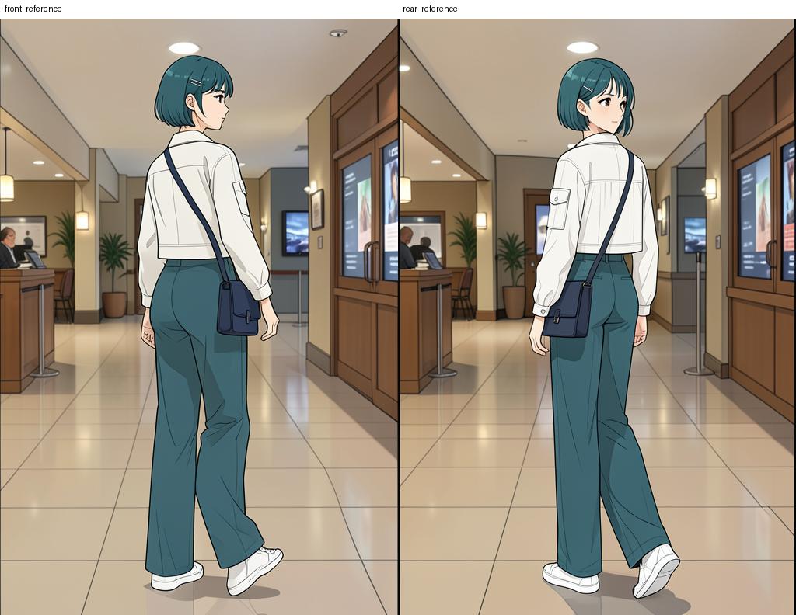

rear `single-12`는 가방 위치와 보행 다리를 더 분명하게 뒤쪽 구도로 수렴시켰지만, 정면 참조도 이 고정 조건에서는 통과했습니다. 따라서 후면의 가방·strap 결함은 FLUX.2 direct reference conditioning 자체의 필연적 한계가 아니라, 참조-장면 조합과 prompt의 gate 문제로 다뤄야 합니다. 두 이미지는 합계 `22.1`초, peak `1,843 MiB`에서 생성했으며, [실행 기록](../../../assets/part-07/chapter-05/p7-5-1-flux2-rear-view-matched-reference-probe.json)과 [실행 코드](#flux2-rear-view-matched-reference-probe)를 제공합니다.

[통합 사람 검수 판정](../../../assets/part-07/chapter-05/p7-5-1-flux2-mira-generalization-review.json)은 앞선 호환되지 않는 참조 포함 비교를 low-angle·side `4/4` 통과, detail `3/4` 부분 통과, rear 3/4 `2/4` 부분 통과로 기록합니다. 이번 직접 참조 재검증은 그 rear 조건을 별도로 통과시킨 것입니다. 따라서 현재 최소 파이프라인은 **전신 whole-shot 생성 -> pose·camera·소품 gate -> 통과 이미지에만 얼굴·손·소품의 국소 보정**입니다. 실패 출력은 원고 자산으로 보존하지 않습니다.

## 실행 자산과 원문 { #execution-assets }

아래 항목을 펼치면 원문을 비동기로 한 번만 불러옵니다. 본문을 읽는 동안에는 긴 생성 지시문과 코드가 내려받아지지 않습니다.

| 구분 | 확인할 항목 |
| --- | --- |
| 생성 기록 | [Mira image_gen 기록](#mira-generation-record) |
| 기준 이미지 | [single-01 전신 후보](../../../assets/part-07/chapter-05/p7-5-1-mira-single-reference-01.png) |
| landmark 기준값 | [single-01 landmark report](../../../assets/part-07/chapter-05/p7-5-1-mira-single-reference-01-landmarks.json) |
| 정면·동작 기준 예시 | [single-05 정면](../../../assets/part-07/chapter-05/p7-5-1-mira-single-reference-05-front.png), [single-13 인사](../../../assets/part-07/chapter-05/p7-5-1-mira-single-reference-13-wave.png), [single-18 열린 손](../../../assets/part-07/chapter-05/p7-5-1-mira-single-reference-18-invite-palm.png) |
| 독립 평가 장면 예시 | [주방 측면](../../../assets/part-07/chapter-05/p7-5-1-mira-heldout-01-kitchen-cupboard.png), [페리 덱](../../../assets/part-07/chapter-05/p7-5-1-mira-heldout-02-ferry-deck.png), [영화관](../../../assets/part-07/chapter-05/p7-5-1-mira-heldout-03-cinema-ticket.png), [도예 작업실](../../../assets/part-07/chapter-05/p7-5-1-mira-heldout-04-ceramics-cup.png) |
| 보존 범위 | 생성 기록, manifest, inspector, checker, 릴리즈노트 |
| landmark 분석 코드 | [reporter](#pose-landmark-reporter), [proportion comparator](#landmark-proportion-comparator) |
| dataset 준비 코드 | [materializer](#mira-dataset-materializer) |
| GPU 실행 코드 | [UNet LoRA preflight and anchor profile](#mira-scene-lora-preflight) |
| held-out 비교 코드 | [fixed-prompt LoRA evaluator](#mira-scene-lora-evaluator) |
| SDXL data/model ablation | [통합 판정 기록](../../../assets/part-07/chapter-05/p7-5-1-base-change-lora-ablation.json), [identity dataset](#identity-lora-ablation-dataset), [SDXL training](#sdxl-lora-feasibility), [SDXL evaluator](#sdxl-identity-evaluator) |
| SDXL native-resolution LoRA + Canny gate | [scale-sweep 실행·판정](../../../assets/part-07/chapter-05/p7-5-1-sdxl-native-resolution-canny-scale-sweep.json), [Canny probe](#sdxl-lora-canny-probe), [contact-sheet builder](#canny-scale-contact-sheet) |
| scene-only Canny control split | [비교 실행·판정](../../../assets/part-07/chapter-05/p7-5-1-sdxl-lora-scene-only-canny-comparison.json), [scene-only probe](#scene-only-canny-probe), [comparison builder](#scene-only-canny-comparison-sheet) |
| base 비교 코드 | [prompt-only base probe](#prompt-only-base-probe) |
| 참조 img2img 코드 | [WD 1.5 reference img2img probe](#wd15-reference-img2img-probe) |
| FLUX.2 Klein 단일 참조 gate | [영화관 결과](../../../assets/part-07/chapter-05/p7-5-1-flux2-klein-reference-preflight.png), [계단 보행 결과](../../../assets/part-07/chapter-05/p7-5-1-flux2-klein-low-angle-walk-preflight.png), [각 실행 기록](../../../assets/part-07/chapter-05/p7-5-1-flux2-klein-reference-preflight.json), [보행 실행 기록](../../../assets/part-07/chapter-05/p7-5-1-flux2-klein-low-angle-walk-preflight.json), [probe](#invokeai-flux2-klein-reference-probe) |
| InvokeAI-free FLUX.2 Klein gate | [Diffusers 영화관 결과](../../../assets/part-07/chapter-05/p7-5-1-diffusers-flux2-klein-reference-preflight.png), [Diffusers 계단 보행 결과](../../../assets/part-07/chapter-05/p7-5-1-diffusers-flux2-klein-low-angle-walk-preflight.png), [각 실행 기록](../../../assets/part-07/chapter-05/p7-5-1-diffusers-flux2-klein-reference-preflight.json), [보행 실행 기록](../../../assets/part-07/chapter-05/p7-5-1-diffusers-flux2-klein-low-angle-walk-preflight.json), [probe](#diffusers-flux2-klein-reference-probe) |
| FLUX.2 Klein 불일치 참조 비교 | [Mira 기준](../../../assets/part-07/chapter-05/p7-5-1-flux2-mira-comparator-mira-reference.png), [남성 webtoon 입력](../../../assets/part-07/chapter-05/p7-5-1-flux2-mira-comparator-male-webtoon.png), [수채화 입력](../../../assets/part-07/chapter-05/p7-5-1-flux2-mira-comparator-woman-watercolor.png), [실행 기록](../../../assets/part-07/chapter-05/p7-5-1-flux2-mira-reference-comparator-run.json), [검수 판정](../../../assets/part-07/chapter-05/p7-5-1-flux2-mira-reference-comparator-review.json), [probe](#diffusers-flux2-mira-reference-comparator) |
| FLUX.2 Klein whole-shot 일반화 | [저각도 실행](../../../assets/part-07/chapter-05/p7-5-1-flux2-mira-low-angle-comparator-run.json), [측면 실행](../../../assets/part-07/chapter-05/p7-5-1-flux2-mira-side-comparator-run.json), [detail 실행](../../../assets/part-07/chapter-05/p7-5-1-flux2-mira-detail-comparator-run.json), [후면 실행](../../../assets/part-07/chapter-05/p7-5-1-flux2-mira-rear-comparator-run.json), [통합 검수](../../../assets/part-07/chapter-05/p7-5-1-flux2-mira-generalization-review.json), [probe](#diffusers-flux2-mira-reference-comparator) |
| FLUX.2 Klein reference camera 비교 | [정면/측면 contact sheet](../../../assets/part-07/chapter-05/p7-5-1-flux2-view-matched-reference-contact-sheet.png), [실행 기록](../../../assets/part-07/chapter-05/p7-5-1-flux2-view-matched-reference-probe.json), [probe](#flux2-view-matched-reference-probe) |
| FLUX.2 Klein rear reference 비교 | [정면/후면 contact sheet](../../../assets/part-07/chapter-05/p7-5-1-flux2-rear-view-matched-reference-contact-sheet.png), [실행 기록](../../../assets/part-07/chapter-05/p7-5-1-flux2-rear-view-matched-reference-probe.json), [probe](#flux2-rear-view-matched-reference-probe) |
| local character/style anchor pack | [contact sheet](../../../assets/part-07/chapter-05/p7-5-1-local-character-style-pack-v1-contact-sheet.png), [manifest](../../../assets/part-07/chapter-05/p7-5-1-local-character-style-pack-v1.json), [master 실행](../../../assets/part-07/chapter-05/p7-5-1-local-character-style-pack-v1-master-probe.json), [view 실행](../../../assets/part-07/chapter-05/p7-5-1-local-character-style-pack-v1-views-probe.json), [profile 실행](../../../assets/part-07/chapter-05/p7-5-1-local-character-style-pack-v1-profile-probe.json), [builder](#local-character-style-pack-builder) |
| style-conditioned character pack | [contact sheet](../../../assets/part-07/chapter-05/p7-5-1-local-style-conditioned-character-pack-v1-contact-sheet.png), [manifest](../../../assets/part-07/chapter-05/p7-5-1-local-style-conditioned-character-pack-v1.json), [master 실행](../../../assets/part-07/chapter-05/p7-5-1-local-style-conditioned-character-pack-v1-master-probe.json), [view 실행](../../../assets/part-07/chapter-05/p7-5-1-local-style-conditioned-character-pack-v1-views-probe.json), [builder](#style-conditioned-character-pack-builder) |
| style/character cut-scene 비교 | [contact sheet](../../../assets/part-07/chapter-05/p7-5-1-local-style-character-cutscene-ablation-contact-sheet.png), [실행 기록](../../../assets/part-07/chapter-05/p7-5-1-local-style-character-cutscene-ablation.json), [probe](#style-character-cutscene-ablation) |
| 실험 계약 | [manifest](#experiment-manifest) |
| 현재 실행 도구 | [Mira splitter](#reference-pack-splitter), [checker](#experiment-checker) |

Mira 생성 기록 전문 보기

펼치면 생성 기록을 불러옵니다.

실험 manifest 전문 보기

펼치면 manifest를 불러옵니다.

Reference asset inspector 전문 보기

펼치면 Python 원문을 불러옵니다.

Pose landmark reporter 전문 보기

펼치면 Python 원문을 불러옵니다.

Landmark proportion comparator 전문 보기

펼치면 Python 원문을 불러옵니다.

Mira LoRA dataset materializer 전문 보기

펼치면 Python 원문을 불러옵니다.

Mira scene LoRA preflight와 anchor profile 전문 보기

펼치면 Python 원문을 불러옵니다.

Mira held-out LoRA off/on evaluator 전문 보기

펼치면 Python 원문을 불러옵니다.

Identity-only LoRA dataset ablation 전문 보기

펼치면 Python 원문을 불러옵니다.

SDXL LoRA memory and training probe 전문 보기

펼치면 Python 원문을 불러옵니다.

SDXL identity LoRA held-out evaluator 전문 보기

펼치면 Python 원문을 불러옵니다.

SDXL identity LoRA + Canny on/off probe 전문 보기

펼치면 Python 원문을 불러옵니다.

Canny scale contact sheet builder 전문 보기

펼치면 Python 원문을 불러옵니다.

SDXL identity LoRA + scene-only Canny probe 전문 보기

펼치면 Python 원문을 불러옵니다.

Full Canny and scene-only Canny comparison builder 전문 보기

펼치면 Python 원문을 불러옵니다.

Prompt-only base probe 전문 보기

펼치면 Python 원문을 불러옵니다.

WD 1.5 reference img2img probe 전문 보기

펼치면 Python 원문을 불러옵니다.

InvokeAI FLUX.2 Klein single-reference probe 전문 보기

펼치면 Python 원문을 불러옵니다.

InvokeAI-free Diffusers FLUX.2 Klein probe 전문 보기

펼치면 Python 원문을 불러옵니다.

Diffusers FLUX.2 Klein 불일치 참조 비교 probe 전문 보기

펼치면 Python 원문을 불러옵니다.

FLUX.2 Klein reference camera 비교 probe 전문 보기

펼치면 Python 원문을 불러옵니다.

FLUX.2 Klein rear reference 비교 probe 전문 보기

펼치면 Python 원문을 불러옵니다.

local mirror-safe master probe 전문 보기

펼치면 Python 원문을 불러옵니다.

local mirror-safe view probe 전문 보기

펼치면 Python 원문을 불러옵니다.

local mirror-safe strict profile probe 전문 보기

펼치면 Python 원문을 불러옵니다.

local character/style pack builder 전문 보기

펼치면 Python 원문을 불러옵니다.

style-conditioned character master probe 전문 보기

펼치면 Python 원문을 불러옵니다.

style-conditioned character view probe 전문 보기

펼치면 Python 원문을 불러옵니다.

style-conditioned character pack builder 전문 보기

펼치면 Python 원문을 불러옵니다.

style/character cut-scene ablation 전문 보기

펼치면 Python 원문을 불러옵니다.

Experiment checker 전문 보기

펼치면 Python 원문을 불러옵니다.

## 체크리스트

| 확인할 것 | 스스로 답할 질문 |
| --- | --- |
| 등록 | 전신 기준 19장, train 16장, held-out 4장이 모두 manifest와 실제 파일에 있는가? |
| 분리 | held-out 원본이 train source ID·장소·camera와 겹치지 않는가? |
| 비례 | 중립 정면 계열은 4%, 동작은 15% 기준을 적용하고, 측면·후면은 사람 검수로 구분했는가? |
| 비교 | 같은 scene·camera·seed에서 LoRA off/on을 만들었는가? |
| 품질 | 얼굴, 머리, 의상, 신발, 화풍을 각각 판정했는가? |
| whole-shot | reference·pose·camera를 한 화면에서 통과시킨 뒤에만 bag/strap 국소 보정을 검토하는가? |
| 다음 단계 | 두 prompt의 단일 참조 통과를 다중 reference나 복수 장면 일반화로 과장하지 않았는가? |

## 출처와 참고 자료

- Hugging Face, [Diffusers LoRA training](https://huggingface.co/docs/diffusers/main/training/lora){: target="_blank" rel="noopener noreferrer" }, 확인일: 2026-08-02.
- kohya-ss, [sd-scripts](https://github.com/kohya-ss/sd-scripts){: target="_blank" rel="noopener noreferrer" }, 확인일: 2026-08-02.
- Google AI Edge, [MediaPipe Pose Landmarker](https://developers.google.com/edge/mediapipe/solutions/vision/pose_landmarker/python){: target="_blank" rel="noopener noreferrer" }, 확인일: 2026-08-02.
- InvokeAI, [FLUX.2 Klein model integration](https://github.com/invoke-ai/InvokeAI){: target="_blank" rel="noopener noreferrer" }, 확인일: 2026-08-03.
- Hugging Face, [Diffusers FLUX.2 Klein pipeline](https://huggingface.co/docs/diffusers/main/en/api/pipelines/flux2_klein){: target="_blank" rel="noopener noreferrer" }, 확인일: 2026-08-03.
- Black Forest Labs, [FLUX.2 Klein 4B model card](https://huggingface.co/black-forest-labs/FLUX.2-klein-4B){: target="_blank" rel="noopener noreferrer" }, 확인일: 2026-08-03.
