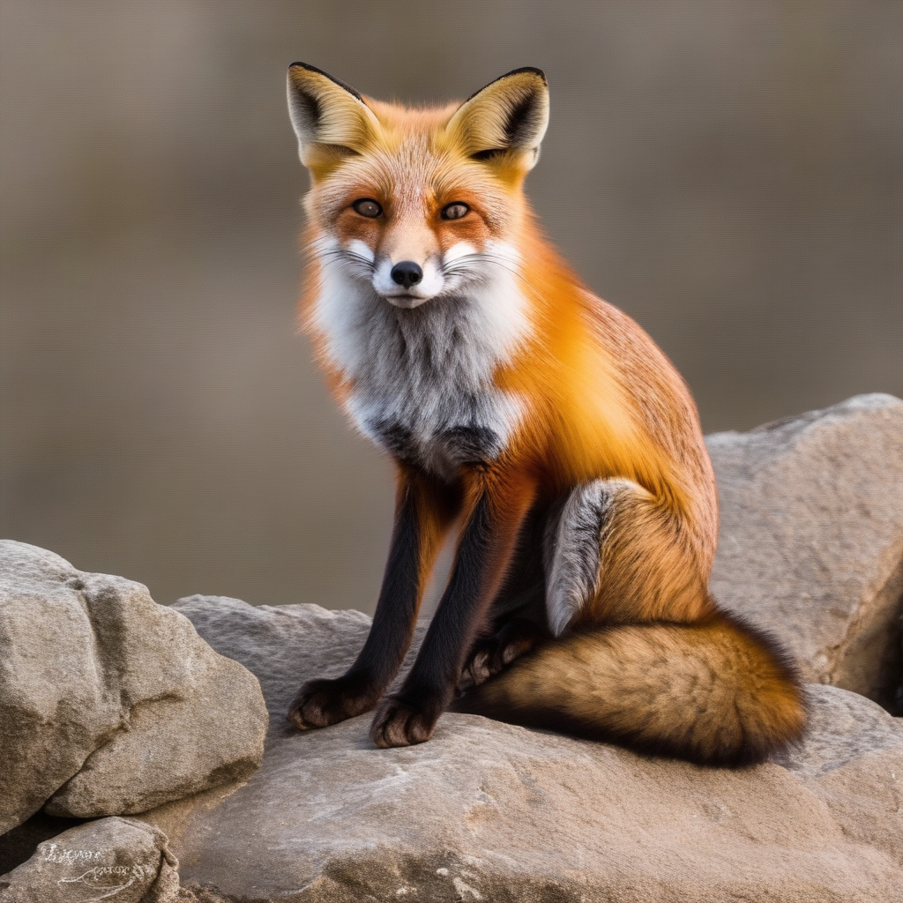
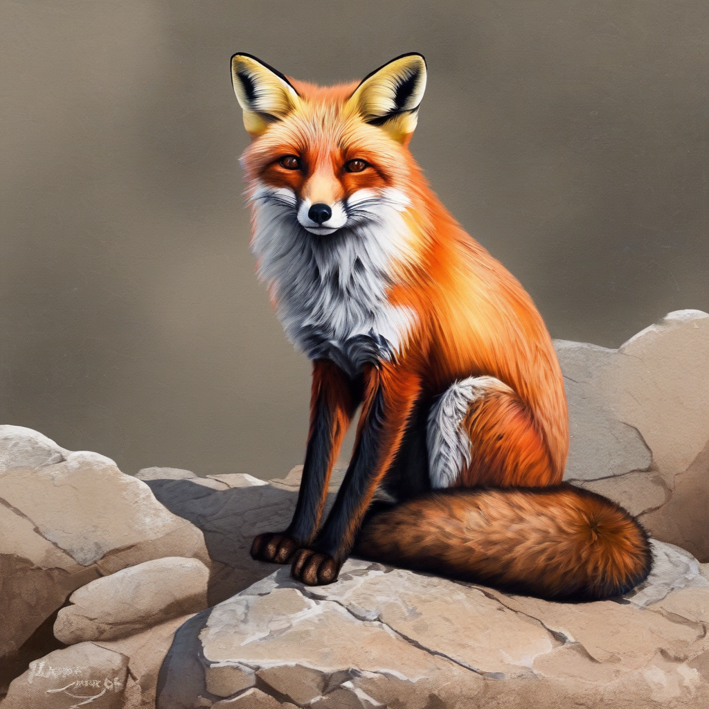
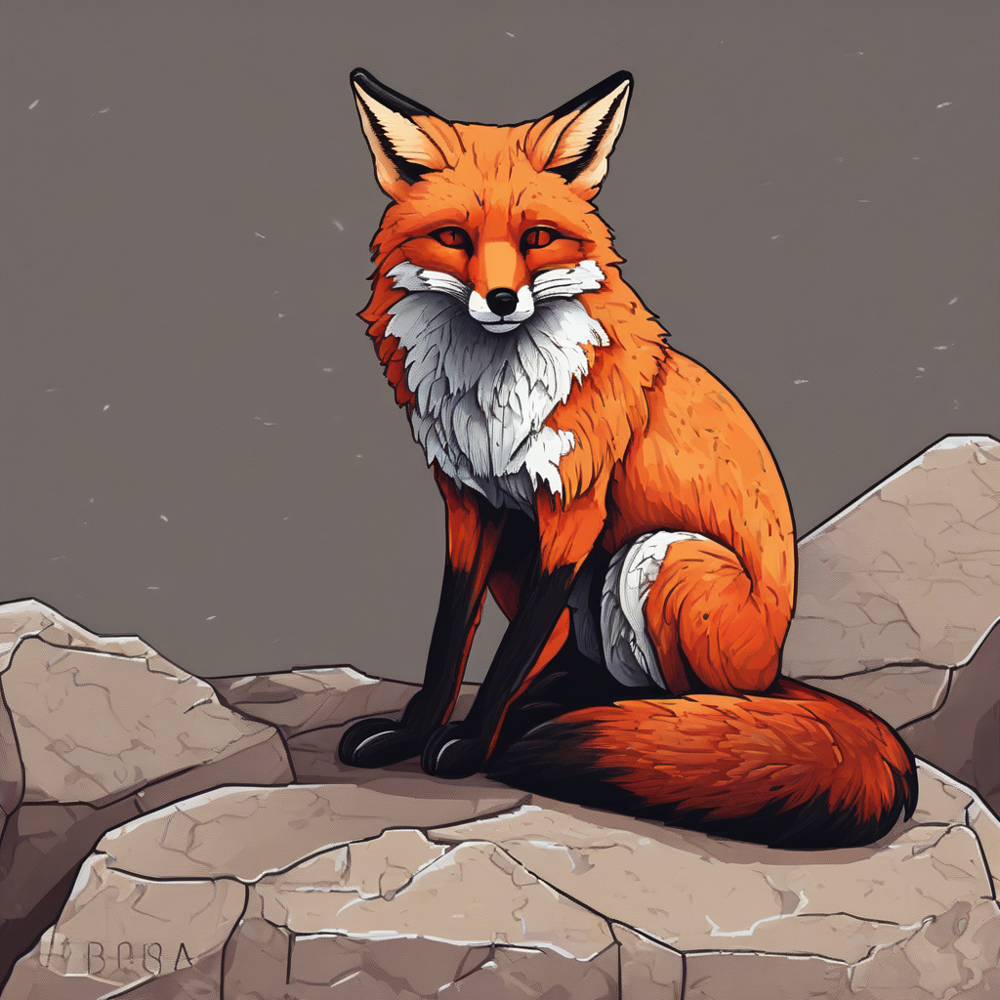

# P7-5.1 diffusers로 Stable Diffusion과 LoRA 조건 고정하기

> Section ID: `P7-5.1`
> Version: `v2026.08.01`

Stable Diffusion과 LoRA를 처음 조합할 때는 먼저 조건을 고정해야 합니다. 이 절에서는 `huggingface/diffusers`를 사용해 `base_model`, `lora_adapter`, `adapter_weight`, `prompt`, `seed`, `output_file`을 명시적으로 남깁니다.

목표는 좋은 이미지 한 장을 뽑는 것이 아닙니다. 세 seed와 세 adapter weight를 교차해 아홉 장을 만들고, 같은 seed 안의 차이와 여러 seed에서 반복되는 차이를 나누어 보는 것입니다. 그래야 `LoRA가 스타일을 바꿨다`는 말을 감상으로만 쓰지 않고, 다시 실행할 수 있는 비교 기록으로 남길 수 있습니다.

외부 자료를 보면 Stable Diffusion 생태계에서는 Web UI와 ComfyUI처럼 별도 화면을 제공하는 대형 저장소가 널리 쓰입니다. 그럼에도 이 절을 `diffusers`로 시작하는 이유는 조건 고정이 가장 잘 드러나기 때문입니다. 초심자는 먼저 코드에서 바뀌는 값을 하나로 줄여 보고, 다음 절에서 같은 조합을 workflow 화면으로 옮겨 보는 편이 안전합니다.

## 고정값과 변경값이 만드는 비교

- Stable Diffusion base 모델과 LoRA adapter를 어떻게 구분해 기록할 것인가?
- prompt와 seed를 고정한 상태에서 adapter weight만 바꾸면 무엇이 보이는가?
- 생성 결과를 `좋다/나쁘다`가 아니라 `base 대비 바뀐 점`, `과하게 바뀐 점`, `다음 조정값`으로 어떻게 적을 것인가?

핵심은 `Stable Diffusion을 실행했다`가 아니라, `어떤 조합을 비교했는가`입니다. 생성형 모델은 같은 문장을 넣어도 설정과 난수 seed에 따라 결과가 달라집니다. 따라서 첫 실습에서는 바꿀 값을 하나로 줄여야 합니다.

## 준비할 것

`diffusers` 실습은 코드로 기록을 남기기 좋지만, 실행 환경 준비가 필요합니다.

| 준비할 것 | 확인할 내용 |
| --- | --- |
| GPU 실행 환경 | CUDA 또는 호환 가능한 가속 환경이 있는가 |
| Python 패키지 | `torch`, `diffusers`, `transformers`, `accelerate`, `peft`, `safetensors`를 설치했는가 |
| 모델 접근 권한 | 사용할 base 모델과 LoRA에 접근할 수 있는가 |
| 저장 위치 | 생성 이미지와 실행 기록을 어디에 저장할지 정했는가 |

이 절에서는 설치 절차 자체를 길게 다루지 않습니다. 설치는 바뀔 수 있으므로 공식 문서를 확인하고, 본문에서는 실험 조건을 어떻게 고정하고 읽을지만 다룹니다.

## Python 예제

다음 예제는 Stable Diffusion XL base 모델에 pixel-art LoRA를 얹고, slider weight를 바꿔 이미지를 저장하는 형태입니다.

```python
from pathlib import Path

import torch
from diffusers import AutoPipelineForText2Image

output_dir = Path("outputs/p7-5-1-lora")
output_dir.mkdir(parents=True, exist_ok=True)

base_model = "stabilityai/stable-diffusion-xl-base-1.0"
lora_repo = "ntc-ai/SDXL-LoRA-slider.pixel-art"
lora_weight_name = "pixel art.safetensors"
adapter_name = "pixel_art"

prompt = "a red fox sitting on a stone"
negative_prompt = "photorealistic, blurry, text"
seeds = [42, 43, 44]

pipeline = AutoPipelineForText2Image.from_pretrained(
    base_model,
    torch_dtype=torch.float16,
)

# 8 GB GPU에서는 전체 모델을 올리지 않고 CUDA 추론 중 모듈을 CPU로 내보냅니다.
pipeline.enable_model_cpu_offload()

pipeline.load_lora_weights(
    lora_repo,
    weight_name=lora_weight_name,
    adapter_name=adapter_name,
)

experiment_rows = []

for seed in seeds:
    for adapter_weight in [-3.0, 0.0, 3.0]:
        pipeline.set_adapters(adapter_name, adapter_weights=adapter_weight)
        generator = torch.Generator(device="cuda").manual_seed(seed)

        image = pipeline(
            prompt=prompt,
            negative_prompt=negative_prompt,
            generator=generator,
            num_inference_steps=30,
            guidance_scale=7.0,
        ).images[0]

        output_file = output_dir / f"fox-seed-{seed}-lora-{adapter_weight:+.1f}.png"
        image.save(output_file)

        experiment_rows.append(
            {
                "base_model": base_model,
                "lora_adapter": lora_repo,
                "adapter_weight": adapter_weight,
                "prompt": prompt,
                "negative_prompt": negative_prompt,
                "seed": seed,
                "output_file": str(output_file),
            }
        )

for row in experiment_rows:
    print(row)
```

SDXL와 LoRA를 결합하는 현재 `diffusers` 실행에는 `peft` backend가 필요합니다. 또한 VRAM이 8 GB인 환경에서는 `.to("cuda")`로 전체 파이프라인을 올리는 대신 `enable_model_cpu_offload()`를 사용했습니다. 이 방식도 denoising 연산은 CUDA에서 수행하지만, 모듈을 필요할 때 GPU로 옮기므로 생성 시간이 길어질 수 있습니다.

이 코드에서 일부러 고정한 값과 바꾼 값은 분리해서 읽어야 합니다.

| 구분 | 값 | 이유 |
| --- | --- | --- |
| 고정 | `base_model` | 기준 모델이 바뀌면 비교가 다른 실험이 됩니다. |
| 고정 | `lora_repo` | 어떤 LoRA를 얹었는지 추적하기 위해 필요합니다. |
| 고정 | `prompt`, `negative_prompt` | 문장이 바뀌면 LoRA weight 효과와 prompt 효과가 섞입니다. |
| 비교 그룹 | `seed` | 같은 seed 안에서는 weight만 바뀌도록 하고, 세 seed에서 반복되는 변화인지 확인합니다. |
| 변경 | `adapter_weight` | 각 seed에서 LoRA 영향 강도만 바꾸어 결과 차이를 읽습니다. |

## 결과를 읽는 법

실행 뒤에는 seed마다 세 이미지를 나란히 놓고, 이어서 세 seed의 기록을 비교합니다. weight가 커지면 변화가 반드시 직선적으로 커진다고 가정하지 않습니다. LoRA는 조명, 배경, 구도뿐 아니라 대상의 형태에도 함께 영향을 줄 수 있습니다.

| 비교 | 읽어야 할 질문 |
| --- | --- |
| `adapter_weight=-3.0` | slider의 반대 방향에서 대상과 표현 방식이 무엇인지 확인합니다. |
| `adapter_weight=0.0` | base 모델에 가까운 중간 결과가 무엇인지 확인합니다. |
| `adapter_weight=3.0` | 반대 방향과 비교해 윤곽선, 색면, 질감이 어떻게 바뀌는지 확인합니다. |

각 이미지에 아래 다섯 항목을 짧게 기록합니다. 한 seed에서만 나타난 변화는 seed 특성으로 남기고, 둘 이상의 seed에서 반복된 변화만 LoRA weight와 연결해 해석합니다.

| seed | adapter weight | 대상 유지 | 배경 | 조명 | 구도 | 형태 왜곡 |
| --- | --- | --- | --- | --- | --- | --- |
| `42` | `-3.0` / `0.0` / `3.0` |  |  |  |  |  |
| `43` | `-3.0` / `0.0` / `3.0` |  |  |  |  |  |
| `44` | `-3.0` / `0.0` / `3.0` |  |  |  |  |  |

검토용으로 실행한 아홉 이미지에서는 세 seed 모두 `-3.0`에서 여우와 돌이 사진풍 질감으로 생성되고, `3.0`에서 같은 대상이 뚜렷한 외곽선과 단순한 색면을 가진 일러스트풍으로 바뀌었습니다. `0.0`은 두 방향 사이의 중간 결과였습니다. 구도와 세부 배경은 seed마다 달랐지만, 사진풍에서 일러스트풍으로의 변화는 세 seed에서 반복되었습니다. 이 반복된 특징만 이 예제의 관찰 근거로 사용합니다.

아래는 seed `42`의 비교입니다. 세 이미지를 볼 때 여우라는 대상과 돌 위에 앉은 장면은 유지되는지, 털의 질감과 윤곽선이 어떻게 바뀌는지를 차례로 봅니다.

| `-3.0` | `0.0` | `3.0` |
| --- | --- | --- |
|  |  |  |

`-3.0`에서는 털과 돌의 세부 질감이 사진처럼 보이고, `3.0`에서는 같은 장면이 굵은 윤곽선과 단순한 색면 중심으로 바뀝니다. `0.0`은 두 끝값 사이의 기준점입니다. 여기서 weight는 이미지 품질의 좋고 나쁨을 정하는 값이 아니라, 이 LoRA slider가 표현 방식을 어느 방향으로 반영할지 정하는 값입니다.

기록은 다음처럼 남깁니다.

```text
run_id: diffusers-lora-weight-001
base_model:
lora_adapter:
fixed_prompt:
fixed_seed:
changed_value: seed = 42 / 43 / 44, adapter_weight = -3.0 / 0.0 / 3.0
observed_change:
next_trial:
```

`observed_change`에는 감상보다 비교를 씁니다. 예를 들어 `세 seed에서 -3.0은 사진풍이고 3.0은 윤곽선과 색면이 강한 일러스트풍임`, `seed 44에서는 배경이 달라졌지만 표현 방식 변화는 반복됨`처럼 반복된 점과 seed별 차이를 나눕니다.

이 LoRA의 모델 카드는 `pixel art` trigger word를 안내합니다. 이번 비교에서는 trigger word 자체가 세 weight 모두에 영향을 주지 않도록 prompt에서 뺐습니다. 다른 대상이나 스타일을 비교할 때도, 무엇이 prompt 효과이고 무엇이 adapter weight 효과인지 분리할 수 있게 조건을 정합니다.

## 직접 바꿔 보며 확인할 것

1. `adapter_weight`를 `0.2`, `0.6`, `1.0`으로 바꿔 봅니다.
   관찰할 점: 어느 지점부터 LoRA 특징이 분명해지고, 어느 지점부터 prompt의 대상이 흐려지는가?

2. seed를 `42`, `43`, `44`로 바꿔 봅니다.
   관찰할 점: 특정 seed에서만 좋아 보이는 결과인지, 여러 seed에서 반복되는 변화인지 구분할 수 있는가?

3. 같은 LoRA로 prompt의 대상만 바꿔 봅니다.
   관찰할 점: LoRA가 스타일만 옮기는지, 특정 대상까지 강하게 끌고 가는지 확인할 수 있는가?

## 체크리스트

| 확인할 것 | 스스로 답할 질문 |
| --- | --- |
| 기준 모델 | base 모델 ID를 기록했는가? |
| LoRA adapter | LoRA 저장소, 파일명, adapter 이름을 남겼는가? |
| 비교 조건 | prompt와 seed를 고정한 상태에서 adapter weight만 바꿨는가? |
| 결과 해석 | base 대비 바뀐 점과 과하게 바뀐 점을 분리했는가? |
| 다음 실험 | 다음에 바꿀 값이 prompt인지, weight인지, seed인지 적었는가? |

## 출처와 참고 자료

- Hugging Face, [diffusers GitHub 저장소](https://github.com/huggingface/diffusers){: target="_blank" rel="noopener noreferrer" }, 확인일: 2026-07-31.
- Hugging Face, [Diffusers LoRA 문서](https://huggingface.co/docs/diffusers/tutorials/using_peft_for_inference){: target="_blank" rel="noopener noreferrer" }, 확인일: 2026-07-31.
- ntc-ai, [SDXL LoRA slider - pixel art model card](https://huggingface.co/ntc-ai/SDXL-LoRA-slider.pixel-art){: target="_blank" rel="noopener noreferrer" }, 확인일: 2026-08-01. SDXL base 모델, `pixel art` trigger word, slider 방향과 Diffusers 사용 예시를 확인했습니다.
- Stability AI, [Stable Diffusion XL base 1.0 model card](https://huggingface.co/stabilityai/stable-diffusion-xl-base-1.0){: target="_blank" rel="noopener noreferrer" }, 확인일: 2026-08-01.
