# P7-5.2 캐릭터 착장·전신 참조 셋 생성: 역할과 승인 범위 정하기

> Section ID: `P7-5.2`
> Version: `v2026.08.26`

장면을 만들기 전에 같은 인물의 **착장과 전신 구조**를 대조할 기준을 정한다. 이 절은 로컬 GPU에서 Qwen으로 만든 착장·전신·body-only OpenPose 자산만 다룬다. 얼굴 정면의 identity와 얼굴 회전은 [P7-5.7](section-07.md)에서 별도로 관리한다.

P7-5.3은 인물·구도·장면을 한 컷에 결합하고, P7-5.4는 그 컷의 얼굴·소품·화풍을 다시 검수한다. 여기서 승인한 전신 기준은 그 다음 단계를 자동으로 통과시키지 않는다.

## 기준 이미지는 역할을 나눈다

캐릭터 기준에 얼굴, 의상, 자세, 회전을 한 장씩 계속 더하면 입력끼리 서로의 특징을 덮어쓴다. 현재는 역할을 분리한다.

| 자산 | 고정하는 정보 | 현재 상태 |
| --- | --- | --- |
| P7-5.7 정면 머리 참조 | 얼굴형, 눈·홍채, 앞머리, 청록 단발, 선과 음영 | P7-5.7 생성 결과 |
| 1단계 착장·전신 | 정면 머리 identity, 크롭탑, 여성용 와이드 팬츠, 흰 운동화, 양팔을 내린 정면 포즈 | 960×1440, 30-step 생성 결과 |
| 2단계 전신 | 1단계 결과에 열린 흰 크롭 자켓과 손을 더한 착장 기준 | 960×1440, 30-step 생성 결과 |
| 3단계 얼굴 없는 대머리 착장 | 얼굴·헤어가 없는 대머리 머리·목 실루엣과 목깃, 재킷, 이너, 양손, 바지와 신발 | 1024×1536, 20-step 생성 결과 |
| body-only OpenPose | 전신 관절과 방향 구조 | 사람 승인 |

P7-5.7 정면 머리 참조는 전신 비례나 의상을 정하지 않고, 착장 이미지는 얼굴 identity를 정하지 않는다. P7-5.2의 전신 생성기는 이 머리 참조를 identity·헤어 입력으로 사용한다. 몸의 크기·방향·crop은 전신과 OpenPose가 맡으며, 정면 머리 참조는 목·어깨·의상을 결정하지 않는다.

## 1단계에서 얼굴·포즈·기본 착장을 결합한다

1단계는 P7-5.7의 1024×1024 정면 머리 참조와 양팔을 자연스럽게 내린 정면 body-only OpenPose를 입력으로 사용한다. 머리 참조는 얼굴·헤어만, OpenPose는 정면 전신 구조만 맡는다. 생성 결과에는 가슴 바로 아래에서 끝나는 회색 슬림 크롭탑, 딥틸 하이웨이스트 여성용 와이드 8부 팬츠, 흰 스니커즈만 넣는다. 자켓·가방·스트랩은 1단계에서 만들지 않으며, 2단계는 이 결과를 착장 보정의 입력으로 사용한다.

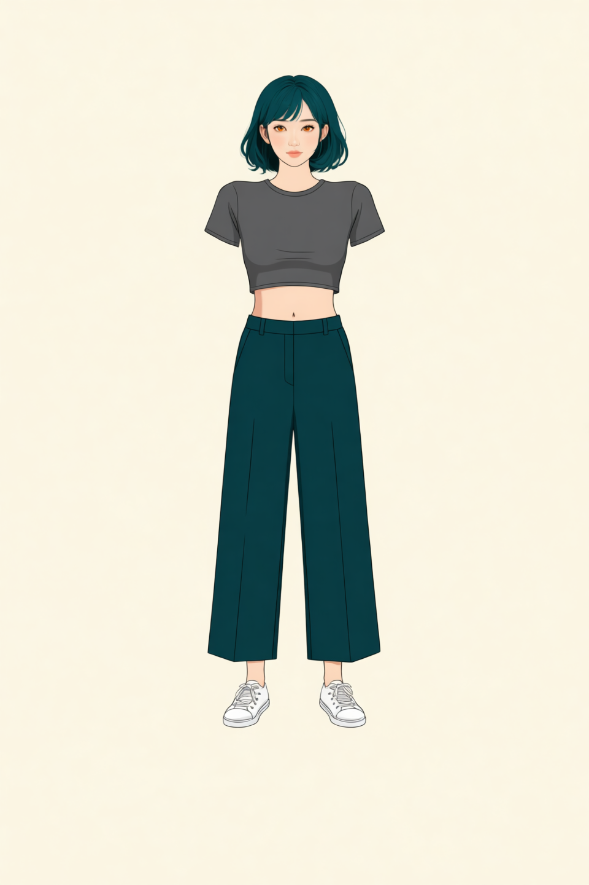

<a class="aibook-source-link" href="/AiBook/assets/part-07/chapter-05/p7-5-2-qwen-edit-prompt-style-outfit_stage1_face_openpose-relaxed-arms-v3-seed-62294-steps-30-result.json" data-language="json">960×1440, 30-step result.json</a>

## 2단계에서 열린 자켓과 손을 더한다

2단계는 1단계 전신 착장 결과와 P7-5.7의 1024×1024 정면 머리 참조만 사용한다. OpenPose는 다시 넣지 않는다. 1단계의 바지·신발·비례를 유지한 상태에서, 양쪽 어깨와 상완을 덮는 흰 크롭 자켓을 앞판이 서로 닿지 않게 열고, 소매 끝 아래에 양손이 보이게 한다. 회색 크롭티의 몸통과 맨허리 띠는 보이되, 이너 소매·가방·스트랩은 넣지 않는다.

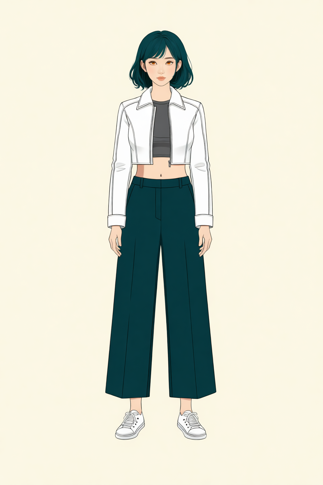

<a class="aibook-source-link" href="/AiBook/assets/part-07/chapter-05/p7-5-2-qwen-edit-prompt-style-outfit_stage2_jacket_face-relaxed-arms-v3-seed-62294-steps-30-result.json" data-language="json">960×1440, 30-step result.json</a>

## 3단계에서 얼굴만 비우고 머리 실루엣을 남긴다

3단계는 2단계 전신을 입력으로 사용해 헤어와 눈·코·입 같은 얼굴 요소를 비운다. 대머리 머리·귀·목 실루엣은 남겨 목깃과 어깨의 연결을 보존하고, 열린 흰 크롭 자켓, 회색 이너, 양손, 와이드 8부 팬츠, 흰 스니커즈도 유지한다. 이 결과는 얼굴 identity를 다시 생성하지 않고 착장·손·신발과 머리-목 경계만 참조해야 할 때 사용한다.

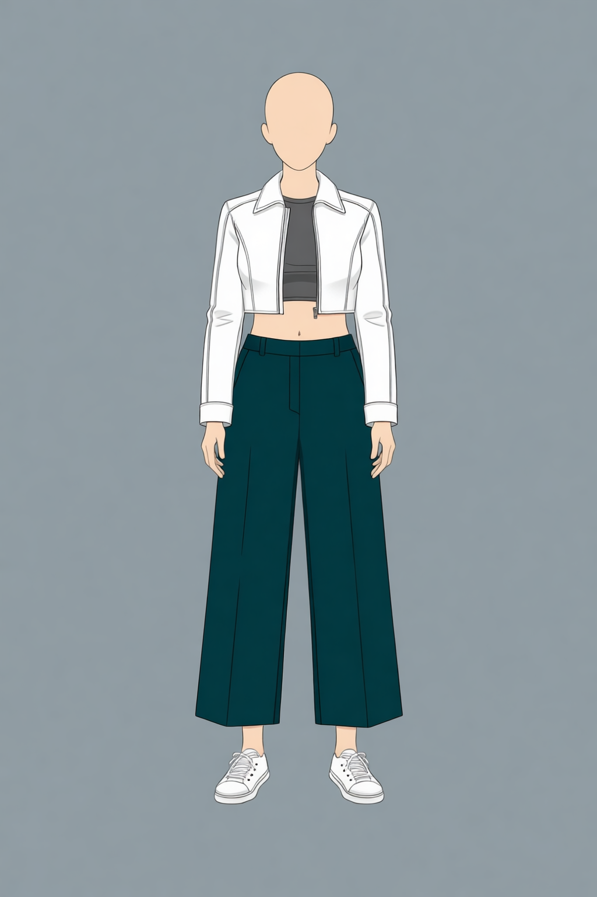

<a class="aibook-source-link" href="/AiBook/assets/part-07/chapter-05/p7-5-2-qwen-edit-prompt-style-outfit_stage3_faceless_bald-faceless-bald-v1-seed-62294-steps-20-result.json" data-language="json">1024×1536, 20-step result.json</a>

방향별 전신을 결합하기 전에는 이 정면 기준을 회전한 얼굴 없는 대머리 착장을 따로 둔다. 네 이미지는 얼굴·헤어를 비우되 머리·귀·목 실루엣은 유지하고, 재킷, 회색 이너, 양손, 와이드 8부 팬츠와 흰 스니커즈의 방향별 모습을 맡는다. 전신 생성에서는 의상과 머리-목 경계 조건으로만 사용하고, 얼굴·헤어는 같은 방향의 P7-5.7 토르소가 맡는다.

| −90° 얼굴 없는 대머리 착장 | −45° 얼굴 없는 대머리 착장 |
| --- | --- |
| 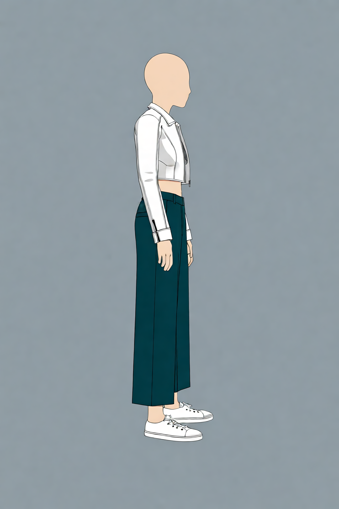 | 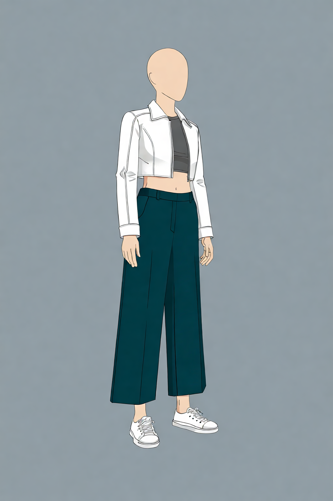 |

| +45° 얼굴 없는 대머리 착장 | +90° 얼굴 없는 대머리 착장 |
| --- | --- |
| 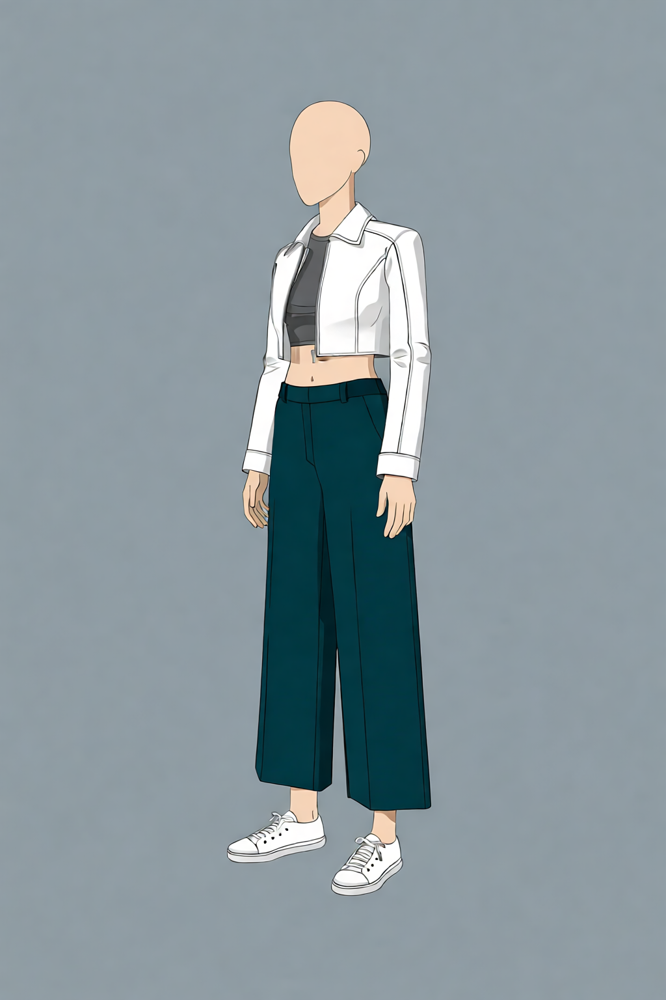 | 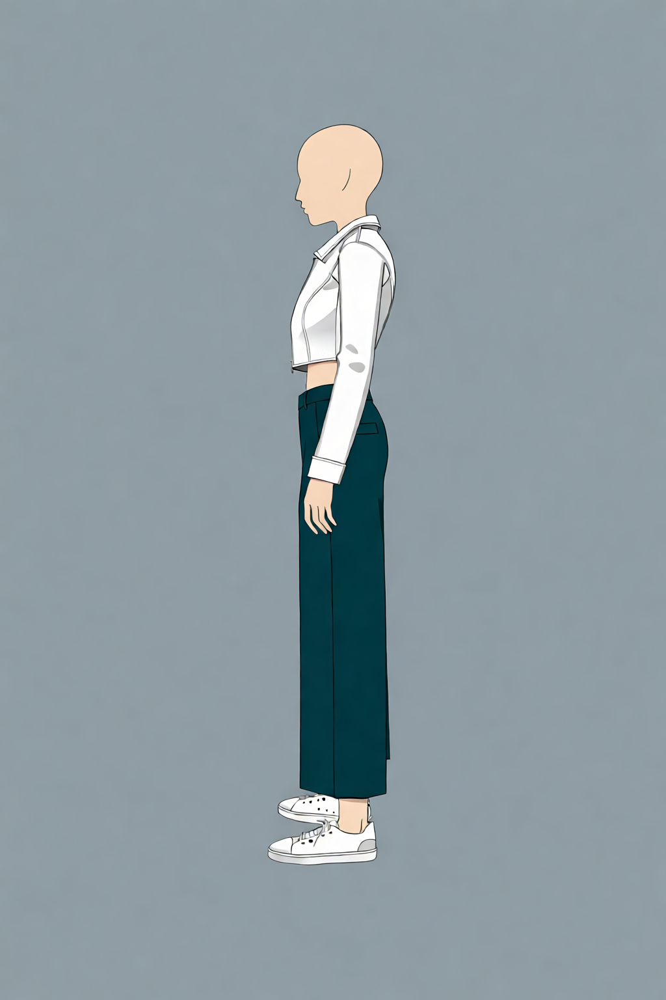 |

결과 JSON: <a class="aibook-source-link" href="/AiBook/assets/part-07/chapter-05/p7-5-2-qwen-faceless-bald-outfit-yaw_minus_90-yaw-v1-seed-62294-steps-8-result.json" data-language="json">−90°</a> · <a class="aibook-source-link" href="/AiBook/assets/part-07/chapter-05/p7-5-2-qwen-faceless-bald-outfit-yaw_minus_45-yaw-v1-seed-62294-steps-8-result.json" data-language="json">−45°</a> · <a class="aibook-source-link" href="/AiBook/assets/part-07/chapter-05/p7-5-2-qwen-faceless-bald-outfit-yaw_plus_45-yaw-v1-seed-62294-steps-8-result.json" data-language="json">+45°</a> · <a class="aibook-source-link" href="/AiBook/assets/part-07/chapter-05/p7-5-2-qwen-faceless-bald-outfit-yaw_plus_90-yaw-v1-seed-62294-steps-8-result.json" data-language="json">+90°</a>

1024×1536, 10-step 정면 전신은 3단계 헤드리스 착장을 먼저 넣어 재킷·이너·양손·바지·신발을 맡기고, P7-5.7 정면 토르소를 얼굴·헤어·화풍 기준으로 사용한다. body-only OpenPose는 마지막 입력으로 양팔을 내린 전신 비례와 프레이밍을 맡는다. 세 입력이 같은 특징을 반복하지 않도록 역할을 분리한 정면 결합 실험이다.

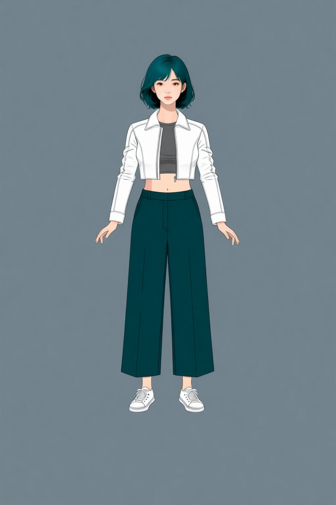

<a class="aibook-source-link" href="/AiBook/assets/part-07/chapter-05/p7-5-2-qwen-fullbody-reference-yaw_front-stage3-headless-outfit-first-v2-seed-62294-steps-10-result.json" data-language="json">1024×1536, 10-step result.json</a>

## OpenPose는 방향별 전신 구조만 맡는다

body-only OpenPose는 얼굴·손가락·의상 픽셀이 없는 구조 맵이다. 양팔은 몸통 양옆으로 자연스럽게 내리고, 두 손목은 허벅지 바깥쪽에 둔다. 두 팔은 같은 상완·전완 길이를 유지한 BODY_18 템플릿을 3D 회전·투영해 −90°·−45°·0°·+45°·+90°로 만든다. 이 맵은 방향별 전신의 관절 관계와 프레이밍만 대조하며, 캐릭터 identity나 화풍을 정의하지 않는다.

| −90° | −45° | 0° | +45° | +90° |
| --- | --- | --- | --- | --- |
|  |  |  |  |  |

좌표 JSON: <a class="aibook-source-link" href="/AiBook/assets/part-07/chapter-05/p7-5-2-openpose-fullbody-hand-on-waist-pitch0-yaw-90_pitch+00.json" data-language="json">−90°</a> · <a class="aibook-source-link" href="/AiBook/assets/part-07/chapter-05/p7-5-2-openpose-fullbody-hand-on-waist-pitch0-yaw-45_pitch+00.json" data-language="json">−45°</a> · <a class="aibook-source-link" href="/AiBook/assets/part-07/chapter-05/p7-5-2-openpose-fullbody-hand-on-waist-pitch0-yaw+00_pitch+00.json" data-language="json">0°</a> · <a class="aibook-source-link" href="/AiBook/assets/part-07/chapter-05/p7-5-2-openpose-fullbody-hand-on-waist-pitch0-yaw+45_pitch+00.json" data-language="json">+45°</a> · <a class="aibook-source-link" href="/AiBook/assets/part-07/chapter-05/p7-5-2-openpose-fullbody-hand-on-waist-pitch0-yaw+90_pitch+00.json" data-language="json">+90°</a>

<a class="aibook-source-link" href="/AiBook/assets/part-07/chapter-05/p7-5-2-openpose-fullbody-hand-on-waist-pitch0-result.json" data-language="json">5방향 OpenPose 생성 result.json</a>

## 방향별 전신은 토르소와 구조 맵의 화면 방향을 맞춘다

방향별 전신은 화면상 방향이 일치하도록 짝지은 body-only OpenPose, 3단계 헤드리스 착장, 같은 방향의 P7-5.7 토르소 순서로 입력한다. OpenPose는 전신 비례·팔·다리 관계와 원근을, 헤드리스 착장은 재킷·이너·바지·신발을, 토르소는 얼굴·헤어·화풍과 화면 방향을 맡는다. OpenPose의 투영 부호는 5.7 카메라 yaw와 화면에서 반대이므로, −45°·−90° 토르소에는 +45°·+90° OpenPose를, +45°·+90° 토르소에는 −45°·−90° OpenPose를 연결한다.

| −90° | −45° |
| --- | --- |
| 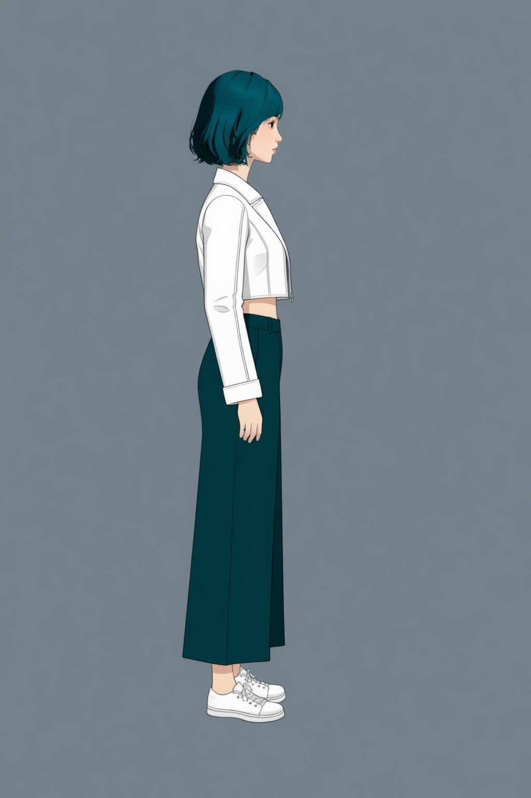 | 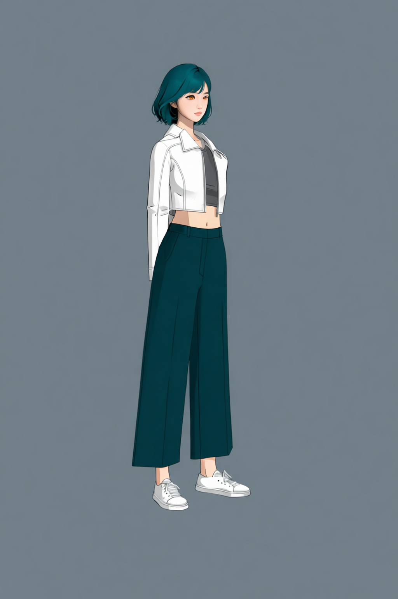 |

| +45° | +90° |
| --- | --- |
| 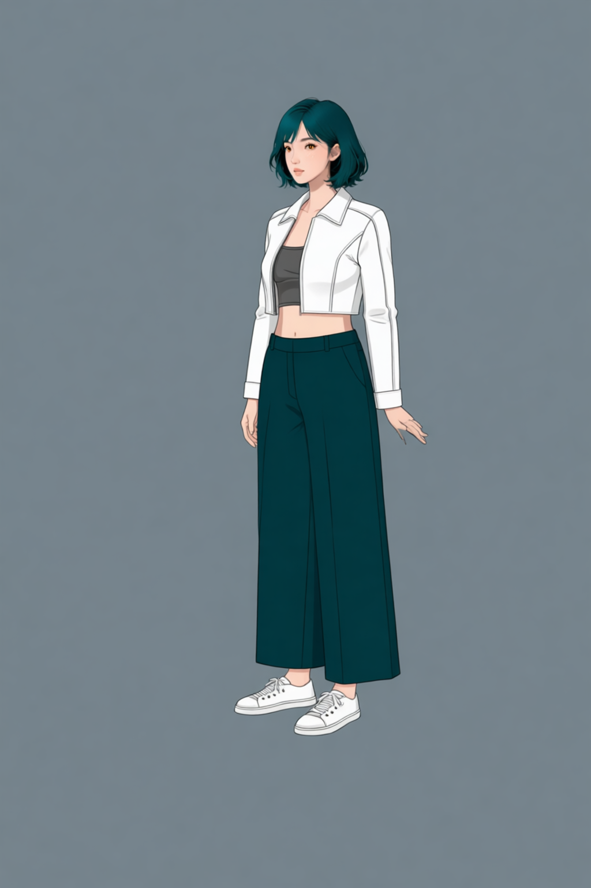 | 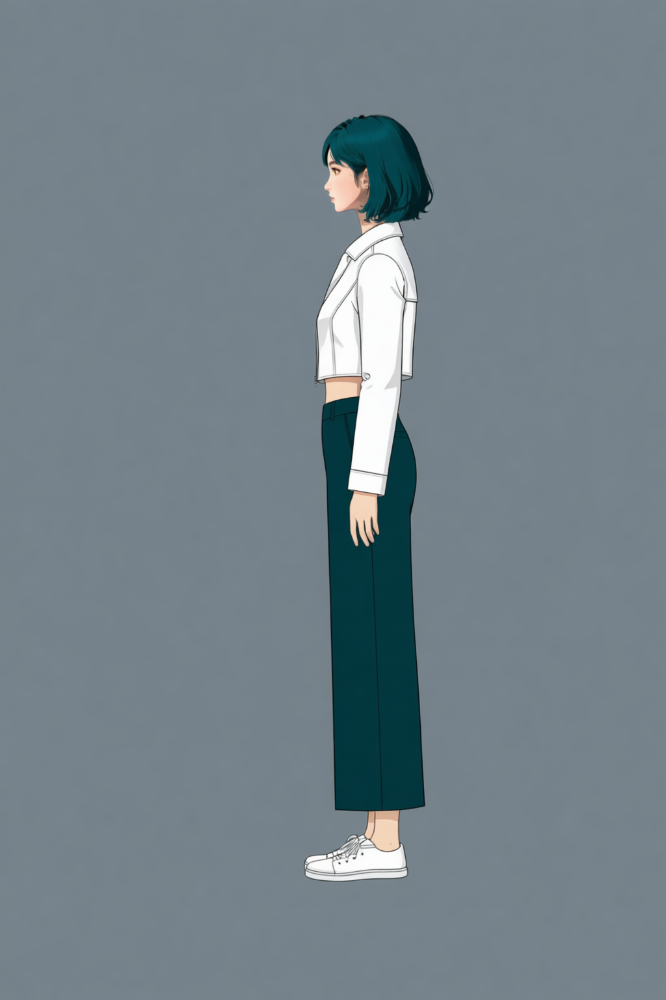 |

결과 JSON: <a class="aibook-source-link" href="/AiBook/assets/part-07/chapter-05/p7-5-2-qwen-fullbody-reference-yaw_minus_90-stage3-headless-openpose-torso-v5-seed-62294-steps-30-result.json" data-language="json">−90°</a> · <a class="aibook-source-link" href="/AiBook/assets/part-07/chapter-05/p7-5-2-qwen-fullbody-reference-yaw_minus_45-openpose-first-v2-seed-62294-steps-20-result.json" data-language="json">−45° (20-step)</a> · <a class="aibook-source-link" href="/AiBook/assets/part-07/chapter-05/p7-5-2-qwen-fullbody-reference-yaw_plus_45-stage3-headless-openpose-torso-v5-seed-62294-steps-30-result.json" data-language="json">+45°</a> · <a class="aibook-source-link" href="/AiBook/assets/part-07/chapter-05/p7-5-2-qwen-fullbody-reference-yaw_plus_90-stage3-headless-openpose-torso-v5-seed-62294-steps-30-result.json" data-language="json">+90°</a>

−90°와 +90°는 서로 반대 화면 방향의 측면으로 분리된다. −45°와 +45°는 같은 착장과 얼굴 기준을 유지하지만, 가려지는 쪽의 팔과 손 모양은 완전한 좌우 대칭이 아닐 수 있으므로 방향별 결과에서 따로 확인한다.

## 실행 기록과 승인 범위를 분리한다

Qwen 전신 편집은 P7-5.7의 정면 머리 참조, 착장·가방, OpenPose가 같은 역할을 하지 않도록 입력 역할을 실행 기록에 남긴다. prompt의 단어 수는 품질 점수가 아니라, 같은 특징을 반복해서 지시하면서 계약이 비대해졌는지 확인하는 보조 정보다.

Qwen 정면 착장 1~3단계 생성 코드 보기

Stage 1은 정면 머리·OpenPose로 이너와 하의를 만들고, Stage 2는 열린 재킷을 더하며, Stage 3은 얼굴 없이 착장 기준을 분리합니다.

<a class="aibook-source-link" href="/AiBook/assets/part-07/chapter-05/p7-5-2-qwen-edit-transition-plan.json" data-language="json">Qwen 전환·검수 계획</a>

## 캐릭터셋 체크리스트

| 확인할 것 | 스스로 답할 질문 |
| --- | --- |
| 출처 | 다음 단계 입력으로 쓰는 PNG가 로컬 GPU 실행 기록과 사람 검수 기록을 모두 갖는가? |
| 역할 | P7-5.7 얼굴, 착장, 전신 구도, OpenPose 구조가 서로의 역할을 대신하지 않는가? |
| 전신 구조 | 회전 후보에서 어깨·팔·다리·신발이 요청한 방향과 프레임 안에 유지되는가? |
| 재현 | seed, step, 입력 자산, prompt와 `prompt_word_count`가 run JSON에 남아 있는가? |
| 승인 | 후보와 승인 자산의 위치·이름·검수 상태가 분리되어 있는가? |
| 다음 단계 | P7-5.3과 P7-5.4에는 승인된 기준만 넘기고, 새 구도·장면·소품은 다시 검수하는가? |

## 출처와 참고 자료

- 전신·착장·OpenPose의 실행 조건과 사람 판정은 이 절에서 연결한 local run JSON과 review JSON을 기준으로 확인한다.
- 얼굴 정면과 카메라 회전의 기준은 [P7-5.7](section-07.md)에서 확인한다.
