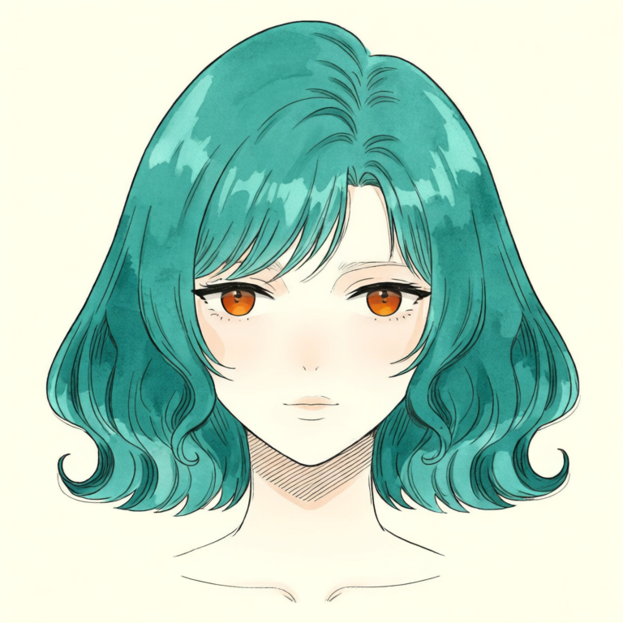
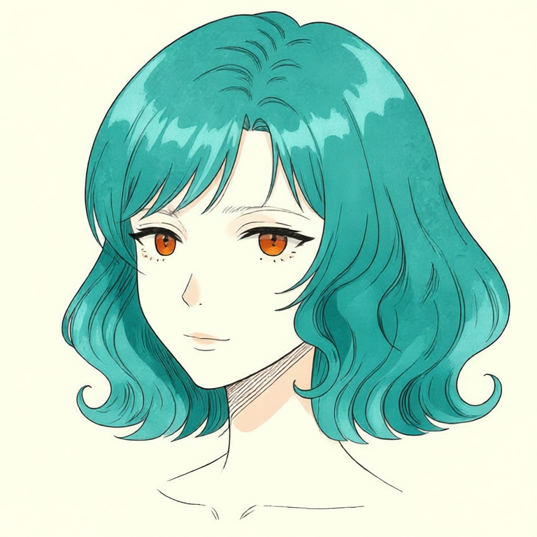
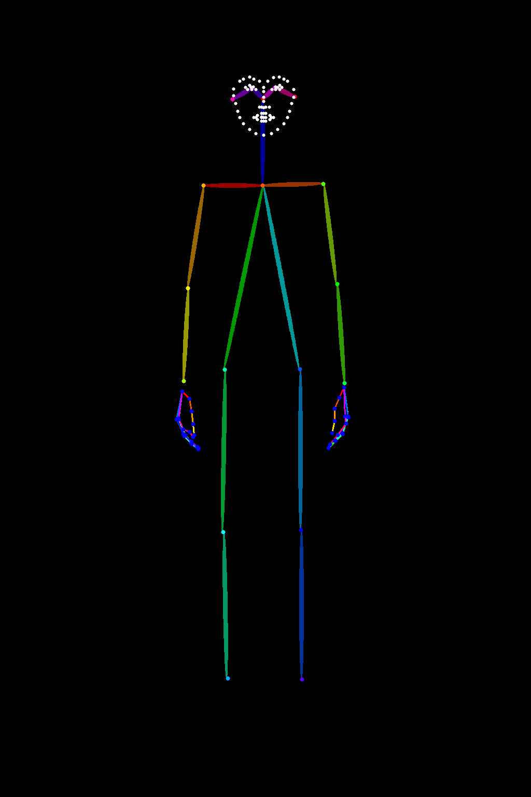
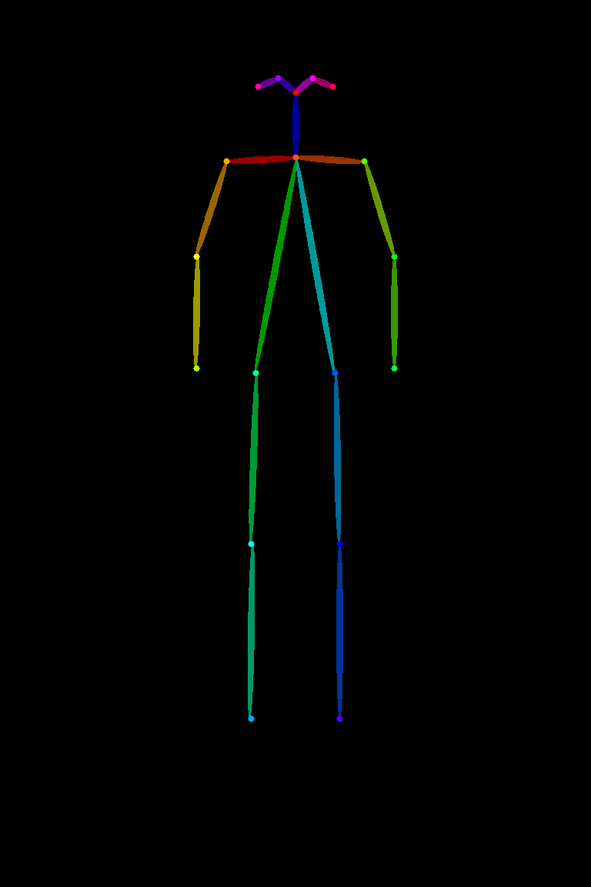
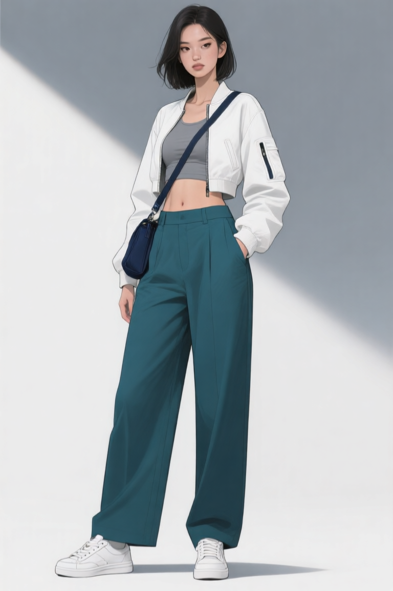
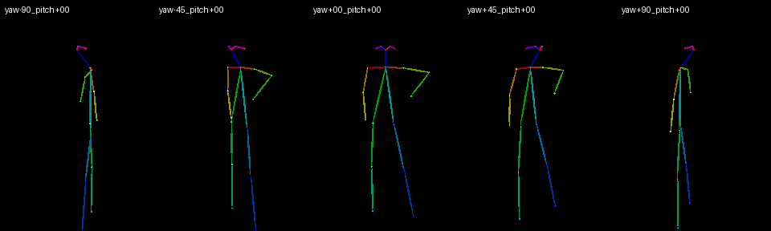
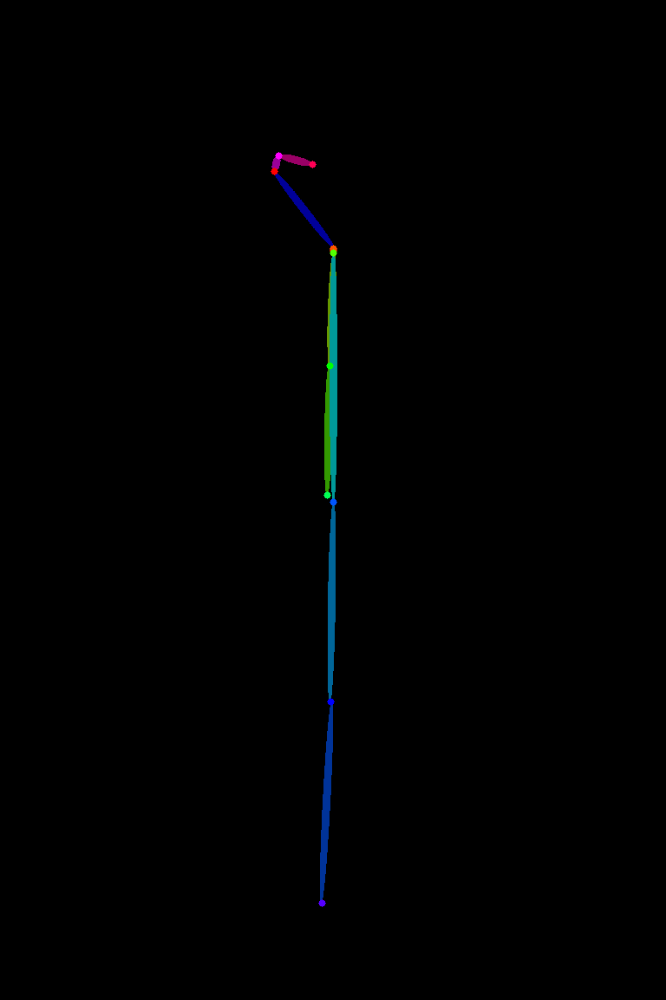

# P7-5.2 캐릭터 참조 셋 생성: 로컬 GPU 원본과 승인 범위 정하기

> Section ID: `P7-5.2`
> Version: `v2026.08.19`

웹툰 컷 생성에서는 pose보다 먼저 캐릭터 기준을 고정해야 합니다. 이 절은 **로컬 GPU에서 새로 만든 원본만**으로 캐릭터 참조 셋을 만드는 단계입니다. 외부 생성 서비스의 이미지와 그 이미지를 직접 참조로 사용한 출력은 이 절의 근거로 사용하지 않습니다. P7-5.4의 LoRA 학습·평가는 별도 실험이지만, 그 학습에 넘길 수 있는 P7-5.2 원본의 범위와 캡션은 여기서 사람 승인 기준으로 준비합니다.

이 절의 산출물은 완성 컷이나 학습된 모델이 아닙니다. 다음 단계가 사용할 수 있는지 사람 검수한 전신 기준, view별 원본, 생성 기록, 그리고 아직 사용할 수 없는 범위입니다. 장면 속 pose, projection, 배경을 바꾸는 전체 컷 생성은 `P7-5.3`의 책임이고, 통과 컷의 얼굴·손·소품·연속성 보정은 `P7-5.4`에서 별도로 검증합니다.

## 먼저 통과해야 하는 두 가지 gate

P7-5.2의 입력은 하나의 예쁜 인물 그림이 아닙니다. 배경 화풍과 인물 기준이 각각 어느 범위까지 승인됐는지를 먼저 구분해야 합니다.

| gate | 필요한 근거 | 현재 처리 원칙 |
| --- | --- | --- |
| P7-5.1 화풍 | 사람 승인된 로컬 GPU 배경 원본, 검수 ledger, 최종 manifest | P7-5.2의 review-only 실험에는 승인 공통 화풍 prompt 계약만 결합하고, 화풍 PNG를 image input으로 쓰지 않음 |
| P7-5.2 인물 | 로컬 GPU 정면·방향 얼굴, 소품 기준, 여섯 방향 전신, 새 실행 기록, 사람 검수 결과 | 승인된 얼굴·소품·전신만 다음 단계에 넘기고, 표정은 별도 생성·검수 |
| P7-5.3 컷신 | pose·camera·장소·소품이 함께 통과한 전체 컷 | 이 절의 단일 기준만으로 통과 처리하지 않음 |

## 캐릭터 패키지 구성요소

캐릭터 패키지는 한 장의 시트나 단일 정면 이미지가 아닙니다. 기존 구성요소 목록은 유지하되, 각 항목이 **로컬 GPU 원본**과 실행 기록으로 채워졌는지를 따로 확인합니다.

| 자산군 | 목표 구성 | 역할 | 현재 상태 |
| --- | --- | --- | --- |
| 기준·표정·전신 이미지 | 단일 PNG의 전신·정면·좌우 전면 쿼터·좌우 측면·후면과 필요한 표정·손 detail | 얼굴·의상·전신·손·소품의 기준 | 정면·방향 얼굴, 신발·자켓·회색 크롭탑·바지·가방, 여섯 방향 전신 승인; 표정·손 detail은 별도 생성·검수 대상 |
| LoRA 추가 데이터 | 정면·방향 얼굴 6장과 기본 전신·전신 리파인 각 6장 | 이후 캐릭터 LoRA의 identity·복장 anchor 후보 | 18개 승인 원본을 로컬 데이터셋으로 준비 가능; 학습·평가는 P7-5.4에서 별도 실행 |
| train scene | 장소·동작·camera가 다른 단일 장면 PNG | 캐릭터와 장면 렌더링 학습 | local-only 장면 팩을 별도로 만들기 전에는 비어 있음 |
| held-out scene | train과 source ID·장소·camera가 겹치지 않는 단일 장면 PNG | 학습 뒤 일반화 평가 | local-only 장면 팩을 별도로 만들기 전에는 비어 있음 |
| 실행·검수 기록 | 원본별 prompt·seed·모델·해상도·사람 판정 | 재현성과 다음 단계 입력 범위 | 승인된 6방향 기준의 실행·검수 기록을 보관 |

이 pipeline은 여러 이미지를 타일 시트로 합쳐 모델에 넣지 않습니다. 참조 입력에는 사람 검수한 개별 PNG만 사용합니다. train과 held-out은 단지 파일 수를 맞추는 폴더가 아니라, source ID·장소·camera를 분리해 캐릭터를 외운 결과와 새 장면에 적용한 결과를 구분하는 장치입니다.

## 생성·검수 순서

캐릭터 패키지는 같은 인물을 여러 장으로 다시 그린 결과를 무작정 모으지 않습니다. 아래 다섯 생성기는 먼저 고정한 정면 얼굴을 출발점으로, 작은 범위에서 큰 범위로 정보를 넘깁니다. 각 단계의 후보는 다음 단계의 입력이 될 수 있지만, 사람 승인 전에는 기준 체인에 편입하지 않습니다.

| 순서 | 생성기 | 입력에서 고정하는 정보 | 최종 PNG에서 검수할 정보 |
| --- | --- | --- | --- |
| 1 | 정면 얼굴 | 얼굴형, 머리, 피부, 홍채·동공의 기본 계약 | 정면 얼굴 identity |
| 2 | 방향 얼굴 | 정면 얼굴 계약과 view별 방향 | 눈·코·입·머리 윤곽이 회전 뒤에도 같은 인물인지 |
| 3 | 소품 기준 | 회색 크롭탑, 바지, 신발과 확장 소품의 개별 물성·색·형태 계약, 크롭탑-허리선 관계 | 소품 하나가 독립적으로 읽히고 착장 경계가 확인되는지 |
| 4 | 방향 전신 | 방향 얼굴, 개별 소품 | 몸 방향·비례와 복장·스트랩 같은 특징 장치의 연속성 |
| 5 | 전신 얼굴·소품 보강 | 승인된 방향 전신, 방향별 원본 얼굴 기준, 자켓·가방 | 얼굴 identity와 자켓·가방 형태를 보강해도 방향 전신이 유지되는지 |

4번은 승인된 정면 전신 앵커와 얼굴 시트를 입력으로 사용해 좌·우 전면 쿼터·좌·우 측면·후면을 각각 생성합니다. 좌측 계열 시트는 정면·좌측 쿼터·좌측 측면 얼굴을, 우측 계열 시트는 정면·우측 쿼터·우측 측면 얼굴을 차례로 놓습니다. 이 순서는 모델이 3D 회전을 계산했다는 뜻이 아니라, 방향별 결과의 전신 프레이밍·복장·신발·얼굴 연속성을 사람이 대조할 수 있게 하는 생성·검수 순서입니다.

## 정면 얼굴 identity 기준

생성 체인은 정면 얼굴 기준에서 시작합니다. 머리핀을 포함한 이전 기준은 폐기하고, 얼굴형·홍채·머리·표정을 prompt로 정의한 머리 전체·얼굴·턱 출력만 새로 생성·사람 검수했습니다. 넓고 낮은 광대, 볼살, 길고 가는 아몬드형 눈과 완만히 올라간 눈꼬리는 이 첫 기준에서만 고정하며, 몸·의상·회전 view·표정은 아직 승인하지 않습니다.

### 얼굴 공용 identity 계약 JSON

얼굴 공용 identity 계약 JSON은 정면 얼굴 생성기와 얼굴 턴어라운드 생성기가 함께 읽는 텍스트 계약입니다. 이 파일은 참조 PNG나 사람 승인 판정 자체가 아니라, 같은 특징을 생성기마다 따로 복사해 적는 일을 줄이는 단일 원본입니다. PNG는 실제 결과를 사람이 대조하는 기준이고, JSON은 새 후보를 만들 때 유지할 특징의 문장 기준입니다. 전신 얼굴·소품 리파인은 이 JSON을 쓰지 않고, 승인된 얼굴 PNG를 방향별로 여러 장의 개별 이미지 참조로 사용합니다.

<p><a class="aibook-source-link" href="/AiBook/assets/part-07/chapter-05/p7-5-2-character-identity-contract.json" data-language="json">공용 캐릭터 identity 계약 JSON</a></p>

| JSON 항목 | 맡는 역할 |
| --- | --- |
| `front_portrait_context` | 정면 얼굴 후보의 인물 범위와 배경을 고정한다. |
| `identity_description` | 피부·얼굴형·눈·홍채·코·입술·앞머리·단발의 공용 특징을 정면과 보이는 방향의 prompt에 전달한다. |
| `rear_hair_identity` | 얼굴이 보이지 않는 후면에서 단발 실루엣·목선·머리색만 유지하도록 분리한다. |
| `front_portrait_suffix` | 정면 얼굴 기준의 crop 경계를 고정해 전신·의상 조건이 섞이지 않게 한다. |

따라서 JSON을 바꾸면 세 생성기의 새 후보가 공유하는 문장 계약이 달라진다. 기존 승인 PNG를 자동으로 다시 승인하거나, pose·camera·표정 범위를 넓히지는 않는다. 계약 변경 뒤에는 영향을 받은 방향의 후보를 다시 만들고 사람 검수를 거쳐야 한다.

### 정면 얼굴 승인 검수 기록

정면 얼굴 기준의 prompt, seed, 출력 크기와 사람 승인 판정은 아래 `review.json` 관리 자산에 남깁니다. 이 기록은 정면 얼굴 identity와 이후 얼굴 회전 대조점까지만 승인하며, 전신·pose·camera·표정은 포함하지 않습니다.


### Qwen 정면 머리 기준

현재 Qwen 정면 기준은 참조 이미지 없이 Qwen 기본 생성 파이프라인에서 만들었습니다. `seed=62294`, `768×768`, `10 step`의 v70 텍스트 전용 정면 얼굴 후보를 사람 승인해 교체했습니다. 이 기준은 중앙 정면 얼굴, 높은 콧대와 곧은 코선, 원형 동공을 지닌 주황빛 홍채, 청록색의 볼륨 있는 단발의 전체 실루엣·앞머리·옆머리·귀·목을 확인하는 범위입니다. 얇은 윤곽선, 단색 채색, 4단 음영과 강한 하이라이트는 공통 일러스트 계약으로만 지시했습니다. 이전 Qwen 기준은 Git 이력에 보존하며, 이 생성에는 Qwen·Flux를 포함한 어떠한 이미지 입력도 사용하지 않았습니다.

| 승인된 Qwen 정면 머리 기준 |
| --- |
|  |

<p><a class="aibook-source-link" href="/AiBook/assets/part-07/chapter-05/p7-5-2-face-front-qwen-role-separated-reference-review.json" data-language="json">Qwen 정면 머리 승인 review.json</a></p>

### Qwen OpenPose 좌측 전면 쿼터 기준

좌측 전면 쿼터는 승인 Qwen 정면을 identity 입력으로, 인물 RGB를 포함하지 않는 선언형 얼굴·목 OpenPose 맵을 구조 입력으로 사용했습니다. `seed=119431`, `768×768`, `30 step` 결과를 사람 승인했습니다. 이 기준은 양쪽 홍채, 청록색의 볼륨 단발과 느슨한 S 웨이브·끝 C 컬을 유지한 얕은 좌측 전면 쿼터 범위만 승인합니다. 기존 Flux 방향 이미지는 입력으로 사용하지 않았으며, OpenPose 맵은 얼굴 정체성이 아니라 회전 구조만 전달합니다.

| 승인된 Qwen OpenPose 좌측 전면 쿼터 기준 |
| --- |
|  |

<p><a class="aibook-source-link" href="/AiBook/assets/part-07/chapter-05/p7-5-2-face-front-quarter-left-qwen-openpose-reference-review.json" data-language="json">Qwen OpenPose 좌측 전면 쿼터 승인 review.json</a></p>

### Qwen 정면 전신용 OpenPose 구조 기준

정면 전신의 비율과 팔·다리 배치는 문장으로만 반복해 고정하지 않습니다. 익명 성인 여성의 중립 정면 전신 비례 이미지를 OpenPose 검출기에 넣어, body·face·hand가 함께 있는 Full 맵과 body-only 맵을 각각 만들고 사람 승인했습니다. 두 맵은 캐릭터를 그린 원본도, identity·머리·의상·소품·화풍의 기준도 아닙니다. 오직 한 사람의 정면 서기 구조를 전달합니다.

Full 맵은 검출 결과가 얼굴·손까지 한 좌표계에서 자연스럽게 이어지는지 확인하는 검수용입니다. 실제 Qwen 정면 전신 후보에는 body-only 맵을 사용합니다. body-only 맵에는 얼굴 점군과 손가락 관절이 없으므로 얼굴 identity 입력·착장 입력과 불필요하게 경쟁하지 않습니다. 다만 표준 COCO-18 body 구조에 포함되는 코·눈·귀 점은 남습니다. 이 다섯 점은 얼굴 세부 묘사가 아니라 몸 skeleton의 머리 방향 기준입니다.

| 승인된 Full 구조 검수용 맵 | 승인된 body-only 생성용 맵 |
| --- | --- |
|  |  |

<p><a class="aibook-source-link" href="/AiBook/assets/part-07/chapter-05/p7-5-2-openpose-fullbody-front-approved-guide-review.json" data-language="json">정면 OpenPose Full 승인 review.json</a> · <a class="aibook-source-link" href="/AiBook/assets/part-07/chapter-05/p7-5-2-openpose-fullbody-front-body-only-approved-guide-review.json" data-language="json">정면 OpenPose body-only 승인 review.json</a> · <a class="aibook-source-link" href="/AiBook/assets/part-07/chapter-05/p7_5_2_generate_openpose_guide.py" data-language="python">2단계 OpenPose 생성 코드</a></p>

단일 생성 코드는 1단계에서 익명 비례용 이미지를 만들고, 2단계에서 그 이미지를 OpenPose 검출기에 넣습니다. 기본 출력은 body-only이며 `--include-face`, `--include-hands`를 지정할 때만 각각 얼굴 점군과 손 점군을 추가합니다. 기존 승인 v1 자산을 덮어쓰지 않도록 새 실행의 기본 출력은 v2 이름을 사용합니다.

정면 전신은 승인 Qwen 얼굴을 identity 입력으로, 승인 Qwen 정면 전신을 복장 입력으로, 7등신 body-only OpenPose 맵을 구조 입력으로 분리합니다. 구조 맵은 관절·비율만, 복장 입력은 자켓·이너·바지·신발·가방·스트랩만 전달하도록 역할을 나눕니다. 이 역할 분리는 얼굴·복장·구조가 한 이미지에 섞여 생기는 드리프트를 줄이기 위한 실험 조건입니다. `seed=62294`, `960×1440`, 30 step으로 사람 승인한 현재 정면 기준은 세 입력 모두 Qwen 또는 결정론적 OpenPose 산출물이며, FLUX 출력은 이미지 입력으로 사용하지 않습니다. 이 승인은 정면 범위만 뜻합니다.

<details id="face-front-no-accessory" class="aibook-lazy-source" data-source="/AiBook/assets/part-07/chapter-05/p7_5_2_generate_face_front_reference.py" data-language="python">
<summary>정면 얼굴 identity 후보를 만드는 코드 보기</summary>
<div class="aibook-lazy-source__body">펼치면 Python 원문을 불러옵니다.</div>
</details>

## 얼굴 회전 identity 기준

이전에 이 절에 등록했던 FLUX 방향 얼굴·전신·리파인 승인 PNG와 review 기록은 제거했다. 따라서 현재 보존된 Qwen 정면 기준을 제외한 회전 방향은 새 후보를 생성하고 사람 검수를 통과하기 전까지 안정 참조나 LoRA 입력으로 사용하지 않는다.


| 정면 | 카메라 기준 좌측 전면 쿼터 | 카메라 기준 우측 전면 쿼터 |
| --- | --- | --- |

| 카메라 기준 좌측 측면 | 카메라 기준 우측 측면 | 후면 |
| --- | --- | --- |

### 방향별 얼굴 승인 검수 기록

다섯 방향의 승인 판정은 각 PNG와 짝을 이루는 `review.json` 관리 자산에 남깁니다. JSON에는 후보 원본, 안정 자산 이름, seed·step·방향 prompt·정면 얼굴 입력과 사람이 승인한 상태가 들어갑니다.

| 방향 | 승인 검수 기록 |
| --- | --- |

개별 방향 PNG는 사람 검수용 대조물이면서, 정면 PNG와 함께 기본 전신 방향 생성의 방향별 얼굴 시트 패널입니다.

| 기준 | 현재 상태 | 다음 판정 |
| --- | --- | --- |
| 얼굴 방향 | 정면, 좌·우 쿼터, 좌·우 측면, 후면 6개별 PNG 승인 | 새 pose·camera 범위는 별도 사람 검수 |
| 얼굴 구성 | 홍채·동공 비율, 시선-코 정렬, 코와 머리 실루엣의 회전 일치 | 전신 방향에서 같은 특징이 유지되는지 대조 |
| 표정 | 승인 표정 없음 | 중립·기쁨·우려·분노·슬픔·놀람을 새로 생성·검수 |

정면은 `p7_5_2_generate_face_front_reference.py`가 전담합니다. 정면, 좌·우 전면 쿼터, 좌·우 엄격 측면, 후면을 합쳐 여섯 방향 장면으로 관리합니다. 방향 얼굴 생성기는 `--views front_quarter_left front_quarter_right profile_left profile_right rear`만 허용하고, 각 view를 별도 `768×768` PNG로 저장합니다. 이름의 left/right는 카메라에서 보는 방향이며, 각각 인물의 반대쪽 면을 뜻합니다. 각 후보는 정면 얼굴 앵커 하나와 방향·공용 identity prompt를 한 번의 생성에 함께 적용합니다. 따라서 구도·회전과 얼굴형·홍채·동공·단발을 따로 보정하는 중간 PNG는 만들지 않습니다. 후면은 얼굴을 드러내지 않고 후두부 단발·목선만 유지합니다.

`--seed-offset`, `--seed-count`, `--seed-step`으로 서로 다른 시드를 한 번의 파이프라인 적재에서 연속 생성하고, `--steps`로 이 단일 생성의 denoising 횟수를 바꿉니다. 기본값은 `3` step입니다. `--preview-interval 3`을 지정하면 FLUX latent를 3 step마다 VAE로 해독해 review-only PNG로 저장합니다. 기본값 `0`은 이 미리보기를 끄며, preview PNG 목록은 실행 JSON의 생성 기록에 남습니다. 새 PNG와 JSON 파일명에는 한 번의 실행에서 공유하는 6자리 랜덤 실험 코드와 view·시드·step이 붙습니다. 모델·prompt·해상도·identity 계약 원문은 파일명에 해시로 축약하지 않고 실행 JSON에 보존합니다. 일부 view만 검토할 때는 `--views profile_left profile_right`처럼 범위를 좁힙니다. 한 번의 생성 결과라도 방향·crop·후면 비노출과 identity를 함께 통과해야 합니다.

<details id="face-direction-references" class="aibook-lazy-source" data-source="/AiBook/assets/part-07/chapter-05/p7_5_2_generate_face_turnaround_sheet.py" data-language="python">
<summary>정면 얼굴 기준으로 방향별 개별 얼굴 후보를 만드는 코드 보기</summary>
<div class="aibook-lazy-source__body">펼치면 Python 원문을 불러옵니다.</div>
</details>

### 전신 보강용 얼굴 identity 입력

전신 턴어라운드는 정면 얼굴과 목표 방향에 맞는 쿼터·측면 얼굴을 한 시트로 합쳐 image conditioning 참조로 사용합니다. 리파인 생성기의 여섯 view(`front`, `front_quarter_left`, `front_quarter_right`, `profile_left`, `profile_right`, `rear`)는 같은 이름의 승인 전신 composition에 방향별 얼굴 PNG 여러 장과 의상·가방 참조를 각각 개별 이미지 입력으로 더합니다. 좌·우를 합친 `front_quarter`와 `profile`은 더 이상 실행 view가 아닙니다. 별도 얼굴 복원·확대 구조는 두지 않습니다. 정면·쿼터·측면은 보이는 얼굴의 홍채·눈·코·입·턱·헤어라인을, 후면은 단발 실루엣·목선·머리색을 사람 검수로 확인합니다.

## 의상 통합 기준을 다시 설계한다

기존 개별 소품 PNG와 이를 연쇄 입력으로 쓰던 생성기는 이 원고의 승인 체인에서 제거했습니다. 여러 소품 이미지를 한 번에 넣으면 재질과 인물 정보가 서로 섞여, 화풍·얼굴·가방 형태가 함께 흔들릴 수 있었기 때문입니다.

Flux로 만든 착장 통합 기준은 폐기했습니다. 현재 정면 전신 후보는 Qwen으로 생성·승인한 정면 전신의 복장 부분만 복장 앵커로 사용하고, 얼굴 identity와 body-only OpenPose 구조를 별도 입력으로 유지합니다. 따라서 복장의 외형은 Qwen 앵커로, 전신 비율은 7등신 skeleton으로, 얼굴은 정면 identity PNG로 각각 대조할 수 있습니다.

현재 Qwen 착장·가방 앵커는 이미지 입력 없이 생성해 사람 승인한 의상 전용 기준입니다. 흰 초단 크롭 재킷, 회색 이너 탑, 피부 띠, 딥틸 하이웨이스트 와이드 팬츠, 흰 스니커즈, 오른쪽 어깨에서 왼쪽 골반으로 이어지는 남색 크로스백을 함께 대조합니다. 앵커 안의 일반 인물 얼굴·머리·자세는 승인 조건이 아니며, 정면 전신 생성에서는 얼굴은 Qwen 정면 기준에서, 전신 비례와 자세는 승인 body-only OpenPose에서 각각 전달합니다.

| 승인된 Qwen 착장·가방 기준 | 검수 기록 |
| --- | --- |
|  | <a class="aibook-source-link" href="/AiBook/assets/part-07/chapter-05/p7-5-2-fullbody-front-qwen-jacket-bag-reference-review.json" data-language="json">review.json</a> · <a class="aibook-source-link" href="/AiBook/assets/part-07/chapter-05/p7-5-2-fullbody-front-qwen-jacket-bag-reference-run.json" data-language="json">run.json</a> |

## 방향별 전신 기준

정면·좌우 전면 쿼터·좌우 측면·후면의 여섯 PNG는 기본 전신 기준입니다. 승인 범위는 자연스러운 신체비율, 전신 프레이밍, 회색 크롭탑·바지·신발, 청록 단발의 연속성입니다. 자켓과 가방을 더한 리파인 결과는 이 기본 기준과 별도의 승인 자산입니다. 정면 앵커에서 나머지 다섯 방향을 파생하더라도 성인 체형 prompt가 실제 비례를 보장하지는 않으므로, 방향별 결과는 반드시 사람 검수를 거칩니다. 표정·동작·카메라 변화가 있는 장면은 이 기준의 승인 범위 밖입니다.

현재 Qwen 정면 전신·자켓·가방 기준은 7등신 body-only skeleton을 적용한 30 step 후보입니다. 정면 Qwen 얼굴·기존 승인 Qwen 전신의 복장·결정론적 body-only OpenPose를 세 입력으로 나누고, 흰 크롭 재킷·회색 이너 탑·피부 띠·하이웨이스트 와이드 팬츠·운동화·크로스백을 함께 대조했습니다. 승인 범위는 정면 전신·착장·가방 재현에 한정하며, 방향 전신 앵커나 다른 방향의 자동 승인을 뜻하지 않습니다.

### 승인된 피치 0 5방향 body-only OpenPose

전신 방향 실험에는 같은 7등신 좌표 템플릿을 `yaw −90°`, `−45°`, `0°`, `+45°`, `+90°`로 회전한 다섯 body-only OpenPose 맵을 사용합니다. 모두 피치 0°이며, 한 손은 허리에 두고 다른 팔은 내린 비대칭 서기 구조를 공통으로 유지합니다. 수평 FOV는 `30.5°`, 카메라 거리는 `10.8` 템플릿 head 단위로 고정해 전신 프레이밍을 유지했습니다. 이 FOV는 구조 맵의 원근 관계만 정하며 캐릭터의 머리·얼굴·착장·가방을 정의하거나 승인하지 않습니다.

| 승인된 피치 0 5방향 body-only OpenPose |
| --- |
|  |

<p><a class="aibook-source-link" href="/AiBook/assets/part-07/chapter-05/p7-5-2-openpose-five-yaw-pitch0-fov30-5-v2/turnaround-relation-maps.json" data-language="json">5방향 좌표·투영 manifest</a> · <a class="aibook-source-link" href="/AiBook/assets/part-07/chapter-05/p7-5-2-openpose-five-yaw-pitch0-fov30-5-v2/p7-5-2-openpose-relation-yaw-90_pitch+00-review.json" data-language="json">좌측 측면 review.json</a> · <a class="aibook-source-link" href="/AiBook/assets/part-07/chapter-05/p7-5-2-openpose-five-yaw-pitch0-fov30-5-v2/p7-5-2-openpose-relation-yaw-45_pitch+00-review.json" data-language="json">좌측 쿼터 review.json</a> · <a class="aibook-source-link" href="/AiBook/assets/part-07/chapter-05/p7-5-2-openpose-five-yaw-pitch0-fov30-5-v2/p7-5-2-openpose-relation-yaw+00_pitch+00-review.json" data-language="json">정면 review.json</a> · <a class="aibook-source-link" href="/AiBook/assets/part-07/chapter-05/p7-5-2-openpose-five-yaw-pitch0-fov30-5-v2/p7-5-2-openpose-relation-yaw+45_pitch+00-review.json" data-language="json">우측 쿼터 review.json</a> · <a class="aibook-source-link" href="/AiBook/assets/part-07/chapter-05/p7-5-2-openpose-five-yaw-pitch0-fov30-5-v2/p7-5-2-openpose-relation-yaw+90_pitch+00-review.json" data-language="json">우측 측면 review.json</a></p>

<details id="five-yaw-openpose-relations" class="aibook-lazy-source" data-source="/AiBook/assets/part-07/chapter-05/p7_5_2_generate_turnaround_relation_maps.py" data-language="python">
<summary>5방향 body-only OpenPose 관계 맵을 만드는 코드 보기</summary>
<div class="aibook-lazy-source__body">펼치면 Python 원문을 불러옵니다.</div>
</details>

| Qwen 전신 정면·자켓·가방 기준 | 검수 기록 |
| --- | --- |
|  | <a class="aibook-source-link" href="/AiBook/assets/part-07/chapter-05/p7-5-2-fullbody-front-qwen-jacket-bag-reference-review.json" data-language="json">review.json</a> |

좌측 측면도 같은 세 입력으로 다시 생성해 사람 승인했습니다. 이때 `yaw −90°`, `pitch 0°`의 7등신 body-only OpenPose는 머리·몸통·골반·무릎·신발이 이미지 왼쪽을 향하는 구조만 전달하며, 얼굴·의상·가방의 기준은 각각 Qwen 얼굴과 Qwen 정면 착장 앵커에 남겨 둡니다. 따라서 좌측 측면 승인에는 방향·전신 프레이밍·소품 연속성만 포함되고, 쿼터나 반대 방향은 자동 승인하지 않습니다.

| 승인된 좌측 측면 Qwen 전신 | 승인된 좌측 측면 구조 맵 |
| --- | --- |
|  |  |

<p><a class="aibook-source-link" href="/AiBook/assets/part-07/chapter-05/p7-5-2-fullbody-profile-left-reference-review.json" data-language="json">좌측 측면 Qwen 전신 승인 review.json</a> · <a class="aibook-source-link" href="/AiBook/assets/part-07/chapter-05/p7-5-2-openpose-turnaround-body-only-pitch0-v1/p7-5-2-openpose-relation-yaw-90_pitch+00-review.json" data-language="json">좌측 측면 body-only OpenPose 승인 review.json</a></p>

| 정면 | 좌측 전면 쿼터 | 우측 전면 쿼터 |
| --- | --- | --- |

| 좌측 측면 | 우측 측면 | 후면 |
| --- | --- | --- |

### 승인 검수 기록

다섯 방향의 승인 판정은 각 PNG와 짝을 이루는 `review.json` 관리 자산에 남깁니다. JSON에는 후보 원본 파일명, 안정 자산 이름, seed·step·prompt·얼굴 시트의 패널 순서와 사람이 승인한 상태가 들어갑니다.

| 방향 | 승인 검수 기록 |
| --- | --- |
| 좌측 측면 | <a class="aibook-source-link" href="/AiBook/assets/part-07/chapter-05/p7-5-2-fullbody-profile-left-reference-review.json" data-language="json">review.json</a> |

정면 신체비율 생성기와 턴어라운드 생성기는 분리합니다. 정면 생성기는 1단계 전신 생성(기본 `3 step`) 뒤 2단계 얼굴 아이덴티 보강(기본 `6 step`)을 적용해 정면 PNG를 만듭니다. 방향 전신 생성기는 이 승인 정면을 `--front-image` 앵커로 받아 좌·우 전면 쿼터·좌·우 측면·후면을 각각 한 번에 생성합니다. 얼굴 아이덴티 JSON과 후속 얼굴 보정 단계는 사용하지 않으며, 기본값은 `seed=62294`, `--steps 6`입니다.

좌측 계열은 정면·좌측 쿼터·좌측 측면을 원본 크기 그대로 합친 `2304×768` 얼굴 시트를, 우측 계열은 정면·우측 쿼터·우측 측면 시트를 참조합니다. 특정 방향만 재생성할 때는 `--views profile_right --front-image 정면.png --steps 6`처럼 정면 앵커를 명시합니다. 이 다섯 후보는 대각선 방향·측면의 팔과 두 발·후면의 얼굴 비노출을 각각 사람 검수해 승인했고, 승인 PNG와 `review.json`을 안정 이름으로 등록했습니다. 단일 `profile` 이름은 좌·우 방향을 구분하지 못하므로 사용하지 않습니다.

<details id="fullbody-front-proportion" class="aibook-lazy-source" data-source="/AiBook/assets/part-07/chapter-05/p7_5_2_generate_fullbody_front_reference.py" data-language="python">
<summary>정면 전신 신체비율과 얼굴 보강 PNG를 만드는 코드 보기</summary>
<div class="aibook-lazy-source__body">펼치면 Python 원문을 불러옵니다.</div>
</details>

<details id="fullbody-turnaround-references" class="aibook-lazy-source" data-source="/AiBook/assets/part-07/chapter-05/p7_5_2_generate_fullbody_turnaround_references.py" data-language="python">
<summary>정면 전신 PNG를 받아 다섯 방향을 만드는 코드 보기</summary>
<div class="aibook-lazy-source__body">펼치면 Python 원문을 불러옵니다.</div>
</details>

## 전신 기준의 얼굴·소품 보강

이 단계는 승인된 방향 전신 PNG를 한 번만 보강하는 실험입니다. 입력은 방향 전신 기준(composition), 해당 방향의 승인 얼굴 PNG 여러 장, 흰색 크롭 유틸리티 자켓과 회색 크롭탑을 이미 겹쳐 입은 레이어 기준, 짙은 네이비 캔버스 크로스백입니다. 얼굴 PNG는 시트로 합치지 않고 각각 image conditioning 입력으로 전달하며, 얼굴 identity JSON은 사용하지 않습니다. 이 단계는 승인 전신에 이미 있는 얼굴·신체·프레이밍·배경을 보존하면서 복장과 스트랩만 보강해야 합니다. 레이어 기준은 정면·전면 쿼터에서는 승인된 전면 자켓-크롭탑 기준을 사용하고, 후면에서는 피부 띠만 남기는 승인 후면 기준을 별도로 사용합니다. 측면에서는 전면·후면 통합 착장 기준을 함께 입력해 재킷 몸판을 고정합니다. 전신 기준은 전신 프레이밍·방향·기본 복장을 고정하는 composition 앵커입니다. 레이어 기준과 가방은 추가 소품일 뿐 전신 기준을 자동으로 대체하지 않습니다. 여섯 방향 리파인 결과는 기본 전신 기준과 별도의 사람 승인 자산으로 관리합니다.

후면에서는 정면 얼굴을 보이게 만들지 않고, 자켓-크롭탑 레이어와 가방의 형태·스트랩·몸 방향을 검수합니다. 정면·전면 쿼터·측면에서는 얼굴 identity, 자켓의 짧은 밑단 아래에 남는 회색 상의 경계, 가방 본체와 전체 스트랩을 함께 확인합니다. 측면에는 자켓의 외곽·소매·옆/후면 패널을, 후면에는 회색 상의 대신 자켓 밑단과 바지 허리선 사이에 피부가 보이는 흰 등판·소매·짧은 밑단을 방향 전용 prompt로 보강합니다. 가방은 이 레이어 외곽을 대체하지 않아야 하며, 후면에서는 스트랩이 자켓 등판을 대각선으로 지나야 합니다. 얼굴·방향·전신 프레이밍·소품 geometry 중 하나라도 흔들리면 후보를 폐기하며, 기본 전신 기준은 유지합니다.

### 승인 전신 참조로 만든 여섯 방향 리파인 결과

표의 정면·좌우 전면 쿼터·좌우 측면·후면은 다중 얼굴 PNG 참조를 적용한 단일 패스 결과로 사람 승인한 현재 기준입니다. 각 view는 승인 전신 PNG를 composition 입력으로, 방향별 얼굴 PNG 여러 장과 방향별 통합 착장 PNG를 각각 개별 이미지 입력으로 사용합니다. 얼굴 identity JSON과 얼굴 시트는 넣지 않습니다. 새 출력은 사람 검수 전까지 기존 안정 자산이나 방향별 전신 composition 기준을 대체하지 않습니다.

| 승인 정면 리파인 기준 | 승인 좌측 전면 쿼터 리파인 기준 | 승인 우측 전면 쿼터 리파인 기준 |
| --- | --- | --- |

| 승인 좌측 측면 리파인 기준 | 승인 우측 측면 리파인 기준 | 승인 후면 리파인 기준 |
| --- | --- | --- |

리파인 PNG는 `p7-5-2-fullbody-{front,front-quarter-left,front-quarter-right,profile-left,profile-right,rear}-refined-reference.png` 안정 이름으로 등록한 사람 승인 결과입니다. 여섯 방향 모두 `seed=62294`, 단일 `3 step` 기준으로 교체했습니다. 우측 전면 쿼터에서는 가방 본체가 먼쪽 골반 뒤에 가려지고 몸통 외곽에 일부만 보이며, 앞가슴에는 스트랩 한 줄만 이어지는 결과를 승인했습니다. 이 리파인 사례는 기존 방향 전신 composition 기준을 대체하지 않으며, 머리·몸통·발 방향 일치, 흰 크롭 재킷과 회색 상의의 경계, 가방과 스트랩의 위치, 후면의 얼굴 비노출을 확인하는 범위만 승인합니다.

| 방향 | 승인 검수 기록 |
| --- | --- |

<details id="fullbody-face-prop-refinement" class="aibook-lazy-source" data-source="/AiBook/assets/part-07/chapter-05/p7_5_2_refine_fullbody_face_props.py" data-language="python">
<summary>정면 얼굴·전신 방향·자켓·가방으로 전신을 보강하는 코드 보기</summary>
<div class="aibook-lazy-source__body">펼치면 Python 원문을 불러옵니다.</div>
</details>

## FLUX 18장 LoRA 입력은 폐기한다

기존 FLUX 승인 원본 18장과 이를 묶는 LoRA 입력 계획은 제거했다. 삭제된 방향 얼굴·기본 전신·리파인 전신을 학습 원본, identity anchor, 또는 후속 생성 입력으로 다시 사용하지 않는다. 새 데이터셋은 현재 Qwen 기준부터 필요한 방향을 새로 생성·검수한 뒤 별도 manifest로 준비한다.

준비 스크립트는 PNG를 복사하지 않고 로컬 학습 폴더에 심볼릭 링크와 짝이 되는 영문 tag caption을 만듭니다. 각 항목에는 source ID·원본 SHA-256·방향·역할을 담은 `dataset-manifest.json`도 남깁니다. 이어서 원본을 바꾸지 않는 `3열×6행` 검수용 contact sheet PNG를 출력합니다. 따라서 실행 뒤 원본 PNG가 바뀌면 다음 준비 실행에서 해시가 달라졌다는 사실을 확인할 수 있습니다. 출력 폴더 기본값은 커밋하지 않는 `.tmp/`이며, 이 단계는 LoRA의 품질이나 새 pose·camera·장면 범위를 승인하지 않습니다.

<details id="character-lora-dataset-preparation" class="aibook-lazy-source" data-source="/AiBook/assets/part-07/chapter-05/p7_5_2_prepare_character_lora_dataset.py" data-language="python">
<summary>승인 얼굴·전신 18장을 캐릭터 LoRA 입력 폴더로 준비하는 코드 보기</summary>
<div class="aibook-lazy-source__body">펼치면 Python 원문을 불러옵니다.</div>
</details>

먼저 `--plan-only`로 6·6·6 구성과 원본 해시를 확인합니다. 실제 실행은 같은 목록의 링크·caption·manifest만 만들며, 이미지 생성이나 모델 학습은 하지 않습니다.

```bash
.venv/bin/python docs/assets/part-07/chapter-05/p7_5_2_prepare_character_lora_dataset.py --plan-only

.venv/bin/python docs/assets/part-07/chapter-05/p7_5_2_prepare_character_lora_dataset.py \
  --output .tmp/p7-5-2-character-lora-dataset
```

이 데이터셋을 실제 학습에 넣기 전에는 `dataset-manifest.json`의 18개 SHA-256, 얼굴 6·기본 전신 6·리파인 전신 6의 수, caption에 장면·동작·표정 약속이 섞이지 않았는지를 다시 확인합니다. 학습 뒤 일반화 평가는 이 입력 이미지가 아니라 별도 pose·camera·장면 prompt로 수행합니다.

## 생성 코드와 사람 승인을 분리한다

기준 이미지를 만드는 소스는 정면 얼굴, 방향 얼굴, 소품, 정면 전신, 방향 전신, 전신 얼굴·소품 보강의 여섯 개입니다. 정면 전신과 방향 전신을 분리해, 방향 생성은 검수한 정면 PNG를 명시 입력으로만 받습니다. 후보 PNG가 생성됐다는 사실은 새 pose·camera·컷신 입력 승인이 아닙니다. 코드를 실행하기 전에는 FLUX.2 가중치, CUDA 환경, 충분한 CPU RAM과 disk cache가 필요합니다.

| 생성 범위 | 소스 | 범위 옵션 |
| --- | --- | --- |
| 정면 얼굴 | `p7_5_2_generate_face_front_reference.py` | `--steps`, `--preview-every` |
| 방향 얼굴 | `p7_5_2_generate_face_turnaround_sheet.py` | `--views`, `--steps` |
| 소품 기준 | `p7_5_2_generate_no_style_prop_masters.py` | `--targets`, `--steps` (기본 `3`), `--preview-every` |
| 정면 전신 | `p7_5_2_generate_fullbody_front_reference.py` | `--body-steps`(기본 `3`), `--face-steps`(기본 `6`) |
| 방향 전신 | `p7_5_2_generate_fullbody_turnaround_references.py` | `--front-image`(필수), `--views`, `--steps`(기본 `6`), `--prompt`, `--preview-every` |
| 전신 얼굴·소품 보강 | `p7_5_2_refine_fullbody_face_props.py` | `--views`, `--props`, `--body-reference`, `--steps`(기본 `3`), `--prompt`, `--preview-every` |
| 캐릭터 LoRA 입력 준비 | `p7_5_2_prepare_character_lora_dataset.py` | `--output`, `--plan-only` |

이 목록 밖의 옛 얼굴·신체 detail 실험 소스와 다단계 회전 구성기는 유지하지 않습니다. 기준 이미지는 여섯 생성기의 후보를 사람 검수해 편입하며, 검수 JSON은 생성기 수를 늘리지 않는 기록입니다. 여섯 생성기의 실행 JSON은 각 결과의 원문 prompt와 `prompt_word_count`를 함께 기록합니다. 이 수치는 품질을 판정하는 점수가 아니라, 방향·소품·전신 계약이 반복 설명으로 비대해졌는지 검토하는 보조 지표입니다.

```bash
PYTORCH_CUDA_ALLOC_CONF=expandable_segments:True \
  .venv/bin/python docs/assets/part-07/chapter-05/p7_5_2_generate_fullbody_turnaround_references.py \
  --front-image docs/assets/part-07/chapter-05/p7-5-2-fullbody-front-reference.png \
  --views front_quarter_left --steps 6
```

각 PNG는 실행 기록을 위한 후보이며, 사람 검수 전에는 기준 자산이 아닙니다. 이 실습에서 seed나 방향 계약을 바꾼 뒤에는 코드를 통과한 것으로 승인하지 않습니다. 얼굴·몸·무릎·발끝의 방향이 같은지, 측면에서 먼쪽 팔이 몸통 뒤에 가려지는지, 두 다리와 두 발이 하나의 전신으로 보이는지를 사람 검수로 다시 확인합니다.

```bash
PYTORCH_CUDA_ALLOC_CONF=expandable_segments:True \
  .venv/bin/python docs/assets/part-07/chapter-05/p7_5_2_refine_fullbody_face_props.py \
  --views front front_quarter_left front_quarter_right profile_left profile_right rear \
  --props layered_jacket_crop_top crossbody_bag \
  --steps 3
```

보강기는 기본으로 승인한 여섯 방향 전신 참조 PNG를 같은 view의 composition 입력으로 사용합니다. 방향별 얼굴 PNG 여러 장과 의상·가방 참조를 개별 입력으로 더한 한 번의 생성으로 후보 PNG와 검수 JSON을 남깁니다. 검수 JSON에는 실제 전신·얼굴·소품 입력 파일명, prompt, seed, step이 기록됩니다. 특정 방향만 별도 composition PNG로 시험하려면 `--body-reference profile_left=파일명.png`처럼 지정합니다.

## 사람 검수는 사용 범위를 좁힌다

정면·좌우 전면 쿼터·좌우 측면·후면 전신은 사람 검수를 통과해 실행·승인 기록에 등록했습니다. 동작, camera yaw, 컷신용 캐릭터 참조 팩은 여전히 비어 있으며 별도 검수가 필요합니다.

정면·전면 쿼터·측면·후면의 얼굴·자켓·가방 보강 출력은 사람 승인을 거쳐 각 전신 기준에 반영했습니다.

## 실험에서 확인한 기능과 변경 결정

아래 결정은 캐릭터가 한 장에서 비슷해 보이는지보다, 다음 생성 단계에서 무엇을 고정하고 무엇을 다시 검수해야 하는지를 분리하기 위해 선택했습니다. 각 결과는 현재 승인 PNG와 사람 판정의 범위만 뜻하며, pose·camera·컷신의 일반 통과를 뜻하지 않습니다.

| 확인한 기능 또는 변경 | 결정 이유 | 이 실험에서 확인한 결과 | 이 결과가 뜻하지 않는 것 |
| --- | --- | --- | --- |
| prompt만으로 만든 정면 얼굴을 첫 identity 앵커로 사용 | 화풍 원본이나 전신 이미지를 먼저 넣으면 얼굴 특징의 원인을 분리하기 어려움 | 머리핀 없이 얼굴형·홍채·단발·길고 가는 아몬드형 눈과 완만히 올라간 눈꼬리를 정면 기준으로 승인하고 이후 회전의 대조점으로 사용함 | 정면 한 장만으로 표정, 전신 비례, 다양한 조명에서의 identity까지 고정된다는 뜻은 아님 |
| 한 장의 4패널 얼굴 턴어라운드로 view를 함께 검수 | 각 view를 독립 생성하면 눈·코·머리 실루엣이 같은 인물인지 대조하기 어려움 | 정면·쿼터뷰·측면·후면에서 홍채·시선-코 정렬·단발 실루엣을 함께 비교해 얼굴 회전 identity를 승인함 | 회전 시트가 3D head model, pose 제어, 표정 기준을 제공한다는 뜻은 아님 |
| 방향별 원본 얼굴을 identity 입력으로 분리 | 보이는 얼굴이 없는 후면을 visible-face identity 앵커로 쓰면 새 정보가 생긴 것처럼 보일 수 있음 | 정면·쿼터·측면은 해당 방향의 원본 얼굴 PNG를 identity 입력으로 쓰고, 후면은 단발·목선의 방향 기준으로만 사용함 | 참조 PNG 하나가 표정·pose·camera 변화까지 자동으로 고정한다는 뜻은 아님 |
| 소품을 전면·후면·레이어·통합 착장 계약으로 분리 | 자켓 몸판, 크롭탑 밑단, 가방 본체와 스트랩이 한 전신 생성에서 서로 대체되는 결함을 분리하려 함 | 자켓 전후면, 자켓-크롭탑/피부 레이어, 전후면 통합 착장을 사람 승인해 방향별 보강 입력으로 사용함 | 소품 PNG를 많이 넣으면 전신의 손·발·비례 오류까지 자동으로 해결한다는 뜻은 아님 |
| 전신 turnaround를 시트가 아닌 방향별 개별 PNG로 생성 | 패널 안에서 전신 프레이밍과 방향 조건이 서로 간섭한 실패를 줄이고, view별 재생성 범위를 좁히려 함 | 정면·좌우 전면 쿼터·좌우 측면·후면 여섯 방향의 전신·기본 복장·신발·단발 연속성을 각각 승인함 | 여섯 PNG가 동작, camera yaw, scene 변화까지 통과했다는 뜻은 아님 |
| 전신 보강에서 얼굴·전신·소품의 역할을 분리한 다중참조 | 정면 얼굴은 identity, 방향 전신은 composition, 레이어·가방은 착장 계약을 맡겨 원인별 결함을 대조하려 함 | 여섯 방향에서 자켓·가방을 보강한 전신 PNG를 승인하고, 측면·후면에는 방향 전용 자켓 계약을 남김 | 다중참조가 모든 특징을 동시에 보존하거나 기준 PNG를 대체한다는 뜻은 아님 |

## 캐릭터셋 체크리스트

이 체크리스트는 참조 셋의 구조 점검 항목을 유지합니다. 모든 원본은 로컬 GPU 실행 기록을 가져야 하며, 현재 승인된 범위는 정면·방향 얼굴, 기본 소품, 정면·좌우 전면 쿼터·좌우 측면·후면 전신과 같은 여섯 방향의 리파인 결과입니다. train·held-out 구조와 목표 장수는 동작과 장면을 포함한 별도 local-only 팩을 만든 뒤에만 다시 판정합니다.

| 확인할 것 | 스스로 답할 질문 |
| --- | --- |
| 등록 | 전신 기준, train, held-out으로 등록하는 모든 단일 PNG가 local GPU 실행 기록과 사람 검수 결과에 있는가? |
| 분리 | held-out 원본이 train source ID·장소·camera와 겹치지 않는가? |
| 비례 | 중립 정면 계열은 4%, 동작은 15% 기준을 적용하고, 측면·후면은 사람 검수로 구분했는가? |
| 비교 | 같은 scene·camera·seed에서 학습 또는 reference 조건 하나만 바꿔 비교했는가? |
| 품질 | 얼굴, 머리, 의상, 신발, 화풍을 각각 판정했고 기본색이 장면 광원 때문에 바뀌지 않았는가? |
| 전체 컷 | reference·pose·camera를 한 화면에서 통과시킨 뒤에만 bag/strap 국소 보정을 검토하는가? |
| 생성 출처 | 기준과 view 원본 모두 외부 생성 서비스가 아니라 로컬 GPU로 생성됐는가? |
| 좌우 view | mirror를 쓴 view가 무소품·대칭 계약 안에만 있는가? |
| 다음 단계 | P7-5.1 manifest가 허용한 화풍 원본과 P7-5.2에서 사람 검수한 개별 기준만 다음 단계에 넘기는가? |

## 출처와 참고 자료

- Black Forest Labs, [FLUX.2 Klein 4B model card](https://huggingface.co/black-forest-labs/FLUX.2-klein-4B){: target="_blank" rel="noopener noreferrer" }, 확인일: 2026-08-03.
- Hugging Face, [Diffusers FLUX.2 Klein pipeline](https://huggingface.co/docs/diffusers/main/en/api/pipelines/flux2_klein){: target="_blank" rel="noopener noreferrer" }, 확인일: 2026-08-03.
