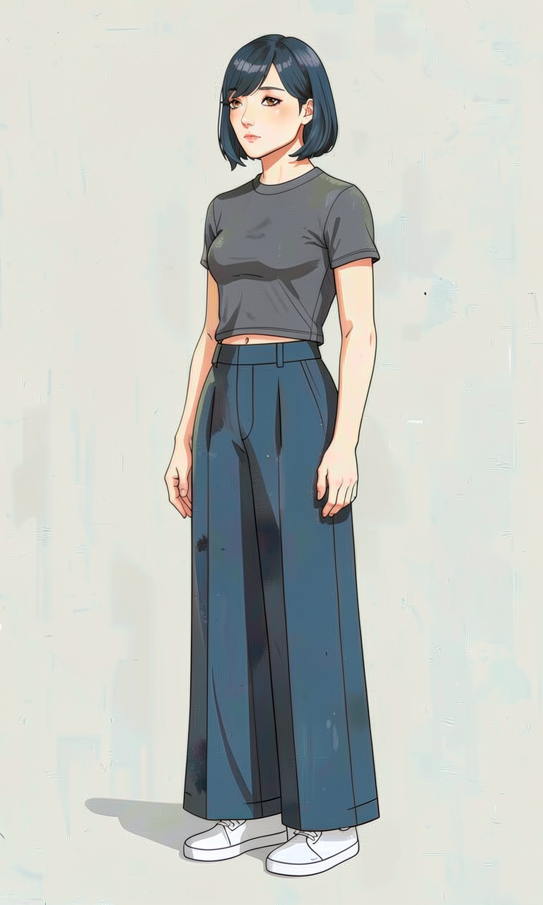
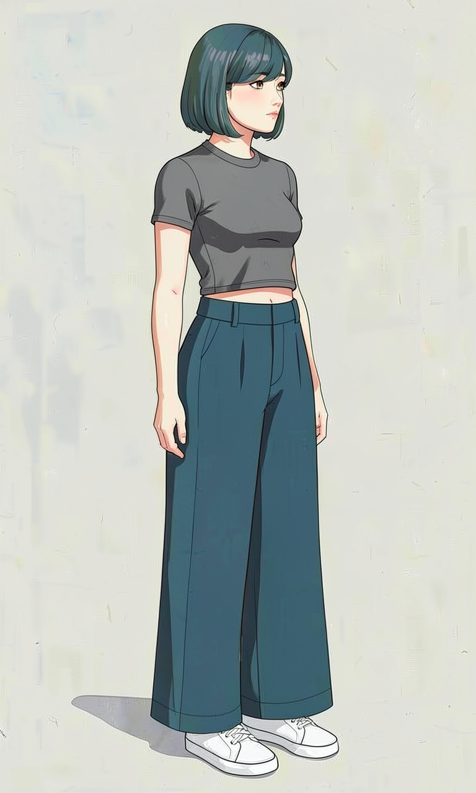
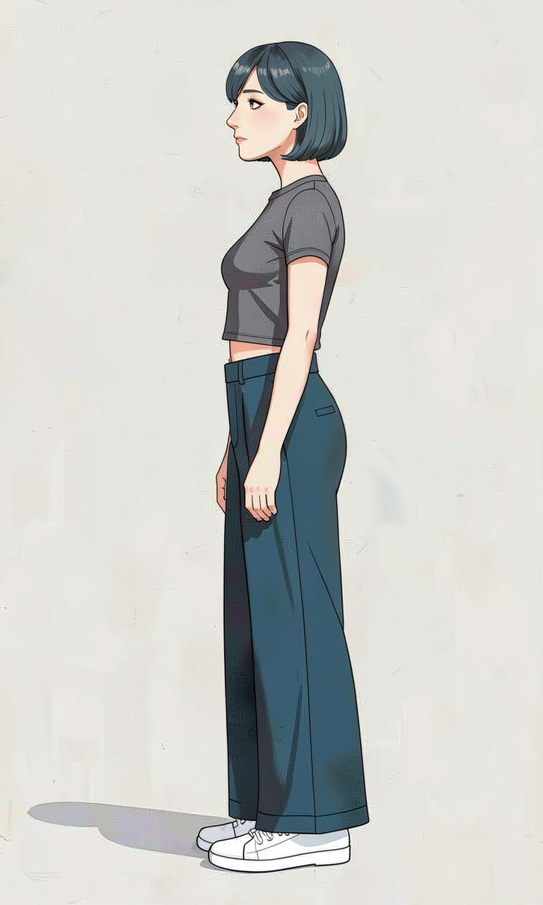
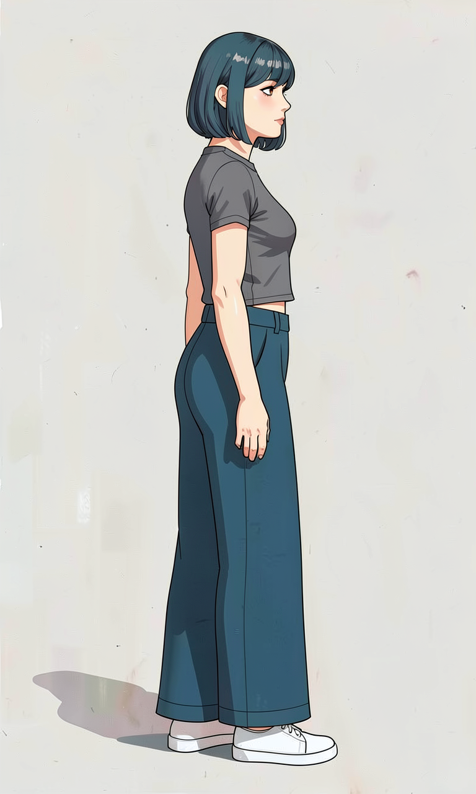
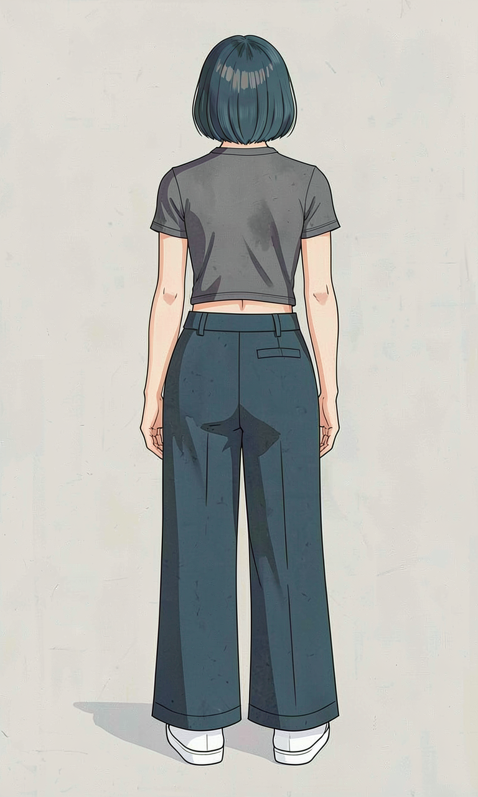

# P7-5.2 캐릭터 참조 셋 생성: 로컬 GPU 원본과 승인 범위 정하기

> Section ID: `P7-5.2`
> Version: `v2026.08.06`

웹툰 컷 생성에서는 pose보다 먼저 캐릭터 기준을 고정해야 합니다. 이 절은 **로컬 GPU에서 새로 만든 원본만**으로 캐릭터 참조 셋을 만드는 단계입니다. 외부 생성 서비스의 이미지, 그 이미지를 학습하거나 직접 참조로 사용한 출력, 그에 따른 LoRA 평가는 이 절의 근거로 사용하지 않습니다.

이 절의 산출물은 완성 컷이나 학습된 모델이 아닙니다. 다음 단계가 사용할 수 있는지 사람 검수한 전신 기준, view별 원본, 생성 기록, 그리고 아직 사용할 수 없는 범위를 적은 manifest입니다. 장면 속 pose, projection, 배경을 바꾸는 전체 컷 생성은 `P7-5.3`의 책임이고, 통과 컷의 얼굴·손·소품·연속성 보정은 `P7-5.4`에서 별도로 검증합니다.

## 기준 이미지 생성 소스는 네 개다

P7-5.2에서 유지하는 기준 이미지 생성 소스는 아래 네 개입니다. 정면·방향 얼굴, 소품, 방향 전신은 서로 다른 승인 범위를 가지므로 한 파일로 합치지 않습니다. 표정과 정면 전신은 현재 파이프라인에서 새로 생성하지 않습니다.

| 생성 범위 | 소스 | 범위 옵션 |
| --- | --- | --- |
| 정면 얼굴 | `p7_5_2_generate_face_front_reference.py` | 없음 |
| 방향 얼굴 | `p7_5_2_generate_face_turnaround_sheet.py` | `--views` |
| 소품 기준 | `p7_5_2_generate_no_style_prop_masters.py` | `--targets` |
| 방향 전신 | `p7_5_2_generate_fullbody_direction_references.py` | `--views` |

이 목록 밖의 옛 얼굴·신체 detail 실험 소스와 실행 순서 구성기는 유지하지 않습니다. 승인된 정면 전신 PNG는 방향 전신 실험의 입력 자산으로만 남기며, 새 정면 전신을 생성하는 소스는 유지하지 않습니다. 기준 이미지는 네 생성기의 후보를 사람 검수해 편입하며, 검수 JSON은 생성기 수를 늘리지 않는 기록입니다.

네 생성기의 실행 JSON은 각 결과의 원문 prompt와 `prompt_word_count`를 함께 기록합니다. 이 수치는 품질을 판정하는 점수가 아니라, 방향·소품·전신 계약이 반복 설명으로 비대해졌는지 검토하는 보조 지표입니다.

## 먼저 통과해야 하는 두 가지 gate

P7-5.2의 입력은 하나의 예쁜 인물 그림이 아닙니다. 배경 화풍과 인물 기준이 각각 어느 범위까지 승인됐는지를 먼저 구분해야 합니다.

| gate | 필요한 근거 | 현재 처리 원칙 |
| --- | --- | --- |
| P7-5.1 화풍 | 사람 승인된 로컬 GPU 배경 원본, 검수 ledger, 최종 manifest | 최종 manifest 전에는 P7-5.2의 review-only 실험으로만 원본 하나를 style input으로 사용 |
| P7-5.2 인물 | 로컬 GPU 정면·방향 얼굴, 소품 기준, 새 실행 기록, 사람 검수 manifest | 정면·방향 얼굴과 소품을 유지하고 표정·전신 기준은 새로 생성·검수 |
| P7-5.3 컷신 | pose·camera·장소·소품이 함께 통과한 전체 컷 | 이 절의 단일 기준만으로 통과 처리하지 않음 |

화풍을 직접 조건으로 넣은 캐릭터 팩은 이후 기준 생성에 사용하지 않습니다. 이 절에 남아 있는 P7-5.1 화풍 조건 실험은 선·채색 전이의 실패 가능성을 기록한 이력이며, P7-5.2 기준이나 P7-5.3 입력 범위를 넓히지 않습니다.

## 캐릭터 패키지 구성요소

캐릭터 패키지는 한 장의 시트나 단일 정면 이미지가 아닙니다. 기존 구성요소 목록은 유지하되, 각 항목이 **로컬 GPU 원본**과 실행 기록으로 채워졌는지를 따로 확인합니다.

| 자산군 | 목표 구성 | 역할 | 현재 상태 |
| --- | --- | --- | --- |
| 기준·표정·전신 이미지 | 단일 PNG의 전신·정면·좌우 3/4·측면·후면과 필요한 표정·손 detail | 얼굴·의상·전신·손·소품의 기준 | 정면·방향 얼굴, 신발·자켓·회색 크롭탑·바지·가방, 정면과 좌우 쿼터·좌우 측면·후면 전신 유지; 표정은 새로 생성·검수 |
| train scene | 장소·동작·camera가 다른 단일 장면 PNG | 캐릭터와 장면 렌더링 학습 | local-only 장면 팩을 별도로 만들기 전에는 비어 있음 |
| held-out scene | train과 source ID·장소·camera가 겹치지 않는 단일 장면 PNG | 학습 뒤 일반화 평가 | local-only 장면 팩을 별도로 만들기 전에는 비어 있음 |
| 실행·검수 기록 | 원본별 prompt·seed·모델·해상도·사람 판정 | 재현성과 다음 단계 입력 범위 | 승인된 4방향 baseline의 실행·검수 기록을 보관 |

이 pipeline은 여러 이미지를 타일 시트로 합쳐 모델에 넣지 않습니다. 참조 입력에는 manifest가 가리키는 개별 PNG 하나만 사용합니다. train과 held-out은 단지 파일 수를 맞추는 폴더가 아니라, source ID·장소·camera를 분리해 캐릭터를 외운 결과와 새 장면에 적용한 결과를 구분하는 장치입니다.

## 첫 기준은 정면 얼굴이다

생성 체인은 정면 얼굴 기준에서 시작합니다. 머리핀을 포함한 이전 기준은 폐기하고, 얼굴형·홍채·머리·표정을 prompt로 정의한 머리 전체·얼굴·턱 출력만 새로 생성·사람 검수했습니다. 넓고 낮은 광대, 볼살, 고양이 눈매의 위로 향한 눈꼬리는 이 첫 기준에서만 고정하며, 몸·의상·회전 view·표정은 아직 승인하지 않습니다.


[정면 얼굴 승인 기록](../../../assets/part-07/chapter-05/p7-5-2-face-front-reference-review.json)은 prompt, seed, 출력 크기와 얼굴 회전 identity에 한정한 승인 범위를 남깁니다.

<details id="face-front-no-accessory" class="aibook-lazy-source" data-source="/AiBook/assets/part-07/chapter-05/p7_5_2_generate_face_front_reference.py" data-language="python">
<summary>첫 기준인 정면 얼굴 후보를 만드는 코드 보기</summary>
<div class="aibook-lazy-source__body">펼치면 Python 원문을 불러옵니다.</div>
</details>

## 네 생성기의 연결

캐릭터 패키지는 같은 인물을 여러 장으로 다시 그린 결과를 무작정 모으지 않습니다. 아래 네 생성기는 먼저 고정한 정면 얼굴을 출발점으로, 작은 범위에서 큰 범위로 정보를 넘깁니다. 각 단계의 후보는 다음 단계의 입력이 될 수 있지만, 사람 승인 전에는 기준 체인에 편입하지 않습니다.

| 순서 | 생성기 | 입력에서 고정하는 정보 | 최종 PNG에서 검수할 정보 |
| --- | --- | --- | --- |
| 1 | 정면 얼굴 | 얼굴형, 머리, 피부, 홍채·동공의 기본 계약 | 정면 얼굴 identity |
| 2 | 방향 얼굴 | 정면 얼굴 계약과 view별 방향 | 눈·코·입·머리 윤곽이 회전 뒤에도 같은 인물인지 |
| 3 | 소품 기준 | 회색 크롭탑, 바지, 신발과 확장 소품의 개별 물성·색·형태 계약, 크롭탑-허리선 관계 | 소품 하나가 독립적으로 읽히고 착장 경계가 확인되는지 |
| 4 | 방향 전신 | 방향 얼굴, 승인된 정면 전신 PNG, 개별 소품 | 몸 방향·비례와 복장·스트랩 같은 특징 장치의 연속성 |

4번은 방향마다 다른 내부 단계를 가집니다. 후면은 승인된 정면 전신 PNG와 후면 얼굴을 한 번만 참조하는 직접 회전이고, 좌우 측면은 방향 결정 뒤 복장만 보강하며, 좌우 쿼터는 방향 결정·깊이 보강·복장 보강을 순서대로 실행합니다. 첫 단계 뒤에는 정면 전신을 다시 참조하지 않아 정면 실루엣으로 되돌아가는 현상을 줄입니다. 이 순서는 모델이 3D 회전을 계산했다는 뜻이 아니라, 방향별로 무엇을 고정·보강할지 사람이 대조할 수 있게 하는 생성·검수 순서입니다.

## 전신 기준: 승인된 여섯 방향 기준

새 정면 전신은 정면 얼굴을 identity와 화풍 기준으로, 일반 핏 회색 마이크로 크롭탑의 밑단-허리선 관계·바지·신발을 복장 기준으로 사용해 생성한 뒤 사람 승인했습니다. 방향 전신은 정면 전신과 방향 얼굴을 첫 단계의 입력으로 사용하고, 좌우 쿼터·좌우 측면은 방향별 다중참조 보강을 거쳐 사람 승인했습니다. 후면은 기존 직접 회전 패턴을 유지했습니다. 165cm·55kg·7.5등신 조건은 prompt 계약이며, 이 기준은 여섯 방향 전신의 비례·기본 복장·신발 형태까지만 승인합니다. [정면 전신 실행·승인 기록](../../../assets/part-07/chapter-05/p7-5-2-fullbody-front-reference-review.json)과 [방향 전신 실행·승인 기록](../../../assets/part-07/chapter-05/p7-5-2-fullbody-direction-v13-review.json)은 입력·seed·prompt와 사람 판정을 남깁니다. 표정·동작·camera 변화·컷신은 별도 생성·검수가 필요하므로 이 범위로 확대 해석하지 않습니다.

| 정면 | 좌측 전면 쿼터 | 우측 전면 쿼터 |
| --- | --- | --- |
|  |  |  |

| 좌측 측면 | 우측 측면 | 후면 |
| --- | --- | --- |
|  |  |  |

방향 전신은 하나의 공통 단계를 강제하지 않습니다. 후면은 직접 회전 한 번으로 끝내고, 좌우 측면은 **방향 결정 → 복장 보강**, 좌우 쿼터는 **방향 결정 → 깊이 보강 → 복장 보강**을 실행합니다. 복장 보강에서는 정면 전신 대신 직전 결과·방향 얼굴·크롭탑·바지·신발 기준을 참조합니다. 최종 PNG에서 신발의 짝과 형태, 팔 가림, 얼굴·몸·발 방향의 일치를 사람 검수로 확인합니다.

<details id="fullbody-direction-references" class="aibook-lazy-source" data-source="/AiBook/assets/part-07/chapter-05/p7_5_2_generate_fullbody_direction_references.py" data-language="python">
<summary>전면 전신과 방향 얼굴 기준으로 방향별 전신 후보를 만드는 코드 보기</summary>
<div class="aibook-lazy-source__body">펼치면 Python 원문을 불러옵니다.</div>
</details>

## 전신 턴어라운드 시트는 한 번에 승인하지 않는다

승인된 얼굴 턴어라운드, 정면 전신, 크롭탑·바지·신발 기준을 한 번에 넣어 4패널 전신 시트를 생성하는 실험도 실행했습니다. 로컬 8GB GPU에서 `1024 x 1536` 출력은 약 158초에 끝났지만, 정면·쿼터뷰 패널이 무릎 아래에서 잘리고 쿼터뷰도 정면에 가깝게 남았습니다. 복장 연속성이 일부 패널에서 보이더라도, 한 호출이 시트 배치와 전신 프레이밍을 동시에 충족하지 못했으므로 기준 자산으로 승인하지 않았습니다.

[전신 턴어라운드 시트 거절 리포트](../../../assets/part-07/chapter-05/p7-5-2-fullbody-turnaround-sheet-experiment-review.json)는 입력 자산, seed, prompt, 실행 시간과 실패 조건을 남깁니다. 미승인 후보 PNG는 보관하지 않습니다. 다음 실험은 방향별 전신을 개별 생성한 뒤, 생성 모델이 아닌 조합 단계에서 검수 시트로 배열해야 합니다.

<details id="fullbody-turnaround-sheet-experiment" class="aibook-lazy-source" data-source="/AiBook/assets/part-07/chapter-05/p7_5_2_generate_fullbody_turnaround_sheet.py" data-language="python">
<summary>얼굴 턴어라운드와 소품으로 전신 시트를 시험하는 코드 보기</summary>
<div class="aibook-lazy-source__body">펼치면 Python 원문을 불러옵니다.</div>
</details>

## 정면 얼굴에서 방향·표정 기준을 확장한다

정면 얼굴을 앵커로 만든 4패널 턴어라운드 시트를 사람 승인했습니다. 시트는 정면·쿼터뷰·측면·후면의 순서로, 눈에 보이는 홍채의 지름과 동공-홍채 비율, 시선과 코의 방향, 콧대·코끝, 단발의 가르마·앞머리·컬·외곽 실루엣을 함께 대조합니다. 기준 시드는 `62377`이며, 이 승인은 얼굴 회전 identity 범위만 뜻합니다. pose·camera·표정·전신은 별도 생성과 검수가 필요합니다.


[얼굴 턴어라운드 승인 기록](../../../assets/part-07/chapter-05/p7-5-2-face-turnaround-reference-review.json)은 실행 prompt, seed, 패널 순서, 승인 범위를 남깁니다. 이 시트는 사람 검수용 대조물이며, 후속 생성의 개별 이미지 입력에는 패널을 분리한 PNG를 사용합니다.

| 기준 | 현재 상태 | 다음 판정 |
| --- | --- | --- |
| 얼굴 방향 | 정면·쿼터뷰·측면·후면 4패널 시트 승인 | 새 pose·camera 범위는 별도 사람 검수 |
| 얼굴 구성 | 홍채·동공 비율, 시선-코 정렬, 코와 머리 실루엣의 회전 일치 | 개별 패널을 입력으로 쓸 때 같은 특징이 유지되는지 대조 |
| 표정 | 승인 표정 없음 | 중립·기쁨·우려·분노·슬픔·놀람을 새로 생성·검수 |

<details id="face-direction-references" class="aibook-lazy-source" data-source="/AiBook/assets/part-07/chapter-05/p7_5_2_generate_face_turnaround_sheet.py" data-language="python">
<summary>정면 얼굴 기준으로 4패널 턴어라운드 후보를 만드는 코드 보기</summary>
<div class="aibook-lazy-source__body">펼치면 Python 원문을 불러옵니다.</div>
</details>

방향 얼굴은 `--views front front_quarter profile rear`로 정면·쿼터뷰·측면·후면을 한 장의 검수 시트에 생성합니다. `--seed-offset`, `--seed-count`, `--seed-step`으로 서로 다른 시드를 한 번의 파이프라인 적재에서 연속 생성하고, 각 PNG와 JSON에는 실행 타임스탬프와 시드가 자동으로 붙습니다. 일부 view만 검토할 때는 `--views profile rear`처럼 범위를 좁힙니다.

## 소품 기준 검수 결과: 기본 복장과 확장 소품

소품 기준은 전신 reference에서 작게 보이는 부분을 다시 확인하는 계약입니다. 현재 화풍 입력 없이 사람 승인한 다섯 항목은 흰 끈 운동화, 흰색 크롭 유틸리티 자켓, 청색 우세의 딥틸블루 와이드 팬츠, 짙은 네이비 캔버스 크로스백, 일반 핏 회색 마이크로 크롭탑-허리선 관계입니다. 얼굴 생성에는 이 소품 팩과 분리한 회색 목선 기준만 사용합니다. 머리핀은 캐릭터 기준에서 폐기했습니다. 갈색 홍채·동공은 정면 얼굴 기준을 새로 생성할 때 함께 검수합니다.

정면 전신 후보의 기본 복장은 크롭탑-허리선 관계 기준·바지·신발을 참조합니다. 기존 단일 회색 크롭탑은 얼굴 기준의 목선 확인에 유지합니다. 자켓과 가방은 후속 방향 전신이나 컷신에서 별도 계약이 필요할 때만 선택하는 확장 소품입니다.

| 크롭탑-허리선 관계 기준 | 바지 기준 | 신발 기준 |
| --- | --- | --- |
|  |  |  |

| 자켓 기준 | 가방 기준 |
| --- | --- |
|  |  |

[소품 기준 v2 manifest](../../../assets/part-07/chapter-05/p7-5-2-prop-reference-v2.json), [기존 소품 검수 기록](../../../assets/part-07/chapter-05/p7-5-2-no-style-prop-master-review.json), [크롭탑-허리선 착장 관계 검수 기록](../../../assets/part-07/chapter-05/p7-5-2-outfit-crop-top-waist-reference-review.json)은 다섯 소품의 승인 범위를 기록합니다. 얼굴 목선 검수 기록은 얼굴 기준과 함께 관리합니다. 손·손목 후보는 아직 기준 자산이 아닙니다.

소품 기준 v2는 개별 소품 PNG 네 장과 착장 관계 PNG 한 장입니다. 시트 이미지로 합치지 않으며, 컷에서 필요한 신발·자켓·바지·가방과 크롭 밑단-허리선 관계만 선택해 비교합니다. 이전 화풍 조건 소품과 `prop-master-v1`은 폐기했으며 이후 기준 생성에는 사용하지 않습니다.

<details id="no-style-prop-references" class="aibook-lazy-source" data-source="/AiBook/assets/part-07/chapter-05/p7_5_2_generate_no_style_prop_masters.py" data-language="python">
<summary>선택한 소품 기준 후보를 만드는 통합 코드 보기</summary>
<div class="aibook-lazy-source__body">펼치면 Python 원문을 불러옵니다.</div>
</details>

통합 스크립트는 `--targets` 범위로 `jacket`, `trousers`, `shoes`, `crossbody_bag`, `crop_top_waist_relation` 중 필요한 항목만 생성합니다. 범위를 생략하면 다섯 항목을 모두 생성하고, 각 항목은 호출 순서와 무관한 고정 seed를 사용합니다. `crop_top_waist_relation` 후보는 전신 생성에 필요한 크롭 밑단-허리선 관계를 검수합니다.

```bash
PYTORCH_CUDA_ALLOC_CONF=expandable_segments:True \
  .venv/bin/python docs/assets/part-07/chapter-05/p7_5_2_generate_no_style_prop_masters.py \
  --targets jacket trousers
```


## 네 생성기 실행과 승인을 분리한다

아래 실행 코드는 방향별 다중참조 횟수를 다르게 적용합니다. 후면은 직접 회전 한 번, 좌우 측면은 방향 결정과 복장 보강 두 번, 좌우 쿼터는 방향 결정·깊이 보강·복장 보강 세 번을 한 호출 안에서 연속 실행합니다. 후속 단계는 직전 결과를 첫 입력으로 두고 정면 전신을 다시 참조하지 않습니다. 후보 PNG가 생성됐다는 사실은 새 pose·camera·컷신 입력 승인이 아닙니다. 코드를 실행하기 전에는 FLUX.2 가중치, CUDA 환경, 충분한 CPU RAM과 disk cache가 필요합니다.

| 생성기 | 하는 일 | 조작할 값 |
| --- | --- | --- |
| 정면 얼굴 | prompt만으로 얼굴 identity 후보 생성 | 얼굴 prompt, `SEED` |
| 방향 얼굴 | 정면 얼굴 기준에서 여러 방향 얼굴 후보 생성 | `--views`, 방향 전용 prompt |
| 소품 기준 | 지정한 소품 후보 생성 | `--targets` |
| 방향 전신 | 방향별로 1·2·3단계 다중참조를 실행해 방향·깊이·복장을 순서대로 보강 | `--views`, 방향별 stage·전용 prompt |

```bash
PYTORCH_CUDA_ALLOC_CONF=expandable_segments:True \
  .venv/bin/python docs/assets/part-07/chapter-05/p7_5_2_generate_fullbody_direction_references.py \
  --views profile_right rear
```

중간 PNG는 실행 기록을 위한 후보이며, 사람 검수는 방향별 마지막 단계에만 적용합니다. 이 실습에서 `SEED`나 방향 계약을 바꾼 뒤에는 코드를 통과한 것으로 승인하지 않습니다. 얼굴·몸·무릎·발끝의 방향이 같은지, 측면에서 먼쪽 팔이 몸통 뒤에 가려지는지, 두 다리와 두 발이 하나의 전신으로 보이는지를 사람 검수로 다시 확인합니다.

## manifest는 사용 범위를 좁히는 계약이다

정면과 좌우 쿼터·좌우 측면·후면 전신은 사람 검수를 통과해 실행·승인 기록에 등록했습니다. 동작, camera yaw, 컷신용 캐릭터 참조 팩은 여전히 비어 있으며 별도 검수가 필요합니다.

화풍을 직접 조건으로 받은 캐릭터 팩은 실험 이력으로만 보관합니다. 이후 캐릭터 기준은 얼굴·소품·비례 기준만으로 만들며, 화풍 적용은 컷 생성 또는 보정 단계에서 별도로 검증합니다. 캐릭터 색은 중립 studio 조명에서 정하고, 장면의 야간·노을·비 반사광이 피부나 머리카락 기본색을 다시 정하지 않도록 다음 단계에서 검증합니다.

## 캐릭터셋 체크리스트

이 체크리스트는 참조 셋의 구조 점검 항목을 유지합니다. 모든 원본은 로컬 GPU 실행 기록을 가져야 하며, 현재 승인된 범위는 정면·방향 얼굴, 기본 소품, 정면과 다섯 방향 전신입니다. 19장 기준·16장 train·4장 held-out 구조는 동작과 장면을 포함한 별도 local-only 팩을 만든 뒤에만 다시 판정합니다.

| 확인할 것 | 스스로 답할 질문 |
| --- | --- |
| 등록 | 전신 기준, train, held-out으로 등록하는 모든 단일 PNG가 local GPU 실행 기록과 manifest에 있는가? |
| 분리 | held-out 원본이 train source ID·장소·camera와 겹치지 않는가? |
| 비례 | 중립 정면 계열은 4%, 동작은 15% 기준을 적용하고, 측면·후면은 사람 검수로 구분했는가? |
| 비교 | 같은 scene·camera·seed에서 학습 또는 reference 조건 하나만 바꿔 비교했는가? |
| 품질 | 얼굴, 머리, 의상, 신발, 화풍을 각각 판정했고 기본색이 장면 광원 때문에 바뀌지 않았는가? |
| 전체 컷 | reference·pose·camera를 한 화면에서 통과시킨 뒤에만 bag/strap 국소 보정을 검토하는가? |
| 생성 출처 | 기준과 view 원본 모두 외부 생성 서비스가 아니라 로컬 GPU로 생성됐는가? |
| 좌우 view | mirror를 쓴 view가 무소품·대칭 계약 안에만 있는가? |
| 다음 단계 | P7-5.1과 P7-5.2의 manifest가 각각 허용한 개별 원본만 다음 단계에 넘기는가? |

## 출처와 참고 자료

- Black Forest Labs, [FLUX.2 Klein 4B model card](https://huggingface.co/black-forest-labs/FLUX.2-klein-4B){: target="_blank" rel="noopener noreferrer" }, 확인일: 2026-08-03.
- Hugging Face, [Diffusers FLUX.2 Klein pipeline](https://huggingface.co/docs/diffusers/main/en/api/pipelines/flux2_klein){: target="_blank" rel="noopener noreferrer" }, 확인일: 2026-08-03.
