# P7-5.2 캐릭터 참조 셋 생성: 로컬 GPU 원본과 승인 범위 정하기

> Section ID: `P7-5.2`
> Version: `v2026.08.04`

웹툰 컷 생성에서는 pose보다 먼저 캐릭터 기준을 고정해야 합니다. 이 절은 **로컬 GPU에서 새로 만든 원본만**으로 캐릭터 참조 셋을 만드는 단계입니다. 외부 생성 서비스의 이미지, 그 이미지를 학습하거나 직접 참조로 사용한 출력, 그에 따른 LoRA 평가는 이 절의 근거로 사용하지 않습니다.

이 절의 산출물은 완성 컷이나 학습된 모델이 아닙니다. 다음 단계가 사용할 수 있는지 사람 검수한 전신 master, view별 원본, 생성 기록, 그리고 아직 사용할 수 없는 범위를 적은 manifest입니다. 장면 속 pose, projection, 배경을 바꾸는 전체 컷 생성은 `P7-5.3`의 책임이고, 통과 컷의 얼굴·손·소품·연속성 보정은 `P7-5.4`에서 별도로 검증합니다.

## 먼저 통과해야 하는 두 가지 gate

P7-5.2의 입력은 하나의 예쁜 인물 그림이 아닙니다. 배경 화풍과 인물 기준이 각각 어느 범위까지 승인됐는지를 먼저 구분해야 합니다.

| gate | 필요한 근거 | 현재 처리 원칙 |
| --- | --- | --- |
| P7-5.1 화풍 | 사람 승인된 로컬 GPU 배경 원본, 검수 ledger, 최종 manifest | 최종 manifest 전에는 P7-5.2의 review-only 실험으로만 원본 하나를 style input으로 사용 |
| P7-5.2 인물 | 로컬 GPU 전신 master, view별 원본, 실행 기록, 사람 검수 manifest | 승인된 정면·좌측 측면·후면·우측 측면 baseline과 좌우 전면 쿼터 전신만 참조로 사용 |
| P7-5.3 컷신 | pose·camera·장소·소품이 함께 통과한 전체 컷 | 이 절의 단일 master만으로 통과 처리하지 않음 |

따라서 `P7-5.1`의 manifest가 비어 있으면, 그 화풍을 직접 조건으로 넣은 캐릭터 팩을 다음 단계 입력으로 승인할 수 없습니다. 다만 사람 승인된 개별 P7-5.1 원본 하나로 **P7-5.2 review-only master**를 만드는 실험은 가능합니다. 이 실험은 화풍이 인물의 선·채색으로 옮겨가는지 확인하는 용도이며, P7-5.1 manifest나 P7-5.3 입력 범위를 넓히지 않습니다.

## 캐릭터 패키지 구성요소

캐릭터 패키지는 한 장의 시트나 단일 정면 이미지가 아닙니다. 기존 구성요소 목록은 유지하되, 각 항목이 **로컬 GPU 원본**과 실행 기록으로 채워졌는지를 따로 확인합니다.

| 자산군 | 목표 구성 | 역할 | 현재 상태 |
| --- | --- | --- | --- |
| 기준·표정·전신 이미지 | 단일 PNG의 전신·정면·좌우 3/4·측면·후면과 필요한 표정·손 detail | 얼굴·의상·전신·손·소품의 기준 | 4방향 baseline과 좌우 전면 쿼터 전신, 홍채·동공·헤어핀 정면·좌측면·우측 3/4 및 헤어핀 없는 후면 머리 detail, 중립·기쁨·분노·놀람, 신발 detail 승인; 우려·슬픔·손·재킷 detail은 미승인 |
| train scene | 장소·동작·camera가 다른 단일 장면 PNG | 캐릭터와 장면 렌더링 학습 | local-only 장면 팩을 별도로 만들기 전에는 비어 있음 |
| held-out scene | train과 source ID·장소·camera가 겹치지 않는 단일 장면 PNG | 학습 뒤 일반화 평가 | local-only 장면 팩을 별도로 만들기 전에는 비어 있음 |
| 실행·검수 기록 | 원본별 prompt·seed·모델·해상도·사람 판정 | 재현성과 다음 단계 입력 범위 | 승인된 4방향 baseline의 실행·검수 기록을 보관 |

이 pipeline은 여러 이미지를 타일 시트로 합쳐 모델에 넣지 않습니다. 참조 입력에는 manifest가 가리키는 개별 PNG 하나만 사용합니다. train과 held-out은 단지 파일 수를 맞추는 폴더가 아니라, source ID·장소·camera를 분리해 캐릭터를 외운 결과와 새 장면에 적용한 결과를 구분하는 장치입니다.

## 참조 관계와 생성 순서

캐릭터 패키지는 같은 인물을 여러 장으로 다시 그린 결과를 무작정 모으지 않습니다. 먼저 정면에서 얼굴·의상 identity를, 후면에서 머리 길이·장식의 가림 여부·재킷 뒷면을 확인한 다음, 측면을 파생합니다. 각 단계의 출력은 다음 단계의 참조가 되지만, 승인되지 않은 후보는 참조 체인에 넣지 않습니다.

| 순서 | 입력 참조와 역할 | 생성·검수 산출물 | 다음 단계에서 고정하는 정보 |
| --- | --- | --- | --- |
| 1. 화풍·전신 master | P7-5.1 승인 화풍 원본: 선·투명 수채화만 전달 | 전신 character master | 기본 색·의상·전신 비례의 출발점 |
| 2. 전신 정면·후면 | 정면은 얼굴·의상 identity, 후면은 뒷머리·재킷 후면을 확인 | 승인된 정면·후면 전신 | 좌·우 측면에서 대조할 앞·뒤 기준 |
| 3. 좌측 전신 측면 | 정면 전신: 얼굴·의상 identity; 후면 전신: 장식 없는 뒷머리·재킷; P7-5.1 원본: 화풍 | 승인된 좌측 전신 측면 | 좌향 실루엣, 무헤어핀, 가르마 없음 |
| 4. 좌측면 얼굴 | 정면 얼굴: 홍채·동공·피부·칼라; 후면 머리: bob 길이·장식 없음; P7-5.1 원본: 화풍 | 승인된 좌측면 얼굴 | 한쪽 눈 좌향 프로필, 무헤어핀, 가르마 없음 |
| 5. 우측면 얼굴 | 우측 전신: 프로필 실루엣·귀·머리카락; 정면 얼굴: 앞머리 쪽 헤어핀; P7-5.1 원본: 화풍 | 승인된 우측면 얼굴 | 한쪽 눈 우향 프로필, 보이는 귀, 앞머리 쪽 단일 헤어핀 |

이 순서는 모델이 3D 회전을 계산했다는 뜻이 아닙니다. 서로 다른 방향에서 대조할 기준을 먼저 고정해, 다음 생성에서 무엇이 바뀌면 안 되는지 사람이 판정할 수 있게 하는 작업 순서입니다.

## P7-5.1 화풍 원본으로 만든 첫 전신 master

화풍 참조 패키지는 사람 비교를 위해 여러 장을 모은 것이고, 현재의 로컬 pipeline은 타일 시트를 입력으로 받지 않습니다. 그래서 이 실험은 P7-5.1에서 사람 승인된 `outdoor-day-wide` 원본 한 장을 선택해, 그 이미지의 선과 투명 수채화 언어만 조건으로 전달했습니다. 인물의 이름·머리·피부·의상·전신 구도는 prompt에서 별도로 고정했습니다.

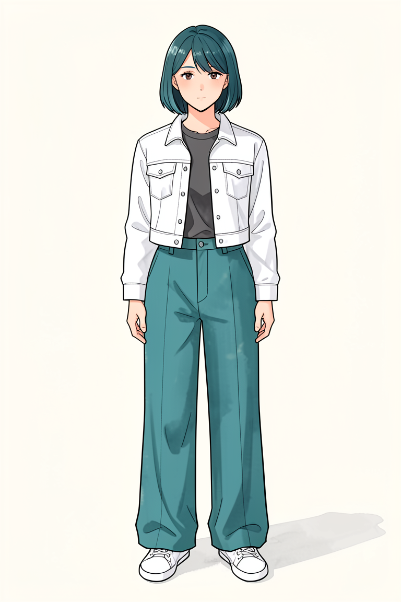

| 확인 항목 | 관찰 결과 | 판정 |
| --- | --- | --- |
| 전신과 무소품 | 머리부터 신발까지 한 인물로 보이며 가방·소품·프레임이 없음 | 승인 |
| identity 계약 | teal bob, warm light-peach skin, 흰 재킷·charcoal 상의·teal 바지·흰 신발이 유지됨 | 승인 |
| 선과 채색 | 가는 charcoal 윤곽선과 제한된 색은 유지됐지만, 수채화 색번짐은 약하고 평면 웹툰 채색에 가까움 | baseline 승인, 화풍 보강은 후속 과제 |
| 다음 범위 | 정면 master를 포함한 네 방향 전신 확인을 마침 | 3/4 turnaround, pose, cutscene에는 사용 금지 |

실행은 `FLUX.2-klein-4B`, `768 x 1152`, 8 step, guidance `1.0`, seed `420751`로 29.1초가 걸렸고 GPU peak은 약 2.1 GiB였습니다. 이 수치는 실행 환경의 관찰 기록이지 다른 GPU에서의 성능 보장이 아닙니다.

<details id="style-pack-character-master" class="aibook-lazy-source" data-source="/AiBook/assets/part-07/chapter-05/p7_5_2_generate_style_pack_character_master.py" data-language="python">
<summary>P7-5.1 화풍 원본 기반 전신 master 생성 코드 보기</summary>
<div class="aibook-lazy-source__body">펼치면 Python 원문을 불러옵니다.</div>
</details>

## 승인된 4방향 전신 baseline

캐릭터 master와 전신 view는 사람 검수를 거쳐 정면, 좌측 측면, 후면, 우측 측면의 네 방향으로 승인되었습니다. 이 네 장은 캐릭터의 기본 비례와 의상·머리·신발의 연속성을 대조하는 기준입니다. 아래의 좌우 전면 쿼터 전신은 이 baseline에서 별도 사람 검수를 통과한 view-specific 보강 기준입니다. 이 승인도 동작, 임의 카메라 각도, P7-5.3의 컷 생성 입력 전체를 보장하지는 않습니다.

| 정면 | 좌측 측면 |
| --- | --- |
| 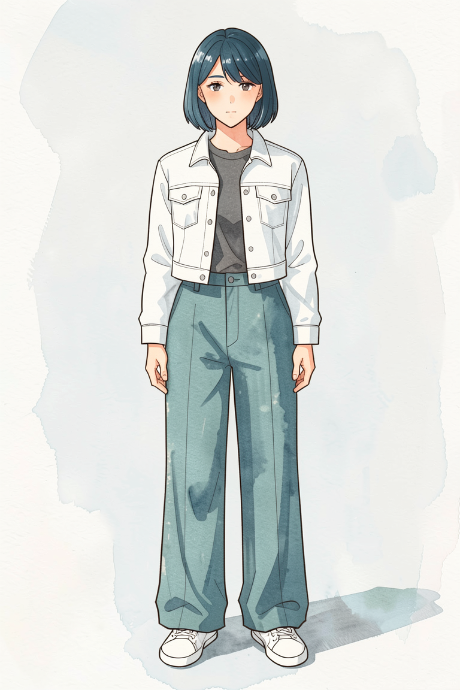 | 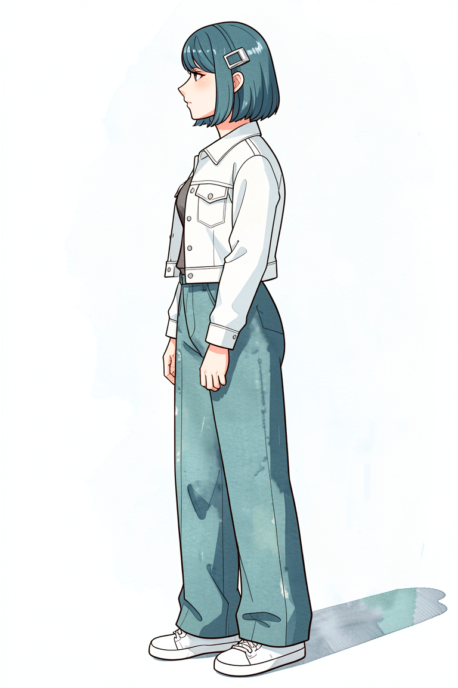 |
| 후면 | 우측 측면 |
| 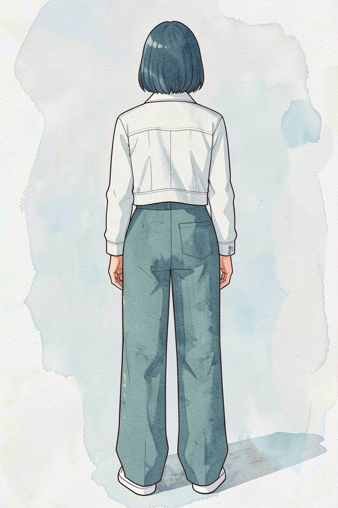 | 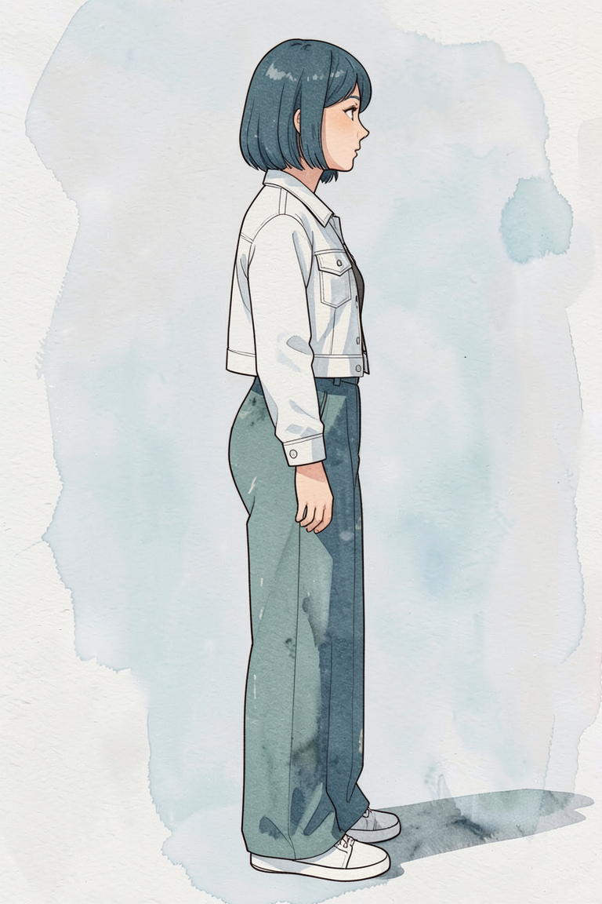 |

| view | 승인 조건 | 사용 범위 |
| --- | --- | --- |
| 정면 | 얼굴과 몸이 정면을 향하고 전신·의상·신발이 보임 | 기본 identity 대조 |
| 좌측 측면 | 얼굴·몸·발끝이 함께 좌측을 향하고 전신이 보임 | 측면 비례와 실루엣 대조 |
| 후면 | 재킷 뒷면·머리 후면·바지·신발 뒤꿈치가 보임 | 후면 의상 정보 대조 |
| 우측 측면 | 얼굴·몸·발끝이 함께 우측을 향하고 전신이 보임 | 반대 측면 비례와 실루엣 대조 |

## 승인된 좌우 전면 쿼터 전신

전면 쿼터 전신은 정면 master를 유일한 identity 기준으로 두고, 사람 검수에서 통과한 방향만 별도 자산으로 고정합니다. 좌측은 좌향 전신 방향을, 우측은 몸을 우향 30도 두고 얼굴은 카메라를 향하게 한 방향을 승인했습니다.

| 좌측 전면 쿼터 | 우측 전면 쿼터 |
| --- | --- |
| 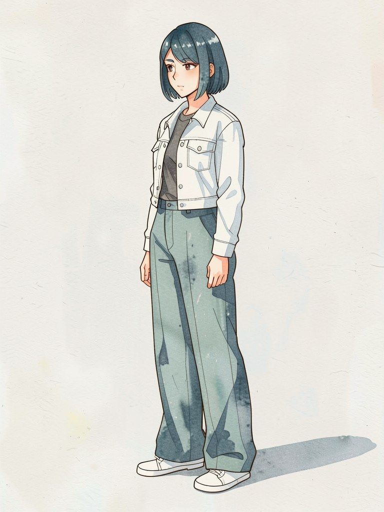 | 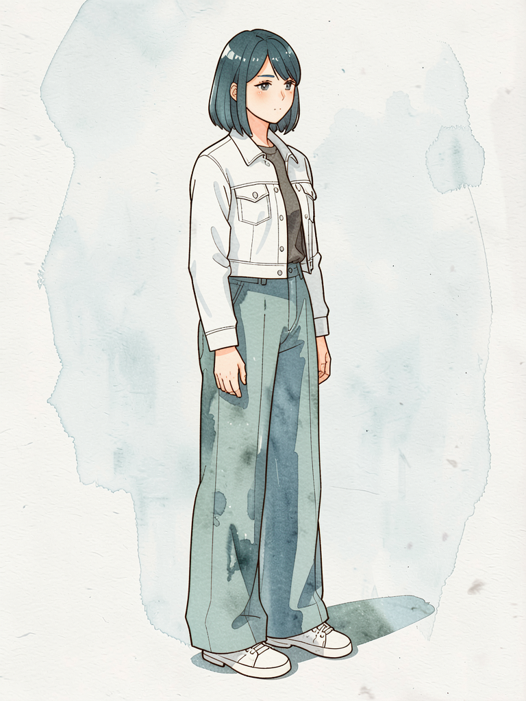 |

좌측 측면은 별도 skeleton, OpenPose, depth, Canny 윤곽을 넣지 않았습니다. 승인된 정면 전신으로 얼굴·의상 identity를, 승인된 후면 전신으로 장식 없는 뒷머리 길이와 재킷 정보를, P7-5.1 화풍 원본으로 채색을 각각 참조로 전달했습니다. strict left profile·중립 서기·전신 노출·무가방·무헤어핀·가르마 없음의 prompt 계약을 함께 고정했습니다. 이 선택은 현재의 구조 제어 입력이 3D 회전 정합을 보장하지 못한 실험 결과에 따른 것입니다. 결과는 사람 검수로만 baseline에 편입했습니다.

<details id="profile-left-front-rear-multiref" class="aibook-lazy-source" data-source="/AiBook/assets/part-07/chapter-05/p7_5_2_regenerate_profile_left_no_clip.py" data-language="python">
<summary>정면·후면 기준으로 좌측 전신을 만드는 코드 보기</summary>
<div class="aibook-lazy-source__body">펼치면 Python 원문을 불러옵니다.</div>
</details>

## 승인된 얼굴 방향과 기본 표정

전신 기준만으로는 눈·코·입·귀·목덜미의 묘사를 대조하기 어렵습니다. 현재 사람 승인된 얼굴·머리 detail은 홍채·동공·헤어핀을 포함한 정면, 헤어핀과 가르마가 없는 좌측면, 앞머리 쪽 헤어핀과 보이는 귀를 포함한 우측면, 우측 전면 3/4, 헤어핀을 보이지 않게 한 후면 머리의 다섯 장입니다. 좌측 전면 3/4은 이 기준에서 다시 생성해 별도 검수합니다. 후보가 생성됐다는 사실은 방향별 기준 편입을 뜻하지 않습니다.

| 정면 얼굴 | 좌측면 얼굴 |
| --- | --- |
| 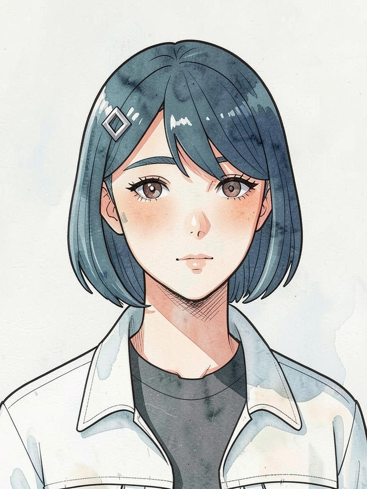 | 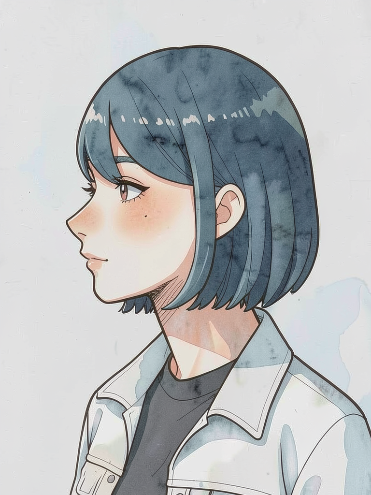 |
| 우측면 얼굴 | 우측 전면 3/4 |
| 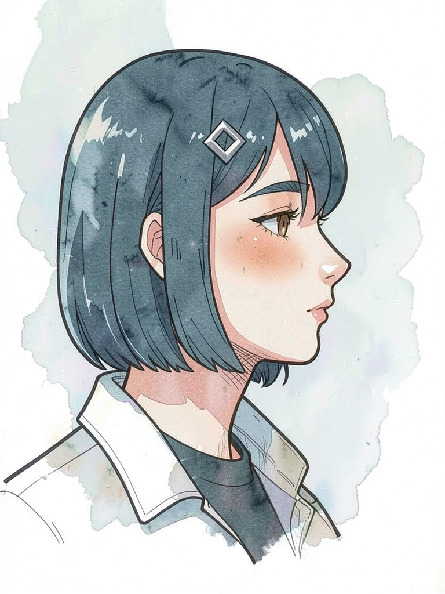 | 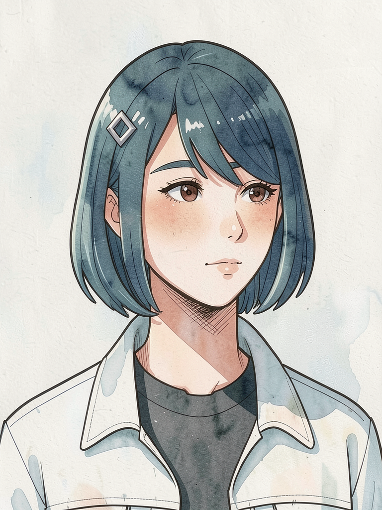 |
| 후면 머리 | |
| 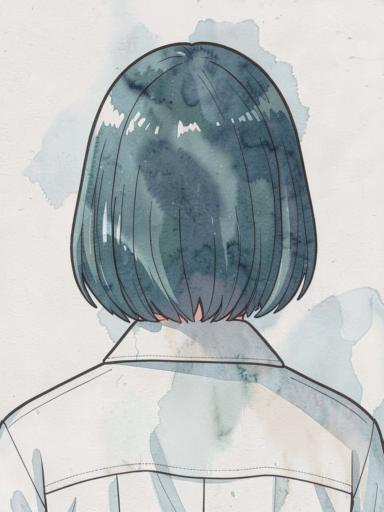 | |

| 기준 | 승인 범위 | 아직 승인하지 않은 범위 |
| --- | --- | --- |
| 얼굴 방향 | 홍채·동공·헤어핀이 고정된 정면, 헤어핀·가르마 없는 좌측면, 앞머리 쪽 헤어핀과 보이는 귀가 있는 우측면, 우측 전면 3/4, 헤어핀 없는 후면 머리 | 좌측 전면 3/4 |
| 얼굴 구성 | 눈·코·입·귀·목과 재킷 칼라의 근접 대조 | 카메라 각도 변화에서의 안정성 |
| 표정 | 정면 중립·기쁨·분노·놀람 표정 네 장 | 우려·슬픔 |

| 중립 | 기쁨 |
| --- | --- |
| 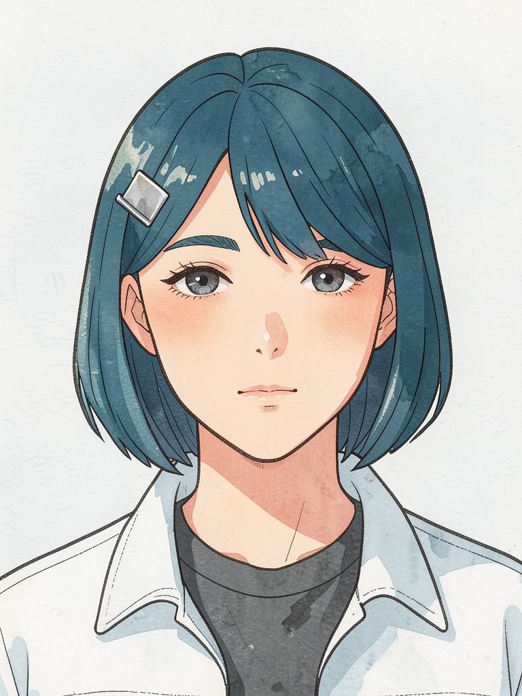 | 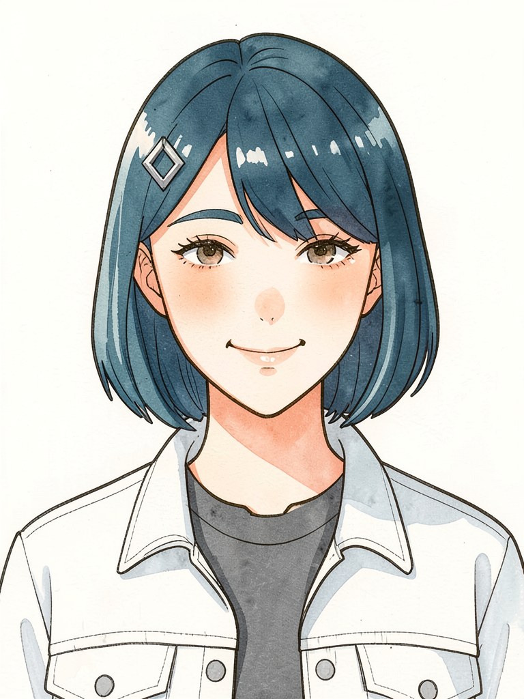 |
| 분노 | 놀람 |
| 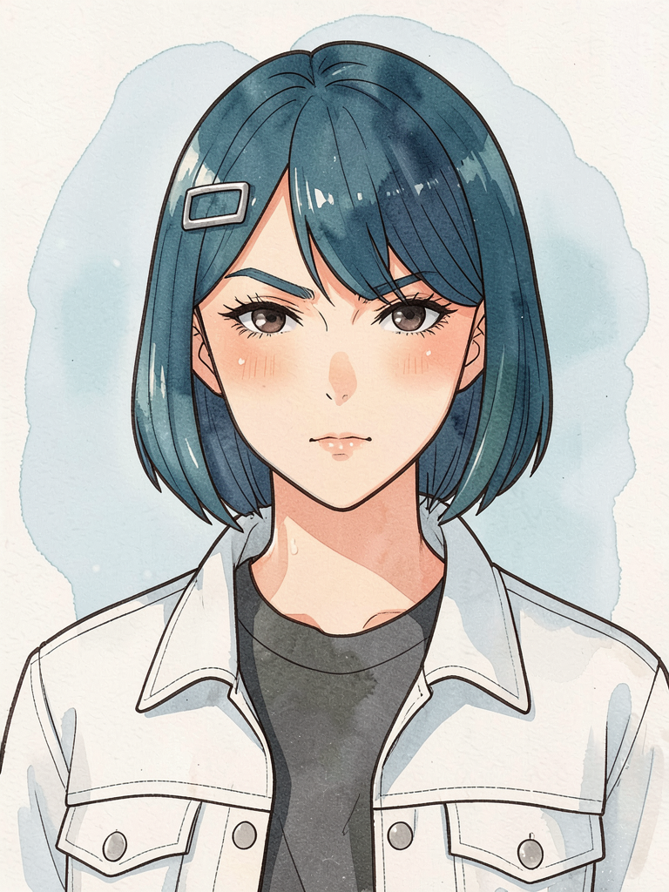 | 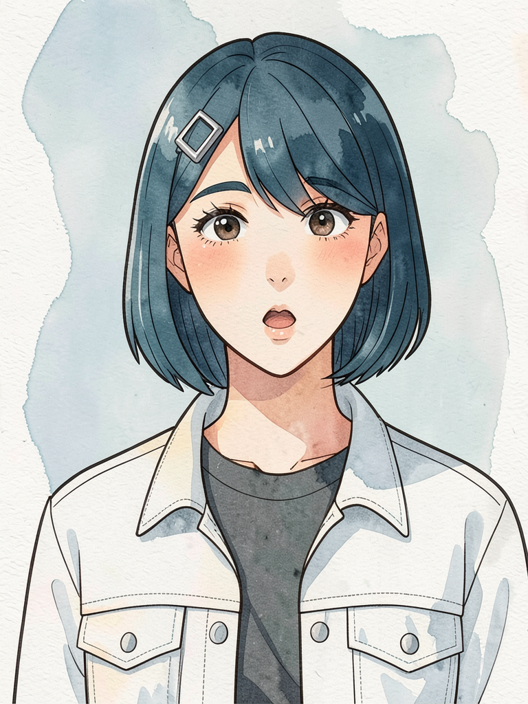 |

[얼굴 detail 검수 기록](../../../assets/part-07/chapter-05/p7-5-2-face-detail-v1-review.json)과 [표정 검수 기록](../../../assets/part-07/chapter-05/p7-5-2-expression-detail-v1-review.json)은 승인 범위를 분리합니다. 표정에서는 배경이나 조명 변화가 아니라 눈썹·눈꺼풀·동공·콧등·콧구멍·입 모양의 차이를 따로 검수해야 합니다.

<details id="face-detail-multiref" class="aibook-lazy-source" data-source="/AiBook/assets/part-07/chapter-05/p7_5_2_face_detail_multiref_flux.py" data-language="python">
<summary>얼굴 방향 detail 생성 코드 보기</summary>
<div class="aibook-lazy-source__body">펼치면 Python 원문을 불러옵니다.</div>
</details>

<details id="profile-left-face-front-rear" class="aibook-lazy-source" data-source="/AiBook/assets/part-07/chapter-05/p7_5_2_regenerate_face_profile_left_no_clip.py" data-language="python">
<summary>정면·후면 기준으로 좌측면 얼굴을 만드는 코드 보기</summary>
<div class="aibook-lazy-source__body">펼치면 Python 원문을 불러옵니다.</div>
</details>

<details id="profile-right-face-profile-front" class="aibook-lazy-source" data-source="/AiBook/assets/part-07/chapter-05/p7_5_2_regenerate_face_profile_right_clip.py" data-language="python">
<summary>우측 전신·정면 기준으로 우측면 얼굴을 만드는 코드 보기</summary>
<div class="aibook-lazy-source__body">펼치면 Python 원문을 불러옵니다.</div>
</details>

<details id="expression-detail-multiref" class="aibook-lazy-source" data-source="/AiBook/assets/part-07/chapter-05/p7_5_2_expression_detail_multiref_flux.py" data-language="python">
<summary>눈·코·입 변화를 지정하는 표정 detail 생성 코드 보기</summary>
<div class="aibook-lazy-source__body">펼치면 Python 원문을 불러옵니다.</div>
</details>

## 승인된 신발 detail

소품·착용 detail은 전신 reference에서 작게 보이는 부분을 다시 확인하는 기준입니다. 현재 별도 승인 자산은 흰 끈 운동화입니다. 다이아형 은색 헤어핀과 갈색 홍채·동공은 위의 정면 얼굴 detail에서 함께 검수합니다. 이 기준은 가방·장신구·손 소품을 새로 추가해도 된다는 뜻이 아닙니다.

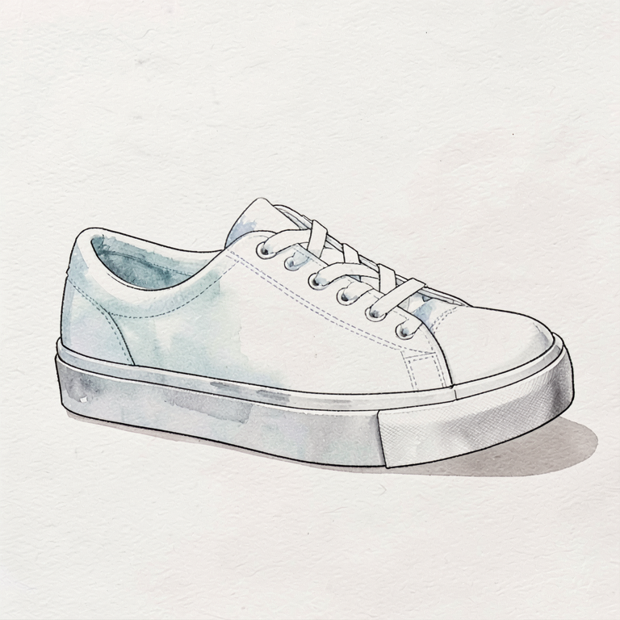

[착용·신체 detail 검수 기록](../../../assets/part-07/chapter-05/p7-5-2-feature-detail-v1-review.json)에는 신발만 별도 승인으로 남깁니다. 손·손목과 재킷 hardware 후보는 아직 기준 자산이 아닙니다.

<details id="feature-detail-multiref" class="aibook-lazy-source" data-source="/AiBook/assets/part-07/chapter-05/p7_5_2_feature_detail_multiref_flux.py" data-language="python">
<summary>착용·신체 detail 생성 코드 보기</summary>
<div class="aibook-lazy-source__body">펼치면 Python 원문을 불러옵니다.</div>
</details>

## Python 실습: 생성과 승인을 분리한다

아래 실행 코드는 사람 승인된 P7-5.1 원본 하나에서 P7-5.2 전신 후보와 실행 기록을 만듭니다. 후보 PNG가 생성됐다는 사실은 turnaround나 다음 단계 입력 승인이 아닙니다. 코드를 실행하기 전에는 FLUX.2 가중치, CUDA 환경, 충분한 CPU RAM과 disk cache가 필요합니다.

```bash
PYTORCH_CUDA_ALLOC_CONF=expandable_segments:True \
  .venv/bin/python docs/assets/part-07/chapter-05/p7_5_2_generate_style_pack_character_master.py
```

| 코드 | 하는 일 | 조작할 값 |
| --- | --- | --- |
| style-pack character master | 승인된 P7-5.1 원본 하나를 조건으로 P7-5.2 전신 후보 생성 | `STYLE_SCENE_ID`, `SEED`, prompt, step |
| Canny 없는 좌측 측면 | 승인 정면 master와 화풍 원본 두 장으로 좌측 전신 후보 생성 | `SEED`, strict profile prompt, 참조 원본 |

```bash
PYTORCH_CUDA_ALLOC_CONF=expandable_segments:True \
  .venv/bin/python docs/assets/part-07/chapter-05/p7_5_2_profile_left_multiref_flux.py
```

이 실습에서 `SEED`나 strict profile 문장을 바꾼 뒤에는 코드를 통과한 것으로 승인하지 않습니다. 얼굴·몸·무릎·발끝의 방향이 같은지, 두 다리와 두 발이 하나의 전신으로 보이는지, 가방·끈 같은 미계약 소품이 없는지를 사람 검수로 다시 확인합니다.

## manifest는 사용 범위를 좁히는 계약이다

[style-conditioned 실행 기록](../../../assets/part-07/chapter-05/p7-5-2-style-pack-character-master-v1.json)과 [4방향 baseline 검수 기록](../../../assets/part-07/chapter-05/p7-5-2-turnaround-review.json)은 source style 원본, prompt, model, seed, 출력과 사람 판정을 함께 기록합니다. 현재 승인 범위는 전신 baseline 네 장입니다. 즉 3/4 turnaround, 동작, camera yaw, 컷신용 캐릭터 참조 팩은 아직 만들지 않았습니다.

P7-5.1 화풍을 직접 조건으로 받는 캐릭터 팩은 별도의 로컬 GPU 실행과 별도 사람 검수가 필요합니다. 위의 master도 P7-5.1 최종 manifest와 P7-5.2 character manifest가 각각 승인되기 전에는 P7-5.3 입력으로 연결하지 않습니다. 캐릭터 색은 중립 studio 조명에서 정하고, 장면의 야간·노을·비 반사광이 피부나 머리카락 기본색을 다시 정하지 않도록 다음 단계에서 검증합니다.

## 캐릭터셋 체크리스트

이 체크리스트는 참조 셋의 구조 점검 항목을 유지합니다. 모든 원본은 로컬 GPU 실행 기록을 가져야 하며, 현재 승인된 범위는 4방향 전신 baseline입니다. 19장 기준·16장 train·4장 held-out 구조는 동작과 장면을 포함한 별도 local-only 팩을 만든 뒤에만 다시 판정합니다.

| 확인할 것 | 스스로 답할 질문 |
| --- | --- |
| 등록 | 전신 기준, train, held-out으로 등록하는 모든 단일 PNG가 local GPU 실행 기록과 manifest에 있는가? |
| 분리 | held-out 원본이 train source ID·장소·camera와 겹치지 않는가? |
| 비례 | 중립 정면 계열은 4%, 동작은 15% 기준을 적용하고, 측면·후면은 사람 검수로 구분했는가? |
| 비교 | 같은 scene·camera·seed에서 학습 또는 reference 조건 하나만 바꿔 비교했는가? |
| 품질 | 얼굴, 머리, 의상, 신발, 화풍을 각각 판정했고 기본색이 장면 광원 때문에 바뀌지 않았는가? |
| 전체 컷 | reference·pose·camera를 한 화면에서 통과시킨 뒤에만 bag/strap 국소 보정을 검토하는가? |
| 생성 출처 | master와 view 원본 모두 외부 생성 서비스가 아니라 로컬 GPU로 생성됐는가? |
| 좌우 view | mirror를 쓴 view가 무소품·대칭 계약 안에만 있는가? |
| 다음 단계 | P7-5.1과 P7-5.2의 manifest가 각각 허용한 개별 원본만 다음 단계에 넘기는가? |

## 출처와 참고 자료

- Black Forest Labs, [FLUX.2 Klein 4B model card](https://huggingface.co/black-forest-labs/FLUX.2-klein-4B){: target="_blank" rel="noopener noreferrer" }, 확인일: 2026-08-03.
- Hugging Face, [Diffusers FLUX.2 Klein pipeline](https://huggingface.co/docs/diffusers/main/en/api/pipelines/flux2_klein){: target="_blank" rel="noopener noreferrer" }, 확인일: 2026-08-03.
